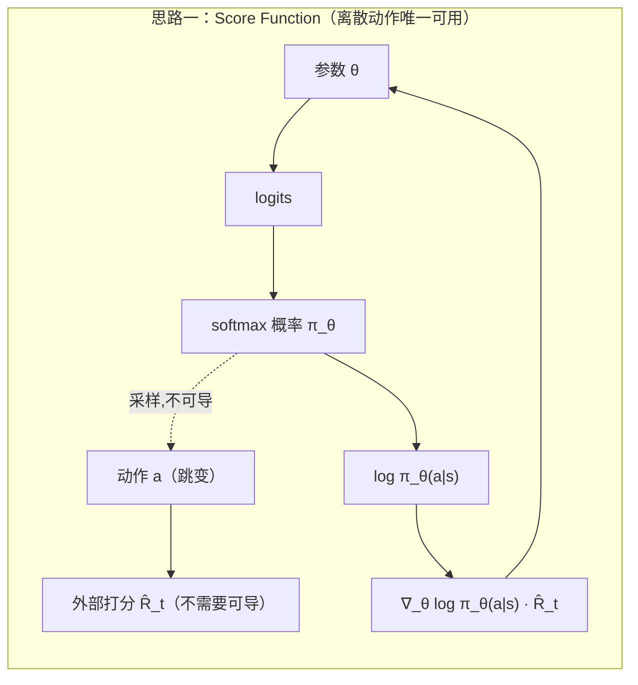
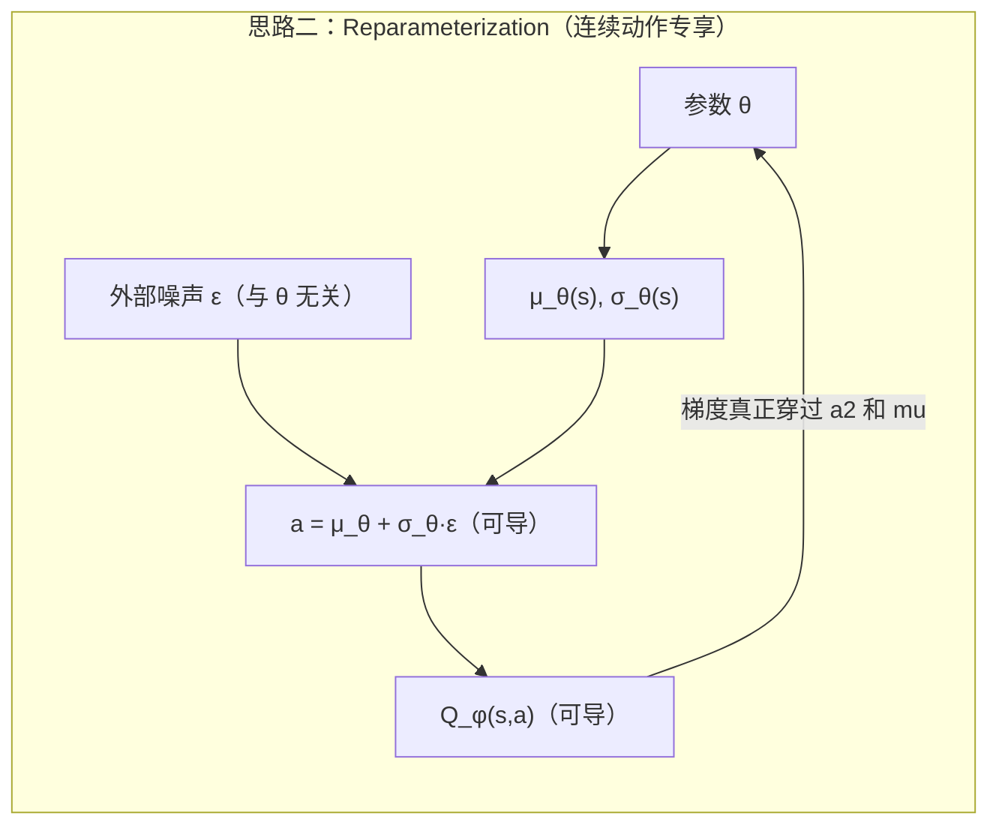

# 前置知识：连续动作与离散动作的梯度回传

> **一句话**：离散动作的采样是一个"跳变"的操作，梯度绕不过去，只能靠"打分再加权"（score function）间接估计；连续动作的采样可以被改写成"确定性函数 + 外部噪声"，梯度能真正穿过采样点、沿着数值计算图一路流回网络参数（reparameterization / pathwise gradient）。这一个区别决定了 SAC、DDPG 这类方法只能用在连续动作上，也决定了 PPO 处理离散和连续动作时公式看起来一样、但背后的可选路径数不一样。

**标签**: `#强化学习` `#策略梯度` `#重参数化` `#Gumbel-Softmax` `#连续动作` `#离散动作` `#计算图`

---

## 相关阅读

在阅读本文前，建议先了解：

- [策略梯度与 PPO](/前置知识/000a_前置知识_策略梯度与PPO) — score function 梯度（log-derivative trick）的完整推导来源，本文会直接复用第三节的结论
- [Q 函数与 Value 函数](/前置知识/000o_前置知识_Q函数与Value函数) — 本文反复用到 $Q(s,a)$ 这个"打分"的含义
- [SAC (Soft Actor-Critic)](/前置知识/000k_前置知识_SAC_Soft_Actor_Critic) — 重参数化梯度在实际算法里的完整应用案例
- [DDPG（确定性策略梯度）](/前置知识/000p_前置知识_DDPG_确定性策略梯度) — 另一个重参数化梯度的经典应用（确定性策略是重参数化的极端情形：噪声方差为 0）

读完本文后，可以继续阅读：

- [动作 Token 化与自回归策略](/前置知识/000l_前置知识_动作Token化与自回归策略) — VLA 里把连续动作离散化成 token 之后，训练方式为什么变成了交叉熵而不是 RL 的梯度回传
- [行为约束策略优化](/前置知识/001l_前置知识_行为约束策略优化) — 连续动作策略的表达能力（高斯 vs Flow）如何影响约束效果

---

## 贯穿全文的例子

> **场景**：一个机器人要决定"往哪个方向移动"。我们用两个版本讲同一个场景：
>
> - **离散版本**：机器人只能在"上、下、左、右"四个格子里选一个方向移动一步。
> - **连续版本**：机器人可以输出任意方向、任意步长的位移向量 $a=(\Delta x,\Delta y)\in\mathbb{R}^2$。
>
> 两个版本的任务完全一样（找到目标），唯一区别是动作空间的性质——这个区别会让"策略网络的梯度怎么传回去"这件事走上两条完全不同的路。

---

## 零、全文路线图

在动手推导之前，先把要走的路线摆出来：

$$
\underbrace{\text{什么叫"梯度能不能穿过一个操作"}}_{\text{第一步：原理}}
\;\to\;
\underbrace{\text{离散：只能打分（Score Function）}}_{\text{第二步：离散的解法}}
\;\to\;
\underbrace{\text{连续：可以让梯度穿过采样点（重参数化）}}_{\text{第三步：连续的解法}}
$$

$$
\to\;
\underbrace{\text{离散能不能"软化"成连续来蹭这条路？（Gumbel-Softmax）}}_{\text{第四步}}
\;\to\;
\underbrace{\text{代码：两条路径在 PyTorch 里长什么样}}_{\text{第五步：工程实操}}
\;\to\;
\underbrace{\text{实际算法都选了哪条路，为什么}}_{\text{第六步：应用}}
$$

---

## 一、基础原理阶段：梯度为什么会在"采样"这一步卡住

### 1.1 一个和 RL 无关的极简例子，先建立直觉

在进入策略梯度之前，先抛开"策略""动作""奖励"这些词，只看一个最裸的数学问题：

$$
y = f(x), \qquad x \sim p_\theta(x)
$$

这里 $x$ 是从一个由参数 $\theta$ 控制的分布里随机抽出来的一个数，$y$ 是某个确定性函数 $f$ 作用在 $x$ 上的结果。现在问一个问题：**如果我想知道"调整 $\theta$ 会让 $\mathbb{E}[y]$ 怎么变"，也就是要求 $\nabla_\theta \mathbb{E}_{x\sim p_\theta}[f(x)]$，能不能直接对着一次采样出来的 $x$ 反向传播？**

答案取决于**采样这一步本身是不是关于 $\theta$ 连续可导的**。这正是本文要讲的全部内容的起点，值得先花一点篇幅讲清楚"连续可导"在这里具体是什么意思。

### 1.1.1 先把 $\nabla_\theta \mathbb{E}_{x\sim p_\theta}[f(x)]$ 这个式子拆开讲清楚

在往下讲"能不能求导"之前，必须先确保这个式子本身的含义是透明的——它不是一个凭空冒出来的记号，而是"策略学习"这件事在数学上的唯一写法。

**为什么需要这个式子**：策略学习的目标从来不是"让某一次采样的结果变好"，而是"让**平均意义上**的结果变好"——因为策略本身是随机的，同一个 $\theta$、同一个状态下，每次采样出来的 $x$ 都可能不同（贯穿全文的例子里，同样的策略网络，这一次可能抽到"左"，下一次可能抽到"上"）。所以我们真正关心的量，是"如果反复用这个 $\theta$ 采样很多次，$f(x)$ 平均下来会是多少"，也就是 $\mathbb{E}_{x\sim p_\theta}[f(x)]$；而我们想知道的是"调整 $\theta$ 会让这个平均值往哪个方向变、变多快"，这就是对它再求一次梯度：$\nabla_\theta \mathbb{E}_{x\sim p_\theta}[f(x)]$。

> **一句话直觉**：这个式子在问"如果我把策略参数 $\theta$ 往某个方向拧一点点，长期跑下来平均得分会怎么变？往哪个方向拧能让平均得分变得更高？"

**逐项拆解**：

| 符号 | 数学含义 | 物理/几何直觉 | 在贯穿全文的例子中对应什么 |
|------|---------|--------------|--------------------------|
| $\theta$ | 策略网络的参数（所有权重、偏置） | "策略这个'黑箱'内部可以被调节的旋钮" | 输出四个方向 logits 的那个网络的权重 |
| $p_\theta(x)$ | 由 $\theta$ 决定的、$x$ 的概率分布 | "在当前旋钮设置下，各种结果出现的可能性" | 类别分布 $\pi_\theta(\text{上}),\pi_\theta(\text{下}),\pi_\theta(\text{左}),\pi_\theta(\text{右})$ |
| $x\sim p_\theta$ | 从这个分布里随机抽一个具体结果 | "策略实际做出的这一次选择" | 这一次实际抽到的方向，比如"左" |
| $f(x)$ | 给这个具体结果打分的函数，不要求可导 | "抽到这个结果，最终好不好" | 抽到"左"之后这条轨迹最终拿到的奖励 |
| $\mathbb{E}_{x\sim p_\theta}[f(x)]$ | 对 $x$ 按 $p_\theta$ 分布求 $f(x)$ 的加权平均 | "反复用同一个策略跑很多次，平均能拿多少分" | 用当前策略跑 1000 次，平均奖励是多少 |
| $\nabla_\theta(\cdot)$ | 对参数 $\theta$（一个向量）求梯度 | "这个平均分对每一个旋钮的敏感度，以及往哪边拧能让它变大" | 对网络每个权重求偏导，组成一个梯度向量 |
| 整体 $\nabla_\theta \mathbb{E}_{x\sim p_\theta}[f(x)]$ | 平均得分关于参数的梯度 | "该往哪个方向、多大力度调整策略，才能让平均表现变好" | 梯度上升更新网络权重的方向 |

**具体数值例子**：延续 1.3 节会用到的设定，假设当前网络输出的方向 logits 是 $z=(0.1,-0.3,0.9,0.2)$，对应四个方向的概率 $p_\theta=(\pi_\text{上},\pi_\text{下},\pi_\text{左},\pi_\text{右})\approx(0.20,0.13,0.44,0.24)$（softmax 计算过程见 2.2 节数值例子）。假设 $f(x)$ 就是"抽到这个方向后这条轨迹拿到的奖励"，且已知抽到"左"这条轨迹的奖励是 $+3$，抽到其他方向的轨迹奖励平均是 $0$。那么：

$$
\mathbb{E}_{x\sim p_\theta}[f(x)] \approx 0.44\times 3 + 0.20\times 0 + 0.13\times 0 + 0.24\times 0 = 1.32
$$

这就是"用当前策略反复跑很多次，平均能拿到 1.32 分的奖励"。$\nabla_\theta \mathbb{E}_{x\sim p_\theta}[f(x)]$ 要回答的问题就是：**如果我们把 $\theta$（也就是 logits 背后的网络权重）往某个方向调整一点点，这个 1.32 会不会变大，往哪个方向调能让它变大最快？** 直觉上答案应该是"提高 $\pi_\text{左}$、压低其他方向"，因为"左"是唯一带来正奖励的方向——但这只是直觉，具体"该往哪个方向调、调多少"必须靠这个梯度算出来，而这正是下面 1.2–1.4 节要解决的"能不能对采样这一步求导"的问题，以及第二、三节要给出的具体计算公式。

**为什么是这个形式（为什么不能简单地对 $f(x)$ 求梯度就完事）**：注意梯度符号 $\nabla_\theta$ 作用在**期望**上，而不是作用在某一次采样出来的 $f(x)$ 上。这不是随意的写法——因为 $\theta$ 真正影响的是"分布长什么样"（也就是各个方向被抽到的概率），而不是某一个具体抽样结果的取值本身（在离散例子里 $f(x)$ 甚至可能完全不显式依赖 $\theta$，比如"抽到左就给 3 分"这个打分规则本身和 $\theta$ 无关）。如果直接对某一次采样结果 $f(x)$ 求 $\theta$ 的导数，很多时候这个导数根本不存在或者毫无意义；只有把"求平均"这一步放在梯度外面，让梯度去衡量"整个分布的形状变化如何影响平均分"，这个问题才是良定义的。这也是为什么期望符号和梯度符号的**相对位置**（梯度在外面，期望在里面）在这个式子里至关重要，绝不能随意交换——2.2 节的 log-derivative trick，本质上就是在solve"怎么合法地把梯度符号挪到期望符号里面去"这个问题。

### 1.2 什么叫"一个操作对参数可导"

一个操作 $g_\theta$（这里就是"从分布 $p_\theta$ 里采样"这个操作）对参数 $\theta$ 可导，意味着：**当 $\theta$ 发生一个微小的变化 $\theta \to \theta+\delta$ 时，操作的输出也应该发生一个"成比例的、可预测的"微小变化**——存在一个函数（雅可比矩阵）能告诉你"输出具体变化了多少"。

反向传播（backprop）能够工作的前提，就是计算图里每一步操作都满足这个性质——链式法则本质上就是把每一步的"局部变化率"乘起来。**只要计算图里有一步操作不满足这个性质，梯度信号在这一步就会断掉，没法继续往前传。**

### 1.3 离散采样为什么天生"跳变"

回到贯穿全文的例子。离散版本里，策略网络输出四个方向的概率 $\pi_\theta(\text{上}),\pi_\theta(\text{下}),\pi_\theta(\text{左}),\pi_\theta(\text{右})$，然后从这个类别分布（Categorical distribution）里采样出一个具体方向。

想象把 $\theta$ 微调一点点，比如让 $\pi_\theta(\text{上})$ 从 $0.31$ 变成 $0.32$。**采样的结果会怎么变？** 答案是：**大概率什么都不变**——上一次抽到"左"，这一次很可能还是抽到"左"。只有在极少数"临界"的随机数上，才会从"抽到左"跳变成"抽到上"。也就是说，采样结果作为 $\theta$ 的函数,是一个**分段常数、到处不连续的阶梯函数**——绝大部分地方导数是 0，在有限几个点上导数不存在（无穷大的跳变）。这样的函数没法定义一个有意义的梯度，反向传播在这里必然断掉。

### 1.4 连续采样为什么可能不跳变

连续版本里，策略网络输出一个高斯分布的均值和标准差 $\mu_\theta(s),\sigma_\theta(s)$，动作 $a$ 从 $\mathcal{N}(\mu_\theta(s),\sigma_\theta(s)^2)$ 里采样。这里的关键区别是：**高斯分布的采样操作，存在一种写法，可以把它表达成"一个和 $\theta$ 无关的随机数，经过一个和 $\theta$ 有关但确定性的函数变换"**——这就是下面第三节要讲的重参数化。一旦能这样写，"调整 $\theta$ 会让采样结果怎么变"就变成了一个普通的、光滑的函数求导问题,不再有任何跳变。

### 1.5 两种绕开"卡点"的思路

计算机科学和统计学里，为了应对"梯度穿不过随机采样"这个通用难题，一共发展出两条思路，本文接下来分别用第二、三节详细讲：

| 思路 | 核心操作 | 对采样点做了什么 |
|------|---------|-----------------|
| **思路一：打分再加权**（Score Function / REINFORCE） | 对"抽到这个结果的概率的对数"求导，把 $f(x)$ 的值当作外部权重乘上去 | 完全绕开采样点本身，梯度只经过 $\log$ 概率密度 |
| **思路二：重参数化**（Reparameterization） | 把随机性搬到一个和 $\theta$ 无关的外部噪声上,让采样结果变成 $\theta$ 的确定性函数 | 梯度真正穿过采样点,一路传到 $f(x)$ 内部 |

**离散动作只有思路一能用**（1.3 节已经说明了原因）；**连续动作两条思路都能用**，但很多算法（SAC、DDPG）会特意选择思路二，因为方差更低。下面两节把这两条思路的公式、直觉、数值例子都过一遍。

---

## 二、概念阶段之一：思路一——Score Function 梯度（离散动作唯一可用的路）

### 2.1 离散采样到底哪一步不可导

整个计算图是这样的：

$$
\theta \;\xrightarrow{\text{可导}}\; z = \text{网络}(\theta) \;\xrightarrow{\text{可导}}\; p = \text{softmax}(z) \;\xrightarrow{\text{❌ 不可导}}\; x = \text{sample}(p) \;\to\; f(x)
$$

前两步没问题：$\theta$ 到 logits $z$ 是神经网络的前向传播，$z$ 到概率 $p$ 是 softmax——都是光滑函数，导数随便求。

**问题出在第三步：从概率分布 $p$ 里"抽一个样" $x$。** 这一步在数学上是一个 $\text{argmax}$ 式的分段函数。具体来说，离散采样的标准实现是：

$$
x = k \quad \text{当且仅当} \quad \sum_{i<k} p_i \le u < \sum_{i\le k} p_i, \qquad u\sim\text{Uniform}(0,1)
$$

**逐项拆解**：

| 符号 | 含义 | 直觉 |
|------|------|------|
| $p_i$ | 第 $i$ 个类别的概率（softmax 输出） | "第 $i$ 个方向被选中的可能性" |
| $u\sim\text{Uniform}(0,1)$ | 一个 $[0,1]$ 区间上均匀分布的随机数 | "转一次随机的轮盘" |
| $\sum_{i<k} p_i$ | 前 $k-1$ 个类别的概率累加 | "轮盘上从 0 到第 $k$ 个格子起点的位置" |
| $\sum_{i\le k} p_i$ | 前 $k$ 个类别的概率累加 | "轮盘上第 $k$ 个格子终点的位置" |
| $x=k$（当 $u$ 落在这个区间时） | 采样结果是类别 $k$ | "轮盘指针停在了第 $k$ 个格子里" |

**具体数值例子**：延续四方向的例子，设 $p=(\pi_\text{上},\pi_\text{下},\pi_\text{左},\pi_\text{右})=(0.20,0.13,0.44,0.23)$（按上下左右排序，$k=1,2,3,4$）。累积概率区间分别是：$[0,0.20)$ 对应"上"，$[0.20,0.33)$ 对应"下"，$[0.33,0.77)$ 对应"左"，$[0.77,1.0)$ 对应"右"。如果抽到 $u=0.5$，落在 $[0.33,0.77)$ 区间,采样结果 $x=\text{左}$。现在把 $\theta$ 微调,让 $\pi_\text{左}$ 从 $0.44$ 变成 $0.45$（区间变成 $[0.33,0.78)$）——同样的 $u=0.5$ 仍然落在这个区间里,$x$ 完全不变,导数为 0；但如果恰好抽到 $u=0.769$，微调前它落在"左"的区间 $[0.33,0.77)$ 之外一点点其实是在"右"的区间里（不在"左"），微调后区间扩大到 $[0.33,0.78)$，$u=0.769$ 就被划进了"左"——$x$ 从"右"跳变成了"左"，这就是"到处不连续"的具体体现：绝大多数 $u$ 对应的 $x$ 完全不随 $\theta$ 变化，只有卡在边界上的极少数 $u$ 会让 $x$ 发生跳变，而跳变发生的瞬间变化量是有限的、突然的,不是"渐变",所以在边界点导数不存在。

这就是一个关于 $p$（进而关于 $\theta$）的**阶梯函数**——输出是整数 $k$，当 $\theta$ 微调一点点使得 $p$ 微调一点点时，绝大多数情况下 $u$ 还是落在同一个区间里，$x$ 完全不变（导数为 0）；极偶尔 $u$ 恰好在边界上，$x$ 从 $k$ 跳到 $k+1$（不连续，导数不存在）。

**阶梯函数没有有意义的导数，链式法则在这里断掉。**

### 2.2 为什么连续动作不存在这个问题

连续动作的采样是 $a = \mu_\theta(s) + \sigma_\theta(s)\cdot\epsilon$，$\epsilon\sim\mathcal{N}(0,1)$。

关键区别：一旦 $\epsilon$ 固定，$a$ 对 $\mu_\theta$ 的导数就是 $1$，对 $\sigma_\theta$ 的导数就是 $\epsilon$——都是良定义的实数。**因为连续动作的值域是 $\mathbb{R}$，$\theta$ 微调一点，$a$ 也跟着微调一点——没有跳变，处处可导。**

离散动作做不到这件事，因为输出空间就那几个整数（上/下/左/右），不存在"微调一点点"的余地。你没法写出一个 $x = g(\theta, \epsilon)$ 使得 $x$ 关于 $\theta$ 连续——输出空间本身是离散的，任何从连续到离散的映射必然含有阶跃。

### 2.3 Score Function 梯度怎么绕过这个问题

既然"对采样结果 $x$ 关于 $\theta$ 求导"行不通，Score Function 梯度换了一个完全不同的切入点：**不对 $x$ 本身求导，而是对"$x$ 出现的概率"求导。**

数学上就是一个恒等变换（log-derivative trick）：

$$
\nabla_\theta \mathbb{E}_{x\sim p_\theta}[f(x)] = \mathbb{E}_{x\sim p_\theta}\big[f(x)\cdot\nabla_\theta\log p_\theta(x)\big]
$$

（推导见 [策略梯度与 PPO 第 3.2 节](/前置知识/000a_前置知识_策略梯度与PPO#3.2-破局的关键-log-derivative-trick-对数导数技巧)。）

**这个公式解决问题的关键在于**：等号右边需要求导的对象变成了 $\log p_\theta(x)$——这是 softmax 概率取对数，它关于 $\theta$ 是光滑可导的（softmax 和 log 都是光滑函数的复合）。$f(x)$ 只需要代入一个数值，完全不需要可导。**采样操作 $x\sim p_\theta$ 依然存在，但它只被用来"决定代入哪个 $x$ 做这次计算"，梯度不流经采样本身。**

换句话说：

- **原来的困境**：想求 $\frac{\partial x}{\partial \theta}$，但 $x$ 对 $\theta$ 是阶梯函数 → 求不了
- **Score Function 的思路**：绕过 $x$，改求 $\frac{\partial \log p_\theta(x)}{\partial \theta}$，这个是光滑的 → 求得了

右边的 $f(x)$ 充当权重：如果这次采到的 $x$ 得分高（$f(x)$ 大），就加大力度往"让 $p_\theta(x)$ 变大"的方向更新；得分低就反方向更新。

> **一句话总结**：采样本身不可导，但"采到某个结果的概率"是可导的——Score Function 梯度就是把优化目标从前者转换到后者。

### 2.4 公式的逐项含义

$$
\nabla_\theta \mathbb{E}_{x\sim p_\theta}[f(x)] = \mathbb{E}_{x\sim p_\theta}\big[\underbrace{f(x)}_{\text{得分（标量）}}\cdot\underbrace{\nabla_\theta\log p_\theta(x)}_{\text{让 }x\text{ 概率变大的方向（向量）}}\big]
$$

| 符号 | 是什么 | 需要可导吗 |
|------|--------|-----------|
| $f(x)$ | 采到 $x$ 后的最终回报（环境给的分数） | ❌ 不需要，只要能算出数值 |
| $p_\theta(x)$ | 在当前 $\theta$ 下选中 $x$ 的概率（softmax 输出） | ✅ 对 $\theta$ 可导 |
| $\nabla_\theta\log p_\theta(x)$ | "怎么调 $\theta$ 能让 $p_\theta(x)$ 变大"的方向 | — 这就是我们要算的梯度 |
| $\mathbb{E}_{x\sim p_\theta}[\cdot]$ | 对采样分布求平均，实际用 mini-batch 近似 | — |

实际训练时：采 $N$ 条轨迹，每条轨迹的每一步都算一个 $f(x_i)\cdot\nabla_\theta\log p_\theta(x_i)$，取平均作为梯度估计。

### 2.5 具体数值例子

策略网络输出 logits $z=(0.1,-0.3,0.9,0.2)$，softmax 后概率为 $(\pi_\text{上},\pi_\text{下},\pi_\text{左},\pi_\text{右})\approx(0.20, 0.13, 0.44, 0.22)$。

这一步采到了"左"，轨迹总回报 $\hat R_t = 8$。

**算 $\nabla_z\log\pi_\theta(\text{左})$**（softmax 对数概率对 logits 的标准公式：对采到的类别梯度为 $1-\pi_k$，对其他类别梯度为 $-\pi_j$）：

$$
\frac{\partial\log\pi_\theta(\text{左})}{\partial z_\text{左}} = 1-0.44=0.56,\quad \frac{\partial\log\pi_\theta(\text{左})}{\partial z_\text{上}} = -0.20,\quad \frac{\partial\log\pi_\theta(\text{左})}{\partial z_\text{下}} = -0.13,\quad \frac{\partial\log\pi_\theta(\text{左})}{\partial z_\text{右}} = -0.22
$$

乘以 $\hat R_t=8$：

$$
\nabla_z J = (−1.60,\;−1.07,\;+4.44,\;−1.77)
$$

梯度上升后："左"的 logit 被推高，其他被压低 → 以后更倾向于选"左"。如果 $\hat R_t$ 是负数，方向反过来——"左"会被抑制。

**整个过程里，梯度只流经了 $\log\pi_\theta(\text{左})$ 这个光滑函数，从未碰过"掷骰子"那一步。**

---

## 三、概念阶段之二：思路二——重参数化梯度（连续动作专享的捷径）

### 3.1 把随机性搬到外面去

高斯分布的采样，可以等价地写成：

$$
a = \mu_\theta(s) + \sigma_\theta(s)\cdot\epsilon, \qquad \epsilon\sim\mathcal{N}(0,1)
$$

**为什么需要这个公式**：直接写"$a\sim\mathcal{N}(\mu_\theta(s),\sigma_\theta(s)^2)$"这个采样操作本身不可导（原因见 1.2 节的一般性讨论），但上面这个等价写法把"抽随机数"这件事**完全转移**到了一个和 $\theta$ 毫无关系的标准正态噪声 $\epsilon$ 上——一旦 $\epsilon$ 被抽出来固定住，$a$ 就变成了 $\theta$ 的一个普通、光滑、处处可导的函数（一次线性变换）。

> **一句话直觉**：把"到底抽到哪个数"这个随机性,提前"外包"给一个和网络毫无关系的骰子（标准正态噪声），网络自己只负责"把这个骰子结果搬到哪个位置、缩放多大"——这个"搬和缩放"的过程是光滑的,可以求导。

**逐项拆解**：

| 符号 | 数学含义 | 直觉 | 在连续例子中对应什么 |
|------|---------|------|-------------------|
| $\mu_\theta(s)$ | 网络输出的分布均值 | "平均会往哪个方向走" | 位移向量的均值,比如 $(0.5,-0.2)$ |
| $\sigma_\theta(s)$ | 网络输出的分布标准差 | "这个方向有多大的随机探索空间" | 每个维度上的探索幅度 |
| $\epsilon\sim\mathcal{N}(0,1)$ | 和 $\theta$ 完全独立的标准正态噪声 | "外部骰子,一旦抽出来就是个普通数字" | 采样这一步唯一的随机性来源 |
| $a=\mu_\theta+\sigma_\theta\cdot\epsilon$ | 确定性的线性组合 | "把骰子结果，按网络指定的位置和幅度搬过去" | 最终执行的位移动作 |

**具体数值例子**：$\mu_\theta(s)=0.5$，$\sigma_\theta(s)=0.2$（简化成 1 维），采样噪声固定为 $\epsilon=1.0$。

$$
a = 0.5+0.2\times1.0=0.7
$$

假设有一个可微的 Critic 网络 $Q_\phi(s,a)$，在 $a=0.7$ 处已经算出局部梯度 $\dfrac{\partial Q_\phi}{\partial a}=3.0$（这是 Critic 网络内部普通的反向传播结果，$Q_\phi$ 是个正常的神经网络，处处可导）。**关键的一步**——因为 $a$ 是 $\mu_\theta,\sigma_\theta$ 的光滑函数，可以直接用链式法则把梯度"穿过" $a$ 这个采样点：

$$
\frac{\partial Q_\phi(s,a)}{\partial\mu_\theta} = \frac{\partial Q_\phi}{\partial a}\cdot\frac{\partial a}{\partial\mu_\theta} = 3.0\times1=3.0,\qquad \frac{\partial Q_\phi(s,a)}{\partial\sigma_\theta} = \frac{\partial Q_\phi}{\partial a}\cdot\frac{\partial a}{\partial\sigma_\theta} = 3.0\times\epsilon=3.0\times1.0=3.0
$$

再往下，$\mu_\theta,\sigma_\theta$ 本身是网络对权重 $\theta$ 的函数，继续用标准反向传播就能算出 $\partial Q_\phi/\partial\theta$。**这条链路和第二节的根本区别在这里**：梯度从 $Q_\phi$ 内部，经过 $a$，经过 $\mu_\theta,\sigma_\theta$，一路传回网络权重——**采样点 $a$ 不再是梯度传播的终点，而是链路中间的一个普通节点**。

**为什么是这个形式（为什么加法+乘法这种具体形式）**：这个写法能成立的本质原因是高斯分布具有"位置-尺度族"（location-scale family）的性质——任意一个高斯随机变量,都可以写成"标准正态变量经过线性变换"。并不是所有分布都有这种性质（这正是离散类别分布做不到的原因），这也是为什么重参数化不是一个通用工具，而是"看分布的具体形式,能不能找到一个合适的确定性变换"。

### 3.2 两条路径梯度流向的直观对比





第一张图里，梯度从 $\log\pi_\theta$ 直接跳回 $\theta$，中间那个"采样出的动作"是一个虚线（不可导）分支，$R̂_t$ 只是从外部乘进来的一个数。第二张图里，梯度从 Critic $Q_\phi$ 出发，一路经过实线（可导）箭头，穿过采样出的动作 $a$，再穿过 $\mu_\theta,\sigma_\theta$，最终回到 $\theta$——**这条路径在离散动作图里根本不存在，因为离散版本里从"采样"到"动作"这一段是断的。**

---

## 四、离散动作能不能"蹭"重参数化这条路？——Gumbel-Softmax

### 4.1 动机：如果硬要让离散采样也可导怎么办

3.1 节说高斯分布能重参数化,是因为它是"位置-尺度族"。类别分布（Categorical）没有这种性质，但有没有办法**近似地**造出一个类似的"确定性函数 + 外部噪声"写法？答案是有，代价是引入近似误差——这就是 Gumbel-Softmax（也叫 Concrete distribution）。

### 4.2 Gumbel-Softmax 公式

$$
y_i = \frac{\exp\big((\log\pi_i + g_i)/\tau\big)}{\sum_{j=1}^K \exp\big((\log\pi_j+g_j)/\tau\big)}, \qquad g_i = -\log(-\log u_i),\; u_i\sim\text{Uniform}(0,1)
$$

**为什么需要这个公式**：我们想要一个"看起来像离散采样,但整个过程对 $\pi$（从而对 $\theta$）可导"的东西。直接采样类别分布不可导（1.3 节），这个公式用一种数学技巧，把类别采样的随机性也搬到了一个和 $\theta$ 无关的外部噪声（Gumbel 噪声 $g_i$）上，输出一个"软化"的、接近某个顶点的概率向量 $y$，而不是一个硬邦邦的 one-hot 向量。

> **一句话直觉**：不再"硬选"一个类别，而是给每个类别加一点随机扰动之后做 softmax，输出一个"几乎是 one-hot，但留了一点点软过渡"的向量——这个软化过程处处可导。

**逐项拆解**：

| 符号 | 数学含义 | 物理/几何直觉 | 在离散例子中对应什么 |
|------|---------|--------------|-------------------|
| $\pi_i$ | 第 $i$ 类的原始概率（softmax 输出） | "网络本来认为这个方向有多大可能" | $\pi_\theta(\text{左})=0.4449$ 等 |
| $u_i\sim\text{Uniform}(0,1)$ | 独立均匀噪声,和 $\theta$ 无关 | "外部骰子" | 每个方向各摇一次骰子 |
| $g_i=-\log(-\log u_i)$ | Gumbel 分布噪声（由均匀噪声变换得到） | "给每个类别加的随机扰动量,重尾分布,偶尔会给某一类很大的加成" | 让"左"这一次意外获得很大加成,变成赢家 |
| $\tau$ | 温度系数 | 越小,输出越接近硬 one-hot；越大,输出越"平滑模糊" | $\tau\to0$ 时退化为真正的类别采样(但此时梯度会消失/爆炸) |
| $y_i$ | 第 $i$ 类的"软化"输出 | 一个接近某个顶点、但依然是连续向量的近似 one-hot | 比如 $(0.02,0.01,0.93,0.04)$——"几乎选了左,但不是纯粹的 1" |

**具体数值例子**：延续离散例子的 $\pi=(0.2000,0.1340,0.4449,0.2211)$（对应上下左右），设 $\tau=0.5$，假设抽到的均匀噪声算出的 Gumbel 噪声是 $g=(0.10,-0.30,0.50,-0.05)$：

$$
\log\pi + g = (\log0.2+0.10,\;\log0.134-0.30,\;\log0.4449+0.50,\;\log0.2211-0.05)
$$
$$
= (-1.609+0.10,\;-2.010-0.30,\;-0.810+0.50,\;-1.510-0.05) = (-1.509,-2.310,-0.310,-1.560)
$$

除以 $\tau=0.5$：$(-3.018,-4.620,-0.620,-3.120)$。做 softmax：

$$
y \approx (0.043,0.008,0.878,0.039)\times\frac{1}{\sum}\approx(0.045,0.008,0.909,0.038)
$$

结果 $y\approx(0.045,0.008,0.909,0.038)$——"左"这个维度的值最接近 1，其他维度接近 0,但**没有一个维度是精确的 0 或 1**。这个向量整体是关于 $\theta$（体现在 $\pi_i$ 里）连续可导的,可以直接反向传播,而不需要像 score function 那样"止步于 log 概率"。

**为什么是这个形式（为什么用 Gumbel 噪声而不是别的噪声）**：这不是任意选择——可以证明,"$\arg\max_i(\log\pi_i+g_i)$，其中 $g_i$ 是独立 Gumbel 噪声"，得到的类别恰好精确服从原始的类别分布 $\pi$（这是 Gumbel-max trick 的经典结果）。Gumbel-Softmax 做的事情是：**把这个本来不可导的 $\arg\max$（硬选择）换成可导的 softmax（软选择）**，$\tau\to0$ 时两者趋于一致,但代价是 $\tau$ 越小梯度方差越大（越接近硬选择,越接近离散采样,梯度信号也越不稳定）,$\tau$ 越大近似误差越大（选出来的东西越"糊"，不再是真正意义上的某一类）。这是一个典型的偏差-方差权衡，需要手动调 $\tau$（常见做法是训练过程中让 $\tau$ 逐渐从大变小，退火）。

### 4.3 Gumbel-Softmax 的代价：它不是"免费的午餐"

需要特别强调：Gumbel-Softmax **不是**真正意义上"离散动作也能重参数化"，而是**用一个连续松弛版本去近似离散采样**，本质上训练的是一个"软"分布，而实际执行时（比如机器人真的要执行一个离散动作）通常还要在推理阶段做一次 $\arg\max$ 把软向量硬化回真正的离散动作——这一步硬化操作本身依然不可导，只是训练阶段可以绕开它。这也是为什么大多数标准 RL 算法（PPO 处理 Atari 的离散动作、GRPO/PPO 处理 LLM 的 token 采样）**并不使用** Gumbel-Softmax，而是直接用第二节的 score function 梯度——score function 梯度是精确无偏的，Gumbel-Softmax 是有偏近似，多了一个温度超参数要调，工程上反而更麻烦。Gumbel-Softmax 更多用在需要端到端可导的场景，比如离散结构的架构搜索、VQ-VAE 的一种可选训练方式。

---

## 五、工程实操阶段：两条路径在代码里分别长什么样

### 5.1 离散动作：score function 梯度的代码实现

下面这段代码的核心思路是：用 PyTorch 的 `Categorical` 分布采样一个动作，`log_prob(action)` 计算出该动作的 log 概率，之后把这个 log 概率乘上外部计算好的 reward-to-go（这个乘数不需要可导，也不会被反向传播穿过），求和后对整个表达式调用 `.backward()`——梯度只会流经 `log_prob`，不会流经"采样"这一步本身。

```python
import torch
import torch.nn as nn
from torch.distributions import Categorical

policy_net = nn.Linear(state_dim, 4)  # 输出 4 个方向的 logits

logits = policy_net(state)                  # 关于 theta 可导
dist = Categorical(logits=logits)
action = dist.sample()                       # 采样：这一步不可导，梯度到此为止
log_prob = dist.log_prob(action)             # log π_θ(a|s)，关于 theta 可导

# R_hat 是外部算好的 reward-to-go，是一个不需要梯度的标量（用 .detach() 显式断开）
loss = -(log_prob * R_hat.detach()).mean()   # 负号：梯度上升变成梯度下降
loss.backward()                              # 梯度只流经 log_prob，不流经 action 本身
optimizer.step()
```

值得注意的一行是 `R_hat.detach()`——即使 $\hat R_t$ 是由某个可导的过程（比如一个 Value 网络）算出来的,在算策略梯度这一步时也要显式切断它的梯度,因为按 2.2 节的公式，$\hat R_t$（或者更一般的 Advantage）在策略梯度这一项里**只应该充当外部权重**,不应该被当成"通过采样动作影响了 loss"的一部分被继续反传——这是实践中一个常见的 bug 来源：如果忘记 `detach`，PyTorch 会尝试把梯度也传回产生 $\hat R_t$ 的那个网络，这通常不是你想要的效果（Value 网络有自己独立的回归 loss）。

### 5.2 连续动作：重参数化梯度的代码实现

离散版本里 `dist.sample()` 这个操作切断了梯度；连续版本要用 `rsample()`（reparameterized sample）而不是 `sample()`——这一个函数名的区别，就是 3.1 节讲的"把随机性搬到外部噪声"在代码层面的具体体现。

```python
import torch
import torch.nn as nn
from torch.distributions import Normal

actor_net = nn.Linear(state_dim, action_dim * 2)  # 输出 mu 和 log_sigma

mu, log_sigma = actor_net(state).chunk(2, dim=-1)
sigma = log_sigma.exp()

dist = Normal(mu, sigma)
action = dist.rsample()          # 等价于 mu + sigma * eps，eps 在内部自动采样且不带梯度
# 这里 action 关于 mu, sigma（从而关于 theta）是可导的！

q_value = critic_net(state, action)   # Critic 网络，正常前向
actor_loss = -q_value.mean()          # 目标：让 Q 值越大越好

actor_loss.backward()                 # 梯度从 q_value 一路穿过 action，传回 mu, sigma，再传回 theta
```

对比两段代码最本质的差异只在一行：离散版本调用 `dist.sample()` 之后,梯度图在这里断开（`sample()` 内部用的是不可导的类别采样，PyTorch 会自动把这个节点标记为不需要梯度）；连续版本调用 `dist.rsample()`，PyTorch 在背后自动做的正是 3.1 节的数学变换 $a=\mu+\sigma\cdot\epsilon$，所以 `action` 这个张量本身携带着通向 `mu, sigma` 的计算图，`critic_net(state, action)` 算出的 `q_value` 反向传播时能一路穿透 `action` 传回 `actor_net` 的参数。

### 5.3 Gumbel-Softmax 的代码实现

如果确实需要让离散选择也参与端到端可导的计算图（比如离散动作要输入到另一个可导的下游模块），PyTorch 直接提供了现成接口，核心思路和 4.2 节公式完全一致——采样 Gumbel 噪声、加到 logits 上、做带温度的 softmax：

```python
import torch.nn.functional as F

logits = policy_net(state)
# tau 是温度；hard=False 时返回软向量（可导）；hard=True 时前向输出硬 one-hot，
# 但反向传播时用软向量的梯度近似（straight-through 技巧）
soft_action = F.gumbel_softmax(logits, tau=0.5, hard=False)
```

`hard=True` 用到了一个额外的小技巧——straight-through estimator：前向计算时用 `argmax` 得到真正的硬 one-hot（保证下游模块看到的是"正经的"离散选择），但反向传播时假装这一步是恒等函数，直接把梯度传给软向量。这是一个人为设计的近似,不是精确梯度,但在很多需要"离散决策 + 端到端训练"的场景里效果足够好。

---

## 六、应用场景阶段：实际算法都选了哪条路，为什么

### 6.1 PPO：离散和连续都用 score function，只是换一个分布

[PPO](/前置知识/000a_前置知识_策略梯度与PPO) 处理 Atari 这类离散动作游戏，或者 LLM RLHF 里 token 级别的离散采样，用的是 `Categorical` 分布 + score function 梯度（本文第二节）；处理机器人力矩这类连续动作，用的是 `Normal` 分布 + score function 梯度——**注意，PPO 处理连续动作时依然是走 score function 这条路，不是重参数化**，因为 PPO 的更新公式（clip 机制）本身要求"新旧策略的概率比值" $r_t(\theta)=\pi_\theta(a_t|s_t)/\pi_{\theta_{\text{old}}}(a_t|s_t)$，这个比值只依赖 log 概率密度，天然就是 score function 框架下的量，没有必要（也没有自然的方式）引入重参数化。这解释了为什么"连续动作能重参数化"这件事,不代表"所有处理连续动作的算法都必须用重参数化"。

### 6.2 SAC / DDPG / TD3：坚持用重参数化，为的是更低方差

[SAC](/前置知识/000k_前置知识_SAC_Soft_Actor_Critic) 和 [DDPG](/前置知识/000p_前置知识_DDPG_确定性策略梯度) 都是显式利用了"Critic 关于动作可导"这个性质，走第三节的重参数化路径——这不是随意选择，而是因为这条路径的梯度方差显著更低：score function 梯度里，$f(x)$（或 $\hat R_t$、$Q$）只是一个外部乘数，梯度估计的质量完全依赖"采样足够多的轨迹让这个乘数的方差被平均掉"；而重参数化梯度直接利用了 $Q_\phi$ 内部关于动作的解析梯度信息（$\partial Q_\phi/\partial a$），这是一个"确定性的、精确的"局部信息，不需要靠大量采样去平均噪声。这也是为什么 SAC、DDPG 这类 off-policy 方法能在 replay buffer 上做 "off-policy + 低方差梯度" 的组合，样本效率远高于纯 on-policy 的 score function 方法。DDPG 是重参数化的一个极端特例：它的策略是确定性的（$\sigma=0$），$a=\mu_\theta(s)$，等价于重参数化公式里噪声项直接消失。

### 6.3 VLA 的自回归离散 token：训练目标根本不是 RL 梯度，是交叉熵

[动作 Token 化与自回归策略](/前置知识/000l_前置知识_动作Token化与自回归策略) 里讲到，很多 VLA 模型把连续动作离散化成 token，用类似语言模型的自回归方式逐个 token 生成。**这里有一个容易搞混的地方**：如果只是做行为克隆（BC）训练（数据里有"正确"的动作 token 序列），根本不需要走本文讨论的任何一条路径——直接用交叉熵损失 $-\log\pi_\theta(a_t|s_t)$ 就行，这是纯粹的监督学习，不涉及"reward 加权"或者"Critic 梯度穿透"的问题。**只有在用 RL 微调这类自回归离散策略时**（比如 GRPO、PPO 微调 LLM/VLA），才会用到本文第二节的 score function 梯度，因为 token 采样是离散的，没有重参数化的选项。这解释了为什么 RLHF、GRPO 类工作反复出现"log 概率"这个量,而 Diffusion Policy、Flow Matching 这类连续动作生成模型做 RL 微调时,反而有机会（但不是必须）尝试第三节的重参数化路径（详见 [为什么扩散策略难以 RL 微调](/前置知识/000f_前置知识_为什么扩散策略难以RL微调) 里对这两条路径在扩散模型场景下各自遇到的具体困难）。

### 6.4 常见错误示范：不要试图对离散采样"强行"反传

一个初学者常犯的错误是：写出 `action = dist.sample()` 之后，误以为只要模型是用 PyTorch 写的、`action` 张量看起来"参与了后续计算"，梯度就一定能传回去。实际上 PyTorch 的 `Categorical.sample()` 在内部实现上会明确地不记录梯度（等价于对采样结果做了 `.detach()`），如果直接把 `action` 送进下游可导模块然后 `.backward()`，得到的只是下游模块自己参数的梯度，`policy_net` 的参数梯度永远是 `None` 或 0——因为计算图在采样这一步已经断开了。想让离散选择的梯度传回策略网络，必须显式走 score function（`log_prob` 乘权重）或者显式引入 Gumbel-Softmax 的软化近似，没有第三种绕过方式。

---

## 七、总结对比表

| 维度 | 离散动作 | 连续动作 |
|------|---------|---------|
| 采样操作本身是否可导 | 否，天生跳变（1.3 节） | 否，但可以等价改写成可导形式（1.4、3.1 节） |
| 可用梯度路径 | 只能 Score Function | Score Function 或 Reparameterization |
| 梯度是否穿过采样出的动作 | 否，止步于 $\log\pi_\theta(a\|s)$ | Score Function：否；Reparameterization：**是** |
| $f(x)$ / $Q$ 是否需要可导 | 不需要 | Score Function：不需要；Reparameterization：需要 |
| 方差 | 较高 | Reparameterization 显著更低 |
| 有没有"软化"技巧硬蹭连续那条路 | 有，Gumbel-Softmax（有偏近似，需调温度） | 不需要，天生可以精确重参数化 |
| PyTorch 关键 API | `Categorical.sample()` + `.log_prob()` | `Normal.rsample()` |
| 典型算法 | DQN（值函数路线）、PPO/GRPO 处理离散动作或 LLM token | SAC、DDPG、TD3（重参数化）；PPO/TRPO 处理连续动作时也常用 Score Function |

一句话记住区别：**离散动作的梯度是"打分再加权"，reward 只是乘进去的外部标量，从未真正流经采样这一步；连续动作在用重参数化时，梯度是沿着数值计算图真实流动，从 Critic 内部一路反传，穿过采样出的动作，最终到策略网络参数**。

---

## 延伸阅读

- [策略梯度与 PPO](/前置知识/000a_前置知识_策略梯度与PPO) — Score Function 梯度（log-derivative trick）的完整数学推导
- [SAC (Soft Actor-Critic)](/前置知识/000k_前置知识_SAC_Soft_Actor_Critic) — 重参数化梯度在完整 Actor-Critic 算法里的应用
- [DDPG（确定性策略梯度）](/前置知识/000p_前置知识_DDPG_确定性策略梯度) — 重参数化的极端特例：噪声方差为 0 的确定性策略
- [Q 函数与 Value 函数](/前置知识/000o_前置知识_Q函数与Value函数) — 本文反复用到的"打分"概念的数学基础
- [动作 Token 化与自回归策略](/前置知识/000l_前置知识_动作Token化与自回归策略) — 离散动作 token 化在 VLA 场景下的具体应用
- [为什么扩散策略难以 RL 微调](/前置知识/000f_前置知识_为什么扩散策略难以RL微调) — 连续动作策略在真实 RL 微调场景中遇到的进一步困难
- Williams, R. J., "Simple statistical gradient-following algorithms for connectionist reinforcement learning" (REINFORCE 原始论文), 1992
- Kingma, D. P. & Welling, M., "Auto-Encoding Variational Bayes"（重参数化技巧的原始来源）, arXiv:1312.6114, 2013
- Jang, E., Gu, S., Poole, B., "Categorical Reparameterization with Gumbel-Softmax", arXiv:1611.01144, 2016
