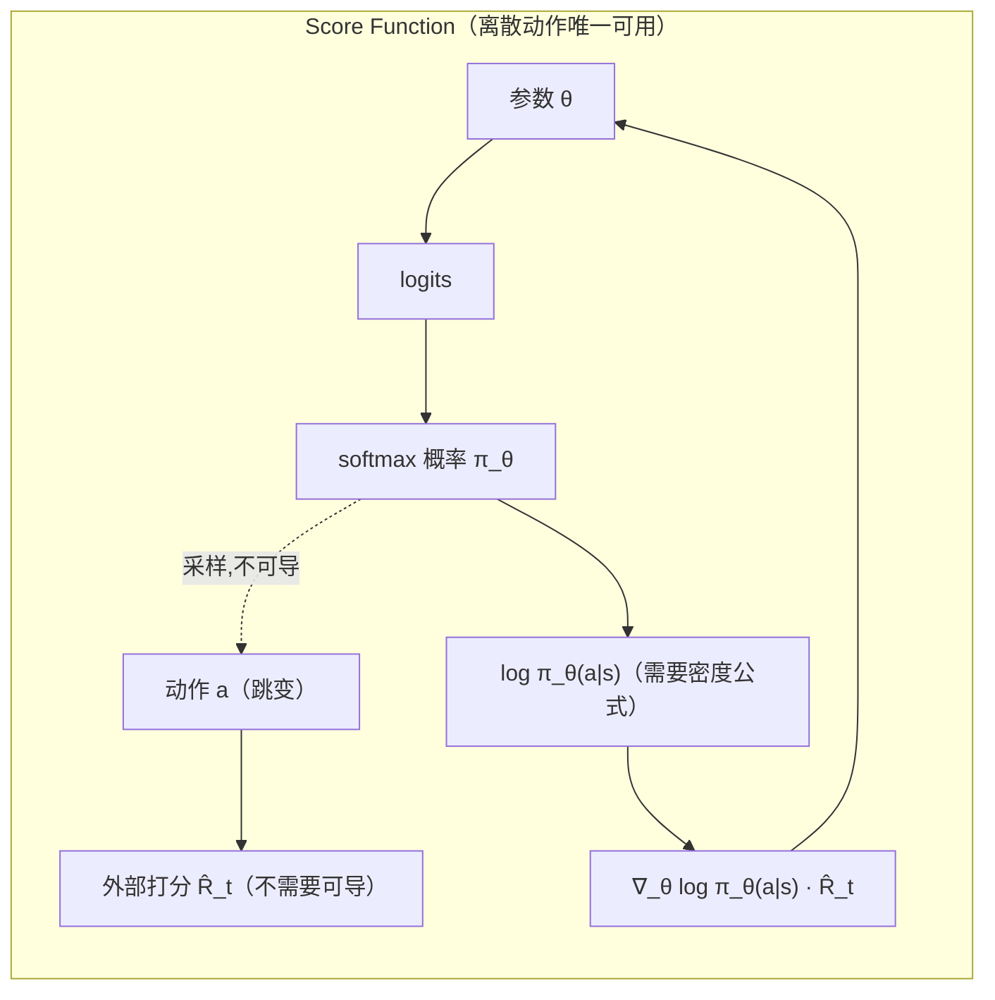
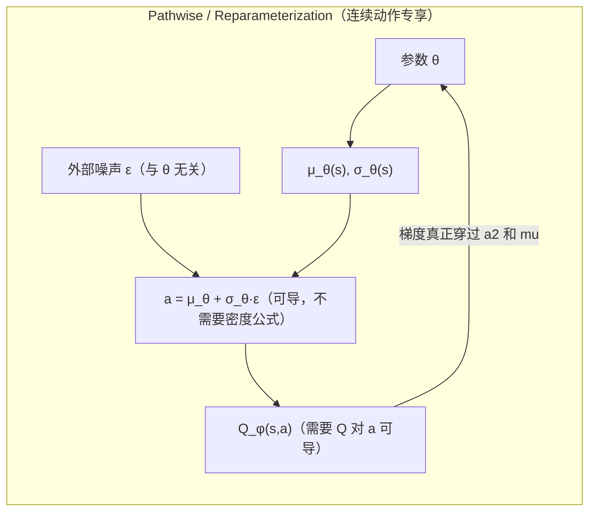

# 前置知识：连续动作与离散动作的梯度回传

> **一句话**：这篇文章讲的是**梯度回传**——给定一次随机采样 $x\sim p_\theta(x)$，怎么把"结果好不好"的信号传回参数 $\theta$。绕开这个问题一共有两条路：**Score Function**（对"采到 $x$ 的概率密度"求导，密度是这条路的入场费）和 **Pathwise / 重参数化**（把采样改写成对 $\theta$ 可导的确定性函数，压根不需要写出密度公式）。离散动作只能走第一条路，连续动作两条都能走——这不是因为"密度谁更好算"（softmax 密度和高斯密度都很好算），而是因为只有连续动作的采样操作能被改写成"对 $\theta$ 可导的函数"。

**标签**: `#强化学习` `#策略梯度` `#重参数化` `#Gumbel-Softmax` `#连续动作` `#离散动作` `#计算图`

---

## 相关阅读

在阅读本文前，建议先了解：

- [策略梯度与 PPO](/前置知识/000a_前置知识_策略梯度与PPO) — Score Function 梯度（log-derivative trick）的完整推导来源，本文直接复用其结论
- [Q 函数与 Value 函数](/前置知识/000o_前置知识_Q函数与Value函数) — 本文反复用到 $Q(s,a)$ 这个"打分"的含义
- [概率密度函数与高斯分布](/前置知识/002b_前置知识_概率密度函数与高斯分布) — 高斯密度的定义和 log-prob 公式，本文直接使用

读完本文后，可以继续阅读：

- [重参数化技巧](/前置知识/002e_前置知识_重参数化技巧) — 对本文第三节 pathwise 梯度的更系统的展开（位置-尺度族分布的一般形式、多维情形、VAE 应用）
- [Score Function（密度梯度）与 Score Matching](/前置知识/001t_前置知识_Score_Function密度梯度与Score_Matching) — 注意这是**另一个**同名概念（对数据 $x$ 求梯度，不是对参数 $\theta$），别混淆
- [SAC (Soft Actor-Critic)](/前置知识/000k_前置知识_SAC_Soft_Actor_Critic) / [DDPG（确定性策略梯度）](/前置知识/000p_前置知识_DDPG_确定性策略梯度) — Pathwise 梯度在实际算法里的应用
- [为什么扩散策略难以 RL 微调](/前置知识/000f_前置知识_为什么扩散策略难以RL微调) — 一个**表面相似但本质不同**的问题：多步生成模型的密度为什么"算不出数"（见本文第六节的辨析）

---

## 零、这篇文章到底想解决什么问题

在往下读之前，先把"梯度回传"和"概率密度"这两个词的关系摆清楚，因为它们经常被混在一起讲，反而让人抓不住重点。

**本文的主题是梯度回传，不是概率密度本身。** 具体问题是：策略网络输出一个分布 $p_\theta$，从这个分布里采样出一个动作 $x$，环境反馈一个分数 $f(x)$。现在想更新 $\theta$ 让平均分数 $\mathbb{E}[f(x)]$ 变大——**梯度怎么从 $f(x)$ 传回 $\theta$？** 采样这个操作本身没有一个天然的"导数"（因为它是随机的），所以这条路必须绕行，而目前已知的绕行方式只有两条：

| | Score Function | Pathwise（重参数化） |
|---|---|---|
| **绕行的手段** | 对"采到 $x$ 的概率密度的对数"求导 | 把采样写成对 $\theta$ 可导的确定性函数 |
| **需要写出密度公式吗** | **需要**，$\log p_\theta(x)$ 必须能算出来且对 $\theta$ 可导 | **不需要**，只需要采样映射本身可导 |
| **需要 $f$ 可导吗** | 不需要，$f(x)$ 只是外部乘进来的数值权重 | 需要，梯度要穿过 $f$ 一路传回 $x$ |
| **离散动作能用吗** | 能（softmax 密度显式、可导） | **不能**（下面会证明采样映射本身是跳变的） |
| **连续动作（高斯）能用吗** | 能 | 能 |

**这张表就是全文的骨架**：密度只是 Score Function 这一条路的"原材料"，Pathwise 这条路根本用不到密度公式。离散动作被挡在 Pathwise 之外，**原因不是密度不好算**——事实上类别分布的密度（softmax 输出）比高斯密度还简单——**而是采样操作本身，作为 $\theta$ 的函数，是一个处处跳变的阶梯函数，写不出"确定性函数 + 外部噪声"这种形式**。这正是本文要证明和讲透的核心事实。

> **一个容易混淆的相邻问题（先打个预防针）**：多步生成模型（扩散策略、Flow 策略）里还有另一个和"密度"相关、但性质完全不同的难题——不是"采样映射能不能对 $\theta$ 求导"（能，逐步都可导），而是"最终动作的密度 $\pi_\theta(a_0|s)$ 这个数字本身要对一个高维隐变量积分，算不出来"。这是一个**求值**问题，不是**求导**问题，本文不展开，留给 [为什么扩散策略难以 RL 微调](/前置知识/000f_前置知识_为什么扩散策略难以RL微调) 专门讲（本文第六节会把两个问题的边界划清楚）。

---

## 贯穿全文的例子

> **场景**：一个机器人要决定"往哪个方向移动"。
>
> - **离散版本**：机器人只能在"上、下、左、右"四个格子里选一个方向移动一步，策略网络输出四个方向的 logits。
> - **连续版本**：机器人可以输出任意方向、任意步长的位移向量 $a\in\mathbb{R}^2$，策略网络输出一个高斯分布的均值和标准差。
>
> 两个版本的任务完全一样，唯一区别是动作空间的性质——这个区别决定了"梯度怎么传回策略网络"这件事走上两条完全不同的路。

---

## 一、原理阶段：随机采样为什么会挡住梯度

### 1.1 要求的到底是哪个梯度

先把目标写清楚：

$$
\nabla_\theta \, \mathbb{E}_{x\sim p_\theta}[f(x)]
$$

**这个公式在做什么**：问"如果把策略参数 $\theta$ 往某个方向拧一点点，反复用这个策略跑很多次，平均得分会往哪个方向变、变多快"。

::: details 📐 公式详解（点击展开）

| 子表达式 | 它是谁 | 它在干嘛 |
|---------|--------|---------|
| $\theta$ | **策略网络的参数** | 输出动作分布的那个网络的权重 |
| $p_\theta(x)$ | **由 $\theta$ 决定的分布** | 在当前参数下，各种动作出现的可能性 |
| $x\sim p_\theta$ | **一次具体采样** | 策略实际做出的这一次选择 |
| $f(x)$ | **打分函数** | 抽到这个 $x$ 之后的最终好坏，不要求可导 |
| $\mathbb{E}_{x\sim p_\theta}[f(x)]$ | **平均表现** | 反复用同一策略跑很多次的平均得分 |
| $\nabla_\theta(\cdot)$ | **敏感度 + 方向** | 平均表现对每个参数的敏感度，指出该往哪调 |

**用人话读**："该往哪个方向、多大力度调整策略参数，才能让平均表现变好？"

**为什么梯度作用在期望外面、而不是对某一次采样的 $f(x)$ 求导**：$\theta$ 真正影响的是分布的形状（每个动作被选中的概率），而不是某一次具体采样结果的数值——很多时候 $f(x)$ 甚至完全不显式依赖 $\theta$（比如"抽到左就给 3 分"这条规则本身和 $\theta$ 无关）。只有把"求平均"放在梯度符号里面，这个梯度才是良定义的——这也是下面两条路径存在的根本原因：**它们都是在回答"怎么合法地把 $\nabla_\theta$ 从期望外面挪进期望里面"这个问题，只是挪法不同**。
:::

**具体数值**：策略网络输出方向 logits $z=(0.1,-0.3,0.9,0.2)$（对应上/下/左/右），softmax 后概率 $p_\theta\approx(0.2000,0.1340,0.4450,0.2210)$。假设"左"这条轨迹的回报是 $+3$，其他方向平均是 $0$，则 $\mathbb{E}[f(x)] \approx 0.445\times3 = 1.34$。直觉上应该"提高选左的概率"，但**具体调多少、往哪个方向调**必须靠下面两节的公式算出来。

### 1.2 一个操作"对参数可导"是什么意思

反向传播的前提是：计算图里每一步操作，当 $\theta$ 发生微小变化 $\theta\to\theta+\delta$ 时，输出也发生一个成比例、可预测的微小变化（存在雅可比矩阵描述这个变化率）。链式法则就是把每一步的"局部变化率"乘起来。**只要某一步不满足这个性质，梯度信号在这一步就断了，没法继续往前传。**

问题就出在"采样"这一步——它到底满足还是不满足这个性质，离散和连续的答案完全不同,下面两节分别证明。


> 左图：离散采样，固定住随机数 $u$，把 $\theta$（这里体现为某个 logit 的偏移量）当自变量画出采样结果——是一条在某一点突然跳变的阶梯线，跳变点导数不存在，其余地方导数恒为 0。右图：连续采样用重参数化写法固定住外部噪声 $\epsilon$ 后，采样结果是 $\theta$ 的一条光滑直线，处处可导。这张图就是本文要讲的全部区别的可视化。

---

## 二、离散动作只能走的路：Score Function 梯度

### 2.1 采样映射为什么是跳变的

离散采样的标准实现（累积分布反演）：抽一个 $u\sim\text{Uniform}(0,1)$，看它落在哪个类别的累积概率区间里，就选哪个类别。用四方向例子：$p\approx(0.2000,0.1340,0.4450,0.2210)$，累积区间是 $[0,0.20)$ 对应"上"，$[0.20,0.334)$ 对应"下"，$[0.334,0.779)$ 对应"左"，$[0.779,1.0)$ 对应"右"。抽到 $u=0.5$，落在"左"的区间，采样结果是"左"。

现在把 $\theta$ 微调,让 $\pi_\text{左}$ 从 $0.445$ 变成 $0.455$（区间右移一点）。**同样的 $u=0.5$ 仍然落在"左"的区间里,采样结果完全不变，导数为 0。** 只有当 $u$ 恰好卡在区间边界上时（比如 $u=0.779$），微调才会让结果从"左"跳变成"右"，且这个跳变是有限大小的突变,不是渐变。**这就是一个关于 $\theta$ 的阶梯函数**——几乎处处导数为 0,在有限几个点上导数不存在（无穷大的跳变）。这样的函数没有有意义的梯度，链式法则在这里彻底断掉,这也是上面图里左图画出来的形状。

**关键辨析**：这一步"不可导"和"密度好不好算"完全无关——$p_\theta$（softmax 输出）本身对 $\theta$ 是光滑可导的，问题出在"从这个密度里抽一个具体样本"这个操作，不是密度本身。

### 2.2 绕过去的办法：不对 $x$ 求导，对"$x$ 出现的概率"求导

既然对 $x$ 本身求导走不通，Score Function 换了一个切入点。用 log-derivative trick（$\nabla p=p\nabla\log p$）把梯度符号从期望外面搬到期望里面：

$$
\nabla_\theta \mathbb{E}_{x\sim p_\theta}[f(x)] = \mathbb{E}_{x\sim p_\theta}\big[\,\underbrace{f(x)}_{\text{得分（标量）}}\cdot\underbrace{\nabla_\theta\log p_\theta(x)}_{\text{让 }x\text{ 概率变大的方向（向量）}}\big]
$$

**这个公式在做什么**：把原来求不出的梯度，改写成一个可以靠采样估计的期望——右边只需要对 $\log$ 概率密度求导（这一步光滑可导），$f(x)$ 只是代入数值的外部权重，完全不需要可导。

::: details 📐 公式详解（点击展开）

| 子表达式 | 它是谁 | 它在干嘛 |
|---------|--------|---------|
| $\nabla_\theta\log p_\theta(x)$ | **打分函数** | 只对概率密度的对数求导——这一步用的正是 softmax 给出的显式密度，光滑可导 |
| $f(x)$ | **外部权重** | 采到 $x$ 之后的打分，不要求可导，只要能代入数值 |
| $\mathbb{E}_{x\sim p_\theta}[\cdot]$ | **可采样估计的期望** | 实际训练用一个 mini-batch 的轨迹取平均近似这个期望 |

**用人话读**："原来没法对采样求导，现在改成对'采到这个结果的概率'求导，再把打分当权重乘进去，整体变成一个能用采样估计的期望。"

**为什么必须借助密度**：这条路径能成立，前提是 $\log p_\theta(x)$ 必须是一个能写出来、对 $\theta$ 可导的显式公式——这正是[策略梯度与 PPO 第 3.2 节](/前置知识/000a_前置知识_策略梯度与PPO#3.2-破局的关键-log-derivative-trick-对数导数技巧)推导 log-derivative trick 时的核心前提。密度在这里不是可选项，是这条路径唯一的"燃料"。
:::

### 2.3 数值例子：梯度只流经 $\log$ 概率，从未碰过"掷骰子"

延续四方向例子，logits $z=(0.1,-0.3,0.9,0.2)$，概率 $p\approx(0.2000,0.1340,0.4450,0.2210)$。这一步采到"左"，轨迹总回报 $\hat R_t=8$。softmax 对数概率求导的标准结果：对采到的类别是 $1-\pi_k$，对其他类别是 $-\pi_j$。

| 方向 | $\partial\log\pi_\theta(\text{左})/\partial z$ | $\times\, \hat R_t=8$ |
|------|---|---|
| 上 | $-0.200$ | $-1.60$ |
| 下 | $-0.134$ | $-1.07$ |
| **左（采到的）** | $1-0.445=0.555$ | $+4.44$ |
| 右 | $-0.221$ | $-1.77$ |

梯度上升后："左"的 logit 被推高，其他被压低——以后更倾向于选"左"。如果 $\hat R_t$ 是负数，方向整体反过来。**注意整个过程梯度只流经了 $\log\pi_\theta(\text{左})$ 这个光滑函数，"掷骰子"（采样）这一步从未被反向传播触碰过。**

---

## 三、连续动作专享的捷径：Pathwise / 重参数化梯度

### 3.1 把随机性搬到外面去

高斯采样可以等价地改写：

$$
a = \mu_\theta(s) + \sigma_\theta(s)\cdot\epsilon, \qquad \epsilon\sim\mathcal{N}(0,1)
$$

**这个公式在做什么**：把"从高斯分布里随机采一个数"改写成"确定性函数 + 一个和 $\theta$ 完全无关的外部噪声"——一旦 $\epsilon$ 被固定，$a$ 就是 $\theta$（体现在 $\mu_\theta,\sigma_\theta$ 里）的普通光滑函数，可以直接求导,这也是上面图里右图画出来的那条直线。

::: details 📐 公式详解（点击展开）

| 子表达式 | 它是谁 | 它在干嘛 |
|---------|--------|---------|
| $\mu_\theta(s)$ | **平均位置** | 网络输出的分布中心 |
| $\sigma_\theta(s)$ | **探索幅度** | 网络输出的分布标准差 |
| $\epsilon\sim\mathcal N(0,1)$ | **外部骰子** | 和 $\theta$ 完全独立，是唯一的随机性来源 |
| $a=\mu_\theta+\sigma_\theta\cdot\epsilon$ | **确定性组合** | 给定 $\epsilon$ 后，$a$ 是 $\mu_\theta,\sigma_\theta$ 的确定性函数 |

**用人话读**："把'抽哪个数'的随机性外包给一个和网络无关的标准骰子，网络只负责把骰子结果搬到指定位置、缩放到指定幅度——这个搬运过程是光滑可导的。"

**为什么高斯分布能这样改写、类别分布不能**：高斯是"位置-尺度族"（location-scale family）分布——任意一个高斯随机变量都能写成"标准正态变量经过线性变换"。这不是凑出来的技巧,而是这类分布的数学结构决定的（[重参数化技巧第三部分](/前置知识/002e_前置知识_重参数化技巧#第三部分一般形式与适用条件)有更系统的推广）。类别分布没有这种结构,任何从"连续外部噪声"到"离散输出"的映射必然含有跳变——这正是第二节证明过的事实。

**注意这条路完全没有用到 $\log p_\theta$**：从头到尾没有写出高斯密度公式，只用到了"高斯采样能写成加法+乘法"这个结构性质。这就是本文开篇表格里"Pathwise 不需要密度公式"这一行的具体体现。
:::

### 3.2 梯度真正穿过采样点

**数值例子**：$\mu_\theta(s)=0.5,\sigma_\theta(s)=0.2$，采样噪声 $\epsilon=1.0$，则 $a=0.5+0.2\times1.0=0.7$。假设 Critic 网络 $Q_\phi(s,a)$ 在 $a=0.7$ 处的局部梯度 $\partial Q_\phi/\partial a=3.0$（Critic 内部普通反传的结果）。因为 $a$ 是 $\mu_\theta,\sigma_\theta$ 的光滑函数，链式法则可以直接把这个梯度"穿过"采样点：

| 目标参数 | $\partial a/\partial(\cdot)$ | $\partial Q_\phi/\partial(\cdot) = \partial Q_\phi/\partial a \times \partial a/\partial(\cdot)$ |
|---|---|---|
| $\mu_\theta$ | $1$ | $3.0\times1=3.0$ |
| $\sigma_\theta$ | $\epsilon=1.0$ | $3.0\times1.0=3.0$ |

再往下，$\mu_\theta,\sigma_\theta$ 本身是网络对权重 $\theta$ 的函数，标准反向传播就能继续算出 $\partial Q_\phi/\partial\theta$。**这是和第二节最根本的区别**：梯度从 $Q_\phi$ 内部,经过采样出的动作 $a$,一路传回网络权重——**采样点不再是梯度传播的终点，而是链路中间一个普通的节点**。这条路径要求 $Q_\phi$（或更一般地，$f$）本身对 $a$ 可导；第二节的 Score Function 则完全不需要这个要求，$f(x)$ 可以是任意黑箱打分。

### 3.3 两条路径梯度流向的直观对比


```mermaid
flowchart LR
    subgraph SF["Score Function（离散动作唯一可用）"]
        theta1["参数 θ"] --> logits["logits"] --> softmax["softmax 概率 π_θ"]
        softmax -.采样,不可导.-> action1["动作 a（跳变）"]
        action1 --> R["外部打分 R̂_t（不需要可导）"]
        softmax --> logprob["log π_θ(a|s)（需要密度公式）"]
        logprob --> grad1["∇_θ log π_θ(a|s) · R̂_t"]
        grad1 --> theta1
    end
```


```mermaid
flowchart LR
    subgraph RP["Pathwise / Reparameterization（连续动作专享）"]
        theta2["参数 θ"] --> mu["μ_θ(s), σ_θ(s)"]
        eps["外部噪声 ε（与 θ 无关）"] --> a2["a = μ_θ + σ_θ·ε（可导，不需要密度公式）"]
        mu --> a2
        a2 --> Q["Q_φ(s,a)（需要 Q 对 a 可导）"]
        Q -- 梯度真正穿过 a2 和 mu --> theta2
    end
```

第一张图里,梯度绕开了那个不可导的"采样"分支,改走 $\log\pi_\theta$ 这条支路——但这条支路必须有密度公式才能存在。第二张图里,根本没有"$\log$ 概率"这个节点,梯度直接沿着数值计算图,穿过采样出的动作,一路流回参数——这条路径从头到尾不需要写出任何密度公式,只要求 $a$ 关于 $\theta$ 的映射本身可导。

---

## 四、离散动作能不能"蹭"这条路？——Gumbel-Softmax

3.1 节说高斯能重参数化是因为它是位置-尺度族,类别分布没有这个结构。但有没有办法**近似地**造一个类似的"确定性函数 + 外部噪声"写法？有,代价是引入近似误差——这就是 Gumbel-Softmax（也叫 Concrete distribution）。

$$
y_i = \frac{\exp\big((\log\pi_i + g_i)/\tau\big)}{\sum_{j=1}^K \exp\big((\log\pi_j+g_j)/\tau\big)}, \qquad g_i = -\log(-\log u_i),\; u_i\sim\text{Uniform}(0,1)
$$

**这个公式在做什么**：给每个类别的对数概率加一点独立的外部噪声（Gumbel 噪声），再做一次带温度的 softmax——输出一个接近某个顶点、但依然对 $\theta$ 处处可导的"软化"近似 one-hot 向量。

::: details 📐 公式详解（点击展开）

| 子表达式 | 它是谁 | 它在干嘛 |
|---------|--------|---------|
| $u_i\sim\text{Uniform}(0,1)$ | **外部骰子** | 和 $\theta$ 无关的均匀噪声，每个类别各摇一次 |
| $g_i=-\log(-\log u_i)$ | **Gumbel 噪声** | 把均匀噪声变换成 Gumbel 分布 |
| $\tau$ | **温度旋钮** | 越小输出越接近硬 one-hot（越接近真实离散采样），越大越平滑模糊 |
| $y_i$ | **软化输出** | 一个接近某个顶点、但处处可导的近似 one-hot 向量 |

**用人话读**："给每个类别的打分加一点随机扰动，再做一次带温度的 softmax，输出一个'左接近 1、其他接近 0，但没有一个精确是 0 或 1'的软向量。"

**为什么用 Gumbel 噪声**：可以证明 $\arg\max_i(\log\pi_i+g_i)$（$g_i$ 独立 Gumbel 噪声）恰好精确服从原始类别分布 $\pi$（Gumbel-max trick）。Gumbel-Softmax 做的事情就是把这个本来不可导的 $\arg\max$（硬选择）换成可导的 softmax（软选择），$\tau\to0$ 时两者趋于一致——但 $\tau$ 越小梯度方差越大，$\tau$ 越大近似误差越大，是一个需要手动调的偏差-方差权衡。
:::

**数值走一遍**：延续 $p\approx(0.2000,0.1340,0.4450,0.2210)$，设 $\tau=0.5$，抽到的 Gumbel 噪声 $g=(0.10,-0.30,0.50,-0.05)$：

| 方向 | $\log\pi_i$ | $+g_i$ | $/\tau$ | softmax 后 $y_i$ |
|---|---|---|---|---|
| 上 | $-1.609$ | $-1.509$ | $-3.018$ | $0.076$ |
| 下 | $-2.010$ | $-2.310$ | $-4.620$ | $0.015$ |
| 左 | $-0.810$ | $-0.310$ | $-0.619$ | $0.840$ |
| 右 | $-1.510$ | $-1.560$ | $-3.119$ | $0.069$ |

"左"的值最接近 1，但没有一个维度精确是 0 或 1。**这个向量整体对 $\theta$（体现在 $\pi_i$ 里）连续可导，可以直接反向传播**——不需要像 Score Function 那样止步于 $\log$ 概率。

**代价**：Gumbel-Softmax 不是"离散动作也能重参数化"，而是用连续松弛去**近似**离散采样，训练的是一个"软"分布；真正执行离散动作时通常还要在推理阶段做一次 $\arg\max$ 把软向量硬化回去，这一步硬化操作依然不可导（straight-through estimator 是一个人为设计的近似梯度）。这也是为什么大多数标准 RL 算法（PPO 处理 Atari 的离散动作、GRPO/PPO 处理 LLM 的 token 采样）并不用 Gumbel-Softmax，而是直接用第二节的 Score Function 梯度——它是精确无偏的，且不需要额外调温度超参数。Gumbel-Softmax 更多用在离散结构搜索、VQ-VAE 训练这类场景。

---

## 五、和"多步生成模型的密度算不出数"是两个不同的问题

回到开篇的预防针：本文讲的是"采样映射能不能对 $\theta$ 求导"（离散不能，连续能），这和扩散策略/Flow 策略里"最终动作的密度 $\pi_\theta(a_0|s)$ 这个数字本身算不出来"是**两个不同层面的困难**，容易被混在一起：

| | 本文的问题（离散 vs 连续单步分布） | [000f 的问题](/前置知识/000f_前置知识_为什么扩散策略难以RL微调)（多步生成模型） |
|---|---|---|
| 卡住的是什么 | 采样**映射**本身对 $\theta$ 是否可导 | 最终动作的**密度数值** $\pi_\theta(a_0\|s)$ 能不能算出来 |
| 离散/单步连续的情况 | 离散：不可导；单步连续（高斯）：可导 | 不涉及——单步分布密度本身天然有闭式解 |
| 多步生成模型（扩散/Flow）的情况 | 每一步去噪都是可重参数化的高斯，逐步都可导（这正是 DQL 之类方法能把梯度一路反传穿过整条去噪链的原因） | 但把 $K$ 步条件概率乘起来再对中间变量积分,是一个做不出解析解、也算不动数值的高维积分——这是一个**求值**问题,不是求导问题 |

一句话区分：**本文回答"梯度能不能穿过采样这个操作"；000f 回答"就算每一步都能求导，最终这个密度数字本身要不要通过一个算不出来的积分才能得到"**。两者都和"密度"打交道，但障碍的性质完全不同,解法也完全不同（000f 里 DPPO 选择把密度拆成一步步能算的小块，DQL 选择干脆不去算这个密度、直接靠 Pathwise 梯度反传）。

---

## 六、工程实操：两条路径在代码里分别长什么样

### 6.1 离散动作：Score Function 梯度

核心思路：用 `Categorical` 分布采样一个动作，`log_prob(action)` 算出该动作的 log 概率，再乘上外部算好的 reward-to-go（不需要可导，用 `.detach()` 显式断开），对整体调用 `.backward()`——梯度只流经 `log_prob`，不流经采样本身：

```python
import torch
import torch.nn as nn
from torch.distributions import Categorical

policy_net = nn.Linear(state_dim, 4)  # 输出 4 个方向的 logits

logits = policy_net(state)                  # 关于 theta 可导
dist = Categorical(logits=logits)
action = dist.sample()                       # 采样：这一步不可导，梯度到此为止
log_prob = dist.log_prob(action)             # log π_θ(a|s)，需要显式密度公式，对 theta 可导

# R_hat 只应充当外部权重，必须 detach，否则 PyTorch 会误把梯度传回产生它的网络
loss = -(log_prob * R_hat.detach()).mean()
loss.backward()                              # 梯度只流经 log_prob，不流经 action 本身
optimizer.step()
```

### 6.2 连续动作：重参数化梯度

区别只在一行：`rsample()` 而不是 `sample()`——这正是 3.1 节"把随机性搬到外部噪声"在代码层面的体现：

```python
import torch
import torch.nn as nn
from torch.distributions import Normal

actor_net = nn.Linear(state_dim, action_dim * 2)  # 输出 mu 和 log_sigma

mu, log_sigma = actor_net(state).chunk(2, dim=-1)
sigma = log_sigma.exp()

dist = Normal(mu, sigma)
action = dist.rsample()          # 等价于 mu + sigma * eps，梯度可穿过 action

q_value = critic_net(state, action)
actor_loss = -q_value.mean()
actor_loss.backward()            # 梯度从 q_value 一路穿过 action，传回 mu, sigma，再传回 theta
```

`dist.sample()` 内部会明确不记录梯度（相当于对结果做了 `.detach()`）；`dist.rsample()` 在背后自动做的正是 $a=\mu+\sigma\epsilon$ 这个变换，全程没有出现任何密度公式。

### 6.3 Gumbel-Softmax

```python
import torch.nn.functional as F

logits = policy_net(state)
# hard=False 返回软向量（可导）；hard=True 前向输出硬 one-hot，
# 反向传播时用软向量的梯度近似（straight-through 技巧）
soft_action = F.gumbel_softmax(logits, tau=0.5, hard=False)
```

### 6.4 常见错误：不要试图对离散采样"强行"反传

`Categorical.sample()` 在内部实现上明确不记录梯度。如果直接把 `action` 送进下游可导模块然后 `.backward()`，`policy_net` 的参数梯度永远是 `None`——因为计算图在采样这一步已经断开。想让离散选择的梯度传回策略网络，必须显式走 Score Function（`log_prob` 乘权重）或 Gumbel-Softmax 的软化近似，没有第三种绕过方式。

---

## 七、应用场景：实际算法都选了哪条路，为什么

**PPO：离散和连续都用 Score Function，只是换一个分布。** [PPO](/前置知识/000a_前置知识_策略梯度与PPO) 处理 Atari 离散动作或 LLM token 用 `Categorical`，处理机器人力矩这类连续动作用 `Normal`——**注意 PPO 处理连续动作时依然走 Score Function，不是 Pathwise**，因为 PPO 的 clip 机制要求新旧策略的概率比 $r_t(\theta)=\pi_\theta(a_t|s_t)/\pi_{\theta_{\text{old}}}(a_t|s_t)$，这个量本身就是 log 概率密度的比值，天然属于 Score Function 框架，没有必要引入重参数化。

**SAC / DDPG / TD3：坚持用 Pathwise，为的是更低方差。** [SAC](/前置知识/000k_前置知识_SAC_Soft_Actor_Critic) 和 [DDPG](/前置知识/000p_前置知识_DDPG_确定性策略梯度) 显式利用"Critic 关于动作可导"这个性质走第三节的路径。Score Function 里 $f(x)$ 只是外部乘数,梯度质量完全依赖大量采样把噪声平均掉；Pathwise 直接用 $\partial Q_\phi/\partial a$ 这个确定性的局部信息,不需要靠采样去平均噪声,方差显著更低。DDPG 是 Pathwise 的一个极端特例——策略是确定性的（$\sigma=0$），$a=\mu_\theta(s)$，重参数化公式里的噪声项直接消失。

**VLA 的自回归离散 token：多数时候根本不涉及本文任何一条路径。** [动作 Token 化与自回归策略](/前置知识/000l_前置知识_动作Token化与自回归策略) 里,如果只是行为克隆（数据里有"正确"的 token 序列），直接用交叉熵 $-\log\pi_\theta(a_t|s_t)$ 训练即可,这是纯监督学习。**只有用 RL 微调这类离散自回归策略时**（GRPO、PPO 微调 LLM/VLA），才会用到本文第二节的 Score Function，因为 token 采样是离散的，没有 Pathwise 的选项。

---

## 八、总结对比表

| 维度 | 离散动作 | 连续动作（高斯） |
|------|---------|---------|
| 采样映射本身是否对 $\theta$ 可导 | **否**，天生跳变（第二节） | **是**，可写成加法+乘法（第三节） |
| 密度公式好不好写出来 | 好写（softmax），但这不是问题所在 | 好写（高斯 pdf），但 Pathwise 根本不需要它 |
| 可用梯度路径 | 只能 Score Function | Score Function 或 Pathwise |
| $f(x)$ / $Q$ 是否需要可导 | 不需要 | Score Function：不需要；Pathwise：需要 |
| 梯度方差 | 较高 | Pathwise 显著更低 |
| 蹭连续那条路的近似技巧 | Gumbel-Softmax（有偏，需调温度） | 不需要，天生精确可重参数化 |
| PyTorch 关键 API | `Categorical.sample()` + `.log_prob()` | `Normal.rsample()` |
| 典型算法 | DQN、PPO/GRPO 处理离散动作或 LLM token | SAC、DDPG、TD3（Pathwise）；PPO/TRPO 处理连续动作常用 Score Function |

**一句话记住全文**：离散动作被挡在 Pathwise 之外，不是因为密度难算，而是因为采样映射本身不可导——它只能走"打分再加权"这条路，梯度从未真正流经采样点；连续动作的采样映射可以被重写成可导的确定性函数，梯度能沿着数值计算图真实流动，从 Critic 内部一路反传，穿过采样出的动作，最终到策略网络参数。

---

## 延伸阅读

- [策略梯度与 PPO](/前置知识/000a_前置知识_策略梯度与PPO) — Score Function 梯度（log-derivative trick）的完整数学推导
- [重参数化技巧](/前置知识/002e_前置知识_重参数化技巧) — Pathwise 梯度的一般形式、多维情形、VAE 应用
- [SAC (Soft Actor-Critic)](/前置知识/000k_前置知识_SAC_Soft_Actor_Critic) — Pathwise 梯度在完整 Actor-Critic 算法里的应用
- [DDPG（确定性策略梯度）](/前置知识/000p_前置知识_DDPG_确定性策略梯度) — Pathwise 的极端特例：噪声方差为 0 的确定性策略
- [为什么扩散策略难以 RL 微调](/前置知识/000f_前置知识_为什么扩散策略难以RL微调) — 多步生成模型里"密度算不出数"这个不同性质的难题
- [动作 Token 化与自回归策略](/前置知识/000l_前置知识_动作Token化与自回归策略) — VLA 里离散 token 训练何时用交叉熵、何时用 Score Function
