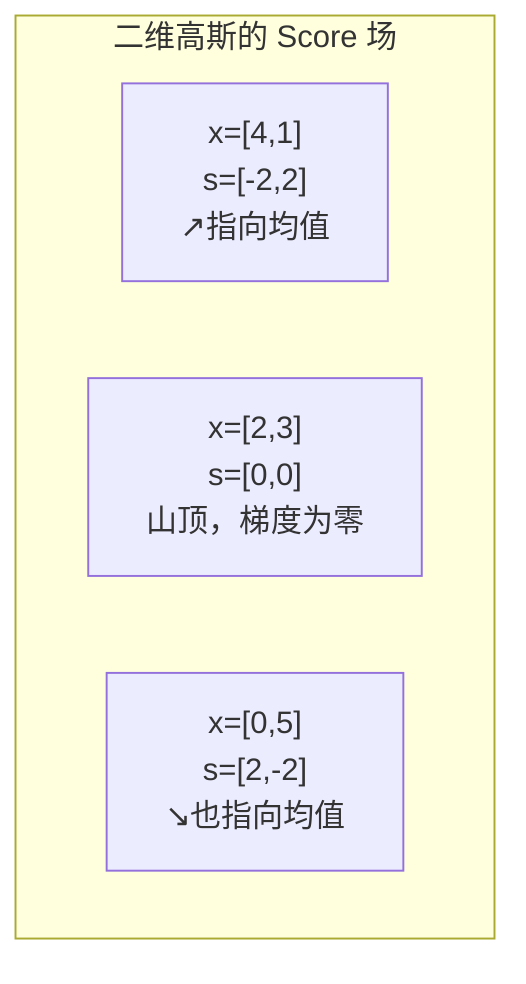
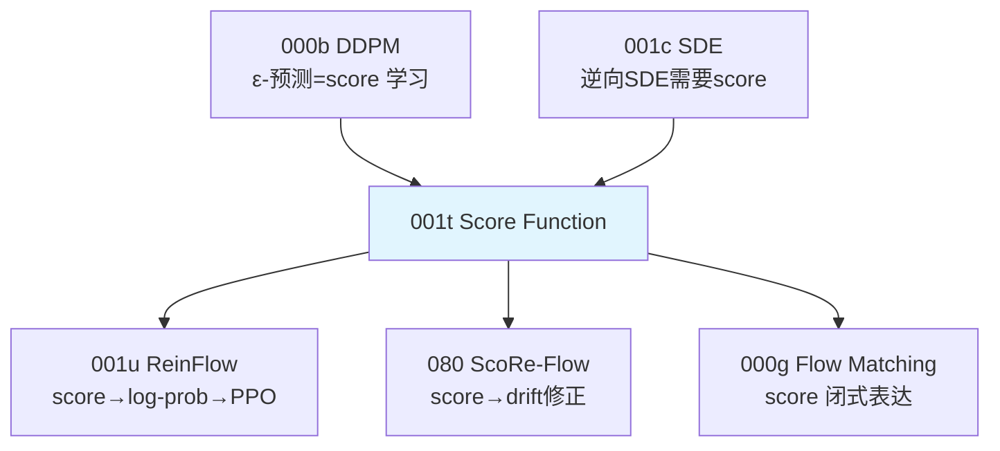

# 前置知识：Score Function（密度梯度）与 Score Matching

> **一句话**：Score function $s(x) = \nabla_x \log p(x)$ 是概率密度对数对数据本身的梯度——它告诉你"从当前位置往哪个方向走，能到达概率更高的地方"。这个概念是扩散模型逆向采样、Flow Matching 的 drift 修正、以及 ScoRe-Flow 等 RL 微调方法的数学核心。

**标签**: `#前置知识` `#Score Function` `#密度梯度` `#Score Matching` `#Stein Score` `#生成模型`

---

## 相关阅读

在阅读本文前，建议先了解：

- [扩散模型 DDPM](/前置知识/000b_前置知识_扩散模型DDPM) — Score function 最重要的应用场景
- [随机微分方程 SDE](/前置知识/001c_前置知识_随机微分方程SDE直觉与扩散模型的联系) — 逆向 SDE 中 score 的作用
- [Flow Matching 与连续归一化流](/前置知识/000g_前置知识_Flow_Matching与连续归一化流) — Flow 中 score 的闭式表达

读完本文后，可以继续阅读：

- [ReinFlow：Flow 策略的噪声注入 RL 微调](/前置知识/001u_前置知识_ReinFlow_Flow策略的噪声注入RL微调) — 用 score 计算 log-prob 的实际应用
- [ScoRe-Flow 精读](/论文综述/080_ScoRe_Flow_Score引导的Flow策略RL微调) — 用 score 做 drift 修正的前沿方法

---

## ⚠️ 两种"Score Function"辨析（极其重要）

在 RL 和生成模型文献中，"score function"这个词被用于**两个完全不同的概念**。下面用两个并排的描述来对比：

### 策略梯度中的 Score Function

- **定义**：$\nabla_\theta \log \pi_\theta(a \mid s)$
- **对谁求梯度**：对**参数** $\theta$
- **含义**："怎么调参数能让这个动作的概率变大"
- **别名**：Log-derivative trick, REINFORCE trick
- **用在哪**：PPO、REINFORCE 等策略梯度算法
- **详细讲解**：[连续动作与离散动作的梯度回传](/前置知识/001r_前置知识_连续动作与离散动作的梯度回传)

### 生成模型中的 Score Function

- **定义**：$\nabla_x \log p(x)$
- **对谁求梯度**：对**数据** $x$
- **含义**："从当前位置往哪走能到达概率更高的地方"
- **别名**：Stein score, 密度梯度
- **用在哪**：扩散模型逆向采样、Score Matching、ScoRe-Flow
- **详细讲解**：**本文**

**本文只讲第二种**——生成模型中的 score function（密度梯度）。如果你在读一篇 RL 论文里看到 "score function gradient"、"log-derivative trick"，请去看 [001r 文章](/前置知识/001r_前置知识_连续动作与离散动作的梯度回传)。

---

## 贯穿全文的例子

> **场景**：一个二维平面上的概率分布。想象一座山——山的高度代表概率密度 $p(x,y)$。山顶处概率最高，山脚处概率最低。
>
> - 我们站在山腰某处 $(x_0, y_0)$
> - **Score function** 就是"此刻脚下最陡的上坡方向"——沿着它走，能最快地爬到山顶（概率最高处）
> - 具体来说，score 是一个**向量**，指向概率密度增长最快的方向
>
> 后面所有公式都会用这个"爬山"的例子来解释。

---

## 一、Score Function 的定义与直觉

### 1.1 形式化定义

给定一个概率密度函数 $p(x)$（$x \in \mathbb{R}^d$），其 **score function** 定义为：

$$
s(x) \;\triangleq\; \nabla_x \log p(x)
$$

**为什么需要这个定义**：我们想知道"从当前位置 $x$ 往哪个方向移动一小步，概率密度能增长最快"。直接对 $\log p(x)$ 求梯度就能回答这个问题。

> 一句话直觉：Score function 是"概率密度地形图"上的"上坡方向指示牌"。

**逐项拆解**：

| 符号 | 含义 | 直觉 |
|------|------|------|
| $x \in \mathbb{R}^d$ | 数据空间中的一个点 | "你站在地形图上的哪个位置" |
| $p(x)$ | 该点的概率密度值 | "这个位置的海拔（山有多高）" |
| $\log p(x)$ | 对数概率密度 | 取 log 是为了方便计算（梯度形式更简洁）|
| $\nabla_x$ | 对 $x$ 的每个分量求偏导 | "分别看 x 方向和 y 方向的坡度" |
| $s(x) \in \mathbb{R}^d$ | 一个 $d$ 维向量 | "指向最陡上坡方向的箭头" |

### 1.2 为什么用 log？

自然的问题是：为什么不直接用 $\nabla_x p(x)$，而要先取 log？

**原因 1：数值稳定**。概率密度 $p(x)$ 可能极小（如 $10^{-300}$），取 log 后变成 $-690$，数值上好处理。

**原因 2：乘法变加法**。多个独立分布的联合 score 可以直接加起来：

$$
\nabla_x \log [p_1(x) \cdot p_2(x)] = \nabla_x \log p_1(x) + \nabla_x \log p_2(x)
$$

**原因 3：归一化常数消失**。如果 $p(x) = \frac{1}{Z} \tilde{p}(x)$（$Z$ 是未知的归一化常数），取 log 再求梯度后 $Z$ 消失：

$$
\nabla_x \log p(x) = \nabla_x \log \tilde{p}(x) - \nabla_x \underbrace{\log Z}_{=0} = \nabla_x \log \tilde{p}(x)
$$

这意味着**即使不知道归一化常数，也能算 score**——这是 Score Matching 能够工作的关键。

### 1.3 数值例子：二维高斯分布

假设 $p(x)$ 是一个均值为 $\mu = [2, 3]$、协方差为 $\Sigma = I$（单位矩阵）的二维高斯分布：

$$
p(x) = \frac{1}{2\pi} \exp\left(-\frac{1}{2}\|x - \mu\|^2\right)
$$

取 log：

$$
\log p(x) = -\log(2\pi) - \frac{1}{2}\|x - \mu\|^2 = -\log(2\pi) - \frac{1}{2}[(x_1-2)^2 + (x_2-3)^2]
$$

求梯度：

$$
s(x) = \nabla_x \log p(x) = \begin{bmatrix} -(x_1 - 2) \\ -(x_2 - 3) \end{bmatrix} = \mu - x
$$

**代入具体数字**：假设我们站在 $x = [4, 1]$：

$$
s([4,1]) = [2-4, \; 3-1] = [-2, \; 2]
$$

**含义**：从 $[4,1]$ 出发，score 指向 $[-2, 2]$ 方向——也就是指向均值 $[2,3]$。这完全符合直觉：高斯分布的最高点就是均值，score 当然指向那里！

**几何理解**：对于高斯分布，score 就是"从当前位置指向均值的向量"。离均值越远，score 的模越大（"上坡越陡"）。

### 1.4 与梯度下降/上升的关系

如果你做过机器学习的"梯度下降"来最小化 loss，那 score function 就是"梯度上升来最大化概率密度"：

$$
x_{n+1} = x_n + \eta \cdot s(x_n) = x_n + \eta \cdot \nabla_x \log p(x_n)
$$

**为什么需要这个公式**：我们已经知道 score 指向"概率更高的地方"，那自然的想法是——沿着这个方向反复走一小步，就应该能走到概率最高的区域。这个公式把"沿 score 方向走"写成了一个可以迭代执行的更新规则。

> 一句话直觉：把 score 当成"坡度"，每一步都朝坡度指的方向挪一点，像滚珠沿着山谷的坡度慢慢滚到谷底（这里是滚到山顶，因为我们是"上坡"而不是"下坡"）。

**逐项拆解**：

| 符号 | 含义 | 直觉 |
|------|------|------|
| $x_n$ | 第 $n$ 步迭代时的位置 | "当前站在地形图哪个点" |
| $\eta$ | 步长（学习率） | "每一步迈多大" |
| $s(x_n) = \nabla_x \log p(x_n)$ | 当前位置的 score | "当前脚下最陡的上坡方向" |
| $x_{n+1}$ | 更新后的新位置 | "往上坡方向挪一步之后站的地方" |

**数值代入**：延续 1.3 节的二维高斯例子（$\mu=[2,3]$），取步长 $\eta=0.1$，从 $x_0=[4,1]$ 出发：

- 第 0 步：$s(x_0) = \mu - x_0 = [2,3]-[4,1] = [-2, 2]$
- 更新：$x_1 = x_0 + \eta \cdot s(x_0) = [4,1] + 0.1\times[-2,2] = [3.8, 1.2]$
- 第 1 步：$s(x_1) = [2,3]-[3.8,1.2] = [-1.8, 1.8]$
- 更新：$x_2 = [3.8,1.2] + 0.1\times[-1.8,1.8] = [3.62, 1.38]$

可以看到 $x_n$ 每一步都在向均值 $[2,3]$ 靠近，且越靠近均值、score 越小、每步挪动的幅度也越小——这正是"梯度上升在极值点附近逐渐减速"的表现。

这叫**Langevin dynamics**（朗之万动力学）——沿着 score 方向走，就能慢慢走到概率最高的地方，但它有一个致命问题：纯粹按上面公式迭代，最终会**收敛到 $p(x)$ 的峰值点上不再动**（因为峰值点处 score=0），而我们真正想要的是从 $p(x)$ 里**采样出多样的样本**，不是只找到一个峰值。解决办法是在每步更新里加一点随机噪声：

$$
x_{n+1} = x_n + \eta \cdot \nabla_x \log p(x_n) + \sqrt{2\eta} \cdot \epsilon, \quad \epsilon \sim \mathcal{N}(0, I)
$$

**为什么需要这个公式**：单纯的梯度上升会让所有起点都收缩到同一个峰值，采不出符合 $p(x)$ 分布的多样样本。加入一项随机噪声后，粒子会在峰值附近"抖动"而不是完全静止，抖动的幅度和方向恰好能补偿"上坡"造成的分布收缩，最终使粒子的落点分布收敛到 $p(x)$ 本身，而不是塌缩到一个点。

**逐项拆解**：这个公式在上面梯度上升公式的基础上多了一项：

| 符号 | 含义 | 直觉 |
|------|------|------|
| $\epsilon$ | 标准正态随机向量 | "这一步额外往一个随机方向抖一下" |
| $\sqrt{2\eta}$ | 噪声项的系数 | "抖动幅度和步长 $\eta$ 挂钩，且是按平方根缩放" |

**数值代入**：延续上面的例子，第 0 步在 $\eta=0.1$、$s(x_0)=[-2,2]$ 的基础上，额外采样噪声 $\epsilon = [0.5, -0.3]$：

$$
x_1 = [4,1] + 0.1\times[-2,2] + \sqrt{0.2}\times[0.5,-0.3] = [3.8,1.2] + 0.447\times[0.5,-0.3] = [4.02,\,1.07]
$$

可以看到加了噪声之后，新位置不再单调地朝均值靠近（甚至可能暂时离均值更远一点），这正是"用随机抖动换取采样多样性"的体现——反复迭代很多步之后，$x_n$ 的**分布**会收敛到 $p(x)$，而不是所有轨迹都挤到均值这一个点上。

**为什么是这个形式（为什么系数恰好是 $\sqrt{2\eta}$，不是 $\eta$ 或 $2\eta$）**：这不是一个随意选择的数字，而是由随机微分方程理论决定的精确值——只有噪声系数取 $\sqrt{2\eta}$，这个离散迭代才是对应 SDE $\mathrm{d}x = \nabla_x\log p(x)\,\mathrm{d}t + \sqrt{2}\,\mathrm{d}W$ 的正确离散化，而这个 SDE 的平稳分布**恰好等于** $p(x)$（这是 Fokker-Planck 方程的一个经典结论）。如果系数选错（比如用 $\eta$ 而不是 $\sqrt{2\eta}$），迭代仍然会收敛到某个分布，但那个分布**不等于**目标分布 $p(x)$——采样就错了。

> 这就是 **Langevin Monte Carlo 采样**：沿着 score（上坡方向）走 + 恰到好处的随机抖动 → 最终样本服从目标分布 $p(x)$。

---

## 二、Score Matching：如何学习 Score Function

### 2.1 核心困难：我们不知道 $p(x)$

在真实场景中，我们只有从未知分布 $p_{\text{data}}(x)$ 中采到的样本 $\{x_1, x_2, \ldots, x_N\}$。我们想训练一个网络 $s_\theta(x)$ 来逼近真实的 score $\nabla_x \log p_{\text{data}}(x)$——但问题是我们连 $p_{\text{data}}(x)$ 的解析式都不知道，怎么算它的梯度？

### 2.2 Explicit Score Matching（理想但不可行）

最直接的想法——最小化预测 score 和真实 score 的差距：

$$
\mathcal{L}_{\text{ESM}} = \frac{1}{2}\mathbb{E}_{x \sim p_{\text{data}}}\left[\|s_\theta(x) - \nabla_x \log p_{\text{data}}(x)\|^2\right]
$$

**为什么需要这个公式**：训练一个网络 $s_\theta$ 逼近真实 score，最自然的目标当然是让它和真实 score 的差距（欧氏距离的平方）尽可能小——这和普通回归任务里用 MSE 拟合目标值是同一个思路。

> 一句话直觉：让网络预测的"上坡方向"尽量对齐真实的"上坡方向"，就像普通的回归任务里让预测值贴近标签值。

**逐项拆解**：

| 符号 | 含义 | 直觉 |
|------|------|------|
| $s_\theta(x)$ | 网络预测的 score | "网络认为的上坡方向" |
| $\nabla_x \log p_{\text{data}}(x)$ | 真实数据分布的 score | "真正的上坡方向"（未知） |
| $\|\cdot\|^2$ | 向量差的模长平方 | 预测方向和真实方向差得有多远 |
| $\mathbb{E}_{x\sim p_{\text{data}}}$ | 对真实数据分布采样求期望 | 训练中通过从数据集里采 mini-batch 样本近似 |
| $\frac{1}{2}$ | 系数 | 求导时抵消平方项求导产生的 2，纯粹是数学上的方便 |

**数值代入**：假设 $d=2$，某个样本点 $x$ 处真实 score $\nabla_x\log p_{\text{data}}(x) = [1.0, -0.5]$，网络当前预测 $s_\theta(x) = [0.6, -0.3]$：

$$
\mathcal{L}_{\text{ESM}} = \frac{1}{2}\|[0.6,-0.3]-[1.0,-0.5]\|^2 = \frac{1}{2}\|[-0.4,0.2]\|^2 = \frac{1}{2}(0.16+0.04) = 0.1
$$

这个值越小说明网络预测的方向和真实方向越接近；梯度下降会把 $\theta$ 往"缩小这个差距"的方向调整。

**问题**：$\nabla_x \log p_{\text{data}}(x)$ 未知（我们不知道 $p_{\text{data}}$ 的解析形式），所以这个 loss 直接算不了——上面的数值代入只是"假设我们知道真实 score"时的理想情况，实际训练中我们根本拿不到 $[1.0,-0.5]$ 这样的真实值。这正是下面 Implicit Score Matching 要解决的问题。

### 2.3 Implicit Score Matching（Hyvärinen, 2005）

Hyvärinen 证明了一个巧妙的等价变换——通过分部积分，可以把上面的 loss 改写为一个**不需要知道真实 score** 的形式：

$$
\mathcal{L}_{\text{ISM}} = \mathbb{E}_{x \sim p_{\text{data}}}\left[\frac{1}{2}\|s_\theta(x)\|^2 + \text{tr}(\nabla_x s_\theta(x))\right]
$$

**为什么需要这个公式**：它让我们绕过了"不知道真实 score"的障碍。只要能算 $s_\theta(x)$ 本身及其对 $x$ 的雅可比矩阵的迹，就能训练网络。

> 一句话直觉：通过分部积分的数学技巧，把"和真实 score 比对"转化为"只看预测 score 本身的性质"。

**逐项拆解**：

| 项 | 数学含义 | 直觉 |
|------|------|------|
| $\frac{1}{2}\|s_\theta(x)\|^2$ | 预测 score 的模的平方 | 惩罚"预测的上坡方向太陡/太夸张" |
| $\text{tr}(\nabla_x s_\theta(x)) = \sum_i \frac{\partial [s_\theta]_i}{\partial x_i}$ | score 预测网络的散度（雅可比矩阵的迹） | 衡量 score 场在 $x$ 附近是"往外发散"还是"往内收缩" |
| $\mathbb{E}_{x\sim p_{\text{data}}}$ | 对真实数据采样求期望 | 训练中用 mini-batch 样本近似 |

**数值代入**：假设 $d=2$，某样本处网络预测 $s_\theta(x) = [0.6, -0.3]$，且散度 $\text{tr}(\nabla_x s_\theta(x)) = -0.4$（表示 score 场在这一点附近是"收缩"的）：

$$
\frac{1}{2}\|[0.6,-0.3]\|^2 + (-0.4) = \frac{1}{2}(0.36+0.09) - 0.4 = 0.225 - 0.4 = -0.175
$$

这个式子可以取负值（它不是一个"距离"，只是一个可以直接优化的目标），损失越小（越负）说明当前 $s_\theta$ 越符合"隐式匹配真实 score"的条件。

**为什么这样变换是等价的**：Hyvärinen 的分部积分推导表明，$\mathbb{E}_{x\sim p_{\text{data}}}[\mathcal{L}_{\text{ISM}}]$ 和 $\mathbb{E}_{x\sim p_{\text{data}}}[\mathcal{L}_{\text{ESM}}]$ 相差一个与 $\theta$ 无关的常数——也就是说对 $\theta$ 求梯度时两者完全等价，但 ISM 不再出现未知的 $\nabla_x\log p_{\text{data}}(x)$。

**问题**：计算散度 $\text{tr}(\nabla_x s_\theta(x))$ 需要对每个维度求一次偏导（对应网络多做一次反向传播），$O(d)$ 开销。在高维（如图像，$d$ 可能上万）中完全不实用。

### 2.4 Denoising Score Matching（DSM，Vincent 2011）

这是实际使用最广泛的方法，也是 DDPM 训练目标的数学本质。

**核心思想**：不直接匹配干净数据的 score，而是匹配**加了噪声的数据的 score**。加噪声后的 score 有解析形式！

给数据加高斯噪声：$\tilde{x} = x + \sigma \epsilon$，$\epsilon \sim \mathcal{N}(0, I)$

加噪后的条件分布是 $q_\sigma(\tilde{x} \mid x) = \mathcal{N}(\tilde{x}; x, \sigma^2 I)$，其 score 有闭式解：

$$
\nabla_{\tilde{x}} \log q_\sigma(\tilde{x}|x) = -\frac{\tilde{x} - x}{\sigma^2} = -\frac{\epsilon}{\sigma}
$$

**为什么需要这个公式**：ESM/ISM 的困难在于"真实数据分布的 score 未知"，但如果换成"加噪之后的分布"，score 就能直接从高斯分布的公式手算出来——不需要网络、不需要任何近似。这个闭式解正是 DSM 能够绕开"不知道真实 score"这个障碍的关键。

> 一句话直觉：给数据加了一坨已知的高斯噪声之后，"加噪点的 score"其实就是"往回指向干净数据的方向，除以噪声方差"——因为高斯分布的 log-density 是一个二次函数，求梯度自然是线性的。

**逐项拆解**：

| 符号 | 含义 | 直觉 |
|------|------|------|
| $\tilde{x}$ | 加噪之后的点 | "被污染过的数据" |
| $x$ | 原始干净数据点 | "真实数据" |
| $\sigma$ | 噪声标准差 | "污染程度" |
| $\epsilon = (\tilde{x}-x)/\sigma$ | 标准化的噪声 | "加噪时具体抽到的那个随机扰动" |

**数值代入**：$d=2$，$\sigma=0.5$，干净数据 $x=[1.0, 2.0]$，采样噪声 $\epsilon=[0.4,-0.6]$：

- 加噪点：$\tilde{x} = x+\sigma\epsilon = [1.0,2.0]+0.5\times[0.4,-0.6] = [1.2,\,1.7]$
- Score：$-\frac{\tilde{x}-x}{\sigma^2} = -\frac{[0.2,-0.3]}{0.25} = [-0.8,\,1.2]$
- 验证等价形式：$-\epsilon/\sigma = -[0.4,-0.6]/0.5 = [-0.8,\,1.2]$ ✓ 两种写法算出同一个结果

**训练目标**：

$$
\mathcal{L}_{\text{DSM}} = \mathbb{E}_{x \sim p_{\text{data}},\; \epsilon \sim \mathcal{N}(0,I)}\left[\|s_\theta(\tilde{x}, \sigma) - (-\epsilon/\sigma)\|^2\right]
$$

**为什么需要这个公式**：既然加噪点的真实 score 已经有了闭式解 $-\epsilon/\sigma$，训练网络逼近它就变成了一个普通的回归问题——用网络预测的 score 去拟合这个已知目标即可，不再需要 ISM 里代价高昂的散度计算。

> 一句话直觉：训练网络预测"加了多少噪声"（归一化后取负），这等价于预测 score，而"加了多少噪声"这件事我们在采样时是**知道**的（就是自己加的那个 $\epsilon$）。

**逐项拆解**：

| 符号 | 含义 | 直觉 |
|------|------|------|
| $x\sim p_{\text{data}}$ | 从训练集里采一个干净样本 | 实际训练中就是从数据集里取一个 mini-batch |
| $\epsilon\sim\mathcal{N}(0,I)$ | 随机采样一个标准正态噪声 | 每次训练迭代都重新采一次 |
| $\tilde{x}=x+\sigma\epsilon$ | 加噪后喂给网络的输入 | 网络看到的是"脏"数据 |
| $s_\theta(\tilde{x},\sigma)$ | 网络在加噪点、已知噪声水平下预测的 score | 网络的输出 |
| $-\epsilon/\sigma$ | 真实 score（已知） | 回归目标 |

**数值代入**：延续上面的例子，$\tilde{x}=[1.2,1.7]$，$\sigma=0.5$，真实 score $=[-0.8,1.2]$。假设网络当前预测 $s_\theta(\tilde x,\sigma) = [-0.5, 1.0]$：

$$
\mathcal{L}_{\text{DSM}} = \|[-0.5,1.0]-[-0.8,1.2]\|^2 = \|[0.3,-0.2]\|^2 = 0.09+0.04 = 0.13
$$

梯度下降会把网络参数往"让预测值更接近 $[-0.8,1.2]$"的方向调整。

**和 DDPM 的关系**：DDPM 的训练目标 $\|\epsilon_\theta(x_t, t) - \epsilon\|^2$ 本质上就是 DSM——预测噪声 $\epsilon$ 等价于预测 score（差一个 $-1/\sigma$ 的系数，正如上面数值例子里验证的那样）。

---

## 三、Score Function 在扩散模型中的角色

### 3.1 逆向 SDE 需要 Score

回忆扩散模型的逆向采样 SDE（[详见 SDE 前置知识](/前置知识/001c_前置知识_随机微分方程SDE直觉与扩散模型的联系)）：

$$
\mathrm{d}x = \left[f(x,t) - g(t)^2 \nabla_x \log p_t(x)\right]\mathrm{d}t + g(t)\,\mathrm{d}\bar{W}
$$

**为什么需要这个公式**：扩散模型的前向过程是"不断加噪把数据变成纯噪声"，那么反过来，只要能找到一个方程描述"怎么从纯噪声一步步走回数据"，就能实现生成。这个逆向 SDE 正是数学上严格成立的"倒放"过程——它告诉我们每一步该往哪个方向、加多大的随机扰动。

> 一句话直觉：把前向加噪的过程在时间上"倒放"，倒放出来的运动规律里唯一缺失的信息就是 score（"数据在哪个方向"），补上它就能把纯噪声一步步导航回真实数据分布。

**逐项拆解**：

| 符号 | 数学含义 | 在本场景中具体是什么 |
|------|---------|---------------------|
| $x$ | 当前状态（噪声/数据的中间形态） | 生成过程中某一时刻的粒子位置 |
| $t$ | 时间（逆向时从 $T$ 走到 $0$） | 扩散过程的进度，$t=T$ 是纯噪声，$t=0$ 是干净数据 |
| $f(x,t)$ | 前向过程的 drift 项 | 由前向加噪 SDE 决定的确定性漂移（DDPM 里通常是 $-\frac{1}{2}\beta(t)x$ 这类线性项）|
| $g(t)$ | 前向过程的扩散系数 | 控制每步加噪强度，随 $t$ 变化 |
| $\nabla_x \log p_t(x)$ | 时刻 $t$ 的 score | 本文的主角——指向"数据密度更高的方向" |
| $\mathrm{d}\bar W$ | 逆时间的标准布朗运动增量 | 每一步的随机扰动（探索性） |

**数值代入**：取一个简化的一维 VE-SDE 例子（$f(x,t)=0$，$g(t)=1$，即最简单的加噪过程），当前 $x=3.0$，估计的 score $\nabla_x\log p_t(x) = -1.2$（说明数据在 $x$ 更小的方向），取步长 $\mathrm{d}t=0.1$：

$$
\mathrm{d}x = \left[0 - 1^2\times(-1.2)\right]\times0.1 = 1.2\times0.1 = 0.12
$$

再加上随机项 $g(t)\mathrm{d}\bar W \approx 1\times\sqrt{0.1}\times\eta$（$\eta\sim\mathcal N(0,1)$，假设采样 $\eta=0.3$，则这一项 $\approx 0.095$），合起来这一步 $x$ 大约变化 $0.12+0.095=0.215$，即从 $3.0$ 走到约 $2.785$——往 score 指的方向（$x$ 减小）挪动，同时叠加了随机抖动。

**为什么是这个形式（为什么要加 $-g(t)^2$ 而不是别的系数）**：这不是随意设计，而是由 Anderson (1982) 时间反演公式严格推导出来的——只有用这个精确系数，逆向过程模拟出来的样本分布才能保证和前向过程在每个时刻 $t$ 的边际分布 $p_t(x)$ 完全匹配。这里 $\nabla_x \log p_t(x)$ 就是时刻 $t$ 的边际分布 $p_t(x)$ 的 **score function**。扩散模型逆向采样的整个过程，就是：

1. 训练一个网络来估计 score：$s_\theta(x, t) \approx \nabla_x \log p_t(x)$
2. 把学到的 score 代入逆向 SDE
3. 从纯噪声出发，模拟逆向 SDE，逐步"顺着 score 爬回数据分布"

**Score 的物理角色**：在充满噪声的空间中充当"指南针"，告诉粒子"数据在哪个方向"。

### 3.2 Score 与 DDPM 噪声预测的等价关系

DDPM 训练的是噪声预测网络 $\epsilon_\theta(x_t, t)$。它和 score 的关系是：

$$
\nabla_{x_t} \log p_t(x_t) = -\frac{\epsilon_\theta(x_t, t)}{\sigma_t}
$$

**为什么需要这个公式**：它建立了"预测噪声"和"预测 score"之间的桥梁。DDPM 看起来是在预测噪声，但本质上是在学 score function。

> 一句话直觉：噪声指向"数据跑到了哪里"（$\epsilon$ 是从数据到当前噪声位置的偏移），取负号再归一化就是"从当前位置回到数据的方向"——这正是 score。

**逐项拆解**：

| 符号 | 含义 | 直觉 |
|------|------|------|
| $x_t$ | 时刻 $t$ 的加噪状态 | 前向过程中第 $t$ 步的中间结果 |
| $\epsilon_\theta(x_t,t)$ | DDPM 网络预测的噪声 | 网络认为"这个位置累积了多少噪声" |
| $\sigma_t$ | 时刻 $t$ 的噪声标准差 | 由前向加噪 schedule 决定，是一个已知的常数（不是网络输出） |

**数值例子**：$d=2$，时刻 $t$ 处 $\sigma_t = 0.5$

- 当前位置 $x_t = [1.5, -0.3]$
- 网络预测的噪声 $\epsilon_\theta = [0.8, -1.2]$（"这个位置被加了多少噪声"）
- Score = $-[0.8, -1.2] / 0.5 = [-1.6, 2.4]$（"数据在左上方"）

**为什么是这个形式**：这个关系直接来自 3.1 节讲的加噪分布 $q_\sigma(\tilde x|x)$ 的 score 闭式解 $-\epsilon/\sigma$——DDPM 训练时用网络 $\epsilon_\theta$ 去回归真实噪声 $\epsilon$，训好之后把 $\epsilon_\theta$ 代入 $-\epsilon/\sigma_t$ 这个公式，就直接得到了 score 的估计，不需要再单独训练一个 score 网络。这也是为什么"噪声预测"和"score 估计"在扩散模型文献里经常被当成同一件事来讲。

### 3.3 Score 在 Flow Matching 中的闭式表达

对于线性 Flow Matching（路径 $x_t = (1-t)x_0 + t \cdot x_1$），score 有一个特殊的闭式解。这个结论在 [ScoRe-Flow](/论文综述/080_ScoRe_Flow_Score引导的Flow策略RL微调) 中被大量使用：

$$
\nabla_{x_t} \log p_t(x_t) = \frac{t \cdot v_\theta(x_t, t) - x_t}{1-t}
$$

**为什么需要这个公式**：一般来说计算 score 需要额外训练一个 score 网络。但对于线性 Flow Matching，score 可以直接从速度场 $v_\theta$ 算出来——零额外参数、零额外训练。

> 一句话直觉：Flow 的速度场 $v_\theta$ "知道"数据在哪里（它的工作就是把噪声推向数据）。对它做一个简单的代数变换，就能提取出"哪个方向数据更密集"的信息——这就是 score。

**逐项拆解**：
- $v_\theta(x_t, t)$：预训练 flow 在当前位置和时刻的速度预测——"粒子应该往哪走"
- $t \cdot v_\theta$：速度被时间 $t$ 缩放（越接近起点 $t=0$，这一项越小）
- $t \cdot v_\theta - x_t$：速度指向的"目的地"和当前位置的差
- $1/(1-t)$：越接近终点（$t \to 1$），score 越大——因为终点附近分布越集中，"山坡越陡"

**数值例子**：$d=2$，$t = 0.7$

- 当前位置 $x_t = [0.5, 1.2]$
- 速度预测 $v_\theta = [2.0, 3.5]$（网络认为粒子应该往右上方走）
- Score = $(0.7 \times [2.0, 3.5] - [0.5, 1.2]) / (1-0.7)$
  - 分子 = $[1.4, 2.45] - [0.5, 1.2] = [0.9, 1.25]$
  - Score = $[0.9, 1.25] / 0.3 = [3.0, 4.17]$
- **含义**：score 指向右上方，且模较大——说明数据密集区域在右上方，且当前时刻分布已经较集中

**注意**：当 $t \to 1$ 时，分母 $(1-t) \to 0$，score 趋于无穷大。这是因为 $t=1$ 时分布退化为 delta 函数（纯数据点），"山顶无限陡"。这个发散问题在 ScoRe-Flow 中通过 $(1-t)$ 衰减因子来解决。

---

## 四、Score Function 的几何直觉

### 4.1 等高线与 Score 的关系

想象一个二维概率密度的等高线图（像地形图的等高线）：

- **在概率密度最高处**（山顶）：score = 0（已经在"最好的位置"，没有更好的方向可走）
- **在低密度处**（山脚）：score 很大，指向高密度处
- **在中间位置**：score 大小中等，方向始终指向密度增加最快的方向
- **score 总是垂直于等高线**——就像水往最陡的方向流下山

### 4.2 多模态分布中的 Score

如果概率分布有多个峰（像多座山）：

$$
p(x) = 0.3 \cdot \mathcal{N}(x; \mu_1, \sigma^2) + 0.7 \cdot \mathcal{N}(x; \mu_2, \sigma^2)
$$

**为什么需要这个公式**：前面的例子都只用单峰高斯，但真实数据分布（比如机械臂抓取的多种成功姿态）往往有多个"聚集区"。这个公式构造一个最简单的双峰分布，用来观察 score 在多峰场景下会怎么表现。

> 一句话直觉：整体分布是两座山叠加的地形——一座矮一点占 30% 的"份额"，一座高一点占 70% 的"份额"，站在任意一点，score 会综合考虑两座山的拉力，指向"综合来看概率增长最快"的方向。

**逐项拆解**：

| 符号 | 含义 | 直觉 |
|------|------|------|
| $\mathcal{N}(x;\mu_1,\sigma^2)$ | 第一个高斯分量 | "第一座山"，峰值在 $\mu_1$ |
| $\mathcal{N}(x;\mu_2,\sigma^2)$ | 第二个高斯分量 | "第二座山"，峰值在 $\mu_2$ |
| $0.3,\ 0.7$ | 混合权重 | 两座山各自的"重要程度"（必须加起来等于 1） |

**数值代入**：$d=1$，$\mu_1=-2$，$\mu_2=3$，$\sigma=1$。混合分布的 score 是两个分量 score 的**加权平均**（不是简单相加，权重还要按各分量在该点的密度值重新加权，这里给出在 $x=0$ 处的近似计算）：

- 分量 1 在 $x=0$ 处的密度 $\propto \exp(-\frac{1}{2}(0-(-2))^2) = \exp(-2) \approx 0.135$，加权后 $0.3\times0.135=0.0406$
- 分量 2 在 $x=0$ 处的密度 $\propto \exp(-\frac{1}{2}(0-3)^2) = \exp(-4.5) \approx 0.0111$，加权后 $0.7\times0.0111=0.0078$
- 分量 1 的 score（单独）$= \mu_1 - x = -2-0=-2$；分量 2 的 score（单独）$=\mu_2-x=3-0=3$
- 混合 score $\approx \frac{0.0406\times(-2) + 0.0078\times3}{0.0406+0.0078} = \frac{-0.0812+0.0234}{0.0484} \approx -1.19$

**含义**：因为 $x=0$ 离分量 1（$\mu_1=-2$）更近，分量 1 的密度权重更大，所以混合 score 更接近分量 1 单独的 score（$-2$），而不是分量 2 的（$3$）——这正是"score 天然更偏向最近的那个峰"的数学体现。

Score 的行为：
- 在每个峰附近：score 指向**最近的那个峰**
- 在两个峰之间的"山谷"：score 可能指向**更高的那个峰**（权重更大的那个）
- 恰好在"分水岭"上：score 为零（两个峰的引力平衡）

这意味着 score 天然编码了多模态结构——跟着 score 走，粒子会被"吸"到最近的模态中。

### 4.3 Score 作为"力场"

物理类比：把 score 想象成一个"力场"（force field）：

| 物理概念 | Score Function 对应 |
|----------|-------------------|
| 势能场 $U(x)$ | $-\log p(x)$（负对数概率） |
| 力 $F = -\nabla U$ | $s(x) = \nabla_x \log p(x) = -\nabla_x(-\log p(x))$ |
| 粒子在力场中运动 | 沿 score 方向采样（Langevin dynamics） |
| 势能最低点（平衡态） | 概率最高处（$s(x)=0$） |

> 这不是类比——这是数学上精确的对应关系。Score function 就是概率分布诱导的"引力场"。

---

## 五、Score Function 在 RL + Flow Matching 中的应用

### 5.1 问题回顾：Flow 策略的 RL 微调

[Flow Matching 策略](/前置知识/000g_前置知识_Flow_Matching与连续归一化流) 的推理是确定性 ODE：

$$
a_{k+1} = a_k + \Delta t \cdot v_\theta(a_k, t_k, s)
$$

**这个公式在做什么**：从当前动作 $a_k$，沿着 flow 网络给出的速度方向走一小步 $\Delta t$，得到下一步的动作 $a_{k+1}$——这就是 Flow Matching 策略把噪声一步步变成动作的推理过程（完整原理见 [Flow Matching 前置知识](/前置知识/000g_前置知识_Flow_Matching与连续归一化流)，这里只回顾其"确定性"这一关键性质）。

**逐项拆解**：$a_k$ 是第 $k$ 步的中间动作，$v_\theta(a_k,t_k,s)$ 是网络在当前状态 $s$、时刻 $t_k$、位置 $a_k$ 处给出的速度预测，$\Delta t$ 是固定步长。**关键点**：给定同一个初始噪声 $a_0$ 和同一个网络 $v_\theta$，这个式子每次算出来的 $a_{k+1}$ **完全相同**——不含任何随机项。

确定性 = 没有随机性 = 无法探索 = [RL 微调困难](/前置知识/000f_前置知识_为什么扩散策略难以RL微调)。

解决方案：注入噪声，把确定性 ODE 变成随机 SDE。但怎么注入？

### 5.2 Score 的两个关键作用

**作用 1：计算 log-probability**

把 ODE 变成 SDE 后，每步转移变成高斯分布，log-prob 可以精确计算（[详见 ReinFlow](/前置知识/001u_前置知识_ReinFlow_Flow策略的噪声注入RL微调)）。这让 PPO 等策略梯度方法能够应用。

**作用 2：引导 drift 方向（ScoRe-Flow 的创新）**

不仅可以用噪声探索，还可以**用 score 来修正 drift 方向**——让粒子朝着"数据密度高的方向"偏移：

$$
\mathrm{d}a_t = \underbrace{v_\theta \,\mathrm{d}t}_{\text{原始 drift}} + \underbrace{\alpha(t) \cdot s_t(a_t)\,\mathrm{d}t}_{\text{score 引导}} + \underbrace{\sigma(t)\,\mathrm{d}W}_{\text{噪声探索}}
$$

**为什么需要这个公式**：5.1 节说到，单纯给 flow 的 ODE 加噪声只能带来"无方向的随机探索"（[ReinFlow](/前置知识/001u_前置知识_ReinFlow_Flow策略的噪声注入RL微调) 的做法），探索效率有限。这个公式在原始 drift 之外再加一项，让粒子的运动方向本身也能被"往高概率区域"的方向纠偏，而不只是靠随机抖动碰运气。

> 一句话直觉：原来的运动只听 flow 网络 $v_\theta$ 的指挥（往哪走是固定的），现在额外加了一个"引力"，把粒子往数据密集的地方拉一把，同时保留一点随机抖动用来探索。

**逐项拆解**：

| 项 | 数学含义 | 在本场景中具体是什么 | 这一项在"拉"什么往哪走 |
|------|------|-----------|----------------------|
| $v_\theta \,\mathrm{d}t$ | 原始 flow 的确定性 drift | 预训练好的速度场，本身不变 | 拉着粒子沿预训练学到的"主路线"走 |
| $\alpha(t)\cdot s_t(a_t)\,\mathrm{d}t$ | score 引导项，$\alpha(t)$ 是随时间变化的引导强度 | 3.3 节讲的 flow score 闭式解 $s_t(a_t)=\frac{t v_\theta - a_t}{1-t}$ | 把粒子额外拉向"当前分布密度更高"的区域，方向可能和 $v_\theta$ 不完全一致 |
| $\sigma(t)\,\mathrm{d}W$ | 各向同性随机扰动 | 和 ReinFlow 里的噪声项作用相同 | 不"拉"向任何特定方向，只提供随机探索 |

**数值代入**：$d=2$，当前位置 $a_t=[0.5,1.0]$，$v_\theta=[1.2,0.8]$，score（按 3.3 节公式算出）$s_t=[2.0,-0.5]$，取 $\alpha(t)=0.3$，$\mathrm{d}t=0.1$，暂时忽略随机项只看确定性部分：

- 原始 drift 贡献：$v_\theta\times\mathrm{d}t = [1.2,0.8]\times0.1=[0.12,0.08]$
- score 引导贡献：$\alpha(t)\cdot s_t\times\mathrm{d}t = 0.3\times[2.0,-0.5]\times0.1=[0.06,-0.015]$
- 合计位移：$[0.12+0.06,\;0.08-0.015]=[0.18,\,0.065]$

**含义**：如果不加 score 引导，这一步只会移动 $[0.12,0.08]$；加上 score 引导后额外多移动了 $[0.06,-0.015]$，说明"数据密集区"在 $x$ 方向上和原始 drift 是同向加强的，但在 $y$ 方向上则和原始 drift 略有分歧（score 建议往下，$v_\theta$ 建议往上）——最终合力是两者的折中。

**为什么是这个形式（为什么需要 $\alpha(t)$ 而不是直接把 score 全额加上去）**：如果 $\alpha(t)$ 恒为一个较大的常数，score 引导会在训练早期（$v_\theta$ 还没学好、score 估计也不准）就大幅扭曲 flow 的原始行为，可能破坏预训练策略本身的能力；用一个随时间/训练进度调节的 $\alpha(t)$，可以先让策略保持接近预训练行为，再逐步引入 score 修正，避免"一步迈太大"带来的不稳定。

Score 引导的物理含义：在 flow 的运动过程中加了一个"引力"，把粒子往高概率区域拉。这比纯噪声探索更高效——噪声是无方向的随机抖动，而 score 引导是**有方向的偏移**。

---

## 六、Score Function 的性质总结

| 性质 | 说明 | 公式/例子 |
|------|------|----------|
| 零点 | 概率密度极值点处 score = 0 | 高斯分布的均值处 |
| 方向 | 始终指向概率增大的方向 | 远离均值 → 指向均值 |
| 模长 | 离极值点越远，模越大 | 高斯：$\|s\| = \|x-\mu\|/\sigma^2$ |
| 不依赖归一化常数 | $\nabla_x \log(p/Z) = \nabla_x \log p$ | 让无归一化训练成为可能 |
| 可加性 | 独立分布的 score 直接相加 | 混合分布 = 加权组合 |
| 在 Flow Matching 中有闭式 | 直接从 $v_\theta$ 算出 | $s_t = (tv_\theta - x_t)/(1-t)$ |
| 在 $t\to 1$ 时发散 | 分布越集中，"山坡"越陡 | 需要 $(1-t)$ 因子控制 |

---

## 七、总结

### 一句话

> Score function $s(x) = \nabla_x \log p(x)$ 是概率密度的"方向指示牌"——告诉你从任意位置出发，往哪走能到达概率更高的地方。它是扩散模型逆向采样的数学核心，也是 Flow 策略 RL 微调中用来引导探索方向的关键工具。

### 知识链

---

## 延伸阅读

- Hyvärinen (2005) "Estimation of Non-Normalized Statistical Models by Score Matching" ← Score Matching 原始论文
- Song & Ermon (2019) "Generative Modeling by Estimating Gradients of the Data Distribution" ← Score-based 生成模型开山之作
- Song et al. (2021) "Score-Based Generative Modeling through Stochastic Differential Equations" ← SDE 框架统一
- [随机微分方程 SDE](/前置知识/001c_前置知识_随机微分方程SDE直觉与扩散模型的联系) ← 逆向 SDE 中 score 的完整推导
- [ReinFlow：Flow 策略的噪声注入 RL 微调](/前置知识/001u_前置知识_ReinFlow_Flow策略的噪声注入RL微调) ← Score 在 RL 微调中的第一个应用
