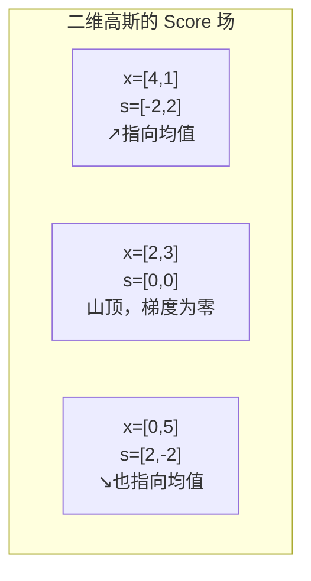
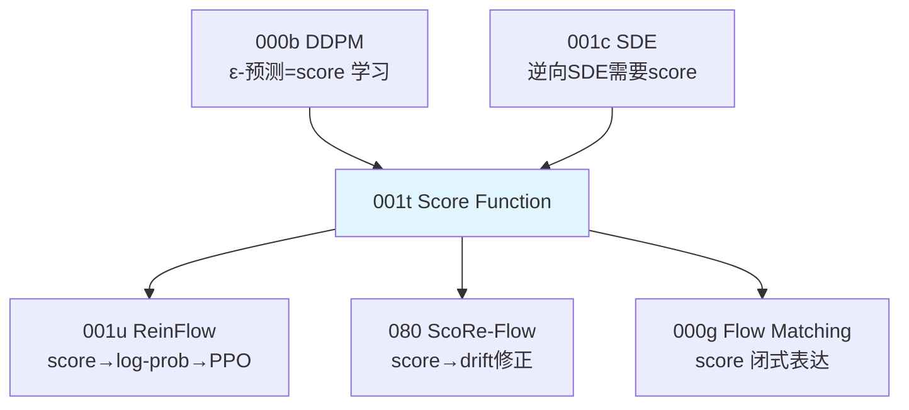

# 前置知识：Score Function（密度梯度）与 Score Matching

> **一句话**：Score function $s(x) = \nabla_x \log p(x)$ 是概率密度对数对数据本身的梯度——它告诉你"从当前位置往哪个方向走，能到达概率更高的地方"。这个概念是扩散模型逆向采样、Flow Matching 的 drift 修正、以及 ScoRe-Flow 等 RL 微调方法的数学核心。

**标签**: `#前置知识` `#Score Function` `#密度梯度` `#Score Matching` `#Stein Score` `#生成模型`

---

## 相关阅读

在阅读本文前，建议先了解：

- [扩散模型 DDPM](/前置知识/000b_前置知识_扩散模型DDPM) — Score function 最重要的应用场景
- [随机微分方程 SDE](/前置知识/001c_前置知识_随机微分方程SDE直觉与扩散模型的联系) — 逆向 SDE 中 score 的作用
- [Flow Matching 与连续归一化流](/前置知识/000g_前置知识_Flow_Matching与连续归一化流) — Flow 中 score 的闭式表达

读完本文后，可以继续阅读：

- [ReinFlow：Flow 策略的噪声注入 RL 微调](/前置知识/001u_前置知识_ReinFlow_Flow策略的噪声注入RL微调) — 用 score 计算 log-prob 的实际应用
- [ScoRe-Flow 精读](/论文综述/080_ScoRe_Flow_Score引导的Flow策略RL微调) — 用 score 做 drift 修正的前沿方法

---

## ⚠️ 两种"Score Function"辨析（极其重要）

在 RL 和生成模型文献中，"score function"这个词被用于**两个完全不同的概念**。下面用两个并排的描述来对比：

### 策略梯度中的 Score Function

- **定义**：$\nabla_\theta \log \pi_\theta(a \mid s)$
- **对谁求梯度**：对**参数** $\theta$
- **含义**："怎么调参数能让这个动作的概率变大"
- **别名**：Log-derivative trick, REINFORCE trick
- **用在哪**：PPO、REINFORCE 等策略梯度算法
- **详细讲解**：[连续动作与离散动作的梯度回传](/前置知识/001r_前置知识_连续动作与离散动作的梯度回传)

### 生成模型中的 Score Function

- **定义**：$\nabla_x \log p(x)$
- **对谁求梯度**：对**数据** $x$
- **含义**："从当前位置往哪走能到达概率更高的地方"
- **别名**：Stein score, 密度梯度
- **用在哪**：扩散模型逆向采样、Score Matching、ScoRe-Flow
- **详细讲解**：**本文**

**本文只讲第二种**——生成模型中的 score function（密度梯度）。如果你在读一篇 RL 论文里看到 "score function gradient"、"log-derivative trick"，请去看 [001r 文章](/前置知识/001r_前置知识_连续动作与离散动作的梯度回传)。

---

## 贯穿全文的例子

> **场景**：一个二维平面上的概率分布。想象一座山——山的高度代表概率密度 $p(x,y)$。山顶处概率最高，山脚处概率最低。
>
> - 我们站在山腰某处 $(x_0, y_0)$
> - **Score function** 就是"此刻脚下最陡的上坡方向"——沿着它走，能最快地爬到山顶（概率最高处）
> - 具体来说，score 是一个**向量**，指向概率密度增长最快的方向
>
> 后面所有公式都会用这个"爬山"的例子来解释。

---

## 一、Score Function 的定义与直觉

### 1.1 形式化定义

给定一个概率密度函数 $p(x)$（$x \in \mathbb{R}^d$），其 **score function** 定义为：

$$
s(x) \;\triangleq\; \nabla_x \log p(x)
$$

**这个公式在做什么**：定义 score function——概率密度的对数对位置 $x$ 求梯度，告诉你从当前位置往哪个方向移动，概率密度增长最快。

::: details 📐 公式详解（点击展开）

| 子表达式 | 它是谁 | 它在干嘛 |
|---------|--------|---------|
| $x \in \mathbb{R}^d$ | **地图坐标** | 数据空间中的一个点，"你站在地形图上的哪个位置" |
| $p(x)$ | **海拔高度** | 该点的概率密度值，"这个位置的海拔（山有多高）" |
| $\log p(x)$ | **换算后的海拔** | 取对数是为了数值稳定、方便求导（原因见下文 1.2 节） |
| $\nabla_x \log p(x)$ | **坡度指示牌** | 对 $x$ 的每个分量求偏导，指出"往哪个方向走坡度最陡" |
| $s(x)$ | **最终结果** | 一个 $d$ 维向量，箭头指向概率密度增长最快的方向 |

**用人话读**："在概率密度地形图上，站在某一点，score 就是这一点指向最陡上坡方向的箭头。"

**为什么是这个形式**：直接对 $\log p(x)$ 求梯度就能回答"往哪走概率密度涨得最快"这个问题；取 log 而不是直接对 $p(x)$ 求梯度的原因见下文（数值稳定、乘法变加法、归一化常数消失）。
:::

### 1.2 为什么用 log？

自然的问题是：为什么不直接用 $\nabla_x p(x)$，而要先取 log？

**原因 1：数值稳定**。概率密度 $p(x)$ 可能极小（如 $10^{-300}$），取 log 后变成 $-690$，数值上好处理。

**原因 2：乘法变加法**。多个独立分布的联合 score 可以直接加起来：

$$
\nabla_x \log [p_1(x) \cdot p_2(x)] = \nabla_x \log p_1(x) + \nabla_x \log p_2(x)
$$

**这个公式在做什么**：说明两个独立分布乘在一起（联合分布）的 score，等于各自 score 直接相加——不需要重新计算。

::: details 📐 公式详解（点击展开）

| 子表达式 | 它是谁 | 它在干嘛 |
|---------|--------|---------|
| $p_1(x)\cdot p_2(x)$ | **联合密度** | 两个独立分布乘起来的联合概率密度 |
| $\nabla_x\log p_1(x)$ | **第一个分量的坡度** | 分布 1 单独的 score |
| $\nabla_x\log p_2(x)$ | **第二个分量的坡度** | 分布 2 单独的 score |

**用人话读**："两座地形图叠在一起，叠加后的坡度就是两座地形图坡度直接相加。"

**为什么是这个形式**：这是 $\log(ab)=\log a+\log b$ 的直接结果——取 log 把乘法变成了加法，求梯度时天然继承这个可加性，不需要额外推导。
:::

**原因 3：归一化常数消失**。如果 $p(x) = \frac{1}{Z} \tilde{p}(x)$（$Z$ 是未知的归一化常数），取 log 再求梯度后 $Z$ 消失：

$$
\nabla_x \log p(x) = \nabla_x \log \tilde{p}(x) - \nabla_x \underbrace{\log Z}_{=0} = \nabla_x \log \tilde{p}(x)
$$

**这个公式在做什么**：证明即使不知道分布的归一化常数 $Z$，也能精确算出 score——这是 Score Matching 整个方法能够成立的关键前提。

::: details 📐 公式详解（点击展开）

| 子表达式 | 它是谁 | 它在干嘛 |
|---------|--------|---------|
| $\tilde p(x)$ | **未归一化密度** | 只知道"相对大小"、没除以归一化常数的密度函数 |
| $Z$ | **归一化常数** | 让 $\tilde p(x)/Z$ 积分等于 1 所需的常数，通常无法解析算出 |
| $\nabla_x\log Z$ | **消失的项** | $Z$ 不依赖 $x$，对 $x$ 求梯度自然是 0 |

**用人话读**："只要 $Z$ 不随位置 $x$ 变化，它对'往哪走坡度最陡'这件事完全没有影响，求梯度时直接消失。"

**为什么是这个形式**：很多真实场景下的概率模型只能写出未归一化的 $\tilde p(x)$（比如能量模型），$Z$ 需要对整个空间积分才能求出，通常没有解析解。这个式子说明 score 完全不需要知道 $Z$，这正是 Score Matching 能绕开"归一化常数难算"这个经典难题的原因。
:::

这意味着**即使不知道归一化常数，也能算 score**——这是 Score Matching 能够工作的关键。

### 1.3 数值例子：二维高斯分布

假设 $p(x)$ 是一个均值为 $\mu = [2, 3]$、协方差为 $\Sigma = I$（单位矩阵）的二维高斯分布：

$$
p(x) = \frac{1}{2\pi} \exp\left(-\frac{1}{2}\|x - \mu\|^2\right)
$$

**这个公式在做什么**：给出一个具体的二维高斯分布密度函数，均值为 $[2,3]$、协方差为单位矩阵，作为后续手算 score 的具体例子。

::: details 📐 公式详解（点击展开）

| 子表达式 | 它是谁 | 它在干嘛 |
|---------|--------|---------|
| $\mu=[2,3]$ | **山顶坐标** | 高斯分布密度最高的位置 |
| $\|x-\mu\|^2$ | **离山顶的距离平方** | 当前点到均值的欧氏距离平方，越远这一项越大 |
| $\exp(-\frac{1}{2}\|x-\mu\|^2)$ | **随距离衰减的密度** | 离均值越远，密度呈指数衰减 |
| $\frac{1}{2\pi}$ | **归一化常数** | 让整个密度函数积分等于 1（本文 1.2 节已说明它对 score 无影响） |

**用人话读**："这是一座以 $[2,3]$ 为山顶、往四周指数下降的钟形山。"

**为什么是这个形式**：这是标准二维高斯分布（协方差为单位矩阵）的密度公式，选它是因为形式最简单，能手算出 score 的闭式解，方便建立直觉。
:::

取 log：

$$
\log p(x) = -\log(2\pi) - \frac{1}{2}\|x - \mu\|^2 = -\log(2\pi) - \frac{1}{2}[(x_1-2)^2 + (x_2-3)^2]
$$

**这个公式在做什么**：对上面的密度函数取对数，把指数变成多项式，方便下一步求梯度。

::: details 📐 公式详解（点击展开）

| 子表达式 | 它是谁 | 它在干嘛 |
|---------|--------|---------|
| $-\log(2\pi)$ | **常数项** | 不依赖 $x$，求梯度时会消失 |
| $-\frac{1}{2}[(x_1-2)^2+(x_2-3)^2]$ | **二次项** | 取 log 后指数变成了普通的二次多项式 |

**用人话读**："取对数之后，钟形曲线的指数形式变成了一个开口向下的抛物面。"

**为什么是这个形式**：$\log\exp(u)=u$，取 log 直接把指数消掉，剩下一个简单的二次函数，求梯度是线性的——这正是高斯分布的 score 能有闭式解的原因。
:::

求梯度：

$$
s(x) = \nabla_x \log p(x) = \begin{bmatrix} -(x_1 - 2) \\ -(x_2 - 3) \end{bmatrix} = \mu - x
$$

**这个公式在做什么**：对上面的对数密度求梯度，得到高斯分布 score 的闭式解——恰好等于"从当前点指向均值的向量"。

::: details 📐 公式详解（点击展开）

| 子表达式 | 它是谁 | 它在干嘛 |
|---------|--------|---------|
| $-(x_1-2), -(x_2-3)$ | **逐分量求导结果** | 二次项对每个坐标分量求偏导后的结果 |
| $\mu - x$ | **最终闭式解** | 高斯分布的 score 恰好等于"均值减当前位置" |

**用人话读**："对高斯分布来说，score 就是一支箭，从你站的地方直接指向山顶（均值）。"

**为什么是这个形式**：这不是巧合，是二次函数求导必然是线性的这一数学事实决定的——只有高斯这种"log-density 是二次函数"的分布才有这么简洁的 score 闭式解，绝大多数真实分布没有这么好的性质，这也是为什么后面要用神经网络去学 score。
:::

**代入具体数字**：假设我们站在 $x = [4, 1]$：

$$
s([4,1]) = [2-4, \; 3-1] = [-2, \; 2]
$$

**这个公式在做什么**：把具体坐标代入上面的闭式解，算出站在 $[4,1]$ 这一点时 score 向量的具体数值。

::: details 📐 公式详解（点击展开）

| 子表达式 | 它是谁 | 它在干嘛 |
|---------|--------|---------|
| $2-4=-2$ | **横坐标方向的分量** | 均值横坐标减当前点横坐标 |
| $3-1=2$ | **纵坐标方向的分量** | 均值纵坐标减当前点纵坐标 |
| $[-2,2]$ | **最终 score 向量** | 指向均值 $[2,3]$ 的方向 |

**用人话读**："站在 $[4,1]$，score 箭头指向 $[-2,2]$ 这个方向，正好对着均值 $[2,3]$。"

**为什么是这个形式**：直接代入上面推导出的闭式解 $\mu-x$ 即可，这个数值例子只是用来验证"score 指向均值"这个直觉。
:::

**含义**：从 $[4,1]$ 出发，score 指向 $[-2, 2]$ 方向——也就是指向均值 $[2,3]$。这完全符合直觉：高斯分布的最高点就是均值，score 当然指向那里！

**几何理解**：对于高斯分布，score 就是"从当前位置指向均值的向量"。离均值越远，score 的模越大（"上坡越陡"）。

```mermaid
graph TD
    subgraph "二维高斯的 Score 场"
        A["x=[4,1]<br/>s=[-2,2]<br/>↗指向均值"] 
        B["x=[2,3]<br/>s=[0,0]<br/>山顶，梯度为零"]
        C["x=[0,5]<br/>s=[2,-2]<br/>↘也指向均值"]
    end
```

### 1.4 与梯度下降/上升的关系

如果你做过机器学习的"梯度下降"来最小化 loss，那 score function 就是"梯度上升来最大化概率密度"：

$$
x_{n+1} = x_n + \eta \cdot s(x_n) = x_n + \eta \cdot \nabla_x \log p(x_n)
$$

**这个公式在做什么**：沿着 score 方向反复走一小步，把"上坡方向"变成一个可以迭代执行的更新规则，最终能走到概率密度最高的区域。

::: details 📐 公式详解（点击展开）

| 子表达式 | 它是谁 | 它在干嘛 |
|---------|--------|---------|
| $x_n$ | **当前站位** | 第 $n$ 步迭代时的位置 |
| $\eta$ | **步幅** | 步长（学习率），控制每一步迈多大 |
| $s(x_n)=\nabla_x\log p(x_n)$ | **脚下坡度** | 当前位置的 score，指示最陡的上坡方向 |
| $x_{n+1}$ | **新站位** | 往上坡方向挪一步之后站的地方 |

**用人话读**："把 score 当成坡度，每一步都朝坡度指的方向挪一点，像滚珠沿着山谷慢慢滚到山顶。"

**为什么是这个形式**：这是最朴素的梯度上升更新规则——用当前梯度乘以步长作为位移量，是牛顿法/梯度法的标准写法。
:::

**数值代入**：延续 1.3 节的二维高斯例子（$\mu=[2,3]$），取步长 $\eta=0.1$，从 $x_0=[4,1]$ 出发：

- 第 0 步：$s(x_0) = \mu - x_0 = [2,3]-[4,1] = [-2, 2]$
- 更新：$x_1 = x_0 + \eta \cdot s(x_0) = [4,1] + 0.1\times[-2,2] = [3.8, 1.2]$
- 第 1 步：$s(x_1) = [2,3]-[3.8,1.2] = [-1.8, 1.8]$
- 更新：$x_2 = [3.8,1.2] + 0.1\times[-1.8,1.8] = [3.62, 1.38]$

可以看到 $x_n$ 每一步都在向均值 $[2,3]$ 靠近，且越靠近均值、score 越小、每步挪动的幅度也越小——这正是"梯度上升在极值点附近逐渐减速"的表现。

这叫**Langevin dynamics**（朗之万动力学）——沿着 score 方向走，就能慢慢走到概率最高的地方，但它有一个致命问题：纯粹按上面公式迭代，最终会**收敛到 $p(x)$ 的峰值点上不再动**（因为峰值点处 score=0），而我们真正想要的是从 $p(x)$ 里**采样出多样的样本**，不是只找到一个峰值。解决办法是在每步更新里加一点随机噪声：

$$
x_{n+1} = x_n + \eta \cdot \nabla_x \log p(x_n) + \sqrt{2\eta} \cdot \epsilon, \quad \epsilon \sim \mathcal{N}(0, I)
$$

**这个公式在做什么**：在梯度上升的基础上加一项随机噪声，让粒子在峰值附近"抖动"而不是完全静止，最终使粒子落点的分布收敛到 $p(x)$ 本身，而不是塌缩到一个点。

::: details 📐 公式详解（点击展开）

| 子表达式 | 它是谁 | 它在干嘛 |
|---------|--------|---------|
| $\eta\cdot\nabla_x\log p(x_n)$ | **确定性上坡步** | 和前一个公式一样，沿 score 方向走一步 |
| $\epsilon\sim\mathcal N(0,I)$ | **随机抖动方向** | 标准正态随机向量，往一个随机方向额外抖一下 |
| $\sqrt{2\eta}$ | **抖动幅度系数** | 噪声大小和步长 $\eta$ 按平方根挂钩，不是任意选的 |

**用人话读**："每一步除了往上坡方向走，还要往一个随机方向抖一下，抖动幅度由步长的平方根决定。"

**为什么是这个形式**：单纯的梯度上升会让所有起点都收缩到同一个峰值，采不出符合 $p(x)$ 分布的多样样本；加入噪声后，抖动的幅度恰好能补偿"上坡"造成的分布收缩。系数为什么恰好是 $\sqrt{2\eta}$（不是 $\eta$ 或 $2\eta$）见下文解释。
:::

**数值代入**：延续上面的例子，第 0 步在 $\eta=0.1$、$s(x_0)=[-2,2]$ 的基础上，额外采样噪声 $\epsilon = [0.5, -0.3]$：

$$
x_1 = [4,1] + 0.1\times[-2,2] + \sqrt{0.2}\times[0.5,-0.3] = [3.8,1.2] + 0.447\times[0.5,-0.3] = [4.02,\,1.07]
$$

**这个公式在做什么**：把具体的步长、score 和随机噪声代入上面的更新规则，算出加噪版本走一步之后的具体新位置。

::: details 📐 公式详解（点击展开）

| 子表达式 | 它是谁 | 它在干嘛 |
|---------|--------|---------|
| $0.1\times[-2,2]$ | **确定性位移** | 沿 score 方向走的那一步，和不加噪版本相同 |
| $\sqrt{0.2}\times[0.5,-0.3]$ | **随机位移** | 噪声项贡献的额外位移，$\sqrt{2\times0.1}\approx0.447$ |
| $[4.02,\,1.07]$ | **最终新位置** | 两部分位移叠加后的结果 |

**用人话读**："这一步一半是确定地往均值方向挪，一半是随机抖了一下，两者叠加得到新位置。"

**为什么是这个形式**：直接代入上面公式即可；这个例子专门展示"加噪之后位置不再单调朝均值靠近"这一现象，用来对比不加噪版本。
:::

可以看到加了噪声之后，新位置不再单调地朝均值靠近（甚至可能暂时离均值更远一点），这正是"用随机抖动换取采样多样性"的体现——反复迭代很多步之后，$x_n$ 的**分布**会收敛到 $p(x)$，而不是所有轨迹都挤到均值这一个点上。

**为什么是这个形式（为什么系数恰好是 $\sqrt{2\eta}$，不是 $\eta$ 或 $2\eta$）**：这不是一个随意选择的数字，而是由随机微分方程理论决定的精确值——只有噪声系数取 $\sqrt{2\eta}$，这个离散迭代才是对应 SDE $\mathrm{d}x = \nabla_x\log p(x)\,\mathrm{d}t + \sqrt{2}\,\mathrm{d}W$ 的正确离散化，而这个 SDE 的平稳分布**恰好等于** $p(x)$（这是 Fokker-Planck 方程的一个经典结论）。如果系数选错（比如用 $\eta$ 而不是 $\sqrt{2\eta}$），迭代仍然会收敛到某个分布，但那个分布**不等于**目标分布 $p(x)$——采样就错了。

> 这就是 **Langevin Monte Carlo 采样**：沿着 score（上坡方向）走 + 恰到好处的随机抖动 → 最终样本服从目标分布 $p(x)$。

---

## 二、Score Matching：如何学习 Score Function

### 2.1 核心困难：我们不知道 $p(x)$

在真实场景中，我们只有从未知分布 $p_{\text{data}}(x)$ 中采到的样本 $\{x_1, x_2, \ldots, x_N\}$。我们想训练一个网络 $s_\theta(x)$ 来逼近真实的 score $\nabla_x \log p_{\text{data}}(x)$——但问题是我们连 $p_{\text{data}}(x)$ 的解析式都不知道，怎么算它的梯度？

### 2.2 Explicit Score Matching（理想但不可行）

最直接的想法——最小化预测 score 和真实 score 的差距：

$$
\mathcal{L}_{\text{ESM}} = \frac{1}{2}\mathbb{E}_{x \sim p_{\text{data}}}\left[\|s_\theta(x) - \nabla_x \log p_{\text{data}}(x)\|^2\right]
$$

**这个公式在做什么**：训练一个网络 $s_\theta$ 去逼近真实 score，目标是让它和真实 score 的差距（欧氏距离的平方）尽可能小——和普通回归任务里用 MSE 拟合标签是同一个思路。

::: details 📐 公式详解（点击展开）

| 子表达式 | 它是谁 | 它在干嘛 |
|---------|--------|---------|
| $s_\theta(x)$ | **网络的猜测** | 网络认为的上坡方向 |
| $\nabla_x\log p_{\text{data}}(x)$ | **真实答案** | 真正的上坡方向（但实际未知，这是问题所在） |
| $\|s_\theta(x)-\nabla_x\log p_{\text{data}}(x)\|^2$ | **偏差评分** | 预测方向和真实方向差得有多远 |
| $\mathbb{E}_{x\sim p_{\text{data}}}$ | **全局平均** | 对真实数据分布采样求期望，训练中用 mini-batch 样本平均近似 |
| $\frac{1}{2}$ | **求导方便系数** | 抵消平方项求导产生的 2，纯粹数学上的方便 |

**用人话读**："让网络预测的上坡方向尽量贴近真实的上坡方向，差距用欧氏距离平方衡量。"

**为什么是这个形式**：这是最直接的回归目标设计——但问题在于 $\nabla_x\log p_{\text{data}}(x)$ 是未知量，这个 loss 实际算不出来（下文数值例子只是理想情况下的演示，真实场景做不到）。
:::

**数值代入**：假设 $d=2$，某个样本点 $x$ 处真实 score $\nabla_x\log p_{\text{data}}(x) = [1.0, -0.5]$，网络当前预测 $s_\theta(x) = [0.6, -0.3]$：

$$
\mathcal{L}_{\text{ESM}} = \frac{1}{2}\|[0.6,-0.3]-[1.0,-0.5]\|^2 = \frac{1}{2}\|[-0.4,0.2]\|^2 = \frac{1}{2}(0.16+0.04) = 0.1
$$

**这个公式在做什么**：假设我们（不现实地）知道了真实 score，代入具体数值算出 ESM loss 的大小，用来体会这个 loss 的数值尺度。

::: details 📐 公式详解（点击展开）

| 子表达式 | 它是谁 | 它在干嘛 |
|---------|--------|---------|
| $[0.6,-0.3]-[1.0,-0.5]$ | **误差向量** | 预测值和真实值的逐分量差 |
| $\|[-0.4,0.2]\|^2$ | **误差平方模** | 误差向量的模长平方 |
| $0.1$ | **最终 loss 值** | 越小说明预测越接近真实 score |

**用人话读**："预测和真实 score 差了 $[-0.4,0.2]$，平方后除以 2 得到 loss 是 0.1。"

**为什么是这个形式**：直接代入上面定义的公式；这里假设知道真实 score 只是为了展示计算过程，实际训练中我们拿不到 $[1.0,-0.5]$ 这样的真值，这正是下面 Implicit Score Matching 要解决的问题。
:::

这个值越小说明网络预测的方向和真实方向越接近；梯度下降会把 $\theta$ 往"缩小这个差距"的方向调整。

**问题**：$\nabla_x \log p_{\text{data}}(x)$ 未知（我们不知道 $p_{\text{data}}$ 的解析形式），所以这个 loss 直接算不了——上面的数值代入只是"假设我们知道真实 score"时的理想情况，实际训练中我们根本拿不到 $[1.0,-0.5]$ 这样的真实值。这正是下面 Implicit Score Matching 要解决的问题。

### 2.3 Implicit Score Matching（Hyvärinen, 2005）

Hyvärinen 证明了一个巧妙的等价变换——通过分部积分，可以把上面的 loss 改写为一个**不需要知道真实 score** 的形式：

$$
\mathcal{L}_{\text{ISM}} = \mathbb{E}_{x \sim p_{\text{data}}}\left[\frac{1}{2}\|s_\theta(x)\|^2 + \text{tr}(\nabla_x s_\theta(x))\right]
$$

**这个公式在做什么**：通过分部积分的数学技巧，把"和真实 score 比对"转化为"只看预测 score 本身的性质"，从而绕开"不知道真实 score"这个障碍。

::: details 📐 公式详解（点击展开）

| 子表达式 | 它是谁 | 它在干嘛 |
|---------|--------|---------|
| $\frac{1}{2}\|s_\theta(x)\|^2$ | **自我惩罚项** | 预测 score 的模长平方，惩罚"预测的上坡方向太陡/太夸张" |
| $\text{tr}(\nabla_x s_\theta(x))$ | **散度检测器** | score 预测网络的雅可比矩阵的迹，衡量 score 场在 $x$ 附近是发散还是收缩 |
| $\mathbb{E}_{x\sim p_{\text{data}}}$ | **全局平均** | 对真实数据采样求期望，训练中用 mini-batch 样本近似 |

**用人话读**："只看网络自己给出的 score 有多大、以及它在局部是发散还是收缩，就能间接判断网络是否学对了，完全不需要真实 score 的标签。"

**为什么是这个形式**：Hyvärinen (2005) 用分部积分证明了这个式子和 ESM 相差一个与 $\theta$ 无关的常数，对 $\theta$ 求梯度时两者完全等价，但 ISM 不再出现未知的 $\nabla_x\log p_{\text{data}}(x)$——代价是要多算一次散度（雅可比矩阵的迹），在高维空间开销很大。
:::

**数值代入**：假设 $d=2$，某样本处网络预测 $s_\theta(x) = [0.6, -0.3]$，且散度 $\text{tr}(\nabla_x s_\theta(x)) = -0.4$（表示 score 场在这一点附近是"收缩"的）：

$$
\frac{1}{2}\|[0.6,-0.3]\|^2 + (-0.4) = \frac{1}{2}(0.36+0.09) - 0.4 = 0.225 - 0.4 = -0.175
$$

**这个公式在做什么**：代入具体的预测 score 和散度数值，算出 ISM loss 的具体值，展示它可以取负值这一特性。

::: details 📐 公式详解（点击展开）

| 子表达式 | 它是谁 | 它在干嘛 |
|---------|--------|---------|
| $\frac{1}{2}\|[0.6,-0.3]\|^2=0.225$ | **模长平方项** | 惩罚预测 score 的大小 |
| $-0.4$ | **散度项** | 直接加上（可正可负） |
| $-0.175$ | **最终 loss** | 两项相加的结果 |

**用人话读**："模长平方是 0.225，加上散度 -0.4，最终 loss 是 -0.175。"

**为什么是这个形式**：ISM loss 不是一个"距离"，只是一个可以直接优化的目标，因此可以取负值；损失越小（越负）说明当前 $s_\theta$ 越符合"隐式匹配真实 score"的条件。
:::

这个式子可以取负值（它不是一个"距离"，只是一个可以直接优化的目标），损失越小（越负）说明当前 $s_\theta$ 越符合"隐式匹配真实 score"的条件。

**为什么这样变换是等价的**：Hyvärinen 的分部积分推导表明，$\mathbb{E}_{x\sim p_{\text{data}}}[\mathcal{L}_{\text{ISM}}]$ 和 $\mathbb{E}_{x\sim p_{\text{data}}}[\mathcal{L}_{\text{ESM}}]$ 相差一个与 $\theta$ 无关的常数——也就是说对 $\theta$ 求梯度时两者完全等价，但 ISM 不再出现未知的 $\nabla_x\log p_{\text{data}}(x)$。

**问题**：计算散度 $\text{tr}(\nabla_x s_\theta(x))$ 需要对每个维度求一次偏导（对应网络多做一次反向传播），$O(d)$ 开销。在高维（如图像，$d$ 可能上万）中完全不实用。

### 2.4 Denoising Score Matching（DSM，Vincent 2011）

这是实际使用最广泛的方法，也是 DDPM 训练目标的数学本质。

**核心思想**：不直接匹配干净数据的 score，而是匹配**加了噪声的数据的 score**。加噪声后的 score 有解析形式！

给数据加高斯噪声：$\tilde{x} = x + \sigma \epsilon$，$\epsilon \sim \mathcal{N}(0, I)$

加噪后的条件分布是 $q_\sigma(\tilde{x} \mid x) = \mathcal{N}(\tilde{x}; x, \sigma^2 I)$，其 score 有闭式解：

$$
\nabla_{\tilde{x}} \log q_\sigma(\tilde{x}|x) = -\frac{\tilde{x} - x}{\sigma^2} = -\frac{\epsilon}{\sigma}
$$

**这个公式在做什么**：给出加噪之后分布的 score 闭式解——不需要网络、不需要任何近似，直接从高斯分布公式手算出来，这是 DSM 能够绕开"不知道真实 score"这个障碍的关键。

::: details 📐 公式详解（点击展开）

| 子表达式 | 它是谁 | 它在干嘛 |
|---------|--------|---------|
| $\tilde x$ | **脏数据** | 加噪之后的点 |
| $x$ | **真实数据** | 原始干净数据点 |
| $\sigma$ | **污染程度** | 噪声标准差 |
| $-(\tilde x-x)/\sigma^2$ | **闭式 score** | 用干净数据和加噪点直接算出的 score |
| $-\epsilon/\sigma$ | **等价写法** | 用标准化噪声 $\epsilon=(\tilde x-x)/\sigma$ 表示的同一个结果 |

**用人话读**："给数据加了一坨已知的高斯噪声之后，加噪点的 score 就是往回指向干净数据的方向，再除以噪声方差。"

**为什么是这个形式**：因为高斯分布 $q_\sigma(\tilde x|x)=\mathcal N(\tilde x;x,\sigma^2 I)$ 的 log-density 是一个二次函数，求梯度天然是线性的（和 1.3 节高斯 score 闭式解同理）——这正是为什么"加噪之后"的 score 能有解析解，而原始数据分布的 score 通常没有。
:::

**数值代入**：$d=2$，$\sigma=0.5$，干净数据 $x=[1.0, 2.0]$，采样噪声 $\epsilon=[0.4,-0.6]$：

- 加噪点：$\tilde{x} = x+\sigma\epsilon = [1.0,2.0]+0.5\times[0.4,-0.6] = [1.2,\,1.7]$
- Score：$-\frac{\tilde{x}-x}{\sigma^2} = -\frac{[0.2,-0.3]}{0.25} = [-0.8,\,1.2]$
- 验证等价形式：$-\epsilon/\sigma = -[0.4,-0.6]/0.5 = [-0.8,\,1.2]$ ✓ 两种写法算出同一个结果

**训练目标**：

$$
\mathcal{L}_{\text{DSM}} = \mathbb{E}_{x \sim p_{\text{data}},\; \epsilon \sim \mathcal{N}(0,I)}\left[\|s_\theta(\tilde{x}, \sigma) - (-\epsilon/\sigma)\|^2\right]
$$

**这个公式在做什么**：既然加噪点的真实 score 已经有闭式解 $-\epsilon/\sigma$，训练网络逼近它就变成了一个普通的回归问题，不再需要 ISM 里代价高昂的散度计算。

::: details 📐 公式详解（点击展开）

| 子表达式 | 它是谁 | 它在干嘛 |
|---------|--------|---------|
| $x\sim p_{\text{data}}$ | **采样干净样本** | 从训练集里采一个干净数据点 |
| $\epsilon\sim\mathcal N(0,I)$ | **采样噪声** | 每次训练迭代都重新采一次标准正态噪声 |
| $\tilde x=x+\sigma\epsilon$ | **加噪输入** | 网络实际看到的"脏"数据 |
| $s_\theta(\tilde x,\sigma)$ | **网络输出** | 网络在加噪点、已知噪声水平下预测的 score |
| $-\epsilon/\sigma$ | **回归目标** | 已知的真实 score，来自 2.4 节的闭式解 |

**用人话读**："训练网络预测'加了多少噪声'（归一化后取负），这等价于预测 score，而这个真实目标我们在训练时是知道的——就是自己加的那个 $\epsilon$。"

**为什么是这个形式**：ESM 卡在"真实 score 未知"，ISM 卡在"散度计算太贵"；DSM 换了一个思路——不直接匹配原始数据分布的 score，而是匹配"加噪后条件分布"的 score，后者恰好有闭式解，训练直接变成一个廉价的回归问题。
:::

**数值代入**：延续上面的例子，$\tilde{x}=[1.2,1.7]$，$\sigma=0.5$，真实 score $=[-0.8,1.2]$。假设网络当前预测 $s_\theta(\tilde x,\sigma) = [-0.5, 1.0]$：

$$
\mathcal{L}_{\text{DSM}} = \|[-0.5,1.0]-[-0.8,1.2]\|^2 = \|[0.3,-0.2]\|^2 = 0.09+0.04 = 0.13
$$

**这个公式在做什么**：代入具体的网络预测值和真实 score，算出这一样本上的 DSM loss 数值。

::: details 📐 公式详解（点击展开）

| 子表达式 | 它是谁 | 它在干嘛 |
|---------|--------|---------|
| $[-0.5,1.0]-[-0.8,1.2]$ | **误差向量** | 网络预测和真实 score 的差 |
| $\|[0.3,-0.2]\|^2$ | **误差平方模** | 误差向量的模长平方 |
| $0.13$ | **最终 loss** | 越小说明预测越准 |

**用人话读**："网络预测和真实 score 差了 $[0.3,-0.2]$，平方后是 0.13。"

**为什么是这个形式**：直接代入上面定义的 DSM loss 公式，展示这是一个和普通回归任务完全一样、可以直接算出数值的目标。
:::

梯度下降会把网络参数往"让预测值更接近 $[-0.8,1.2]$"的方向调整。

**和 DDPM 的关系**：DDPM 的训练目标 $\|\epsilon_\theta(x_t, t) - \epsilon\|^2$ 本质上就是 DSM——预测噪声 $\epsilon$ 等价于预测 score（差一个 $-1/\sigma$ 的系数，正如上面数值例子里验证的那样）。

---

## 三、Score Function 在扩散模型中的角色

### 3.1 逆向 SDE 需要 Score

回忆扩散模型的逆向采样 SDE（[详见 SDE 前置知识](/前置知识/001c_前置知识_随机微分方程SDE直觉与扩散模型的联系)）：

$$
\mathrm{d}x = \left[f(x,t) - g(t)^2 \nabla_x \log p_t(x)\right]\mathrm{d}t + g(t)\,\mathrm{d}\bar{W}
$$

**这个公式在做什么**：给出扩散模型逆向采样的 SDE（随机微分方程）——从纯噪声出发，按这个方程逐步"倒放"，就能一步步走回真实数据分布。

::: details 📐 公式详解（点击展开）

| 子表达式 | 它是谁 | 它在干嘛 |
|---------|--------|---------|
| $x$ | **当前粒子位置** | 生成过程中某一时刻的中间状态（噪声/数据混合体） |
| $f(x,t)$ | **前向漂移的继承项** | 前向加噪 SDE 决定的确定性漂移（DDPM 里通常是 $-\frac12\beta(t)x$ 这类线性项） |
| $g(t)^2\nabla_x\log p_t(x)$ | **score 修正项** | 用当前时刻的 score 把粒子往数据密度更高的方向拉 |
| $g(t)\,\mathrm{d}\bar W$ | **随机探索项** | 逆时间布朗运动增量，带来随机扰动 |

**用人话读**："把前向加噪过程在时间上倒放，倒放出来的运动规律里唯一缺失的信息就是 score，补上它就能把纯噪声一步步导航回真实数据分布。"

**为什么是这个形式**：这不是随意设计，是 Anderson (1982) 时间反演公式严格推导出来的——只有用 $-g(t)^2\nabla_x\log p_t(x)$ 这个精确系数，逆向过程模拟出来的样本分布才能保证和前向过程在每个时刻的边际分布完全匹配。
:::

**数值代入**：取一个简化的一维 VE-SDE 例子（$f(x,t)=0$，$g(t)=1$，即最简单的加噪过程），当前 $x=3.0$，估计的 score $\nabla_x\log p_t(x) = -1.2$（说明数据在 $x$ 更小的方向），取步长 $\mathrm{d}t=0.1$：

$$
\mathrm{d}x = \left[0 - 1^2\times(-1.2)\right]\times0.1 = 1.2\times0.1 = 0.12
$$

**这个公式在做什么**：代入简化的一维数值，算出忽略随机项之后，逆向 SDE 走一小步产生的位移。

::: details 📐 公式详解（点击展开）

| 子表达式 | 它是谁 | 它在干嘛 |
|---------|--------|---------|
| $0-1^2\times(-1.2)$ | **确定性漂移量** | 代入 $f=0$，$g=1$，score$=-1.2$ 后算出的漂移速度 |
| $\times0.1$ | **乘上步长** | 把速度换算成这一步的实际位移 |
| $0.12$ | **最终位移** | 这一步（忽略随机项）粒子移动的距离 |

**用人话读**："在这个简化例子里，往 score 指的方向（$x$ 减小）挪了 0.12。"

**为什么是这个形式**：直接代入上面公式的确定性部分，用来演示逆向 SDE 数值离散化之后是怎么一步步走的。
:::

再加上随机项 $g(t)\mathrm{d}\bar W \approx 1\times\sqrt{0.1}\times\eta$（$\eta\sim\mathcal N(0,1)$，假设采样 $\eta=0.3$，则这一项 $\approx 0.095$），合起来这一步 $x$ 大约变化 $0.12+0.095=0.215$，即从 $3.0$ 走到约 $2.785$——往 score 指的方向（$x$ 减小）挪动，同时叠加了随机抖动。

**为什么是这个形式（为什么要加 $-g(t)^2$ 而不是别的系数）**：这不是随意设计，而是由 Anderson (1982) 时间反演公式严格推导出来的——只有用这个精确系数，逆向过程模拟出来的样本分布才能保证和前向过程在每个时刻 $t$ 的边际分布 $p_t(x)$ 完全匹配。这里 $\nabla_x \log p_t(x)$ 就是时刻 $t$ 的边际分布 $p_t(x)$ 的 **score function**。扩散模型逆向采样的整个过程，就是：

1. 训练一个网络来估计 score：$s_\theta(x, t) \approx \nabla_x \log p_t(x)$
2. 把学到的 score 代入逆向 SDE
3. 从纯噪声出发，模拟逆向 SDE，逐步"顺着 score 爬回数据分布"

**Score 的物理角色**：在充满噪声的空间中充当"指南针"，告诉粒子"数据在哪个方向"。

### 3.2 Score 与 DDPM 噪声预测的等价关系

DDPM 训练的是噪声预测网络 $\epsilon_\theta(x_t, t)$。它和 score 的关系是：

$$
\nabla_{x_t} \log p_t(x_t) = -\frac{\epsilon_\theta(x_t, t)}{\sigma_t}
$$

**这个公式在做什么**：建立"预测噪声"和"预测 score"之间的桥梁——DDPM 看起来是在预测噪声，但本质上是在学 score function。

::: details 📐 公式详解（点击展开）

| 子表达式 | 它是谁 | 它在干嘛 |
|---------|--------|---------|
| $x_t$ | **当前加噪状态** | 前向过程中第 $t$ 步的中间结果 |
| $\epsilon_\theta(x_t,t)$ | **噪声预测网络** | DDPM 网络输出，认为"这个位置累积了多少噪声" |
| $\sigma_t$ | **已知噪声强度** | 时刻 $t$ 的噪声标准差，由加噪 schedule 决定，不是网络输出 |
| $-\epsilon_\theta/\sigma_t$ | **换算出的 score** | 把噪声预测归一化取负，就得到 score 估计 |

**用人话读**："噪声指向数据跑到了哪里，取负号再归一化就是从当前位置回到数据的方向——这正是 score。"

**为什么是这个形式**：这直接来自 2.4 节讲的加噪分布 score 闭式解 $-\epsilon/\sigma$——DDPM 训练时用网络回归真实噪声，训好之后代入这个公式，就直接得到 score 估计，不需要再单独训练一个 score 网络。
:::

**数值例子**：$d=2$，时刻 $t$ 处 $\sigma_t = 0.5$

- 当前位置 $x_t = [1.5, -0.3]$
- 网络预测的噪声 $\epsilon_\theta = [0.8, -1.2]$（"这个位置被加了多少噪声"）
- Score = $-[0.8, -1.2] / 0.5 = [-1.6, 2.4]$（"数据在左上方"）

**为什么是这个形式**：这个关系直接来自 3.1 节讲的加噪分布 $q_\sigma(\tilde x|x)$ 的 score 闭式解 $-\epsilon/\sigma$——DDPM 训练时用网络 $\epsilon_\theta$ 去回归真实噪声 $\epsilon$，训好之后把 $\epsilon_\theta$ 代入 $-\epsilon/\sigma_t$ 这个公式，就直接得到了 score 的估计，不需要再单独训练一个 score 网络。这也是为什么"噪声预测"和"score 估计"在扩散模型文献里经常被当成同一件事来讲。

### 3.3 Score 在 Flow Matching 中的闭式表达

对于线性 Flow Matching（路径 $x_t = (1-t)x_0 + t \cdot x_1$），score 有一个特殊的闭式解。这个结论在 [ScoRe-Flow](/论文综述/080_ScoRe_Flow_Score引导的Flow策略RL微调) 中被大量使用：

$$
\nabla_{x_t} \log p_t(x_t) = \frac{t \cdot v_\theta(x_t, t) - x_t}{1-t}
$$

**这个公式在做什么**：给出线性 Flow Matching 中 score 的闭式解——直接从速度场 $v_\theta$ 算出来，零额外参数、零额外训练。

::: details 📐 公式详解（点击展开）

| 子表达式 | 它是谁 | 它在干嘛 |
|---------|--------|---------|
| $v_\theta(x_t,t)$ | **速度场的猜测** | 预训练 flow 在当前位置和时刻给出的速度预测，"粒子应该往哪走" |
| $t\cdot v_\theta$ | **缩放后的速度** | 速度被时间 $t$ 缩放，越接近起点这一项越小 |
| $t\cdot v_\theta - x_t$ | **目的地和当前位置的差** | 速度指向的"目的地"减去当前实际位置 |
| $1/(1-t)$ | **临近终点的放大器** | 越接近终点（$t\to1$），这个系数越大，score 也越大 |

**用人话读**："Flow 的速度场本身就知道数据往哪跑，对它做一个简单代数变换，就能反推出'哪个方向数据更密集'——这就是 score，不需要再训练额外网络。"

**为什么是这个形式**：这是线性插值路径 $x_t=(1-t)x_0+tx_1$ 下 Flow Matching 速度场和 score 之间的解析关系（推导来自条件概率路径的构造），Flow 网络本身"知道"数据在哪里，只需一次代数变换就能提取出这个信息。
:::

**数值例子**：$d=2$，$t = 0.7$

- 当前位置 $x_t = [0.5, 1.2]$
- 速度预测 $v_\theta = [2.0, 3.5]$（网络认为粒子应该往右上方走）
- Score = $(0.7 \times [2.0, 3.5] - [0.5, 1.2]) / (1-0.7)$
  - 分子 = $[1.4, 2.45] - [0.5, 1.2] = [0.9, 1.25]$
  - Score = $[0.9, 1.25] / 0.3 = [3.0, 4.17]$
- **含义**：score 指向右上方，且模较大——说明数据密集区域在右上方，且当前时刻分布已经较集中

**注意**：当 $t \to 1$ 时，分母 $(1-t) \to 0$，score 趋于无穷大。这是因为 $t=1$ 时分布退化为 delta 函数（纯数据点），"山顶无限陡"。这个发散问题在 ScoRe-Flow 中通过 $(1-t)$ 衰减因子来解决。

---

## 四、Score Function 的几何直觉

### 4.1 等高线与 Score 的关系

想象一个二维概率密度的等高线图（像地形图的等高线）：

```mermaid
graph TD
    subgraph "Score 场示意图"
        direction TB
        A["低密度区域<br/>score 大(指向中心)"] 
        B["高密度区域（中心）<br/>score ≈ 0"]
        C["边缘区域<br/>score 指向中心"]
    end
```

- **在概率密度最高处**（山顶）：score = 0（已经在"最好的位置"，没有更好的方向可走）
- **在低密度处**（山脚）：score 很大，指向高密度处
- **在中间位置**：score 大小中等，方向始终指向密度增加最快的方向
- **score 总是垂直于等高线**——就像水往最陡的方向流下山

### 4.2 多模态分布中的 Score

如果概率分布有多个峰（像多座山）：

$$
p(x) = 0.3 \cdot \mathcal{N}(x; \mu_1, \sigma^2) + 0.7 \cdot \mathcal{N}(x; \mu_2, \sigma^2)
$$

**这个公式在做什么**：构造一个最简单的双峰分布——两个高斯分量按权重混合，用来观察 score 在多峰场景下会怎么表现。

::: details 📐 公式详解（点击展开）

| 子表达式 | 它是谁 | 它在干嘛 |
|---------|--------|---------|
| $\mathcal N(x;\mu_1,\sigma^2)$ | **第一座山** | 峰值在 $\mu_1$ 的高斯分量 |
| $\mathcal N(x;\mu_2,\sigma^2)$ | **第二座山** | 峰值在 $\mu_2$ 的高斯分量 |
| $0.3,\ 0.7$ | **两座山的份额** | 混合权重，必须加起来等于 1 |

**用人话读**："整体分布是两座山叠加的地形——一座矮一点占 30%，一座高一点占 70%。"

**为什么是这个形式**：真实数据分布（比如机械臂抓取的多种成功姿态）往往有多个"聚集区"，而不是单一高斯，用最简单的双峰混合分布就能观察 score 在多模态场景下的行为规律。
:::

**数值代入**：$d=1$，$\mu_1=-2$，$\mu_2=3$，$\sigma=1$。混合分布的 score 是两个分量 score 的**加权平均**（不是简单相加，权重还要按各分量在该点的密度值重新加权，这里给出在 $x=0$ 处的近似计算）：

- 分量 1 在 $x=0$ 处的密度 $\propto \exp(-\frac{1}{2}(0-(-2))^2) = \exp(-2) \approx 0.135$，加权后 $0.3\times0.135=0.0406$
- 分量 2 在 $x=0$ 处的密度 $\propto \exp(-\frac{1}{2}(0-3)^2) = \exp(-4.5) \approx 0.0111$，加权后 $0.7\times0.0111=0.0078$
- 分量 1 的 score（单独）$= \mu_1 - x = -2-0=-2$；分量 2 的 score（单独）$=\mu_2-x=3-0=3$
- 混合 score $\approx \frac{0.0406\times(-2) + 0.0078\times3}{0.0406+0.0078} = \frac{-0.0812+0.0234}{0.0484} \approx -1.19$

**含义**：因为 $x=0$ 离分量 1（$\mu_1=-2$）更近，分量 1 的密度权重更大，所以混合 score 更接近分量 1 单独的 score（$-2$），而不是分量 2 的（$3$）——这正是"score 天然更偏向最近的那个峰"的数学体现。

Score 的行为：
- 在每个峰附近：score 指向**最近的那个峰**
- 在两个峰之间的"山谷"：score 可能指向**更高的那个峰**（权重更大的那个）
- 恰好在"分水岭"上：score 为零（两个峰的引力平衡）

这意味着 score 天然编码了多模态结构——跟着 score 走，粒子会被"吸"到最近的模态中。

### 4.3 Score 作为"力场"

物理类比：把 score 想象成一个"力场"（force field）：

| 物理概念 | Score Function 对应 |
|----------|-------------------|
| 势能场 $U(x)$ | $-\log p(x)$（负对数概率） |
| 力 $F = -\nabla U$ | $s(x) = \nabla_x \log p(x) = -\nabla_x(-\log p(x))$ |
| 粒子在力场中运动 | 沿 score 方向采样（Langevin dynamics） |
| 势能最低点（平衡态） | 概率最高处（$s(x)=0$） |

> 这不是类比——这是数学上精确的对应关系。Score function 就是概率分布诱导的"引力场"。

---

## 五、Score Function 在 RL + Flow Matching 中的应用

### 5.1 问题回顾：Flow 策略的 RL 微调

[Flow Matching 策略](/前置知识/000g_前置知识_Flow_Matching与连续归一化流) 的推理是确定性 ODE：

$$
a_{k+1} = a_k + \Delta t \cdot v_\theta(a_k, t_k, s)
$$

**这个公式在做什么**：从当前动作 $a_k$，沿着 flow 网络给出的速度方向走一小步 $\Delta t$，得到下一步的动作 $a_{k+1}$——这就是 Flow Matching 策略把噪声一步步变成动作的推理过程。

::: details 📐 公式详解（点击展开）

| 子表达式 | 它是谁 | 它在干嘛 |
|---------|--------|---------|
| $a_k$ | **当前中间动作** | 推理过程中第 $k$ 步的动作状态 |
| $v_\theta(a_k,t_k,s)$ | **速度指路人** | 网络在当前状态 $s$、时刻 $t_k$、位置 $a_k$ 处给出的速度预测 |
| $\Delta t$ | **固定步长** | 每一步推进的时间增量 |
| $a_{k+1}$ | **下一步动作** | 沿速度方向走一步之后的结果 |

**用人话读**："从当前动作出发，沿着网络指的方向走一小步，得到下一步的动作，如此反复直到走完整条路径。"

**为什么是这个形式**：完整原理见 [Flow Matching 前置知识](/前置知识/000g_前置知识_Flow_Matching与连续归一化流)，这里只强调一个关键性质——给定同一个初始噪声 $a_0$ 和同一个网络 $v_\theta$，这个式子每次算出来的 $a_{k+1}$ **完全相同**，不含任何随机项，这正是下文要解决的"确定性=无法探索"问题的根源。
:::

确定性 = 没有随机性 = 无法探索 = [RL 微调困难](/前置知识/000f_前置知识_为什么扩散策略难以RL微调)。

解决方案：注入噪声，把确定性 ODE 变成随机 SDE。但怎么注入？

### 5.2 Score 的两个关键作用

**作用 1：计算 log-probability**

把 ODE 变成 SDE 后，每步转移变成高斯分布，log-prob 可以精确计算（[详见 ReinFlow](/前置知识/001u_前置知识_ReinFlow_Flow策略的噪声注入RL微调)）。这让 PPO 等策略梯度方法能够应用。

**作用 2：引导 drift 方向（ScoRe-Flow 的创新）**

不仅可以用噪声探索，还可以**用 score 来修正 drift 方向**——让粒子朝着"数据密度高的方向"偏移：

$$
\mathrm{d}a_t = \underbrace{v_\theta \,\mathrm{d}t}_{\text{原始 drift}} + \underbrace{\alpha(t) \cdot s_t(a_t)\,\mathrm{d}t}_{\text{score 引导}} + \underbrace{\sigma(t)\,\mathrm{d}W}_{\text{噪声探索}}
$$

**这个公式在做什么**：在原始 flow drift 之外再加一项 score 引导，让粒子的运动方向本身也能被"往高概率区域"纠偏，而不只是靠随机抖动碰运气，同时保留噪声项用于探索。

::: details 📐 公式详解（点击展开）

| 子表达式 | 它是谁 | 它在干嘛 |
|---------|--------|---------|
| $v_\theta\,\mathrm{d}t$ | **主路线牵引** | 预训练好的速度场提供的确定性 drift，拉着粒子沿"主路线"走 |
| $\alpha(t)\cdot s_t(a_t)\,\mathrm{d}t$ | **引力修正** | 用 3.3 节 flow score 闭式解 $s_t(a_t)=\frac{tv_\theta-a_t}{1-t}$，把粒子额外拉向数据密度更高的区域 |
| $\sigma(t)\,\mathrm{d}W$ | **随机探索** | 各向同性随机扰动，不拉向任何特定方向，只提供探索 |

**用人话读**："原来的运动只听 flow 网络指挥，现在额外加了一个引力，把粒子往数据密集的地方拉一把，同时保留随机抖动用来探索。"

**为什么是这个形式**：单纯给 ODE 加噪声（ [ReinFlow](/前置知识/001u_前置知识_ReinFlow_Flow策略的噪声注入RL微调) 的做法）只能带来无方向的随机探索，探索效率有限；额外加入 score 引导项，让粒子在探索的同时还能被"拉"向高概率区域，是 ScoRe-Flow 相对 ReinFlow 的核心创新。
:::

**数值代入**：$d=2$，当前位置 $a_t=[0.5,1.0]$，$v_\theta=[1.2,0.8]$，score（按 3.3 节公式算出）$s_t=[2.0,-0.5]$，取 $\alpha(t)=0.3$，$\mathrm{d}t=0.1$，暂时忽略随机项只看确定性部分：

- 原始 drift 贡献：$v_\theta\times\mathrm{d}t = [1.2,0.8]\times0.1=[0.12,0.08]$
- score 引导贡献：$\alpha(t)\cdot s_t\times\mathrm{d}t = 0.3\times[2.0,-0.5]\times0.1=[0.06,-0.015]$
- 合计位移：$[0.12+0.06,\;0.08-0.015]=[0.18,\,0.065]$

**含义**：如果不加 score 引导，这一步只会移动 $[0.12,0.08]$；加上 score 引导后额外多移动了 $[0.06,-0.015]$，说明"数据密集区"在 $x$ 方向上和原始 drift 是同向加强的，但在 $y$ 方向上则和原始 drift 略有分歧（score 建议往下，$v_\theta$ 建议往上）——最终合力是两者的折中。

**为什么是这个形式（为什么需要 $\alpha(t)$ 而不是直接把 score 全额加上去）**：如果 $\alpha(t)$ 恒为一个较大的常数，score 引导会在训练早期（$v_\theta$ 还没学好、score 估计也不准）就大幅扭曲 flow 的原始行为，可能破坏预训练策略本身的能力；用一个随时间/训练进度调节的 $\alpha(t)$，可以先让策略保持接近预训练行为，再逐步引入 score 修正，避免"一步迈太大"带来的不稳定。

Score 引导的物理含义：在 flow 的运动过程中加了一个"引力"，把粒子往高概率区域拉。这比纯噪声探索更高效——噪声是无方向的随机抖动，而 score 引导是**有方向的偏移**。

---

## 六、Score Function 的性质总结

| 性质 | 说明 | 公式/例子 |
|------|------|----------|
| 零点 | 概率密度极值点处 score = 0 | 高斯分布的均值处 |
| 方向 | 始终指向概率增大的方向 | 远离均值 → 指向均值 |
| 模长 | 离极值点越远，模越大 | 高斯：$\|s\| = \|x-\mu\|/\sigma^2$ |
| 不依赖归一化常数 | $\nabla_x \log(p/Z) = \nabla_x \log p$ | 让无归一化训练成为可能 |
| 可加性 | 独立分布的 score 直接相加 | 混合分布 = 加权组合 |
| 在 Flow Matching 中有闭式 | 直接从 $v_\theta$ 算出 | $s_t = (tv_\theta - x_t)/(1-t)$ |
| 在 $t\to 1$ 时发散 | 分布越集中，"山坡"越陡 | 需要 $(1-t)$ 因子控制 |

---

## 七、总结

### 一句话

> Score function $s(x) = \nabla_x \log p(x)$ 是概率密度的"方向指示牌"——告诉你从任意位置出发，往哪走能到达概率更高的地方。它是扩散模型逆向采样的数学核心，也是 Flow 策略 RL 微调中用来引导探索方向的关键工具。

### 知识链

```mermaid
graph TD
    Pre1["000b DDPM<br/>ε-预测=score 学习"] --> This["001t Score Function"]
    Pre2["001c SDE<br/>逆向SDE需要score"] --> This
    This --> Post1["001u ReinFlow<br/>score→log-prob→PPO"]
    This --> Post2["080 ScoRe-Flow<br/>score→drift修正"]
    This --> Post3["000g Flow Matching<br/>score 闭式表达"]
    style This fill:#e1f5fe
```

---

## 延伸阅读

- Hyvärinen (2005) "Estimation of Non-Normalized Statistical Models by Score Matching" ← Score Matching 原始论文
- Song & Ermon (2019) "Generative Modeling by Estimating Gradients of the Data Distribution" ← Score-based 生成模型开山之作
- Song et al. (2021) "Score-Based Generative Modeling through Stochastic Differential Equations" ← SDE 框架统一
- [随机微分方程 SDE](/前置知识/001c_前置知识_随机微分方程SDE直觉与扩散模型的联系) ← 逆向 SDE 中 score 的完整推导
- [ReinFlow：Flow 策略的噪声注入 RL 微调](/前置知识/001u_前置知识_ReinFlow_Flow策略的噪声注入RL微调) ← Score 在 RL 微调中的第一个应用
