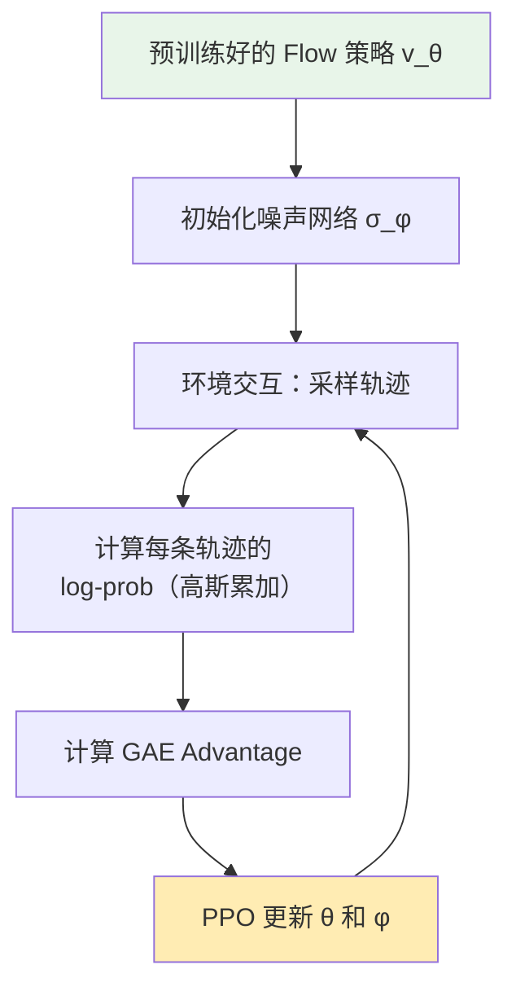
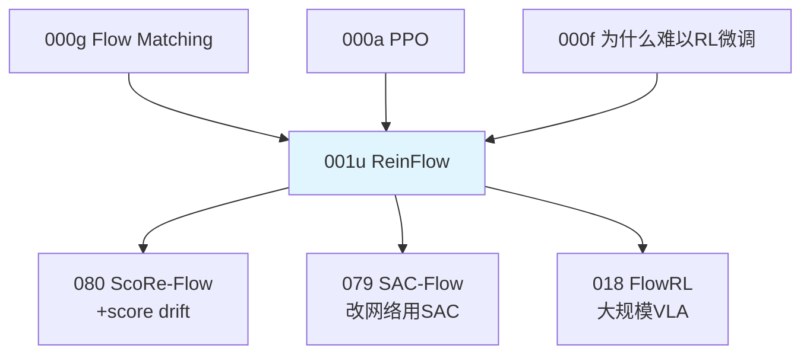

# 前置知识：ReinFlow——Flow 策略的噪声注入 RL 微调

> **一句话**：ReinFlow 是第一个让 Flow Matching 策略能用 PPO 微调的方法。核心思想极其简洁——给确定性 ODE 的每一步加一个学习的噪声 $\sigma$，这样每步转移就变成了高斯分布，log-probability 可以精确计算，PPO 就能直接用了。它是后续所有"Flow + RL"方法（如 ScoRe-Flow、MaxEnt-Flow）的 baseline。

**标签**: `#前置知识` `#ReinFlow` `#Flow Matching` `#噪声注入` `#PPO` `#log-probability`

---

## 相关阅读

在阅读本文前，建议先了解：

- [Flow Matching 与连续归一化流](/前置知识/000g_前置知识_Flow_Matching与连续归一化流) — Flow Matching 的基本原理和推理过程
- [策略梯度与 PPO](/前置知识/000a_前置知识_策略梯度与PPO) — PPO 需要 log-prob 的原因
- [为什么扩散策略难以 RL 微调](/前置知识/000f_前置知识_为什么扩散策略难以RL微调) — Flow/Diffusion 的 log-prob 困难
- [Score Function（密度梯度）与 Score Matching](/前置知识/001t_前置知识_Score_Function密度梯度与Score_Matching) — ReinFlow 利用 score 计算似然的数学基础

读完本文后，可以继续阅读：

- [ScoRe-Flow 精读](/论文综述/080_ScoRe_Flow_Score引导的Flow策略RL微调) — 在 ReinFlow 基础上加 score drift 引导
- [SAC-Flow 精读](/论文综述/079_SAC_Flow_用SAC直接训练Flow策略) — 另一条路线：改网络结构用 off-policy SAC
- [FlowRL 精读](/论文综述/018_FlowRL_Flow_VLA的在线RL微调) — 大规模 VLA 上的 Flow RL 微调

---

## 贯穿全文的例子

> **场景**：一个 2D 平面上的机械臂末端执行器需要到达目标位置。动作 $a \in \mathbb{R}^2$ 表示末端位移。策略是一个 Flow Matching 模型——从高斯噪声出发，经过 4 步 ODE 积分生成动作。
>
> - **预训练阶段**：用示范数据训练好的 flow 策略，成功率 70%
> - **RL 微调目标**：用环境奖励信号将成功率提升到 90%+
> - **核心困难**：Flow 推理是确定性 ODE，没有随机性，PPO 无法使用

---

## 一、问题：为什么 Flow 策略不能直接用 PPO？

### 1.1 PPO 的核心需求

PPO 的 importance ratio 需要计算：

$$
r_t(\theta) = \frac{\pi_\theta(a_t | s_t)}{\pi_{\theta_{\text{old}}}(a_t | s_t)} = \exp\left(\log\pi_\theta(a_t|s_t) - \log\pi_{\theta_\text{old}}(a_t|s_t)\right)
$$

**为什么需要这个公式**：PPO（[详见 PPO 前置知识](/前置知识/000a_前置知识_策略梯度与PPO)）要限制"新策略离旧策略有多远"，而"新旧策略在同一个动作上给出的概率之比"正是衡量这个距离最直接的量。要算这个比值，前提是策略在任意 $(s,a)$ 上的概率密度（log-prob）必须能被精确算出来。

> 一句话直觉：这个比值就是"新策略觉得这个动作有多可能"除以"旧策略觉得这个动作有多可能"——比值大于 1 说明新策略更偏爱这个动作，小于 1 说明新策略更不喜欢它。

**逐项拆解**：

| 符号 | 含义 | 直觉 |
|------|------|------|
| $\pi_\theta(a_t\mid s_t)$ | 更新中的新策略在 $(s_t,a_t)$ 处的概率密度 | "现在的策略觉得这个动作有多合理" |
| $\pi_{\theta_{\text{old}}}(a_t\mid s_t)$ | 更新前旧策略在同一点的概率密度 | "更新前的策略觉得这个动作有多合理" |
| $\exp(\cdot)$ | 指数函数 | 把两个 log-prob 的差值换算回真正的概率比值 |

**数值代入**：假设某个 $(s_t,a_t)$ 处，旧策略 $\log\pi_{\theta_\text{old}} = -2.0$，更新后新策略 $\log\pi_\theta = -1.5$：

$$
r_t(\theta) = \exp(-1.5-(-2.0)) = \exp(0.5) \approx 1.65
$$

说明新策略把这个动作的概率提高到旧策略的约 1.65 倍——PPO 会用这个比值配合优势函数决定要不要限制这次更新（具体机制见 PPO 前置知识里的 clip 部分）。

这要求：给定状态 $s$ 和动作 $a$，能计算策略的 **log-probability** $\log \pi_\theta(a \mid s)$。而 Flow Matching 恰恰在这一点上出了问题——见下一节。

### 1.2 Flow Matching 的问题

Flow Matching 推理是确定性 ODE：

$$
a_{k+1} = a_k + \Delta t \cdot v_\theta(a_k, t_k, s), \quad a_0 \sim \mathcal{N}(0, I)
$$

**这个公式在做什么**：从随机噪声 $a_0$ 出发，沿着网络给出的速度场 $v_\theta$ 一步步走 $K$ 步，最终走到动作 $a_K$——这是 Flow Matching 生成动作的标准推理过程（完整原理见 [Flow Matching 前置知识](/前置知识/000g_前置知识_Flow_Matching与连续归一化流)）。这里 $a_k$ 是第 $k$ 步的中间位置，$\Delta t$ 是固定步长，$v_\theta(a_k,t_k,s)$ 是网络在当前观测 $s$、时刻 $t_k$、位置 $a_k$ 处给出的速度预测。

从同一个初始噪声 $a_0$ 出发，总是得到同一个动作 $a_K$。这是一个**确定性映射** $f_\theta: a_0 \mapsto a_K$——这一点是本节要强调的关键性质，PPO 需要的随机性正因为这一点而缺失。

理论上可以用 change of variables 公式计算 log-prob（[详见 Flow Matching 前置知识第五节](/前置知识/000g_前置知识_Flow_Matching与连续归一化流#五-flow-policy-把-flow-matching-用作机器人策略)）：

$$
\log p_\theta(a_K) = \log p_0(a_0) - \int_0^1 \text{div}(v_\theta)\,\mathrm{d}t
$$

**为什么需要这个公式**：既然 $a_0\to a_K$ 是一个确定性映射，那么根据概率论里"变量替换"的标准结论，$a_K$ 的概率密度可以由起点 $a_0$ 的密度加上这个映射造成的"体积拉伸/压缩"修正项算出来——这个修正项就是速度场散度沿路径的积分。

**逐项拆解**：

| 符号 | 数学含义 | 在本场景中具体是什么 |
|------|---------|---------------------|
| $\log p_0(a_0)$ | 初始噪声分布 $\mathcal N(0,I)$ 在 $a_0$ 处的 log-density | 已知的解析值，标准高斯 log-density |
| $\int_0^1(\cdot)\,\mathrm dt$ | 对连续时间 $t\in[0,1]$ 的积分 | 沿整条 ODE 轨迹累计的修正量，$t=0$ 是起点噪声，$t=1$ 是终点动作 |
| $\text{div}(v_\theta)$ | 速度场 $v_\theta$ 关于位置的散度（雅可比矩阵的迹） | "这一点附近轨迹在向外扩张还是向内收缩"，决定了密度的局部拉伸/压缩比例 |

**数值代入**：$d=2$，$K=4$ 步离散近似这个积分（$\Delta t=0.25$），假设算出每一步的散度分别是 $\text{div}_0=0.3,\ \text{div}_1=0.1,\ \text{div}_2=-0.2,\ \text{div}_3=0.05$，且 $\log p_0(a_0)=-2.28$（标准二维高斯在某点的值）：

$$
\int_0^1\text{div}(v_\theta)\,\mathrm dt \approx \sum_{k=0}^{3}\text{div}_k\times\Delta t = (0.3+0.1-0.2+0.05)\times0.25=0.25\times0.25=0.0625
$$

$$
\log p_\theta(a_K) \approx -2.28 - 0.0625 = -2.3425
$$

**问题**：上面这个积分近似只是为了展示公式的计算逻辑——实际中每算一次 $\text{div}(v_\theta)$（雅可比矩阵的迹）都需要对网络输出的每一维分别做一次反向传播，$d$ 维动作要做 $d$ 次反传，$K$ 步积分总共需要 $O(d\times K)$ 次反向传播。对高维动作空间（如 $d=112$）完全不可行——这正是 ReinFlow 要绕开的计算瓶颈。

**总结困难**：

| 需要 | 现状 | 问题 |
|------|------|------|
| $\log \pi_\theta(a \mid s)$ 可算 | 精确计算需要 $O(d \times K)$ 反传 | 计算不可行 |
| 探索随机性 | 确定性 ODE | 无法探索新动作 |

---

## 二、ReinFlow 的核心思想：给 ODE 加噪声

### 2.1 一步改动解决两个问题

ReinFlow 的解法极其简洁——给 ODE 的每一步加一个噪声：

$$
a_{k+1} = a_k + v_\theta(a_k, t_k, s) \cdot \Delta t + \sigma_\phi(t_k, a_k, s) \cdot \epsilon_k, \quad \epsilon_k \sim \mathcal{N}(0, I)
$$

**为什么需要这个公式**：这是 ReinFlow 的核心——一行改动把确定性 ODE 变成随机 SDE。加了噪声之后，(1) 策略有了探索能力，(2) 每步转移变成了高斯分布，log-prob 精确可算。

> 一句话直觉：原来的 flow 是一辆沿固定轨道行驶的火车（确定性）。ReinFlow 给火车加了"方向盘随机抖动"（噪声），火车不再完全按轨道走——有时偏左有时偏右——但主要方向还是 drift $v_\theta$ 决定的。

**逐项拆解**：

| 项 | 含义 | 作用 |
|---|---|---|
| $a_k$ | 当前中间状态 | 粒子"现在在哪" |
| $v_\theta(a_k, t_k, s) \cdot \Delta t$ | 预训练 flow 的 drift | 确定性运动方向（"轨道"） |
| $\sigma_\phi(t_k, a_k, s)$ | **可学习的噪声强度网络** | 控制每步"抖动"多大 |
| $\epsilon_k \sim \mathcal{N}(0, I)$ | 标准正态随机变量 | "这一步往哪个随机方向抖" |

**关键设计**：$\sigma_\phi$ 是一个小型 MLP（2-3 层），输出一个标量，控制噪声强度。它本身也是可学习的——和 $v_\theta$ 一起被 PPO 优化。

### 2.2 数值例子

$d=2$，4 步积分（$\Delta t = 0.25$）。初始噪声 $a_0 = [-0.5, 0.8]$。

**第 1 步**（$t_0 = 0$）：
- Drift：$v_\theta([-0.5, 0.8], 0, s) = [2.0, 1.5]$
- 噪声强度：$\sigma_\phi = 0.3$
- 随机噪声：$\epsilon_0 = [0.4, -0.7]$（采样结果）
- 更新：$a_1 = [-0.5, 0.8] + [2.0, 1.5] \times 0.25 + 0.3 \times [0.4, -0.7]$
  - $= [-0.5 + 0.5 + 0.12, \; 0.8 + 0.375 - 0.21]$
  - $= [0.12, \; 0.965]$

**第 2 步**（$t_1 = 0.25$）：
- Drift：$v_\theta([0.12, 0.965], 0.25, s) = [1.8, 2.1]$
- 噪声强度：$\sigma_\phi = 0.25$
- 更新：$a_2 = [0.12, 0.965] + [1.8, 2.1] \times 0.25 + 0.25 \times \epsilon_1$
- …以此类推…

最终经过 4 步得到动作 $a_4 = [1.85, 3.02]$。

---

## 三、Log-Probability 的计算

### 3.1 每步是高斯转移

加了噪声后，每步转移的条件分布变成了高斯分布：

$$
p(a_{k+1} | a_k, s) = \mathcal{N}\big(a_{k+1};\; \underbrace{a_k + v_\theta \Delta t}_{\text{均值}},\; \underbrace{\sigma_\phi^2 \cdot I}_{\text{方差}}\big)
$$

**为什么需要这个公式**：每步是高斯意味着 log-prob 有解析形式——多维高斯分布的 log-density 是二次函数，闭式可算。

> 一句话直觉：加了噪声之后，"下一步粒子在哪"不再是确定的，而是服从一个以 drift 为中心、以 $\sigma$ 为宽度的高斯分布。给定实际落点 $a_{k+1}$，算它落在这个高斯里的概率就行了。

**单步 log-prob**：

$$
\log p(a_{k+1} | a_k, s) = -\frac{d}{2}\log(2\pi) - d\log\sigma_\phi - \frac{\|a_{k+1} - (a_k + v_\theta \Delta t)\|^2}{2\sigma_\phi^2}
$$

**逐项拆解**：
- $-\frac{d}{2}\log(2\pi)$：高斯分布的归一化常数（和参数无关）
- $-d\log\sigma_\phi$：噪声越大（$\sigma$ 越大），任何特定点的概率越低
- $-\frac{\|\cdot\|^2}{2\sigma_\phi^2}$：实际落点离"drift 预测"越远，概率越低

### 3.2 整条轨迹的 Log-Prob

整条路径的 log-probability 是各步 log-prob 之和（马尔可夫链性质）：

$$
\log\pi_\theta(a_K | s) = \log p_0(a_0) + \sum_{k=0}^{K-1} \log p(a_{k+1} | a_k, s)
$$

**为什么需要这个公式**：这是 PPO 最终使用的 log-prob。从初始噪声到最终动作的整条路径上，每一步的 log-prob 加起来，就是整个策略的 log-prob。

> 一句话直觉：策略生成一个动作经历了 K 步"随机行走"。每一步落在某个位置的概率都能算——把所有步的 log-概率加起来，就是这条路径（从而这个最终动作）的总 log-概率。

**逐项拆解**：
- $\log p_0(a_0)$：初始噪声的 log-prob = $-\frac{d}{2}\log(2\pi) - \frac{1}{2}\|a_0\|^2$
- $\sum_{k=0}^{K-1}$：对所有中间步求和
- 每一项 $\log p(a_{k+1} \mid a_k, s)$：如 3.1 节的高斯 log-prob

### 3.3 数值例子：完整计算

延续第二节的例子（$d=2$，$K=4$，$\sigma_\phi = 0.3$）：

**初始项**：$\log p_0(a_0) = -\log(2\pi) - \frac{1}{2}(0.25 + 0.64) = -1.837 - 0.445 = -2.282$

**第 1 步**：
- 均值（drift 预测）= $[-0.5, 0.8] + [2.0, 1.5] \times 0.25 = [0.0, 1.175]$
- 实际落点 = $[0.12, 0.965]$
- 偏差 = $[0.12, -0.21]$，$\|\text{偏差}\|^2 = 0.0144 + 0.0441 = 0.0585$
- $\log p = -\log(2\pi) - 2\log(0.3) - \frac{0.0585}{2 \times 0.09}$
  - $= -1.837 + 2.408 - 0.325 = 0.246$

**类似计算第 2-4 步**，假设得到 $[-0.15, 0.31, -0.08]$

**总 log-prob**：$-2.282 + 0.246 + (-0.15) + 0.31 + (-0.08) = -1.956$

这个值可以直接代入 PPO 的 importance ratio 计算！

---

## 四、训练流程

### 4.1 整体算法



**训练的参数**：
- $\theta$（速度场网络 $v_\theta$）：控制"主要方向"
- $\phi$（噪声网络 $\sigma_\phi$）：控制"探索幅度"

两者用同一个 PPO loss 联合优化。

### 4.2 噪声网络 $\sigma_\phi$ 的设计

| 设计选择 | ReinFlow 的做法 | 原因 |
|----------|----------------|------|
| 架构 | 2 层 MLP + Softplus | 保证输出 > 0 |
| 输入 | $(t, a_t, s)$ 或只有 $t$ | 简单版只用时间 $t$ |
| 输出范围 | $[\sigma_{\min}, \sigma_{\max}]$（如 [0.01, 0.5]） | 防止噪声太小（探索不够）或太大（轨迹崩溃） |
| 初始化 | 较小值（如 0.1） | 初期接近预训练行为 |

### 4.3 和 DPPO 的对比

| | ReinFlow | DPPO |
|---|---|---|
| 策略类型 | Flow Matching (ODE + noise) | Diffusion (SDE / DDPM) |
| 推理步数 | 4–10 | 20–100 |
| Log-prob 计算 | 高斯每步精确累加 | ELBO 近似 |
| RL 作用位置 | 整条 ODE 路径 | 可选：去噪步级/轨迹级 |
| 改变 drift？ | ❌（只加噪声，drift $v_\theta$ 不被 score 引导） | ❌ |
| 需要额外网络？ | 一个小型 $\sigma_\phi$ 网络 | 无（直接用 DDPM 的内在随机性） |

---

## 五、ReinFlow 的局限性

### 5.1 核心限制：噪声只控制 variance，不控制 mean

ReinFlow 的 SDE：

$$
\mathrm{d}a_t = v_\theta \,\mathrm{d}t + \sigma_\phi \,\mathrm{d}W
$$

**问题**：噪声 $\sigma_\phi \cdot \epsilon$ 是**各向同性的随机扰动**（每个方向等概率），它不改变 drift $v_\theta$ 的方向。

类比：你给火车加了"方向盘抖动"，但火车的铁轨方向没变。如果铁轨方向本身就错了（flow 预训练不够好），光靠抖动是找不到正确目的地的。

### 5.2 后续方法的改进思路

| 方法 | 在 ReinFlow 基础上加了什么 |
|------|--------------------------|
| **ScoRe-Flow** | 加了 score drift 修正：$\alpha(t) \cdot s_t(a_t)$，能改变 drift 方向 |
| **Score-SDE** | 同样用 score，但把 $\alpha$ 和 $\sigma$ 绑定（不灵活） |
| **SAC-Flow** | 完全不同的路线：改网络结构，用 off-policy SAC |

**ScoRe-Flow 的核心改进**：在 ReinFlow 的 SDE 中增加一项 **score drift 修正**：

$$
\mathrm{d}a_t = \underbrace{v_\theta \,\mathrm{d}t}_{\text{ReinFlow}} + \underbrace{\alpha(t) \cdot s_t(a_t)\,\mathrm{d}t}_{\text{ScoRe-Flow 新增}} + \sigma_\phi \,\mathrm{d}W
$$

Score 项 $s_t(a_t) = \nabla_a \log \rho_t(a)$（[详见 Score Function 前置知识](/前置知识/001t_前置知识_Score_Function密度梯度与Score_Matching)）指向"高概率区域"——相当于给火车换了一条更好的铁轨，而不仅仅是在原铁轨上抖动。

---

## 六、代码直觉（伪代码）

在写 ReinFlow 的推理和 log-prob 计算之前，先明确核心思路：
- **推理**：和标准 Flow 几乎一样，只是每步多加一个高斯噪声
- **Log-prob 计算**：回溯每步的"drift 预测"和"实际落点"的偏差，用高斯 pdf 算概率

```python
# ReinFlow 推理 + log-prob 计算
def reinflow_sample_and_logprob(v_net, sigma_net, obs, K=4):
    """
    v_net: 预训练的速度场网络 v_θ(a, t, s)
    sigma_net: 可学习的噪声强度网络 σ_φ(t)
    obs: 当前观测 s
    K: ODE 步数
    """
    dt = 1.0 / K
    d = action_dim  # 动作维度
    
    # 初始噪声
    a = torch.randn(d)  # a_0 ~ N(0, I)
    log_prob = -0.5 * d * log(2*pi) - 0.5 * a.pow(2).sum()  # log p_0(a_0)
    
    for k in range(K):
        t = k * dt
        drift = v_net(a, t, obs)         # 速度场预测
        sigma = sigma_net(t)              # 噪声强度
        noise = torch.randn_like(a)       # ε_k ~ N(0, I)
        
        # 更新位置（drift + noise）
        mean = a + drift * dt             # 高斯均值
        a_next = mean + sigma * noise     # 实际落点
        
        # 累加 log-prob（高斯 log-density）
        log_prob += (-0.5 * d * log(2*pi) 
                     - d * log(sigma)
                     - 0.5 * ((a_next - mean) / sigma).pow(2).sum())
        
        a = a_next
    
    return a, log_prob  # 最终动作 + 对应的 log-probability
```

**代码关键点说明**：
- `mean = a + drift * dt`：如果没有噪声，粒子就到这里（确定性 ODE 的下一步）
- `a_next = mean + sigma * noise`：实际加了噪声后的位置
- `log_prob` 累加：每步的高斯 log-density 直接加起来（马尔可夫链性质）
- 最终 `log_prob` 就是 PPO 需要的 $\log\pi_\theta(a \mid s)$

---

## 七、总结

### 一句话

> ReinFlow 通过给 Flow ODE 每步加可学习噪声，让确定性策略变成概率策略，从而让 PPO 等策略梯度方法能够使用。它是"Flow + RL"领域的开山 baseline，后续方法在它基础上加入 score drift 引导（ScoRe-Flow）或改用 off-policy 算法（SAC-Flow）来进一步提升。

### 核心贡献与局限

| 贡献 | 局限 |
|------|------|
| 让 Flow 策略能用 PPO | 噪声只是各向同性抖动，不改变 drift 方向 |
| Log-prob 精确可算（高斯累加） | 探索效率有限（依赖随机噪声碰运气） |
| 几乎不增加计算成本 | 不能主动引导策略往"好的方向"走 |
| 和预训练 flow 完全兼容 | 收敛速度慢于有方向引导的方法 |

### 知识链



---

## 延伸阅读

- Deng et al. (2025) "Variational Flow Matching for Graph Generation" ← ReinFlow 的原始论文
- [ScoRe-Flow 精读](/论文综述/080_ScoRe_Flow_Score引导的Flow策略RL微调) ← 在 ReinFlow 基础上加 score drift
- [SAC-Flow 精读](/论文综述/079_SAC_Flow_用SAC直接训练Flow策略) ← 另一条路线
- [Flow Matching 与连续归一化流](/前置知识/000g_前置知识_Flow_Matching与连续归一化流) ← Flow 的基础原理
