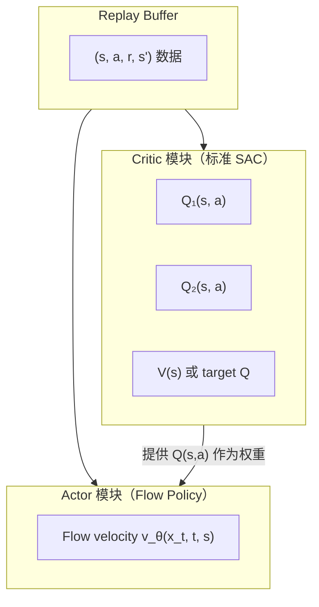

# Q-Weighted Flow Policy：不穿透去噪链的 Flow 策略 RL 训练

> **一句话概括**：Critic 正常用 SAC 训练，Actor 更新时不让 Q 梯度穿过 flow 的多步去噪链——改为从 replay buffer 里采动作，按 Q 值加权做 flow-matching loss。训练稳定，代价是 Actor 更新不如端到端精确。

**知识链接**：

- [AWR 优势加权回归](/前置知识/000u_前置知识_AWR_优势加权回归) — 本文 Actor 更新的数学基础
- [Flow Matching 与连续归一化流](/前置知识/000g_前置知识_Flow_Matching与连续归一化流) — flow-matching loss 的定义
- [SAC (Soft Actor-Critic)](/前置知识/000k_前置知识_SAC_Soft_Actor_Critic) — Critic 的训练方式
- [连续动作与离散动作的梯度回传](/前置知识/001r_前置知识_连续动作与离散动作的梯度回传) — 为什么端到端反传会出问题
- [为什么扩散策略难以 RL 微调](/前置知识/000f_前置知识_为什么扩散策略难以RL微调) — 梯度爆炸问题的更详细讨论

---

## 一、问题：Flow 策略的 RL 训练为什么困难

### 1.1 标准 SAC 对高斯策略的做法

标准 SAC 训练连续动作策略时，Actor 的梯度这样流：

$$
\theta \;\xrightarrow{\text{网络}}\; \mu_\theta, \sigma_\theta \;\xrightarrow{\text{重参数化}}\; a = \mu + \sigma\epsilon \;\xrightarrow{\text{代入 Critic}}\; Q_\phi(s,a)
$$

梯度从 $Q_\phi$ 出发，经过 $a$（一步采样，可导），直接传回 $\theta$。整条链路只有**一步**随机采样，链式法则直接可用。

### 1.2 Flow 策略的采样是多步的

Flow 策略的采样不是一步完成的。它是一个 K 步迭代：

$$
a_0 \sim \mathcal{N}(0, I) \;\xrightarrow{v_\theta(a_0, t_0, s)}\; a_1 \;\xrightarrow{v_\theta(a_1, t_1, s)}\; \cdots \;\xrightarrow{v_\theta(a_{K-1}, t_{K-1}, s)}\; a_K = a_{\text{final}}
$$

每一步都调用同一个 velocity 网络 $v_\theta$，输出叠加到当前位置上。如果要让 Q 梯度穿过这整条链：

$$
\frac{\partial Q_\phi(s, a_K)}{\partial \theta} = \frac{\partial Q_\phi}{\partial a_K} \cdot \frac{\partial a_K}{\partial a_{K-1}} \cdot \frac{\partial a_{K-1}}{\partial a_{K-2}} \cdots \frac{\partial a_1}{\partial \theta}
$$

**这个公式在做什么**：如果想像标准 SAC 那样，让 Actor loss 直接对最终 Q 值求梯度来更新 $\theta$，就必须用链式法则把梯度从 $a_K$ 一路"传回"到 $\theta$——而 $a_K$ 是经过 $K$ 步迭代才从 $\theta$ 算出来的，中间隔了 $K$ 个 $\partial a_{k+1}/\partial a_k$ 雅可比矩阵。

**逐项拆解**：

| 符号 | 数学含义 | 在本场景中具体是什么 |
|------|---------|---------------------|
| $\frac{\partial Q_\phi}{\partial a_K}$ | Critic 对最终动作的梯度 | "Q 值对动作的敏感程度"，一个正常的、单步的梯度 |
| $\frac{\partial a_{k+1}}{\partial a_k}$（共 $K$ 个） | 第 $k$ 步到第 $k+1$ 步的雅可比矩阵 | 每一步 flow 更新对上一步位置的敏感程度，取决于 $v_\theta$ 对输入的梯度 |
| $\frac{\partial a_1}{\partial\theta}$ | 第一步对网络参数的梯度 | 梯度链条最终落到 $\theta$ 上的入口 |

**数值代入**：为了看清"连乘"为什么危险，假设动作是一维标量（$d=1$），$K=10$ 步，每一步的雅可比 $\partial a_{k+1}/\partial a_k$ 都恰好是 $1.3$（略大于 1，意味着这一步会把扰动放大 30%）：

$$
\prod_{k=1}^{9}\frac{\partial a_{k+1}}{\partial a_k} = 1.3^9 \approx 10.6
$$

如果每一步雅可比是 $0.7$（略小于 1）：

$$
0.7^9 \approx 0.04
$$

**含义**：仅仅是每步偏离 1 这么一点点的系数（$1.3$ 或 $0.7$），经过 9 次连乘后就被放大成了 10 倍或压缩成了 0.04 倍。真实网络里 $K$ 可能是 10~100 步，动作是上百维向量（雅可比是矩阵而不是标量），连乘效应只会更极端——这正是"梯度指数级爆炸或消失"的来源，和 RNN 做 BPTT（Backpropagation Through Time）时长序列梯度不稳定是完全相同的数学结构。

### 1.3 两条路的分岔

面对这个问题，社区分成了两条路：

| 路径 | 做法 | 代表工作 |
|------|------|---------|
| **端到端穿透**（hard 路线） | 想办法让 K 步链稳定（GRU/Transformer 重参数化） | SAC-Flow |
| **绕开穿透**（soft 路线） | Q 梯度不穿 flow，用 Q 值当权重做加权 flow-matching | IDQL、GFP、本文讲的方案 |

本文讲的是第二条路——**在实际工程中更成熟、更稳定、应用更广泛**的方案。

---

## 二、完整方案：SAC Critic + Q-Weighted Flow-Matching Actor

### 2.1 系统由两个独立模块组成



**关键设计**：Critic 和 Actor 的训练目标**完全解耦**——Critic 用标准 TD 学习，Actor 用加权 flow-matching loss。Q 梯度**不穿过** flow 的采样过程。

### 2.2 Critic 的训练：标准 SAC，没有任何区别

Critic 的训练和普通 SAC 完全一样。它不关心策略是高斯、diffusion 还是 flow——它只需要 $(s, a, r, s')$ 四元组：

$$
\mathcal{L}_Q(\phi) = \mathbb{E}_{(s,a,r,s')\sim\mathcal{D}} \left[ \left( Q_\phi(s,a) - \underbrace{\left(r + \gamma \min_{i=1,2} Q_{\bar\phi_i}(s', a') - \alpha \log\pi(a'|s')\right)}_{\text{TD target}} \right)^2 \right]
$$

**这个公式在做什么**：让 Critic 网络 $Q_\phi(s,a)$ 的输出逐渐逼近一个"target"——这个 target 由"真实拿到的即时奖励"加上"对下一状态未来价值的估计"构成，这正是标准的 [SAC](/前置知识/000k_前置知识_SAC_Soft_Actor_Critic) TD（时序差分）学习目标，和策略是高斯、diffusion 还是 flow 完全无关。

**逐项拆解**：

| 符号 | 数学含义 | 在本场景中具体是什么 | 典型值/维度 |
|------|---------|---------------------|------------|
| $Q_\phi(s,a)$ | Critic 当前对 $(s,a)$ 的价值估计 | 网络的前向输出，一个标量 | 任意实数 |
| $r$ | 环境返回的即时奖励 | 这一步交互拿到的标量奖励 | 通常归一化到 $[-1,1]$ 或按任务缩放 |
| $\gamma$ | 折扣因子 | 未来奖励打几折 | 典型值 0.99 |
| $\min_{i=1,2}Q_{\bar\phi_i}(s',a')$ | 两个 target 网络里取较小值 | Double-Q 技巧，防止价值高估 | — |
| $\alpha\log\pi(a'\mid s')$ | 熵正则项 | 鼓励策略保持一定随机性，这是 SAC 相比普通 Actor-Critic 的特色项 | $\alpha$ 通常自动调节 |
| $a'\sim\pi_\theta(\cdot\mid s')$ | 从当前 flow 策略在 $s'$ 处采样出的下一步动作 | 需要跑一次完整的 $K$ 步 flow 推理才能得到 | — |
| $\bar\phi$ | target network 的参数 | Critic 参数的滑动平均副本，更新慢，用来稳定训练目标 | — |

**数值代入**：假设 $r=1.0$，$\gamma=0.99$，$\min_{i}Q_{\bar\phi_i}(s',a')=8.0$，$\alpha=0.2$，$\log\pi(a'|s')=-1.5$（熵项，注意 $\log\pi<0$）：

$$
\text{TD target} = 1.0 + 0.99\times8.0 - 0.2\times(-1.5) = 1.0+7.92+0.3=9.22
$$

若当前 $Q_\phi(s,a)=8.5$：

$$
\mathcal{L}_Q(\phi) = (8.5-9.22)^2 = (-0.72)^2 = 0.518
$$

**梯度方向**：因为当前估值 $8.5$ 低于 target $9.22$，梯度会推动 $Q_\phi(s,a)$ 往上调整，逼近 $9.22$。

其中 $a' \sim \pi_\theta(\cdot|s')$ 是从当前 flow 策略采样出来的下一步动作（用于计算 target），$\bar\phi$ 是 target network 的参数。

**注意**：这里 $a'$ 的采样过程（K 步 flow rollout）**只出现在前向传播中**（计算 TD target 需要采样一个动作），不需要对它求梯度。Critic 的梯度只对 $\phi$ 求，不涉及穿过 flow 链。

### 2.3 Actor 的训练：加权 Flow-Matching Loss（核心）

这是本方案和标准 SAC 的唯一区别所在。

**标准 SAC 的 Actor loss**：$\max_\theta \mathbb{E}_{a\sim\pi_\theta}[Q_\phi(s,a) - \alpha\log\pi_\theta(a|s)]$，要求 Q 梯度穿过采样过程。

**本方案的 Actor loss**：把 Q 值当权重，对 replay buffer 里的已有动作做加权 flow-matching：

$$
\mathcal{L}_{\text{actor}}(\theta) = -\mathbb{E}_{(s,a)\sim\mathcal{D}} \left[ w(s,a) \cdot \underbrace{\mathbb{E}_{t\sim U[0,1]} \left\| v_\theta(x_t, t, s) - (a - x_0) \right\|^2}_{\text{标准 flow-matching loss（对动作 }a\text{）}} \right]
$$

**这个公式在做什么**：既然不能让 Q 梯度穿过 K 步 flow 链，那就换一种方式利用 Q 值——不直接对 Q 求梯度，而是拿 Q 值当作"这个动作值得学习的程度"，去加权一个普通的、监督式的 flow-matching 回归 loss（网络学习"从噪声 $x_0$ 走到动作 $a$"这条路径的速度场）。Q 值高的 $(s,a)$ 权重大，网络被更用力地推向"学会生成这个动作"；Q 值低的权重小，网络几乎不理会它。

> 一句话直觉：不再问"怎么调整参数能让 Q 值变大"，而是问"buffer 里哪些动作 Q 值高，就让网络更努力去模仿这些动作，其余的随缘"。

**逐项拆解**：

| 符号 | 数学含义 | 在本场景中具体是什么 | 这一项在做什么 |
|------|---------|---------------------|---------------|
| $(s,a)\sim\mathcal D$ | 从 replay buffer 采样出的状态-动作对 | 训练中通过采 mini-batch 近似这个期望 | 提供"学习素材" |
| $w(s,a)$ | 由 Q 值决定的权重（下面单独给出公式） | 决定这个 $(s,a)$ 样本在 loss 里占多大分量 | 把整个 loss 往"高权重样本"的方向拉 |
| $x_0\sim\mathcal N(0,I)$ | 随机噪声起点 | flow-matching 训练时随机采样的起点 | 决定这条训练路径从哪里出发 |
| $t\sim U[0,1]$ | 均匀采样的时间点 | 每次训练随机取一个中间时刻，让网络学到整条路径上各个位置的速度 | 决定训练路径上取哪个点来算 loss |
| $x_t=(1-t)x_0+t\cdot a$ | 噪声到目标动作的线性插值点 | 网络在这一点被要求预测正确的速度 | 提供输入位置 |
| $v_\theta(x_t,t,s)$ | flow 网络在 $x_t$ 处预测的速度 | 网络的输出 | 被拟合的对象 |
| $(a-x_0)$ | 真实的速度目标（直线路径的方向） | 因为路径是直线插值，速度处处等于"终点减起点" | 回归的标签 |

**数值代入**：$d=2$，某样本 $a=[1.0,0.5]$，$x_0=[-0.5,0.2]$，采样 $t=0.4$：

- 插值点：$x_t = (1-0.4)\times[-0.5,0.2]+0.4\times[1.0,0.5] = [-0.3,0.12]+[0.4,0.2] = [0.1,0.32]$
- 真实速度目标：$a-x_0 = [1.0,0.5]-[-0.5,0.2] = [1.5,0.3]$
- 假设网络预测 $v_\theta(x_t,0.4,s) = [1.2,0.4]$，则 flow-matching loss（内层）$=\|[1.2,0.4]-[1.5,0.3]\|^2 = 0.09+0.01=0.10$
- 假设这个样本的权重 $w(s,a)=2.5$（Q 值较高），则这个样本对总 loss 的贡献是 $2.5\times0.10=0.25$
- 假设另一个样本权重 $w=0.1$（Q 值低）、内层 loss 恰好也是 $0.10$，它对总 loss 的贡献只有 $0.01$

**含义**：两个样本的"拟合难度"（内层 loss）相同，但权重高的样本对梯度的贡献是权重低的样本的 25 倍——这正是"网络被推向更努力学习高 Q 动作"的数学体现。

权重的计算（和 [AWR](/前置知识/000u_前置知识_AWR_优势加权回归) 完全一样）：

$$
w(s,a) = \frac{1}{Z}\exp\left(\frac{Q_\phi(s,a) - V(s)}{\beta}\right) = \frac{1}{Z}\exp\left(\frac{A(s,a)}{\beta}\right)
$$

**为什么是这个形式（为什么用 $\exp$ 而不是直接用 $A(s,a)$ 当权重）**：直接用优势 $A(s,a)$ 当权重会有两个问题——一是 $A$ 可能是负数，负的权重没有意义（相当于"反向学习"这个动作，这不是本方案想要的）；二是 $\exp$ 让"稍微好一点的动作"和"非常好的动作"之间的权重差距被放大，更符合 AWR 的设计初衷（这部分推导的完整来源见 [AWR 前置知识](/前置知识/000u_前置知识_AWR_优势加权回归)）。第四节会给出这个权重公式的完整数值例子。

### 2.4 用人话串一遍完整流程

每一步训练做三件事：

1. **采数据**：用当前 flow 策略在环境里跑，得到 $(s, a, r, s')$，存入 replay buffer
2. **更新 Critic**：从 buffer 采 batch，用标准 SAC TD loss 更新 $Q_\phi$
3. **更新 Actor**：从 buffer 采 batch，用 $Q_\phi$ 算每个 $(s,a)$ 的权重 $w$，然后做加权 flow-matching loss 更新 $v_\theta$

**Actor 更新这一步到底在做什么**：让 flow 网络**更努力地学会生成那些 Q 值高的动作，少花力气去拟合那些 Q 值低的动作**。Q 值高的动作在 loss 里占更大的权重 → 网络被推向生成高 Q 动作。

---

## 三、为什么这样做能 work

### 3.1 训练稳定性

Q 梯度完全不穿过 flow 的 K 步 rollout。Actor 的梯度只流经 flow 网络的一次前向：

$$
\theta \;\to\; v_\theta(x_t, t, s) \;\to\; \|v_\theta - \text{target}\|^2
$$

这和普通的监督学习完全一样，不存在梯度爆炸/消失的问题。

### 3.2 利用了 replay buffer 里的"好动作"

在线训练过程中，replay buffer 里存着策略历史上执行过的各种动作。其中有些拿了高 reward（Q 值高），有些拿了低 reward。加权 flow-matching 本质上是在说：**你（flow 网络）去模仿 buffer 里那些好的动作就行，差的别费力去学**。

### 3.3 对比端到端方案的 trade-off

| 维度 | Q-Weighted（本方案） | 端到端穿透（SAC-Flow） |
|------|---------------------|----------------------|
| 训练稳定性 | ✅ 极稳定 | ⚠️ 需要特殊架构 |
| 理论最优性 | ❌ 只能"挑选"buffer 中的好动作 | ✅ 可以探索 buffer 外的动作 |
| 实现复杂度 | ⭐ 简单 | ⭐⭐⭐ 需要 Flow-G/T |
| 超越数据上界 | ❌ 受限于 buffer 中最好的动作 | ✅ 理论上可以 |
| 采样效率 | ⚠️ 需要 buffer 中有好动作 | ✅ 更 sample-efficient |

**核心 trade-off**：本方案用"策略质量的天花板"换取"训练的绝对稳定性"。如果 buffer 里没有好动作（比如训练初期策略很差），加权 flow-matching 效果有限；但只要 buffer 中积累了足够多样的经验，这个方案非常可靠。

---

## 四、具体数值例子

假设 replay buffer 中有 4 个 $(s, a)$ 对在同一个状态 $s$ 下：

| 动作 | $Q(s,a)$ | $V(s) = 3.0$ | $A = Q - V$ | $w = \exp(A/\beta)$，$\beta=1$ |
|------|----------|--------------|------------|------------------------------|
| $a_1 = (0.3, 0.5)$ | 5.0 | 3.0 | +2.0 | $e^2 = 7.39$ |
| $a_2 = (0.1, -0.2)$ | 3.5 | 3.0 | +0.5 | $e^{0.5} = 1.65$ |
| $a_3 = (-0.4, 0.1)$ | 2.0 | 3.0 | -1.0 | $e^{-1} = 0.37$ |
| $a_4 = (0.8, -0.6)$ | 1.0 | 3.0 | -2.0 | $e^{-2} = 0.14$ |

归一化后权重：$(0.77,\; 0.17,\; 0.04,\; 0.01)$

Actor 更新时：
- $a_1$ 的 flow-matching loss 贡献占 77%——网络被强力推向"能生成 $a_1$ 这类动作"
- $a_4$ 的贡献几乎为 0——网络不浪费容量去拟合这个差动作

经过多轮更新后，flow 网络的采样分布会逐渐向高 Q 区域集中。

---

## 五、工程实操：PyTorch 伪代码

```python
# === Critic 更新（标准 SAC，和策略类型无关）===
def update_critic(batch, q_net, target_q_net, flow_policy, alpha):
    s, a, r, s_next, done = batch
    
    # 从 flow 策略采样下一步动作（前向，不求梯度）
    with torch.no_grad():
        a_next = flow_policy.sample(s_next)  # K 步 flow rollout
        q_target = r + (1 - done) * gamma * (
            torch.min(target_q_net(s_next, a_next)) - alpha * flow_policy.log_prob(a_next, s_next)
        )
    
    q_pred = q_net(s, a)
    critic_loss = F.mse_loss(q_pred, q_target)
    return critic_loss


# === Actor 更新（Q-Weighted Flow-Matching）===
def update_actor(batch, q_net, value_net, flow_policy, beta):
    s, a = batch.states, batch.actions  # 从 replay buffer 采
    
    # 1. 计算权重（不对 flow 求梯度）
    with torch.no_grad():
        q_values = q_net(s, a)
        v_values = value_net(s)           # 或用 E[Q] 近似
        advantages = q_values - v_values
        weights = torch.exp(advantages / beta)
        weights = weights / weights.mean()  # 归一化
    
    # 2. 加权 flow-matching loss
    t = torch.rand(s.shape[0], 1)         # 随机时间步
    x0 = torch.randn_like(a)              # 噪声起点
    xt = (1 - t) * x0 + t * a             # 插值
    target_v = a - x0                     # 真实 velocity（直线）
    
    pred_v = flow_policy.velocity(xt, t, s)  # 网络预测
    fm_loss = ((pred_v - target_v) ** 2).sum(dim=-1)  # 每样本 loss
    
    # 3. 加权求和
    actor_loss = (weights * fm_loss).mean()
    return actor_loss
```

**关键观察**：`update_actor` 中，`flow_policy` 只被调用了**一次前向**（`velocity(xt, t, s)`），没有 K 步 rollout，没有梯度穿透多步链。

---

## 六、这个方案在实际系统中的位置

### 6.1 哪些工作用了这个思路

| 工作 | 具体做法 | 场景 |
|------|---------|------|
| **IDQL** | IQL 训练 Q/V → 加权 diffusion loss | 离线 RL |
| **GFP (Guided Flow Policy)** | 多步 flow + 单步 actor，加权 BC 互相引导 | 离线 RL |
| **CO-RFT** | chunk-level AWR，用 advantage 加权 flow-matching | VLA 离线微调 |
| **ARFM** | 自适应权重的 flow-matching offline RL | Flow VLA |
| **GR00T N1 handoff** | SAC Critic + Q-weighted flow actor | 在线 manipulation |

### 6.2 和 DPPO（Diffusion Policy Policy Optimization）的区别

DPPO 走的是**第三条路**：不用 Q 梯度穿透，也不用加权 flow-matching，而是用 **PPO 的 clip 机制** + 把去噪链的每一步当成一个 MDP 的 action。

| | Q-Weighted（本文） | DPPO | SAC-Flow |
|--|-------------------|------|----------|
| Actor loss | 加权 flow-matching | PPO clip on denoising MDP | $\max Q(s, a_K)$ 端到端 |
| Q 梯度穿 flow？ | ❌ | ❌ | ✅ |
| 需要在线 rollout？ | 需要（填 buffer） | 需要（on-policy） | 需要 |
| 稳定性 | ⭐⭐⭐⭐⭐ | ⭐⭐⭐⭐ | ⭐⭐⭐ |
| 表达能力利用 | ⚠️ 只拟合 buffer 中动作 | ✅ 探索性好 | ✅ 最充分 |

---

## 七、总结

| 要素 | 内容 |
|------|------|
| 核心思想 | Critic 和 Actor 解耦：Critic 正常 TD 训练，Actor 用 Q 值加权的 flow-matching loss |
| 为什么不端到端 | flow 的 K 步 rollout ≡ RNN 的 BPTT，梯度爆炸 |
| Actor loss | $\mathcal{L} = \sum_i w_i \cdot \|v_\theta(x_t^i, t, s_i) - (a_i - x_0^i)\|^2$，其中 $w_i = \exp(A_i/\beta)$ |
| 优点 | 极稳定、实现简单、可直接复用 SAC 的 Critic 代码 |
| 缺点 | Actor 只能向 buffer 中的好动作靠拢，无法探索 buffer 外的空间 |
| 适用场景 | 有充足 replay 数据、要求稳定收敛、不需要极致 sample efficiency |

---

## 延伸阅读

- [AWR 优势加权回归](/前置知识/000u_前置知识_AWR_优势加权回归) — Actor 更新的数学基础
- [SAC (Soft Actor-Critic)](/前置知识/000k_前置知识_SAC_Soft_Actor_Critic) — Critic 的训练方法
- [Flow Matching 与连续归一化流](/前置知识/000g_前置知识_Flow_Matching与连续归一化流) — flow-matching loss 的推导
- [为什么扩散策略难以 RL 微调](/前置知识/000f_前置知识_为什么扩散策略难以RL微调) — K 步链梯度问题的完整讨论
- [IDQL 精读](/论文综述/005_IDQL_隐式扩散Q学习) — Q-Weighting 路线的代表论文
- [ReinFlow：Flow 策略 RL 微调](/前置知识/001u_前置知识_ReinFlow_Flow策略的噪声注入RL微调) — 另一条路：用 PPO 直接训练 flow
