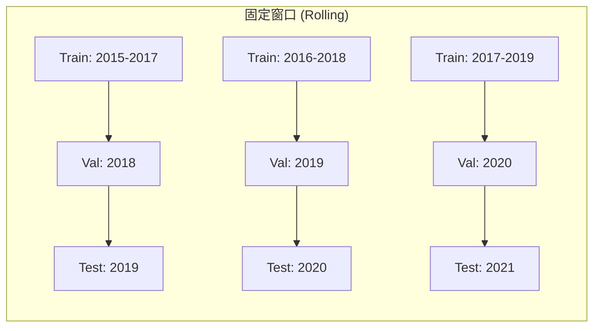

# 前置知识：Walk-Forward 滚动回测

> **一句话**：Walk-Forward 是唯一正确的时间序列回测方法——严格按时间顺序，用过去的数据训练、用未来的数据测试，滚动前进，绝不偷看未来信息。

**知识链接**：
- [截面选股模型与评价指标](/前置知识/001w_前置知识_截面选股模型与评价指标) — Walk-Forward 回测什么
- [分布漂移与在线适配](/前置知识/001z_前置知识_分布漂移与在线适配) — 为什么需要定期重训
- [LightGBM 在量化选股中的应用](/前置知识/001y_前置知识_LightGBM在量化选股中的应用) — Walk-Forward 的具体实操对象

---

## 贯穿全文的例子

> 你有 CSI300 成分股 2015-2024 年的日频数据。你想评估一个截面选股模型"在未来的真实表现"。
> 
> - 错误做法：用全部 10 年数据训练，然后在**同一批数据**上看 IC → 严重过拟合
> - 正确做法：Walk-Forward——模拟"在每个时间点，你只能用过去的数据"这一现实约束

---

## 一、为什么需要 Walk-Forward（时间序列不能随机划分）

### 1.1 图像分类 vs 股票预测：数据划分的本质差异

在图像分类中，随机划分 80%/10%/10% 为 train/val/test 没有问题——图片之间没有时间依赖关系。

但金融时间序列有一个**致命特性**：**未来信息会泄露到过去**。

具体场景：如果你把 2020 年 3 月（COVID 暴跌）的数据放进训练集，模型学到了"这种特征模式 = 暴跌"。然后你在 2020 年 2 月的"测试集"上评估——模型表现极好，因为它其实已经"知道" 3 月会暴跌。但在真实交易中，你在 2 月时根本不知道 3 月会发生什么。

**核心原则**：测试集中的每一天，模型训练时不能使用该天及之后的任何数据。

### 1.2 前视偏差（Look-Ahead Bias）

前视偏差 = 回测中使用了"在当时不可能获得的信息"。常见来源：

| 偏差类型 | 错误操作 | 正确操作 |
|----------|----------|----------|
| 数据泄露 | 用未来数据训练 | 严格按时间切分 |
| 存活者偏差 | 只用现在还在上市的股票 | 包含历史上所有股票（含退市） |
| 因子泄露 | 用当天收盘价计算特征并交易 | 用 T-1 日数据预测 T 日 |
| 参数优化泄露 | 在全部数据上调超参 | 只在训练/验证集上调参 |

---

## 二、Walk-Forward 的具体操作

### 2.1 固定窗口 vs 扩展窗口




| 方式 | 训练集 | 优点 | 缺点 |
|------|--------|------|------|
| 固定窗口（Rolling） | 最近 N 年 | 适应市场变化，忘掉过时模式 | 数据量少 |
| 扩展窗口（Expanding） | 所有历史数据 | 数据量大，学到更多模式 | 可能被旧模式误导 |

**实践建议**：A 股市场风格切换快，固定窗口（3 年训练）通常优于扩展窗口。如果使用 DoubleAdapt 等漂移适配方法，可以用扩展窗口 + 在线适配。

### 2.2 具体步骤（以年度滚动为例）

以下是 FinRL 竞赛和 Qlib 常用的滚动设置：

**Step 1**：定义窗口参数
- 训练期：3 年（约 750 个交易日）
- 验证期：1 年（约 252 个交易日）
- 测试期：1 年（252 个交易日）
- 滚动步长：1 年

**Step 2**：执行滚动

| 轮次 | 训练期 | 验证期 | 测试期 |
|------|--------|--------|--------|
| 1 | 2015.01 - 2017.12 | 2018.01 - 2018.12 | 2019.01 - 2019.12 |
| 2 | 2016.01 - 2018.12 | 2019.01 - 2019.12 | 2020.01 - 2020.12 |
| 3 | 2017.01 - 2019.12 | 2020.01 - 2020.12 | 2021.01 - 2021.12 |
| 4 | 2018.01 - 2020.12 | 2021.01 - 2021.12 | 2022.01 - 2022.12 |

**Step 3**：在每一轮中
1. 在训练期数据上训练模型
2. 在验证期上调超参（early stopping epoch、学习率等）
3. 用最终模型在测试期上"预测"——这些预测生成交易信号
4. 计算测试期的 IC/RankIC/收益/Sharpe

**Step 4**：汇总所有轮次的测试期结果
- 把所有轮次的测试期拼接起来（2019-2022），计算整体表现
- 或者报告每轮的均值和标准差

### 2.3 FinRL 竞赛的更短滚动周期

FinRL 2023-2025 竞赛使用更激进的滚动设置：

- 训练：30 个交易日
- 验证：5 个交易日
- 测试：5 个交易日
- 每 5 天滚动一次

这种短周期滚动更贴近"自适应模型"的场景——模型只用最近一个月的数据，快速适应市场变化。但代价是训练数据极少，只有树模型和参数少的模型能在这种设置下工作。

---

## 三、Walk-Forward 的代码实现骨架

核心思路是：一个 for 循环遍历时间窗口，每轮独立训练+测试。

```python
import pandas as pd
import numpy as np
from typing import List, Tuple

class WalkForwardBacktest:
    """Walk-Forward 滚动回测框架"""
    
    def __init__(
        self,
        train_days: int = 750,    # 3年
        val_days: int = 252,      # 1年
        test_days: int = 252,     # 1年
        step_days: int = 252,     # 每年滚动一次
    ):
        self.train_days = train_days
        self.val_days = val_days
        self.test_days = test_days
        self.step_days = step_days
    
    def generate_splits(self, dates: pd.DatetimeIndex) -> List[Tuple]:
        """生成所有 (train, val, test) 时间区间"""
        splits = []
        total_need = self.train_days + self.val_days + self.test_days
        
        start = 0
        while start + total_need <= len(dates):
            train_end = start + self.train_days
            val_end = train_end + self.val_days
            test_end = val_end + self.test_days
            
            splits.append((
                dates[start:train_end],      # 训练日期
                dates[train_end:val_end],     # 验证日期
                dates[val_end:test_end],      # 测试日期
            ))
            start += self.step_days
        
        return splits
    
    def run(self, model_class, data, dates):
        """执行完整滚动回测"""
        splits = self.generate_splits(dates)
        all_predictions = []
        
        for i, (train_dates, val_dates, test_dates) in enumerate(splits):
            print(f"Round {i+1}: train {train_dates[0]}~{train_dates[-1]}, "
                  f"test {test_dates[0]}~{test_dates[-1]}")
            
            # 1. 准备当轮数据
            train_data = data.loc[train_dates]
            val_data = data.loc[val_dates]
            test_data = data.loc[test_dates]
            
            # 2. 训练（只能看到 train + val 的数据）
            model = model_class()
            model.fit(train_data, val_data)
            
            # 3. 在测试期逐日预测
            predictions = model.predict(test_data)
            all_predictions.append(predictions)
        
        # 4. 汇总评估
        return pd.concat(all_predictions)
```

**关键设计点**：
- `model.fit()` 只接收 `train_data` 和 `val_data`，绝不触碰 `test_data`
- 每一轮重新创建 `model`——不继承上一轮的参数（除非你明确设计了增量学习）
- 预测是**逐日**的：在 test 期的第 1 天，模型不能看到 test 期第 2 天的数据

---

## 四、常见陷阱

### 4.1 特征标准化泄露

```python
# 错误：用全部数据的均值/方差来标准化
scaler.fit(all_data)  # ← 包含了未来数据的统计量！

# 正确：只用训练期的统计量
scaler.fit(train_data)
test_data_normalized = scaler.transform(test_data)
```

### 4.2 多重随机种子

模型有随机性（初始化、dropout、mini-batch 顺序）。单次实验结果可能是运气。

**Qlib 的做法**：每个模型跑 **20 个随机种子**，报告均值和标准差。这揭示了一个重要事实——普通 Transformer 在 Alpha158 因子集上的 20 种子均值年化只有 2.73%（±大方差），而 DoubleEnsemble 有 11.58%。如果只跑 1 个种子，你可能恰好抽到 Transformer 表现好的那次，产生错误结论。

**最低要求**：至少 5 个种子，报告均值 ± 标准差。

### 4.3 测试期不够长

- 测试期太短（如只有 1 个月）→ 结果受市场环境影响大，不具统计意义
- 测试期应**覆盖不同市场状态**：牛市、熊市、震荡市都要有
- 理想：测试期 >= 2 年，或者覆盖至少一个完整牛熊周期

### 4.4 交易成本假设

| 成本假设 | 适用场景 | 大致数值 |
|----------|----------|----------|
| 无成本 | **仅用于调试，不可作为最终结果** | 0 |
| A 股日频 | 印花税 0.1% + 佣金 0.02% + 滑点 0.05% | 单边 15-20 bps |
| A 股周频 | 同上，但换手率低 | 年化成本更低 |
| 加密货币 | maker 0.02% + 滑点 | 单边 2-5 bps |

---

## 五、Walk-Forward 的变体

### 5.1 Purged Walk-Forward

训练期和测试期之间加一个"间隔期"（purge gap），防止特征窗口横跨训练/测试边界导致信息泄露。

如果特征使用了过去 20 天的数据（如 20 日均线），那么测试期第 1 天的特征包含训练期最后 20 天的信息。虽然这不算"未来信息"，但可能导致模型在测试期开头表现虚高。

解决方案：训练期和测试期之间空出 20 天（与特征窗口等长）。

### 5.2 Combinatorial Purged Cross-Validation (CPCV)

Marcos López de Prado 提出的方法：把时间序列切成 N 段，每次取 1 段做测试、其他段做训练（但要 purge 边界）。这样可以得到更多测试样本，但计算量大。

---

## 六、总结

| 要点 | 内容 |
|------|------|
| 核心原则 | 训练时绝不使用未来数据 |
| 标准设置 | 3年训练 + 1年验证 + 1年测试，年度滚动 |
| 多种子 | 至少 5 个种子，报告均值±标准差 |
| 交易成本 | A 股至少 15bps 单边 |
| 测试期 | 越长越好，覆盖牛熊 |
| 特征标准化 | 只用训练期统计量 |

---

## 延伸阅读

- [截面选股模型与评价指标](/前置知识/001w_前置知识_截面选股模型与评价指标) — Walk-Forward 评估的核心指标
- [分布漂移与在线适配](/前置知识/001z_前置知识_分布漂移与在线适配) — 为什么固定模型在滚动测试中表现会衰退
- [DoubleAdapt 精读](/论文综述/084_DoubleAdapt_分布漂移双重适配) — 在 Walk-Forward 框架内的在线适配方案
