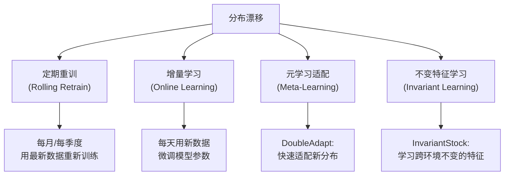

# 前置知识：分布漂移与在线适配（Distribution Shift）

> **一句话**：金融市场的统计规律在不断变化——去年有效的因子今年可能失效。分布漂移（Distribution Shift）就是这种"规则在变"的数学描述，而在线适配是让模型跟上变化的方法。

**知识链接**：
- [截面选股模型与评价指标](/前置知识/001w_前置知识_截面选股模型与评价指标) — 漂移导致 IC 下降
- [Walk-Forward 滚动回测](/前置知识/001x_前置知识_Walk_Forward滚动回测) — 滚动重训是最朴素的应对漂移方案
- [LightGBM 在量化选股中的应用](/前置知识/001y_前置知识_LightGBM在量化选股中的应用) — 树模型面对漂移的表现

---

## 贯穿全文的例子

> 2019-2021 年 A 股"核心资产牛市"：白酒、医药、新能源龙头股持续上涨。在这个时期训练的模型学到了"低波动 + 高 ROE + 大市值 → 涨"的规律。
> 
> 2022 年风格急转——龙头股暴跌 30-50%，小微盘股反而强势。同一个模型用 2022 年以前数据训练后在 2022 年测试，IC 从 0.06 直接掉到 -0.02（完全反向）。
> 
> 这就是分布漂移。

---

## 一、分布漂移的数学定义

### 1.1 联合分布的分解

训练一个截面选股模型时，隐含的假设是：

$$
P_{\text{train}}(X, Y) = P_{\text{test}}(X, Y)
$$

> **这个公式在说什么**：训练集和测试集的数据来自同一个联合分布——也就是说，训练时看到的"特征-收益"配对规律，测试时依然成立。

**逐项拆解**：

| 符号 | 含义 | 具体是什么 |
|------|------|-----------|
| $X$ | 特征随机变量 | 股票的因子向量（如 ROE、波动率、换手率） |
| $Y$ | 标签随机变量 | 股票的未来收益率 |
| $P_{\text{train}}(X,Y)$ | 训练期数据的联合分布 | 训练用的那几年历史数据里，"什么特征配什么收益"的统计规律 |
| $P_{\text{test}}(X,Y)$ | 测试期数据的联合分布 | 实盘/测试期数据里同样的统计规律 |
| $=$ | 假设两者相等 | 机器学习"泛化"成立的前提——如果这条不成立，训练好的模型在测试期就不一定有效 |

**数值代入**：用一个简化的二元例子说明假设成立/不成立分别是什么样。假设特征 $X$ 只取"高 ROE"或"低 ROE"两档，标签 $Y$ 只取"涨"或"跌"两档：

- 训练期统计：$P_{\text{train}}(Y=\text{涨} \mid X=\text{高ROE}) = 0.7$（高 ROE 股票 70% 概率上涨）
- 若假设成立，测试期应该也有：$P_{\text{test}}(Y=\text{涨} \mid X=\text{高ROE}) \approx 0.7$
- 但 1.3 节的例子里，2022 年实际观察到的是 $P_{\text{test}}(Y=\text{涨} \mid X=\text{高ROE}) \approx 0.3$——两个条件概率相差了 0.4，说明假设被违反了，这就是概念漂移

**为什么用这个形式表达**：机器学习的泛化理论（无论是 ERM 还是 PAC 学习框架）都建立在"训练分布=测试分布"这条假设上——模型在训练集上学到的经验风险最小化解，只有在这条假设成立时才能保证在测试集上同样有效。把它写成分布相等的公式，是为了后面能精确地定义"漂移"就是这条等式被打破，并进一步拆解成两种打破的方式（见下）。

但金融市场违反这个假设。联合分布可以拆成：

$$
P(X, Y) = P(Y|X) \cdot P(X)
$$

> **这个公式在做什么**：把一个联合分布拆成"特征本身长什么样"和"给定特征后标签怎么分布"两部分，这样才能精确区分漂移到底发生在哪一部分。

**逐项拆解**：

| 符号 | 含义 | 具体是什么 |
|------|------|-----------|
| $P(X,Y)$ | 特征和标签的联合分布 | 描述"某种特征配某种收益"出现的概率 |
| $P(X)$ | 特征的边缘分布 | 只看特征本身的统计规律，比如"这个市场里波动率的分布是什么样" |
| $P(Y\mid X)$ | 给定特征后标签的条件分布 | "已知某只股票是高 ROE，它未来涨跌的概率分布是什么" |
| $\cdot$ | 乘法 | 概率论的链式法则：联合分布 = 边缘分布 × 条件分布，对任意两个随机变量都成立 |

**数值代入**：延续上面的二元例子。假设训练期市场里高 ROE 股票占比 40%（$P(X=\text{高ROE})=0.4$），高 ROE 股票上涨概率 70%（$P(Y=\text{涨}\mid X=\text{高ROE})=0.7$），那么"高 ROE 且上涨"这个联合事件的概率是：

$$
P(X=\text{高ROE}, Y=\text{涨}) = P(Y=\text{涨}\mid X=\text{高ROE}) \times P(X=\text{高ROE}) = 0.7 \times 0.4 = 0.28
$$

如果测试期变成：高 ROE 股票占比升到 60%（$P(X)$ 变了，协变量漂移），但上涨概率依然是 70%（$P(Y|X)$ 没变），联合概率就变成 $0.7\times0.6=0.42$；如果测试期高 ROE 占比不变但上涨概率跌到 30%（概念漂移），联合概率变成 $0.3\times0.4=0.12$。同样是联合分布变了，但背后的原因（该调整特征处理方式，还是该调整标签映射关系）完全不同——这就是为什么要把 $P(X,Y)$ 拆开看。

**为什么是这个形式**：直接监控 $P(X,Y)$ 整体是否变化没法指导应对方案——不知道该重新做特征标准化（应对 $P(X)$ 变化）还是该重新训练模型的映射关系（应对 $P(Y|X)$ 变化）。拆成两项之后，1.1 节表格里的"协变量漂移"和"概念漂移"才能被精确定义为分别对应哪一项发生了变化，后续第二节的应对方法（如 DoubleAdapt 的两个适配器）也是分别针对这两种漂移设计的。

漂移可能发生在两个地方：

| 漂移类型 | 数学描述 | 金融含义 | 具体例子 |
|----------|----------|----------|----------|
| **协变量漂移** | $P_{\text{train}}(X) \neq P_{\text{test}}(X)$ | 市场特征的统计分布变了 | 2020 年前波动率均值 15%，2022 年变成 30% |
| **概念漂移** | $P_{\text{train}}(Y|X) \neq P_{\text{test}}(Y|X)$ | 同样的特征→不同的结果 | 2019 年"高 ROE"→涨，2022 年"高 ROE"→跌 |

### 1.2 为什么金融市场的漂移特别严重

| 原因 | 说明 |
|------|------|
| 政策驱动 | 央行加息/降息直接改变所有资产的定价逻辑 |
| 资金风格轮动 | 机构资金从大盘切换到小盘，或从成长切到价值 |
| 因子拥挤 | 某因子被太多人用后，超额收益消失甚至反转 |
| 市场微观结构变化 | 量化交易占比从 10% 增到 50%，改变了价格形成机制 |
| 黑天鹅事件 | COVID、地缘冲突等创造全新的市场环境 |

### 1.3 数值例子：概念漂移

假设一个简单的线性模型 $\hat{y} = w_1 \cdot x_{\text{ROE}} + w_2 \cdot x_{\text{vol}}$：

**2019-2021 年训练得到**：$w_1 = +0.5$（高 ROE 涨），$w_2 = -0.3$（低波动涨）

**2022 年实际关系**：$w_1^* = -0.2$（高 ROE 反而跌），$w_2^* = +0.4$（高波动涨）

模型在 2022 年的预测完全反向——这不是模型的"bug"，而是市场规则本身变了。

---

## 二、应对分布漂移的方法谱系

### 2.1 从简单到复杂的应对方案



### 2.2 方法对比

| 方法 | 代表 | 核心思想 | 适应速度 | 计算成本 | 实际效果 |
|------|------|----------|----------|----------|----------|
| 定期重训 | Qlib 标准流程 | 每隔 N 天重新训练整个模型 | 慢（滞后 N 天） | 高 | 基线 |
| 增量微调 | SGD fine-tune | 每天用新数据更新几步 | 快 | 低 | 容易灾难性遗忘 |
| **DoubleAdapt** | KDD 2023 | 元学习：同时适配数据分布和模型参数 | 快 | 中 | 超额 12.96% vs 重训 9.33% |
| **InvariantStock** | TMLR 2024 | 学习在所有市场状态下都有效的特征 | 不需要适配 | 高（训练时） | Sharpe 3.72（需独立复现） |
| 市场状态门控 | HIST/TRA | 识别当前市场状态，切换对应模型 | 中 | 中 | 年化 9-10% |

---

## 三、定期重训（Rolling Retrain）：最朴素的方案

### 3.1 做法

就是 [Walk-Forward](/前置知识/001x_前置知识_Walk_Forward滚动回测) 本身：每隔固定周期（月/季/年），用最近的数据重新训练一个全新模型，丢弃旧模型。

### 3.2 局限

1. **滞后性**：如果每季度重训，在季度中间发生风格切换，模型要"忍"到下次重训才能纠正
2. **不连续**：新旧模型切换时可能产生交易信号跳变
3. **计算浪费**：每次从头训练，不利用之前模型的知识

### 3.3 Qlib 的量化数据

GRU + 每月重训：CSI300 超额年化 **9.33%**，IR 1.14  
GRU + DoubleAdapt：CSI300 超额年化 **12.96%**，IR 1.51

差距 = 3.63 个百分点年化超额收益，**仅仅来自更好的适配方法**。

---

## 四、DoubleAdapt：双重适配的核心思想

### 4.1 问题定义

在截面选股中，每天看到新的数据 $(X_t, Y_t)$。模型需要：
1. 适配**输入分布**的变化（协变量漂移）：今天的特征和训练时统计性质不同
2. 适配**标签映射**的变化（概念漂移）：同样的特征→不同的收益

### 4.2 DoubleAdapt 的两个适配器

**为什么需要这两个公式**：第一节把漂移拆成了协变量漂移（$P(X)$ 变了）和概念漂移（$P(Y|X)$ 变了）。DoubleAdapt 的设计思路就是"一个漂移配一个适配器"——用一个网络专门应对特征分布的变化，再用另一个网络专门应对映射关系的变化，两者独立训练、独立起作用。

$$
\tilde{X}_t = \text{DataAdapter}_\phi(X_t, \; \text{context}_t)
$$

> **一句话直觉**：把今天这批"看起来和训练时不一样"的特征，重新映射成模型比较熟悉的样子。

**逐项拆解**：

| 符号 | 含义 | 具体是什么 |
|------|------|-----------|
| $X_t$ | 第 $t$ 天的原始特征 | 当天所有股票的因子向量，来自可能已经漂移的新分布 |
| $\text{context}_t$ | 最近 $k$ 天的上下文数据 | 提供"当前市场处于什么状态"的信息，比如最近 $k=20$ 天的因子统计量 |
| $\text{DataAdapter}_\phi$ | 数据适配器网络 | 一个轻量的可学习函数（参数记为 $\phi$），输入原始特征和上下文，输出调整后的特征 |
| $\tilde{X}_t$ | 适配后的特征 | 被"对齐"到训练时特征分布的新特征，交给下游模型使用 |

**数值代入**：假设某个波动率因子在训练期均值为 15%、标准差为 5%，测试期这一天由于市场整体波动加剧，原始特征值 $X_t=\text{波动率}=35\%$（明显超出了训练分布常见范围）。DataAdapter 观察到 $\text{context}_t$ 里最近 20 天波动率均值已经上移到 30%，于是学习到一个变换（可以简化理解为按最近上下文重新做标准化）：$\tilde{X}_t = (X_t - 30\%)/10\% \times 5\% + 15\% = 0.5 \times 5\% + 15\% = 17.5\%$——把这个"看起来异常"的原始值调整成了模型更熟悉的、和训练期同一量级的数值，再送进下游模型预测。

$$
\tilde{\theta}_t = \text{ModelAdapter}_\psi(\theta_{\text{base}}, \; \text{context}_t)
$$

> **一句话直觉**：不改变模型的基础参数，而是根据当前市场状态给它算一个"临时补丁"，用补丁后的参数做当天的预测。

**逐项拆解**：

| 符号 | 含义 | 具体是什么 |
|------|------|-----------|
| $\theta_{\text{base}}$ | 基础模型参数 | 在历史数据上预先训练好、固定不变的参数 |
| $\text{context}_t$ | 同上 | 最近 $k$ 天数据提供的市场状态信息 |
| $\text{ModelAdapter}_\psi$ | 模型适配器网络 | 另一个轻量网络（参数记为 $\psi$），输出对 $\theta_{\text{base}}$ 的增量调整 $\Delta\theta_t$ |
| $\tilde{\theta}_t$ | 适配后的模型参数 | $\tilde{\theta}_t = \theta_{\text{base}} + \Delta\theta_t$，当天实际用来预测的参数 |

**数值代入**：简化到一个只有一个权重的线性模型 $\hat{y} = \theta \cdot x_{\text{ROE}}$。假设 $\theta_{\text{base}}=0.5$（历史上"高 ROE 涨"的规律）。ModelAdapter 观察到最近 $k$ 天 context 显示"高 ROE 股票开始跑输"，输出增量 $\Delta\theta_t = -0.3$，于是 $\tilde{\theta}_t = 0.5 + (-0.3) = 0.2$——当天用来预测的模型权重从"高 ROE 权重很大"调整成"高 ROE 权重很小"，比重新训练整个模型快得多，也比什么都不调（继续用 $\theta_{\text{base}}=0.5$）更贴近当前市场。

**为什么是这个形式**：如果只用一个适配器同时处理特征和参数，两种漂移的信号会互相干扰——模型没法区分"是特征本身变了"还是"特征-收益的映射关系变了"。拆成两个独立的适配器，每个只负责第一节里定义的一种漂移，训练时也可以分别针对性优化（4.3 节的元学习训练），这是 DoubleAdapt 名字里"Double"的来源。

### 4.3 元学习训练方式

DoubleAdapt 用 MAML 风格的元学习来训练两个适配器：

1. 在训练期内模拟"分布漂移"：把训练数据按时间切成多段，每段当作一个"task"
2. 对每个 task：先用 support set 做适配（inner loop），再在 query set 上评估
3. 外层循环优化适配器参数 $\phi, \psi$，让它们能快速适配任何新分布

**为什么这比直接微调好？** 直接微调（SGD few-step）容易过拟合到最近几天的噪声。元学习训练的适配器学会了"什么样的调整是有效的、什么是噪声"——泛化能力更强。

---

## 五、InvariantStock：另一条路——学习不变特征

### 5.1 核心哲学

与 DoubleAdapt "适配变化"不同，InvariantStock 的思路是：**找到在所有市场环境下都有效的特征表示**。

灵感来自因果推断中的"不变风险最小化"（IRM）：如果某个特征在牛市、熊市、震荡市中都和收益正相关，那它大概率是"因果性"的而非"虚假相关"。

### 5.2 数学框架

定义多个"环境"（如按年份划分，或按市场状态划分）。学习一个特征提取器 $\Phi$，使得：

**为什么需要这个公式**：如果只最小化所有环境数据合在一起的平均 loss，模型很容易学到"在大部分环境里凑巧有效、但换个环境就失效"的虚假相关特征（比如某个因子恰好在训练用的几年里有效，但本质上和收益没有因果关系）。需要一个机制强迫模型学到"在每个环境里都独立有效"的特征，而不是"平均下来有效"的特征。

$$
\min_\Phi \sum_{e \in \mathcal{E}} L^e(\Phi) + \lambda \cdot \text{Var}_{e \in \mathcal{E}}(\nabla_\Phi L^e)
$$

> **一句话直觉**：既要求特征提取器在每个市场环境里单独表现都好，又要求它在不同环境里学习的"方向"（梯度）尽量一致——后者是在惩罚那些只在某几个环境里凑巧管用的虚假特征。

**逐项拆解**：

| 符号 | 含义 | 在本场景中具体是什么 |
|------|------|---------------------|
| $\mathcal{E}$ | 环境集合 | 比如 $\{2019\text{牛市}, 2020\text{震荡}, 2021\text{结构牛}, 2022\text{熊市}\}$，每个环境是一段市场状态明确的历史区间 |
| $\Phi$ | 特征提取器 | 一个神经网络，把原始因子映射成一组"待学习"的表示特征 |
| $L^e(\Phi)$ | 环境 $e$ 上的预测损失 | 用 $\Phi$ 提取的特征在环境 $e$ 的数据上算出的 MSE（或其他预测损失），下标 $e$ 强调这是分环境单独算的，不是所有环境数据混在一起算 |
| $\sum_{e\in\mathcal{E}} L^e(\Phi)$ | 第一项：所有环境损失之和 | 拉着 $\Phi$ 往"在每个环境里预测都尽量准"的方向走 |
| $\nabla_\Phi L^e$ | 对 $\Phi$ 求梯度 | 损失 $L^e$ 相对于特征提取器参数的梯度向量，代表"在环境 $e$ 里，$\Phi$ 应该往哪个方向调整才能降低损失" |
| $\text{Var}_{e\in\mathcal{E}}(\nabla_\Phi L^e)$ | 第二项：跨环境梯度的方差 | 把 $|\mathcal{E}|$ 个环境各自算出的梯度向量收集起来，计算它们之间的方差；方差越小说明"不同环境希望 $\Phi$ 调整的方向越一致" |
| $\lambda$ | 正则化强度 | 控制"梯度一致性"这个约束的权重，越大越强迫模型放弃只在部分环境有效的特征 |

**这一项在拉什么往哪走**：第一项 $\sum_e L^e(\Phi)$ 单纯拉着 $\Phi$ 去降低预测误差，不管这个误差降低是不是"作弊"（比如靠一个只在训练区间碰巧成立的相关性）；第二项 $\text{Var}_e(\nabla_\Phi L^e)$ 拉着 $\Phi$ 远离那些"每个环境要求的调整方向都不一样"的特征——如果某个特征在牛市里梯度告诉模型"权重应该增大"、熊市里梯度告诉模型"权重应该减小"，方差就会很大，惹上惩罚；只有那些各环境梯度方向基本一致（哪怕大小不同）的特征，才能同时让两项都小。

**数值代入**：简化成只有一个标量参数 $\phi$（对应一个因子的权重），环境集合只有两个 $\mathcal{E}=\{e_1(\text{牛市}), e_2(\text{熊市})\}$。假设在当前 $\phi$ 下：

- 牛市环境：$L^{e_1}(\phi)$ 对 $\phi$ 的梯度 $\nabla_\phi L^{e_1} = -0.4$（说明降低损失需要增大 $\phi$）
- 熊市环境：梯度 $\nabla_\phi L^{e_2} = -0.3$（同样需要增大 $\phi$，方向一致）

两个梯度的均值 $= (-0.4-0.3)/2 = -0.35$，方差 $= \frac{(-0.4-(-0.35))^2+(-0.3-(-0.35))^2}{2} = \frac{0.0025+0.0025}{2}=0.0025$——方差很小，说明这个因子在两个环境里都"建议往同一个方向调"，是一个相对"稳健"的特征，惩罚项贡献很小。

再看另一个因子，同样两个环境：$\nabla_\phi L^{e_1} = -0.4$（牛市建议增大），$\nabla_\phi L^{e_2} = +0.5$（熊市反而建议减小，方向相反）。均值 $=0.05$，方差 $= \frac{(-0.45)^2+(0.45)^2}{2}=\frac{0.2025+0.2025}{2}=0.2025$——方差远大于前一个因子，说明这是一个"牛市有效、熊市失效甚至反向"的不稳健特征，$\lambda \times 0.2025$ 这一项会明显推高总 loss，迫使模型降低对这个因子的依赖。

**为什么是这个形式**：用梯度的方差而不是直接用损失的方差，是因为关心的是"模型应该往哪个方向调整参数"这件事在各环境间是否一致，而不是单纯损失数值大小是否一致——两个环境损失数值可以都很大或都很小，但只要梯度方向一致，说明特征提取器的调整方向不冲突，就是"因果稳健"的信号。这个设计来自因果推断中的不变风险最小化（IRM），本质是把"跨环境不变性"直接写进优化目标，而不是像普通训练那样只优化平均表现。

### 5.3 报告结果与注意事项

InvariantStock 在 CSI300 2020-2022 年的测试中报告：
- 年化收益：83.15%
- Sharpe Ratio：3.72
- 最大回撤：-18.78%
- 手续费：单边 15bps

这些结果**异常强**，远超其他所有方法。虽然发表在 TMLR（正规审稿期刊），仍需要独立复现来验证。结果如此突出的原因可能是：
1. 2020-2022 恰好是环境切换剧烈的时期，不变特征学习的优势最大
2. 环境划分方式恰好匹配了测试期的市场状态
3. 可能存在过拟合风险（环境划分基于事后知识）

---

## 六、实操建议：如何在项目中处理漂移

### 6.1 诊断漂移

```python
def diagnose_drift(model, data, window=60):
    """计算滚动 IC，诊断模型是否在漂移"""
    rolling_ics = []
    for t in range(window, len(data)):
        preds = model.predict(data[t])
        actual = data[t].returns
        ic = np.corrcoef(preds, actual)[0, 1]
        rolling_ics.append(ic)
    
    # IC 持续为负 → 模型失效，需要重训或适配
    # IC 突然跳变 → 市场状态切换
    return pd.Series(rolling_ics).rolling(20).mean()
```

### 6.2 分层策略

1. **底层**：LightGBM + 定期重训（季度）作为基线
2. **中层**：加入 DoubleAdapt 风格的轻量适配器，每日/每周更新
3. **上层**：市场状态检测——当 IC 连续 5 天为负时，降低仓位或切换到保守模式

---

## 七、总结

| 要点 | 内容 |
|------|------|
| 分布漂移定义 | $P_{\text{train}} \neq P_{\text{test}}$，市场规则在变 |
| 两种漂移 | 协变量漂移（输入变了）+ 概念漂移（映射变了） |
| 朴素应对 | 定期重训（Walk-Forward） |
| 进阶应对 | DoubleAdapt（元学习适配）、InvariantStock（不变特征） |
| 诊断方法 | 监控滚动 IC，IC 为负说明模型失效 |
| 关键数据 | DoubleAdapt 比普通重训多 3.63% 年化超额（CSI300） |

---

## 延伸阅读

- [DoubleAdapt 精读](/论文综述/084_DoubleAdapt_分布漂移双重适配) — 双重适配的完整算法细节
- [InvariantStock 精读](/论文综述/085_InvariantStock_不变特征学习选股) — 不变风险最小化在股票中的应用
- [Walk-Forward 滚动回测](/前置知识/001x_前置知识_Walk_Forward滚动回测) — 定期重训的标准框架
