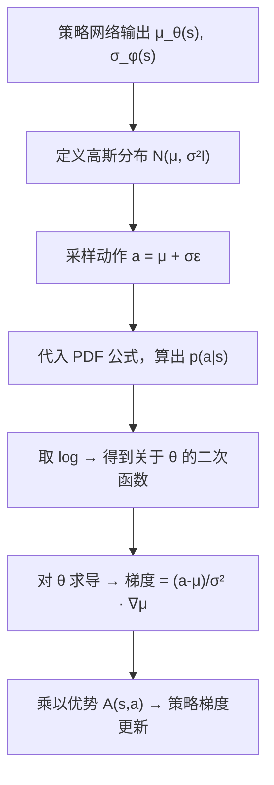

# 前置知识：概率密度函数与高斯分布

> **为什么要读这篇**：机器学习中几乎所有连续策略（PPO 高斯策略、SAC、扩散模型、Flow Matching）都建立在"从概率分布中采样"和"计算对数概率密度"两个操作之上。如果你不理解"概率密度函数"是什么、"高斯分布"的公式每一项在干什么，后面所有涉及 $\log \pi_\theta(a|s)$ 的推导都会变成天书。本文从零开始，把这条链路彻底讲透。

**标签**: `#前置知识` `#概率论` `#高斯分布` `#概率密度函数` `#log-probability` `#机器学习基础`

**知识链接**：
- [策略梯度与 PPO](/前置知识/000a_前置知识_策略梯度与PPO) — 策略梯度需要计算 $\log \pi_\theta(a|s)$，本文解释它从哪来
- [SAC (Soft Actor-Critic)](/前置知识/000k_前置知识_SAC_Soft_Actor_Critic) — SAC 用高斯策略输出连续动作
- [连续动作与离散动作的梯度回传](/前置知识/001r_前置知识_连续动作与离散动作的梯度回传) — 高斯策略的重参数化技巧
- [对数似然与变分下界](/前置知识/000e_前置知识_对数似然与变分下界) — 对数概率在生成模型中的应用
- [期望](/前置知识/002c_前置知识_期望方差与蒙特卡洛采样) — 概率分布上的"平均值"怎么算
- [蒙特卡洛采样](/前置知识/002c3_前置知识_蒙特卡洛采样) — 积分算不出来时怎么用采样近似
- [重参数化技巧](/前置知识/002e_前置知识_重参数化技巧) — 从高斯分布采样如何做到可微

---

## 贯穿全文的例子

> **场景**：一个平面机器人要抓取桌上的一个杯子。它的策略网络输出一个 2D 动作 $a = (\Delta x, \Delta y)$——手臂末端应该往哪移动。
>
> 策略不是直接输出"往右移 3cm"这样一个确定值，而是输出一个**概率分布**——"大概率往右偏移 3cm 附近，但也有小概率偏移 2cm 或 4cm"。这个分布就是高斯分布。
>
> 我们的问题是：给定策略输出的分布参数和一个具体动作，怎么算出"这个动作在这个分布下有多可能"？算出来的这个数字怎么用于训练？

---

## 第一部分：从离散概率到连续概率密度

### 1.1 离散情况：概率直接是一个数

扔一个 6 面骰子：

| 结果 | 1 | 2 | 3 | 4 | 5 | 6 |
|------|---|---|---|---|---|---|
| 概率 | 1/6 | 1/6 | 1/6 | 1/6 | 1/6 | 1/6 |

每个结果的概率是一个确定的数，所有概率加起来 = 1。

**离散策略**也是一样的。比如一个 Atari 游戏策略输出"上/下/左/右"的概率：

$$
\pi(上|s) = 0.7, \quad \pi(下|s) = 0.1, \quad \pi(左|s) = 0.15, \quad \pi(右|s) = 0.05
$$

这里 $\pi(a|s)$ 直接就是概率，可以直接取 log 用于策略梯度。

### 1.2 连续情况的困难：精确值的概率为 0

现在回到机器人的例子。动作 $a = \Delta x \in \mathbb{R}$ 是一个实数。问题来了：

> "$\Delta x$ 恰好等于 3.000000...cm"的概率是多少？

答案是 **0**。因为实数轴上有无穷多个点，任何一个精确点的概率都是 0。

这不是哲学诡辩，是数学事实。就像问"一根线段上随机取一个点，取到 0.5 的概率是多少"——答案就是 0，因为 $[0,1]$ 上有不可数无穷多个点。

但我们显然可以问"$\Delta x$ 落在 2.9cm 到 3.1cm 之间的概率是多少"——这是有意义的。

### 1.3 概率密度函数（PDF）：描述"浓度"而非"概率"

概率密度函数 $p(x)$ 解决了连续情况的问题。它的定义是：

$$
P(a \le x \le b) = \int_a^b p(x) \, dx
$$

> **一句话直觉**：$p(x)$ 不是"$x$ 这个点的概率"，而是"$x$ 附近的概率浓度"。浓度高的地方，随机采样更容易落到。

**逐项拆解**：

| 符号 | 含义 |
|------|------|
| $P(a \le x \le b)$ | $x$ 落在 $[a, b]$ 区间内的概率（这是一个 0 到 1 之间的数） |
| $p(x)$ | 概率密度函数在 $x$ 处的值（可以 > 1！只要积分 = 1 就行） |
| $\int_a^b$ | 把 $[a, b]$ 区间内所有点的密度"积起来"得到概率 |

**关键性质**：
- $p(x) \ge 0$（密度不能为负）
- $\int_{-\infty}^{+\infty} p(x)\, dx = 1$（所有可能性加起来 = 100%）
- $p(x)$ **可以大于 1**（比如均匀分布 $U[0, 0.5]$ 的密度 = 2）

### 1.4 代入数字：均匀分布

$x \sim U[0, 1]$（$x$ 在 0 到 1 之间均匀分布）：

$$
p(x) = \begin{cases} 1 & 0 \le x \le 1 \\ 0 & \text{otherwise} \end{cases}
$$

- $P(0.3 \le x \le 0.5) = \int_{0.3}^{0.5} 1\, dx = 0.2$ ✓
- $P(x = 0.4) = \int_{0.4}^{0.4} 1\, dx = 0$ ✓（精确值概率为 0）

---

## 第二部分：高斯分布（正态分布）

### 2.1 为什么机器学习偏爱高斯分布？

三个原因：

1. **中心极限定理**：大量独立随机变量的和趋向高斯分布。现实世界的噪声（传感器误差、环境扰动）通常近似高斯。
2. **数学性质好**：取 log 后变成二次函数，求导简单；两个高斯相乘/卷积还是高斯。
3. **只需两个参数就能完全描述**：均值 $\mu$ 和方差 $\sigma^2$。参数少 = 网络输出维度少 = 好训练。

### 2.2 一维高斯的 PDF

$$
p(x) = \frac{1}{\sqrt{2\pi\sigma^2}} \exp\left(-\frac{(x - \mu)^2}{2\sigma^2}\right)
$$

这个公式决定了钟形曲线的形状。下面把每一项拆碎了讲。

**为什么需要这个公式**：我们需要一个函数，满足"离中心越近密度越高、离中心越远密度越低"，同时总面积 = 1。高斯 PDF 就是满足这些要求的"最自然"的函数（信息论意义上，给定均值和方差后，高斯是熵最大的分布——最"无偏"的选择）。

> **一句话直觉**：高斯分布就是一个"中间高、两边低"的钟形曲线。$\mu$ 决定钟的中心在哪，$\sigma$ 决定钟有多宽。

**逐项拆解**：

| 符号/项 | 数学含义 | 直觉 | 在机器人例子中 |
|---------|---------|------|-------------|
| $x$ | 自变量（要评估密度的那个值） | "这个动作是多少" | 机器人实际移动的 $\Delta x = 3.2$ cm |
| $\mu$ | 均值（分布的中心） | 钟形曲线最高点的位置 | 策略网络输出的"推荐动作" = 3.0 cm |
| $\sigma$ | 标准差（分布的宽度） | 68% 的采样会落在 $[\mu-\sigma, \mu+\sigma]$ 内 | 策略的"不确定性"，比如 0.5 cm |
| $\sigma^2$ | 方差 | 标准差的平方 | 0.25 cm² |
| $(x-\mu)^2$ | $x$ 到中心的距离的平方 | 偏离中心越远，这个值越大 | $(3.2 - 3.0)^2 = 0.04$ |
| $\frac{(x-\mu)^2}{2\sigma^2}$ | 归一化距离 | 用方差做"标尺"来度量偏离程度 | $\frac{0.04}{0.5} = 0.08$ |
| $\exp(-\cdot)$ | 指数衰减函数 | 把距离变成 0~1 之间的"权重" | $\exp(-0.08) = 0.923$ |
| $\frac{1}{\sqrt{2\pi\sigma^2}}$ | 归一化常数 | 保证整条曲线下面积 = 1 | $\frac{1}{\sqrt{2\pi \times 0.25}} = \frac{1}{1.253} = 0.798$ |

**完整数值计算**：

设 $\mu = 3.0$，$\sigma = 0.5$，求 $x = 3.2$ 处的概率密度：

$$
p(3.2) = \frac{1}{\sqrt{2\pi \times 0.25}} \exp\left(-\frac{(3.2-3.0)^2}{2 \times 0.25}\right)
$$
$$
= 0.798 \times \exp(-0.08)
= 0.798 \times 0.923
= 0.737
$$

再算一个远离中心的点 $x = 5.0$：

$$
p(5.0) = 0.798 \times \exp\left(-\frac{(5.0-3.0)^2}{0.5}\right) = 0.798 \times \exp(-8) = 0.798 \times 0.000335 = 0.000267
$$

对比：$x=3.2$ 的密度是 0.737，$x=5.0$ 的密度是 0.000267。**离中心越远，密度指数级下降**。

**为什么是这个形式**：
- 为什么用 $(x-\mu)^2$ 而不是 $|x-\mu|$？因为平方函数处处可微（绝对值在 0 点不可微），对梯度优化友好。
- 为什么分母是 $2\sigma^2$ 而不是 $\sigma^2$？这是让标准差 $\sigma$ 恰好等于"68% 置信区间半宽"的约定。如果分母改成 $\sigma^2$，数学上也是合法的分布，但 $\sigma$ 的直觉含义会变。
- 为什么要 $\frac{1}{\sqrt{2\pi\sigma^2}}$？纯粹是为了让 $\int_{-\infty}^{+\infty} p(x)\,dx = 1$。没有这个系数，面积不等于 1，就不是合法的概率分布。

### 2.3 高斯分布的"68-95-99.7 规则"

对于 $x \sim \mathcal{N}(\mu, \sigma^2)$：

| 区间 | 概率 | 含义 |
|------|------|------|
| $[\mu - \sigma, \mu + \sigma]$ | 68.3% | 大约 2/3 的采样落在 1 个标准差内 |
| $[\mu - 2\sigma, \mu + 2\sigma]$ | 95.4% | 绝大多数采样在 2 个标准差内 |
| $[\mu - 3\sigma, \mu + 3\sigma]$ | 99.7% | 几乎所有采样在 3 个标准差内 |

在机器人例子中：$\mu = 3.0$cm，$\sigma = 0.5$cm → 68% 的动作会在 $[2.5, 3.5]$cm 之间。

### 2.4 $\mathcal{N}(x;\, \mu, \sigma^2)$ 记号解读

在论文中你会反复看到这种记号：

$$
\mathcal{N}(x;\, \mu, \sigma^2)
$$

这不是一个"函数调用"，而是一种简写：

- **分号前**（$x$）：要评估密度的那个具体值（变量）
- **分号后**（$\mu, \sigma^2$）：定义分布形状的参数

所以 $\mathcal{N}(x;\, \mu, \sigma^2)$ 完全等价于把 $x, \mu, \sigma$ 代入 PDF 公式算出的那个数。

当写 $x \sim \mathcal{N}(\mu, \sigma^2)$ 时，读作"$x$ 服从均值 $\mu$、方差 $\sigma^2$ 的高斯分布"——这是在声明 $x$ 的来源（从哪个分布采样的）。

---

## 第三部分：多维高斯分布

### 3.1 从一维到多维

机器人的动作通常不是一个标量，而是一个向量。比如 7-DOF 机械臂的动作是 $\mathbf{a} = (a_1, a_2, \ldots, a_7) \in \mathbb{R}^7$。

**为什么需要这个公式**：一维高斯只能描述"一个数"的分布。但机器人的动作通常是一个向量（比如 7 个关节角变化量），而且这些维度之间可能不是互相独立的——比如手臂的肩关节和肘关节联动，一个转多了另一个也会跟着代偿。我们需要一个能同时描述"每个维度自己的不确定性"和"维度之间的相关性"的分布，这就是多维（多元）高斯分布。

多维高斯的 PDF 一般形式：

$$
p(\mathbf{x}) = \frac{1}{(2\pi)^{d/2} |\Sigma|^{1/2}} \exp\left(-\frac{1}{2}(\mathbf{x} - \boldsymbol{\mu})^T \Sigma^{-1} (\mathbf{x} - \boldsymbol{\mu})\right)
$$

> **一句话直觉**：和一维高斯完全一样的"钟形曲线思路"，只是把"到中心的距离"从一维的 $(x-\mu)^2/\sigma^2$ 换成了考虑了各维度方差和相关性的"广义距离"（马氏距离），中心点仍然是均值向量 $\boldsymbol{\mu}$，密度仍然是离中心越远越低。

**逐项拆解**：

| 符号 | 含义 | 直觉 |
|------|------|------|
| $\mathbf{x} \in \mathbb{R}^d$ | $d$ 维向量（要评估密度的那个点） | 7 个关节的实际角度变化量 |
| $\boldsymbol{\mu} \in \mathbb{R}^d$ | 均值向量（分布的中心） | 策略推荐的 7 个关节角变化量 |
| $\Sigma \in \mathbb{R}^{d \times d}$ | 协方差矩阵（描述各维度的方差 + 维度间的相关性） | 每个关节的"不确定性"以及关节之间是否联动 |
| $|\Sigma|$ | 协方差矩阵的行列式 | 分布"体积"的度量，行列式越大分布越"胖" |
| $\Sigma^{-1}$ | 协方差矩阵的逆 | 把"方向"和"尺度"都考虑进去的距离度量工具 |
| $(\mathbf{x}-\boldsymbol{\mu})^T \Sigma^{-1} (\mathbf{x}-\boldsymbol{\mu})$ | 马氏距离的平方（一个标量） | 考虑了各维度方差和相关性的"广义距离"——方差小的方向偏离一点就算"很远"，方差大的方向偏离多一点才算"远" |
| $(2\pi)^{d/2}|\Sigma|^{1/2}$ | 归一化常数 | 保证整个 $d$ 维空间上积分 = 1 |

**数值代入**：设 $d=2$（2D 机器人的两个关节），$\boldsymbol{\mu} = (3.0, 1.0)$，协方差矩阵带一点相关性：

$$
\Sigma = \begin{pmatrix} 1.0 & 0.3 \\ 0.3 & 0.5 \end{pmatrix}
$$

（对角线是各维度自己的方差，非对角线 0.3 表示两个关节有正相关——一个变大另一个也倾向于变大。）

求 $\mathbf{x} = (3.2, 1.5)$ 处的密度，一步步算：

1. **行列式**：$|\Sigma| = 1.0 \times 0.5 - 0.3 \times 0.3 = 0.5 - 0.09 = 0.41$
2. **逆矩阵**：$\Sigma^{-1} = \frac{1}{0.41}\begin{pmatrix} 0.5 & -0.3 \\ -0.3 & 1.0 \end{pmatrix} = \begin{pmatrix} 1.220 & -0.732 \\ -0.732 & 2.439 \end{pmatrix}$
3. **偏差向量**：$\mathbf{x} - \boldsymbol{\mu} = (3.2-3.0,\ 1.5-1.0) = (0.2, 0.5)$
4. **先算 $\Sigma^{-1}(\mathbf{x}-\boldsymbol{\mu})$**：
   $$
   \begin{pmatrix} 1.220 & -0.732 \\ -0.732 & 2.439 \end{pmatrix}\begin{pmatrix} 0.2 \\ 0.5 \end{pmatrix} = \begin{pmatrix} 1.220\times0.2 - 0.732\times0.5 \\ -0.732\times0.2 + 2.439\times0.5 \end{pmatrix} = \begin{pmatrix} -0.122 \\ 1.073 \end{pmatrix}
   $$
5. **马氏距离平方**：$(\mathbf{x}-\boldsymbol{\mu})^T \Sigma^{-1}(\mathbf{x}-\boldsymbol{\mu}) = 0.2\times(-0.122) + 0.5\times1.073 = -0.024 + 0.537 = 0.512$
6. **指数项**：$\exp(-0.5 \times 0.512) = \exp(-0.256) = 0.774$
7. **归一化常数**：$(2\pi)^{2/2}\times\sqrt{0.41} = 6.283 \times 0.640 = 4.023$
8. **最终密度**：$p(3.2, 1.5) = 0.774 / 4.023 = 0.192$

如果两个关节完全独立（$\Sigma$ 变成对角矩阵 $\text{diag}(1.0, 0.5)$），$\Sigma^{-1}$ 就没有非对角项，马氏距离退化成两个独立方向的距离之和——这正是下面 3.2 节要讲的简化情况。

**为什么是这个形式**：为什么用 $\Sigma^{-1}$ 而不是直接用 $\Sigma$？因为方差大的维度应该对距离的"贡献"更小——用逆矩阵相当于给每个方向除以它自己的方差做归一化，这样距离才是"标准化"后可比较的。为什么行列式 $|\Sigma|$ 出现在归一化常数里？因为协方差矩阵越"大"（行列式越大），分布铺得越开，同样的总面积（=1）需要更低的高度，所以密度整体要除以 $|\Sigma|^{1/2}$ 来压低。

### 3.2 简化版：各维度独立 + 方差相同（对角协方差）

在强化学习中，绝大多数实现为了计算简单，假设**各维度独立、方差相同**：

$$
\Sigma = \sigma^2 I \quad \Rightarrow \quad p(\mathbf{a}) = \prod_{i=1}^{d} \frac{1}{\sqrt{2\pi\sigma^2}} \exp\left(-\frac{(a_i - \mu_i)^2}{2\sigma^2}\right)
$$

> **一句话**：每个维度单独算密度，然后乘起来。

**为什么能乘起来**：独立随机变量的联合概率 = 各自概率的乘积。就像"两个独立事件同时发生的概率 = 各自概率相乘"。

**数值例子**（2D 平面机器人，$d=2$）：

设 $\boldsymbol{\mu} = (3.0, 1.0)$，$\sigma = 0.5$，实际动作 $\mathbf{a} = (3.2, 1.5)$：

$$
p(a_1 = 3.2) = 0.798 \times \exp(-0.08) = 0.737 \quad \text{（上面算过了）}
$$
$$
p(a_2 = 1.5) = 0.798 \times \exp\left(-\frac{(1.5-1.0)^2}{0.5}\right) = 0.798 \times \exp(-0.5) = 0.798 \times 0.607 = 0.484
$$
$$
p(\mathbf{a}) = 0.737 \times 0.484 = 0.357
$$

---

## 第四部分：对数概率密度（Log-Probability）

### 4.1 为什么要取 log？

策略梯度的核心公式是：

$$
\nabla_\theta J(\theta) = \mathbb{E}\left[\nabla_\theta \log \pi_\theta(a|s) \cdot A(s,a)\right]
$$

这里面出现了 $\log \pi_\theta(a|s)$——策略在状态 $s$ 下选择动作 $a$ 的**对数概率密度**。

为什么用 log 而不是直接用 $p$？三个原因：

1. **数值稳定性**：概率密度值可能极小（如 $10^{-300}$），直接相乘会下溢到 0。取 log 后变成 $-690$ 这样的正常数字。
2. **乘法变加法**：多维独立分布 $p(\mathbf{a}) = \prod_i p(a_i)$，取 log 后变成 $\log p(\mathbf{a}) = \sum_i \log p(a_i)$——加法比乘法好算、好求导。
3. **策略梯度的数学推导需要它**：$\nabla_\theta \log p = \frac{\nabla_\theta p}{p}$（log-derivative trick），这个变换让梯度估计可以通过采样来近似。

### 4.2 高斯分布的 log-probability 公式

把一维高斯 PDF 取 log：

$$
\log p(x) = \log\left[\frac{1}{\sqrt{2\pi\sigma^2}} \exp\left(-\frac{(x-\mu)^2}{2\sigma^2}\right)\right]
$$

log 和 exp 相消，log 把乘法变加法：

$$
\log p(x) = -\frac{(x - \mu)^2}{2\sigma^2} - \frac{1}{2}\log(2\pi\sigma^2)
$$

> **一句话**：取 log 后，高斯的概率密度变成了一个**二次函数**——关于 $\mu$ 的抛物线。

**逐项拆解**：

| 项 | 含义 | 对梯度的影响 |
|----|------|------------|
| $-\frac{(x-\mu)^2}{2\sigma^2}$ | "惩罚项"：$x$ 离 $\mu$ 越远，log-prob 越小（越负） | 对 $\mu$ 求导得到 $\frac{x-\mu}{\sigma^2}$，这就是梯度方向 |
| $-\frac{1}{2}\log(2\pi\sigma^2)$ | 常数项（如果 $\sigma$ 固定的话） | 如果 $\sigma$ 也是可学习参数，对 $\sigma$ 求导会给出调节不确定性的梯度 |

### 4.3 多维独立高斯的 log-probability

$$
\log p(\mathbf{a}) = \sum_{i=1}^{d} \left[-\frac{(a_i - \mu_i)^2}{2\sigma^2} - \frac{1}{2}\log(2\pi\sigma^2)\right]
$$

$$
= -\frac{1}{2\sigma^2}\sum_{i=1}^d (a_i - \mu_i)^2 - \frac{d}{2}\log(2\pi\sigma^2)
$$

> 第一项就是**负的 MSE**（均方误差）除以 $2\sigma^2$。这解释了为什么"最大化高斯 log-likelihood"等价于"最小化 MSE"——两者只差一个常数和缩放因子。

**数值例子**（延续 2D 机器人）：

$\boldsymbol{\mu} = (3.0, 1.0)$，$\sigma = 0.5$，$\mathbf{a} = (3.2, 1.5)$：

$$
\log p(\mathbf{a}) = -\frac{(3.2-3.0)^2 + (1.5-1.0)^2}{2 \times 0.25} - \frac{2}{2}\log(2\pi \times 0.25)
$$
$$
= -\frac{0.04 + 0.25}{0.5} - \log(1.571)
= -\frac{0.29}{0.5} - 0.452
= -0.58 - 0.452 = -1.032
$$

验证：$e^{-1.032} = 0.356 \approx 0.357$（和前面直接算的 $p(\mathbf{a})$ 吻合 ✓）。

---

## 第五部分：从 PDF 到策略梯度——完整链路

现在把所有部分串起来。这就是你在论文里看到的那个公式的完整来龙去脉。

### 5.1 策略网络输出分布参数

神经网络接收状态 $s$，输出两个东西：

$$
\mu_\theta(s) \in \mathbb{R}^d, \quad \sigma_\phi(s) \in \mathbb{R}^d_{>0}
$$

- $\mu_\theta(s)$：每个维度的"推荐动作"（均值）
- $\sigma_\phi(s)$：每个维度的"探索幅度"（标准差）

这两个东西定义了一个高斯分布 $\pi_\theta(\cdot|s) = \mathcal{N}(\mu_\theta(s), \text{diag}(\sigma_\phi(s))^2)$。

### 5.2 采样一个动作

从这个分布中采一个动作：

$$
a \sim \mathcal{N}(\mu_\theta(s),\, \sigma_\phi^2(s))
$$

实际操作（重参数化）：$a = \mu_\theta(s) + \sigma_\phi(s) \odot \epsilon$，其中 $\epsilon \sim \mathcal{N}(0, I)$。

### 5.3 计算这个动作的 log-probability

把采到的 $a$ 代回 log-PDF 公式：

$$
\log \pi_\theta(a|s) = -\frac{1}{2}\sum_{i=1}^d \frac{(a_i - \mu_{\theta,i}(s))^2}{\sigma_{\phi,i}^2(s)} - \sum_{i=1}^d \log \sigma_{\phi,i}(s) - \frac{d}{2}\log(2\pi)
$$

这是一个关于网络参数 $\theta, \phi$ 的**可微函数**——因为 $\mu_\theta$ 和 $\sigma_\phi$ 都是网络的输出。

### 5.4 对参数求梯度

对 $\mu_\theta$ 的梯度（$\sigma$ 固定时）：

$$
\nabla_{\mu_\theta} \log \pi_\theta(a|s) = \frac{a - \mu_\theta(s)}{\sigma_\phi^2(s)}
$$

**直觉**：
- 如果 $a > \mu$（实际动作在均值右边），梯度为正 → 把 $\mu$ 往右推
- 如果 $a < \mu$（实际动作在均值左边），梯度为负 → 把 $\mu$ 往左推
- 乘以 $A(s,a)$（优势函数）后：好动作 → 把 $\mu$ 推向它；坏动作 → 把 $\mu$ 推离它

### 5.5 策略梯度更新

完整的策略梯度：

$$
\nabla_\theta J = \mathbb{E}\left[\frac{a - \mu_\theta}{\sigma^2} \cdot \nabla_\theta \mu_\theta \cdot A(s,a)\right]
$$

其中 $\nabla_\theta \mu_\theta$ 是神经网络内部的梯度（由 PyTorch 自动微分计算）。

**完整数值例子**：

设：状态 $s$ 下，网络输出 $\mu_\theta = 3.0$，$\sigma = 0.5$。采样得到 $a = 3.4$。环境给了正奖励，优势 $A = +2.0$。

1. Log-prob 梯度方向：$\frac{3.4 - 3.0}{0.25} = 1.6$
2. 乘以优势：$1.6 \times 2.0 = 3.2$
3. 含义：应该把 $\mu$ 往 3.4 的方向调（增大），因为这个方向的动作获得了正奖励

如果 $A = -1.0$（这个动作很糟糕）：
1. 方向：$1.6$（仍然指向 $a$）
2. 乘以优势：$1.6 \times (-1.0) = -1.6$
3. 含义：应该把 $\mu$ 往**远离** 3.4 的方向调（减小），远离坏动作

---

## 第六部分：回到你的公式

现在你已经有了所有工具，让我们解读你一开始看到的那个公式：

$$
p(a_{k+1} | a_k, s) = \mathcal{N}\big(a_{k+1};\; \underbrace{a_k + v_\theta \Delta t}_{\text{均值}},\; \underbrace{\sigma_\phi^2 \cdot I}_{\text{方差}}\big)
$$

### 6.1 逐项解读

| 部分 | 含义 | 对应到前面学的内容 |
|------|------|-----------------|
| $a_{k+1}$ | 分号前：要评估密度的具体值（去噪第 $k+1$ 步的动作） | 对应 PDF 公式里的 $x$ |
| $a_k + v_\theta \Delta t$ | 分号后第一项：高斯的均值 | 对应 $\mu$。意思是"从当前位置 $a_k$ 出发，沿着网络预测的速度 $v_\theta$ 走一小步 $\Delta t$" |
| $\sigma_\phi^2 \cdot I$ | 分号后第二项：协方差矩阵 | 对应 $\Sigma = \sigma^2 I$。每个维度方差相同且互相独立 |

### 6.2 展开成完整 PDF

$$
p(a_{k+1}|a_k, s) = \prod_{i=1}^d \frac{1}{\sqrt{2\pi\sigma_\phi^2}} \exp\left(-\frac{\big(a_{k+1,i} - (a_{k,i} + v_{\theta,i} \Delta t)\big)^2}{2\sigma_\phi^2}\right)
$$

### 6.3 取 log

$$
\log p(a_{k+1}|a_k, s) = -\frac{1}{2\sigma_\phi^2} \sum_{i=1}^d \big(a_{k+1,i} - a_{k,i} - v_{\theta,i} \Delta t\big)^2 - \frac{d}{2}\log(2\pi\sigma_\phi^2)
$$

### 6.4 对 $\theta$ 求梯度

$$
\nabla_\theta \log p = \frac{\Delta t}{\sigma_\phi^2} \sum_{i=1}^d \big(a_{k+1,i} - a_{k,i} - v_{\theta,i}\Delta t\big) \cdot \nabla_\theta v_{\theta,i}
$$

**直觉**：如果 $a_{k+1}$ 比 "当前位置 + 预测速度×时间步" 更靠右，梯度就会让 $v_\theta$ 增大（预测更快的速度），反之减小。

### 6.5 数值验证

设 $d=1$，$a_k = 0.5$，$v_\theta = 0.3$，$\Delta t = 1.0$，$\sigma_\phi = 0.2$，实际 $a_{k+1} = 0.9$：

- 均值 = $0.5 + 0.3 \times 1.0 = 0.8$
- $\log p = -\frac{(0.9 - 0.8)^2}{2 \times 0.04} - \frac{1}{2}\log(2\pi \times 0.04)$
- $= -\frac{0.01}{0.08} - \frac{1}{2}\log(0.251)$
- $= -0.125 - \frac{1}{2}(-1.383) = -0.125 + 0.691 = 0.566$
- 验证：$e^{0.566} = 1.762$，即 $p(0.9) = 1.762$（密度可以 > 1，没问题）

梯度方向：$\frac{0.9 - 0.8}{0.04} = 2.5$ → 应该把 $v_\theta$ 往大调（让预测的速度更快，这样均值更接近实际的 $a_{k+1}$）。

---

## 第七部分：PyTorch 代码实现

前面讲了这么多公式，现在来看代码里怎么做。核心思路是：PyTorch 的 `torch.distributions.Normal` 封装了高斯分布的所有计算——你只需要给它均值和标准差，它帮你算 log-prob、采样、求梯度。

```python
import torch
import torch.nn as nn
from torch.distributions import Normal

class GaussianPolicy(nn.Module):
    """一个最简单的高斯策略网络"""
    def __init__(self, state_dim, action_dim):
        super().__init__()
        self.net = nn.Sequential(
            nn.Linear(state_dim, 64),
            nn.ReLU(),
            nn.Linear(64, 64),
            nn.ReLU(),
        )
        self.mu_head = nn.Linear(64, action_dim)      # 输出均值
        self.log_std = nn.Parameter(torch.zeros(action_dim))  # 可学习的 log(标准差)

    def forward(self, state):
        """给定状态，输出动作分布的参数"""
        features = self.net(state)
        mu = self.mu_head(features)             # 均值：网络直接输出
        std = self.log_std.exp()                 # 标准差：对 log_std 取 exp 保证 > 0
        return mu, std

    def get_action(self, state):
        """采样一个动作，并返回它的 log-probability"""
        mu, std = self.forward(state)
        dist = Normal(mu, std)                   # 定义高斯分布
        action = dist.rsample()                  # 重参数化采样（梯度能穿过）
        log_prob = dist.log_prob(action)         # 计算每个维度的 log-prob
        log_prob = log_prob.sum(dim=-1)          # 各维度独立 → 加起来
        return action, log_prob

# ===== 使用示例 =====
policy = GaussianPolicy(state_dim=4, action_dim=2)
state = torch.randn(1, 4)       # 一个随机状态

action, log_prob = policy.get_action(state)
print(f"动作: {action}")         # 例如 tensor([[0.32, -0.15]])
print(f"Log-prob: {log_prob}")   # 例如 tensor([-1.84])

# 策略梯度更新（伪代码）
advantage = 2.0                  # 假设这个动作很好
loss = -(log_prob * advantage)   # 策略梯度 loss
loss.backward()                  # PyTorch 自动算梯度
```

**代码关键点解说**：

1. **`self.log_std` 而不是 `self.std`**：存储 $\log \sigma$ 而不是 $\sigma$，因为 $\sigma$ 必须为正。对 $\log \sigma$ 取 `exp()` 保证输出恒正，且梯度更稳定。
2. **`dist.rsample()` 而不是 `dist.sample()`**：`rsample` 是重参数化采样（$a = \mu + \sigma \cdot \epsilon$），梯度能穿过采样操作传回 $\mu$ 和 $\sigma$。普通 `sample()` 会阻断梯度。
3. **`log_prob.sum(dim=-1)`**：各维度独立，联合 log-prob = 各维度 log-prob 之和。
4. **`-(log_prob * advantage)`**：策略梯度是**最大化** $\mathbb{E}[\log\pi \cdot A]$，但 PyTorch 的优化器做的是**最小化**，所以加负号。

---

## 第八部分：常见疑问

### Q1：概率密度可以大于 1，那它还是"概率"吗？

不是概率，是**密度**。就像物质的密度可以是 5 g/cm³（大于 1），但一块物质的总质量有限。类比：

| 物理概念 | 概率概念 |
|---------|---------|
| 密度 (g/cm³) | 概率密度 $p(x)$ |
| 质量 (g) | 概率 $P(a \le x \le b) = \int_a^b p(x)dx$ |
| 总质量 = 物体所有部分的密度积分 | 总概率 = 1 |

密度可以任意大，但积分（面积）必须 = 1。

### Q2：为什么不直接用概率而要用密度？

因为连续情况下点概率 = 0，没法用。但密度的**比值**是有意义的：

$$
\frac{p(x_1)}{p(x_2)} = \frac{\text{在 } x_1 \text{ 附近采到的"可能性"}}{\text{在 } x_2 \text{ 附近采到的"可能性"}}
$$

如果 $p(3.0) = 0.8$，$p(5.0) = 0.002$，说明采样到 3.0 附近的可能性是 5.0 附近的 400 倍。

### Q3：log-prob 是负数，正常吗？

完全正常。因为 $0 < p(x) < 1$ 时（大多数情况下密度 < 1），$\log p(x) < 0$。只有当密度 > 1 时 log-prob 才为正。策略梯度算法不关心 log-prob 的绝对值，只关心它关于参数的**梯度方向**。

### Q4：高斯策略的局限性是什么？

高斯分布是**单峰**的——只有一个"最可能的动作"。如果最优策略是多模态的（比如"既可以从左边绕过障碍物，也可以从右边绕"），单高斯策略无法表达。解决方案包括：
- 混合高斯（Gaussian Mixture）
- [Flow Matching 策略](/前置知识/000g_前置知识_Flow_Matching与连续归一化流)（可表达任意复杂分布）
- [扩散策略](/前置知识/000c_前置知识_Diffusion_Policy)（通过去噪过程生成多模态动作）

---

## 总结



| 概念 | 一句话总结 |
|------|----------|
| 概率密度函数 | 连续情况下代替"概率"的工具，描述分布在各处的"浓度" |
| 高斯分布 | 用均值和方差完全描述的钟形分布，取 log 后变二次函数 |
| $\mathcal{N}(x; \mu, \sigma^2)$ | "把 $x$ 代入均值 $\mu$、方差 $\sigma^2$ 的高斯 PDF"的简写 |
| Log-probability | 对数密度，让乘法变加法、让 exp 变二次函数、让梯度好算 |
| 策略梯度的链路 | 网络输出 $\mu$ → 定义分布 → 采样 $a$ → 算 log-prob → 求导 → 乘优势 → 更新 |

---

## 延伸阅读

- [期望、方差与蒙特卡洛采样](/前置知识/002c_前置知识_期望方差与蒙特卡洛采样) — 概率分布上的"平均值"怎么算，以及 RL 中为什么要采样
- [条件概率与贝叶斯定理](/前置知识/002d_前置知识_条件概率与贝叶斯定理) — $p(a|s)$ 这个记号的精确含义
- [重参数化技巧](/前置知识/002e_前置知识_重参数化技巧) — 为什么 $a = \mu + \sigma\epsilon$ 这样写就能让梯度穿过采样
- [最大似然估计](/前置知识/002f_前置知识_最大似然估计) — "最大化 log-prob"在训练中的含义
- [策略梯度与 PPO](/前置知识/000a_前置知识_策略梯度与PPO) — 把本文的 log-prob 用到完整的 RL 算法中
