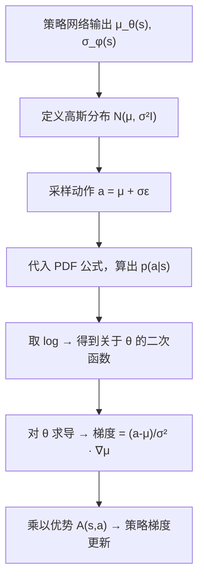

# 前置知识：概率密度函数与高斯分布

> **为什么要读这篇**：机器学习中几乎所有连续策略（PPO 高斯策略、SAC、扩散模型、Flow Matching）都建立在"从概率分布中采样"和"计算对数概率密度"两个操作之上。如果你不理解"概率密度函数"是什么、"高斯分布"的公式每一项在干什么，后面所有涉及 $\log \pi_\theta(a|s)$ 的推导都会变成天书。本文从零开始，把这条链路彻底讲透。

**标签**: `#前置知识` `#概率论` `#高斯分布` `#概率密度函数` `#log-probability` `#机器学习基础`

**知识链接**：
- [策略梯度与 PPO](/前置知识/000a_前置知识_策略梯度与PPO) — 策略梯度需要计算 $\log \pi_\theta(a|s)$，本文解释它从哪来
- [SAC (Soft Actor-Critic)](/前置知识/000k_前置知识_SAC_Soft_Actor_Critic) — SAC 用高斯策略输出连续动作
- [连续动作与离散动作的梯度回传](/前置知识/001r_前置知识_连续动作与离散动作的梯度回传) — 高斯策略的重参数化技巧
- [对数似然与变分下界](/前置知识/000e_前置知识_对数似然与变分下界) — 对数概率在生成模型中的应用
- [期望](/前置知识/002c_前置知识_期望方差与蒙特卡洛采样) — 概率分布上的"平均值"怎么算
- [蒙特卡洛采样](/前置知识/002c3_前置知识_蒙特卡洛采样) — 积分算不出来时怎么用采样近似
- [重参数化技巧](/前置知识/002e_前置知识_重参数化技巧) — 从高斯分布采样如何做到可微

---

## 贯穿全文的例子

> **场景**：一个平面机器人要抓取桌上的一个杯子。它的策略网络输出一个 2D 动作 $a = (\Delta x, \Delta y)$——手臂末端应该往哪移动。
>
> 策略不是直接输出"往右移 3cm"这样一个确定值，而是输出一个**概率分布**——"大概率往右偏移 3cm 附近，但也有小概率偏移 2cm 或 4cm"。这个分布就是高斯分布。
>
> 我们的问题是：给定策略输出的分布参数和一个具体动作，怎么算出"这个动作在这个分布下有多可能"？算出来的这个数字怎么用于训练？

---

## 第一部分：从离散概率到连续概率密度

### 1.1 离散情况：概率直接是一个数

扔一个 6 面骰子：

| 结果 | 1 | 2 | 3 | 4 | 5 | 6 |
|------|---|---|---|---|---|---|
| 概率 | 1/6 | 1/6 | 1/6 | 1/6 | 1/6 | 1/6 |

每个结果的概率是一个确定的数，所有概率加起来 = 1。

**离散策略**也是一样的。比如一个 Atari 游戏策略输出"上/下/左/右"的概率：

$$
\pi(上|s) = 0.7, \quad \pi(下|s) = 0.1, \quad \pi(左|s) = 0.15, \quad \pi(右|s) = 0.05
$$

**这个公式在做什么**：给出一个离散策略在状态 $s$ 下选择四个方向动作各自的概率——四个数直接加起来 = 1。

::: details 📐 公式详解（点击展开）

| 子表达式 | 它是谁 | 它在干嘛 |
|---------|--------|---------|
| $\pi(上\vert s)$ | **某个动作的中标率** | 策略在状态 $s$ 下选择"上"这个动作的概率，是一个具体的数 |
| $0.7, 0.1, 0.15, 0.05$ | **概率质量分配** | 四个动作的概率加起来恰好 = 1，符合离散概率的归一化要求 |

**用人话读**："策略像一个抽奖机，四个方向各自占一部分中标率，抽到哪个就执行哪个动作。"

**为什么是这个形式**：离散动作空间有限，可以直接给每个动作分配一个概率数值；这是离散策略和连续策略的根本区别——连续动作空间里"某一个精确值"的概率永远是 0（见下节）。
:::

这里 $\pi(a|s)$ 直接就是概率，可以直接取 log 用于策略梯度。

### 1.2 连续情况的困难：精确值的概率为 0

现在回到机器人的例子。动作 $a = \Delta x \in \mathbb{R}$ 是一个实数。问题来了：

> "$\Delta x$ 恰好等于 3.000000...cm"的概率是多少？

答案是 **0**。因为实数轴上有无穷多个点，任何一个精确点的概率都是 0。

这不是哲学诡辩，是数学事实。就像问"一根线段上随机取一个点，取到 0.5 的概率是多少"——答案就是 0，因为 $[0,1]$ 上有不可数无穷多个点。

但我们显然可以问"$\Delta x$ 落在 2.9cm 到 3.1cm 之间的概率是多少"——这是有意义的。

### 1.3 概率密度函数（PDF）：描述"浓度"而非"概率"

概率密度函数 $p(x)$ 解决了连续情况的问题。它的定义是：

$$
P(a \le x \le b) = \int_a^b p(x) \, dx
$$

**这个公式在做什么**：定义了概率密度函数 $p(x)$——它本身不是概率，但对它在某个区间上积分，就能得到"$x$ 落在这个区间"的真正概率。

::: details 📐 公式详解（点击展开）

| 子表达式 | 它是谁 | 它在干嘛 |
|---------|--------|---------|
| $P(a \le x \le b)$ | **真正的概率** | $x$ 落在 $[a, b]$ 区间内的概率，是一个 0 到 1 之间的数 |
| $p(x)$ | **密度计**（不是概率本身） | 描述 $x$ 附近的概率有多"浓"，可以大于 1，只要整体积分 = 1 就行 |
| $\int_a^b(\cdot)\,dx$ | **积分收集器** | 把 $[a,b]$ 区间内每一点的密度"累加"起来，换算成真正的概率 |

**用人话读**："概率密度就像一根线上的浓度分布，要问'落在某段区间的概率'，得把这段区间的浓度积起来才是答案。"

**为什么是这个形式**：连续变量取到任意精确值的概率恒为 0（见 1.2 节），所以不能直接用"$p(x)$ = 概率"，只能通过积分把密度"摊"到一个区间上才能得到有意义的概率数值。
:::

> **一句话直觉**：$p(x)$ 不是"$x$ 这个点的概率"，而是"$x$ 附近的概率浓度"。浓度高的地方，随机采样更容易落到。

**关键性质**：
- $p(x) \ge 0$（密度不能为负）
- $\int_{-\infty}^{+\infty} p(x)\, dx = 1$（所有可能性加起来 = 100%）
- $p(x)$ **可以大于 1**（比如均匀分布 $U[0, 0.5]$ 的密度 = 2）

### 1.4 代入数字：均匀分布

$x \sim U[0, 1]$（$x$ 在 0 到 1 之间均匀分布）：

$$
p(x) = \begin{cases} 1 & 0 \le x \le 1 \\ 0 & \text{otherwise} \end{cases}
$$

**这个公式在做什么**：给出均匀分布 $U[0,1]$ 的概率密度函数——在 $[0,1]$ 区间内密度恒为 1，区间外密度为 0。

::: details 📐 公式详解（点击展开）

| 子表达式 | 它是谁 | 它在干嘛 |
|---------|--------|---------|
| $0 \le x \le 1$ 分支：密度 $=1$ | **平坦高地** | 区间内每一点的密度都相等，说明落在这个区间内任意子区间的概率只和长度成正比 |
| $\text{otherwise}$ 分支：密度 $=0$ | **禁区** | 区间外根本不可能采到值，密度直接归零 |

**用人话读**："在 0 到 1 之间，每个位置被采样到的'浓度'完全一样；跑出这个范围就绝对不会被采到。"

**为什么是这个形式**：均匀分布要求"处处等可能"，所以密度必须是常数；这个常数取 1 恰好使得整段区间的面积（长度 1 × 高度 1）等于 1，满足概率归一化要求。
:::

- $P(0.3 \le x \le 0.5) = \int_{0.3}^{0.5} 1\, dx = 0.2$ ✓
- $P(x = 0.4) = \int_{0.4}^{0.4} 1\, dx = 0$ ✓（精确值概率为 0）

---

## 第二部分：高斯分布（正态分布）

### 2.1 为什么机器学习偏爱高斯分布？

三个原因：

1. **中心极限定理**：大量独立随机变量的和趋向高斯分布。现实世界的噪声（传感器误差、环境扰动）通常近似高斯。
2. **数学性质好**：取 log 后变成二次函数，求导简单；两个高斯相乘/卷积还是高斯。
3. **只需两个参数就能完全描述**：均值 $\mu$ 和方差 $\sigma^2$。参数少 = 网络输出维度少 = 好训练。

### 2.2 一维高斯的 PDF

$$
p(x) = \frac{1}{\sqrt{2\pi\sigma^2}} \exp\left(-\frac{(x - \mu)^2}{2\sigma^2}\right)
$$

**这个公式在做什么**：给出一维高斯分布的概率密度函数——描述一条"中间高、两边低"的钟形曲线，$\mu$ 决定钟的中心在哪，$\sigma$ 决定钟有多宽。

::: details 📐 公式详解（点击展开）

| 子表达式 | 它是谁 | 它在干嘛 |
|---------|--------|---------|
| $x$ | **待评估的位置** | 要查询密度的那个具体值（机器人实际移动的 $\Delta x$） |
| $\mu$ | **钟形的中心** | 分布的均值，钟形曲线最高点所在的位置（策略网络推荐的动作） |
| $(x-\mu)^2$ | **离中心的距离** | 偏离中心越远，这个值越大 |
| $\dfrac{(x-\mu)^2}{2\sigma^2}$ | **用方差做标尺量出的归一化距离** | 拿方差 $\sigma^2$ 当"标尺"，衡量偏离程度有多严重 |
| $\exp(-\cdot)$ | **距离转权重的翻译器** | 把归一化距离转成一个 0~1 之间的权重——距离越大权重越接近 0 |
| $\dfrac{1}{\sqrt{2\pi\sigma^2}}$ | **配平砝码** | 归一化常数，保证整条曲线下面积恰好 = 1 |

**用人话读**："离推荐动作越近，密度越高；离得越远，密度按指数速度往下掉；前面那个系数只是为了保证整条曲线积分起来正好是 1。"

**为什么是这个形式**：用 $(x-\mu)^2$ 而不是 $\vert x-\mu\vert$ 是因为平方函数处处可微，对梯度优化友好；分母是 $2\sigma^2$ 而不是 $\sigma^2$ 是为了让标准差 $\sigma$ 恰好等于"68% 置信区间半宽"这个直觉性的约定；前面的归一化常数纯粹是为了凑出总面积 = 1，没有它就不是合法的概率分布。
:::

**逐项拆解（在机器人例子中的具体数值）**：

| 符号/项 | 直觉 | 在机器人例子中 |
|---------|------|-------------|
| $x$ | "这个动作是多少" | 机器人实际移动的 $\Delta x = 3.2$ cm |
| $\mu$ | 钟形曲线最高点的位置 | 策略网络输出的"推荐动作" = 3.0 cm |
| $\sigma$ | 68% 的采样会落在 $[\mu-\sigma, \mu+\sigma]$ 内 | 策略的"不确定性"，比如 0.5 cm |
| $\sigma^2$ | 标准差的平方 | 0.25 cm² |
| $(x-\mu)^2$ | 偏离中心越远，这个值越大 | $(3.2 - 3.0)^2 = 0.04$ |
| $\frac{(x-\mu)^2}{2\sigma^2}$ | 用方差做"标尺"来度量偏离程度 | $\frac{0.04}{0.5} = 0.08$ |
| $\exp(-\cdot)$ | 把距离变成 0~1 之间的"权重" | $\exp(-0.08) = 0.923$ |
| $\frac{1}{\sqrt{2\pi\sigma^2}}$ | 保证整条曲线下面积 = 1 | $\frac{1}{\sqrt{2\pi \times 0.25}} = \frac{1}{1.253} = 0.798$ |

**完整数值计算**：

设 $\mu = 3.0$，$\sigma = 0.5$，求 $x = 3.2$ 处的概率密度：

$$
p(3.2) = \frac{1}{\sqrt{2\pi \times 0.25}} \exp\left(-\frac{(3.2-3.0)^2}{2 \times 0.25}\right)
$$

**这个公式在做什么**：把 $\mu=3.0$、$\sigma=0.5$、$x=3.2$ 代入上面的高斯 PDF，算出这一点的具体密度值。

::: details 📐 公式详解（点击展开）

| 子表达式 | 它是谁 | 它在干嘛 |
|---------|--------|---------|
| $\sqrt{2\pi \times 0.25}$ | **归一化常数的具体值** | 算出这条特定曲线（$\sigma=0.5$）的配平砝码 |
| $(3.2-3.0)^2$ | **实际偏差** | 机器人实际动作比推荐动作偏了 0.2cm，平方后是 0.04 |
| $2\times0.25$ | **标尺刻度** | 用来归一化偏差的分母 |

**用人话读**："把具体数字代进公式，一步步算出 $x=3.2$ 处的密度到底是多少。"

**为什么是这个形式**：纯代入计算，验证公式在具体数值下如何工作，方便和后面 $x=5.0$ 的结果对比。
:::

$$
= 0.798 \times \exp(-0.08)
= 0.798 \times 0.923
= 0.737
$$

**这个公式在做什么**：完成上一步代入后的具体乘法，得到 $x=3.2$ 处的密度值 0.737。

::: details 📐 公式详解（点击展开）

| 子表达式 | 它是谁 | 它在干嘛 |
|---------|--------|---------|
| $0.798$ | **归一化常数的数值** | 上一步算出的配平砝码 |
| $\exp(-0.08)=0.923$ | **权重的数值** | 偏差 0.2cm 对应的衰减权重，接近 1 说明偏差不大 |
| $0.737$ | **最终密度** | 两者相乘得到的最终结果 |

**用人话读**："0.798 乘以 0.923，得到 3.2cm 这个位置的密度是 0.737。"

**为什么是这个形式**：单纯的算术乘法，把归一化常数和衰减权重合并成一个具体的密度数值。
:::

再算一个远离中心的点 $x = 5.0$：

$$
p(5.0) = 0.798 \times \exp\left(-\frac{(5.0-3.0)^2}{0.5}\right) = 0.798 \times \exp(-8) = 0.798 \times 0.000335 = 0.000267
$$

**这个公式在做什么**：算出离中心很远（偏差 2.0cm）的点 $x=5.0$ 处的密度，用来对比"离中心越远密度掉得多快"。

::: details 📐 公式详解（点击展开）

| 子表达式 | 它是谁 | 它在干嘛 |
|---------|--------|---------|
| $(5.0-3.0)^2/0.5=8$ | **归一化后的巨大偏差** | 偏差是刚才 $x=3.2$ 情况的 100 倍（$0.08\to8$），因为平方放大了差距 |
| $\exp(-8)=0.000335$ | **几乎归零的权重** | 指数衰减让权重跌到几乎可以忽略 |
| $0.000267$ | **极小的最终密度** | 和 $x=3.2$ 的 0.737 相比，密度掉了三个数量级 |

**用人话读**："偏离中心 2 厘米时，密度已经小到几乎为零——高斯分布的尾部下降得非常快。"

**为什么是这个形式**：直接体现指数衰减的效果——平方 + 指数的组合让偏离中心稍远一点，密度就急剧下降，这也是高斯分布"集中"特性的数学来源。
:::

对比：$x=3.2$ 的密度是 0.737，$x=5.0$ 的密度是 0.000267。**离中心越远，密度指数级下降**。

### 2.3 高斯分布的"68-95-99.7 规则"

对于 $x \sim \mathcal{N}(\mu, \sigma^2)$：

| 区间 | 概率 | 含义 |
|------|------|------|
| $[\mu - \sigma, \mu + \sigma]$ | 68.3% | 大约 2/3 的采样落在 1 个标准差内 |
| $[\mu - 2\sigma, \mu + 2\sigma]$ | 95.4% | 绝大多数采样在 2 个标准差内 |
| $[\mu - 3\sigma, \mu + 3\sigma]$ | 99.7% | 几乎所有采样在 3 个标准差内 |

在机器人例子中：$\mu = 3.0$cm，$\sigma = 0.5$cm → 68% 的动作会在 $[2.5, 3.5]$cm 之间。

### 2.4 $\mathcal{N}(x;\, \mu, \sigma^2)$ 记号解读

在论文中你会反复看到这种记号：

$$
\mathcal{N}(x;\, \mu, \sigma^2)
$$

**这个公式在做什么**：这是"把 $x$ 代入均值 $\mu$、方差 $\sigma^2$ 的高斯 PDF"的简写记号，不是一个新的公式。

::: details 📐 公式详解（点击展开）

| 子表达式 | 它是谁 | 它在干嘛 |
|---------|--------|---------|
| $\mathcal{N}(\cdot)$ | **高斯记号的信封** | 提示读者"里面装的是高斯 PDF 公式"，不需要每次都把完整公式写出来 |
| 分号前的 $x$ | **要评估密度的值** | 对应完整 PDF 公式里的自变量 |
| 分号后的 $\mu,\sigma^2$ | **分布形状的参数** | 定义这条钟形曲线的中心和宽度 |

**用人话读**："$\mathcal{N}(x;\mu,\sigma^2)$ 就是把 $x,\mu,\sigma$ 代进高斯 PDF 公式算出来的那个数，只是写起来更简洁。"

**为什么是这个形式**：论文里反复出现完整的 PDF 公式会很啰嗦，用分号分隔"变量"和"参数"的记号能让读者一眼看出谁是要评估的值、谁是分布的形状参数。
:::

这不是一个"函数调用"，而是一种简写：

- **分号前**（$x$）：要评估密度的那个具体值（变量）
- **分号后**（$\mu, \sigma^2$）：定义分布形状的参数

所以 $\mathcal{N}(x;\, \mu, \sigma^2)$ 完全等价于把 $x, \mu, \sigma$ 代入 PDF 公式算出的那个数。

当写 $x \sim \mathcal{N}(\mu, \sigma^2)$ 时，读作"$x$ 服从均值 $\mu$、方差 $\sigma^2$ 的高斯分布"——这是在声明 $x$ 的来源（从哪个分布采样的）。

---

## 第三部分：多维高斯分布

### 3.1 从一维到多维

机器人的动作通常不是一个标量，而是一个向量。比如 7-DOF 机械臂的动作是 $\mathbf{a} = (a_1, a_2, \ldots, a_7) \in \mathbb{R}^7$。

**为什么需要这个公式**：一维高斯只能描述"一个数"的分布。但机器人的动作通常是一个向量（比如 7 个关节角变化量），而且这些维度之间可能不是互相独立的——比如手臂的肩关节和肘关节联动，一个转多了另一个也会跟着代偿。我们需要一个能同时描述"每个维度自己的不确定性"和"维度之间的相关性"的分布，这就是多维（多元）高斯分布。

多维高斯的 PDF 一般形式：

$$
p(\mathbf{x}) = \frac{1}{(2\pi)^{d/2} |\Sigma|^{1/2}} \exp\left(-\frac{1}{2}(\mathbf{x} - \boldsymbol{\mu})^T \Sigma^{-1} (\mathbf{x} - \boldsymbol{\mu})\right)
$$

**这个公式在做什么**：把一维高斯的"钟形曲线思路"推广到多维——中心点仍是均值向量 $\boldsymbol{\mu}$，只是"到中心的距离"换成了考虑各维度方差和相关性的马氏距离。

::: details 📐 公式详解（点击展开）

| 子表达式 | 它是谁 | 它在干嘛 |
|---------|--------|---------|
| $\mathbf{x} \in \mathbb{R}^d$ | **多维观测点** | 要评估密度的那个 $d$ 维向量（7 个关节的实际角度变化量） |
| $\boldsymbol{\mu} \in \mathbb{R}^d$ | **多维中心** | 均值向量，分布的中心（策略推荐的 7 个关节角变化量） |
| $\Sigma \in \mathbb{R}^{d\times d}$ | **形状描述器** | 协方差矩阵，同时刻画"每个维度自己的方差"和"维度之间的相关性" |
| $(\mathbf{x}-\boldsymbol{\mu})^T\Sigma^{-1}(\mathbf{x}-\boldsymbol{\mu})$ | **广义距离尺（马氏距离平方）** | 考虑了各维度方差和相关性的"到中心的距离"——方差小的方向偏一点就算"很远"，方差大的方向偏多一点才算"远" |
| $(2\pi)^{d/2}\vert\Sigma\vert^{1/2}$ | **配平砝码** | 归一化常数，保证整个 $d$ 维空间上积分 = 1 |

**用人话读**："多维高斯就是把一维的'偏差除以方差'换成了'偏差向量乘以协方差矩阵的逆再乘偏差向量'，本质上还是同一个'离中心越远密度越低'的思路，只是加入了各维度间的相关性。"

**为什么是这个形式**：用 $\Sigma^{-1}$ 而不是直接用 $\Sigma$，是因为方差大的维度应该对距离的"贡献"更小——用逆矩阵相当于给每个方向按自己的方差做归一化；行列式 $\vert\Sigma\vert$ 出现在归一化常数里是因为协方差矩阵越"大"，分布铺得越开，同样的总面积（=1）需要更低的高度，所以密度要整体除以 $\vert\Sigma\vert^{1/2}$ 压低。
:::

**数值代入**：设 $d=2$（2D 机器人的两个关节），$\boldsymbol{\mu} = (3.0, 1.0)$，协方差矩阵带一点相关性：

$$
\Sigma = \begin{pmatrix} 1.0 & 0.3 \\ 0.3 & 0.5 \end{pmatrix}
$$

**这个公式在做什么**：给出一个具体的 2×2 协方差矩阵，对角线是每个关节自己的方差，非对角线表示两个关节的相关性。

::: details 📐 公式详解（点击展开）

| 子表达式 | 它是谁 | 它在干嘛 |
|---------|--------|---------|
| $1.0,\ 0.5$（对角线） | **各自的不确定性** | 第一个关节方差 1.0（更不确定），第二个关节方差 0.5（更确定） |
| $0.3$（非对角线） | **联动强度** | 两个关节的协方差，正值表示一个变大另一个也倾向于变大 |

**用人话读**："这是一个具体的例子矩阵，两个关节各自有自己的抖动幅度，而且它们之间存在正相关——一个关节多转一点，另一个关节也会跟着多转一点。"

**为什么是这个形式**：协方差矩阵必须对称且半正定，这个具体例子选了一组满足条件、又带有非零相关性的数字，方便展示马氏距离和对角情况（3.2 节）的区别。
:::

求 $\mathbf{x} = (3.2, 1.5)$ 处的密度，一步步算：

1. **行列式**：$|\Sigma| = 1.0 \times 0.5 - 0.3 \times 0.3 = 0.5 - 0.09 = 0.41$
2. **逆矩阵**：$\Sigma^{-1} = \frac{1}{0.41}\begin{pmatrix} 0.5 & -0.3 \\ -0.3 & 1.0 \end{pmatrix} = \begin{pmatrix} 1.220 & -0.732 \\ -0.732 & 2.439 \end{pmatrix}$
3. **偏差向量**：$\mathbf{x} - \boldsymbol{\mu} = (3.2-3.0,\ 1.5-1.0) = (0.2, 0.5)$
4. **先算 $\Sigma^{-1}(\mathbf{x}-\boldsymbol{\mu})$**：

$$
\begin{pmatrix} 1.220 & -0.732 \\ -0.732 & 2.439 \end{pmatrix}\begin{pmatrix} 0.2 \\ 0.5 \end{pmatrix} = \begin{pmatrix} 1.220\times0.2 - 0.732\times0.5 \\ -0.732\times0.2 + 2.439\times0.5 \end{pmatrix} = \begin{pmatrix} -0.122 \\ 1.073 \end{pmatrix}
$$

**这个公式在做什么**：矩阵乘法的具体计算——把协方差矩阵的逆作用在偏差向量上，得到一个"归一化后"的中间向量。

::: details 📐 公式详解（点击展开）

| 子表达式 | 它是谁 | 它在干嘛 |
|---------|--------|---------|
| $\Sigma^{-1}$ 的具体数值 | **归一化工具** | 上一步算出的逆矩阵，把方差和相关性都编码在里面 |
| $(0.2, 0.5)$ | **原始偏差** | 机器人实际动作偏离推荐动作的量，两个关节分别偏 0.2 和 0.5 |
| $(-0.122, 1.073)$ | **归一化后的偏差** | 考虑了方差和相关性之后重新加权的偏差 |

**用人话读**："把两个关节的原始偏差喂进逆协方差矩阵，得到一组按'不确定性和相关性'重新标定过的偏差数值，为下一步算马氏距离做准备。"

**为什么是这个形式**：这是矩阵乘法的标准展开，机械式地代入数字验证公式，方便读者跟着手算核对。
:::

5. **马氏距离平方**：$(\mathbf{x}-\boldsymbol{\mu})^T \Sigma^{-1}(\mathbf{x}-\boldsymbol{\mu}) = 0.2\times(-0.122) + 0.5\times1.073 = -0.024 + 0.537 = 0.512$
6. **指数项**：$\exp(-0.5 \times 0.512) = \exp(-0.256) = 0.774$
7. **归一化常数**：$(2\pi)^{2/2}\times\sqrt{0.41} = 6.283 \times 0.640 = 4.023$
8. **最终密度**：$p(3.2, 1.5) = 0.774 / 4.023 = 0.192$

如果两个关节完全独立（$\Sigma$ 变成对角矩阵 $\text{diag}(1.0, 0.5)$），$\Sigma^{-1}$ 就没有非对角项，马氏距离退化成两个独立方向的距离之和——这正是下面 3.2 节要讲的简化情况。

### 3.2 简化版：各维度独立 + 方差相同（对角协方差）

在强化学习中，绝大多数实现为了计算简单，假设**各维度独立、方差相同**：

$$
\Sigma = \sigma^2 I \quad \Rightarrow \quad p(\mathbf{a}) = \prod_{i=1}^{d} \frac{1}{\sqrt{2\pi\sigma^2}} \exp\left(-\frac{(a_i - \mu_i)^2}{2\sigma^2}\right)
$$

**这个公式在做什么**：当各维度独立、方差相同时，多维高斯的密度退化成"每个维度单独算密度，再乘起来"——不再需要协方差矩阵求逆。

::: details 📐 公式详解（点击展开）

| 子表达式 | 它是谁 | 它在干嘛 |
|---------|--------|---------|
| $\Sigma=\sigma^2 I$ | **简化假设** | 协方差矩阵变成"对角线全是 $\sigma^2$、非对角线全是 0"，即各维度独立且方差相同 |
| $\prod_{i=1}^d(\cdot)$ | **逐维乘积器** | 把每个维度各自算出的一维高斯密度乘起来 |
| $\frac{1}{\sqrt{2\pi\sigma^2}}\exp(\cdot)$ | **单维度的密度公式** | 就是 2.2 节讲过的一维高斯 PDF，对第 $i$ 个维度单独套用 |

**用人话读**："如果各个维度互不干扰、抖动幅度也一样，那多维密度就是把每个维度的一维密度直接乘起来，省掉了矩阵求逆的麻烦。"

**为什么能乘起来**：独立随机变量的联合概率 = 各自概率的乘积，就像"两个独立事件同时发生的概率 = 各自概率相乘"——这是概率论里独立性的定义直接带来的结果。
:::

**数值例子**（2D 平面机器人，$d=2$）：

设 $\boldsymbol{\mu} = (3.0, 1.0)$，$\sigma = 0.5$，实际动作 $\mathbf{a} = (3.2, 1.5)$：

$$
p(a_1 = 3.2) = 0.798 \times \exp(-0.08) = 0.737 \quad \text{（上面算过了）}
$$

**这个公式在做什么**：复用前面 2.2 节已经算过的结果——第一个维度（关节1）在实际动作 3.2 处的密度是 0.737。

::: details 📐 公式详解（点击展开）

| 子表达式 | 它是谁 | 它在干嘛 |
|---------|--------|---------|
| $a_1=3.2$ | **第一个维度的实际动作** | 对应前面机器人例子中的 $\Delta x$ |
| $0.737$ | **第一维度的密度** | 之前在 2.2 节完整算过的数值，这里直接引用 |

**用人话读**："第一个关节偏离推荐值 0.2，密度算出来是 0.737，这个数在前面已经算过了。"

**为什么是这个形式**：多维独立高斯的每个维度就是独立套用一维公式，这里只是把之前算好的结果拿来复用，避免重复计算。
:::

$$
p(a_2 = 1.5) = 0.798 \times \exp\left(-\frac{(1.5-1.0)^2}{0.5}\right) = 0.798 \times \exp(-0.5) = 0.798 \times 0.607 = 0.484
$$

**这个公式在做什么**：算出第二个维度（关节2）在实际动作 1.5 处的密度。

::: details 📐 公式详解（点击展开）

| 子表达式 | 它是谁 | 它在干嘛 |
|---------|--------|---------|
| $(1.5-1.0)^2/0.5=0.5$ | **归一化偏差** | 第二维度的偏差平方除以 $2\sigma^2$ |
| $\exp(-0.5)=0.607$ | **衰减权重** | 偏差 0.5 对应的密度衰减系数 |
| $0.484$ | **第二维度密度** | 归一化常数乘以衰减权重的最终结果 |

**用人话读**："第二个关节偏离推荐值 0.5，密度算出来是 0.484。"

**为什么是这个形式**：同一个一维高斯公式套用在第二个维度上，展示"每个维度独立计算"的具体过程。
:::

$$
p(\mathbf{a}) = 0.737 \times 0.484 = 0.357
$$

**这个公式在做什么**：把两个维度各自的密度相乘，得到整个 2D 动作 $\mathbf{a}=(3.2,1.5)$ 的联合密度。

::: details 📐 公式详解（点击展开）

| 子表达式 | 它是谁 | 它在干嘛 |
|---------|--------|---------|
| $0.737$ | **第一维度密度** | 前面算出的关节1密度 |
| $0.484$ | **第二维度密度** | 前面算出的关节2密度 |
| $0.357$ | **联合密度** | 两者相乘得到的整体动作密度，后面第 3.2 节末尾的 log-prob 计算会验证这个数值 |

**用人话读**："两个关节各自的密度相乘，得到整个 2D 动作的联合密度是 0.357。"

**为什么是这个形式**：这是独立性假设下"联合概率 = 各自概率乘积"的直接应用，方便和后面第四部分取 log 后的结果做数值验证对照。
:::

---

## 第四部分：对数概率密度（Log-Probability）

### 4.1 为什么要取 log？

策略梯度的核心公式是：

$$
\nabla_\theta J(\theta) = \mathbb{E}\left[\nabla_\theta \log \pi_\theta(a|s) \cdot A(s,a)\right]
$$

**这个公式在做什么**：策略梯度的核心公式——用"对数概率密度的梯度"乘以"这个动作有多好"，指导策略朝着好动作的方向调整参数。

::: details 📐 公式详解（点击展开）

| 子表达式 | 它是谁 | 它在干嘛 |
|---------|--------|---------|
| $\log \pi_\theta(a\vert s)$ | **动作的对数中标率** | 策略在状态 $s$ 选中动作 $a$ 的对数概率密度，本文后半部分的核心讲解对象 |
| $\nabla_\theta \log \pi_\theta(a\vert s)$ | **提升概率的方向盘** | 指出"往哪个方向调整参数 $\theta$，能让这个动作的概率变大" |
| $A(s,a)$ | **好坏打分器** | [Advantage 函数](/前置知识/000a_前置知识_策略梯度与PPO)，正值表示这个动作比平均水平更好，负值表示更差 |
| $\mathbb{E}[\cdot]$ | **公平考试** | 对采样到的很多 $(s,a)$ 取平均，实际训练中用 mini-batch 蒙特卡洛近似 |

**用人话读**："对每个采样到的动作，算出'让它概率变大的方向'，再看这个动作实际好不好——好动作就顺着方向走，坏动作就反着走。"

**为什么是这个形式**：这是策略梯度定理的标准形式，$\nabla_\theta\log\pi_\theta$ 的 log-derivative trick 让梯度可以只用采样到的动作来估计，不需要对所有可能动作积分。
:::

这里面出现了 $\log \pi_\theta(a|s)$——策略在状态 $s$ 下选择动作 $a$ 的**对数概率密度**。

为什么用 log 而不是直接用 $p$？三个原因：

1. **数值稳定性**：概率密度值可能极小（如 $10^{-300}$），直接相乘会下溢到 0。取 log 后变成 $-690$ 这样的正常数字。
2. **乘法变加法**：多维独立分布 $p(\mathbf{a}) = \prod_i p(a_i)$，取 log 后变成 $\log p(\mathbf{a}) = \sum_i \log p(a_i)$——加法比乘法好算、好求导。
3. **策略梯度的数学推导需要它**：$\nabla_\theta \log p = \frac{\nabla_\theta p}{p}$（log-derivative trick），这个变换让梯度估计可以通过采样来近似。

### 4.2 高斯分布的 log-probability 公式

把一维高斯 PDF 取 log：

$$
\log p(x) = \log\left[\frac{1}{\sqrt{2\pi\sigma^2}} \exp\left(-\frac{(x-\mu)^2}{2\sigma^2}\right)\right]
$$

**这个公式在做什么**：对一维高斯 PDF 整体取对数，作为推导 log-probability 公式的第一步。

::: details 📐 公式详解（点击展开）

| 子表达式 | 它是谁 | 它在干嘛 |
|---------|--------|---------|
| $\log[\cdot]$ | **对数放大镜** | 把整个 PDF（一个乘积形式）套上对数，为下一步"乘法变加法"做准备 |
| 括号内的 PDF | **原始密度公式** | 就是 2.2 节的一维高斯密度，原样代入对数 |

**用人话读**："先把高斯密度公式整体套上一个 log，接下来要利用对数的性质把里面的乘法拆开。"

**为什么是这个形式**：这只是推导的中间步骤，目的是展示"取 log"这一步具体作用在哪里，下一步会利用 $\log(ab)=\log a+\log b$ 和 $\log\exp(x)=x$ 把式子化简。
:::

log 和 exp 相消，log 把乘法变加法：

$$
\log p(x) = -\frac{(x - \mu)^2}{2\sigma^2} - \frac{1}{2}\log(2\pi\sigma^2)
$$

**这个公式在做什么**：化简后的高斯对数密度——原来的乘积形式变成了一个关于 $x$（或 $\mu$）的**二次函数**加一个常数项。

::: details 📐 公式详解（点击展开）

| 子表达式 | 它是谁 | 它在干嘛 |
|---------|--------|---------|
| $-\dfrac{(x-\mu)^2}{2\sigma^2}$ | **惩罚项（抛物线主体）** | $x$ 离 $\mu$ 越远，这一项越负，是整个式子的"形状"来源 |
| $-\dfrac{1}{2}\log(2\pi\sigma^2)$ | **常数项** | 只依赖 $\sigma$，不依赖 $x$；如果 $\sigma$ 固定，这就是一个纯常数 |

**用人话读**："取 log 后，高斯密度变成了一条抛物线（关于偏差的二次函数）减去一个常数——这比原来的指数形式好求导多了。"

**为什么是这个形式**：$\log$ 和 $\exp$ 直接相消消掉了指数运算，$\log(ab)=\log a+\log b$ 把原来的乘法拆成加法——这正是引入 log 的核心动机之一（见 4.1 节），也让后续对 $\mu,\sigma$ 求梯度变得只是简单的多项式求导。
:::

**逐项拆解**：

| 项 | 含义 | 对梯度的影响 |
|----|------|------------|
| $-\frac{(x-\mu)^2}{2\sigma^2}$ | "惩罚项"：$x$ 离 $\mu$ 越远，log-prob 越小（越负） | 对 $\mu$ 求导得到 $\frac{x-\mu}{\sigma^2}$，这就是梯度方向 |
| $-\frac{1}{2}\log(2\pi\sigma^2)$ | 常数项（如果 $\sigma$ 固定的话） | 如果 $\sigma$ 也是可学习参数，对 $\sigma$ 求导会给出调节不确定性的梯度 |

### 4.3 多维独立高斯的 log-probability

$$
\log p(\mathbf{a}) = \sum_{i=1}^{d} \left[-\frac{(a_i - \mu_i)^2}{2\sigma^2} - \frac{1}{2}\log(2\pi\sigma^2)\right]
$$

**这个公式在做什么**：多维独立高斯的联合 log-probability——因为各维度独立，联合密度是乘积，取 log 后就变成各维度 log-density 的**求和**。

::: details 📐 公式详解（点击展开）

| 子表达式 | 它是谁 | 它在干嘛 |
|---------|--------|---------|
| $\sum_{i=1}^d(\cdot)$ | **逐维度累加器** | 把每个维度各自的 log-density 加起来，对应密度乘积取 log 后的加法 |
| $-\dfrac{(a_i-\mu_i)^2}{2\sigma^2}$ | **第 $i$ 维的惩罚项** | 第 $i$ 个动作分量偏离推荐值越远，这一项越负 |
| $-\dfrac{1}{2}\log(2\pi\sigma^2)$ | **第 $i$ 维的常数项** | 每个维度都贡献相同的常数（假设各维度共享同一个 $\sigma$） |

**用人话读**："把每个维度各自的对数密度加起来，就是整个动作向量的对数密度。"

**为什么是这个形式**：4.2 节已经证明"乘积取 log = 求和"，这里直接把这个结论应用到 $d$ 个独立维度上。
:::

$$
= -\frac{1}{2\sigma^2}\sum_{i=1}^d (a_i - \mu_i)^2 - \frac{d}{2}\log(2\pi\sigma^2)
$$

**这个公式在做什么**：把求和符号里的常数项合并、提取公因子，化简成更紧凑的形式——第一项正好是负的均方误差（MSE）除以 $2\sigma^2$。

::: details 📐 公式详解（点击展开）

| 子表达式 | 它是谁 | 它在干嘛 |
|---------|--------|---------|
| $-\dfrac{1}{2\sigma^2}\sum_{i=1}^d(a_i-\mu_i)^2$ | **负的加权 MSE** | $\sum_i(a_i-\mu_i)^2$ 就是均方误差的分子部分，取负号并除以 $2\sigma^2$ |
| $-\dfrac{d}{2}\log(2\pi\sigma^2)$ | **合并后的常数项** | 原来 $d$ 个相同的常数项加起来变成 $d$ 倍 |

**用人话读**："整个式子的核心就是负的均方误差，外面套一个和 $\sigma$ 有关的常数——这说明'让 log-probability 最大'和'让均方误差最小'本质上是同一件事，只差一个常数和缩放因子。"

**为什么是这个形式**：这个化简直接揭示了高斯 log-likelihood 和 MSE 损失之间的等价关系——很多论文里用 MSE 训练网络，其实等价于在假设高斯噪声、固定方差的前提下做最大似然估计。
:::

**数值例子**（延续 2D 机器人）：

$\boldsymbol{\mu} = (3.0, 1.0)$，$\sigma = 0.5$，$\mathbf{a} = (3.2, 1.5)$：

$$
\log p(\mathbf{a}) = -\frac{(3.2-3.0)^2 + (1.5-1.0)^2}{2 \times 0.25} - \frac{2}{2}\log(2\pi \times 0.25)
$$

**这个公式在做什么**：把 2D 机器人例子的具体数值代入上面化简后的多维 log-density 公式。

::: details 📐 公式详解（点击展开）

| 子表达式 | 它是谁 | 它在干嘛 |
|---------|--------|---------|
| $(3.2-3.0)^2+(1.5-1.0)^2$ | **两个维度偏差的平方和** | 把两个关节各自的偏差平方后加起来 |
| $2\times0.25$ | **归一化分母** | $2\sigma^2$ 的具体数值 |
| $\frac{2}{2}\log(2\pi\times0.25)$ | **常数项** | $d=2$ 时常数项的具体数值 |

**用人话读**："把两个维度的偏差平方加起来，除以 $2\sigma^2$，再减去和 $\sigma$ 有关的常数，就是整个动作的对数密度。"

**为什么是这个形式**：直接代入数值验证公式，也为下一步和前面第 3.2 节直接算的联合密度 $p(\mathbf{a})=0.357$ 做交叉验证。
:::

$$
= -\frac{0.04 + 0.25}{0.5} - \log(1.571)
= -\frac{0.29}{0.5} - 0.452
= -0.58 - 0.452 = -1.032
$$

**这个公式在做什么**：完成上一步的具体算术，得到 $\log p(\mathbf{a}) = -1.032$，并在后面用指数还原验证是否和之前直接算的密度吻合。

::: details 📐 公式详解（点击展开）

| 子表达式 | 它是谁 | 它在干嘛 |
|---------|--------|---------|
| $0.04+0.25=0.29$ | **偏差平方和** | 两个维度偏差平方的具体数值 |
| $-0.58$ | **惩罚项数值** | 偏差平方和除以 $2\sigma^2$ 后取负 |
| $-0.452$ | **常数项数值** | $\log(2\pi\times0.25)$ 的一半 |
| $-1.032$ | **最终对数密度** | 两项相加的结果 |

**用人话读**："算出来这个动作的对数密度是 -1.032，是个负数，符合'密度小于 1 时 log 为负'的常识。"

**为什么是这个形式**：纯粹是算术化简，得到具体数值方便和第 3.2 节直接计算的密度值做对照验证。
:::

验证：$e^{-1.032} = 0.356 \approx 0.357$（和前面直接算的 $p(\mathbf{a})$ 吻合 ✓）。

---

## 第五部分：从 PDF 到策略梯度——完整链路

现在把所有部分串起来。这就是你在论文里看到的那个公式的完整来龙去脉。

### 5.1 策略网络输出分布参数

神经网络接收状态 $s$，输出两个东西：

$$
\mu_\theta(s) \in \mathbb{R}^d, \quad \sigma_\phi(s) \in \mathbb{R}^d_{>0}
$$

**这个公式在做什么**：说明策略网络接收状态 $s$ 后输出两个向量——均值向量和标准差向量，共同定义一个高斯分布。

::: details 📐 公式详解（点击展开）

| 子表达式 | 它是谁 | 它在干嘛 |
|---------|--------|---------|
| $\mu_\theta(s)$ | **推荐动作** | 由参数为 $\theta$ 的网络算出，每个维度的均值 |
| $\sigma_\phi(s) \in \mathbb{R}^d_{>0}$ | **探索幅度** | 由参数为 $\phi$ 的网络算出，且必须恒为正（标准差不能是负数或零） |

**用人话读**："策略网络看到状态后，同时给出'该往哪走'和'该有多大不确定性'两个向量。"

**为什么是这个形式**：把均值和标准差拆成两个独立输出，让网络既能给出确定性的推荐动作，也能表达对这个推荐的信心程度——信心低时 $\sigma$ 变大，鼓励更多探索。
:::

- $\mu_\theta(s)$：每个维度的"推荐动作"（均值）
- $\sigma_\phi(s)$：每个维度的"探索幅度"（标准差）

这两个东西定义了一个高斯分布 $\pi_\theta(\cdot|s) = \mathcal{N}(\mu_\theta(s), \text{diag}(\sigma_\phi(s))^2)$。

### 5.2 采样一个动作

从这个分布中采一个动作：

$$
a \sim \mathcal{N}(\mu_\theta(s),\, \sigma_\phi^2(s))
$$

**这个公式在做什么**：声明动作 $a$ 是从网络定义的高斯分布中随机采样出来的——这一步就是策略"做决策"的具体动作。

::: details 📐 公式详解（点击展开）

| 子表达式 | 它是谁 | 它在干嘛 |
|---------|--------|---------|
| $a$ | **实际执行的动作** | 从分布中抽出的具体样本，会真正发给环境执行 |
| $\sim$ | **采样符号** | 表示"从右边的分布中随机抽一个值"，不是等号 |
| $\mathcal{N}(\mu_\theta(s),\sigma_\phi^2(s))$ | **策略定义的分布** | 由网络当前输出的均值和方差共同确定的这个具体高斯分布 |

**用人话读**："策略先算出一个分布，然后从这个分布里随机抽一个具体的动作出来执行。"

**为什么是这个形式**：用采样而不是直接输出 $\mu_\theta(s)$ 作为动作，是为了保留探索性——固定输出确定值会让策略在训练早期缺乏探索，容易陷入局部最优。
:::

实际操作（重参数化）：$a = \mu_\theta(s) + \sigma_\phi(s) \odot \epsilon$，其中 $\epsilon \sim \mathcal{N}(0, I)$。

### 5.3 计算这个动作的 log-probability

把采到的 $a$ 代回 log-PDF 公式：

$$
\log \pi_\theta(a|s) = -\frac{1}{2}\sum_{i=1}^d \frac{(a_i - \mu_{\theta,i}(s))^2}{\sigma_{\phi,i}^2(s)} - \sum_{i=1}^d \log \sigma_{\phi,i}(s) - \frac{d}{2}\log(2\pi)
$$

**这个公式在做什么**：把网络输出的 $\mu_\theta(s)$、$\sigma_\phi(s)$ 和采样到的动作 $a$ 代回 log-PDF 公式，得到一个关于网络参数可微的对数概率。

::: details 📐 公式详解（点击展开）

| 子表达式 | 它是谁 | 它在干嘛 |
|---------|--------|---------|
| $-\dfrac{1}{2}\sum_i\dfrac{(a_i-\mu_{\theta,i}(s))^2}{\sigma_{\phi,i}^2(s)}$ | **加权惩罚项** | 每个维度的偏差平方除以自己的方差再求和，方差大的维度惩罚被相对压低 |
| $-\sum_i\log\sigma_{\phi,i}(s)$ | **不确定性惩罚** | $\sigma$ 越大，这一项越负——防止网络靠"无脑放大不确定性"来regularize掉惩罚项 |
| $-\dfrac{d}{2}\log(2\pi)$ | **纯常数** | 不依赖任何网络参数，求梯度时直接消失 |

**用人话读**："这个对数概率由两部分驱动网络：一是'猜得准不准'（第一项），二是'猜得有多自信'（第二项），两者共同决定策略的对数似然。"

**为什么是这个形式**：与之前固定 $\sigma$ 的情形不同，这里 $\sigma_\phi(s)$ 也是可学习的，所以多了 $-\sum_i\log\sigma_{\phi,i}(s)$ 这一项——它防止网络为了减小第一项的惩罚而无限增大 $\sigma$（把所有动作都说成"合理"），是不确定性估计中天然的正则化力量。
:::

这是一个关于网络参数 $\theta, \phi$ 的**可微函数**——因为 $\mu_\theta$ 和 $\sigma_\phi$ 都是网络的输出。

### 5.4 对参数求梯度

对 $\mu_\theta$ 的梯度（$\sigma$ 固定时）：

$$
\nabla_{\mu_\theta} \log \pi_\theta(a|s) = \frac{a - \mu_\theta(s)}{\sigma_\phi^2(s)}
$$

**这个公式在做什么**：算出对数概率对均值 $\mu_\theta$ 的梯度——它直接指出"应该把均值往哪个方向调"。

::: details 📐 公式详解（点击展开）

| 子表达式 | 它是谁 | 它在干嘛 |
|---------|--------|---------|
| $a-\mu_\theta(s)$ | **偏差方向** | 实际采到的动作相对推荐动作的偏移，符号决定梯度方向 |
| $\sigma_\phi^2(s)$ | **梯度缩放器** | 方差越小，同样的偏差带来的梯度越大——策略越"自信"，对偏差越敏感 |
| $\nabla_{\mu_\theta}\log\pi_\theta(a\vert s)$ | **调整方向盘** | 告诉优化器"往哪个方向调整均值，能让这个动作的概率变大" |

**用人话读**："梯度的方向就是'采到的动作相对推荐动作偏了哪边'，大小和方差成反比——策略越自信，对偏差越敏感。"

**为什么是这个形式**：这是对 4.2 节 log-density 公式关于 $\mu$ 直接求导的结果——二次函数求导后是线性函数，这也是"取 log 让求导变简单"这一设计动机的具体体现。
:::

**直觉**：
- 如果 $a > \mu$（实际动作在均值右边），梯度为正 → 把 $\mu$ 往右推
- 如果 $a < \mu$（实际动作在均值左边），梯度为负 → 把 $\mu$ 往左推
- 乘以 $A(s,a)$（优势函数）后：好动作 → 把 $\mu$ 推向它；坏动作 → 把 $\mu$ 推离它

### 5.5 策略梯度更新

完整的策略梯度：

$$
\nabla_\theta J = \mathbb{E}\left[\frac{a - \mu_\theta}{\sigma^2} \cdot \nabla_\theta \mu_\theta \cdot A(s,a)\right]
$$

**这个公式在做什么**：完整的策略梯度更新公式——把"偏差方向"、"网络内部梯度"和"这个动作有多好"三者链在一起，得到最终用于更新网络参数 $\theta$ 的梯度。

::: details 📐 公式详解（点击展开）

| 子表达式 | 它是谁 | 它在干嘛 |
|---------|--------|---------|
| $\dfrac{a-\mu_\theta}{\sigma^2}$ | **偏差方向盘** | 上一步算出的、对均值的梯度 |
| $\nabla_\theta\mu_\theta$ | **链式法则的桥梁** | 神经网络内部的梯度，由 PyTorch 自动微分算出，把"对均值的梯度"接到"对网络参数的梯度" |
| $A(s,a)$ | **好坏打分器** | 这个动作的优势值，决定最终梯度是"推向这个动作"还是"推离这个动作" |
| $\mathbb{E}[\cdot]$ | **公平考试** | 对一个 batch 里所有采样到的 $(s,a)$ 取平均 |

**用人话读**："先算出'均值该往哪调才能让这个动作概率变大'，再通过链式法则接到网络参数上，最后乘以这个动作的好坏——好动作就真往那调，坏动作就反着调。"

**为什么是这个形式**：这是策略梯度定理、高斯 log-density 求导、和神经网络链式法则三者组合的最终结果，也是几乎所有连续动作 RL 算法（PPO、SAC 等）训练高斯策略的核心机制。
:::

其中 $\nabla_\theta \mu_\theta$ 是神经网络内部的梯度（由 PyTorch 自动微分计算）。

**完整数值例子**：

设：状态 $s$ 下，网络输出 $\mu_\theta = 3.0$，$\sigma = 0.5$。采样得到 $a = 3.4$。环境给了正奖励，优势 $A = +2.0$。

1. Log-prob 梯度方向：$\frac{3.4 - 3.0}{0.25} = 1.6$
2. 乘以优势：$1.6 \times 2.0 = 3.2$
3. 含义：应该把 $\mu$ 往 3.4 的方向调（增大），因为这个方向的动作获得了正奖励

如果 $A = -1.0$（这个动作很糟糕）：
1. 方向：$1.6$（仍然指向 $a$）
2. 乘以优势：$1.6 \times (-1.0) = -1.6$
3. 含义：应该把 $\mu$ 往**远离** 3.4 的方向调（减小），远离坏动作

---

## 第六部分：回到你的公式

现在你已经有了所有工具，让我们解读你一开始看到的那个公式：

$$
p(a_{k+1} | a_k, s) = \mathcal{N}\big(a_{k+1};\; \underbrace{a_k + v_\theta \Delta t}_{\text{均值}},\; \underbrace{\sigma_\phi^2 \cdot I}_{\text{方差}}\big)
$$

**这个公式在做什么**：描述"从当前去噪状态 $a_k$ 走到下一状态 $a_{k+1}$"这一步的转移概率——它是一个高斯分布，均值是"沿着网络预测的速度走一小步"，方差是各维度独立同分布的常数。

::: details 📐 公式详解（点击展开）

| 子表达式 | 它是谁 | 它在干嘛 |
|---------|--------|---------|
| $a_{k+1}$ | **要评估密度的具体值** | 去噪第 $k+1$ 步的动作，对应之前 PDF 公式里的 $x$ |
| $a_k+v_\theta\Delta t$ | **走一小步后的落点（均值）** | 从当前位置 $a_k$ 出发，沿着网络预测的速度 $v_\theta$ 走一小步 $\Delta t$，对应之前的 $\mu$ |
| $\sigma_\phi^2\cdot I$ | **各维度独立同方差（协方差矩阵）** | 对应之前的 $\Sigma=\sigma^2 I$，各维度独立、方差相同 |

**用人话读**："下一步的位置服从一个高斯分布，中心是'当前位置往前走一小步'，宽度是一个固定的、各维度共享的常数。"

**为什么是这个形式**：这本质上就是本文前面推导的多维独立高斯 PDF，只是把 $\mu$ 换成了"当前位置+速度×步长"这个动态表达式——这正是扩散/流模型里"用速度场描述每一步转移"的标准写法。
:::

### 6.1 逐项解读

| 部分 | 含义 | 对应到前面学的内容 |
|------|------|-----------------|
| $a_{k+1}$ | 分号前：要评估密度的具体值（去噪第 $k+1$ 步的动作） | 对应 PDF 公式里的 $x$ |
| $a_k + v_\theta \Delta t$ | 分号后第一项：高斯的均值 | 对应 $\mu$。意思是"从当前位置 $a_k$ 出发，沿着网络预测的速度 $v_\theta$ 走一小步 $\Delta t$" |
| $\sigma_\phi^2 \cdot I$ | 分号后第二项：协方差矩阵 | 对应 $\Sigma = \sigma^2 I$。每个维度方差相同且互相独立 |

### 6.2 展开成完整 PDF

$$
p(a_{k+1}|a_k, s) = \prod_{i=1}^d \frac{1}{\sqrt{2\pi\sigma_\phi^2}} \exp\left(-\frac{\big(a_{k+1,i} - (a_{k,i} + v_{\theta,i} \Delta t)\big)^2}{2\sigma_\phi^2}\right)
$$

**这个公式在做什么**：把 6.1 节的简写记号展开成完整的多维高斯 PDF——每个维度独立套用一维公式再乘起来。

::: details 📐 公式详解（点击展开）

| 子表达式 | 它是谁 | 它在干嘛 |
|---------|--------|---------|
| $\prod_{i=1}^d(\cdot)$ | **逐维乘积器** | 各维度独立，联合密度是各自密度的乘积 |
| $a_{k,i}+v_{\theta,i}\Delta t$ | **第 $i$ 维的预测落点** | 第 $i$ 个动作分量沿着预测速度走一步后的位置 |
| $a_{k+1,i}-(a_{k,i}+v_{\theta,i}\Delta t)$ | **第 $i$ 维的偏差** | 实际落点和预测落点之间的差 |

**用人话读**："把 6.1 节的简写记号完全展开，就是每个维度各自套用一维高斯密度公式，再全部乘起来。"

**为什么是这个形式**：这一步纯粹是把 $\mathcal{N}(\cdot)$ 记号按定义展开，方便下一步取 log 化简。
:::

### 6.3 取 log

$$
\log p(a_{k+1}|a_k, s) = -\frac{1}{2\sigma_\phi^2} \sum_{i=1}^d \big(a_{k+1,i} - a_{k,i} - v_{\theta,i} \Delta t\big)^2 - \frac{d}{2}\log(2\pi\sigma_\phi^2)
$$

**这个公式在做什么**：对 6.2 节的密度取 log，化简成"负的加权 MSE 减常数"的形式——本质上就是本文 4.3 节多维高斯 log-density 公式的直接套用。

::: details 📐 公式详解（点击展开）

| 子表达式 | 它是谁 | 它在干嘛 |
|---------|--------|---------|
| $a_{k+1,i}-a_{k,i}-v_{\theta,i}\Delta t$ | **速度预测误差** | 实际下一步的位置和"预测速度走一步"之间的差 |
| $-\dfrac{1}{2\sigma_\phi^2}\sum_i(\cdot)^2$ | **加权 MSE 惩罚** | 预测误差越大，log-prob 越负 |
| $-\dfrac{d}{2}\log(2\pi\sigma_\phi^2)$ | **常数项** | 不依赖预测误差的固定偏移 |

**用人话读**："这一步的对数概率本质上就是负的'预测速度走一步后的位置误差'的均方，误差越小对数概率越高。"

**为什么是这个形式**：直接沿用 4.3 节推导好的多维独立高斯 log-density 公式，只是把 $\mu$ 换成了动态表达式 $a_k+v_\theta\Delta t$——这体现了"扩散/流模型每一步转移概率训练"本质上是在做加权回归。
:::

### 6.4 对 $\theta$ 求梯度

$$
\nabla_\theta \log p = \frac{\Delta t}{\sigma_\phi^2} \sum_{i=1}^d \big(a_{k+1,i} - a_{k,i} - v_{\theta,i}\Delta t\big) \cdot \nabla_\theta v_{\theta,i}
$$

**这个公式在做什么**：对网络参数 $\theta$ 求梯度，指出速度网络 $v_\theta$ 应该往哪个方向调整，才能让预测的下一步位置更接近真实值。

::: details 📐 公式详解（点击展开）

| 子表达式 | 它是谁 | 它在干嘛 |
|---------|--------|---------|
| $a_{k+1,i}-a_{k,i}-v_{\theta,i}\Delta t$ | **速度预测误差** | 实际位移和预测位移之差，符号决定调整方向 |
| $\Delta t/\sigma_\phi^2$ | **梯度缩放系数** | 步长和方差共同决定梯度的整体大小 |
| $\nabla_\theta v_{\theta,i}$ | **链式法则的桥梁** | 把"对速度预测的梯度"接到"对网络参数的梯度" |

**用人话读**："如果实际位移比预测位移大，就把速度网络往'预测更快'的方向调；反之往'预测更慢'的方向调。"

**为什么是这个形式**：这是对上面 log-density 公式关于 $\theta$（通过 $v_\theta$）链式求导的结果，本质上和 5.4 节对 $\mu_\theta$ 求梯度的推导完全一致，只是把静态的 $\mu_\theta(s)$ 换成了动态的"当前位置+速度×步长"。
:::

**直觉**：如果 $a_{k+1}$ 比 "当前位置 + 预测速度×时间步" 更靠右，梯度就会让 $v_\theta$ 增大（预测更快的速度），反之减小。

### 6.5 数值验证

设 $d=1$，$a_k = 0.5$，$v_\theta = 0.3$，$\Delta t = 1.0$，$\sigma_\phi = 0.2$，实际 $a_{k+1} = 0.9$：

- 均值 = $0.5 + 0.3 \times 1.0 = 0.8$
- $\log p = -\frac{(0.9 - 0.8)^2}{2 \times 0.04} - \frac{1}{2}\log(2\pi \times 0.04)$
- $= -\frac{0.01}{0.08} - \frac{1}{2}\log(0.251)$
- $= -0.125 - \frac{1}{2}(-1.383) = -0.125 + 0.691 = 0.566$
- 验证：$e^{0.566} = 1.762$，即 $p(0.9) = 1.762$（密度可以 > 1，没问题）

梯度方向：$\frac{0.9 - 0.8}{0.04} = 2.5$ → 应该把 $v_\theta$ 往大调（让预测的速度更快，这样均值更接近实际的 $a_{k+1}$）。

---

## 第七部分：PyTorch 代码实现

前面讲了这么多公式，现在来看代码里怎么做。核心思路是：PyTorch 的 `torch.distributions.Normal` 封装了高斯分布的所有计算——你只需要给它均值和标准差，它帮你算 log-prob、采样、求梯度。

```python
import torch
import torch.nn as nn
from torch.distributions import Normal

class GaussianPolicy(nn.Module):
    """一个最简单的高斯策略网络"""
    def __init__(self, state_dim, action_dim):
        super().__init__()
        self.net = nn.Sequential(
            nn.Linear(state_dim, 64),
            nn.ReLU(),
            nn.Linear(64, 64),
            nn.ReLU(),
        )
        self.mu_head = nn.Linear(64, action_dim)      # 输出均值
        self.log_std = nn.Parameter(torch.zeros(action_dim))  # 可学习的 log(标准差)

    def forward(self, state):
        """给定状态，输出动作分布的参数"""
        features = self.net(state)
        mu = self.mu_head(features)             # 均值：网络直接输出
        std = self.log_std.exp()                 # 标准差：对 log_std 取 exp 保证 > 0
        return mu, std

    def get_action(self, state):
        """采样一个动作，并返回它的 log-probability"""
        mu, std = self.forward(state)
        dist = Normal(mu, std)                   # 定义高斯分布
        action = dist.rsample()                  # 重参数化采样（梯度能穿过）
        log_prob = dist.log_prob(action)         # 计算每个维度的 log-prob
        log_prob = log_prob.sum(dim=-1)          # 各维度独立 → 加起来
        return action, log_prob

# ===== 使用示例 =====
policy = GaussianPolicy(state_dim=4, action_dim=2)
state = torch.randn(1, 4)       # 一个随机状态

action, log_prob = policy.get_action(state)
print(f"动作: {action}")         # 例如 tensor([[0.32, -0.15]])
print(f"Log-prob: {log_prob}")   # 例如 tensor([-1.84])

# 策略梯度更新（伪代码）
advantage = 2.0                  # 假设这个动作很好
loss = -(log_prob * advantage)   # 策略梯度 loss
loss.backward()                  # PyTorch 自动算梯度
```

**代码关键点解说**：

1. **`self.log_std` 而不是 `self.std`**：存储 $\log \sigma$ 而不是 $\sigma$，因为 $\sigma$ 必须为正。对 $\log \sigma$ 取 `exp()` 保证输出恒正，且梯度更稳定。
2. **`dist.rsample()` 而不是 `dist.sample()`**：`rsample` 是重参数化采样（$a = \mu + \sigma \cdot \epsilon$），梯度能穿过采样操作传回 $\mu$ 和 $\sigma$。普通 `sample()` 会阻断梯度。
3. **`log_prob.sum(dim=-1)`**：各维度独立，联合 log-prob = 各维度 log-prob 之和。
4. **`-(log_prob * advantage)`**：策略梯度是**最大化** $\mathbb{E}[\log\pi \cdot A]$，但 PyTorch 的优化器做的是**最小化**，所以加负号。

---

## 第八部分：常见疑问

### Q1：概率密度可以大于 1，那它还是"概率"吗？

不是概率，是**密度**。就像物质的密度可以是 5 g/cm³（大于 1），但一块物质的总质量有限。类比：

| 物理概念 | 概率概念 |
|---------|---------|
| 密度 (g/cm³) | 概率密度 $p(x)$ |
| 质量 (g) | 概率 $P(a \le x \le b) = \int_a^b p(x)dx$ |
| 总质量 = 物体所有部分的密度积分 | 总概率 = 1 |

密度可以任意大，但积分（面积）必须 = 1。

### Q2：为什么不直接用概率而要用密度？

因为连续情况下点概率 = 0，没法用。但密度的**比值**是有意义的：

$$
\frac{p(x_1)}{p(x_2)} = \frac{\text{在 } x_1 \text{ 附近采到的"可能性"}}{\text{在 } x_2 \text{ 附近采到的"可能性"}}
$$

**这个公式在做什么**：说明即使密度本身不是概率，两个密度值的**比值**仍然有意义——它反映了两个点附近被采样到的相对可能性。

::: details 📐 公式详解（点击展开）

| 子表达式 | 它是谁 | 它在干嘛 |
|---------|--------|---------|
| $p(x_1), p(x_2)$ | **两个点的密度值** | 各自可以大于 1，单独看没有直接的概率意义 |
| $p(x_1)/p(x_2)$ | **相对可能性比值** | 虽然分子分母都不是概率，但比值消掉了归一化常数，反映的是真实的相对采样倾向 |

**用人话读**："密度本身不是概率，但两个密度的比值告诉你——在这两个点附近，哪个更容易被采到、容易多少倍。"

**为什么是这个形式**：这解决了"密度不是概率所以看起来没用"的疑惑——密度的绝对值确实不直接是概率，但只要比较同一个分布下两个点的相对密度，就能得到有意义的"相对可能性"信息，这在很多算法（如重要性采样、拒绝采样）中被大量使用。
:::

如果 $p(3.0) = 0.8$，$p(5.0) = 0.002$，说明采样到 3.0 附近的可能性是 5.0 附近的 400 倍。

### Q3：log-prob 是负数，正常吗？

完全正常。因为 $0 < p(x) < 1$ 时（大多数情况下密度 < 1），$\log p(x) < 0$。只有当密度 > 1 时 log-prob 才为正。策略梯度算法不关心 log-prob 的绝对值，只关心它关于参数的**梯度方向**。

### Q4：高斯策略的局限性是什么？

高斯分布是**单峰**的——只有一个"最可能的动作"。如果最优策略是多模态的（比如"既可以从左边绕过障碍物，也可以从右边绕"），单高斯策略无法表达。解决方案包括：
- 混合高斯（Gaussian Mixture）
- [Flow Matching 策略](/前置知识/000g_前置知识_Flow_Matching与连续归一化流)（可表达任意复杂分布）
- [扩散策略](/前置知识/000c_前置知识_Diffusion_Policy)（通过去噪过程生成多模态动作）

---

## 总结


```mermaid
flowchart TD
    A["策略网络输出 μ_θ(s), σ_φ(s)"] --> B["定义高斯分布 N(μ, σ²I)"]
    B --> C["采样动作 a = μ + σε"]
    C --> D["代入 PDF 公式，算出 p(a|s)"]
    D --> E["取 log → 得到关于 θ 的二次函数"]
    E --> F["对 θ 求导 → 梯度 = (a-μ)/σ² · ∇μ"]
    F --> G["乘以优势 A(s,a) → 策略梯度更新"]
```

| 概念 | 一句话总结 |
|------|----------|
| 概率密度函数 | 连续情况下代替"概率"的工具，描述分布在各处的"浓度" |
| 高斯分布 | 用均值和方差完全描述的钟形分布，取 log 后变二次函数 |
| $\mathcal{N}(x; \mu, \sigma^2)$ | "把 $x$ 代入均值 $\mu$、方差 $\sigma^2$ 的高斯 PDF"的简写 |
| Log-probability | 对数密度，让乘法变加法、让 exp 变二次函数、让梯度好算 |
| 策略梯度的链路 | 网络输出 $\mu$ → 定义分布 → 采样 $a$ → 算 log-prob → 求导 → 乘优势 → 更新 |

---

## 延伸阅读

- [期望、方差与蒙特卡洛采样](/前置知识/002c_前置知识_期望方差与蒙特卡洛采样) — 概率分布上的"平均值"怎么算，以及 RL 中为什么要采样
- [条件概率与贝叶斯定理](/前置知识/002d_前置知识_条件概率与贝叶斯定理) — $p(a|s)$ 这个记号的精确含义
- [重参数化技巧](/前置知识/002e_前置知识_重参数化技巧) — 为什么 $a = \mu + \sigma\epsilon$ 这样写就能让梯度穿过采样
- [最大似然估计](/前置知识/002f_前置知识_最大似然估计) — "最大化 log-prob"在训练中的含义
- [策略梯度与 PPO](/前置知识/000a_前置知识_策略梯度与PPO) — 把本文的 log-prob 用到完整的 RL 算法中
