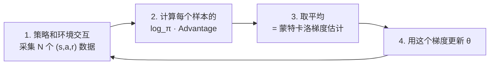

# 前置知识：蒙特卡洛采样——积分算不出来怎么办

> **为什么要读这篇**：在 [期望](/前置知识/002c_前置知识_期望方差与蒙特卡洛采样) 那篇中我们知道了 $V(s) = \int Q(s,a) \pi(a|s) da$，但这个积分**算不出来**（因为 $Q$ 没有解析形式，而且积分维度可能是 7 维或更高）。蒙特卡洛方法的核心思想极其简单：**既然积分算不出来，那就采几个样本取平均，当作近似值**。整个 RL 训练——从策略梯度到 value 函数估计——都建立在这个想法之上。

**标签**: `#前置知识` `#概率论` `#蒙特卡洛` `#采样` `#策略梯度` `#方差减小`

**知识链接**：
- [期望](/前置知识/002c_前置知识_期望方差与蒙特卡洛采样) — 蒙特卡洛近似的对象就是期望
- [方差与标准差](/前置知识/002c2_前置知识_方差与标准差) — 方差决定蒙特卡洛估计的精度
- [概率密度函数与高斯分布](/前置知识/002b_前置知识_概率密度函数与高斯分布) — 采样来源的分布
- [策略梯度与 PPO](/前置知识/000a_前置知识_策略梯度与PPO) — 策略梯度就是用蒙特卡洛估计的

---

## 贯穿全文的例子

> 延续之前的场景：1-DOF 机器人，策略 $\pi(a|s) = \mathcal{N}(4.0, 1.0)$，奖励 $r(a) = -|a - 5.0|$。
>
> 我们想算 $\mathbb{E}[r(a)] = \int (-|a-5|) \cdot \mathcal{N}(a; 4, 1) \, da$。
>
> 这个积分没有简单的解析解。但我们可以：让机器人执行 10 次，记录每次的奖励，取平均——这就是蒙特卡洛。

---

## 第一部分：核心思想

### 1.1 从一个算不出的积分说起

$$
\mathbb{E}_{a \sim \pi}[r(a)] = \int_{-\infty}^{+\infty} r(a) \cdot \pi(a) \, da = \;?
$$

为什么算不出来？
- $r(a) = -|a-5|$ 含有绝对值，和高斯密度相乘后没有简洁的原函数
- 更现实的情况：$r(a)$ 是黑箱环境给出的，你甚至没有公式

### 1.2 蒙特卡洛的核心等式

$$
\mathbb{E}_{x \sim p}[f(x)] \approx \frac{1}{N}\sum_{i=1}^N f(x_i), \quad x_i \sim p
$$

**翻译成操作步骤**：

1. **从分布 $p$ 中采 $N$ 个样本** $x_1, x_2, \ldots, x_N$
2. **对每个样本算函数值** $f(x_1), f(x_2), \ldots, f(x_N)$
3. **取平均** $\frac{1}{N}(f(x_1) + f(x_2) + \cdots + f(x_N))$

就这么简单。没有积分，没有求导，只有"采样 + 算值 + 取平均"。

### 1.3 完整数值演示

目标：估计 $\mathbb{E}_{a \sim \mathcal{N}(4,1)}[-|a-5|]$

**第 1 步：从 $\mathcal{N}(4, 1)$ 中采 10 个样本**

| 样本编号 | $a_i$ | 来源 |
|---------|--------|------|
| 1 | 3.21 | 随机采样 |
| 2 | 4.87 | 随机采样 |
| 3 | 3.56 | 随机采样 |
| 4 | 4.12 | 随机采样 |
| 5 | 5.34 | 随机采样 |
| 6 | 2.89 | 随机采样 |
| 7 | 4.65 | 随机采样 |
| 8 | 3.78 | 随机采样 |
| 9 | 4.91 | 随机采样 |
| 10 | 4.43 | 随机采样 |

**第 2 步：对每个样本算 $r(a_i) = -|a_i - 5|$**

| $a_i$ | $r(a_i) = -|a_i - 5|$ |
|--------|----------------------|
| 3.21 | -1.79 |
| 4.87 | -0.13 |
| 3.56 | -1.44 |
| 4.12 | -0.88 |
| 5.34 | -0.34 |
| 2.89 | -2.11 |
| 4.65 | -0.35 |
| 3.78 | -1.22 |
| 4.91 | -0.09 |
| 4.43 | -0.57 |

**第 3 步：取平均**

$$
\hat{\mathbb{E}}[r] = \frac{-1.79 + (-0.13) + (-1.44) + (-0.88) + (-0.34) + (-2.11) + (-0.35) + (-1.22) + (-0.09) + (-0.57)}{10}
$$

$$
= \frac{-8.92}{10} = -0.892
$$

（真实值约为 -1.20，10 个样本的近似有约 25% 误差。用 1000 个样本误差会降到 ~3%。）

### 1.4 为什么这么做是对的？

**大数定律（Law of Large Numbers）**：如果 $x_1, x_2, \ldots, x_N$ 是独立同分布的，那么当 $N \to \infty$ 时：

$$
\frac{1}{N}\sum_{i=1}^N f(x_i) \xrightarrow{N \to \infty} \mathbb{E}[f(X)]
$$

直觉：采样越多，各种 $x$ 值出现的频率越接近其真实概率 $p(x)$ → 样本均值越接近概率加权平均（期望）。

---

## 第二部分：蒙特卡洛在 RL 中的具体应用

### 2.1 估计 Value 函数

理论：$V(s) = \mathbb{E}_{a \sim \pi}[Q(s,a)]$

蒙特卡洛做法：在状态 $s$ 下让策略跑 $N$ 条轨迹，记录每条的累积回报 $R_1, R_2, \ldots, R_N$：

$$
\hat{V}(s) = \frac{1}{N}\sum_{i=1}^N R_i
$$

**对照公式模板**：
- 随机变量：轨迹（由动作的随机性决定）
- 函数 $f$：累积回报 $R$
- 分布 $p$：策略 $\pi$ 在状态 $s$ 下诱导的轨迹分布
- 采样操作：让策略实际跑 $N$ 次

### 2.2 估计策略梯度

理论：$\nabla_\theta J = \mathbb{E}_{a \sim \pi_\theta}[\nabla_\theta \log\pi_\theta(a|s) \cdot A(s,a)]$

蒙特卡洛做法：

$$
\hat{\nabla}_\theta J = \frac{1}{N}\sum_{i=1}^N \nabla_\theta \log\pi_\theta(a_i|s_i) \cdot A(s_i, a_i)
$$

**对照公式模板**：
- 随机变量：$(s_i, a_i)$ 对（从策略 rollout 中收集）
- 函数 $f$：$\nabla_\theta\log\pi \cdot A$（梯度乘优势）
- 分布 $p$：策略 $\pi_\theta$ 和环境动力学的联合
- 采样操作：让策略在环境中交互，收集 $N$ 个 step

**PPO 每个训练迭代在做什么**：



### 2.3 训练损失函数

理论：$L(\theta) = \mathbb{E}_{(x,y) \sim \mathcal{D}}[(y - f_\theta(x))^2]$

蒙特卡洛做法（= mini-batch SGD）：

$$
\hat{L}(\theta) = \frac{1}{B}\sum_{i=1}^B (y_i - f_\theta(x_i))^2, \quad (x_i, y_i) \sim \mathcal{D}
$$

> 每个 mini-batch 就是一次蒙特卡洛估计。`loss.mean()` = $\frac{1}{N}\sum f(x_i)$。

---

## 第三部分：估计精度——需要多少样本？

### 3.1 标准误差公式

蒙特卡洛估计的精度由**标准误差（SE）**衡量：

$$
\text{SE} = \frac{\sigma_f}{\sqrt{N}}
$$

其中 $\sigma_f = \sqrt{\text{Var}(f(X))}$ 是"单个样本的 $f(X)$ 值"的标准差。

**含义**：估计值 $\hat{\mathbb{E}}$ 大约有 68% 的概率落在真实值 ± SE 的范围内。

### 3.2 数值感受

假设 $\sigma_f = 2.0$（单个样本的奖励标准差为 2）：

| 样本数 $N$ | 标准误差 SE | 含义 |
|-----------|------------|------|
| 1 | 2.0 | 单次执行的结果完全不可信 |
| 10 | 0.63 | 10 次平均，误差约 ±0.63 |
| 100 | 0.20 | 100 次平均，误差约 ±0.20 |
| 1000 | 0.063 | 比较精确了 |
| 10000 | 0.020 | 非常精确 |

**关键结论**：误差 $\propto 1/\sqrt{N}$。要把误差减半，需要 4 倍样本。这就是 RL 训练慢的根本原因——需要大量环境交互来获得可靠的梯度估计。

### 3.3 和 batch size 的关系

| RL 参数 | 对应蒙特卡洛中的 | 影响 |
|---------|-----------------|------|
| batch size / rollout 步数 | $N$（样本数） | 越大 → SE 越小 → 梯度越准 → 训练越稳定 |
| 奖励噪声 / 环境随机性 | $\sigma_f$（单样本方差） | 越大 → 需要越多样本 |
| 学习率 | — | 梯度不准时降低学习率可以缓解（但不能根治） |

---

## 第四部分：减小方差的实用技巧

蒙特卡洛估计的瓶颈是方差。RL 中的几乎所有技巧都是在"不改变期望（无偏）的前提下减小方差"：

### 4.1 Baseline 减去

原始：$\hat{g} = \frac{1}{N}\sum_i \nabla\log\pi(a_i|s_i) \cdot R_i$

改进：$\hat{g} = \frac{1}{N}\sum_i \nabla\log\pi(a_i|s_i) \cdot (R_i - b)$

其中 $b$ 是不依赖 $a$ 的任何值（通常用 $V(s)$）。

**为什么期望不变**：$\mathbb{E}[\nabla\log\pi \cdot b] = b \cdot \mathbb{E}[\nabla\log\pi] = b \cdot 0 = 0$（score function 的期望为 0）。

**为什么方差减小**：$R_i$ 可能在 -10 到 +10 之间波动，但 $R_i - V(s_i)$（优势）只在 -3 到 +3 之间波动。被乘的东西波动小了，整体方差就小了。

**数值例子**：

假设 5 个样本的回报：$R = [8, 3, 12, 5, 7]$，$V(s) = 7$（baseline）

- 不减 baseline：方差 = $\text{Var}([8, 3, 12, 5, 7]) = 9.2$
- 减去 baseline：$A = [1, -4, 5, -2, 0]$，方差 = $\text{Var}([1,-4,5,-2,0]) = 9.2$

等等，这个例子方差一样？因为减常数不改变方差（$\text{Var}(X-c) = \text{Var}(X)$）！

真正的方差减小发生在**乘以 $\nabla\log\pi$ 之后**：当 $R$ 全是正的（如 3~12），$\nabla\log\pi \cdot R$ 意味着"所有动作都往好的方向推"——信号方向混乱。减去 baseline 后有正有负（-4~+5），只有真正好的动作（$A>0$）被强化，差的被削弱——信号更清晰，方差更小。

### 4.2 增大 batch size

最直接的方法。SE $= \sigma / \sqrt{N}$，加大 $N$ 直接降低。

代价：需要更多环境交互（wall-clock 时间）或更多并行环境。

### 4.3 GAE（Generalized Advantage Estimation）

GAE 通过参数 $\lambda \in [0, 1]$ 在偏差和方差之间做折中：
- $\lambda = 1$：纯蒙特卡洛回报（无偏但高方差）
- $\lambda = 0$：纯 TD 单步估计（低方差但有偏）
- $\lambda = 0.95$：PPO 默认值，折中

详见 [策略梯度与 PPO](/前置知识/000a_前置知识_策略梯度与PPO)。

---

## 第五部分：代码中的蒙特卡洛

```python
import torch
from torch.distributions import Normal

# ===== 场景：估计策略的平均奖励 =====
# 策略：N(4.0, 1.0)，奖励：r(a) = -|a - 5|

mu, sigma = 4.0, 1.0
dist = Normal(mu, sigma)

def reward(a):
    return -(a - 5.0).abs()

# ---- 蒙特卡洛估计 ----
N = 10000
samples = dist.sample((N,))        # 第 1 步：采 N 个动作
rewards = reward(samples)           # 第 2 步：算每个动作的奖励
estimate = rewards.mean()           # 第 3 步：取平均
se = rewards.std() / (N ** 0.5)     # 标准误差

print(f"E[r(a)] ≈ {estimate:.4f} ± {se:.4f}")
# 输出类似：E[r(a)] ≈ -1.2004 ± 0.0076

# ===== 对照：PPO 中的策略梯度 =====
# 完全相同的"采样 + 算值 + 取平均"模式

# 已经从环境中采集了一批数据
states = torch.randn(2048, 4)        # 2048 个状态
actions = torch.randn(2048, 2)       # 2048 个动作
advantages = torch.randn(2048)       # 2048 个优势值

# 计算 log_π(a|s) · A  对应  f(x_i)
mu_theta = policy_net(states)
dist = Normal(mu_theta, 0.5)
log_probs = dist.log_prob(actions).sum(-1)
f_values = log_probs * advantages    # f(x_i) = log_π · A

# 蒙特卡洛估计策略梯度 loss
policy_loss = -f_values.mean()       # .mean() = 1/N Σ = 蒙特卡洛
policy_loss.backward()               # 自动微分算 ∇θ
```

**代码 ↔ 蒙特卡洛三步走的对应**：

| 蒙特卡洛步骤 | 对应代码 | 对应数学 |
|-------------|---------|---------|
| 1. 从分布采 N 个样本 | `dist.sample((N,))` 或 rollout 收集数据 | $x_i \sim p$ |
| 2. 对每个样本算函数值 | `reward(samples)` 或 `log_probs * advantages` | $f(x_i)$ |
| 3. 取平均 | `.mean()` | $\frac{1}{N}\sum_i f(x_i)$ |

---

## 总结

| 概念 | 一句话 |
|------|--------|
| 蒙特卡洛估计 | $\mathbb{E}[f(X)] \approx \frac{1}{N}\sum f(x_i)$，用采样代替积分 |
| 为什么有效 | 大数定律：$N$ 越大，近似越准 |
| 精度 | 标准误差 $= \sigma/\sqrt{N}$，误差减半需要 4 倍样本 |
| 在 RL 中 | 策略梯度、Value 估计、loss 计算全是蒙特卡洛 |
| 核心瓶颈 | 方差太大 → 需要大量样本 → 训练慢 |
| 解决方案 | Baseline、GAE、大 batch、重要性采样 |

**金句**：代码里每一个 `.mean()` 的背后，都站着蒙特卡洛方法。

---

## 延伸阅读

- [期望](/前置知识/002c_前置知识_期望方差与蒙特卡洛采样) — 蒙特卡洛近似的对象
- [方差与标准差](/前置知识/002c2_前置知识_方差与标准差) — 决定蒙特卡洛精度的关键量
- [策略梯度与 PPO](/前置知识/000a_前置知识_策略梯度与PPO) — GAE 的 λ 怎么折中偏差和方差
- [概率密度函数与高斯分布](/前置知识/002b_前置知识_概率密度函数与高斯分布) — 采样来源的分布长什么样
