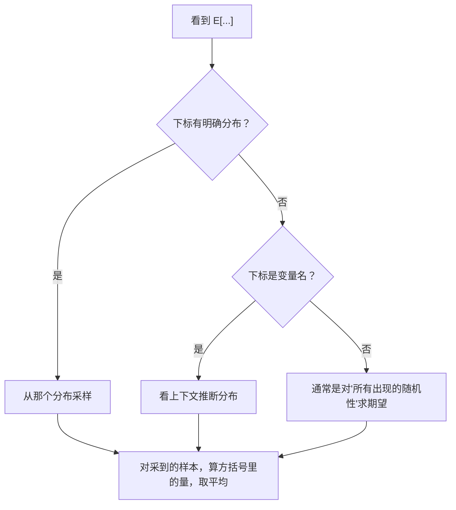

# 前置知识：期望（Expected Value）——从"平均"到"对函数求期望"再到"条件期望"

> **为什么要读这篇**：RL 的目标函数 $J(\theta) = \mathbb{E}[\sum r_t]$、策略梯度 $\nabla J = \mathbb{E}[\nabla\log\pi \cdot A]$、Value 函数 $V(s) = \mathbb{E}[Q(s,a)]$——全是期望。但"期望"不只是"求平均"那么简单。本文用一个**完整的机器人场景**，从最简单的"骰子求平均"一步步推到"对函数求期望"和"条件期望"，让你在每一步都能回答"这在物理上代表什么、为什么要这样算、在什么场景用"。

**标签**: `#前置知识` `#概率论` `#期望` `#条件期望` `#策略评估` `#机器学习基础`

**知识链接**：
- [概率密度函数与高斯分布](/前置知识/002b_前置知识_概率密度函数与高斯分布) — 本文用到的 PDF $p(x)$ 的详细解释
- [方差与标准差](/前置知识/002c2_前置知识_方差与标准差) — 期望只告诉你"平均值"，方差告诉你"波动有多大"
- [蒙特卡洛采样](/前置知识/002c3_前置知识_蒙特卡洛采样) — 当积分算不出来时，怎么用采样来近似期望
- [Q 函数与 Value 函数](/前置知识/000o_前置知识_Q函数与Value函数) — $V(s)$ 和 $Q(s,a)$ 的精确定义就是条件期望
- [策略梯度与 PPO](/前置知识/000a_前置知识_策略梯度与PPO) — 策略梯度公式里的 $\mathbb{E}$ 在本文中会被完全拆解

---

## 贯穿全文的例子

> **场景**：一个 1-DOF 机器人手臂在水平面上移动。它的任务是把手臂末端移到目标位置 $x^* = 5.0$ cm 处。
>
> - **状态 $s$**：目标位置 $x^* = 5.0$ cm（固定不变，本例中简化为已知常数）
> - **动作 $a$**：手臂实际移动到的位置（连续值，单位 cm）
> - **策略**：高斯分布 $\pi(a|s) = \mathcal{N}(a;\, \mu=4.0, \sigma^2=1.0)$ 
>   - 均值 $\mu = 4.0$：策略"觉得"应该移到 4.0 cm（还不太准）
>   - 标准差 $\sigma = 1.0$：每次执行有 ±1cm 左右的随机性
> - **奖励函数**：$r(a) = -|a - 5.0|$（离目标越远，惩罚越大；到达目标得 0 分）
>
> 我们的核心问题是：**这个策略"平均来说"能得多少奖励？** 这就是期望要回答的问题。

---

## 第一层：最简单的期望——"结果本身的平均"

### 场景简化：只有 3 个可能的动作（离散版）

假设机器人不是连续移动，而是只能选择 3 个位置之一：

| 动作 $a$ | 概率 $\pi(a)$ | 含义 |
|----------|-------------|------|
| 3.0 cm | 0.2 | 20% 的概率移到 3.0 |
| 4.0 cm | 0.5 | 50% 的概率移到 4.0 |
| 5.0 cm | 0.3 | 30% 的概率移到 5.0 |

问：机器人"平均会移到哪里"？

$$
\mathbb{E}[a] = 3.0 \times 0.2 + 4.0 \times 0.5 + 5.0 \times 0.3
$$

逐步计算：
- 第一项：$3.0 \times 0.2 = 0.6$（3.0 对平均位置的贡献：因为它只有 20% 概率发生，贡献被打了折）
- 第二项：$4.0 \times 0.5 = 2.0$（4.0 概率最大，贡献也最大）
- 第三项：$5.0 \times 0.3 = 1.5$

$$
\mathbb{E}[a] = 0.6 + 2.0 + 1.5 = 4.1 \text{ cm}
$$

> **物理含义**：如果让这个策略执行 1000 次，把 1000 次的实际位置取平均，你会得到约 4.1 cm。它不等于任何一个具体的动作值——它是概率加权的"重心"。

### 为什么不是简单的 $(3+4+5)/3 = 4$？

因为三个动作发生的概率**不相等**。$a=4.0$ 发生的概率是 $a=3.0$ 的 2.5 倍，所以它对平均值的"拉力"更大。期望就是这种**按概率加权**的平均——概率大的值对结果有更大的影响。

### 一般公式（离散）

$$
\mathbb{E}[X] = \sum_i x_i \cdot P(X = x_i)
$$

这里的"每一项 $x_i \cdot P(X = x_i)$"代表：**这个结果本身的值** × **它发生的概率**。所有项加起来 = 综合考虑了所有可能性之后的"中心位置"。

---

## 第二层：连续情况——积分代替求和

### 为什么需要积分

现在回到连续版本：动作 $a$ 可以是任意实数，$a \sim \mathcal{N}(4.0, 1.0)$。可能的动作有**无穷多个**（3.001, 3.002, 3.0021, ...），不能一个个列出来求和。

解决方案：把"求和"替换为"积分"。积分本质上就是"无穷多个无穷小的项加起来"。

$$
\mathbb{E}[a] = \int_{-\infty}^{+\infty} a \cdot p(a) \, da
$$

**和离散公式的对应关系**：

| 离散 | 连续 | 含义 |
|------|------|------|
| $x_i$ | $a$ | 某个具体的结果值 |
| $P(X = x_i)$ | $p(a) \, da$ | 这个结果发生的"概率"（密度 × 微小宽度） |
| $\sum_i$ | $\int$ | 遍历所有可能的结果 |

**数值结果**：对于 $\mathcal{N}(\mu=4.0, \sigma^2=1.0)$，数学上可以证明 $\mathbb{E}[a] = \mu = 4.0$。

这很直觉：高斯分布关于 $\mu$ 对称，左边和右边的"贡献"互相抵消，重心就在 $\mu$ 处。

---

## 第三层：对函数求期望——这是关键跳跃

### 问题的变化

前面算的是"动作**本身**的平均值"。但我们真正关心的不是"平均移到哪里"，而是**"平均能得多少奖励"**。

奖励是动作的**函数**：$r(a) = -|a - 5.0|$。不同的 $a$ 会产生不同的奖励：
- $a = 3.0$ → $r = -|3-5| = -2.0$（离目标远，惩罚大）
- $a = 4.0$ → $r = -|4-5| = -1.0$（近一些）
- $a = 5.0$ → $r = -|5-5| = 0$（完美！）

现在的问题是：**考虑到每个动作发生的概率，平均奖励是多少？**

### 离散版的计算

还是用 3 个动作的简化版：

$$
\mathbb{E}[r(a)] = r(3.0) \times P(a=3.0) + r(4.0) \times P(a=4.0) + r(5.0) \times P(a=5.0)
$$

代入数字：

$$
\mathbb{E}[r(a)] = (-2.0) \times 0.2 + (-1.0) \times 0.5 + 0 \times 0.3
$$

$$
= -0.4 + (-0.5) + 0 = -0.9
$$

> **物理含义**：这个策略平均每次执行会得到 -0.9 的奖励。不是最差的 -2.0（因为不总是选 3.0），也不是最好的 0（因为不总是选 5.0），而是按概率加权后的综合水平。

### 关键认知：$\mathbb{E}[f(X)]$ 的结构

刚才我们做的事情是：

$$
\mathbb{E}[f(X)] = \sum_i \underbrace{f(x_i)}_{\text{如果这个结果发生了，}\atop\text{函数值是多少}} \times \underbrace{P(X = x_i)}_{\text{这个结果}\atop\text{发生的概率}}
$$

**这和 $\mathbb{E}[X]$ 的区别**：

| 公式 | 在求什么的平均 | 物理含义 |
|------|--------------|---------|
| $\mathbb{E}[X] = \sum x_i \cdot P(x_i)$ | 随机变量**本身**的平均 | "机器人平均移到哪里" |
| $\mathbb{E}[f(X)] = \sum f(x_i) \cdot P(x_i)$ | 随机变量经过**某个函数变换后**的平均 | "机器人平均得多少奖励" |

只要把 $x_i$ 替换成 $f(x_i)$，其他完全一样——还是"值 × 概率，然后加起来"。唯一的区别是：你关心的"值"不再是 $x$ 本身，而是 $x$ 经过某个变换 $f$ 之后的结果。

### 连续版本

$$
\mathbb{E}[r(a)] = \int_{-\infty}^{+\infty} \underbrace{r(a)}_{\text{奖励函数}} \cdot \underbrace{p(a)}_{\text{动作的概率密度}} \, da
$$

代入我们的场景：$r(a) = -|a - 5|$，$p(a) = \mathcal{N}(a; 4.0, 1.0)$：

$$
\mathbb{E}[r(a)] = \int_{-\infty}^{+\infty} (-|a - 5|) \cdot \frac{1}{\sqrt{2\pi}} e^{-\frac{(a-4)^2}{2}} \, da
$$

这个积分没有简单的解析解（因为绝对值函数的存在），但可以数值计算。结果约为 $-1.20$。

**完整的思考过程**：
1. 想象 $a$ 在整个实数轴上"滑动"
2. 在每个位置 $a$，计算两个量：奖励 $r(a) = -|a-5|$，和"这个 $a$ 出现的可能性" $p(a)$
3. 两者相乘 = "这个位置对平均奖励的贡献"
4. 把所有位置的贡献积起来 = 平均奖励

在 $a=4.0$ 附近：$r(4.0) = -1.0$，$p(4.0)$ 很大（分布的峰值处）→ 贡献大
在 $a=0$ 附近：$r(0) = -5.0$，$p(0)$ 极小（离中心 4 个标准差）→ 贡献约为 0
在 $a=5.0$ 附近：$r(5.0) = 0$，$p(5.0)$ 中等 → 贡献 ≈ 0（因为 $r$ 本身就是 0）

### 为什么这件事在 RL 中无处不在？

因为 RL 的核心问题就是：**给定一个策略（=动作的概率分布），它能获得多少平均回报？**

$$
J(\pi) = \mathbb{E}_{a \sim \pi}[r(a)] = \int r(a) \cdot \pi(a) \, da
$$

这就是 $\mathbb{E}[f(X)]$ 的一个实例：$X = a$，$f = r$，$p = \pi$。

---

## 第四层：条件期望——"在特定条件下的平均"

### 引入问题

前面的例子中，我们固定了状态 $s$（目标在 5.0）。但真实 RL 中，**状态会变化**。比如：
- 状态 $s_1$：目标在 5.0 cm
- 状态 $s_2$：目标在 2.0 cm

不同状态下，策略输出不同的动作分布：
- $\pi(a|s_1) = \mathcal{N}(a;\, 4.0, 1.0)$（目标在右边 → 往右移）
- $\pi(a|s_2) = \mathcal{N}(a;\, 2.5, 1.0)$（目标在左边 → 往左移）

**条件期望**回答的问题是：**在某个特定状态下，策略的平均表现如何？**

### 条件期望的定义

$$
\mathbb{E}[r(a) \,|\, s] = \int r(a, s) \cdot \pi(a|s) \, da
$$

读作："在状态 $s$ 的条件下，奖励 $r(a,s)$ 的期望"。

**和无条件期望的区别**：

| | 无条件期望 | 条件期望 |
|---|-----------|---------|
| 公式 | $\mathbb{E}[r(a)] = \int r(a) \cdot p(a) \, da$ | $\mathbb{E}[r(a)|s] = \int r(a,s) \cdot \pi(a|s) \, da$ |
| 积分变量 | 所有可能的 $a$ | 所有可能的 $a$（但 $s$ 被固定了） |
| 概率分布 | $a$ 的无条件分布 $p(a)$ | 给定 $s$ 后 $a$ 的条件分布 $\pi(a|s)$ |
| 结果 | 一个数 | 一个关于 $s$ 的**函数**（不同 $s$ 得到不同的值） |

**关键理解**：条件期望 $\mathbb{E}[r|s]$ 不是一个固定的数，而是一个**关于 $s$ 的函数**。你给我一个 $s$，我就能算出对应的期望值。

### 数值例子：完整计算

**状态 $s_1$**：目标在 5.0，策略 $\pi(a|s_1) = \mathcal{N}(4.0, 1.0)$，奖励 $r(a, s_1) = -|a - 5.0|$

用离散近似（取 5 个代表点）来感受计算过程：

| $a$ | $\pi(a|s_1)$ 近似 | $r(a, s_1) = -|a-5|$ | 贡献 = $r \times \pi$ |
|-----|-------------------|----------------------|---------------------|
| 2.0 | 0.05 | -3.0 | -0.15 |
| 3.0 | 0.24 | -2.0 | -0.48 |
| 4.0 | 0.40 | -1.0 | -0.40 |
| 5.0 | 0.24 | 0 | 0 |
| 6.0 | 0.05 | -1.0 | -0.05 |

$$
\mathbb{E}[r|s_1] \approx -0.15 + (-0.48) + (-0.40) + 0 + (-0.05) = -1.08
$$

**状态 $s_2$**：目标在 2.0，策略 $\pi(a|s_2) = \mathcal{N}(2.5, 1.0)$，奖励 $r(a, s_2) = -|a - 2.0|$

| $a$ | $\pi(a|s_2)$ 近似 | $r(a, s_2) = -|a-2|$ | 贡献 |
|-----|-------------------|----------------------|------|
| 0.5 | 0.05 | -1.5 | -0.075 |
| 1.5 | 0.24 | -0.5 | -0.12 |
| 2.5 | 0.40 | -0.5 | -0.20 |
| 3.5 | 0.24 | -1.5 | -0.36 |
| 4.5 | 0.05 | -2.5 | -0.125 |

$$
\mathbb{E}[r|s_2] \approx -0.075 + (-0.12) + (-0.20) + (-0.36) + (-0.125) = -0.88
$$

**解读**：在 $s_2$ 下策略表现稍好（-0.88 > -1.08），因为策略均值 2.5 离目标 2.0 更近。

### 现在解读 $V(s) = \mathbb{E}_{a \sim \pi(\cdot|s)}[Q(s,a)]$

这个公式是 RL 中 Value 函数的定义。把它和我们的例子对照：

$$
V(s) = \mathbb{E}_{a \sim \pi(\cdot|s)}[Q(s, a)] = \int Q(s, a) \cdot \pi(a|s) \, da
$$

**逐项对应**：

| 公式中的符号 | 对应我们例子中的 | 含义 |
|-------------|----------------|------|
| $s$ | 状态（目标位置） | 被固定的条件 |
| $a$ | 动作（手臂移到哪） | 被积分/求期望的随机变量 |
| $\pi(a|s)$ | $\mathcal{N}(a;\, \mu(s), \sigma^2)$ | 动作的概率密度（分布权重） |
| $Q(s,a)$ | $r(a, s) = -|a - x^*|$ | "在状态 $s$ 下执行动作 $a$ 有多好"的评分 |
| $V(s)$ | $\mathbb{E}[r|s]$（约 -1.08 或 -0.88） | "在状态 $s$ 下，按策略行动的平均得分" |
| $\int \cdot \, da$ | 对所有可能的动作求积分 | "考虑策略可能输出的所有动作" |

**用自然语言翻译整个公式**：

> $V(s)$ = "在状态 $s$ 下，策略会随机选择各种动作 $a$（按 $\pi(a|s)$ 的概率），每个 $a$ 对应一个 Q 值评分 $Q(s,a)$。把所有可能动作的 Q 值按概率加权平均，就是这个状态的'价值'。"

**为什么这样定义有意义**：因为 $V(s)$ 回答了一个关键问题——"我现在处于状态 $s$，如果接下来一直按策略 $\pi$ 行动，**平均来说**我能得多少总回报？" 如果 $V(s_1) > V(s_2)$，说明状态 $s_1$ 更"值钱"——从 $s_1$ 出发比从 $s_2$ 出发更有希望获得高回报。

---

## 第五层：$\mathbb{E}[f(X)]$ 的一般使用模式

现在你理解了完整的思路，让我总结"对函数求期望"的一般使用模式：

### 使用模式：三步走

**第 1 步：确定"谁是随机的"**
- 看 $\mathbb{E}$ 的下标或上下文，确定哪个变量是随机变量
- 例如 $\mathbb{E}_{a \sim \pi}[\cdot]$ → $a$ 是随机的

**第 2 步：确定"关心什么量"**
- 方括号 $[\cdot]$ 里面的东西就是你关心的函数 $f$
- 例如 $\mathbb{E}_a[Q(s,a)]$ → 关心的是 $Q(s,a)$（它是 $a$ 的函数）

**第 3 步：加权平均**
- 对所有可能的随机变量值，用概率作为权重，算 $f$ 的加权平均
- 离散：$\sum_i f(x_i) P(x_i)$
- 连续：$\int f(x) p(x) dx$

### 实战例子对照表

下面列出 RL/ML 中最常见的几个"对函数求期望"的实例，全部用同一个三步框架拆解：

---

**实例 1：策略的平均回报**

$$
J(\pi) = \mathbb{E}_{a \sim \pi(\cdot|s)}[r(s, a)]
$$

| 步骤 | 内容 |
|------|------|
| 谁是随机的？ | 动作 $a$，它从策略 $\pi(\cdot|s)$ 中采样 |
| 关心什么量？ | 奖励 $r(s,a)$（动作的好坏程度） |
| 怎么算？ | $\int r(s,a) \cdot \pi(a|s) \, da$ = "所有可能动作的奖励，按策略概率加权" |
| 物理含义 | "让这个策略跑无穷多次，平均每次能得多少奖励" |

---

**实例 2：Value 函数（你觉得难懂的那个）**

$$
V(s) = \mathbb{E}_{a \sim \pi(\cdot|s)}[Q(s,a)]
$$

| 步骤 | 内容 |
|------|------|
| 谁是随机的？ | 动作 $a$ |
| 关心什么量？ | $Q(s,a)$（从当前状态执行 $a$ 后的**长期**累积回报） |
| 怎么算？ | $\int Q(s,a) \cdot \pi(a|s) \, da$ |
| 物理含义 | "在状态 $s$ 下，策略可能选各种动作，每个动作有个长期评分 $Q$。把这些评分按策略的偏好加权平均" |
| 和实例 1 的区别 | 实例 1 只看**即时**奖励 $r$；这里看的是**长期**累积回报 $Q$（包含未来所有步的奖励） |

---

**实例 3：损失函数**

$$
L(\theta) = \mathbb{E}_{(x,y) \sim \mathcal{D}}\left[(y - f_\theta(x))^2\right]
$$

| 步骤 | 内容 |
|------|------|
| 谁是随机的？ | 数据点 $(x, y)$，它从数据分布 $\mathcal{D}$ 中采样 |
| 关心什么量？ | $(y - f_\theta(x))^2$（预测误差的平方） |
| 怎么算？ | 对数据分布中所有可能的 $(x,y)$ 对，算误差平方的概率加权平均 |
| 物理含义 | "模型在**整个数据分布**上的平均预测误差"（不只是训练集这几个点） |
| 实际操作 | 用训练集的 mini-batch 近似：`loss = ((y - model(x))**2).mean()` |

---

**实例 4：策略梯度**

$$
\nabla_\theta J = \mathbb{E}_{a \sim \pi_\theta}\left[\nabla_\theta \log\pi_\theta(a|s) \cdot A(s,a)\right]
$$

| 步骤 | 内容 |
|------|------|
| 谁是随机的？ | 动作 $a$（从当前策略 $\pi_\theta$ 中采样） |
| 关心什么量？ | $\nabla_\theta\log\pi_\theta(a|s) \cdot A(s,a)$（梯度方向 × 动作优势） |
| 怎么算？ | 理论上是积分，实际用蒙特卡洛近似（采 $N$ 个动作取平均） |
| 物理含义 | "好动作（$A>0$）→ 增加其概率的方向；坏动作（$A<0$）→ 减少其概率的方向。对所有可能动作加权平均后，得到一个'最佳更新方向'" |

---

## 第六层：$\mathbb{E}$ 下标的完整解读方法

论文里 $\mathbb{E}$ 下标写法多种多样，容易搞混。核心规则：

> **下标告诉你两件事：(1) 什么是随机的  (2) 它服从什么分布**

### 常见写法逐个解读

**写法 1**：$\mathbb{E}_{a \sim \pi(\cdot|s)}[\cdot]$

- 随机变量：$a$
- 分布：$\pi(\cdot|s)$（给定状态 $s$ 后的策略分布）
- 含义：对动作 $a$ 求期望，$a$ 按策略采样

**写法 2**：$\mathbb{E}_{s \sim d^\pi}[\cdot]$

- 随机变量：$s$
- 分布：$d^\pi$（策略 $\pi$ 诱导的状态访问分布——长期运行策略后各状态被访问的频率）
- 含义：对所有可能遇到的状态求平均

**写法 3**：$\mathbb{E}_{\tau \sim \pi}[\cdot]$

- 随机变量：整条轨迹 $\tau = (s_0, a_0, s_1, a_1, \ldots)$
- 分布：策略 $\pi$ 和环境动力学共同决定的轨迹分布
- 含义：对所有可能的轨迹求平均

**写法 4**：$\mathbb{E}_{(s,a) \sim \mathcal{D}}[\cdot]$

- 随机变量：状态-动作对 $(s, a)$
- 分布：从 replay buffer $\mathcal{D}$ 中均匀随机抽取
- 含义：对 buffer 中存的所有经验求平均

**写法 5**：$\mathbb{E}_{\epsilon \sim \mathcal{N}(0, I)}[\cdot]$

- 随机变量：噪声 $\epsilon$
- 分布：标准正态分布
- 含义：对随机噪声求平均（扩散模型训练中常见）

**写法 6**：$\mathbb{E}_t[\cdot]$（无分布标注）

- 随机变量：时间步 $t$
- 分布：通常是均匀分布（对轨迹中所有时间步等权平均）
- 含义：对一条轨迹中所有步骤求平均

### 判断流程图

---

## 第七层：期望的关键性质——线性性

### 公式

$$
\mathbb{E}[aX + bY + c] = a\,\mathbb{E}[X] + b\,\mathbb{E}[Y] + c
$$

**不管 $X$ 和 $Y$ 是否独立**，这都成立。

### 为什么这个性质重要

它让你可以把复杂的期望"拆开"分别算。

**RL 中的应用**：轨迹回报是各步奖励之和：

$$
R(\tau) = r_0 + r_1 + r_2 + \cdots + r_T
$$

由线性性：

$$
\mathbb{E}[R(\tau)] = \mathbb{E}[r_0] + \mathbb{E}[r_1] + \cdots + \mathbb{E}[r_T]
$$

不需要对"整条轨迹"求期望（维度爆炸），可以分解为对"每一步"分别求期望。这是策略梯度推导中反复使用的工具。

### 数值例子

回到机器人场景，假设执行 2 步：
- 第 1 步奖励 $r_1$：均值 -1.0
- 第 2 步奖励 $r_2$：均值 -0.5

总回报期望 = $\mathbb{E}[r_1 + r_2] = \mathbb{E}[r_1] + \mathbb{E}[r_2] = -1.0 + (-0.5) = -1.5$

不需要知道 $r_1$ 和 $r_2$ 的联合分布，线性性让你直接加。

---

## 第八层：为什么 RL 中"期望"无法直接算

回顾 Value 函数：

$$
V(s) = \int Q(s, a) \cdot \pi(a|s) \, da
$$

理论上这是一个积分。但在实际 RL 中**不能直接算**，原因有两个：

1. **$Q(s,a)$ 本身不知道**：它是"从 $(s,a)$ 出发一直走到终点的累积回报"——涉及未来无穷多步的期望，本身就不知道解析形式
2. **积分维度太高**：如果动作是 7 维（7-DOF 机械臂），这是一个 7 维积分。数值积分的计算量随维度指数增长

所以实际中用两种方式绕开：
- **学一个 $Q$ 网络**：用神经网络 $Q_\phi(s,a)$ 近似真实 $Q$（这是 Actor-Critic 方法做的事）
- **用采样代替积分**：$V(s) \approx \frac{1}{N}\sum_{i=1}^N Q(s, a_i)$，其中 $a_i \sim \pi(\cdot|s)$（这是蒙特卡洛方法，详见 [蒙特卡洛采样](/前置知识/002c3_前置知识_蒙特卡洛采样)）

---

## 总结

| 层次 | 公式 | 一句话 |
|------|------|--------|
| 第一层 | $\mathbb{E}[X] = \sum x_i P(x_i)$ | 结果本身的概率加权平均 |
| 第二层 | $\mathbb{E}[X] = \int x \cdot p(x) dx$ | 连续版：积分代替求和 |
| 第三层 | $\mathbb{E}[f(X)] = \int f(x) p(x) dx$ | 对函数求期望：关心的不是 $x$ 本身，而是 $f(x)$ |
| 第四层 | $\mathbb{E}[f(X)|s] = \int f(x,s) p(x|s) dx$ | 条件期望：固定某些条件后，对剩余随机性求平均 |
| 核心用法 | $V(s) = \mathbb{E}_a[Q(s,a)]$ | 所有可能动作的 Q 值，按策略概率加权平均 |

**读到任何 $\mathbb{E}[\cdot]$ 时的思维模板**：
1. 谁是随机的？（看下标）
2. 它服从什么分布？（看下标的 $\sim$ 后面）
3. 关心什么量？（看方括号里面）
4. 把这个量对所有可能取值做概率加权平均 = 期望

---

## 延伸阅读

- [概率密度函数与高斯分布](/前置知识/002b_前置知识_概率密度函数与高斯分布) — $p(x)$ 这个权重函数的详细解释
- [方差与标准差](/前置知识/002c2_前置知识_方差与标准差) — 期望只说了"平均水平"，方差说"波动有多大"
- [蒙特卡洛采样](/前置知识/002c3_前置知识_蒙特卡洛采样) — 当积分算不出来时，怎么用"采样 + 取均值"来近似期望
- [Q 函数与 Value 函数](/前置知识/000o_前置知识_Q函数与Value函数) — $V(s)$ 和 $Q(s,a)$ 的完整定义和直觉
- [条件概率与贝叶斯定理](/前置知识/002d_前置知识_条件概率与贝叶斯定理) — 条件期望中 $\pi(a|s)$ 这个"条件分布"从哪来
