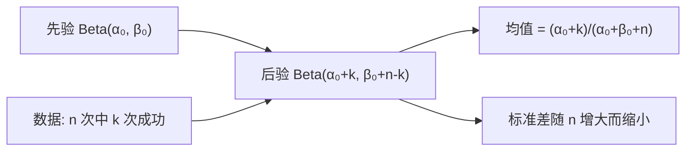

# 前置知识：贝叶斯推断与共轭先验

> **为什么要读这篇**：你可能已经知道贝叶斯定理的公式 $p(\theta|D) \propto p(D|\theta)p(\theta)$，但还不清楚**具体怎么用它来从数据更新对参数的信念**。本文用"估计硬币正面概率"这个最经典的例子，完整走一遍贝叶斯推断的每一步，并解释"共轭先验"为什么能让整个过程变得极其简单。读完后你就能完全看懂 Beta 分布文章第 5 节的推导了。

**标签**: `#前置知识` `#贝叶斯推断` `#共轭先验` `#Beta-Binomial` `#后验更新` `#先验`

**知识链接**：
- [条件概率与贝叶斯定理](/前置知识/002d_前置知识_条件概率与贝叶斯定理) — 贝叶斯定理的公式推导和基本含义
- [二项分布](/前置知识/002d2_前置知识_二项分布) — 本文的似然函数就是二项分布
- [Beta 分布与有界随机变量](/前置知识/002p_前置知识_Beta分布与有界随机变量) — Beta 分布的 PDF 公式和参数含义
- [最大似然估计](/前置知识/002f_前置知识_最大似然估计) — MLE 是贝叶斯推断中"先验为均匀分布"的特殊情况

---

## 贯穿全文的例子

> **场景**：你捡到一枚来历不明的硬币。你想知道它正面朝上的概率 $p$ 到底是多少。
>
> 你的做法：先有一个"初始猜测"（先验），然后通过实际扔硬币收集数据，根据数据更新你的猜测（后验）。扔得越多，你对 $p$ 的估计就越精确。
>
> 这整个"先猜 → 收数据 → 更新"的流程就是**贝叶斯推断**。


---

## 1. 贝叶斯推断的三个角色

在 [条件概率与贝叶斯定理](/前置知识/002d_前置知识_条件概率与贝叶斯定理) 那篇文章中，你已经见过贝叶斯公式：

$$
p(\theta | D) = \frac{p(D | \theta) \cdot p(\theta)}{p(D)}
$$

**这个公式在做什么**：给定观测数据 $D$，计算参数 $\theta$ 的后验分布——即"看到数据之后，我们对 $\theta$ 的信念应该是什么样的分布"。

::: details 📐 逐符号拆解 + 数值代入（点击展开）
**逐符号拆解**：

| 符号 | 名称 | 含义 | 硬币例子中 |
|------|------|------|-----------|
| $\theta$ | 参数 | 你想推断的未知量 | 硬币正面概率 $p \in [0,1]$ |
| $D$ | 数据 | 你观测到的实验结果 | "10 次中 7 次正面" |
| $p(\theta)$ | **先验**（Prior） | 看数据之前对 $\theta$ 的初始信念 | "我觉得 $p$ 大概在 0.5 附近" |
| $p(D|\theta)$ | **似然**（Likelihood） | 如果 $\theta$ 为真，数据出现的概率 | 二项分布 $\binom{10}{7}p^7(1-p)^3$ |
| $p(\theta|D)$ | **后验**（Posterior） | 看到数据后对 $\theta$ 的更新信念 | "现在我觉得 $p$ 大概在 0.65-0.75" |
| $p(D)$ | **证据**（Evidence） | 归一化常数，保证后验积分=1 | $\int_0^1 p(D|p) \cdot p(p) \, dp$ |

**为什么是这个形式**：这就是条件概率的定义 $p(A|B) = p(A,B)/p(B)$ 的直接应用。贝叶斯定理的价值在于：我们**知道**似然 $p(D|\theta)$（因为我们选定了统计模型），也**选定了**先验 $p(\theta)$，所以可以算出后验 $p(\theta|D)$。
:::

### 贝叶斯推断的核心思想

| 步骤 | 动作 | 硬币例子 |
|------|------|---------|
| 1. 选先验 | 用一个分布表达"没看数据前的信念" | Beta(2, 2)："大概公平，但不确定" |
| 2. 收数据 | 做实验，记录结果 | 扔 10 次，7 次正面 |
| 3. 写似然 | 根据统计模型写出 $p(D|\theta)$ | $\binom{10}{7}p^7(1-p)^3$ |
| 4. 算后验 | 贝叶斯公式：后验 ∝ 似然 × 先验 | $p(\theta|D) \propto p^7(1-p)^3 \times p^1(1-p)^1$ |
| 5. 解读 | 后验告诉你"$\theta$ 最可能是什么、有多确定" | 后验均值 ≈ 0.64，比先验的 0.5 偏向数据 |


---

## 2. 具体例子：从头走一遍贝叶斯更新

### 2.1 第一步：选先验

你捡到硬币之前没有任何信息。一种"温和"的先验是 $\text{Beta}(2, 2)$——这表示：
- 你觉得 $p$ 大概在 0.5 附近（$\mathbb{E}[p] = 2/(2+2) = 0.5$）
- 但你不太确定（标准差 $\approx 0.22$，相当宽）
- 你愿意被数据改变想法

为什么选 Beta 分布做先验？因为 $p \in [0,1]$，而 [Beta 分布](/前置知识/002p_前置知识_Beta分布与有界随机变量)就是专门描述 $[0,1]$ 区间随机变量的分布。先验的 PDF：

$$
p(p) = \frac{p^{\alpha_0-1}(1-p)^{\beta_0-1}}{B(\alpha_0, \beta_0)} = \frac{p^1(1-p)^1}{B(2,2)} = 6p(1-p)
$$

**这个公式在做什么**：它描述了"在看到任何数据之前，你觉得 $p$ 各个可能取值的相对可能性"。Beta(2,2) 是一个中间凸起的曲线，$p=0.5$ 处密度最高。

::: details 📐 逐符号拆解 + 数值代入（点击展开）
**逐符号拆解**：

| 符号 | 含义 | 具体是什么 |
|------|------|-----------|
| $p$ | 硬币正面朝上的概率 | 我们要推断的未知参数，$p \in [0,1]$ |
| $\alpha_0, \beta_0$ | Beta 分布的形状参数 | 这里 $\alpha_0=2, \beta_0=2$，控制分布的形状 |
| $B(\alpha_0, \beta_0)$ | Beta 函数（归一化常数） | $B(2,2) = \frac{\Gamma(2)\Gamma(2)}{\Gamma(4)} = \frac{1 \times 1}{6} = \frac{1}{6}$，确保 PDF 积分为 1 |
| $p^{\alpha_0-1}(1-p)^{\beta_0-1}$ | 核函数 | 决定分布形状的部分，这里是 $p^1(1-p)^1 = p(1-p)$ |

**数值代入**：取 $p=0.3$：

$$
p(0.3) = 6 \times 0.3 \times (1-0.3) = 6 \times 0.3 \times 0.7 = 1.26
$$

取 $p=0.5$：

$$
p(0.5) = 6 \times 0.5 \times 0.5 = 1.5 \quad \text{（最大值，对称中心）}
$$

取 $p=0.9$：

$$
p(0.9) = 6 \times 0.9 \times 0.1 = 0.54 \quad \text{（接近边界，密度低）}
$$

**为什么是这个形式**：Beta 分布的 $p^{\alpha-1}(1-p)^{\beta-1}$ 形式天然适合建模 $[0,1]$ 区间的概率参数。$\alpha=\beta=2$ 使分布对称且温和——不会强行把 $p$ 限制在某个值附近，给数据留出充分的"说话空间"。
:::

### 2.2 第二步：收数据

扔 10 次硬币，结果：7 次正面，3 次反面。记为 $k=7, n=10$。

### 2.3 第三步：写似然函数

数据服从 [二项分布](/前置知识/002d2_前置知识_二项分布)。似然函数（固定 $k=7, n=10$，$p$ 为变量）：

$$
p(D|p) = \binom{10}{7} p^7 (1-p)^3
$$

**这个公式在做什么**：它量化了"如果成功率真的是 $p$，观测到'10 次中 7 次正面'这个数据有多大可能"。$p=0.7$ 时似然最大，$p=0.1$ 时似然极小。

::: details 📐 逐符号拆解 + 数值代入（点击展开）
**逐符号拆解**：

| 符号 | 含义 | 具体是什么 |
|------|------|-----------|
| $D$ | 观测到的数据 | "10 次中 7 次正面" |
| $p$ | 成功概率（待推断参数） | 硬币正面朝上的概率，$p \in [0,1]$ |
| $\binom{10}{7}$ | 组合数 | $= 120$，从 10 次中选 7 次为正面的排列方式数 |
| $p^7$ | 7 次正面的联合概率 | 每次正面概率 $p$，独立事件连乘 |
| $(1-p)^3$ | 3 次反面的联合概率 | 每次反面概率 $1-p$，独立事件连乘 |

**数值代入**：

取 $p=0.7$（MLE 估计值）：
$$
p(D|0.7) = 120 \times 0.7^7 \times 0.3^3 = 120 \times 0.0824 \times 0.027 = 0.267
$$

取 $p=0.5$：
$$
p(D|0.5) = 120 \times 0.5^7 \times 0.5^3 = 120 \times 0.5^{10} = 120 \times 0.000977 = 0.117
$$

取 $p=0.3$：
$$
p(D|0.3) = 120 \times 0.3^7 \times 0.7^3 = 120 \times 0.000219 \times 0.343 = 0.009
$$

可以看到 $p=0.7$ 时似然值最大——这就是最大似然估计（MLE）。

**为什么是这个形式**：二项分布是"$n$ 次独立伯努利试验中恰好成功 $k$ 次"的概率模型。$\binom{n}{k}$ 计数排列方式，$p^k(1-p)^{n-k}$ 是每种排列的联合概率。
:::

### 2.4 第四步：算后验（关键！）

根据贝叶斯定理：

$$
p(p|D) \propto p(D|p) \times p(p) = \binom{10}{7} p^7(1-p)^3 \times \frac{p^1(1-p)^1}{B(2,2)}
$$

**这个公式在做什么**：贝叶斯定理的核心——后验正比于似然乘以先验。把数据提供的信息（似然）和你之前的信念（先验）相乘，就得到更新后的信念（后验）。

::: details 📐 逐符号拆解 + 数值代入（点击展开）
**逐符号拆解**：

| 符号 | 含义 | 具体是什么 |
|------|------|-----------|
| $p(p\|D)$ | 后验分布 | 看到数据后对 $p$ 的信念更新结果 |
| $\propto$ | 正比于 | 省略了与 $p$ 无关的归一化常数 $p(D)$ |
| $p(D\|p)$ | 似然函数 | 数据给出的证据，$= \binom{10}{7}p^7(1-p)^3$ |
| $p(p)$ | 先验分布 | 观测前的信念，$= \frac{p^1(1-p)^1}{B(2,2)}$ |
| $\binom{10}{7}$ | 组合数常数 | $=120$，与 $p$ 无关，不影响后验的形状 |
| $B(2,2)$ | Beta 函数常数 | $=1/6$，与 $p$ 无关，不影响后验的形状 |

**数值代入**：取 $p=0.6$：

- 似然部分：$120 \times 0.6^7 \times 0.4^3 = 120 \times 0.0280 \times 0.064 = 0.215$
- 先验部分：$6 \times 0.6 \times 0.4 = 1.44$
- 乘积：$0.215 \times 1.44 = 0.309$（未归一化的后验密度）

取 $p=0.7$：

- 似然部分：$120 \times 0.7^7 \times 0.3^3 = 0.267$
- 先验部分：$6 \times 0.7 \times 0.3 = 1.26$
- 乘积：$0.267 \times 1.26 = 0.336$（比 $p=0.6$ 更高）

这些未归一化值最终会被除以 $\int_0^1 (\cdots) dp$ 使总面积为 1，得到真正的后验 PDF。

**为什么是这个形式**：贝叶斯定理本身是 $p(\theta|D) = \frac{p(D|\theta)p(\theta)}{p(D)}$，但分母 $p(D)$ 只是归一化常数，不依赖 $\theta$，所以写成 $\propto$ 形式更方便计算。
:::

去掉和 $p$ 无关的常数（$\binom{10}{7}$ 和 $B(2,2)$ 都是固定数字）：

$$
p(p|D) \propto p^7(1-p)^3 \times p^1(1-p)^1 = p^{7+1}(1-p)^{3+1} = p^8(1-p)^4
$$

**这个公式在做什么**：后验正比于 $p^8(1-p)^4$——这恰好是 $\text{Beta}(8+1, 4+1) = \text{Beta}(9, 5)$ 的核函数！

> **一句话直觉**：似然的 $p^7(1-p)^3$ 和先验的 $p^1(1-p)^1$ **指数相加**，得到后验的 $p^8(1-p)^4$。这意味着后验仍然是 Beta 分布，只是参数变了。

所以后验 = $\text{Beta}(2+7,\ 2+3) = \text{Beta}(9, 5)$。

::: details 📐 后验参数的推导细节（点击展开）
**推导过程**：

先验 $\text{Beta}(\alpha_0, \beta_0)$ 的核函数（去掉归一化常数后）：$p^{\alpha_0-1}(1-p)^{\beta_0-1}$

似然的核函数：$p^k(1-p)^{n-k}$

两者相乘：$p^{\alpha_0-1+k}(1-p)^{\beta_0-1+n-k}$

这是 $\text{Beta}(\alpha_0+k,\ \beta_0+n-k)$ 的核函数。

所以：
$$
\boxed{\text{后验} = \text{Beta}(\alpha_0 + k,\ \beta_0 + n - k)}
$$

代入 $\alpha_0=2, \beta_0=2, k=7, n=10$：

$$
\text{后验} = \text{Beta}(2+7,\ 2+3) = \text{Beta}(9, 5)
$$
:::


### 2.5 第五步：解读后验

后验 $\text{Beta}(9, 5)$ 的统计量：

| 量 | 公式 | 值 |
|----|------|-----|
| 均值 | $\frac{9}{9+5}$ | **0.643** |
| 众数（MAP） | $\frac{9-1}{9+5-2}$ | **0.667** |
| 标准差 | $\sqrt{\frac{9\times5}{14^2\times15}}$ | **0.124** |

**对比先验**：
- 先验 Beta(2,2)：均值 0.5，标准差 0.22——"不知道，猜 0.5"
- 后验 Beta(9,5)：均值 0.643，标准差 0.124——"看了数据后觉得大概是 0.64，比之前更确定了"

后验比先验**更集中**（标准差从 0.22 缩小到 0.12），且**往数据方向偏移**（从 0.5 移向 0.7）。

---

## 3. 可视化：先验 → 似然 → 后验


> **图解**：蓝色是先验 Beta(2,2)——对称且宽，表示"不确定"。橙色是似然函数（归一化后）——峰值在 $p=0.7$。紫色是后验 Beta(9,5)——比先验窄且偏右，是先验和似然"折中"后的结果。后验的峰值 0.667 介于先验均值 0.5 和 MLE 估计 0.7 之间。

---

## 4. 什么是"共轭先验"

### 4.1 定义

如果先验分布和后验分布属于**同一个分布族**（只是参数不同），就说这个先验是似然函数的**共轭先验**（Conjugate Prior）。

在我们的例子中：
- 似然：二项分布 → 核函数是 $p^k(1-p)^{n-k}$
- 先验：Beta($\alpha_0, \beta_0$) → 核函数是 $p^{\alpha_0-1}(1-p)^{\beta_0-1}$
- 后验：Beta($\alpha_0+k, \beta_0+n-k$) → 还是 Beta 分布！

> **一句话**：先验是 Beta，后验也是 Beta，只是参数从 $(\alpha_0, \beta_0)$ 变成了 $(\alpha_0+k, \beta_0+n-k)$。这种"同族"的性质就叫共轭。


### 4.2 为什么共轭这么有用？

**如果不用共轭先验会怎样？**

假设你选了一个奇怪的先验（比如截断正态分布），那后验 = 似然 × 先验 的乘积不再是任何已知分布的形式，你就得：
- 用数值积分算归一化常数 $p(D)$
- 或者用 MCMC 采样来近似后验
- 总之很麻烦

**用了共轭先验后**：

你不需要做任何积分！直接用规则更新参数：

$$
(\alpha_0, \beta_0) \xrightarrow{观测到\ k\ 次成功,\ n-k\ 次失败} (\alpha_0 + k,\ \beta_0 + n - k)
$$

**这个公式在做什么**：共轭更新规则——看到数据后，先验参数的"成功计数"加 $k$，"失败计数"加 $n-k$，直接得到后验参数，无需任何积分。

::: details 📐 逐符号拆解 + 数值代入（点击展开）
**逐符号拆解**：

| 符号 | 含义 | 具体是什么 |
|------|------|-----------|
| $\alpha_0$ | 先验 Beta 分布的第一个参数 | 编码"之前见过多少虚拟正面"，$\alpha_0 - 1$ 次 |
| $\beta_0$ | 先验 Beta 分布的第二个参数 | 编码"之前见过多少虚拟反面"，$\beta_0 - 1$ 次 |
| $k$ | 本轮观测到的成功次数 | 如扔硬币 10 次中 7 次正面，$k=7$ |
| $n-k$ | 本轮观测到的失败次数 | $10-7=3$ 次反面 |
| $\alpha_0 + k$ | 后验的第一个参数 | 虚拟正面 + 真实正面 |
| $\beta_0 + n - k$ | 后验的第二个参数 | 虚拟反面 + 真实反面 |

**数值代入**：$\alpha_0=2, \beta_0=2, k=7, n=10$：

$$
(2, 2) \xrightarrow{+7 \text{ 正面}, +3 \text{ 反面}} (2+7,\ 2+3) = (9, 5)
$$

后验均值 = $9/(9+5) = 0.643$，后验众数 = $(9-1)/(9+5-2) = 8/12 = 0.667$。

**为什么是这个形式**：因为 Beta 分布的核函数 $p^{\alpha-1}(1-p)^{\beta-1}$ 和二项似然的核函数 $p^k(1-p)^{n-k}$ 结构相同（都是 $p$ 的幂乘以 $(1-p)$ 的幂），两者相乘时指数直接相加，所以参数更新就是简单的加法。
:::

### 4.3 共轭先验的"伪计数"直觉

$\alpha_0$ 和 $\beta_0$ 可以理解为"虚拟的历史数据"：
- $\alpha_0 = 2$ → 好像你"之前已经见过 1 次正面"（$\alpha_0 - 1 = 1$ 次"虚拟正面"）
- $\beta_0 = 2$ → 好像你"之前已经见过 1 次反面"（$\beta_0 - 1 = 1$ 次"虚拟反面"）

观测到真实数据后，"虚拟计数"和"真实计数"直接相加：
- 新的正面计数 = 虚拟 1 + 真实 7 = 8 → $\alpha_{\text{post}} = 9$
- 新的反面计数 = 虚拟 1 + 真实 3 = 4 → $\beta_{\text{post}} = 5$

**先验强度 = $\alpha_0 + \beta_0$**（"伪样本量"）：
- Beta(2, 2)：伪样本量 = 4 → 先验很弱，容易被数据改变
- Beta(20, 20)：伪样本量 = 40 → 先验很强，需要大量数据才能改变
- Beta(1, 1)：伪样本量 = 2 → 均匀分布，完全"无信息"先验

### 4.4 多次更新：先验可以迭代

贝叶斯更新可以**串联**。第一批数据的后验可以当作第二批数据的先验：

$$
\text{Beta}(2,2) \xrightarrow{观测\ 7/10} \text{Beta}(9,5) \xrightarrow{再观测\ 6/10} \text{Beta}(15,9) \xrightarrow{再观测\ 8/10} \text{Beta}(23,11)
$$

**这个公式在做什么**：展示贝叶斯更新的迭代性——每批新数据到来时，上一轮的后验直接充当本轮的先验，参数累加即可。

::: details 📐 逐符号拆解 + 数值代入（点击展开）
**逐步计算**：

| 轮次 | 先验 | 新数据 | 后验 | 后验均值 | 后验标准差 |
|------|------|--------|------|---------|-----------|
| 初始 | Beta(2,2) | — | — | 0.500 | 0.224 |
| 第 1 批 | Beta(2,2) | 7/10 正面 | Beta(2+7, 2+3) = Beta(9,5) | 0.643 | 0.124 |
| 第 2 批 | Beta(9,5) | 6/10 正面 | Beta(9+6, 5+4) = Beta(15,9) | 0.625 | 0.097 |
| 第 3 批 | Beta(15,9) | 8/10 正面 | Beta(15+8, 9+2) = Beta(23,11) | 0.676 | 0.079 |

可以看到：标准差持续缩小（0.224 → 0.124 → 0.097 → 0.079），信念越来越集中。

**等价性验证**：如果把三批数据合成一批（总共 30 次中 21 次正面），直接计算：
$$
\text{Beta}(2+21,\ 2+9) = \text{Beta}(23, 11)
$$
结果完全相同——分批更新和一次性更新等价。

**为什么是这个形式**：贝叶斯更新满足结合律。数学上，$p(\theta|D_1, D_2) = p(\theta|D_1) \cdot p(D_2|\theta) / Z$，不管 $D_1$ 和 $D_2$ 是分开处理还是合并处理，最终后验一样。
:::

**关键性质**：不管数据分几批到来，结果和"一次性把所有数据喂进去"完全一样。这就是贝叶斯更新的**一致性**——顺序不影响最终后验。

---

## 5. 常见的共轭先验-似然配对

Beta-Binomial 只是最经典的一对。以下是机器学习中常见的共轭配对：

| 似然（数据模型） | 共轭先验 | 后验 | 应用场景 |
|----------------|---------|------|---------|
| 二项分布（成功/失败） | Beta | Beta（参数更新） | 估计成功率、CTR |
| 多项分布（多类别） | Dirichlet | Dirichlet | 语言模型、分类概率 |
| 高斯（已知方差） | 高斯 | 高斯 | 信号均值估计 |
| 泊松（计数数据） | Gamma | Gamma | 事件发生率估计 |
| 指数（等待时间） | Gamma | Gamma | 故障率估计 |

**记忆规律**：共轭先验的核函数和似然的核函数"同形"——乘起来还是同样的形式。


---

## 6. MLE vs MAP vs 完整贝叶斯：三种推断方式的对比

| 方法 | 做法 | 结果 | 何时用 |
|------|------|------|--------|
| MLE（最大似然） | 最大化 $p(D|\theta)$ | 一个点估计 $\hat{\theta}$ | 数据量大、不需要不确定性 |
| MAP（最大后验） | 最大化 $p(\theta|D) \propto p(D|\theta)p(\theta)$ | 一个点估计（但带正则化） | 数据较少、需要防过拟合 |
| 完整贝叶斯 | 计算整个后验分布 $p(\theta|D)$ | 一个分布（含不确定性） | 需要知道"有多确定" |

**在硬币例子中**：
- MLE：$\hat{p} = 7/10 = 0.7$（纯粹看数据）
- MAP（先验 Beta(2,2)）：$\hat{p} = (7+1)/(10+2) = 8/12 = 0.667$（数据 + 先验折中）
- 完整贝叶斯：后验 = Beta(9,5)（不只给一个数，而是告诉你"$p$ 落在 0.5~0.8 之间，最可能在 0.64-0.67 附近"）

**MLE 是先验为均匀的 MAP 的特殊情况**：如果先验 = Beta(1,1) = 均匀分布，则 MAP 退化为 MLE。这就是为什么 [最大似然估计](/前置知识/002f_前置知识_最大似然估计) 可以看作贝叶斯推断中"先验完全无信息"的极端情况。

---

## 7. 代码实现：一个完整的贝叶斯更新可视化

核心思路：构造先验 Beta(α₀, β₀)，观测数据 (k, n)，直接用规则 α₁=α₀+k, β₁=β₀+n-k 得到后验，然后画出三条曲线进行对比。

```python
import torch
from torch.distributions import Beta
import numpy as np

# === 贝叶斯更新：Beta-Binomial ===
alpha_0, beta_0 = 2.0, 2.0   # 先验参数
k, n = 7, 10                   # 观测数据：10 次中 7 次正面

# 后验参数（共轭更新规则，就这么简单！）
alpha_post = alpha_0 + k       # 2 + 7 = 9
beta_post = beta_0 + (n - k)   # 2 + 3 = 5

# 构造分布对象
prior = Beta(torch.tensor(alpha_0), torch.tensor(beta_0))
posterior = Beta(torch.tensor(alpha_post), torch.tensor(beta_post))

print(f"先验 Beta({alpha_0}, {beta_0}):")
print(f"  均值 = {prior.mean.item():.3f}, 标准差 = {prior.variance.item()**0.5:.3f}")
print(f"后验 Beta({alpha_post}, {beta_post}):")
print(f"  均值 = {posterior.mean.item():.3f}, 标准差 = {posterior.variance.item()**0.5:.3f}")
print(f"MLE 估计 = {k/n:.3f}")

# 输出：
# 先验 Beta(2.0, 2.0):
#   均值 = 0.500, 标准差 = 0.224
# 后验 Beta(9.0, 5.0):
#   均值 = 0.643, 标准差 = 0.124
# MLE 估计 = 0.700
```

**代码关键点**：
1. 整个贝叶斯更新只有一行：`alpha_post = alpha_0 + k`，`beta_post = beta_0 + (n - k)`——这就是共轭先验的威力
2. 后验均值 0.643 介于先验均值 0.5 和 MLE 0.7 之间——数据"拉"你的信念往 0.7 靠，但先验"拉"回来一些
3. 后验标准差 0.124 < 先验标准差 0.224——数据让你更确定了


---

## 8. 为什么共轭先验在深度学习时代仍然重要

你可能会想："现在都用神经网络了，谁还用 Beta-Binomial？"

共轭先验在现代 ML 中的**间接**影响：

1. **正则化的贝叶斯视角**：L2 正则化 = 高斯先验的 MAP 推断；L1 正则化 = Laplace 先验的 MAP。理解共轭帮你理解"为什么正则化有效"。

2. **Thompson Sampling（探索策略）**：强化学习中经典的探索算法。用 Beta(α, β) 维护每个动作的"成功率信念"，每次从后验采样选动作。每次成功就 α+1，失败就 β+1——这就是 Beta-Binomial 共轭更新。

3. **概念理解**：理解贝叶斯推断的完整流程，是理解变分推断（VAE）、贝叶斯神经网络、不确定性估计等高级话题的前提。

4. **贝叶斯优化**：超参数搜索（如 Optuna、BoTorch）用高斯过程后验来决定下一个探索点——这是共轭先验思想的推广。

---

## 9. 常见疑问

### Q1：先验选错了怎么办？

数据量足够大时，后验几乎完全由数据决定，先验的影响趋于零。这叫**后验的渐近一致性**。

具体来说：Beta($\alpha_0+k$, $\beta_0+n-k$) 中，当 $n \to \infty$ 时，$\alpha_0$ 和 $\beta_0$ 相对于 $k$ 和 $n-k$ 可以忽略。后验均值 $\to k/n$（MLE），后验方差 $\to 0$。

所以"选错先验"只在小样本时有影响。数据量大了，贝叶斯和 MLE 殊途同归。

### Q2：Beta(1,1) 均匀先验是"无信息先验"吗？

是的，Beta(1,1) = U(0,1) 对 $p$ 的所有取值一视同仁。用它做先验时，后验 = Beta(1+k, 1+n-k)，MAP 估计 = $k/n$ = MLE。即"先验不包含任何偏好"时，贝叶斯推断退化为最大似然估计。

### Q3：能不能连续更新（online 模式）？

可以，这正是共轭先验最优雅的地方。每来一个新数据点 $x_i \in \{0, 1\}$：

$$
\alpha \leftarrow \alpha + x_i, \qquad \beta \leftarrow \beta + (1 - x_i)
$$

**这个公式在做什么**：每收到一个新数据点，在线更新后验——正面则 $\alpha$ 加 1，反面则 $\beta$ 加 1，全部历史信息被压缩在两个数字里。

::: details 📐 逐符号拆解 + 数值代入（点击展开）
**逐符号拆解**：

| 符号 | 含义 | 具体是什么 |
|------|------|-----------|
| $\alpha$ | 当前 Beta 分布的第一个参数 | 累计"正面计数 + 先验伪计数" |
| $\beta$ | 当前 Beta 分布的第二个参数 | 累计"反面计数 + 先验伪计数" |
| $x_i$ | 第 $i$ 个数据点 | $x_i = 1$ 表示正面，$x_i = 0$ 表示反面 |
| $\leftarrow$ | 赋值更新 | 用新值覆盖旧值（在线迭代） |

**数值代入**：从 Beta(2,2) 出发，依次观测到 $x_1=1, x_2=0, x_3=1$：

| 步骤 | $x_i$ | 更新 | 新参数 | 后验均值 |
|------|--------|------|--------|---------|
| 初始 | — | — | (2, 2) | 0.500 |
| $i=1$ | 1 | $\alpha=2+1=3, \beta=2+0=2$ | (3, 2) | 0.600 |
| $i=2$ | 0 | $\alpha=3+0=3, \beta=2+1=3$ | (3, 3) | 0.500 |
| $i=3$ | 1 | $\alpha=3+1=4, \beta=3+0=3$ | (4, 3) | 0.571 |

**为什么是这个形式**：二项似然的单次观测 $p^{x_i}(1-p)^{1-x_i}$ 与 Beta 核相乘后，指数恰好只在 $\alpha$ 或 $\beta$ 上加 1。这使得在线更新只需 O(1) 运算，无需回顾任何历史数据。
:::

---

## 总结



| 概念 | 一句话总结 |
|------|----------|
| 贝叶斯推断 | 用数据更新对参数的信念：后验 ∝ 似然 × 先验 |
| 共轭先验 | 先验和后验属于同一分布族——更新只需改参数，不用做积分 |
| Beta-Binomial | 最经典的共轭对：Beta 先验 + 二项似然 → Beta 后验 |
| 伪计数直觉 | $\alpha_0, \beta_0$ 相当于"虚拟的历史成功/失败次数" |
| 后验均值 | 先验均值和 MLE 的加权折中，权重取决于各自的"有效样本量" |
| 数据主导性 | 数据量够大时，不管先验是什么，后验都收敛到 MLE |

---

## 延伸阅读

- [Beta 分布与有界随机变量](/前置知识/002p_前置知识_Beta分布与有界随机变量) — Beta 分布的 PDF、参数含义、均值方差公式
- [二项分布](/前置知识/002d2_前置知识_二项分布) — 二项分布的 PMF 和似然函数
- [条件概率与贝叶斯定理](/前置知识/002d_前置知识_条件概率与贝叶斯定理) — 贝叶斯定理的推导
- [最大似然估计](/前置知识/002f_前置知识_最大似然估计) — MLE 是"均匀先验"下的贝叶斯推断
- [KL 散度与策略约束](/前置知识/000j_前置知识_KL散度与策略约束) — 衡量先验和后验之间差异的工具
