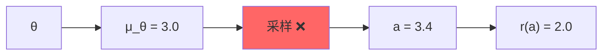
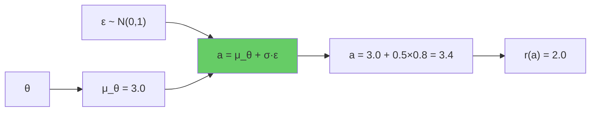
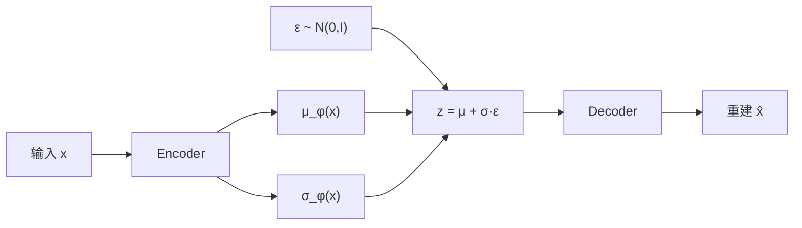
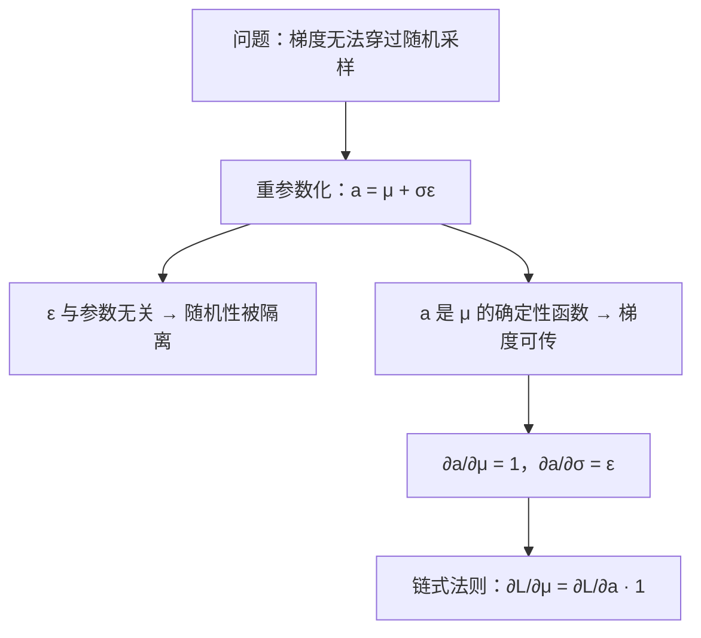

# 前置知识：重参数化技巧（Reparameterization Trick）

> **为什么要读这篇**：高斯策略需要从 $\mathcal{N}(\mu_\theta, \sigma^2)$ 中**采样**动作。但"采样"是一个随机操作——梯度怎么穿过一个随机数？重参数化技巧把"从参数化分布采样"改写为"确定性函数 + 外部噪声"，让梯度可以顺利回传到网络参数。VAE 的 encoder、SAC 的策略、扩散模型的去噪——全部依赖这个技巧。

**标签**: `#前置知识` `#重参数化` `#VAE` `#策略梯度` `#高斯分布` `#梯度回传`

**知识链接**：
- [概率密度函数与高斯分布](/前置知识/002b_前置知识_概率密度函数与高斯分布) — 重参数化针对的就是高斯采样
- [连续动作与离散动作的梯度回传](/前置知识/001r_前置知识_连续动作与离散动作的梯度回传) — 本文是对该文"pathwise gradient"部分的深入展开
- [SAC (Soft Actor-Critic)](/前置知识/000k_前置知识_SAC_Soft_Actor_Critic) — SAC 用重参数化梯度更新策略
- [对数似然与变分下界](/前置知识/000e_前置知识_对数似然与变分下界) — VAE 的 ELBO 优化需要重参数化

---

## 贯穿全文的例子

> **场景**：一个 1-DOF 机器人（只能左右移动）。策略网络输出 $\mu_\theta = 3.0$（推荐位置）和 $\sigma = 0.5$（探索幅度）。
> 我们要从 $\mathcal{N}(3.0, 0.25)$ 中采样一个动作 $a$，然后根据奖励更新 $\theta$。
> 问题是：**采样这一步，梯度怎么传回 $\theta$？**

---

## 第一部分：问题——采样阻断梯度

### 1.1 计算图视角

PyTorch 的自动微分沿着计算图回传梯度。考虑这个流程：

```
θ → 网络 → μ_θ = 3.0 → ???采样??? → a = 3.4 → 奖励 r(a) = 2.0
```

如果采样操作是"从 $\mathcal{N}(\mu_\theta, \sigma^2)$ 中随机取一个数"，那 $a$ 和 $\mu_\theta$ 之间的关系是**概率性的**，不是确定性的函数。PyTorch 不知道 $\frac{\partial a}{\partial \mu_\theta}$ 是什么——因为 $a$ 是随机的，不是 $\mu_\theta$ 的确定性函数。



梯度在"采样"这一步**断了**。

### 1.2 为什么不用 score function 方法？

score function（REINFORCE）方法可以绕开这个问题——它不需要梯度穿过采样，而是用 $\nabla_\theta \log p_\theta(a) \cdot R$ 来估计梯度。但 score function 的**方差很大**（因为只用了"这个动作好不好"的信号，没利用"好多少"的梯度信息），需要大量样本。

重参数化技巧提供了一种**低方差**的替代方案。

---

## 第二部分：解决方案——重参数化

### 2.1 核心思想

把"从参数化分布采样"重写为"确定性变换 + 外部噪声"：

$$
a = \mu_\theta + \sigma \cdot \epsilon, \quad \epsilon \sim \mathcal{N}(0, 1)
$$

**关键变化**：随机性从"分布的参数"转移到了"外部噪声 $\epsilon$"上。$\epsilon$ 和 $\theta$ 无关——它在采样之前就固定了。

> **一句话**：不是"从一个随机的分布中采"，而是"先采一个固定的随机数 $\epsilon$，再用确定性公式算出 $a$"。

### 2.2 计算图变了



现在 $a$ 是 $\mu_\theta$ 的**确定性函数**（给定 $\epsilon$ 之后），梯度可以顺利回传：

$$
\frac{\partial a}{\partial \mu_\theta} = 1
$$

$$
\frac{\partial a}{\partial \sigma} = \epsilon
$$

没有断点了！

### 2.3 数值例子

设 $\mu_\theta = 3.0$，$\sigma = 0.5$。采到 $\epsilon = 0.8$。

**不用重参数化**：$a \sim \mathcal{N}(3.0, 0.25)$，采到 $a = 3.4$。$\frac{\partial a}{\partial \mu_\theta} = ???$（无定义）

**用重参数化**：$a = 3.0 + 0.5 \times 0.8 = 3.4$。$\frac{\partial a}{\partial \mu_\theta} = 1$。

假设损失 $L = (a - 4.0)^2 = (3.4 - 4.0)^2 = 0.36$。

梯度：
$$
\frac{\partial L}{\partial \mu_\theta} = \frac{\partial L}{\partial a} \cdot \frac{\partial a}{\partial \mu_\theta} = 2(a - 4.0) \cdot 1 = 2(3.4 - 4.0) = -1.2
$$

含义：应该把 $\mu_\theta$ 往 4.0 方向增大（梯度为负 → 更新后 $\mu$ 变大）。

### 2.4 为什么重参数化方差更低？

对比两种梯度估计方法：

| 方法 | 梯度公式 | 方差 | 直觉 |
|------|---------|------|------|
| Score Function (REINFORCE) | $\nabla_\theta \log p_\theta(a) \cdot R$ | 高 | 只知道"这个动作好/坏"，不知道"好多少、往哪调" |
| 重参数化 (Pathwise) | $\nabla_a R(a) \cdot \nabla_\theta a$ | 低 | 直接知道"奖励关于动作的梯度"，指明精确方向 |

重参数化利用了 $\nabla_a R(a)$——"奖励对动作的导数"。这是一个**精确的方向信号**，而 REINFORCE 只有一个标量信号 $R$。

---

## 第三部分：一般形式与适用条件

### 3.1 一般公式

对于任何"位置-尺度族"（location-scale family）分布 $p(x|\mu, \sigma) = \frac{1}{\sigma}f\left(\frac{x-\mu}{\sigma}\right)$，都可以重参数化：

$$
x = \mu + \sigma \cdot \epsilon, \quad \epsilon \sim f(\cdot)
$$

常见例子：

| 分布 | 重参数化 | $\epsilon$ 的分布 |
|------|---------|----------------|
| $\mathcal{N}(\mu, \sigma^2)$ | $x = \mu + \sigma\epsilon$ | $\epsilon \sim \mathcal{N}(0, 1)$ |
| $\text{Uniform}(a, b)$ | $x = a + (b-a)\epsilon$ | $\epsilon \sim \text{Uniform}(0, 1)$ |
| $\text{Laplace}(\mu, b)$ | $x = \mu + b\epsilon$ | $\epsilon \sim \text{Laplace}(0, 1)$ |

### 3.2 多维情况

多维高斯 $\mathcal{N}(\boldsymbol{\mu}, \text{diag}(\boldsymbol{\sigma})^2)$（对角协方差）：

$$
\mathbf{a} = \boldsymbol{\mu}_\theta + \boldsymbol{\sigma} \odot \boldsymbol{\epsilon}, \quad \boldsymbol{\epsilon} \sim \mathcal{N}(\mathbf{0}, I)
$$

其中 $\odot$ 是逐元素乘法。7-DOF 机械臂就是：

$$
a_i = \mu_{\theta,i}(s) + \sigma_i \cdot \epsilon_i, \quad \epsilon_i \sim \mathcal{N}(0, 1), \quad i = 1, \ldots, 7
$$

### 3.3 不能重参数化的情况

**离散分布无法直接重参数化**。因为离散采样是"跳变"的——没有连续的函数能把 $\epsilon$ 映射到离散值同时保持梯度。

解决方案：Gumbel-Softmax（一种近似的重参数化方法），详见 [连续动作与离散动作的梯度回传](/前置知识/001r_前置知识_连续动作与离散动作的梯度回传)。

---

## 第四部分：在 VAE 中的应用

VAE 是重参数化技巧的经典发源地。问题结构：

1. Encoder 输出隐变量的**分布参数** $\mu_\phi(x), \sigma_\phi(x)$
2. 需要从这个分布中**采样** $z$
3. Decoder 用 $z$ 重建 $x$
4. 整个流程需要端到端求梯度



没有重参数化，梯度在 $z$ 处断裂，无法训练 encoder。有了重参数化，梯度从重建 loss 一路流回 encoder 参数 $\phi$。

---

## 第五部分：在 SAC 策略中的应用

**为什么需要这个公式**：SAC 要训练一个策略网络，既要让它选出的动作有高 Q 值（能拿到高回报），又要保持一定的随机性（熵正则，鼓励探索）。这两个目标合在一起就是下面的目标函数——但这个目标里有一个"对 $a$ 求期望"，而 $a$ 本身是从策略里采样出来的，所以要用重参数化才能让梯度穿过采样，反向传到策略网络的参数 $\theta$ 上。

SAC 的策略目标是最大化：

$$
J(\theta) = \mathbb{E}_{s \sim \mathcal{D}}\left[\mathbb{E}_{a \sim \pi_\theta(\cdot|s)}\left[Q(s, a) - \alpha \log \pi_\theta(a|s)\right]\right]
$$

> **一句话直觉**：让策略选出的动作尽量拿到高 Q 值，同时不要太"确定"（保留探索的随机性），两者的平衡由 $\alpha$ 控制。

**逐项拆解**：

| 符号 | 含义 | 直觉 |
|------|------|------|
| $s \sim \mathcal{D}$ | 状态从 replay buffer 中采样 | 用历史经验里出现过的状态来评估策略 |
| $a \sim \pi_\theta(\cdot\|s)$ | 动作从当前策略采样 | 策略在这个状态下"会怎么选" |
| $Q(s,a)$ | critic 网络对这个状态-动作对的打分 | 这个动作有多好（长期回报估计） |
| $\log \pi_\theta(a\|s)$ | 策略选择这个动作的对数概率 | 概率越集中（越"确定"），这个值越大（越不负） |
| $-\alpha \log \pi_\theta(a\|s)$ | 熵正则项 | 惩罚"过于确定"的策略，鼓励保留随机性去探索 |
| $\alpha$ | 温度系数 | 控制"要 Q 值高"和"要探索"之间的权重，越大越鼓励探索 |

内层期望"对 $a$ 求期望，$a$ 从策略 $\pi_\theta$ 中采样"。如果用 REINFORCE，方差大。用重参数化：

$$
a = \tanh(\mu_\theta(s) + \sigma_\theta(s) \cdot \epsilon), \quad \epsilon \sim \mathcal{N}(0, I)
$$

这里 $\tanh$ 是额外套上去的一层，把无界的高斯采样压缩到 $(-1, 1)$ 区间（对应归一化后的动作空间）。

这样 $Q(s, a)$ 对 $\theta$ 的梯度可以通过 $a$ 直接回传：

$$
\nabla_\theta J \approx \nabla_\theta Q(s, a)\Big|_{a = \mu_\theta + \sigma_\theta \cdot \epsilon} = \nabla_a Q \cdot \nabla_\theta a
$$

**逐项拆解**：

| 符号 | 含义 | 直觉 |
|------|------|------|
| $\nabla_a Q$ | Q 函数关于动作 $a$ 的梯度（一个和动作同维度的向量） | "如果动作往这个方向变化一点，Q 值会怎么变" |
| $\nabla_\theta a$ | 动作 $a$ 关于策略参数 $\theta$ 的梯度 | 由重参数化公式 $a=\mu_\theta+\sigma_\theta\epsilon$ 直接算出，$\epsilon$ 视为常数 |
| 两者相乘（链式法则） | 把"Q 关于动作的梯度"接到"动作关于参数的梯度"上 | 最终得到"参数应该往哪个方向调才能让 Q 变大" |

**数值代入**：设 $\mu_\theta(s) = 0.5$，$\sigma_\theta(s) = 0.2$（省略 $\tanh$ 简化为线性情形，方便手算），采到 $\epsilon = 1.0$，于是 $a = 0.5 + 0.2 \times 1.0 = 0.7$。假设 critic 在这一点的梯度 $\nabla_a Q = 3.0$（即"动作稍微增大一点，Q 值会明显变好"）。

- $\dfrac{\partial a}{\partial \mu_\theta} = 1$，所以 $\dfrac{\partial J}{\partial \mu_\theta} \approx \nabla_a Q \times 1 = 3.0 \times 1 = 3.0$
- $\dfrac{\partial a}{\partial \sigma_\theta} = \epsilon = 1.0$，所以 $\dfrac{\partial J}{\partial \sigma_\theta} \approx \nabla_a Q \times \epsilon = 3.0 \times 1.0 = 3.0$

**梯度方向的含义**：两个梯度都是正的（我们在做梯度**上升**，因为目标是最大化 $J$），意味着 $\mu_\theta$ 应该调大（让均值往 Q 值更高的方向偏），$\sigma_\theta$ 也应该调大（因为这次刚好噪声方向 $\epsilon=1.0$ 是正的、且带来了更高的 Q，网络"记住"了往这个方向扩大探索幅度有好处；如果换一次采样 $\epsilon$ 是负的，同样的逻辑会让 $\sigma_\theta$ 的梯度符号反过来——多次采样平均后，$\sigma_\theta$ 真正学到的是"整体上要探索多宽"，而不是被单次噪声方向带偏）。

这里 $\nabla_a Q$ 是"Q 函数关于动作的梯度"——它告诉策略"动作应该往哪个方向调才能让 Q 变大"。这是比 REINFORCE 精确得多的信号：REINFORCE 只知道"这个动作最终好不好"（一个标量），而重参数化梯度知道"往哪个方向调能让它更好"（一个方向）。

---

## 第六部分：PyTorch 代码

下面对比两种写法，展示重参数化的实际效果。核心区别就是 `dist.sample()` vs `dist.rsample()`。

```python
import torch
from torch.distributions import Normal

mu = torch.tensor([3.0], requires_grad=True)   # 可学习的均值
sigma = torch.tensor([0.5])                      # 固定标准差
dist = Normal(mu, sigma)

# ===== 方法 1：不可微的采样（梯度断裂）=====
a_no_grad = dist.sample()              # 采样，但不跟踪梯度
loss_1 = (a_no_grad - 4.0) ** 2
# loss_1.backward()  # ❌ 报错：mu 的梯度为 None

# ===== 方法 2：重参数化采样（梯度可传）=====
a_reparam = dist.rsample()             # 等价于 mu + sigma * N(0,1)
loss_2 = (a_reparam - 4.0) ** 2
loss_2.backward()                      # ✅ 正常回传
print(f"μ 的梯度: {mu.grad}")          # 输出一个具体的数值
```

**`rsample()` 的内部实现**（伪代码）：
```python
def rsample(self):
    eps = torch.randn_like(self.loc)   # 采样 ε ~ N(0,1)，与 μ 无关
    return self.loc + self.scale * eps  # 确定性函数：a = μ + σε
```

关键：`eps` 是 `torch.randn`（不跟踪对 $\mu$ 的梯度），但 `self.loc`（即 $\mu$）参与了加法运算，所以梯度能流回去。

---

## 总结

| 概念 | 要点 |
|------|------|
| 核心问题 | "从参数化分布采样"不是确定性操作，梯度无法回传 |
| 解决方案 | 把 $a \sim \mathcal{N}(\mu, \sigma^2)$ 改写为 $a = \mu + \sigma\epsilon$，$\epsilon \sim \mathcal{N}(0,1)$ |
| 本质 | 把随机性从"依赖参数的分布"转移到"不依赖参数的噪声"上 |
| 适用范围 | 连续分布的位置-尺度族（高斯、Laplace 等），离散分布不行 |
| 优势 | 梯度方差比 REINFORCE 低得多（利用了 $\nabla_a f$ 信息） |
| PyTorch 接口 | `dist.rsample()` = 重参数化采样，`dist.sample()` = 普通采样（无梯度） |



---

## 延伸阅读

- [概率密度函数与高斯分布](/前置知识/002b_前置知识_概率密度函数与高斯分布) — 重参数化的对象：高斯分布
- [连续动作与离散动作的梯度回传](/前置知识/001r_前置知识_连续动作与离散动作的梯度回传) — 重参数化 vs score function 的完整对比
- [SAC (Soft Actor-Critic)](/前置知识/000k_前置知识_SAC_Soft_Actor_Critic) — 重参数化在 off-policy RL 中的应用
- [对数似然与变分下界](/前置知识/000e_前置知识_对数似然与变分下界) — VAE 训练中重参数化的角色
- [最大似然估计](/前置知识/002f_前置知识_最大似然估计) — 优化概率模型参数的基本框架
