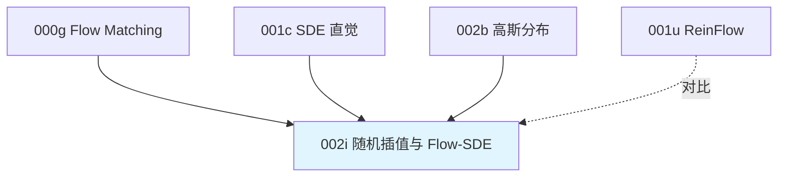

# 前置知识：随机插值与 Flow-SDE——给确定性 ODE 注入可算密度的噪声

> **一句话**：Flow Matching 推理本来是一步步"确定地"从噪声走到动作，没有随机性就没有可以计算的概率密度。Flow-SDE 的做法是：把"确定的一步"改写成"一个均值已知、方差已知的高斯分布"，再从这个高斯里采样。这样每一步转移都变成了可以直接写出公式、算出数值的高斯密度。

**标签**: `#前置知识` `#Flow Matching` `#SDE` `#随机插值` `#Brownian Bridge` `#log-probability`

---

## 相关阅读

读本文前建议先了解：

- [常微分方程 ODE——直觉与数值求解](/前置知识/001b_前置知识_常微分方程ODE直觉与数值求解#42-euler-方法1-阶) — **不知道"Euler 外推/Euler 法"是什么意思的先看这篇**，里面有完整的数值例子
- [Flow Matching 与连续归一化流](/前置知识/000g_前置知识_Flow_Matching与连续归一化流) — 直线插值路径 $x_t=(1-t)x_0+tx_1$ 和速度场 $v_t$ 的来源
- [随机微分方程 SDE 直觉与扩散模型的联系](/前置知识/001c_前置知识_随机微分方程SDE直觉与扩散模型的联系) — 什么是布朗运动、$\mathrm{d}W$、SDE 的一般形式
- [概率密度函数与高斯分布](/前置知识/002b_前置知识_概率密度函数与高斯分布) — 多维高斯密度公式
- [为什么扩散策略难以 RL 微调](/前置知识/000f_前置知识_为什么扩散策略难以RL微调) — 为什么 RL 需要 $\log\pi(a\vert s)$

读完本文可以继续阅读：

- [ReinFlow：Flow 策略的噪声注入 RL 微调](/前置知识/001u_前置知识_ReinFlow_Flow策略的噪声注入RL微调) — 另一种更简单的噪声注入方式（各步独立加固定噪声），可以对比着看两者的区别

---

## 贯穿全文的例子

> **场景**：一个 Flow Matching 策略要生成一个标量动作 $a\in\mathbb{R}$（先看一维，方便手算；后面数值例子会扩展到多维）。它从噪声 $x_0\sim\mathcal{N}(0,1)$ 出发，分 4 步走到动作 $x_1$。假设某一步网络算出当前位置 $x_t=2.0$，当前时刻 $t=0.5$，网络预测的速度 $v_t=3.0$。整篇文章都用这组数字反复代入验证。

---

## 一、先说清楚问题：确定性的一步为什么没有密度

### 1.1 标准 Flow 推理是什么

Flow Matching 训练出一个速度场 $v_\theta(x_t,t)$，推理时用 [Euler 法](/前置知识/001b_前置知识_常微分方程ODE直觉与数值求解#42-euler-方法1-阶)一步步积分——也就是本文反复出现的"Euler 外推"：假设这一小步 $\delta$ 内速度不变，直接用当前速度把点往前推：

$$
x_{t+\delta} = x_t + \delta \cdot v_\theta(x_t, t)
$$

给定 $x_t$，这一步的输出 $x_{t+\delta}$ 是一个**唯一确定的数**——没有"这一步可能是别的值"的空间。

### 1.2 为什么 RL 需要这一步"有概率"

RL 算法(比如 [SAC](/前置知识/000k_前置知识_SAC_Soft_Actor_Critic))的目标函数里经常出现 $\log\pi(a\vert s)$,用来算熵、算 importance ratio。$\log\pi$ 的前提是"$\pi$ 是一个概率分布"——一个点必须能问"你出现的概率密度是多少",而确定性映射答不出这个问题（把所有概率都压缩在一个点上，密度在别处恒为 0，在该点是无穷大的 delta 函数，没法用来做梯度）。

**解决思路只有一个方向**：把这个确定的更新式，改造成一个**随机变量**,并且这个随机变量的分布必须是我们能写出解析公式的（否则密度还是算不出来）。能写出解析公式的分布里最简单的就是高斯分布——只需要一个均值和一个方差。

于是问题变成两个具体的子问题：

1. **均值设成什么**：这个随机版本的"平均去哪"应该尽量贴近原来确定性 ODE 的方向，否则策略行为会跑偏。
2. **方差设成什么**：方差决定了这个高斯"胖不胖"，需要一套有理论依据的选择方式，不能瞎设一个数。

下面两节各自解决一个子问题。

---

## 二、子问题一：均值

### 2.1 最简单的答案：均值就是 Euler 外推

我们需要给这一步的转移分布一个均值 $\mu_t$——也就是"平均而言,这一步应该走到哪"。最直接的答案，就是本文开头 §1.1 提到的 [Euler 外推](/前置知识/001b_前置知识_常微分方程ODE直觉与数值求解#42-euler-方法1-阶)：用当前速度，直接走一步。

$$
\mu_t = x_t + \delta \cdot v_t
$$

这一个式子就把均值完全定义好了，不需要更多东西。（这也是 [ReinFlow](/前置知识/001u_前置知识_ReinFlow_Flow策略的噪声注入RL微调) 实际采用的均值——它直接用这个式子当均值，然后独立叠加一个噪声，比 Flow-SDE 更简单。）

**数值代入**：延续开头的例子，$x_t=2.0,\ v_t=3.0,\ \delta=0.25$：

$$
\mu_t = 2.0+0.25\times3.0=2.75
$$

均值到这里已经确定为 $2.75$。如果你只关心"均值是什么"，可以直接跳到第三节看方差怎么定。下面这一节要做的事情，**不是重新定义均值，只是把这同一个数字换一种写法**——这是为了给第四节的一处修正预留位置。

### 2.2 换一种写法：用两个端点表示同一个均值

**这一节的目标**：把 2.1 算出来的同一个 $\mu_t=2.75$，改写成"两个端点的加权平均"的形式。改写完之后数值不会变，只是公式的表达方式变了。

**为什么要多此一举换写法**：第四节要往均值上加一项和噪声大小有关的修正,而这项修正只有写成"两端点加权"才有地方插进去（具体插在哪、为什么插，第四节再讲，这里不需要提前理解）。现在只需要跟着走一遍这个等价改写。

**第一步：从当前速度反解出两个端点**

回忆 [Flow Matching](/前置知识/000g_前置知识_Flow_Matching与连续归一化流#3.1-条件-flow-conditional-flow) 训练时假定的路径是直线：

$$
x_t = (1-t)x_0 + t\,x_1, \qquad v_t = x_1-x_0
$$

这是两个关于未知数 $x_0,x_1$ 的线性方程（$x_t,v_t,t$ 都是已知的当前值）。解这个二元一次方程组：

**Step 1：这一步在做什么**

**从"当前位置 + 当前速度 + 当前时间"这三个已知量，反解出"如果这条速度真的对应一条直线，那条直线的两个端点在哪"。**

把 $x_1=v_t+x_0$ 代入第一个方程消去 $x_1$：

$$
x_t = (1-t)x_0 + t(v_t+x_0) = x_0 + t\,v_t \quad\Longrightarrow\quad \hat{x}_0 = x_t - t\,v_t
$$

再把 $\hat x_0$ 代回 $x_1=v_t+x_0$：

$$
\hat{x}_1 = \hat{x}_0 + v_t = x_t - t v_t + v_t = x_t + (1-t)v_t
$$

写成公式就是：

$$
\hat{x}_0 = x_t - v_t\cdot t, \qquad \hat{x}_1 = x_t + v_t\cdot(1-t)
$$

**逐符号拆解**：

| 符号 | 数学含义 | 直觉 | 典型维度 |
|---|---|---|---|
| $x_t$ | 当前去噪状态 | "我现在在哪" | 与动作同形状 |
| $v_t$ | 网络当前输出的速度 | "网络觉得该往哪走、走多快" | 与 $x_t$ 同形状 |
| $t$ | 当前 flow 时间，$\in[0,1]$ | "走到直线的百分之几了" | 标量 |
| $\hat x_0$ | 对起点(纯噪声)的预测 | "如果沿这条速度倒退到 $t=0$，会在哪" | 与 $x_t$ 同形状 |
| $\hat x_1$ | 对终点(干净动作)的预测 | "如果沿这条速度前进到 $t=1$，会在哪" | 与 $x_t$ 同形状 |

**数值代入**：用开头的例子，$x_t=2.0$，$v_t=3.0$，$t=0.5$：

$$
\hat x_0 = 2.0 - 3.0\times0.5 = 0.5, \qquad \hat x_1 = 2.0+3.0\times(1-0.5) = 3.5
$$

**验证**：把 $\hat x_0=0.5,\hat x_1=3.5$ 代回直线公式检查自洽性——$(1-0.5)\times0.5+0.5\times3.5=0.25+1.75=2.0=x_t$ ✓，$3.5-0.5=3.0=v_t$ ✓。两个方程都满足，说明反解是对的。

有了这两个端点，均值就可以写成它们的加权平均：

$$
\mu_t = w_1\,\hat x_1 + w_0\,\hat x_0, \qquad w_1 = t+\delta,\ \ w_0 = 1-(t+\delta)
$$

**这个公式在做什么**：用终点预测 $\hat x_1$ 和起点预测 $\hat x_0$ 按比例混合，得到同一个均值 $\mu_t$。

**逐符号拆解**：

| 符号 | 含义 | 直觉 |
|---|---|---|
| $\delta$ | 单步时间步长（如 $0.25$） | "这一步要走多远" |
| $t+\delta$ | 走完这一步之后的新时刻 | "走完这一步，进度到了百分之几" |
| $w_1=t+\delta$ | 终点预测 $\hat x_1$ 的权重 | 进度越大，越该信任"终点预测" |
| $w_0=1-w_1$ | 起点预测 $\hat x_0$ 的权重 | $w_0,w_1$ 加起来正好是 1，是标准的加权平均 |

**数值代入**：$t=0.5,\delta=0.25$，上一步算出 $\hat x_0=0.5,\hat x_1=3.5$：

$$
w_1=0.75,\quad w_0=0.25
$$
$$
\mu_t = 0.75\times3.5+0.25\times0.5 = 2.625+0.125=2.75
$$

和 2.1 节直接用 Euler 外推算出的 $\mu_t=2.75$ 一模一样。这不是巧合，是代数上的恒等式——把 $\hat x_0=x_t-tv_t,\ \hat x_1=x_t+(1-t)v_t$ 代入上面的加权公式展开化简，结果就是 $x_t+\delta v_t$，也就是 Euler 外推本身（可以自己代数验证）。

**所以均值这件事到这里已经讲完**：它就是 Euler 外推算出来的那个数，"两端点加权"只是同一个数的另一种写法。这种写法唯一的用处会在第四节出现——那里要往均值上加一个跟噪声大小相关的修正项，需要借助这个写法才好表达。那是第四节单独要讲的内容，跟"均值本身是什么"是两件事，这里不需要提前理解。

---

## 三、子问题二：方差——布朗桥（Brownian Bridge）的标准差公式

### 3.1 为什么方差不能随便设一个常数

如果每一步都用同一个固定方差（比如 [ReinFlow](/前置知识/001u_前置知识_ReinFlow_Flow策略的噪声注入RL微调) 那样让一个小网络 $\sigma_\phi$ 自己学），是可行的，但缺一个理论保证：**注入的噪声会不会让最终生成的动作分布，偏离预训练模型本来该生成的分布？**

Flow-SDE 想要更强的性质：**加了噪声之后，如果把所有中间噪声"边缘化"（积分掉），最终生成动作的分布应该和原来确定性 ODE 生成的分布尽量保持一致**。这需要方差的选取遵循一个具体的数学结构——布朗桥。

### 3.2 什么是布朗桥：从最简单的情形讲起

先不管 Flow，纯粹讲一个概率论问题：**已知一个粒子从位置 $a$（时刻 0）出发，最终一定会到达位置 $b$（时刻 1），中间做纯随机游走（布朗运动），那么在中间某个时刻 $t\in(0,1)$，这个粒子的位置服从什么分布？**

这个约束了"起点和终点都固定"的布朗运动，就叫**布朗桥**。直觉上：

- 越靠近起点或终点，位置越确定（因为知道它必须从 $a$ 出发/必须到达 $b$）
- 越靠近中点 $t=0.5$，位置越不确定（自由度最大，离两个"锚点"都远）

结论（标准布朗桥公式，推导略，是随机过程里的经典结果）：

$$
x_t \mid x_0=a, x_1=b \;\sim\; \mathcal{N}\big((1-t)a+tb,\ \ t(1-t)\,\sigma^2\big)
$$

**逐符号拆解**：

| 符号 | 含义 | 直觉 |
|---|---|---|
| $(1-t)a+tb$ | 均值 | 和确定性直线插值一样，"平均而言"粒子应该在这条线上 |
| $t(1-t)$ | 方差的时间形状因子 | $t=0$ 或 $t=1$ 时为 0（锚点处完全确定），$t=0.5$ 时最大（$=0.25$） |
| $\sigma^2$ | 布朗运动本身的强度 | 整体噪声大小的旋钮 |

**数值验证方差形状**：$t(1-t)$ 在 $t=0,0.25,0.5,0.75,1$ 处的值分别是 $0, 0.1875, 0.25, 0.1875, 0$——两头低中间高的抛物线，符合"两端确定、中间自由"的直觉。

**这和 Flow-SDE 有什么关系**：Flow-SDE 的转移方差公式，本质上就是"给定当前预测的两个端点 $\hat x_0,\hat x_1$，未来一小段路径应该表现为一段局部的布朗桥",只是要考虑我们是**从当前时刻 $t$ 走一小步到 $t+\delta$**，而不是走完整条 $[0,1]$，所以公式要做"局部化"改写——下一节推。

### 3.3 Flow-SDE 实际用的每步标准差公式

$$
\sigma_i = \eta\sqrt{\frac{1-t_i}{t_i}}
$$

**Step 1：这个公式在做什么**

**它给每一个去噪时刻 $t_i$ 分配一个噪声尺度，让噪声随时间单调递减——早期（$t$ 小）噪声大、后期（$t$ 接近 1）噪声小。**

**为什么是 $\sqrt{(1-t)/t}$ 这个形状，不是别的函数**：对比布朗桥的方差形状因子 $t(1-t)$——那是"两端固定、中间自由"的抛物线，在 $t\to 0$ 和 $t\to1$ 都趋于 0。但 Flow-SDE 的场景不同：我们只固定了**起点**是标准高斯（$t=0$ 处方差必须是 1，不能是 0），而**终点动作还没生成、无法固定**。所以需要的是"单侧锚定"版本——只在 $t=0$ 端有约束，$t\to1$ 端应该让噪声自然收窄到 0（因为越接近生成完毕，我们越应该信任网络的确定性预测）。

$\sqrt{(1-t)/t}$ 满足这个要求：

- $t\to0$ 时，$(1-t)/t\to\infty$，噪声尺度**发散**——这对应"起点处允许任意大的不确定性"，因为起点本来就是采样出来的随机噪声，谈不上"该在哪"
- $t\to1$ 时，$(1-t)/t\to0$，噪声尺度**趋于 0**——对应"越接近终点，网络的确定性预测越应该被信任，不该再乱抖"

这正是原始 Rectified Flow / Stochastic Interpolants 理论里"扩散系数与 $1/\sqrt{t(1-t)}$ 或其变体成正比"这类构造的思路：让噪声强度和"距离终点还有多远"挂钩，而不是设成一个和时间无关的常数。

**逐符号拆解**：

| 符号 | 含义 | 具体是什么 |
|---|---|---|
| $t_i$ | 第 $i$ 个去噪时间点 | $\{0, 0.25, 0.5, 0.75\}$（4 步的情形） |
| $\eta$ | 全局噪声强度旋钮 | 配置里的 `noise_level`，人为设定，如 0.5 |
| $(1-t_i)/t_i$ | 时间衰减因子 | $t$ 越大这个比值越小 |
| $\sigma_i$ | 第 $i$ 步"这一瞬间"的噪声尺度 | 用来算下面 $\sigma_{\text{step}}$ 的中间量，本身不是最终标准差 |

**数值代入**（延续第 03 章的例子，$\eta=0.5$）：

| $t_i$ | $(1-t_i)/t_i$ | $\sqrt{\cdot}$ | $\sigma_i=\eta\times\sqrt{\cdot}$ |
|---:|---:|---:|---:|
| 0 | 用 $t_1=0.25$ 代替避免除零 → $0.75/0.25=3$ | 1.732 | 0.866（注：实际实现里 $t_0$ 分母替换规则见第四节） |
| 0.25 | $0.75/0.25=3$ | 1.732 | 0.866 |
| 0.50 | $0.5/0.5=1$ | 1.000 | 0.500 |
| 0.75 | $0.25/0.75=0.333$ | 0.577 | 0.289 |

（这里为了单独讲清 $\sigma_i$ 本身的趋势，先不代入 $t_0=0$ 的特殊规则，第四节结合完整实现时会给出与第 03 章一致的数值表。）

可以看到 $\sigma_i$ 随 $t_i$ 单调递减，验证了"早期噪声大、后期噪声小"的设计意图。

### 3.4 从 $\sigma_i$ 到这一步实际用的标准差 $\sigma_{\text{step}}$

$\sigma_i$ 是"瞬时"噪声尺度（类比 SDE 里的扩散系数 $g(t)$），但我们是离散地走一步 $\delta$，需要把它转换成"这一步累积的标准差"：

$$
\sigma_{\text{step},i} = \sqrt{\delta}\cdot\sigma_i
$$

**为什么多一个 $\sqrt{\delta}$**：这是 [SDE 前置知识](/前置知识/001c_前置知识_随机微分方程SDE直觉与扩散模型的联系#3.2-离散化版本-euler-maruyama-方法) 里讲过的核心结论——布朗运动的增量方差和时间成正比，即 $\Delta W\sim\mathcal{N}(0,\Delta t)$，标准差是 $\sqrt{\Delta t}$ 而不是 $\Delta t$。这里 $\delta$ 就是离散化的 $\Delta t$，所以瞬时噪声尺度 $\sigma_i$ 要乘上 $\sqrt{\delta}$ 才是"这一步累积的标准差"。

**数值代入**：$\delta=0.25$，$\sqrt{\delta}=0.5$：

| $i$ | $\sigma_i$ | $\sigma_{\text{step},i}=0.5\times\sigma_i$ |
|---:|---:|---:|
| 0 | 1.000（用 $t_1$ 代替后的值，见第四节） | 0.500 |
| 1 | 0.866 | 0.433 |
| 2 | 0.500 | 0.250 |
| 3 | 0.289 | 0.144 |

这就是第 03 章表格里出现的四个数字 $0.500, 0.433, 0.250, 0.144$。

---

## 四、把均值和方差拼起来：完整的转移分布

### 4.1 训练模式下均值还要多一项修正

第二节给出的 $\mu_t=w_1\hat x_1+w_0\hat x_0$（$w_0=1-w_1$）只是"不加噪声时"的等价写法。一旦真的往这一步注入了方差 $\sigma_{\text{step}}^2$ 的噪声，会带来一个副作用：**多步随机游走的累积效果，会让粒子群比原来的确定性路径更分散**（这正是布朗运动的性质——噪声让分布变宽）。

为了让"加了噪声之后、最终边缘分布仍尽量贴近原来的确定性路径"，训练模式下的 $w_0$ 需要减去一个修正项：

$$
w_0^{\text{train}} = 1-(t+\delta) - \frac{\sigma_i^2\,\delta}{2(1-t)}
$$

**Step 1：这一项在做什么**

**它把均值往起点方向轻微拉回一点，补偿因为注入随机噪声而导致的"整体分布偏移"。**

**逐符号拆解**：

| 符号 | 含义 | 直觉 |
|---|---|---|
| $1-(t+\delta)$ | 不加噪声时的起点权重（第二节结果） | 主体部分 |
| $\sigma_i^2\delta$ | 这一步注入噪声的方差 | 噪声越大，需要修正的量越大 |
| $2(1-t)$ | 分母，随 $t\to1$ 增大而缩小 | 越接近终点，同样大小的噪声对分布形状的相对影响越大，需要更强修正 |
| 减号 | 修正方向 | 把均值往起点方向拉，抵消噪声带来的"往外扩散"效应 |

这个修正项的严格推导来自 Stochastic Interpolants / Flow-SDE 相关理论中"保持边缘分布不变的扩散系数配对条件"，属于比较技术性的随机过程结论，本文不做完整证明,只需要理解它的定性作用：**噪声越大，均值就要往回拉得越多**，这是一种自洽性的补偿机制。

**数值代入**：$t=0.5,\delta=0.25$，$\sigma_i=\sigma_2=0.5$（对应表格中 $i=2$ 那一步，注意这里 $\sigma_i$ 是"瞬时"值，不是 $\sigma_{\text{step}}$）：

$$
w_0^{\text{train}} = 1-0.75 - \frac{0.5^2\times0.25}{2\times0.5} = 0.25 - \frac{0.0625}{1.0} = 0.25-0.0625=0.1875
$$

对比不加修正的 $w_0=0.25$——训练模式下起点权重被压低了 $0.0625$，相应地终点权重 $w_1=t+\delta=0.75$ 不变，但因为 $w_0+w_1^{\text{train}}\ne1$ 了（$0.75+0.1875=0.9375\ne1$），说明训练模式下这个"凸组合"不再是严格的凸组合——这是故意的，缺的这部分"权重"就是被噪声项隐式吸收的部分。

### 4.2 评测模式的简化

评测时不需要这层修正，因为评测不注入噪声（$\sigma_{\text{step}}=0$），直接用最朴素的 $w_0=1-(t+\delta)$，此时转移就退化成确定性的 Euler 更新——这也是为什么"评测模式的动作输出是完全确定的"（详见第 03 章 §2 末尾的结论）。

### 4.3 完整转移分布公式

$$
x_{t+\delta} \sim \mathcal{N}\big(\mu_t,\ \sigma_{\text{step}}^2 I\big), \qquad \mu_t = w_1\hat x_1+w_0\hat x_0
$$

| 模式 | $w_1$ | $w_0$ | $\sigma_{\text{step}}$ |
|---|---|---|---|
| 训练 | $t+\delta$ | $1-(t+\delta)-\dfrac{\sigma_i^2\delta}{2(1-t)}$ | $\sqrt{\delta}\,\sigma_i$ |
| 评测 | $t+\delta$ | $1-(t+\delta)$ | $0$ |

**这就是第 03 章 §2 里出现的那个公式**——现在每一个符号、每一项的来源都有了完整的推导链：均值来自"两端点加权"（第二节），标准差来自"布朗桥式的时间衰减 + 离散化的 $\sqrt\delta$ 缩放"（第三节），训练模式的修正项是为了补偿噪声导致的分布偏移（第四节）。

### 4.4 为什么最终能算出 $\log\pi$

有了这个显式的高斯转移分布，$\log\pi$ 就不再需要 [Jacobian 行列式](/前置知识/000f_前置知识_为什么扩散策略难以RL微调)——因为整条路径的密度就是初始噪声密度乘上每一步转移密度的乘积（马尔可夫链的性质），取对数就是求和：

$$
\log\pi_{\text{path}} = \log\mathcal{N}(x_0;0,I) + \sum_{i=0}^{K-1}\log\mathcal{N}\big(x_{t_{i+1}};\mu_{t_i},\sigma_{\text{step},i}^2I\big)
$$

每一项都是高维高斯的 log 密度，有闭式解，不需要任何反向传播去算导数矩阵。这正是第 03 章 §5 用来构造 $\log\pi_{\text{path}}$ 的公式，具体数值计算见那一章。

---

## 五、和 ReinFlow 的对比：两种噪声注入方式

学完本文的构造后，可以清楚看出 Flow-SDE 和 [ReinFlow](/前置知识/001u_前置知识_ReinFlow_Flow策略的噪声注入RL微调) 的本质区别：

| | ReinFlow | Flow-SDE（本文） |
|---|---|---|
| 均值 | 直接用 Euler 外推 $x_t+\delta v_\theta$ | 两端点加权，训练模式下额外做分布修正 |
| 方差 | 一个独立可学习的小网络 $\sigma_\phi(t)$ | 由布朗桥启发的解析公式 $\eta\sqrt{(1-t)/t}$，不需要额外网络 |
| 理论保证 | 无（$\sigma_\phi$ 完全靠训练学出合理值） | 试图让边缘分布贴近原确定性路径（均值修正项的作用） |
| 引入的新参数 | 噪声网络的参数（需要训练） | 只有一个全局标量 $\eta$（超参数，不训练） |
| 灵活性 | 更高（网络可以学出状态依赖的噪声） | 更低（噪声尺度只依赖时间 $t$） |

两者都是"确定性 ODE → 随机 SDE"这同一个大思路下的具体实现，选择哪一种是工程权衡：Flow-SDE 不需要额外训练一个噪声网络、噪声尺度有理论依据；ReinFlow 更灵活但需要额外学习成本。

---

## 六、总结

### 一句话

> Flow-SDE 把 Flow Matching 确定性 ODE 的每一步，改写成一个高斯分布：均值用"反解出的起点/终点预测"加权得到（在数学上等价于 Euler 外推，训练时再叠加一个补偿噪声偏移的修正项），标准差借用布朗桥"两端确定、中间自由"的直觉，设计成随时间单调递减的解析公式。这样整条去噪路径的概率密度就能精确算出来，$\log\pi$ 不再需要高维 Jacobian。

### 核心结论对照表

| 问题 | 解法 | 对应公式 |
|---|---|---|
| 均值设成什么 | 反解直线路径的两个端点，加权平均 | $\hat x_0=x_t-tv_t$，$\hat x_1=x_t+(1-t)v_t$，$\mu_t=w_1\hat x_1+w_0\hat x_0$ |
| 为什么加权等价于 Euler 外推 | 代数上可以证明两者相等 | $\mu_t=x_t+\delta v_t$ |
| 方差设成什么 | 借鉴布朗桥，单侧锚定在 $t=0$ | $\sigma_i=\eta\sqrt{(1-t_i)/t_i}$ |
| 瞬时噪声到单步标准差 | 布朗运动方差与时间成正比 | $\sigma_{\text{step}}=\sqrt\delta\,\sigma_i$ |
| 训练时均值为何要修正 | 补偿噪声导致的分布偏移 | $w_0$ 减去 $\dfrac{\sigma_i^2\delta}{2(1-t)}$ |
| 为什么最终能算 $\log\pi$ | 高斯转移的密度有闭式解 | 路径密度 = 初始密度 × 各步转移密度 |

### 知识链

---

## 延伸阅读

- Albergo & Vanden-Eijnden (2023) "Stochastic Interpolants: A Unifying Framework for Flows and Diffusions" ← Flow-SDE 类构造的理论来源
- [Flow Matching 与连续归一化流](/前置知识/000g_前置知识_Flow_Matching与连续归一化流) ← 直线插值路径的完整推导
- [随机微分方程 SDE 直觉](/前置知识/001c_前置知识_随机微分方程SDE直觉与扩散模型的联系) ← 布朗运动、Euler-Maruyama 离散化
- [ReinFlow](/前置知识/001u_前置知识_ReinFlow_Flow策略的噪声注入RL微调) ← 另一种更简单的噪声注入方案
