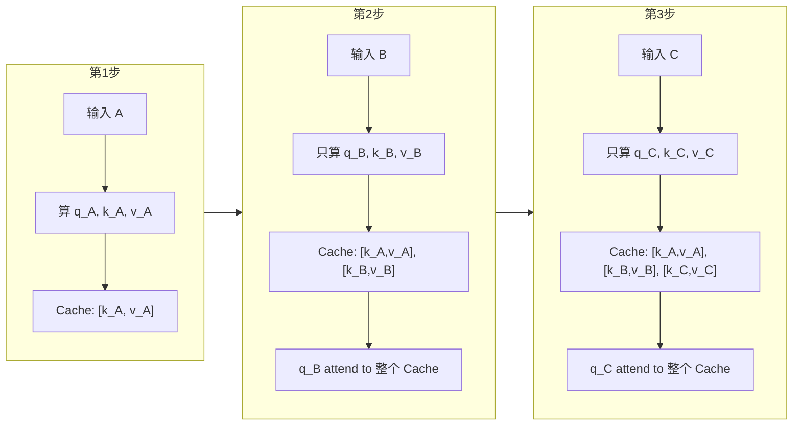
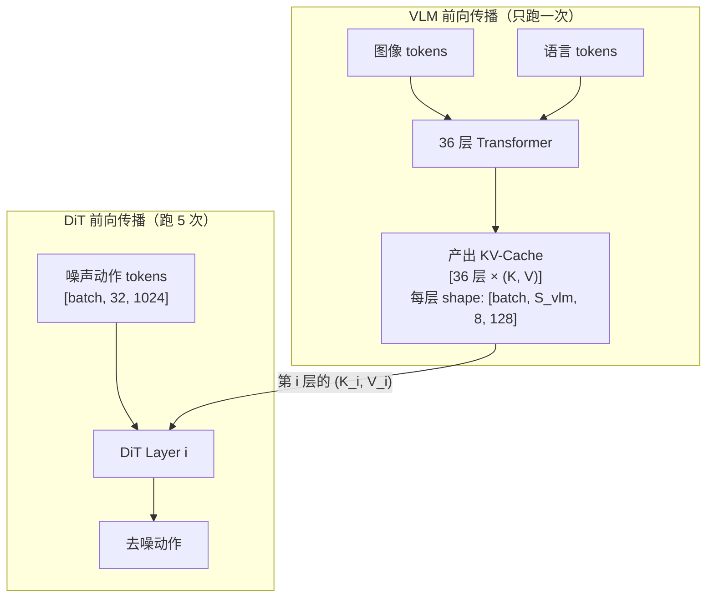

# KV-Cache 与自回归解码

> 自回归模型生成第 100 个 token 时，理论上需要重新对前 99 个 token 做一遍完整的 Attention 计算——但这些计算在生成第 99 个 token 时其实已经做过一次了。KV-Cache 就是把这些"已经算过的中间结果"存下来复用，避免重复计算。本文从 Attention 的基础开始，讲清楚 KV-Cache **到底缓存了什么**、**为什么只缓存 K 和 V 不缓存 Q**、**具体怎么在代码中实现**，以及它在跨模块场景（比如 VLA 模型里 DiT 复用 VLM 的缓存）中的应用。

## 相关阅读

- [Cross-Attention 与交替注意力机制](/前置知识/001e_前置知识_Cross_Attention与交替注意力机制) — 跨模块复用 KV-Cache 的场景本质是一种 Cross-Attention
- [Causal Attention 因果注意力掩码](/前置知识/001g_前置知识_Causal_Attention因果注意力掩码) — 自回归生成的基础机制
- [分组查询注意力 GQA](/前置知识/002l_前置知识_分组查询注意力GQA) — GQA 正是为了压缩 KV-Cache 的显存占用
- [DiT：Diffusion Transformer 架构](/前置知识/002x_前置知识_DiT_Diffusion_Transformer架构) — DiT 动作头复用 VLM KV-Cache 的典型场景

---

## 一、前置概念：先搞清楚 Attention 的 Q、K、V 是什么

要理解 KV-Cache，必须先真正搞清楚 Attention 计算中 Q、K、V 三个角色各自在做什么。如果你已经非常熟悉 Attention 机制，可以跳到第二节。

### 1.1 一个直觉类比

想象你在图书馆找资料：

- **Query（查询）**：你脑子里的问题——"我想了解机器人抓取的方法"
- **Key（键/索引）**：每本书封面上的标题和关键词——"《机器人运动规划》"、"《计算机视觉基础》"
- **Value（值/内容）**：书里面的具体内容

你用自己的"问题"（Query）去和每本书的"标题"（Key）做匹配，找到最相关的几本书，然后把它们的"内容"（Value）按相关度加权组合，得到你需要的答案。

### 1.2 数学表示

$$
\text{Attention}(Q, K, V) = \text{softmax}\left(\frac{QK^T}{\sqrt{d_k}}\right) V
$$

**这个公式在做什么**：每个 Query 向量和所有 Key 向量做点积得到"相关性分数"，归一化后作为权重，对所有 Value 向量做加权求和。

::: details 📐 逐符号拆解 + 数值代入（点击展开）
**逐符号拆解**：

| 符号 | 形状 | 含义 |
|------|------|------|
| $Q$ | $[n, d_k]$ | $n$ 个位置各自的"问题"向量 |
| $K$ | $[m, d_k]$ | $m$ 个位置各自的"标签"向量 |
| $V$ | $[m, d_v]$ | $m$ 个位置各自的"内容"向量 |
| $QK^T$ | $[n, m]$ | 相似度矩阵，$(i,j)$ 表示第 $i$ 个 query 和第 $j$ 个 key 的相关程度 |
| $\sqrt{d_k}$ | 标量 | 缩放因子，防止点积值过大导致 softmax 梯度消失 |
| softmax | $[n, m]$ | 把相似度转为概率权重（每行和为 1） |

**数值代入**（$d_k = 2$，2 个 Query，3 个 Key/Value）：

```
Q = [[1, 0],     K = [[1, 0],     V = [[10, 20],
     [0, 1]]          [0, 1],          [30, 40],
                      [1, 1]]          [50, 60]]
```

Step 1：$QK^T / \sqrt{2}$：
- Query[0]=[1,0] · Key[0]=[1,0] → 1.0，÷√2 → 0.707
- Query[0]=[1,0] · Key[1]=[0,1] → 0.0，÷√2 → 0.0
- Query[0]=[1,0] · Key[2]=[1,1] → 1.0，÷√2 → 0.707

Score 矩阵 = $[[0.707, 0, 0.707], [0, 0.707, 0.707]]$

Step 2：softmax（对每行归一化）：
- 第 0 行：$[e^{0.707}, e^0, e^{0.707}] / \text{sum} = [0.39, 0.19, 0.39]$（约等于）

Step 3：加权求和 Value：
- Output[0] = 0.39×[10,20] + 0.19×[30,40] + 0.39×[50,60] = **[29.4, 39.4]**

**直觉**：Query[0]=[1,0] 和 Key[0]=[1,0]、Key[2]=[1,1] 最相关（点积大），所以 Value[0] 和 Value[2] 获得最大权重。
:::

### 1.3 Q、K、V 从哪里来

在标准 Transformer 的 **Self-Attention** 中，Q、K、V 都是从**同一个输入** $X$ 通过不同的线性投影得到的：

```python
Q = X @ W_Q    # X: [seq_len, d_model], W_Q: [d_model, d_k]
K = X @ W_K    # W_K: [d_model, d_k]
V = X @ W_V    # W_V: [d_model, d_v]
```

**关键理解**：虽然 Q、K、V 来自同一个输入 $X$，但经过**不同的投影矩阵**后，它们代表的信息完全不同：
- $W_Q$ 学会提取"我想查什么"的信息
- $W_K$ 学会提取"我能被什么问题匹配到"的信息  
- $W_V$ 学会提取"如果被匹配到，我提供什么信息"的信息

---

## 二、问题起点：自回归生成里的重复计算

### 2.1 什么是"自回归生成"

自回归 = "自己的输出作为自己下一步的输入"。GPT 类模型生成文本时就是这么工作的——每一步只产生一个新 token，然后把它加入已有序列，再喂回模型生成下一个：

```
第1步：输入 [The]              → 模型输出概率分布 → 采样得到 "cat"
第2步：输入 [The, cat]         → 模型输出概率分布 → 采样得到 "sat"
第3步：输入 [The, cat, sat]    → 模型输出概率分布 → 采样得到 "on"
第4步：输入 [The, cat, sat, on] → ...
```

每一步模型都需要"看到"到目前为止的**所有已生成 token**，因为它需要理解完整的上下文才能做出合理的下一步预测。

### 2.2 朴素做法的巨大浪费

如果不做任何优化，每一步都要对到目前为止的完整序列重新做一遍完整的 Attention 计算。我们具体看第 3 步发生了什么：

```
第3步的输入序列: [The, cat, sat]

对于这 3 个 token，模型需要算出各自的 Q、K、V：
  Q_The = The_embed @ W_Q
  K_The = The_embed @ W_K    ← 这个值和第1步、第2步算的完全一样！
  V_The = The_embed @ W_V    ← 同上！
  
  Q_cat = cat_embed @ W_Q
  K_cat = cat_embed @ W_K    ← 这个值和第2步算的完全一样！
  V_cat = cat_embed @ W_V    ← 同上！
  
  Q_sat = sat_embed @ W_Q    ← 只有这个是第3步新增的
  K_sat = sat_embed @ W_K    ← 新增
  V_sat = sat_embed @ W_V    ← 新增
```

**浪费在哪里**：`K_The`、`V_The`、`K_cat`、`V_cat` 在前面的步骤中已经算过了，第 3 步又重新算了一遍——纯粹的重复计算。

而且这种浪费随着序列变长越来越严重：
- 第 100 步：重新计算前 99 个 token 的 K、V（浪费 99 次）
- 第 1000 步：重新计算前 999 个 token 的 K、V（浪费 999 次）

### 2.3 为什么 K 和 V 不会因为后续 token 而改变

这是理解 KV-Cache 的**核心关键**——在**因果注意力**（Causal Attention）下，每个 token 的 K 和 V **只由它自己的输入决定**，不受后面 token 的影响。

为什么？因为因果注意力的规则是：**每个位置只能看到自己和前面的 token，看不到后面的**。所以：
- `The` 的 Key/Value 只取决于 `The` 这个 token 本身（它看不到后面的 cat、sat）
- `cat` 的 Key/Value 只取决于 `cat` 经过前面层处理后的表示（它看不到后面的 sat）

不管后面又加入了多少新 token，`The` 和 `cat` 的 Key/Value **永远不变**。

> 📌 **一句话总结**：因果掩码保证了历史 token 的 K/V 是"固定的"——算过一次就永远不变，所以可以安全缓存。

### 2.4 为什么不缓存 Query

Query 代表"当前这个位置想查什么"——在自回归生成中，我们关心的永远是**最新的那个 token 想查什么**。历史 token 的 Query 在生成下一个 token 时完全不需要用到（下一个 token 只需要自己的 Query 去查所有人的 K/V）。

直觉：
- K 和 V 是"被查询方"——只要一个 token 存在于序列中，未来所有新 token 都可能需要查询它的 K/V
- Q 是"查询方"——只有当前正在生成的 token 才需要发出查询，历史 token 的查询结果已经产生了，不再需要

---

## 三、KV-Cache 的工作原理

### 3.1 核心思路

KV-Cache 就做一件事：**把每一步新算出来的 K、V 存起来，下一步直接从缓存里取，不重新计算**。

### 3.2 逐步图解

用一个具体例子，$d_k = 2$，生成序列 `[A, B, C, D]`：

**第 1 步（Prefill）：处理 prompt "A"**

```
输入: [A]
计算: q_A, k_A, v_A = A @ W_Q, A @ W_K, A @ W_V
缓存: Cache = [(k_A, v_A)]
Attention: q_A attend to Cache → 输出
生成: 得到 token B
```

**第 2 步（Decode）：生成 "B"**

```
输入: [B]  ← 注意！只输入新 token，不需要重新输入 A
计算: q_B, k_B, v_B = B @ W_Q, B @ W_K, B @ W_V
缓存: Cache = [(k_A, v_A), (k_B, v_B)]  ← 追加 B 的 KV
Attention: q_B attend to 整个 Cache → 输出
生成: 得到 token C
```

**第 3 步（Decode）：生成 "C"**

```
输入: [C]  ← 只输入新 token
计算: q_C, k_C, v_C = C @ W_Q, C @ W_K, C @ W_V
缓存: Cache = [(k_A, v_A), (k_B, v_B), (k_C, v_C)]  ← 追加 C 的 KV
Attention: q_C attend to 整个 Cache → 输出
生成: 得到 token D
```



### 3.3 完整数值走查

假设某一层，$d_k = 2$（每个头的维度为 2），已经生成了 2 个 token（A 和 B），缓存内容是：

$$
\text{Cache} = \{k_A=[1, 0],\ v_A=[10, 20],\ k_B=[0, 1],\ v_B=[30, 40]\}
$$

**这个公式在做什么**：展示 KV-Cache 在生成完 A、B 两个 token 后的状态——缓存里存了每个历史 token 的 Key 和 Value 向量。

::: details 📐 逐符号拆解 + 数值代入（点击展开）
**逐符号拆解**：

| 符号 | 含义 | 具体是什么 |
|------|------|-----------|
| $k_A=[1, 0]$ | token A 经过 $W_K$ 投影后得到的 Key 向量 | 2 维向量，表示 A 在"被查询"时的特征 |
| $v_A=[10, 20]$ | token A 经过 $W_V$ 投影后得到的 Value 向量 | 2 维向量，表示 A 携带的实际信息内容 |
| $k_B=[0, 1]$ | token B 的 Key 向量 | 与 $k_A$ 正交，说明 A 和 B 的"查询特征"方向不同 |
| $v_B=[30, 40]$ | token B 的 Value 向量 | B 携带的信息内容 |

**数值含义**：缓存占用 = 2 个 token × (Key 2维 + Value 2维) = 8 个浮点数。在真实模型中 $d_k=128$、序列长度可达数千，缓存会占用 GB 级显存。

**为什么是这个形式**：KV-Cache 只存 K 和 V，不存 Q，因为历史 token 的 Query 不会再被使用（Query 是"提问方"，只有当前新 token 需要提问）。
:::

之前生成 A 和 B 时，模型计算出来的 Key 和 Value 向量（每个 token 一对）。

现在要生成第 3 个 token C。模型只需要对 C 做一次前向传播，得到 $q_C = [1, 1]$, $k_C = [0.5, 0.5]$, $v_C = [50, 60]$。

**把 $k_C, v_C$ 追加进缓存**：
$$
\text{Cache} = \{[k_A, k_B, k_C],\ [v_A, v_B, v_C]\} = \{[[1,0],[0,1],[0.5,0.5]],\ [[10,20],[30,40],[50,60]]\}
$$

**这个公式在做什么**：把新 token C 的 Key 和 Value 追加到缓存末尾，缓存现在包含了全部 3 个 token 的 KV。

::: details 📐 逐符号拆解 + 数值代入（点击展开）
**逐符号拆解**：

| 符号 | 含义 | 具体是什么 |
|------|------|-----------|
| $[k_A, k_B, k_C]$ | Key 缓存矩阵，形状 $3 \times 2$ | 三行分别是 A、B、C 的 Key 向量 |
| $[v_A, v_B, v_C]$ | Value 缓存矩阵，形状 $3 \times 2$ | 三行分别是 A、B、C 的 Value 向量 |
| $k_C=[0.5, 0.5]$ | 新 token C 的 Key | 本步新计算的，追加到已有缓存后面 |
| $v_C=[50, 60]$ | 新 token C 的 Value | 同上 |

**数值含义**：缓存从 2 行增长到 3 行。操作是 $O(1)$ 的 append，不需要重新计算前两行。

**为什么是这个形式**：缓存按时间顺序拼接（concat），这样后续 Attention 的矩阵乘法可以一次性查询所有历史 token。
:::

**用 $q_C$ 查询整个缓存**：

$$
\text{scores} = q_C \cdot [k_A, k_B, k_C]^T / \sqrt{2}
$$

**这个公式在做什么**：用当前 token C 的 Query 向量对缓存中所有 Key 做点积，除以 $\sqrt{d_k}$ 得到注意力分数。

::: details 📐 逐符号拆解 + 数值代入（点击展开）
**逐符号拆解**：

| 符号 | 含义 | 具体是什么 |
|------|------|-----------|
| $q_C$ | 当前 token C 的 Query 向量 | $[1, 1]$，本步通过 $C \times W_Q$ 计算得到 |
| $[k_A, k_B, k_C]^T$ | Key 缓存矩阵的转置，形状 $2 \times 3$ | 让点积能一次算出 C 对所有历史 token 的相似度 |
| $\sqrt{2}$ | 缩放因子 $\sqrt{d_k}$ | $d_k=2$，防止点积值过大导致 softmax 饱和 |
| scores | 输出的注意力分数向量 | 长度 = 缓存中的 token 数 = 3 |

**数值代入**：$q_C=[1,1]$, $k_A=[1,0]$, $k_B=[0,1]$, $k_C=[0.5,0.5]$：
- $q_C \cdot k_A = 1 \times 1 + 1 \times 0 = 1$，÷$\sqrt{2}$ = 0.707
- $q_C \cdot k_B = 1 \times 0 + 1 \times 1 = 1$，÷$\sqrt{2}$ = 0.707
- $q_C \cdot k_C = 1 \times 0.5 + 1 \times 0.5 = 1$，÷$\sqrt{2}$ = 0.707

三个分数相同 → softmax 后权重均为 $1/3$ → 输出 = $\frac{1}{3}[10,20]+\frac{1}{3}[30,40]+\frac{1}{3}[50,60]=[30,40]$。

**为什么是这个形式**：除以 $\sqrt{d_k}$ 是标准 Scaled Dot-Product Attention 的设计——如果不除，当 $d_k$ 很大时点积的方差会很大，softmax 会退化成 one-hot，梯度几乎为零。
:::

- $q_C \cdot k_A = [1,1] \cdot [1,0] = 1$，÷$\sqrt{2}$ = 0.707
- $q_C \cdot k_B = [1,1] \cdot [0,1] = 1$，÷$\sqrt{2}$ = 0.707
- $q_C \cdot k_C = [1,1] \cdot [0.5,0.5] = 1$，÷$\sqrt{2}$ = 0.707

三个分数相同 → softmax 后权重均为 1/3。

**输出** = $\frac{1}{3}[10,20] + \frac{1}{3}[30,40] + \frac{1}{3}[50,60] = [30, 40]$

整个过程**没有重新计算 $k_A, v_A, k_B, v_B$**——它们直接从缓存中取出来参与 Attention 计算。

### 3.4 计算量对比

| 方式 | 第 $t$ 步的计算量 | 总计算量（生成 $T$ 个 token） |
|------|-------------------|------------------------------|
| 朴素（无缓存） | 对 $t$ 个 token 做完整 QKV 投影 + Attention | $O(T^2 \cdot d)$（每步处理完整序列） |
| **KV-Cache** | 只对 1 个新 token 做 QKV 投影 + 查询长度 $t$ 的缓存 | $O(T \cdot d)$（每步只处理 1 个 token） |

**加速比**：生成 1000 个 token 时，朴素方式的总 QKV 投影次数 = $1+2+3+...+1000 = 500500$，KV-Cache 方式 = $1000$。加速约 **500 倍**。

---

## 四、代码实现：从零写一个带 KV-Cache 的 Attention

### 4.1 不用 KV-Cache 的朴素实现

先看没有缓存时怎么做——每一步都对完整序列重新计算：

```python
class NaiveAttention(nn.Module):
    """朴素实现：每一步重新计算完整序列的 QKV"""
    def __init__(self, d_model, d_k):
        super().__init__()
        self.W_Q = nn.Linear(d_model, d_k, bias=False)
        self.W_K = nn.Linear(d_model, d_k, bias=False)
        self.W_V = nn.Linear(d_model, d_k, bias=False)
        self.scale = d_k ** 0.5
    
    def forward(self, x):
        """
        x: [batch, seq_len, d_model]  ← 每次都传入完整序列！
        """
        Q = self.W_Q(x)  # [batch, seq_len, d_k] ← 所有 token 的 Q 都重新算
        K = self.W_K(x)  # [batch, seq_len, d_k] ← 所有 token 的 K 都重新算
        V = self.W_V(x)  # [batch, seq_len, d_k] ← 所有 token 的 V 都重新算
        
        scores = torch.matmul(Q, K.transpose(-2, -1)) / self.scale
        # 因果掩码：每个位置只能看到自己和前面
        mask = torch.triu(torch.ones(seq_len, seq_len), diagonal=1).bool()
        scores.masked_fill_(mask, float('-inf'))
        
        weights = torch.softmax(scores, dim=-1)
        return torch.matmul(weights, V)
```

**问题**：第 100 步时，`x` 包含 100 个 token，W_K 和 W_V 被迫对前 99 个做一次毫无意义的重复计算。

### 4.2 使用 KV-Cache 的高效实现

核心改动：每次只传入**一个新 token**（decode 阶段），缓存维护 K 和 V 的历史：

```python
class CachedAttention(nn.Module):
    """带 KV-Cache 的高效实现：decode 阶段每次只处理 1 个新 token"""
    def __init__(self, d_model, d_k):
        super().__init__()
        self.W_Q = nn.Linear(d_model, d_k, bias=False)
        self.W_K = nn.Linear(d_model, d_k, bias=False)
        self.W_V = nn.Linear(d_model, d_k, bias=False)
        self.scale = d_k ** 0.5
    
    def forward(self, x_new, kv_cache=None):
        """
        x_new: [batch, 1, d_model]  ← 只传入最新的 1 个 token！
        kv_cache: (cached_K, cached_V) 或 None（第一次调用时）
          cached_K: [batch, past_len, d_k]
          cached_V: [batch, past_len, d_k]
        """
        # 只对新 token 计算 Q, K, V
        q_new = self.W_Q(x_new)  # [batch, 1, d_k]
        k_new = self.W_K(x_new)  # [batch, 1, d_k]
        v_new = self.W_V(x_new)  # [batch, 1, d_k]
        
        if kv_cache is not None:
            cached_K, cached_V = kv_cache
            # 把新的 K, V 追加到缓存末尾
            K = torch.cat([cached_K, k_new], dim=1)  # [batch, past_len+1, d_k]
            V = torch.cat([cached_V, v_new], dim=1)  # [batch, past_len+1, d_k]
        else:
            K = k_new
            V = v_new
        
        # 用新 token 的 Q 查询完整的 K, V（包含所有历史+自己）
        scores = torch.matmul(q_new, K.transpose(-2, -1)) / self.scale
        # 不需要因果掩码！因为 q_new 是最后一个 token，它本来就能看到所有 K
        weights = torch.softmax(scores, dim=-1)  # [batch, 1, total_len]
        output = torch.matmul(weights, V)  # [batch, 1, d_k]
        
        # 返回输出 + 更新后的缓存
        return output, (K, V)  # 缓存传给下一步
```

### 4.3 生成循环中怎么用

```python
# 初始化
model = TransformerWithCache(...)
kv_cache = None  # 每一层都有自己的缓存，初始为空

# Prefill 阶段：把整个 prompt 一次性喂进去
prompt_tokens = tokenize("The cat")  # [batch, prompt_len]
output, kv_cache = model(prompt_tokens, kv_cache=None)
# kv_cache 现在包含了 prompt 所有 token 的 K, V

# Decode 阶段：逐 token 生成
next_token = sample(output[:, -1, :])  # 从最后一个位置采样

for step in range(max_new_tokens):
    # 只输入最新的 1 个 token
    output, kv_cache = model(next_token.unsqueeze(1), kv_cache=kv_cache)
    # kv_cache 自动追加了新 token 的 K, V
    next_token = sample(output[:, -1, :])
```

**关键观察**：
- Prefill 阶段：处理整个 prompt（可以并行，一次算完所有 token 的 KV 并缓存）
- Decode 阶段：每步只处理 1 个 token（Q 是 1×d_k，K/V 不断增长）

---

## 五、KV-Cache 的显存代价

### 5.1 缓存不是免费的

KV-Cache 用**显存换计算时间**——每一层、每一个已处理的 token，都要在 GPU 显存里存一份 $(K, V)$。

### 5.2 显存占用公式

$$
\text{KV-Cache 显存} = 2 \times L \times S \times H_{\text{kv}} \times d_h \times \text{bytes\_per\_element}
$$

**这个公式在做什么**：计算整个模型所有层的 KV-Cache 总共需要多少 GPU 显存。

::: details 📐 逐符号拆解 + 数值代入（点击展开）
**逐符号拆解**：

| 符号 | 含义 | 典型值 |
|------|------|--------|
| $2$ | K 和 V 各存一份 | 固定 |
| $L$ | Transformer 层数 | 36（如 Qwen3-VL-4B） |
| $S$ | 序列长度（已生成的 token 数） | 500~4096 |
| $H_{\text{kv}}$ | KV 头数（可能 < Query 头数，GQA） | 8 |
| $d_h$ | 每头维度 | 128 |
| bytes_per_element | 每个数字占的字节数 | 2（bfloat16）或 4（float32） |

**数值代入**（Qwen3-VL-4B，序列长度 1000，bfloat16）：

$$
\text{显存} = 2 \times 36 \times 1000 \times 8 \times 128 \times 2 \text{ bytes}
$$
$$
= 2 \times 36 \times 1000 \times 1024 \times 2 = 147,456,000 \text{ bytes} \approx \textbf{141 MB}
$$

看起来不大？但如果序列长度 = 8192（长上下文）：

$$
\approx 141 \times 8.192 \approx \textbf{1.15 GB}
$$

而且这只是**一个** batch 的开销。batch_size=8 时就是 **9.2 GB**——接近一张 3090 的全部显存！

**为什么 GQA 能帮忙**：GQA 把 $H_{\text{kv}}$ 从比如 32 降到 8，直接让 KV-Cache 显存缩小 4 倍。详见 [分组查询注意力 GQA](/前置知识/002l_前置知识_分组查询注意力GQA)。
:::

### 5.3 显存 vs 计算的权衡

| 维度 | 无 KV-Cache | 有 KV-Cache |
|------|------------|------------|
| 计算量 | $O(T^2 d)$（极大） | $O(Td)$（线性） |
| 显存占用 | 只需存当前序列的激活值 | **额外存所有历史 K/V** |
| 延迟 | 每步都做完整前向传播（慢） | 每步只处理 1 个 token（**快**） |
| 适用场景 | 不适用于推理 | **所有自回归推理的标准做法** |

实际工程中，KV-Cache 是自回归推理的**必需品**——没有它，生成 100 个 token 的延迟是有缓存时的上百倍，完全不可接受。

---

## 六、多层 Transformer 中的 KV-Cache

### 6.1 每一层都有独立的缓存

一个 $L$ 层的 Transformer 模型，KV-Cache 是一个列表，包含 $L$ 个 $(K, V)$ 对：

```python
kv_cache = [
    (K_layer0, V_layer0),   # 第 0 层的缓存，形状 [batch, seq_len, kv_heads, head_dim]
    (K_layer1, V_layer1),   # 第 1 层的缓存
    ...
    (K_layer35, V_layer35), # 第 35 层的缓存
]
```

为什么每层都需要独立缓存？因为每一层的 $W_K, W_V$ 投影矩阵不同，同一个 token 在不同层计算出来的 K、V 值完全不同。第 0 层可能提取"低层特征"（词法、局部模式），第 35 层提取"高层语义"（意图、逻辑），这些信息都需要被缓存。

### 6.2 在 HuggingFace 中的真实接口

```python
from transformers import AutoModelForCausalLM

model = AutoModelForCausalLM.from_pretrained("Qwen/Qwen3-VL-4B")

# 第一次前向：传入 prompt，获得 KV-Cache
outputs = model(
    input_ids=prompt_ids,
    use_cache=True  # ← 告诉模型"请产出 KV-Cache"
)
past_key_values = outputs.past_key_values  # 这就是 KV-Cache！

# 后续生成：每次只传 1 个新 token + 上一步的缓存
outputs = model(
    input_ids=new_token_id,        # 形状 [batch, 1] ← 只有 1 个 token
    past_key_values=past_key_values,  # ← 传入上一步的缓存
    use_cache=True
)
past_key_values = outputs.past_key_values  # 更新后的缓存（追加了新 token）
```

`past_key_values` 就是那个 $L$ 层的列表，HuggingFace 的 Transformer 实现会自动：
1. 从缓存中取出历史的 K、V
2. 计算新 token 的 K、V
3. 拼接（concat）到缓存中
4. 用新 token 的 Q 查询拼接后的完整 K、V
5. 返回更新后的缓存

---

## 七、跨模块复用：VLA 模型中 DiT 复用 VLM 的 KV-Cache

前面讲的是"模型自己缓存、自己用"。但在 VLA（Vision-Language-Action）模型中，存在一种更巧妙的用法：**一个模块的 KV-Cache 被另一个完全独立的模块当作 Cross-Attention 的 Key/Value 使用**。

### 7.1 场景描述

以 XR-1 为例，系统有两个独立的 Transformer：

```
VLM（Qwen3-VL，36 层，2560d）：理解图像 + 语言指令
DiT（动作头，36 层，1024d）：根据理解结果生成动作
```

VLM 对图像和语言做一次前向传播后，它的 KV-Cache 里就存储了"对当前场景的完整理解"。DiT 需要利用这些理解来指导动作生成——怎么利用？

**答案**：把 VLM 的 KV-Cache 直接拿过来，当作 DiT Attention 的 Key/Value 使用。

### 7.2 具体的数据流



### 7.3 代码层面怎么实现

DiT 的 Attention 在计算时，把 VLM 的 KV-Cache 拼接到自己的 KV 前面：

```python
# DiT 第 i 层的 Attention
def dit_attention_forward(self, hidden_states, vlm_kv_cache_layer_i):
    # 1. 对 DiT 自己的 token 做 QKV 投影
    q = self.W_Q(hidden_states)  # [batch, 32, d_k] ← DiT 的 32 个 token
    k = self.W_K(hidden_states)  # [batch, 32, d_k]
    v = self.W_V(hidden_states)  # [batch, 32, d_k]
    
    # 2. 取出 VLM 第 i 层的缓存
    vlm_k, vlm_v = vlm_kv_cache_layer_i  # 各 [batch, S_vlm, d_k]
    
    # 3. 拼接！VLM 在前，DiT 在后
    full_K = torch.cat([vlm_k, k], dim=1)  # [batch, S_vlm+32, d_k]
    full_V = torch.cat([vlm_v, v], dim=1)  # [batch, S_vlm+32, d_k]
    
    # 4. DiT 的 Query 去查询拼接后的完整 KV
    scores = torch.matmul(q, full_K.transpose(-2, -1)) / self.scale
    weights = torch.softmax(scores, dim=-1)
    output = torch.matmul(weights, full_V)
    
    return output
```

**本质**：DiT 的每个 Query token 在 softmax 中同时"竞争"VLM token 和 DiT 自身 token 的注意力权重——一次 Attention 计算**自动融合**了：
- 对 VLM 的跨模块查询（等价于 Cross-Attention）
- DiT 内部的自注意力（等价于 Self-Attention）

### 7.4 为什么这是 KV-Cache 的自然延伸

传统 KV-Cache：缓存"自己之前步骤"的 K/V，避免重复计算。

跨模块 KV-Cache：缓存"另一个模块"的 K/V，避免每次 DiT 推理都重新跑 VLM。

核心思想完全一样——**缓存不变的中间结果、避免重复计算**。只是"生产者"和"消费者"从"自己给自己"变成了"VLM 给 DiT"。

### 7.5 为什么 VLM 的 KV-Cache 可以直接给 DiT 用

你可能会问：VLM 的 hidden_size 是 2560，DiT 是 1024，维度不一样怎么直接复用？

关键在于 **KV-Cache 的实际维度取决于 `kv_heads × head_dim`，而不是 `hidden_size`**：

| 模块 | hidden_size | kv_heads | head_dim | KV 实际维度 |
|------|-------------|----------|----------|------------|
| VLM | 2560 | 8 | 128 | 8×128 = **1024** |
| DiT | 1024 | 8 | 128 | 8×128 = **1024** |

VLM 的 KV 每一头是 128 维，8 个头合起来 = 1024 维——恰好和 DiT 的 hidden_size 匹配。这不是巧合，**DiT 的维度就是专门设计成和 VLM 的 KV 维度对齐的**，这样就无需任何额外的投影层就能直接复用。

### 7.6 逐层对齐的含义

XR-1 中 VLM 和 DiT 都是 36 层，逐层 1:1 对应：

```
VLM Layer 0 的 KV-Cache  →  DiT Layer 0 使用
VLM Layer 1 的 KV-Cache  →  DiT Layer 1 使用
...
VLM Layer 35 的 KV-Cache →  DiT Layer 35 使用
```

不同层的 KV-Cache 包含不同层级的语义信息：
- 浅层 KV-Cache 包含低级特征（空间位置、物体形状）→ 帮助 DiT 浅层做精细的运动学计算
- 深层 KV-Cache 包含高级语义（物体类别、任务目标）→ 帮助 DiT 深层做高层策略决策

### 7.7 计算效率的巨大收益

推理时：
- VLM 对图像+语言只跑**1 次**前向传播，产出 KV-Cache
- DiT 每一步 Flow 积分（共 5 步）都复用同一份 KV-Cache

如果没有 KV-Cache 复用，每一步 DiT 推理都要重新跑一遍 VLM（4B 参数！）：
- 有 KV-Cache：1 次 VLM + 5 次 DiT → 总计约 **1×4B + 5×800M = 8B** 计算量
- 无 KV-Cache：5 次 (VLM+DiT) → 总计约 **5×4B + 5×800M = 24B** 计算量

KV-Cache 节省了约 **3 倍**的计算量。

---

## 八、常见问题解答

### Q1：KV-Cache 在训练时也用吗？

**不用**。训练时整个序列是已知的（teacher forcing），可以一次性并行处理所有 token——不需要"逐个生成"，所以不需要缓存。KV-Cache 是**推理时**的优化。

但有一个特殊情况：**VLA 模型训练时**，VLM 对图像和语言做一次前向传播后产出 KV-Cache，DiT 直接复用这份缓存训练（甚至复用 4 次——同一份 KV 配不同噪声/时间步训练 DiT 4 次）。这里的"缓存"更多是为了避免重复计算 VLM，和推理时的加速逻辑一样。

### Q2：缓存会越来越长，显存会爆吗？

会。KV-Cache 的长度等于已处理的 token 数，随着序列增长线性增加。这是长上下文推理的核心瓶颈。

工程解法包括：
- **GQA**：减少 KV 头数（如 32→8），直接压缩 4 倍
- **量化**：把缓存从 float16 压到 int8 甚至 int4
- **滑动窗口**：只保留最近 $W$ 个 token 的缓存，丢弃更早的
- **PagedAttention**（vLLM）：动态分配显存页，避免碎片化浪费

### Q3：为什么不把 Q 也缓存了？

两个原因：
1. **没必要**：自回归生成时，我们只需要**最新 token 的 Query** 去查询所有历史的 K/V。历史 token 的 Query 在当时生成时已经用完了，后面不会再用。
2. **存了也没法用**：如果要用历史 Query 做什么事，那就是"重新计算历史 token 的 Attention 输出"——但历史 token 的输出已经计算过了（它们的残差流已经固定），不需要重新算。

### Q4：Prefill 和 Decode 有什么区别？

| 阶段 | 输入 | 并行度 | KV-Cache 状态 |
|------|------|--------|--------------|
| **Prefill** | 整个 prompt（如 100 个 token） | 高（100 个 token 并行） | 从空→填入 100 个 KV 对 |
| **Decode** | 每次 1 个新 token | 低（只有 1 个 token） | 每步追加 1 个 KV 对 |

Prefill 是计算密集型（一次处理大量 token），Decode 是内存密集型（每次只算 1 个 token，但需要读取越来越长的缓存）。这也是为什么 LLM 推理系统（如 vLLM）需要分别优化这两个阶段。

### Q5：多头注意力（Multi-Head Attention）下缓存的形状是什么？

```python
# 单层的 KV-Cache 形状
K_cache: [batch_size, num_kv_heads, seq_len, head_dim]
V_cache: [batch_size, num_kv_heads, seq_len, head_dim]

# 例：Qwen3-VL-4B，batch=1，已处理 500 个 token
K_cache: [1, 8, 500, 128]   # 8 个 KV 头，每头 128 维
V_cache: [1, 8, 500, 128]
```

如果用了 GQA（比如 32 个 Query 头但只有 8 个 KV 头），缓存只有 8 份而不是 32 份——这就是 GQA 节省显存的原理。

---

## 九、总结

| 要点 | 内容 |
|------|------|
| **是什么** | 把 Attention 中每一步算出的 Key、Value 向量缓存起来，下一步直接复用 |
| **为什么有效** | 因果注意力下，历史 token 的 K/V 不会因后续 token 而改变——算一次就够了 |
| **为什么只缓存 K 和 V** | Q 是"查询方"，只有当前 token 的 Q 有用；K/V 是"被查方"，未来所有 token 都要用 |
| **加速多少** | 生成 $T$ 个 token 的 QKV 计算量从 $O(T^2)$ 降到 $O(T)$——生成 1000 token 快约 500 倍 |
| **代价** | 额外显存占用，和序列长度成正比 |
| **工程接口** | HuggingFace 中 `use_cache=True` + `past_key_values` 参数 |
| **跨模块复用** | VLA 中 VLM 的 KV-Cache 被 DiT 拼接使用——本质是 Cross-Attention，一次 VLM 前向供 DiT 反复查询 |

---

## 延伸阅读

- [Causal Attention 因果注意力掩码](/前置知识/001g_前置知识_Causal_Attention因果注意力掩码) — 为什么 K/V 不变的前提保证
- [分组查询注意力 GQA](/前置知识/002l_前置知识_分组查询注意力GQA) — 压缩 KV-Cache 显存的核心技术
- [DiT：Diffusion Transformer 架构](/前置知识/002x_前置知识_DiT_Diffusion_Transformer架构) — DiT 动作头复用 VLM KV-Cache 的具体场景
- [XR-1 DiT 动作头（上）](/系列/xr1_deep_dive/04_DiT动作头_整体架构与信号流) — 36 层 DiT 逐层复用 VLM KV-Cache 的完整实现
