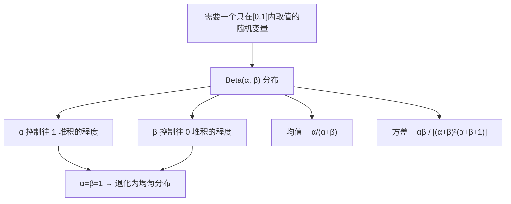

# 前置知识：Beta 分布

> **为什么要读这篇**：高斯分布定义在整条实数轴 $(-\infty, +\infty)$ 上，但很多场景里你要描述的随机变量**天生只能取 $[0,1]$ 之间的值**——一枚硬币正面朝上的概率、一种药物的有效率、扩散/流匹配模型里的时间步 $t$、两个信号混合的比例。用高斯分布描述这些量是错的（高斯会给 $[0,1]$ 之外的值分配非零概率）。Beta 分布就是为这类"天生有界"的随机变量设计的分布。本文把 Beta 分布的公式、参数含义、和为什么它能取代高斯讲透。

**标签**: `#前置知识` `#概率论` `#Beta分布` `#贝叶斯统计` `#有界随机变量`

**知识链接**：
- [概率密度函数与高斯分布](/前置知识/002b_前置知识_概率密度函数与高斯分布) — 理解 PDF 是什么是本文的前提
- [期望：概率加权平均的全部细节](/前置知识/002c_前置知识_期望方差与蒙特卡洛采样) — Beta 分布的均值公式用到期望的定义
- [方差与标准差](/前置知识/002c2_前置知识_方差与标准差) — Beta 分布的方差公式
- [二项分布](/前置知识/002d2_前置知识_二项分布) — Beta 分布是二项分布的共轭先验，理解第 5 节需要先知道二项分布
- [贝叶斯推断与共轭先验](/前置知识/002d3_前置知识_贝叶斯推断与共轭先验) — 完整走一遍"先验 × 似然 → 后验"的流程
- [条件概率与贝叶斯定理](/前置知识/002d_前置知识_条件概率与贝叶斯定理) — 贝叶斯定理的公式推导
- [重参数化技巧](/前置知识/002e_前置知识_重参数化技巧) — 从 Beta 分布采样在训练中如何配合梯度传播

---

## 贯穿全文的例子

> **场景**：你捡到一枚来源不明的硬币，怀疑它可能不是均匀的。你想知道"这枚硬币正面朝上的概率 $p$ 是多少"。
>
> 注意 $p$ 本身是一个**未知数**，但它的取值范围被物理约束死了：$p \in [0, 1]$，不可能是 $-0.3$ 或 $1.7$。你对 $p$ 的"信念"（在扔硬币之前，你觉得 $p$ 大概是多少、有多确定）需要用一个**只在 $[0,1]$ 上有定义**的概率分布来表达——这正是 Beta 分布存在的理由。

---

## 1. 为什么高斯分布不够用？

回顾[高斯分布](/前置知识/002b_前置知识_概率密度函数与高斯分布)的 PDF：

$$
p(x) = \frac{1}{\sqrt{2\pi\sigma^2}} \exp\left(-\frac{(x-\mu)^2}{2\sigma^2}\right)
$$

**这个公式在做什么**：给定均值 $\mu$ 和方差 $\sigma^2$，算出"$x$ 取某个具体值时，高斯分布在该点的概率密度有多大"。

::: details 📐 逐符号拆解 + 数值代入（点击展开）
**逐符号拆解**：

| 符号 | 含义 | 具体是什么 |
|------|------|-----------|
| $x$ | 自变量 | 随机变量的某个具体取值，范围 $(-\infty, +\infty)$ |
| $\mu$ | 均值 | 分布的"中心"位置 |
| $\sigma^2$ | 方差 | 分布的"宽度"，越大曲线越扁 |
| $\frac{1}{\sqrt{2\pi\sigma^2}}$ | 归一化常数 | 保证整条实数轴积分 = 1 |
| $\exp(-\frac{(x-\mu)^2}{2\sigma^2})$ | 钟形衰减 | 离均值越远，密度越小（指数衰减） |

**数值代入**：$\mu=0, \sigma^2=1$ 时，$p(x=0)= \frac{1}{\sqrt{2\pi}} \approx 0.399$；$p(x=3)=\frac{1}{\sqrt{2\pi}}e^{-4.5} \approx 0.0044$——离中心越远密度越小，但**永远不为零**。

**为什么是这个形式**：指数函数 $e^{-(\cdots)^2}$ 是唯一既对称又满足"乘法→加法"分解性质（独立高斯之和仍为高斯）的钟形函数。
:::

这个函数在**整条实数轴**上都大于 0——不管 $x$ 取 $100$ 还是 $-100$，$p(x)$ 都是一个正数（只是非常小）。这对于"硬币的正面概率 $p$"这种变量是不合理的：$p=1.5$ 根本不是一个合法的概率值，它的密度应该**严格为 0**，而不是"很小的正数"。

我们需要一个函数，满足：

1. 只在 $[0, 1]$ 区间内非零，区间外恒为 0
2. 形状灵活——可以是均匀的、可以偏向 0、可以偏向 1、可以在中间堆积、可以在两端堆积
3. 积分在 $[0,1]$ 上等于 1（合法的概率分布）

Beta 分布正是满足这三个条件的标准工具。

---

## 2. Beta 分布的 PDF

### 2.1 公式

$$
f(x; \alpha, \beta) = \frac{x^{\alpha-1}(1-x)^{\beta-1}}{B(\alpha, \beta)}, \qquad x \in [0, 1]
$$

**这个公式在做什么**：给定参数 $\alpha, \beta$，算出 $x\in[0,1]$ 处的概率密度值——密度越高表示采样到这个值的可能性越大。

::: details 📐 逐符号拆解 + 数值代入（点击展开）
**为什么需要这个公式**：我们需要一个只在 $[0,1]$ 上取值、形状可调的密度函数。$x^{\alpha-1}(1-x)^{\beta-1}$ 这一项天然满足"只在 $[0,1]$ 内有意义"（$x<0$ 或 $x>1$ 时这个表达式不代表合法密度），而两个自由参数 $\alpha, \beta$ 分别控制"靠近 1 的堆积程度"和"靠近 0 的堆积程度"。

> **一句话直觉**：$x^{\alpha-1}$ 这一项让密度在 $x$ 接近 1 时变大（如果 $\alpha>1$），$(1-x)^{\beta-1}$ 这一项让密度在 $x$ 接近 0 时变大（如果 $\beta>1$）。两项相乘、互相拉扯，决定了曲线的最终形状。分母 $B(\alpha,\beta)$ 只是个"把面积归一化成 1"的常数，不影响形状。

**逐符号拆解**：

| 符号 | 数学含义 | 直觉 | 在硬币例子中 |
|------|---------|------|-------------|
| $x$ | 自变量，取值范围 $[0,1]$ | "硬币正面概率 $p$ 可能等于的某个具体值" | 比如 $x=0.5$（完全公平的硬币） |
| $\alpha > 0$ | 形状参数一 | 越大，密度越往 $x=1$ 方向堆积 | 你越倾向于相信硬币偏向"正面多" |
| $\beta > 0$ | 形状参数二 | 越大，密度越往 $x=0$ 方向堆积 | 你越倾向于相信硬币偏向"反面多" |
| $x^{\alpha-1}$ | 幂函数项 | $\alpha>1$ 时随 $x$ 增大而增大；$\alpha<1$ 时随 $x$ 增大而减小（在 $x\to0$ 处发散） | 控制密度"靠近 1 那一侧"的形状 |
| $(1-x)^{\beta-1}$ | 幂函数项（关于 $x=0.5$ 对称的版本） | 和上面对称，$\beta>1$ 时靠近 $x=0$ 密度更高 | 控制密度"靠近 0 那一侧"的形状 |
| $B(\alpha,\beta)$ | Beta 函数（归一化常数） | 保证 $\int_0^1 f(x)\,dx = 1$ | 和分布形状本身无关，只是"配平"用的常数 |

**Beta 函数是什么**：$B(\alpha,\beta) = \int_0^1 t^{\alpha-1}(1-t)^{\beta-1}\,dt$，它就是分子部分在 $[0,1]$ 上积分的结果，除以它相当于把总面积强行拉回 1。对于正整数 $\alpha,\beta$，有 $B(\alpha,\beta) = \frac{(\alpha-1)!(\beta-1)!}{(\alpha+\beta-1)!}$（用阶乘算，不需要更复杂的工具）。你不需要记住怎么计算这个积分，只需要知道它是一个"归一化除数"。

**数值代入**：取 $\alpha=2, \beta=3$，计算 $x=0.4$ 处的密度：分子 $= 0.4^{2-1}\times(1-0.4)^{3-1} = 0.4 \times 0.36 = 0.144$；$B(2,3)=\frac{1!\times 2!}{4!}=\frac{2}{24}=1/12$；密度 $= 0.144/(1/12) = 0.144\times 12 = 1.728$。

**为什么是这个形式**：$x^{\alpha-1}(1-x)^{\beta-1}$ 恰好和二项分布似然 $p^k(1-p)^{n-k}$ 结构相同，使其成为二项分布的共轭先验（贝叶斯更新后仍是 Beta 分布）。这不是随便凑出的形状，而是为计算方便和概率论自洽性选定的。
:::

### 2.2 数值代入：一步步算出 Beta(1.5, 1.0) 在几个点的密度

这正是你在噪声调度文章里看到的具体参数 $\alpha=1.5$，$\beta=1.0$。代入公式：

$$
f(x; 1.5, 1.0) = \frac{x^{0.5}(1-x)^{0}}{B(1.5, 1.0)} = \frac{\sqrt{x}}{B(1.5,1.0)}
$$

**这个公式在做什么**：把 $\alpha=1.5, \beta=1.0$ 代入通用 Beta PDF，得到这组参数下的具体密度表达式。因为 $(1-x)^{\beta-1} = (1-x)^0 = 1$，$\beta=1$ 这一项直接消失了，剩下的就是 $\sqrt{x}$ 除以一个常数。

::: details 📐 逐符号拆解 + 数值代入（点击展开）
**逐符号拆解**：

| 符号 | 含义 | 具体是什么 |
|------|------|-----------|
| $x^{0.5} = \sqrt{x}$ | $\alpha-1=0.5$ 次幂 | 随 $x$ 从 0→1 单调递增，所以密度越靠右越大 |
| $(1-x)^0 = 1$ | $\beta-1=0$ 次幂 | 恒为 1，不贡献任何形状——$\beta=1$ 意味着"对左侧无额外偏好" |
| $B(1.5, 1.0)$ | 归一化常数 | 需要积分算出具体值（见下） |

**为什么是这个形式**：$\beta=1$ 导致 $(1-x)$ 项消失，分布退化为一个纯粹的"$\sqrt{x}$ 形"曲线（只受 $\alpha$ 控制），这是 Beta 分布的一种极简特例。
:::

**先算归一化常数 $B(1.5, 1.0)$**：

$$
B(1.5, 1.0) = \int_0^1 x^{0.5} \cdot 1 \, dx = \left[\frac{x^{1.5}}{1.5}\right]_0^1 = \frac{1}{1.5} = 0.667
$$

**这个公式在做什么**：计算 Beta 函数 $B(1.5,1.0)$ 的具体数值——就是对 $\sqrt{x}$ 在 $[0,1]$ 上做定积分。

::: details 📐 逐符号拆解 + 数值代入（点击展开）
**逐符号拆解**：

| 符号 | 含义 | 具体是什么 |
|------|------|-----------|
| $\int_0^1 x^{0.5}\,dx$ | 对 $x^{1/2}$ 在 $[0,1]$ 区间积分 | 幂函数积分公式：$\int x^n dx = \frac{x^{n+1}}{n+1}$ |
| $\left[\frac{x^{1.5}}{1.5}\right]_0^1$ | 代入上下限 | 上限代入得 $\frac{1}{1.5}$，下限代入得 0 |
| $0.667$ | 最终结果 | $= 2/3$，这就是归一化常数 |

**为什么是这个形式**：这是最基础的幂函数积分 $\int_0^1 x^{n}dx = \frac{1}{n+1}$（取 $n=0.5$）。
:::

所以最终简化后的密度函数：

$$
f(x; 1.5, 1.0) = \frac{\sqrt{x}}{0.667} = 1.5\sqrt{x}
$$

**这个公式在做什么**：把归一化常数代入，得到 Beta(1.5, 1.0) 的密度函数的最终简化形式——在 $[0,1]$ 上就是 $1.5\sqrt{x}$，可以直接代入任何 $x$ 值算密度。

::: details 📐 逐符号拆解 + 数值代入（点击展开）
**逐符号拆解**：

| 符号 | 含义 | 具体是什么 |
|------|------|-----------|
| $1.5$ | $= 1/B(1.5,1.0) = 1/0.667$ | 归一化系数 |
| $\sqrt{x}$ | 密度的核心形状 | 从 0 处的 0 单调上升到 1 处的 1 |

**代入几个具体的 $x$ 值**：

| $x$ | $\sqrt{x}$ | $f(x) = 1.5\sqrt{x}$ |
|-----|-----------|---------------------|
| 0.0 | 0 | 0 |
| 0.25 | 0.5 | 0.75 |
| 0.5 | 0.707 | 1.06 |
| 0.75 | 0.866 | 1.30 |
| 1.0 | 1.0 | 1.5 |

可以看到密度从 $x=0$ 处的 0 一直**单调上升**到 $x=1$ 处的 1.5——这是一个"越靠近 1 密度越高"的分布，符合 $\alpha=1.5>1$（往 1 堆积）且 $\beta=1.0$（对 0 这一侧没有额外堆积效果）的预期。

**为什么是这个形式**：$\beta=1$ 让 $(1-x)$ 项消失后，密度只由 $\sqrt{x}$ 决定——一个最简单的单调递增函数。如果改成 $\alpha=2, \beta=1$，就会变成 $2x$（线性增长）；$\alpha=3, \beta=1$ 变成 $3x^2$（更快增长）。$\alpha$ 越大，密度越猛地堆向 $x=1$。
:::

下图把上面表格中的点画在曲线上，一目了然：


> 蓝色虚线标出均值 $\mathbb{E}[x]=0.6$。灰色虚线 $y=1$ 是均匀分布的基准——曲线在 $x\approx0.44$ 以下低于均匀分布（这些值被"压制"了），在 $x>0.44$ 以上高于均匀分布（更容易被采到）。

**为什么是这个形式**：为什么不用别的函数形状？因为 $x^{\alpha-1}(1-x)^{\beta-1}$ 这个形式恰好是二项分布似然函数的"共轭搭档"（详见第 5 节），使得贝叶斯更新时公式极其简洁——这是历史上 Beta 分布被选中的根本原因，不是随便凑出来的形状。

---

## 3. 参数 $\alpha, \beta$ 如何决定分布形状

**先看图**——下面这张图画出了 7 组不同 $(\alpha, \beta)$ 参数对应的 Beta 分布 PDF 曲线。上半张是所有曲线叠加总览，下半张按"对称/偏态/边界"三类分组对比。建议对照着图来读后面的表格，会非常直观：


> **图解**：灰色虚线 $y=1$ 是均匀分布的基准。曲线高于这条线的区域表示"比均匀分布更倾向于采到这里的值"，低于则表示"比均匀更少出现"。注意 $\alpha=\beta=0.5$（红色 U 形）在两端趋向无穷——这意味着采样结果几乎总是接近 0 或 1。

Beta 分布的形状完全由 $(\alpha, \beta)$ 这两个正数决定，记住几个关键规律：

| $\alpha, \beta$ 组合 | 形状 | 直觉 |
|---------------------|------|------|
| $\alpha = \beta = 1$ | 平的直线（退化为均匀分布 $U[0,1]$） | 没有任何偏好，所有值同等可能 |
| $\alpha = \beta > 1$ | 中间凸起的钟形，关于 $x=0.5$ 对称 | 越大越集中在中间（类似高斯但有界） |
| $\alpha = \beta < 1$ | U 形，两端翘起，中间凹陷 | 极端值（0 或 1 附近）更可能出现 |
| $\alpha > \beta$ | 偏向 $x=1$ 一侧 | 越偏向 1，$\alpha$ 相对 $\beta$ 越大 |
| $\alpha < \beta$ | 偏向 $x=0$ 一侧 | 越偏向 0，$\beta$ 相对 $\alpha$ 越大 |

**为什么会有这个规律**：$x^{\alpha-1}$ 这一项只在 $\alpha>1$ 时才会"惩罚"小的 $x$（因为幂函数在 $(0,1)$ 上，指数越大，函数值在小 $x$ 处压得越低）。同理 $(1-x)^{\beta-1}$ 在 $\beta>1$ 时惩罚大的 $x$。两个惩罚项的相对大小决定了密度最终"堆"在哪一侧。

$\alpha=1.5, \beta=1.0$ 这组参数（对应 $\alpha>\beta$）密度整体偏向 $x=1$——这正好解释了第 2.2 节里算出来的表格：密度随 $x$ 增大而增大。

---

## 4. 均值和方差

Beta 分布的均值和方差有封闭形式的公式（不需要积分就能直接算）：

$$
\mathbb{E}[x] = \frac{\alpha}{\alpha+\beta}, \qquad \text{Var}(x) = \frac{\alpha\beta}{(\alpha+\beta)^2(\alpha+\beta+1)}
$$

**这个公式在做什么**：直接从 $\alpha,\beta$ 算出 Beta 分布的均值（重心位置）和方差（散布程度），不需要做积分。

::: details 📐 逐符号拆解 + 数值代入（点击展开）
**为什么需要这个公式**：如果每次都要重新做积分才能知道"这个分布平均取值多少、有多分散"，太麻烦了。Beta 分布恰好有这两个封闭形式的公式，直接代入 $\alpha,\beta$ 就能拿到答案，不需要数值积分。

**逐符号拆解**：

| 符号 | 含义 | 具体是什么 |
|------|------|-----------|
| $\mathbb{E}[x]$ | 均值——分布的"重心"在哪 | 对 $x\cdot f(x)$ 在 $[0,1]$ 积分的结果 |
| $\alpha/(\alpha+\beta)$ | $\alpha$ 相对总权重 $\alpha+\beta$ 的占比 | 直接就是均值，$\alpha$ 越大均值越靠近 1 |
| $\text{Var}(x)$ | 方差——分布有多"散" | 越小说明分布越集中在均值附近 |
| $(\alpha+\beta)^2$ | 分母中的平方项 | $\alpha+\beta$ 越大（"浓度"越高），方差越小 |
| $(\alpha+\beta+1)$ | 额外的分母项 | 进一步压缩方差，确保 $\alpha,\beta$ 增大时方差趋于 0 |

**数值代入**（$\alpha=1.5, \beta=1.0$）：

$$
\mathbb{E}[x] = \frac{1.5}{1.5+1.0} = \frac{1.5}{2.5} = 0.6
$$

$$
\text{Var}(x) = \frac{1.5 \times 1.0}{(2.5)^2 \times 3.5} = \frac{1.5}{21.875} = 0.0686
$$

标准差 $\sqrt{0.0686} \approx 0.262$。

**含义**：平均而言采样会落在 $x=0.6$ 附近，波动幅度（标准差）大约 0.26——这和之前算出的密度表格吻合（密度往 $x=1$ 那侧倾斜，均值自然大于 0.5）。

**为什么是这个形式**：$\alpha+\beta$ 常被称为"浓度参数"（concentration）——把 $\alpha, \beta$ 同时放大 $k$ 倍（比如从 $(1.5, 1.0)$ 变成 $(15, 10)$），均值 $\alpha/(\alpha+\beta)$ 不变，但方差公式的分母里 $(\alpha+\beta+1)$ 项会让方差急剧缩小。这就是为什么"浓度参数越大，分布越集中"——$\alpha,\beta$ 不仅决定"偏向哪一侧"，它们的**总和**还决定"有多确定"。
:::

---

## 5. Beta 分布为什么是二项分布的"共轭先验"

这是 Beta 分布在贝叶斯统计里最出名的性质，也是它被发明的历史原因。

> 💡 如果你对"二项分布"、"似然函数"、"先验/后验"这些概念还不熟悉，建议先阅读：
> - [二项分布](/前置知识/002d2_前置知识_二项分布) — 理解 $p^k(1-p)^{n-k}$ 这个表达式从哪来
> - [贝叶斯推断与共轭先验](/前置知识/002d3_前置知识_贝叶斯推断与共轭先验) — 用完整的数值例子走一遍"先验 × 似然 → 后验"的全流程，比本节更详细

回到硬币的例子：假设你对硬币的正面概率 $p$ 的先验信念是 $p \sim \text{Beta}(\alpha, \beta)$。你扔了 $n$ 次硬币，观察到 $k$ 次正面、$n-k$ 次反面。根据[贝叶斯定理](/前置知识/002d_前置知识_条件概率与贝叶斯定理)，更新后的后验分布是：

$$
p(p \mid k, n) \propto \underbrace{p^k(1-p)^{n-k}}_{\text{似然（二项分布）}} \times \underbrace{p^{\alpha-1}(1-p)^{\beta-1}}_{\text{先验（Beta 分布）}} = p^{(\alpha+k)-1}(1-p)^{(\beta+n-k)-1}
$$

**这个公式在做什么**：把"观测到 $n$ 次投掷中 $k$ 次正面"的证据与先验信念相乘，得到后验分布——后验仍然是 Beta 分布，参数从 $(\alpha,\beta)$ 更新为 $(\alpha+k, \beta+n-k)$。

::: details 📐 逐符号拆解 + 数值代入（点击展开）
**逐符号拆解**：

| 符号 | 含义 | 具体是什么 |
|------|------|-----------|
| $p$ | 硬币正面概率 | 我们要推断的未知量，$p\in[0,1]$ |
| $k$ | 观察到的正面次数 | 已知数据，比如 7 |
| $n$ | 总投掷次数 | 已知数据，比如 10 |
| $p^k(1-p)^{n-k}$ | 二项似然 | "如果真实概率是 $p$，观测到 $k$ 次正面的可能性有多大" |
| $p^{\alpha-1}(1-p)^{\beta-1}$ | Beta 先验 | 观测数据之前你对 $p$ 的信念 |
| $\propto$ | "正比于" | 省略了不依赖 $p$ 的归一化常数 |
| $p^{(\alpha+k)-1}(1-p)^{(\beta+n-k)-1}$ | 后验的核 | 这就是 $\text{Beta}(\alpha+k,\ \beta+n-k)$ 的 PDF 形式 |

**数值代入**：先验 $\text{Beta}(1.5, 1.0)$，扔了 $n=10$ 次硬币，观察到 $k=7$ 次正面：

后验 $= \text{Beta}(1.5+7,\ 1.0+3) = \text{Beta}(8.5, 4.0)$

新的均值：$\frac{8.5}{8.5+4.0} = \frac{8.5}{12.5} = 0.68$——比先验均值 0.6 更偏向"正面更多"，因为数据支持这个方向。

新的方差：$\frac{8.5\times 4.0}{12.5^2\times 13.5}=\frac{34}{2109.4}\approx 0.016$，标准差 $\approx 0.13$——比先验的 0.26 小了一半，说明观测数据让我们对 $p$ 的估计"更确定"了。

**为什么是这个形式**：似然 $p^k(1-p)^{n-k}$ 和先验 $p^{\alpha-1}(1-p)^{\beta-1}$ 都是 $p$ 的幂乘以 $(1-p)$ 的幂。相乘后指数直接相加——这正是"共轭"的含义：函数形式不变，只有参数变了。
:::

> **一句话直觉**：Beta 分布和二项分布的似然函数长得几乎一样（都是 $p$ 的幂乘以 $(1-p)$ 的幂），所以乘起来之后还是同样的形式，只是指数变了。这种"先验和后验属于同一个分布家族"的性质叫做**共轭**（conjugacy）。

**数值例子**：先验 $\text{Beta}(1.5, 1.0)$，扔了 $n=10$ 次硬币，观察到 $k=7$ 次正面：

后验 $= \text{Beta}(1.5+7,\ 1.0+3) = \text{Beta}(8.5, 4.0)$

新的均值：$\frac{8.5}{8.5+4.0} = \frac{8.5}{12.5} = 0.68$——比先验均值 0.6 更偏向"正面更多"，因为数据支持这个方向。

这个性质在机器学习之外的场景（噪声调度、时间步采样）用不到"贝叶斯更新"，但理解它能帮你明白**为什么历史上 Beta 分布会被选作"[0,1] 区间上的标准分布"**——它不是随便挑的，而是和最基础的二项事件（成功/失败）天然配对的数学对象。

---

## 6. Beta 分布 vs 均匀分布：为什么不直接用 $U(0,1)$

如果只是需要一个 $[0,1]$ 上的随机数，为什么不直接用最简单的均匀分布 $U(0,1)$？

| | 均匀分布 $U(0,1)$ | Beta 分布 |
|---|---|---|
| 参数个数 | 0（没有可调参数） | 2 个（$\alpha, \beta$） |
| 形状 | 恒定平坦 | 可调：单峰、U 形、偏左、偏右 |
| 特殊情况 | 是 Beta(1,1) 的特例 | 涵盖均匀分布作为特例 |
| 用途 | 需要"完全无偏好"的随机数 | 需要"有偏好但仍在 $[0,1]$ 内"的随机数 |

**关键点**：均匀分布是 Beta 分布在 $\alpha=\beta=1$ 时的特例。当你需要采样结果"更偏向某一侧"（比如更常采到接近 0 的值，或更常采到接近 1 的值），均匀分布做不到——它对所有值一视同仁。Beta 分布通过调节 $\alpha,\beta$ 就能精确控制"偏向程度"，这是它比均匀分布更常被选用的原因。

---

## 7. PyTorch 代码实现

Beta 分布在 PyTorch 中同样被 `torch.distributions` 封装好了，用法和[高斯分布的 `Normal` 类](/前置知识/002b_前置知识_概率密度函数与高斯分布)完全一致的接口风格。

核心思路：给定 $\alpha, \beta$ 构造一个 `Beta` 分布对象，就能直接调用 `.sample()` 采样、`.log_prob()` 算对数密度、`.mean` 和 `.variance` 直接读取均值方差（不用自己套公式）。

```python
import torch
from torch.distributions import Beta

# 构造 Beta(1.5, 1.0) 分布对象
alpha = torch.tensor(1.5)
beta = torch.tensor(1.0)
dist = Beta(alpha, beta)

# 直接读取均值和方差（对应第 4 节的封闭形式公式）
print(f"均值: {dist.mean.item():.4f}")      # 0.6000
print(f"方差: {dist.variance.item():.4f}")   # 0.0686

# 采样 5 个样本
samples = dist.sample([5])
print(f"采样结果: {samples}")
# 例如 tensor([0.82, 0.45, 0.91, 0.63, 0.77])——注意整体偏向大值

# 计算某个具体点的 log 概率密度
log_p = dist.log_prob(torch.tensor(0.75))
print(f"log p(0.75) = {log_p.item():.4f}")
# 验证：f(0.75) = 1.5 * sqrt(0.75) = 1.299，log(1.299) ≈ 0.262
```

**代码关键点解说**：

1. **`Beta(alpha, beta)` 的参数顺序**：第一个参数对应 $\alpha$（控制往 1 堆积），第二个对应 $\beta$（控制往 0 堆积）——和公式里的顺序一致，不要弄反。
2. **`.sample()` vs `.rsample()`**：和高斯分布一样，如果需要梯度穿过采样过程（比如在训练循环中把采样结果送进网络），要用 `.rsample()`。Beta 分布支持重参数化采样，PyTorch 底层通过两个 Gamma 分布的比值实现（$\text{Beta}(\alpha,\beta) = \frac{X}{X+Y}$，其中 $X\sim\text{Gamma}(\alpha,1)$, $Y\sim\text{Gamma}(\beta,1)$，这是 Beta 分布的另一种等价构造方式）。
3. **`.mean` / `.variance` 是属性不是方法**：PyTorch 直接用公式算好了封闭形式的结果，不需要你手动写第 4 节的公式。

---

## 8. 常见疑问

### Q1：$\alpha, \beta$ 必须是整数吗？

不需要。$\alpha, \beta$ 可以是任意正实数（包括小数，比如本文反复用的 $\alpha=1.5$）。这也是为什么归一化常数要用 Beta 函数（用积分定义）而不是简单的阶乘公式——阶乘只对整数有意义，但 Beta 函数对任意正实数都成立（背后用到 Gamma 函数，是阶乘在实数上的推广，这里不展开）。

### Q2：如果 $\alpha < 1$ 或 $\beta < 1$ 会发生什么？

密度函数会在对应的边界处**发散到无穷**（但积分仍然收敛，仍是合法分布）。比如 $\text{Beta}(0.5, 0.5)$ 在 $x\to 0$ 和 $x \to 1$ 处密度都趋向 $+\infty$，形成经典的"U 形"分布——采样结果几乎总是接近 0 或接近 1，很少落在中间。

### Q3：Beta 分布只能用于概率吗？

不是。虽然历史上 Beta 分布最早用来描述"关于概率的信念"，但任何**天然落在 $[0,1]$ 区间、且形状需要灵活可调**的随机变量都可以用 Beta 分布建模——比如混合系数、归一化后的时间进度、比例型的超参数采样。第 1 节讨论的核心约束（有界、形状灵活）才是选择 Beta 分布的真正理由，跟它是不是"概率"无关。

### Q4：Beta 分布和 Dirichlet 分布是什么关系？

Beta 分布是 Dirichlet 分布在**两个类别**时的特例。Dirichlet 分布把 Beta 分布推广到"多个数字加起来等于 1"的场景（比如一个 3 分类问题里 $[p_1,p_2,p_3]$ 且 $p_1+p_2+p_3=1$）。如果只有两个数 $p$ 和 $1-p$，Dirichlet 就退化成 Beta。

---

## 总结



| 概念 | 一句话总结 |
|------|----------|
| Beta 分布 | 专门描述 $[0,1]$ 区间随机变量的分布，形状由 $\alpha,\beta$ 两个正数自由调节 |
| $\alpha$ | 越大，密度越往 $x=1$ 堆积 |
| $\beta$ | 越大，密度越往 $x=0$ 堆积 |
| $B(\alpha,\beta)$ | 纯粹的归一化常数，不影响形状 |
| $\alpha=\beta=1$ | 退化为均匀分布 $U(0,1)$ |
| 共轭先验 | Beta 是二项分布的共轭先验——贝叶斯更新后仍是 Beta 分布，只是参数变了 |
| 均值/方差 | 有封闭公式，不用做积分：$\mathbb{E}[x]=\alpha/(\alpha+\beta)$ |

---

## 延伸阅读

- [概率密度函数与高斯分布](/前置知识/002b_前置知识_概率密度函数与高斯分布) — 对比"无界"分布和"有界"分布的设计差异
- [条件概率与贝叶斯定理](/前置知识/002d_前置知识_条件概率与贝叶斯定理) — 理解第 5 节共轭先验推导的基础
- [重参数化技巧](/前置知识/002e_前置知识_重参数化技巧) — Beta 分布的可微采样在训练中如何使用
- [随机插值与 Flow-SDE](/前置知识/002i_前置知识_随机插值与Flow_SDE转移分布构造) — 时间步 $t\in[0,1]$ 采样在 Flow Matching 训练中的作用
