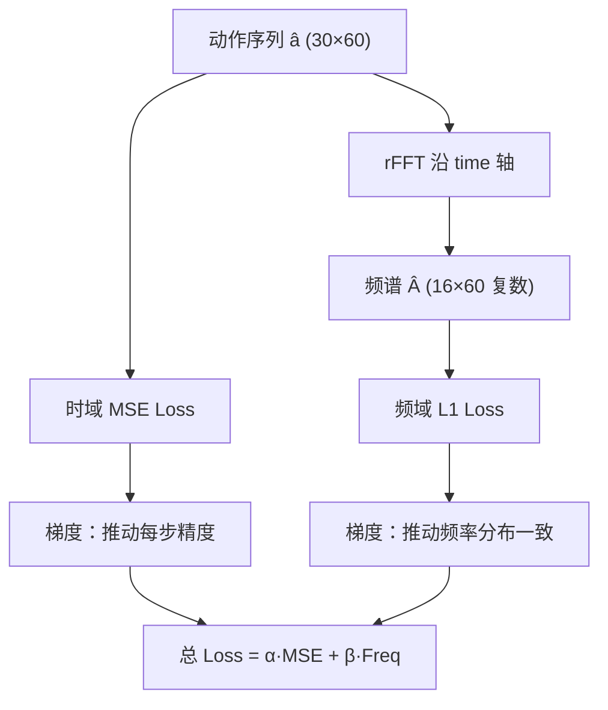

# 前置知识：时域 Loss 与频域 Loss——动作序列的双重监督

> **为什么要读这篇**：机器人策略生成的动作序列是一段"信号"——它有每个时间步的精度问题（时域），也有步与步之间平滑性/频率特征问题（频域）。只用 MSE 惩罚逐步误差，可能导致动作抖动（高频噪声）；加上频域 Loss 可以直接约束动作的频率分布，生成更平滑自然的轨迹。这在 Xiaomi-Robotics-1、DPPO 等最新 VLA/扩散策略中广泛使用。

> **前置要求**：基础线代和概率、了解 [傅里叶变换直觉](/前置知识/002v_前置知识_傅里叶变换直觉与频域分析)、了解 [Flow Matching](/前置知识/000g_前置知识_Flow_Matching与连续归一化流) 的基本思路

**标签**: `#前置知识` `#时域Loss` `#频域Loss` `#FFT` `#动作平滑` `#Flow Matching`

**知识链接**：
- [傅里叶变换直觉与频域分析](/前置知识/002v_前置知识_傅里叶变换直觉与频域分析) — 如果你不熟悉 FFT，先读这篇
- [Flow Matching 与连续归一化流](/前置知识/000g_前置知识_Flow_Matching与连续归一化流) — 频域 Loss 常与 Flow Matching 配合使用
- [动作平滑性正则化 CAPS](/前置知识/000i_前置知识_动作平滑性正则化CAPS) — 另一种动作平滑方案
- [Xiaomi-Robotics-1 精读](/论文综述/094_XiaomiRobotics1_十万小时数据Scaling_VLA) — 本文核心应用场景

---

## 一、问题：为什么单独用 MSE 不够？

### 1.1 贯穿全文的例子

假设一个机械臂需要在 30 个时间步内将杯子从桌面左侧平移到右侧。理想轨迹是一条平滑的直线：

```
x 位置: [0.0, 0.5, 1.0, 1.5, 2.0, ..., 14.5, 15.0]  # 匀速直线
```

现在假设模型预测了两种不同的错误轨迹：

**轨迹 A（低频偏移）**：整体偏了一点，但很平滑
```
预测: [0.2, 0.7, 1.2, 1.7, 2.2, ..., 14.7, 15.2]  # 整体偏了 +0.2
MSE = 0.04（每步误差 0.2²）
```

**轨迹 B（高频抖动）**：平均位置正确，但每步都在振荡
```
预测: [0.0, 0.8, 0.7, 1.8, 1.7, ..., 14.8, 14.7]  # 每步 ±0.3 锯齿
MSE ≈ 0.045（每步误差约 0.2~0.3²）
```

**关键问题**：轨迹 A 和 B 的 MSE 几乎相同！但对真实机器人来说，轨迹 B 是灾难性的——高频振荡会造成关节颤抖、齿轮磨损、甚至甩掉被夹住的物体。轨迹 A 只是位置有一点偏差，物理上完全可接受。

**结论**：MSE 只关心"每个点偏了多少"，不关心"步与步之间的变化模式"。我们需要一种 Loss 能直接感知频率特征——这就是频域 Loss 的动机。

### 1.2 信号处理的直觉

把动作序列看作一段离散信号 $a[t], t=0,1,...,T-1$：

- **低频分量**：对应动作的整体趋势（如"从左到右移动"）
- **高频分量**：对应动作的快速波动（如"每步正负交替"）

人类示教的动作通常是**低频主导**的——手臂运动本身就有惯性，不可能瞬间反向。如果模型预测的动作高频分量过强，几乎可以确定是错的。

---

## 二、时域 Loss：逐步精度监督

### 2.1 标准 MSE Loss

最基础的时域 Loss 就是逐时间步的均方误差：

$$
\mathcal{L}_{\text{MSE}} = \frac{1}{T \cdot D} \sum_{t=0}^{T-1} \sum_{d=0}^{D-1} \bigl( \hat{a}[t,d] - a^*[t,d] \bigr)^2
$$

**这个公式在做什么**：计算预测动作序列 $\hat{a}$ 与目标动作序列 $a^*$ 在每个时间步、每个维度上的平方误差的平均值。

::: details 📐 逐符号拆解 + 数值代入（点击展开）
**逐符号拆解**：

| 符号 | 含义 | 具体是什么 |
|------|------|-----------|
| $T$ | 时间步数 | action chunk 长度，如 30 |
| $D$ | 动作维度 | 如 60（双臂关节角 + 夹爪 + 末端位姿）|
| $\hat{a}[t,d]$ | 模型预测值 | DiT 输出的第 $t$ 步第 $d$ 维动作 |
| $a^*[t,d]$ | 真实值 | 训练数据中的 ground truth |

**数值代入**：假设 $T=3$, $D=2$，预测 $\hat{a} = [[0.1, 0.3], [0.5, 0.7], [0.9, 1.1]]$，目标 $a^* = [[0.0, 0.2], [0.5, 0.8], [1.0, 1.0]]$：

$$
\mathcal{L}_{\text{MSE}} = \frac{1}{3 \times 2}\bigl[(0.1)^2 + (0.1)^2 + (0.0)^2 + (0.1)^2 + (0.1)^2 + (0.1)^2\bigr] = \frac{0.05}{6} = 0.0083
$$

**梯度方向**：每个预测值被推向对应的真实值。偏大就往小调，偏小就往大调。各时间步独立。
:::

### 2.2 时域 Loss 的局限

MSE 有一个根本性的盲点：**它把每个时间步独立看待，完全不考虑相邻步之间的关系**。

数学上说：MSE 的梯度是 $\nabla_{\hat{a}[t,d]} \mathcal{L} = \frac{2}{TD}(\hat{a}[t,d] - a^*[t,d])$——只依赖当前步的误差，不涉及 $\hat{a}[t-1]$ 或 $\hat{a}[t+1]$。

后果：
- 如果模型在第 5 步预测偏高 +0.1，第 6 步预测偏低 -0.1，MSE 只看到两个小误差（各 0.01），觉得"还行"
- 但从时序角度看，这是一个 **0.2 幅度的突变**——物理上可能需要极大的加速度才能实现

### 2.3 加权 MSE：重要性重分配

在实际系统中（如 Xiaomi-Robotics-1），MSE 通常不是均匀加权的，而是会对不同时间步/维度赋予不同权重：

$$
\mathcal{L}_{\text{weighted-MSE}} = \frac{1}{|\mathcal{M}|} \sum_{(t,d) \in \mathcal{M}} w[t,d] \cdot \bigl( \hat{a}[t,d] - a^*[t,d] \bigr)^2
$$

**这个公式在做什么**：在标准 MSE 基础上，对每个位置乘以权重 $w[t,d]$，让某些时间步/维度的误差对 loss 贡献更大。$\mathcal{M}$ 是有效的 mask 集合（有些时间步可能是 padding）。

::: details 📐 逐符号拆解 + 数值代入（点击展开）
**逐符号拆解**：

| 符号 | 含义 | 具体是什么 |
|------|------|-----------|
| $w[t,d]$ | 权重 | 在 XR-1 中由 prefix 预测误差动态计算，归一化后 clamp 到 [0.5, 5.0] |
| $\mathcal{M}$ | 有效集合 | action_mask 为 True 的位置（排除 padding） |
| $\|\mathcal{M}\|$ | 有效位置总数 | 用于平均化 |

**XR-1 的权重计算方式**：
```python
weight[action_mask] /= weight[action_mask].mean()  # 归一化，使均值=1
weight.clamp_(0.5, 5.0)  # 限制在 [0.5, 5.0]，防止极端值
```

**数值代入**：假设 3 个时间步的误差权重为 [0.8, 1.0, 3.2]，预测误差为 [0.1, 0.2, 0.05]：
- 归一化：均值 = (0.8+1.0+3.2)/3 = 1.67，归一化后 = [0.48, 0.60, 1.92]
- clamp 后：[0.5, 0.6, 1.92]（0.48 被 clamp 到 0.5）
- 加权 MSE = (0.5×0.01 + 0.6×0.04 + 1.92×0.0025) / 3 = (0.005 + 0.024 + 0.0048)/3 = 0.0113

**为什么要加权**：在异步执行场景下，prefix 之后的第一步如果预测错了，后续整个轨迹都会偏移——这些"后果严重"的步应该获得更大权重。
:::

---

## 三、频域 Loss：全局频率监督

### 3.1 离散傅里叶变换（DFT）快速复习

对一个长度为 $T$ 的实数序列 $x[0], x[1], ..., x[T-1]$，其离散傅里叶变换为：

$$
X[k] = \sum_{t=0}^{T-1} x[t] \cdot e^{-j 2\pi kt / T}, \quad k = 0, 1, ..., T-1
$$

**这个公式在做什么**：把时域信号分解成不同频率的正弦/余弦分量。$X[k]$ 是第 $k$ 个频率分量的复数系数（包含幅度和相位信息）。

::: details 📐 逐符号拆解 + 数值代入（点击展开）
**逐符号拆解**：

| 符号 | 含义 | 具体是什么 |
|------|------|-----------|
| $x[t]$ | 时域信号的第 $t$ 个采样点 | 动作序列的第 $t$ 步某一维度的值 |
| $X[k]$ | 第 $k$ 个频率分量 | 复数，$\|X[k]\|$ 是幅度，$\angle X[k]$ 是相位 |
| $k$ | 频率索引 | $k=0$ 是直流分量（平均值），$k=T/2$ 是最高频（Nyquist） |
| $e^{-j2\pi kt/T}$ | 旋转因子 | 频率为 $k$ 的复正弦基函数 |
| $j$ | 虚数单位 | $j^2 = -1$ |

**关键直觉**：
- $k=0$：$X[0] = \sum x[t]$ = 信号总和（直流分量 / 均值 × T）
- $k=1$：对应"整个序列恰好一个完整周期"的振荡
- $k$ 越大：对应越快的振荡（高频）
- 对于实信号，rFFT 只需计算 $k=0,...,T/2$（对称性）

**数值代入**：$T=4$，$x = [1, 3, 1, 3]$（交替高低，典型高频信号）：
- $X[0] = 1+3+1+3 = 8$（直流 = 均值 × 4 = 2 × 4）
- $X[1] = 1 \cdot 1 + 3 \cdot e^{-j\pi/2} + 1 \cdot e^{-j\pi} + 3 \cdot e^{-j3\pi/2} = 1 - 3j - 1 + 3j = 0$
- $X[2] = 1 - 3 + 1 - 3 = -4$（最高频分量，幅度 4——因为信号就是在最高频振荡）

对比一个平滑信号 $x = [1, 2, 3, 4]$：
- $X[0] = 10$（直流）
- $X[2] = 1-2+3-4 = -2$（高频分量小——因为信号本身很平滑）

**结论**：高频分量 $|X[k]|$ 大 = 信号有快速振荡。
:::

### 3.2 频域 Loss 的定义

频域 Loss 的核心思想：对预测动作和目标动作分别做 FFT，然后比较它们在各频率分量上的差异。

$$
\mathcal{L}_{\text{freq}} = \frac{1}{|\mathcal{M}_f|} \sum_{(k,d) \in \mathcal{M}_f} \bigl| \hat{A}[k,d] - A^*[k,d] \bigr|
$$

其中 $\hat{A} = \text{rFFT}(\hat{a})$，$A^* = \text{rFFT}(a^*)$，rFFT 沿时间轴做实数 FFT。

**这个公式在做什么**：计算预测动作的频谱和目标动作的频谱之间的差异。如果预测动作比目标多了高频分量（抖动），或者少了某些低频分量（丢失趋势），频域 Loss 都能捕捉到。

::: details 📐 逐符号拆解 + 数值代入（点击展开）
**逐符号拆解**：

| 符号 | 含义 | 具体是什么 |
|------|------|-----------|
| $\hat{A}[k,d]$ | 预测动作第 $d$ 维的第 $k$ 个频率分量 | 复数 |
| $A^*[k,d]$ | 目标动作第 $d$ 维的第 $k$ 个频率分量 | 复数 |
| $\|\cdot\|$ | 复数取模 | $\|a+bj\| = \sqrt{a^2 + b^2}$ |
| $\mathcal{M}_f$ | 频域有效 mask | 排除 padding 位置和特定维度（如夹爪维度） |
| rFFT | 实数快速傅里叶变换 | 输入 $T$ 个实数，输出 $T/2+1$ 个复数 |

**为什么用 L1 而不是 L2**：代码中使用 `.abs()`（L1），而不是 `.abs().pow(2)`（L2）。L1 对离群频率分量的惩罚更温和——如果某个频率上偏差很大，L2 会过度聚焦于此单个频率，L1 则更均匀地关注所有频率。

**数值代入**：$T=4$, $D=1$：
- 目标动作 $a^* = [1, 2, 3, 4]$，rFFT → $A^* = [10, -2+2j, -2]$
- 预测动作 $\hat{a} = [1, 2.5, 2.5, 4]$（中间两步有抖动），rFFT → $\hat{A} = [10, -1.5+1.5j, -2]$

频域差异：
- $k=0$：$|10 - 10| = 0$（直流一样）
- $k=1$：$|(-2+2j) - (-1.5+1.5j)| = |-0.5+0.5j| = \sqrt{0.25+0.25} = 0.707$
- $k=2$：$|-2 - (-2)| = 0$

$\mathcal{L}_{\text{freq}} = (0 + 0.707 + 0) / 3 = 0.236$

对比时域 MSE：$(0 + 0.25 + 0.25 + 0)/4 = 0.125$

**两者捕捉到不同信息**：MSE 说"中间两步各偏了 0.5"；频域 Loss 说"$k=1$ 频率上有 0.707 的偏差"——后者更直接地指出"预测缺少了某种中频振荡模式"。
:::

### 3.3 为什么要排除某些维度？

在 XR-1 的实现中，频域 Loss 排除了第 17、18、19 维：

```python
self.freq_excluded_dims = [17, 18, 19]
freq_mask[:, :, dims] = False  # 这些维度不参与频域 loss
```

这些维度对应**夹爪开合**等离散信号。夹爪动作的特点是：大部分时间保持不变（全开或全闭），偶尔发生阶跃变化（抓取瞬间从 1 跳到 0）。

阶跃信号的 FFT 在所有频率上都有能量（因为方波需要无穷多正弦叠加）。如果对夹爪施加频域 Loss，就相当于在惩罚模型做出"快速开/合"这种正确动作——这显然不对。所以把这些维度排除在频域约束之外。

### 3.4 频域 Loss 与时域 Loss 的互补关系



两者的关系不是冗余的，而是互补的：

| 特性 | 时域 MSE | 频域 L1 |
|------|---------|---------|
| 感知范围 | 每个时间步独立 | 跨越整个序列的全局频率模式 |
| 对高频抖动的敏感度 | 低（小振幅抖动 MSE 贡献小） | 高（高频能量集中，容易被捕捉） |
| 对整体偏移的敏感度 | 高（每步都算偏差） | 低（只影响直流分量 $k=0$） |
| 梯度信号 | "这个点偏了多少" | "这个频率分量多了/少了多少" |
| 物理含义 | 位置精度 | 运动平滑性 / 频率一致性 |

---

## 四、工程实现：以 Xiaomi-Robotics-1 为例

### 4.1 完整代码解析

XR-1 的 `compute_flow_loss` 同时计算时域和频域 Loss。以下是逐行解读：

```python
def compute_flow_loss(self, pred, target, action_mask, weight):
    # 转为 float32 保证数值精度（模型本身用 bfloat16）
    pred, target, weight = pred.float(), target.float(), weight.float()
```

第一个关键点：Loss 计算在 float32 下进行，即使模型训练用的是 bfloat16。因为 FFT 对精度敏感，bfloat16 的有效位数不够。

```python
    # 归一化权重：使有效位置的平均权重 = 1，然后 clamp 到 [0.5, 5.0]
    with torch.no_grad():
        weight = weight.clone()
        weight[action_mask] /= weight[action_mask].mean()
        weight.clamp_(0.5, 5.0)
```

权重的来源是**异步执行模式下的 prefix 预测误差**——如果 prefix 执行后某些后续步偏差大，说明这些步对前缀依赖性强，应该给更大权重。归一化后 clamp 防止极端值主导梯度。

```python
    # 时域 MSE Loss：加权逐步 MSE，只在有效位置取平均
    loss_mse = (F.mse_loss(pred, target, reduction="none") * weight)[action_mask].mean()
```

这行就是标准的加权 MSE，但只对 `action_mask` 为 True 的位置求平均（排除 padding）。

```python
    # 频域 Loss：对 pred 和 target 沿时间轴做 rFFT，计算差异的绝对值
    freq = (torch.fft.rfft(pred, dim=1) - torch.fft.rfft(target, dim=1)).abs()
```

`dim=1` 是时间维度。输入形状 `(B, T, D)`，rFFT 后变成 `(B, T//2+1, D)` 的复数张量。取 `.abs()` 得到每个频率分量的幅度差。

```python
    # 只对最后一步有效的 batch 做频域 loss（确保是完整序列，不是被截断的）
    valid_batch = action_mask[:, -1].any(dim=1)
    freq_mask = action_mask[valid_batch, : freq.shape[1]].clone()
    
    # 排除特定维度（如夹爪）
    dims = [dim for dim in self.freq_excluded_dims if dim < freq_mask.shape[-1]]
    freq_mask[:, :, dims] = False
    
    # 频域 loss = 有效位置的平均频率误差（L1）
    freq_weight = weight.mean(dim=(1, 2)).view(-1, 1, 1)
    loss_freq = (freq * freq_weight)[valid_batch][freq_mask].mean()
```

注意频域 Loss 也受权重影响（`freq_weight`），但用的是权重在所有时间步和维度上的平均值——因为频域是"全局"的，不需要逐步权重。

### 4.2 总 Loss 的组合

```python
loss = 0.5 * loss_mse + self.freq_coefficient * loss_freq + ...
```

`freq_coefficient` 默认 = 1.0。两个 loss 的量级本身就差不多（因为 pred/target 都做了归一化），所以不需要精细调节系数。0.5 × MSE + 1.0 × Freq 意味着频域约束的权重比时域稍高一点。

---

## 五、频域 Loss 的梯度直觉

频域 Loss 的梯度是怎么回传到时域预测上的？关键在于 FFT 是**线性变换**——梯度可以直接通过 iFFT 回传。

直觉理解：

- 如果 $\mathcal{L}_{\text{freq}}$ 发现预测的第 $k=5$ 频率分量比目标大了 0.3
- 梯度会推动预测减小 $k=5$ 对应的振荡
- 在时域中，这意味着"把频率为 $5/T$ 的正弦分量的幅度降低"
- 效果：时域信号中对应频率的 wiggle 被抑制

$$
\frac{\partial \mathcal{L}_{\text{freq}}}{\partial \hat{a}[t]} = \text{iFFT}\left( \frac{\partial \mathcal{L}_{\text{freq}}}{\partial \hat{A}[k]} \right)
$$

**这个公式在做什么**：频域 Loss 对时域预测的梯度 = 频域梯度的逆 FFT。由于 FFT 是正交变换，梯度回传时自动把"哪个频率要怎么调"翻译成"时域上每一步该怎么调"。

::: details 📐 逐符号拆解 + 数值代入（点击展开）
**逐符号拆解**：

| 符号 | 含义 |
|------|------|
| $\partial \mathcal{L}_{\text{freq}} / \partial \hat{A}[k]$ | Loss 对第 $k$ 个频率分量的梯度（频域空间） |
| $\partial \mathcal{L}_{\text{freq}} / \partial \hat{a}[t]$ | Loss 对第 $t$ 个时间步预测的梯度（时域空间） |
| iFFT | 逆傅里叶变换，从频域 → 时域 |

**为什么 iFFT 能回传梯度**：FFT 可以写成矩阵乘法 $A = F \cdot a$（其中 $F$ 是 DFT 矩阵）。根据链式法则，$\partial L / \partial a = F^H \cdot \partial L / \partial A$，而 $F^H = F^{-1} \cdot T$ = iFFT × 常数。PyTorch 的 autograd 自动处理这一切。

**数值代入**：假设频域梯度为 $[0, 0.5, 0]$（只有 $k=1$ 要减小），$T=4$：
- iFFT([0, 0.5, 0]) → 时域梯度约 [0.125, 0.125j 相关项...]
- 直觉：$k=1$ 对应"4 步为一个周期"的振荡，梯度会在时域上表现为均匀分布的正弦调制

**实际影响**：如果某个 batch 的预测高频能量太强，频域 Loss 的梯度会在时域上产生一个"抗锯齿"力，把相邻步的预测值往一起拉。
:::

---

## 六、何时该用 / 不该用频域 Loss

### 6.1 适用场景

| 场景 | 为什么有效 |
|------|-----------|
| 机械臂轨迹生成 | 物理系统有惯性，轨迹天然低频主导 |
| Action chunk 策略 | 连续多步预测，步间平滑性直接影响执行质量 |
| Flow Matching / Diffusion 生成 | 去噪过程可能引入高频伪影 |
| 移动底盘轨迹 | 速度/加速度有物理约束，不能瞬间突变 |

### 6.2 不适用场景

| 场景 | 为什么不适用 |
|------|-------------|
| 夹爪开合 | 本身是阶跃信号，强制平滑会损害抓取动作 |
| 离散动作（如导航指令） | 没有"频率"可言 |
| 极短序列（T<8） | FFT 分辨率太低，频率分量没有实际意义 |
| 触觉力控制 | 某些任务需要快速力脉冲（如敲击），不应被频域 Loss 惩罚 |

### 6.3 与其他平滑方法的对比

| 方法 | 原理 | 优点 | 缺点 |
|------|------|------|------|
| **频域 Loss** | 直接在频率空间匹配 | 全局、精确、可微 | 需要 FFT，增加计算量 |
| CAPS 正则化 | 惩罚相邻步的差 $\|a[t]-a[t-1]\|$ | 简单直觉 | 只看一阶差分，不能控制特定频率 |
| 时间卷积平滑 | 在预测后做低通滤波 | 不改训练过程 | 推理时才起作用，可能损失精度 |
| EMA 动作融合 | 新旧预测指数平滑 | 适合异步执行 | 引入延迟 |

---

## 七、动手实验：用 PyTorch 实现时域+频域 Loss

以下是一个最小化的完整实现，可以直接用于你自己的项目：

```python
import torch
import torch.nn.functional as F

def compute_time_freq_loss(
    pred: torch.Tensor,        # (B, T, D) 预测动作
    target: torch.Tensor,      # (B, T, D) 目标动作
    mask: torch.Tensor,        # (B, T, D) bool, True=有效
    freq_coeff: float = 1.0,   # 频域 loss 权重
    excluded_dims: list = [],  # 排除频域约束的维度
):
    """
    返回 (loss_mse, loss_freq)
    """
    pred, target = pred.float(), target.float()
    mask = mask.bool()
    
    # ====== 时域 MSE ======
    mse_per_elem = F.mse_loss(pred, target, reduction="none")
    loss_mse = mse_per_elem[mask].mean()
    
    # ====== 频域 L1 ======
    # 沿时间轴做 rFFT
    pred_fft = torch.fft.rfft(pred, dim=1)    # (B, T//2+1, D)
    target_fft = torch.fft.rfft(target, dim=1)
    freq_diff = (pred_fft - target_fft).abs()  # (B, T//2+1, D)
    
    # 构建频域 mask（排除不应被约束的维度）
    freq_mask = mask[:, :freq_diff.shape[1], :].clone()
    for d in excluded_dims:
        if d < freq_mask.shape[-1]:
            freq_mask[:, :, d] = False
    
    loss_freq = freq_diff[freq_mask].mean() if freq_mask.any() else torch.tensor(0.0)
    
    return loss_mse, loss_freq


# ===== 使用示例 =====
B, T, D = 4, 30, 60
pred = torch.randn(B, T, D)
target = torch.randn(B, T, D)
mask = torch.ones(B, T, D, dtype=torch.bool)

loss_mse, loss_freq = compute_time_freq_loss(
    pred, target, mask,
    freq_coeff=1.0,
    excluded_dims=[17, 18, 19]  # 排除夹爪维度
)

total_loss = 0.5 * loss_mse + 1.0 * loss_freq
total_loss.backward()  # 梯度自动通过 FFT 回传
```

**关键注意点**：
1. `torch.fft.rfft` 对实数输入只输出正频率部分（长度 T//2+1），效率更高
2. `.abs()` 在复数上的梯度 PyTorch 原生支持
3. 频域 mask 的形状是 `(B, T//2+1, D)`——比时域 mask 短一半（因为 rFFT 输出更短）

---

## 八、总结

| 要点 | 内容 |
|------|------|
| **时域 Loss** | 逐步 MSE，关注每个点的精度，不考虑相邻步关系 |
| **频域 Loss** | 对 FFT 频谱做 L1，关注整体频率分布是否匹配 |
| **互补性** | 时域管精度，频域管平滑性，缺一不可 |
| **排除维度** | 阶跃型信号（夹爪）不应被频域约束 |
| **梯度回传** | 频域梯度通过 iFFT 自动转化为时域更新 |
| **典型配比** | 0.5×MSE + 1.0×Freq（XR-1 默认值） |

核心收获：**动作序列不只是一堆独立的数值，它是一段有时间结构的信号。好的 Loss 设计应该同时约束"每个点是否准确"和"整段序列的频率模式是否正确"。**

---

## 延伸阅读

- [Flow Matching 与连续归一化流](/前置知识/000g_前置知识_Flow_Matching与连续归一化流) — 频域 Loss 最常搭配的生成框架
- [动作平滑性正则化 CAPS](/前置知识/000i_前置知识_动作平滑性正则化CAPS) — 时域视角的平滑方案
- [Xiaomi-Robotics-1 精读](/论文综述/094_XiaomiRobotics1_十万小时数据Scaling_VLA) — 频域 Loss 的实际应用
- [Diffusion Policy](/前置知识/000c_前置知识_Diffusion_Policy) — 另一类使用 action chunk 的策略，同样需要平滑性
