# 前置知识：傅里叶变换——把信号拆成"音符"

> **为什么要读这篇**：频域 Loss、频谱分析、音频处理、图像滤波——这些概念的核心都是傅里叶变换。但它的公式看起来很吓人。本文的目标是：让你**不靠公式就能理解傅里叶变换在做什么**，然后再把公式接上去。
>
> **前置要求**：知道什么是正弦函数 sin(x)、知道什么是向量内积

**标签**: `#前置知识` `#傅里叶变换` `#FFT` `#频域` `#信号处理`

**知识链接**：
- [时域 Loss 与频域 Loss](/前置知识/002u_前置知识_时域Loss与频域Loss) — 本文的直接应用场景
- [Xiaomi-Robotics-1 精读](/论文综述/094_XiaomiRobotics1_十万小时数据Scaling_VLA) — 频域 Loss 在 VLA 中的使用

---

## 一、一个不用任何数学的比喻

### 1.1 音乐 = 很多音符同时响

想象你按下钢琴的一个和弦——比如同时按了 C（低音）、E（中音）、G（高音）三个键。

你的耳朵听到的是**一个混合的声波**（一条起伏的曲线）。但你的大脑能把它"分解"成三个独立的音符：C、E、G。

**傅里叶变换做的事情和你的耳朵一模一样**：
- 输入：一条混合的曲线（时域信号）
- 输出：这条曲线是由哪些"频率的音符"组成的，每个音符多响（幅度多大）

就这么简单。

### 1.2 拆解一个具体的例子

假设有一段信号：

```
时间:  0   1   2   3   4   5   6   7
数值:  2   4   2   0   2   4   2   0
```

肉眼看：这是一个**每 4 步重复一次**的周期信号（2→4→2→0→2→4→2→0）。

傅里叶变换告诉你的信息是：
- "这个信号里包含一个频率为 **2 次/8步** 的振荡（即每 4 步一个周期），幅度为 2"
- "再加上一个恒定值（直流分量）= 2"
- "没有其他频率成分"

验证：$2 + 2\sin(\text{某相位的周期-4波})$ 确实能拼出原信号。

### 1.3 "时域"和"频域"是什么？

这两个词听起来很学术，其实极其直觉：

| | 时域 | 频域 |
|--|------|------|
| 横轴 | **时间**（第1步、第2步...） | **频率**（慢振荡、快振荡...） |
| 纵轴 | 那一刻的值是多少 | 那个频率的分量有多强 |
| 比喻 | 一段录音的波形图 | 这段录音的"乐谱"——哪些音符在响 |
| 看到什么 | 信号每一刻长什么样 | 信号由哪些频率组成 |

**傅里叶变换 = 从时域翻译到频域。逆傅里叶变换 = 从频域翻译回时域。**

两者包含完全相同的信息，只是表达方式不同——就像同一段音乐可以用波形图表示，也可以用乐谱表示。

---

## 二、为什么要用频域？时域不够吗？

### 2.1 有些事情在频域里一眼就能看出来

回到机器人的例子。假设你训练了一个策略，让机械臂画一条直线：

**理想动作**（平滑移动）：
```
位置: [0, 1, 2, 3, 4, 5, 6, 7, 8, 9]
```

**模型预测 A**（抖动）：
```
位置: [0, 1.3, 1.7, 3.3, 3.7, 5.3, 5.7, 7.3, 7.7, 9]
```

**模型预测 B**（整体偏移）：
```
位置: [0.5, 1.5, 2.5, 3.5, 4.5, 5.5, 6.5, 7.5, 8.5, 9.5]
```

在时域看，A 和 B 的 MSE 可能差不多。但在频域里：

- **预测 A 的频谱**：高频分量很大（因为信号在快速上下波动）
- **预测 B 的频谱**：几乎没有高频（只是整体平移了一点）
- **理想动作的频谱**：几乎没有高频（匀速直线 = 纯直流 + 一点点低频）

频域让你**一眼就能区分"抖动"和"偏移"**——这在时域里需要额外计算差分才能看出来。

### 2.2 频域的实际用途总结

| 你想知道的问题 | 时域能回答吗 | 频域能回答吗 |
|---------------|-------------|-------------|
| 某一步的值偏了多少？ | ✅ 直接看 | ❌ 不方便 |
| 信号整体平不平滑？ | ❌ 要算差分 | ✅ 看高频分量大不大 |
| 有没有周期性抖动？ | ❌ 肉眼难看 | ✅ 对应频率有尖峰 |
| 噪声主要在什么频段？ | ❌ | ✅ 直接看频谱 |

---

## 三、频率到底是什么？用手指来理解

### 3.1 频率 = "振荡有多快"

想象你拿着一支笔在纸上画波浪线：

- **低频**：你画得很慢，波浪很宽很舒缓（比如 10 秒才画一个完整的波）
- **高频**：你画得很快，波浪很窄很密集（比如 1 秒画 5 个完整的波）

对于一个长度为 $T$ 步的离散信号：
- **频率 $k=1$**：整个序列恰好包含 1 个完整的波（一上一下）
- **频率 $k=2$**：整个序列包含 2 个完整的波
- **频率 $k=T/2$**（最高频）：每 2 步就是一个完整的波——即"上下上下上下..."

### 3.2 用 10 步的例子具体看

序列长度 $T = 10$：

```
k=0（直流）:  ▬▬▬▬▬▬▬▬▬▬  （常数，不振荡）
k=1（最低频）: ∿∿∿∿∿ （10步内一个完整周期）
k=2:          ∿∿∿∿∿∿∿∿∿∿ （10步内两个完整周期）
k=3:          更快的振荡...
k=5（最高频）: ↑↓↑↓↑↓↑↓↑↓ （每两步一个周期）
```

**任何信号都可以表示为这些"基础振荡模式"的加权叠加**——这就是傅里叶变换的核心定理。

### 3.3 一句话总结

> **傅里叶变换 = 把一个信号分解成"不同快慢的振荡"的叠加，告诉你每种快慢的振荡占了多大比重。**

---

## 四、离散傅里叶变换（DFT）：计算过程

现在你已经理解了"在做什么"，我们来看"怎么算"。

### 4.1 核心思路：用内积"试探"每个频率

想测量信号里"频率 $k$ 的分量有多强"，方法是：

1. 构造一个标准的频率 $k$ 的振荡模板
2. 把信号和这个模板做**内积**（逐点相乘再求和）
3. 内积越大 → 信号里频率 $k$ 的成分越强

就像你想知道一首歌里有没有鼓声：把"标准鼓声模板"和歌曲做对比（correlate），相关性高就说明有。

### 4.2 公式

对长度 $T$ 的实数序列 $x[0], x[1], ..., x[T-1]$：

$$
X[k] = \sum_{t=0}^{T-1} x[t] \cdot e^{-j 2\pi k t / T}
$$

**这个公式在做什么**：计算信号 $x$ 在频率 $k$ 上的"强度和相位"。把信号的每个点乘以对应频率的"探测器"（复指数），然后加起来。

::: details 📐 逐符号拆解 + 数值代入（点击展开）
**逐符号拆解**：

| 符号 | 含义 | 直觉理解 |
|------|------|----------|
| $x[t]$ | 信号第 $t$ 步的值 | "这一刻信号是多少" |
| $X[k]$ | 频率 $k$ 的复数系数 | "频率 $k$ 的分量有多强（幅度）、相位在哪" |
| $k$ | 频率索引 | $k=0$ 最慢（直流），$k=T/2$ 最快 |
| $e^{-j2\pi kt/T}$ | 频率 $k$ 的探测器 | 一个以频率 $k$ 旋转的复数指针 |
| $j$ | 虚数单位 | $e^{j\theta} = \cos\theta + j\sin\theta$（欧拉公式） |

**关于复指数的直觉**（不用怕复数！）：

$e^{-j2\pi kt/T} = \cos(2\pi kt/T) - j\sin(2\pi kt/T)$

这只是一个**旋转的指针**。当 $t$ 从 0 变到 $T-1$ 时，这个指针以频率 $k$ 旋转了 $k$ 圈。把信号的每个点"投影"到这个旋转指针上，就能得到信号在这个频率上的贡献。

**不想理解复数？** 可以只记住：$|X[k]|$（取模）= 频率 $k$ 的**幅度**（有多强），$\angle X[k]$（取角度）= 频率 $k$ 的**相位**（波的起始位置）。在频域 Loss 中我们只关心幅度。

**数值代入**：$T=4$，信号 $x = [3, 1, 3, 1]$（两高两低交替）

先算 $k=0$（直流）：
$$X[0] = 3 \cdot 1 + 1 \cdot 1 + 3 \cdot 1 + 1 \cdot 1 = 8$$
直流 = 8/4 = 2（平均值）

再算 $k=2$（最高频）：
$$X[2] = 3 \cdot e^0 + 1 \cdot e^{-j\pi} + 3 \cdot e^{-j2\pi} + 1 \cdot e^{-j3\pi}$$
$$= 3 \cdot 1 + 1 \cdot (-1) + 3 \cdot 1 + 1 \cdot (-1) = 3 - 1 + 3 - 1 = 4$$

所以频率 $k=2$ 的幅度 = 4——很大！因为这个信号就是"高低高低"交替，正是最高频的模式。

再算 $k=1$：
$$X[1] = 3 \cdot 1 + 1 \cdot e^{-j\pi/2} + 3 \cdot e^{-j\pi} + 1 \cdot e^{-j3\pi/2}$$
$$= 3 + 1 \cdot (-j) + 3 \cdot (-1) + 1 \cdot (j) = 3 - j - 3 + j = 0$$

频率 $k=1$ 完全没有分量——因为信号不包含"4 步为一个周期"的振荡。

**总结**：$[3,1,3,1]$ = 直流 2 + 最高频振荡幅度 4 ÷ 4 = 1。即 $x[t] = 2 + \cos(\pi t)$。
:::

### 4.3 幅度谱：我们通常只关心的东西

$X[k]$ 是复数。在大多数应用中（包括频域 Loss），我们只关心**幅度**：

$$
|X[k]| = \sqrt{\text{Re}(X[k])^2 + \text{Im}(X[k])^2}
$$

**这个公式在做什么**：从复数频率系数中提取"这个频率有多强"的信息（忽略相位）。幅度越大 = 这个频率的振荡在信号中占比越大。

::: details 📐 逐符号拆解 + 数值代入（点击展开）
**逐符号拆解**：

| 符号 | 含义 |
|------|------|
| $X[k]$ | DFT 的第 $k$ 个输出，复数形式 $a + bj$ |
| $\text{Re}(X[k])$ | 实部 $a$，对应余弦分量的贡献 |
| $\text{Im}(X[k])$ | 虚部 $b$，对应正弦分量的贡献 |
| $\|X[k]\|$ | 模（幅度），不管相位只看强度 |

**数值代入**：如果 $X[3] = 2 - 3j$：
$$|X[3]| = \sqrt{2^2 + (-3)^2} = \sqrt{4+9} = \sqrt{13} \approx 3.61$$

表示频率 $k=3$ 的振荡幅度约为 3.61。

**为什么忽略相位**：相位只决定"波从什么位置开始"（比如先上还是先下），不影响振荡的强弱。对于"信号平不平滑"这个问题，我们只关心高频有没有能量，不关心它从哪个相位开始。
:::

幅度告诉你"频率 $k$ 有多强"，相位告诉你"波从哪里开始"。对于判断"信号平不平滑"，幅度就够了。

---

## 五、快速傅里叶变换（FFT）：为什么能这么快

### 5.1 计算量

直接按公式计算 DFT 需要 $O(T^2)$ 次乘法（每个 $X[k]$ 要遍历所有 $T$ 个 $x[t]$，共 $T$ 个 $k$）。

FFT 是一种巧妙的算法，把计算量降到 $O(T \log T)$。对于 $T=1024$，这是 100 倍的加速。

### 5.2 你不需要理解 FFT 的内部实现

在 PyTorch 中，直接调用即可：

```python
import torch

x = torch.tensor([3.0, 1.0, 3.0, 1.0])
X = torch.fft.rfft(x)  # 实数 FFT
print(X)        # tensor([8.+0.j, 0.+0.j, 4.+0.j])
print(X.abs())  # tensor([8., 0., 4.])  ← 幅度谱
```

`rfft`（real FFT）是专门给实数信号用的版本——它利用了对称性，只输出 $T/2+1$ 个频率分量（因为另一半是对称的，不需要重复算）。

---

## 六、回到机器人：动作序列的频域视角

### 6.1 机械臂动作为什么是"低频主导"的

物理定律约束了机械臂的运动：

- **惯性**：有质量的物体不能瞬间改变速度（需要力 × 时间）
- **电机扭矩限制**：关节角加速度有上限
- **安全约束**：高频振荡 = 关节在猛烈来回摆动 = 危险

所以人类示教的动作天然是平滑的——频谱中低频分量大、高频分量很小。

### 6.2 一个真实的例子

假设机械臂从位置 0 移到位置 10，30 步：

**人类示教**（S 形加减速曲线）：
```
频谱：k=0 很大（有整体位移），k=1 中等（有一个大弧线），k≥3 几乎为零
```

**模型预测（有抖动）**：
```
频谱：k=0 很大，k=1 中等，k=5~15 有明显能量 ← 这些就是抖动！
```

频域 Loss 做的事情：**比较两个频谱的差异，如果预测在 k=5~15 有能量但目标没有，就产生梯度，把这些高频分量压下去**。

### 6.3 为什么不直接惩罚相邻步差分？

你可能想："我直接计算 $|a[t] - a[t-1]|$ 不就能检测抖动了？"

可以，这就是 CAPS 正则化的思路。但频域 Loss 更强大，因为：

1. **差分只看相邻两步**：如果抖动的周期是 4 步（如 上上下下上上下下），相邻差分看不出来
2. **频域看全局**：任何周期的振荡都会在对应频率 $k$ 上有能量
3. **频域可以选择性惩罚**：你可以只惩罚 $k>5$ 的频率（允许低频变化），而差分没法这么灵活

---

## 七、用 Python 亲手体验

```python
import torch
import matplotlib.pyplot as plt

# 构造两个动作序列
T = 30
t = torch.arange(T, dtype=torch.float32)

# 理想动作：平滑的 S 形
ideal = 10 * (3 * (t/T)**2 - 2 * (t/T)**3)

# 有抖动的预测：在理想基础上加高频噪声
noisy = ideal + 0.3 * torch.sin(2 * torch.pi * 5 * t / T)  # 频率 k=5 的振荡

# 做 rFFT
ideal_fft = torch.fft.rfft(ideal).abs()
noisy_fft = torch.fft.rfft(noisy).abs()

print("理想动作的高频能量(k=5):", ideal_fft[5].item())   # ≈ 0
print("抖动预测的高频能量(k=5):", noisy_fft[5].item())   # ≈ 4.5
print("频域差异(k=5):", (noisy_fft[5] - ideal_fft[5]).item())  # ≈ 4.5

# 频域 Loss 会产生梯度，推动模型消除这个 k=5 的多余分量
```

运行这段代码你会看到：理想动作在 $k=5$ 几乎没有能量，但有抖动的预测在 $k=5$ 有很大能量。频域 Loss 就是在惩罚这种差异。


---

## 八、逆傅里叶变换：从乐谱还原音乐

既然傅里叶变换是"把波形拆成音符"，逆变换就是"把音符重新组合成波形"：

$$
x[t] = \frac{1}{T} \sum_{k=0}^{T-1} X[k] \cdot e^{j 2\pi k t / T}
$$

**这个公式在做什么**：把每个频率分量 $X[k]$ 乘以对应频率的振荡，然后全部加起来，还原出原始信号。

::: details 📐 逐符号拆解 + 数值代入（点击展开）
**逐符号拆解**：

| 符号 | 含义 |
|------|------|
| $X[k]$ | 第 $k$ 个频率的强度和相位 |
| $e^{j2\pi kt/T}$ | 以频率 $k$ 振荡的基函数 |
| $1/T$ | 归一化因子 |

**直觉**：每个频率分量 $X[k]$ 控制"一个特定快慢的振荡有多强"。把所有这些振荡按各自的强度叠加起来，就还原了原始信号。

**数值代入**：接上面的例子，$X = [8, 0, 4]$（补全对称为 $[8, 0, 4, 0]$），$T=4$：

还原 $x[0]$：
$$x[0] = \frac{1}{4}(8 \cdot 1 + 0 + 4 \cdot 1 + 0) = \frac{12}{4} = 3 \quad ✓$$

还原 $x[1]$：
$$x[1] = \frac{1}{4}(8 \cdot 1 + 0 + 4 \cdot e^{j\pi} + 0) = \frac{1}{4}(8 + 4 \cdot (-1)) = \frac{4}{4} = 1 \quad ✓$$

完美还原了 $[3, 1, 3, 1]$。
:::

**为什么逆变换重要**：在深度学习中，频域 Loss 的梯度需要通过逆 FFT 回传到时域。但 PyTorch 自动帮你做了，不需要手动计算。

---

## 九、概念总结地图

```mermaid
flowchart TD
    A["一段动作序列 x[t]<br/>（时域：每步的值）"] -->|"FFT"| B["频谱 X[k]<br/>（频域：每个频率多强）"]
    B -->|"iFFT"| A
    
    B --> C{"|X[k]| 大的频率"}
    C -->|"k 小"| D["低频：缓慢的整体趋势<br/>（如'从左到右移动'）"]
    C -->|"k 大"| E["高频：快速的来回振荡<br/>（如'关节抖动'）"]
    
    E --> F["物理上不合理 → 需要惩罚"]
    F --> G["频域 Loss"]
```



### 一句话总结每个概念

| 概念 | 一句话 |
|------|--------|
| **傅里叶变换** | 把信号拆成不同频率的正弦波之和 |
| **时域** | 横轴是时间，告诉你"每一刻值是多少" |
| **频域** | 横轴是频率，告诉你"哪些频率的振荡有多强" |
| **幅度谱** | 每个频率的强度（忽略相位） |
| **低频** | 慢变化，对应整体趋势 |
| **高频** | 快变化，对应抖动/振荡 |
| **FFT** | 快速计算傅里叶变换的算法 |
| **rFFT** | 专门给实数信号用的 FFT（输出减半） |
| **频域 Loss** | 比较预测和目标的频谱差异 |

---

## 十、常见误解澄清

### Q：傅里叶变换会丢失信息吗？

**不会。** 傅里叶变换是完全可逆的。从频域可以 100% 还原回时域，一个比特都不丢。它只是换了一种表达方式。

### Q：只有周期信号才能做傅里叶变换吗？

**不是。** DFT 对任何有限长度的信号都能做。非周期信号的频谱会是连续分布的（在所有频率上都有一些能量），而不是只在几个频率上有尖峰。

### Q：复数结果到底什么意思？能不能只用实数？

复数 $X[k] = a + bj$ 同时编码了两个信息：幅度 $\sqrt{a^2+b^2}$（振荡多强）和相位 $\arctan(b/a)$（振荡从哪里开始）。对于频域 Loss，我们只取 `.abs()`（幅度），所以最终参与 Loss 计算的都是实数。

### Q：rFFT 输出为什么比输入短？

对于长度 $T$ 的实数输入，FFT 的输出具有共轭对称性：$X[T-k] = \overline{X[k]}$。所以只需要存 $k=0,...,T/2$ 这 $T/2+1$ 个值就够了，另一半是多余的。`torch.fft.rfft` 自动利用这个性质，输出长度为 $T/2+1$。

---

## 延伸阅读

- [时域 Loss 与频域 Loss](/前置知识/002u_前置知识_时域Loss与频域Loss) — 本文知识的直接应用
- [动作平滑性正则化 CAPS](/前置知识/000i_前置知识_动作平滑性正则化CAPS) — 时域视角的平滑方案
- [3Blue1Brown 傅里叶变换视频](https://www.youtube.com/watch?v=spUNpyF58BY) — 最好的可视化教程（强烈推荐）
