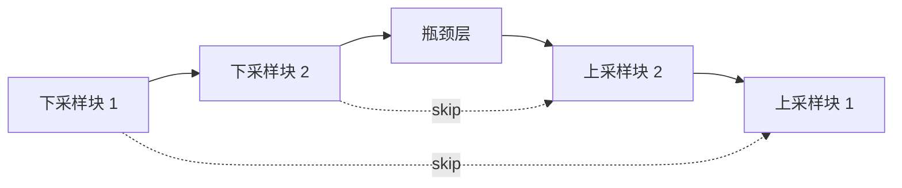
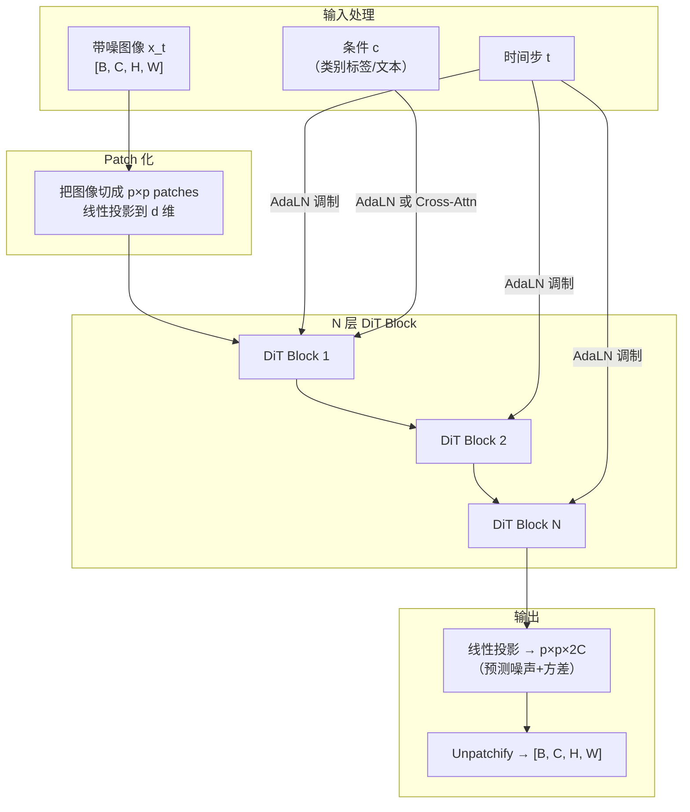
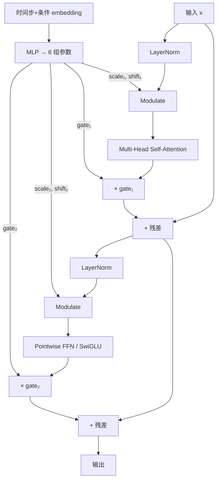
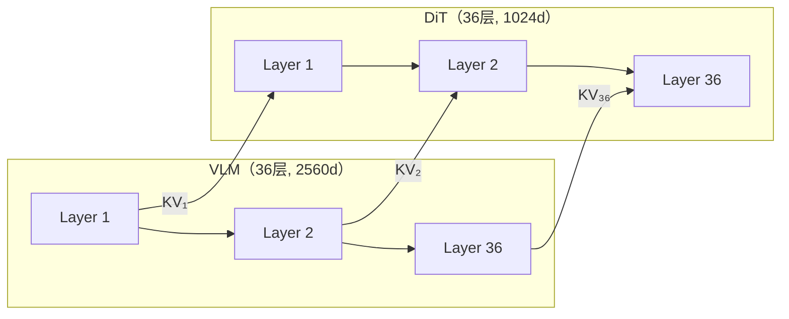

# DiT：Diffusion Transformer 架构

> 传统扩散模型用 U-Net 做噪声预测网络。DiT 证明了 Transformer 可以完全替代 U-Net，且在 scaling 方面表现更好。本文从零讲清 DiT 的设计动机、核心结构和关键创新。

## 相关阅读

- [AdaLayerNorm 条件化归一化](/前置知识/001f_前置知识_AdaLayerNorm条件化归一化) — DiT 核心的条件注入方式
- [Cross-Attention 与交替注意力](/前置知识/001e_前置知识_Cross_Attention与交替注意力机制) — DiT 的外部条件融合
- [KV-Cache 与自回归解码](/前置知识/002m_前置知识_KV_Cache与自回归解码) — DiT 在 VLA 中复用 VLM KV-Cache 的基础
- [Flow Matching 与连续归一化流](/前置知识/000g_前置知识_Flow_Matching与连续归一化流) — DiT 常配合的训练范式
- [分组查询注意力 GQA](/前置知识/002l_前置知识_分组查询注意力GQA) — DiT 中常用的高效注意力

---

## 1. 为什么需要 DiT？从 U-Net 到 Transformer

### 1.1 扩散模型的"骨干网络"是什么

扩散模型（DDPM、Flow Matching 等）的核心任务是：**给定带噪声的数据 $x_t$ 和时间步 $t$，预测去噪方向**（可以是噪声 $\epsilon$、速度场 $v$、或原始数据 $x_0$）。

负责做这个预测的网络就是"骨干网络"。在 2023 年之前，几乎所有扩散模型（Stable Diffusion、DDPM、DALL-E 2）都用 **U-Net** 做骨干。

### 1.2 U-Net 的局限

U-Net 的基本结构是"编码器-瓶颈-解码器"加跳跃连接：



U-Net 在扩散模型中有几个问题：

| 问题 | 具体表现 |
|------|---------|
| Scaling 不清晰 | 加深 U-Net 不像加深 Transformer 那样"稳定提升性能"——更深的 U-Net 容易训练不稳定 |
| 架构碎片化 | ResBlock、注意力层、跳跃连接、时间步嵌入方式……超参组合太多，不同论文实现差异很大 |
| 和 LLM 生态割裂 | NLP 领域的工程优化（Flash Attention、量化、KV-Cache）全部针对 Transformer，U-Net 无法直接受益 |
| 全局交互受限 | U-Net 依赖逐级下采样才能获得全局感受野；Transformer 的自注意力天然全局交互 |

### 1.3 DiT 的核心思路

**Peebles & Xie (2023)** 提出 DiT 的核心观点：

> 把 U-Net 扔掉，用**标准 Transformer**（和 ViT 几乎一样的结构）做扩散模型骨干，然后用 AdaLN 注入时间步条件。

结果：DiT-XL/2（参数量 675M）在 ImageNet 256×256 上达到了当时的 SOTA FID，且参数量越大效果越好（scaling law 明确）。

---

## 2. DiT 的整体架构

### 2.1 一图看懂



### 2.2 和 ViT 的关系

DiT 本质上就是一个 **Vision Transformer (ViT)**，但做了两个关键修改：

| 维度 | ViT | DiT |
|------|-----|-----|
| 输入 | 干净图像 patches | **带噪图像 patches**（$x_t$） |
| 条件注入 | 无（或简单的 [CLS] token） | **AdaLN-Zero**：时间步和类别条件通过 scale/shift/gate 调制每一层 |
| 输出 | 分类 logits | **去噪预测**：每个 patch 位置输出 $p \times p \times 2C$ 维向量 |
| 位置编码 | 可学习或正弦 | 正弦位置编码（频率编码） |

简单说：DiT = ViT + AdaLN-Zero 条件化 + 去噪输出头。

### 2.3 Patchify：把空间数据变成 token 序列

这是 DiT 最基本的一步——把 2D 空间数据"切碎"成 token 序列，让 Transformer 能处理。

对于图像生成（原始 DiT 论文）：
- 输入：$x_t \in \mathbb{R}^{H \times W \times C}$（如 $256 \times 256 \times 4$，在 latent 空间）
- Patch size $p=2$：把图像切成 $\frac{H}{p} \times \frac{W}{p} = 128 \times 128 = 16384$ 个 patch
- 每个 patch 展平后线性投影到 $d$ 维：$\mathbb{R}^{p^2 \cdot C} \to \mathbb{R}^d$

对于**动作生成**（机器人 VLA 中的 DiT 动作头）：
- 输入不是图像，而是带噪声的动作序列 $x_t \in \mathbb{R}^{T_a \times D_a}$（如 30 步 × 60 维）
- 不需要 2D patch 化，直接把每个时间步的动作向量线性投影到 $d$ 维
- 序列长度 = 动作步数（如 30）

---

## 3. DiT Block 内部结构：核心创新

### 3.1 原始 DiT 论文探索了四种条件注入方式

| 方式 | 做法 | 效果 |
|------|------|------|
| In-context conditioning | 把条件 token 直接拼入输入序列 | 简单但效果差 |
| Cross-Attention | 额外加 Cross-Attention 层 | 有效但增加参数 |
| AdaLN | 用条件生成 LN 的 scale/shift | 效果好 |
| **AdaLN-Zero** | AdaLN + 额外的 gate 参数（初始化为 0） | **效果最好 ✓** |

AdaLN-Zero 胜出的原因：gate 参数让网络在训练初期行为接近恒等映射，避免随机初始化的子层扰乱残差流。

### 3.2 AdaLN-Zero DiT Block 的完整结构

一个 AdaLN-Zero DiT Block 的数据流：



用伪代码表示：

```python
# 从条件 embedding 生成 6 组调制参数
shift1, scale1, gate1, shift2, scale2, gate2 = adaLN_MLP(condition_embed).chunk(6)

# Attention 子层
residual = x
x = layernorm(x) * (1 + scale1) + shift1   # AdaLN 调制
x = self_attention(x)
x = residual + gate1 * x                     # Gate 加权残差

# FFN 子层
residual = x
x = layernorm(x) * (1 + scale2) + shift2   # AdaLN 调制
x = feedforward(x)
x = residual + gate2 * x                     # Gate 加权残差
```

### 3.3 6 组调制参数的物理意义

$$
[\gamma_1, \beta_1, \alpha_1, \gamma_2, \beta_2, \alpha_2] = \text{MLP}(\text{condition\_embed})
$$

**这个公式在做什么**：把条件信息（时间步 $t$ + 可能的类别/文本条件）投影成 6 个向量，分别控制 Attention 和 FFN 两个子层的"输入分布"和"输出强度"。

::: details 📐 逐符号拆解 + 数值代入（点击展开）
**逐符号拆解**：

| 符号 | 对应代码名 | 作用 | 物理直觉 |
|------|-----------|------|---------|
| $\gamma_1$ | `scale_attn` | Attention 输入的缩放 | 控制 Attention 看到的特征"对比度" |
| $\beta_1$ | `shift_attn` | Attention 输入的偏移 | 把特征整体往某个方向挪 |
| $\alpha_1$ | `gate_attn` | Attention 输出的门控 | 这一层 Attention 结果对残差流贡献多少 |
| $\gamma_2$ | `scale_mlp` | FFN 输入的缩放 | 控制 FFN 看到的特征"对比度" |
| $\beta_2$ | `shift_mlp` | FFN 输入的偏移 | 把特征整体往某个方向挪 |
| $\alpha_2$ | `gate_mlp` | FFN 输出的门控 | 这一层 FFN 结果对残差流贡献多少 |

**数值代入**（$d=4$，某一层在 $t=0.1$ 时）：

假设条件 MLP 输出：$\gamma_1=[0.3, 0.3, 0.3, 0.3]$, $\beta_1=[0.1, 0, -0.1, 0]$, $\alpha_1=[0.8, 0.8, 0.8, 0.8]$

- LayerNorm 输出 $h = [1.0, -0.5, 0.2, 0.8]$
- Modulate: $h' = h \times (1+0.3) + [0.1, 0, -0.1, 0] = [1.4, -0.65, 0.16, 1.04]$
- Attention 输出 $a = [0.5, 0.3, -0.1, 0.2]$
- Gate: $\alpha_1 \times a = 0.8 \times [0.5, 0.3, -0.1, 0.2] = [0.4, 0.24, -0.08, 0.16]$
- 残差: 原始输入 + $[0.4, 0.24, -0.08, 0.16]$

关键：如果 $\alpha_1 \approx 0$（训练初期），则 Attention 子层的输出几乎不影响残差流→网络行为近似恒等映射→训练稳定。

**为什么是这个形式**：gate 参数（$\alpha$）是 DiT 区别于普通 AdaLN 的关键创新。没有 gate 时，随机初始化的 Attention/FFN 输出会直接加到残差流上，可能导致训练初期数值爆炸。有 gate 后，网络可以"自己决定"何时以及多大程度上让各子层起作用。
:::

---

## 4. DiT 的 Scaling 行为

### 4.1 模型尺寸配置

原始 DiT 论文定义了四种规模：

| 配置 | 层数 | hidden_size | 注意力头数 | 参数量 |
|------|------|-------------|-----------|--------|
| DiT-S | 12 | 384 | 6 | 33M |
| DiT-B | 12 | 768 | 12 | 130M |
| DiT-L | 24 | 1024 | 16 | 458M |
| DiT-XL | 28 | 1152 | 16 | 675M |

### 4.2 Scaling Law

DiT 论文的核心实验结论：

1. **更大的模型 = 更低的 FID**：DiT-XL/2 的 FID = 2.27（当时 ImageNet 256×256 SOTA）
2. **Patch size 越小 = 效果越好**：/2 (patch=2) > /4 (patch=4) > /8 (patch=8)
3. **计算量是关键**：给定固定算力预算，增大模型比增加训练步数更有效

这和 LLM 领域的 Scaling Law 结论一致——Transformer 架构天然适合 scale up，这也是 DiT 被广泛采用的核心原因。

---

## 5. DiT 在机器人动作生成中的变体

### 5.1 从图像生成到动作生成的改造

在 VLA（Vision-Language-Action）模型中，DiT 不再用于生成图像，而是用于**生成动作序列**。核心区别：

| 维度 | 图像生成 DiT | 动作生成 DiT |
|------|-------------|-------------|
| 输入 | 带噪 latent patches $[B, N_p, d]$ | 带噪动作序列 $[B, T_a, d]$ |
| 条件 | 时间步 $t$ + 类别标签/文本 | 时间步 $t$ + **VLM 的视觉-语言特征** |
| 条件注入 | AdaLN-Zero（时间步）+ 可选 Cross-Attn（文本） | AdaLN-Zero（时间步）+ **KV-Cache 拼接**（VLM 特征） |
| 输出 | 去噪后的 latent patches | 去噪后的**动作向量** |
| Patch 化 | 2D patches → flatten | **不需要**——动作序列本身就是 1D 序列 |
| 位置编码 | 2D 正弦/可学习 | 1D RoPE |

### 5.2 动作 DiT 的典型输入序列

在 XR-0/XR-1 等 VLA 模型中，DiT 的输入序列通常是：

```
[Sink Token] [State Token] [Action Token 0] [Action Token 1] ... [Action Token T-1]
```

- **Sink Token**：可学习的全局汇聚 token，类似 BERT 的 [CLS]
- **State Token**：当前机器人本体感觉（关节角、末端位姿等），经 MLP 投影
- **Action Tokens**：带噪声的动作序列 $x_t$，每步的动作向量经 MLP 投影

### 5.3 VLM 条件的注入方式：KV-Cache 拼接

动作 DiT 从 VLM 获取条件信息的方式非常巧妙——不是额外加一个 Cross-Attention 模块，而是**把 VLM 的 KV-Cache 直接拼接到 DiT 自己的 Key/Value 前面**：

```python
# DiT 自己的 QKV
q, k, v = dit_qkv_proj(hidden_states)

# 拼接 VLM 的 KV-Cache
k = cat([vlm_key_cache, k], dim=seq_len)
v = cat([vlm_value_cache, v], dim=seq_len)

# 一次 Attention 同时完成自注意力 + 跨模块注意力
output = attention(q, k, v)
```

这个设计的好处：
- **一次计算完成两种注意力**：DiT token 同时 attend to VLM 信息和 DiT 内部信息
- **复用 VLM 已有的 KV-Cache**：不需要额外计算 VLM 条件的 Key/Value 投影
- **逐层对齐**：DiT 的第 $i$ 层复用 VLM 的第 $i$ 层 KV-Cache，获得不同抽象层级的语义信息

### 5.4 Mixture-of-Transformers (MoT) 结构

当 DiT 和 VLM 的层数**完全相同**（如 XR-1 中两者都是 36 层），且逐层 1:1 共享 KV-Cache 时，整个架构可以看作一个 **Mixture-of-Transformers**：



两个 Transformer 并行运行（VLM 先跑完产出 KV-Cache，DiT 再跑），通过 KV-Cache 实现层级化的信息传递。VLM 用更大的 hidden_size（如 2560d）处理语言+视觉，DiT 用更小的 hidden_size（如 1024d）专注于动作生成——各自的参数量匹配各自任务的复杂度。

---

## 6. DiT vs U-Net：总结对比

| 维度 | U-Net | DiT |
|------|-------|-----|
| 骨干 | CNN + 下采样/上采样 + 跳跃连接 | **纯 Transformer** |
| 全局交互 | 依赖下采样才能获得全局感受野 | **自注意力天然全局** |
| 条件注入 | ResBlock 内 AdaIN / Cross-Attn 层 | **AdaLN-Zero 每层调制** |
| Scaling 行为 | 不明确，加深容易不稳定 | **清晰的 Scaling Law** |
| 工程生态 | 独立实现 | **复用 LLM 优化**（Flash Attn, KV-Cache, 量化） |
| 参数效率 | 跳跃连接带来冗余 | 更紧凑（无冗余路径） |
| 适用场景 | 传统扩散模型（SD 1.x/2.x） | **新一代模型**（SD3, Flux, Sora, VLA 动作头） |

当前趋势：几乎所有 2024 年之后的扩散模型都转向 DiT 架构（或其变体如 MMDiT）。

---

## 7. 代表性应用

| 模型 | 年份 | DiT 配置 | 应用场景 |
|------|------|---------|---------|
| DiT (原始) | 2023 | 28层/1152d | ImageNet 图像生成 |
| Stable Diffusion 3 | 2024 | MMDiT, 双流 | 文生图 |
| Flux | 2024 | MMDiT 变体 | 文生图 |
| Sora | 2024 | 时空 DiT | 文生视频 |
| GR00T N1.7 | 2025 | 16层/1536d | 机器人动作生成 |
| XR-0 | 2025 | 16层/1024d | 机器人动作生成 |
| **XR-1** | 2026 | **36层/1024d** | 机器人动作生成 |
| OpenPI (π₀) | 2025 | Flow-DiT | 机器人动作生成 |

---

## 8. 总结

| 要点 | 内容 |
|------|------|
| **是什么** | 用标准 Transformer 替代 U-Net 做扩散模型的去噪骨干网络 |
| **核心创新** | AdaLN-Zero 条件注入——时间步通过 scale/shift/gate 调制每一层 |
| **为什么重要** | Scaling Law 明确 + 复用 LLM 工程优化 + 全局自注意力 |
| **在 VLA 中的角色** | 作为"动作头"——接收 VLM 的语义条件（通过 KV-Cache），生成去噪后的动作序列 |
| **和 ViT 的关系** | DiT ≈ ViT + AdaLN-Zero + 去噪输出头 |
| **后续阅读** | [XR-1 DiT 动作头详解](/系列/xr1_deep_dive/04_DiT动作头_整体架构与信号流) — 具体看 36 层 DiT 在 VLA 中怎么用 |

DiT 是理解所有现代 VLA 模型的动作生成模块的基础——不论是 GR00T、XR-0/XR-1 还是 OpenPI，它们的动作头本质上都是 DiT 的变体。理解了 DiT 的 AdaLN-Zero + Transformer 结构，就理解了这些模型"怎么把条件信息变成动作"的核心机制。
