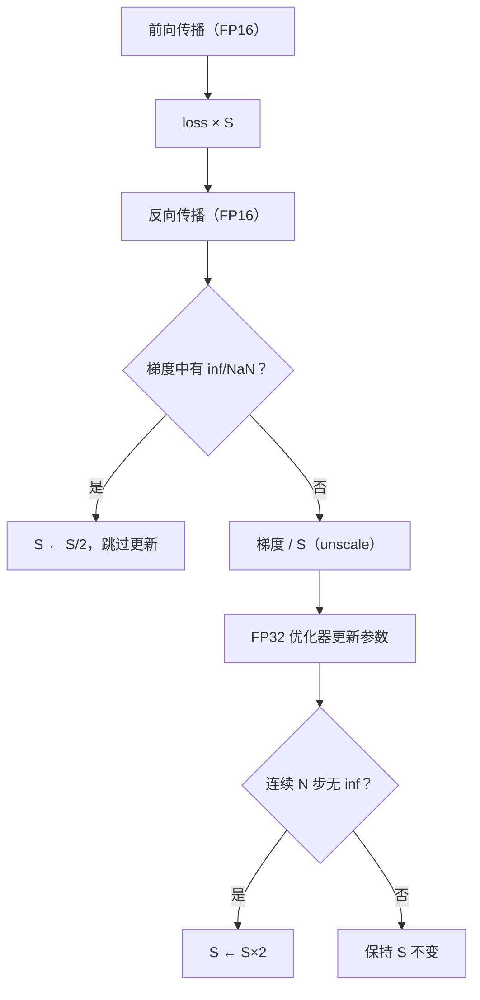

# 混合精度训练：AMP 与 Loss Scaling

> 上一篇我们知道了 BF16 因为动态范围大，可以直接替代 FP32 训练。但如果你的 GPU 不支持 BF16（如 V100），或者项目里还在用 FP16，那就必须面对一个棘手问题：FP16 的最小正规数是 $6.1 \times 10^{-5}$，大量梯度都小于这个值——直接用 FP16 训练必然崩溃。**混合精度训练（Mixed Precision Training）+ Loss Scaling** 就是为了解决这个问题而发明的。

## 相关阅读

- 前置：[数值精度：FP32、FP16、BF16、TF32](/前置知识/003d_前置知识_数值精度FP32_FP16_BF16_TF32) — 四种精度格式的区别
- 关联：[Flash Attention](/前置知识/003f_前置知识_Flash_Attention) — Attention 中的精度优化
- 关联：[FSDP：全分片数据并行](/前置知识/001i_前置知识_FSDP全分片数据并行) — 分布式下的混合精度配置

---

## 贯穿全文的例子

> 一个 3 层 MLP 做回归任务。第三层（最后一层）的梯度正常（$\sim 10^{-3}$），但第一层（最底层）的梯度因为链式法则的连乘效应，衰减到 $\sim 10^{-7}$。我们要让 FP16 也能正确处理这么小的梯度。

---

## 一、混合精度训练的核心思想

"混合精度"的"混合"指的是：**不同的操作用不同的精度**，取各自的优势。

| 操作类型 | 使用精度 | 原因 |
|----------|---------|------|
| 矩阵乘法（matmul） | FP16/BF16 | Tensor Core 加速，占计算量的 90%+ |
| 卷积（conv） | FP16/BF16 | 同上 |
| LayerNorm / BatchNorm | FP32 | 归一化需要精确的均值/方差计算 |
| Softmax | FP32 | 指数运算对精度敏感，FP16 容易溢出 |
| Loss 计算 | FP32 | 避免 loss 值溢出 |
| 权重更新（optimizer step） | FP32 | 小的更新量在 FP16 下会被舍入为 0 |

**直觉**：前向/反向传播中"大量乘加"的部分用低精度来加速，"数值敏感"的部分保持 FP32 来保稳定。

---

## 二、为什么 FP16 需要 Loss Scaling

### 问题：梯度下溢

FP16 能表示的最小正规数是 $2^{-14} \approx 6.1 \times 10^{-5}$。但实际训练中，深层网络的梯度分布长这样：

```
梯度值的对数分布（示意）：
               大量梯度在这个区域
                   ↓
  ─────────┬──────████████████████──────┬─────
     -24   -14   -8    -4    0    4     16
     ↑                                   
  FP16最小可表示值                        
  (-14 对应 6.1e-5)
```

指数小于 $-14$ 的梯度（即值 $< 6.1 \times 10^{-5}$）在 FP16 下直接变为 0。NVIDIA 的实验表明，一个典型网络中约 **67% 的梯度值** 落在 FP16 的可表示范围之外。

### 解决方案：把梯度"放大"到 FP16 能表示的范围内

如果我们在反向传播之前，先把 loss 乘以一个很大的常数 $S$（如 $S = 1024$），那么：
- 反向传播计算出的每个梯度都会自动乘以 $S$（链式法则的线性性质）
- 原来是 $10^{-7}$ 的梯度变成 $10^{-7} \times 1024 = 1.024 \times 10^{-4}$，落入 FP16 可表示范围了！
- 优化器更新之前再除以 $S$，恢复真实梯度值

这就是 **Loss Scaling**。

---

## 三、Loss Scaling 的数学原理

$$
\begin{aligned}
\tilde{L} &= S \cdot L(\theta) \\
\nabla_\theta \tilde{L} &= S \cdot \nabla_\theta L(\theta) \\
\theta &\leftarrow \theta - \eta \cdot \frac{1}{S} \nabla_\theta \tilde{L} = \theta - \eta \cdot \nabla_\theta L(\theta)
\end{aligned}
$$

**这个公式在做什么**：先把 loss 放大 $S$ 倍来保护小梯度不被 FP16 下溢，反向传播完成后再缩回来，最终的参数更新和不做 scaling 完全等价。

::: details 📐 逐符号拆解 + 数值代入（点击展开）
**逐符号拆解**：

| 符号 | 含义 | 具体是什么 |
|------|------|-----------|
| $L(\theta)$ | 原始 loss | 模型输出和标签之间的误差 |
| $S$ | scaling factor | 一个大常数，典型值 $2^{10}$ 到 $2^{24}$ |
| $\tilde{L}$ | 放大后的 loss | 用于反向传播，让梯度值整体右移 $\log_2 S$ 位 |
| $\nabla_\theta \tilde{L}$ | 放大后的梯度 | 所有梯度都乘了 $S$，FP16 不再下溢 |
| $\eta$ | 学习率 | 如 $10^{-4}$ |
| $\frac{1}{S}$ | unscale 步骤 | 在 FP32 的 optimizer 中除以 $S$，恢复真实梯度 |

**数值代入**：
- 真实梯度 $g = 3.2 \times 10^{-7}$（FP16 下会变 0）
- 设 $S = 2^{16} = 65536$
- 放大后梯度 $\tilde{g} = 3.2 \times 10^{-7} \times 65536 = 0.021$ → FP16 能精确表示
- 优化器中 unscale：$g_{\text{true}} = 0.021 / 65536 = 3.2 \times 10^{-7}$ → 完全恢复
- 参数更新：$\Delta\theta = -10^{-4} \times 3.2 \times 10^{-7} = -3.2 \times 10^{-11}$

**为什么是这个形式**：利用链式法则的线性性——loss 乘以常数 $S$，所有梯度就自动乘以 $S$。这让我们只需要修改 loss 值这一个点，就能保护所有层的梯度。
:::

---

## 四、动态 Loss Scaling：自动找最优 $S$

固定 $S$ 有问题：$S$ 太小，小梯度仍然下溢；$S$ 太大，大梯度溢出为 `inf`/`NaN`。

**动态 Loss Scaling** 的策略很简单：

1. 从一个很大的 $S$ 开始（如 $2^{16}$）
2. 每 N 步（如 2000 步）没出现 `inf`/`NaN` → $S$ 翻倍（还有余量，继续放大）
3. 一旦出现 `inf`/`NaN` → $S$ 减半，**跳过这一步的参数更新**



---

## 五、PyTorch AMP 完整代码

AMP = Automatic Mixed Precision，是 PyTorch 对混合精度训练的官方封装。核心只有两个组件：`autocast`（自动选精度）和 `GradScaler`（动态 loss scaling）。

下面这段代码展示了一个完整的混合精度训练循环。核心思路是：用 `autocast` 包裹前向传播，让 PyTorch 自动为每个操作选择最优精度；用 `GradScaler` 管理 loss scaling 的放大/缩小/跳过逻辑。

```python
import torch
from torch.cuda.amp import autocast, GradScaler

model = MyModel().cuda()
optimizer = torch.optim.AdamW(model.parameters(), lr=1e-4)
scaler = GradScaler()  # 动态 loss scaling 管理器

for batch in dataloader:
    optimizer.zero_grad()
    
    # Step 1: autocast 包裹前向传播
    # PyTorch 自动决定每个 op 用 FP16 还是 FP32
    with autocast(dtype=torch.float16):
        output = model(batch['input'].cuda())
        loss = criterion(output, batch['target'].cuda())
    
    # Step 2: scaler 放大 loss，然后反向传播
    # 内部做的是 (loss * S).backward()
    scaler.scale(loss).backward()
    
    # Step 3: unscale 梯度 + 检查 inf/NaN + 优化器更新
    # 如果有 inf/NaN，自动跳过这步更新并减小 S
    scaler.step(optimizer)
    
    # Step 4: 更新 scaling factor
    scaler.update()
```

每一行的作用：
- `autocast`：让 matmul/conv 用 FP16 加速，softmax/layernorm/loss 保持 FP32
- `scaler.scale(loss)`：`loss *= S`，然后调用 `.backward()`
- `scaler.step(optimizer)`：先 `grads /= S`（unscale），再检查有无 `inf`/`NaN`，没问题就正常 `optimizer.step()`
- `scaler.update()`：根据是否出现 `inf`/`NaN`，调整 $S$ 的值

---

## 六、BF16 下还需要 GradScaler 吗？

**不需要。** 这是 BF16 相比 FP16 的最大工程优势。

| | FP16 | BF16 |
|---|---|---|
| 需要 GradScaler？ | ✅ 必须 | ❌ 不需要 |
| 需要 autocast？ | ✅ 推荐 | ✅ 推荐（但可以直接转模型） |
| 梯度会下溢？ | 高概率 | 几乎不会 |
| 代码复杂度 | 较高（要处理 scale/unscale/skip） | 低（正常训练循环） |

BF16 训练循环可以简化为：

```python
model = MyModel().cuda().to(torch.bfloat16)
optimizer = torch.optim.AdamW(model.parameters(), lr=1e-4)

for batch in dataloader:
    optimizer.zero_grad()
    with autocast(dtype=torch.bfloat16):
        output = model(batch['input'].cuda())
        loss = criterion(output, batch['target'].cuda())
    loss.backward()         # 不需要 scaler
    optimizer.step()        # 不需要 scaler
```

这就是为什么现代训练框架（Hugging Face Trainer、DeepSpeed、FSDP）在 A100+ GPU 上**默认推荐 BF16 而不是 FP16**：代码更简单，训练更稳定，几乎没有调 loss scaling 的心智负担。

---

## 七、autocast 的精度选择规则

`autocast` 怎么决定哪些 op 用低精度、哪些保持 FP32？PyTorch 内部维护了三个列表：

| 列表 | 行为 | 包含的操作 |
|------|------|-----------|
| **白名单**（FP16/BF16） | 强制用低精度 | `matmul`, `conv1d/2d/3d`, `linear`, `bmm`, `baddbmm` |
| **黑名单**（FP32） | 强制用高精度 | `softmax`, `log_softmax`, `layer_norm`, `group_norm`, `cross_entropy`, `binary_cross_entropy` |
| **灰名单**（跟随输入） | 输入是什么精度就用什么 | `relu`, `dropout`, `add`, `mul`, `cat` |

**为什么 softmax 必须用 FP32**：softmax 涉及 $e^{x_i}$ 运算。如果 $x_i$ 之间差距较大（如最大值 10，最小值 -5），$e^{10} = 22026$ 在 FP16 下接近溢出上限（65504），$e^{-5} = 0.0067$ 也会因为精度不足产生明显误差。FP32 下这些值都能精确表示。

---

## 八、混合精度训练中 Master Weights 的必要性

即使用 BF16 训练，也建议优化器保存 FP32 的"master weights"。原因已在 [上一篇](/前置知识/003d_前置知识_数值精度FP32_FP16_BF16_TF32#八精度对训练稳定性的影响) 提到：

$$
\Delta w = \eta \cdot g
$$

**这个公式在做什么**：计算一次参数更新的增量。如果这个增量太小，BF16 精度下它会被舍入为零。

::: details 📐 逐符号拆解 + 数值代入（点击展开）
**逐符号拆解**：

| 符号 | 含义 | 具体是什么 |
|------|------|-----------|
| $\Delta w$ | 参数的更新量 | 本步要加到权重上的值 |
| $\eta$ | 学习率 | 如 $10^{-4}$ |
| $g$ | 梯度 | 本步计算出的梯度值，如 $10^{-3}$ |

**数值代入**：
- $\eta = 10^{-4}$，$g = 10^{-3}$
- $\Delta w = 10^{-4} \times 10^{-3} = 10^{-7}$
- 当前权重值 $w = 0.5$
- BF16 下 $w = 0.5$ 附近的最小可区分间距 = $0.5 \times 2^{-7} = 0.0039$
- $10^{-7} \ll 0.0039$ → 更新被舍入为 0，参数不动！
- FP32 下 $w = 0.5$ 附近的最小可区分间距 = $0.5 \times 2^{-23} = 5.96 \times 10^{-8}$
- $10^{-7} > 5.96 \times 10^{-8}$ → 更新有效

**为什么是这个形式**：这不是一个"设计"出来的公式，而是浮点运算的固有限制——当更新量小于当前值的相对精度时，加法结果等于原值。
:::

---

## 九、常见陷阱与调试技巧

### 1. Loss 出现 NaN

```python
# 诊断方法：打印 scaler 的当前 scale 值
print(f"Scale: {scaler.get_scale()}")
# 如果 scale 一路暴跌（从 65536 跌到 1），说明模型本身有数值问题
```

**常见原因**：
- 学习率太大 → 降低 lr
- 模型中有除法操作，分母接近 0 → 加 eps
- Embedding 层的值太大 → 加 LayerNorm

### 2. 训练能跑但 loss 不降

**可能原因**：scaler 持续跳过更新步。检查：

```python
# 监控实际更新比例
scaler.step(optimizer)  # 这一步可能被跳过
# 看 scaler._growth_tracker 是否一直为 0
```

### 3. 模型精度不一致报错

```python
# RuntimeError: expected scalar type BFloat16 but found Float
# 原因：某个输入没有转换精度
# 解决：确保所有输入都在 autocast 范围内，或手动 .to(dtype)
```

---

## 十、总结

| 概念 | 核心要点 |
|------|---------|
| 混合精度 | 不同操作用不同精度，取速度与稳定性的最优组合 |
| Loss Scaling | 放大 loss 让小梯度不被 FP16 下溢，更新前再缩回来 |
| 动态 scaling | 自动调节 scale factor：没 inf 就翻倍，有 inf 就减半跳过 |
| GradScaler | PyTorch 的动态 scaling 实现 |
| autocast | 自动为每个 op 选择最优精度（白名单/黑名单/灰名单） |
| BF16 优势 | 不需要 loss scaling，代码更简单，训练更稳定 |

**一句话总结**：混合精度训练的本质是"把计算密集型操作降精度来加速，把数值敏感型操作保持高精度来保稳定"，Loss Scaling 是 FP16 时代的补丁，BF16 时代已不再需要。

---

## 延伸阅读

- [数值精度：FP32、FP16、BF16、TF32](/前置知识/003d_前置知识_数值精度FP32_FP16_BF16_TF32) — 每种格式的 bit 布局和动态范围
- [Flash Attention](/前置知识/003f_前置知识_Flash_Attention) — Attention 的显存与速度优化
- [FSDP：全分片数据并行](/前置知识/001i_前置知识_FSDP全分片数据并行) — 分布式训练中混合精度的配置方式
