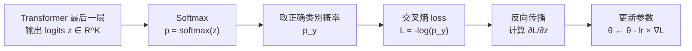

# 交叉熵损失与 Softmax：从 logits 到概率到梯度

> **一句话总结**：Softmax 把模型输出的原始分数（logits）变成概率分布，交叉熵 loss 衡量"模型给正确答案的概率有多低"——概率越低，惩罚越大。
>
> **为什么要学这个**：LLM 的 next-token prediction、自回归 VLA 的动作 token 预测、图像分类——所有"从 N 个选项中选一个"的任务，训练时用的都是 softmax + cross-entropy。理解这个组合是理解所有自回归模型的基础。

---

## 相关阅读

- [动作 Token 化与自回归策略](/前置知识/000l_前置知识_动作Token化与自回归策略) — 交叉熵在 VLA 中的应用
- [最大似然估计](/前置知识/002f_前置知识_最大似然估计) — 交叉熵 loss 的理论根基
- [概率密度函数与高斯分布](/前置知识/002b_前置知识_概率密度函数与高斯分布) — 连续分布 vs 离散分布的对比

---

## 贯穿全文的例子

> **场景**：一个自回归 VLA（如 OpenVLA）正在预测下一个动作 token。
> 当前动作维度是 $\Delta x$（末端执行器的 x 方向位移），被离散为 **5 个 bin**（为了简化讲解，实际用 256 个）：
>
> | bin 编号 | 代表的位移范围 | 中心值 |
> |---------|--------------|--------|
> | 0 | [-5cm, -3cm) | -4cm |
> | 1 | [-3cm, -1cm) | -2cm |
> | 2 | [-1cm, +1cm) | 0cm |
> | 3 | [+1cm, +3cm) | +2cm |
> | 4 | [+3cm, +5cm) | +4cm |
>
> 真实答案（ground truth）：机械臂应该向右移动 +2.3cm → 落在 **bin 3**。
>
> 模型需要输出一个 5 维概率分布，让 bin 3 的概率尽量高。

---

## 1. Softmax：把原始分数变成概率

### 1.1 模型输出的原始值：logits

Transformer 最后一层输出的是一个**原始分数向量**（叫 logits），维度等于选项数（词表大小 / bin 数）。

在我们的例子中，模型对 5 个 bin 输出的 logits 可能是：

```
logits = [1.2, 0.5, -0.3, 2.8, 0.1]
```

这些数字可以是任意实数——正的、负的、大的、小的。它们**还不是概率**（概率必须非负且加起来等于 1）。

### 1.2 Softmax 函数

Softmax 把 logits 转换为合法概率分布：

$$
p_i = \text{softmax}(z)_i = \frac{e^{z_i}}{\sum_{j=1}^{K} e^{z_j}}
$$

**这个公式在做什么**：把模型输出的原始分数转成合法概率——非负、加起来等于 1，分数越大占的概率越多。

::: details 📐 公式详解（点击展开）

| 子表达式 | 它是谁 | 它在干嘛 |
|---------|--------|---------|
| $z_i$ | **第 $i$ 个选项的原始得分**（logit） | 模型最后一层直接输出的实数，可正可负，如 2.8。此时还不是概率 |
| $e^{z_i}$ | **转正器** | 把任意实数映射成正数，且 $z$ 越大 $e^z$ 越大——保留了大小关系，同时消灾了负数问题 |
| $\sum_{j=1}^K e^{z_j}$ | **总蛋糕大小** | 把所有选项的"转正后得分"加起来，作为分母 |
| $\dfrac{e^{z_i}}{\sum_j e^{z_j}}$ | **切蛋糕** | 用第 $i$ 个选项转正后的得分，除以蛋糕总大小，得到它占的那一块——这一块就是概率 $p_i$ |
| $K$ | **选项总数** | 如 256（bin 数）或 32000（词表大小），决定切成几块 |

**用人话读**："每个选项先把得分转成正数，再看它占所有选项正数得分总和的比例——这个比例就是它的概率。"

**为什么用指数而不是直接归一化**：如果 logits 有负数，直接除以总和会得到负的"概率"，不合法。指数函数保证所有值非负；同时它会放大差异——得分差 1，概率比大约是 $e \approx 2.7$ 倍，让模型的置信度差异体现得更明显。
:::

### 1.3 Softmax 的两个关键性质

1. **输出是合法概率分布**：所有 $p_i \geq 0$，且 $\sum_i p_i = 1$
2. **保持相对顺序**：logit 最大的选项，概率也最大。Softmax 不会改变排名。
3. **温度可调**：$p_i = e^{z_i / T} / \sum_j e^{z_j / T}$。$T \to 0$ 时变成 argmax（只有最大的有概率）；$T \to \infty$ 时变成均匀分布。

---

## 2. 交叉熵损失：惩罚"给正确答案的概率太低"

### 2.1 直觉

训练目标很简单：**让模型给正确答案分配尽可能高的概率**。

如果正确答案是 bin 3，我们希望 $p_3 \to 1$（所有概率都集中在正确 bin 上）。

交叉熵 loss 就是量化"离这个目标有多远"的指标。

### 2.2 公式

$$
\mathcal{L}_{\text{CE}} = -\log p_{y}
$$

**这个公式在做什么**：只看模型给"正确答案"打出的概率，这个概率越低，惩罚（loss）就越重。

::: details 📐 公式详解（点击展开）

| 子表达式 | 它是谁 | 它在干嘛 |
|---------|--------|---------|
| $y$ | **标准答案的编号** | ground truth bin index，如 3 |
| $p_y$ | **模型给标准答案打的分** | softmax 输出中对应 $y$ 那个位置的概率值，如 0.707 |
| $-\log(\cdot)$ | **惩罚放大器** | 把概率转成惩罚值：概率接近 1 → 惩罚接近 0（几乎不罚）；概率接近 0 → 惩罚趋向无穷大（重罚） |
| $\mathcal{L}_{\text{CE}}$ | **这道题的扣分** | 单个样本的 loss 值 |

**用人话读**："只关心模型对'正确答案'这一个选项给出的置信度，置信度越低扣分越重，置信度接近满分时几乎不扣分。"

**为什么是负对数而不是简单的 $1-p_y$**：$-\log$ 的惩罚曲线不是线性的——概率已经很高时（比如从 0.9 到 0.95）几乎不再惩罚，因为已经答得很好；但概率很低时（比如从 0.05 到 0.01）惩罚会急剧增大，逼着模型赶紧纠正明显的错误。这种"该松则松、该狠则狠"的形状恰好对应最大似然估计的数学原理——不是随便选的形式。
:::

### 2.3 展开形式：和 one-hot 标签的内积

交叉熵 loss 的另一种等价写法：

$$
\mathcal{L}_{\text{CE}} = -\sum_{i=1}^{K} q_i \log p_i
$$

**这个公式在做什么**：这是交叉熵的通用写法——衡量"真实分布"和"预测分布"之间差多远，one-hot 标签只是它的一个特例。

::: details 📐 公式详解（点击展开）

| 子表达式 | 它是谁 | 它在干嘛 |
|---------|--------|---------|
| $q_i$ | **真实世界的答案卷**——真实分布 | 分类任务里是 one-hot：正确答案那格是 1，其余全是 0 |
| $p_i$ | **模型的答案卷**——预测分布 | softmax 输出的第 $i$ 类概率 |
| $q_i \log p_i$ | **单个选项的核对** | 只有真实分布里 $q_i\neq0$ 的那个选项才会产生非零贡献——其余选项因为 $q_i=0$ 直接被"清零"不计分 |
| $-\sum_{i=1}^K(\cdot)$ | **总差距** | 把所有选项的核对结果加起来再取负，得到两份答案卷的差距 |

**用人话读**："真实答案卷和模型答案卷逐项核对，因为真实答案卷除了正确选项全是 0，核对下来只有正确选项那一项有意义——所以结果自动退化成'只看模型给正确答案打了多少分'，和上一个公式完全一致。"

**为什么叫"交叉熵"**：这是信息论里的标准概念，衡量"用模型的预测分布去编码真实分布的样本"平均需要多少信息量。两个分布越接近，需要的信息量越少，loss 也越低。
:::

---

## 3. 完整流程：从模型输出到梯度更新

把 Softmax 和交叉熵 loss 串起来，完整看一次正向和反向传播：



### 3.1 梯度的简洁形式

Softmax + 交叉熵的组合有一个非常干净的梯度公式：

$$
\frac{\partial \mathcal{L}}{\partial z_i} = p_i - \mathbb{1}[i = y]
$$

**这个公式在做什么**：告诉每个 logit 该往哪个方向调——错误选项一律被压低，正确选项被推高，力度由当前的预测概率决定。

::: details 📐 公式详解（点击展开）

| 子表达式 | 它是谁 | 它在干嘛 |
|---------|--------|---------|
| $\dfrac{\partial \mathcal{L}}{\partial z_i}$ | **第 $i$ 个 logit 收到的调整指令** | 正值表示"该往下压"，负值表示"该往上推"，数值大小表示力度 |
| $p_i$ | **模型当前对第 $i$ 类的信心** | softmax 输出，力度的主要来源 |
| $\mathbb{1}[i=y]$ | **"你是不是正确答案"的开关** | 是正确答案时开关打开（=1），否则关闭（=0） |
| $p_i - \mathbb{1}[i=y]$ | **净调整力** | 是正确答案时：信心 - 1（永远是负值，往上推）；不是正确答案时：信心 - 0（永远是正值，往下压） |

**用人话读**："对正确答案，调整力 = 当前信心减 1，永远是负的，会把它的 logit 往上推；对其他所有选项，调整力就是当前信心本身，越自信选错的选项被压得越狠。"

**为什么这个梯度形式这么简洁**：这是 softmax 和交叉熵组合后数学上自然抵消得到的结果——两者搭配使用，梯度计算既简单又高效，这正是这个组合成为深度学习分类任务标准配置的原因。
:::

---


## 4. 在自回归 VLA 中的具体应用

### 4.1 一条轨迹的总 loss

一条机器人操作轨迹有 $T$ 个时间步，每步有 $D=7$ 维动作，每维独立做 256 分类。总 loss：

$$
\mathcal{L}_{\text{total}} = -\frac{1}{T \cdot D} \sum_{t=1}^{T} \sum_{d=1}^{D} \log p_\theta(k_t^d \mid o_t, l, k_t^{1:d-1})
$$

**这个公式在做什么**：把一条轨迹拆成一大堆选择题（每步每维都是一题），求每道题的交叉熵 loss，再取平均作为整条轨迹的训练目标。

::: details 📐 公式详解（点击展开）

| 子表达式 | 它是谁 | 它在干嘛 |
|---------|--------|---------|
| $o_t, l$ | **这道题的考题材料** | 第 $t$ 步的图像观测和语言指令，作为预测的条件输入 |
| $k_t^{1:d-1}$ | **本步已经写下的答案** | 当前时间步中前 $d-1$ 维已生成的动作 token，体现维度间的自回归依赖 |
| $k_t^d$ | **这道题的标准答案** | 第 $t$ 步第 $d$ 维动作的 ground truth bin，如 159 |
| $p_\theta(k_t^d\mid o_t,l,k_t^{1:d-1})$ | **模型给标准答案打的分** | 模型看着考题材料和已写答案，输出的概率分布中落在标准答案上的那个值 |
| $\log(\cdot)$ | **打分转换器** | 概率越高，转换后的值越接近 0（几乎不罚） |
| $\sum_{t=1}^T\sum_{d=1}^D(\cdot)$ | **把所有题目的分加起来** | 一条轨迹里，每一步每一维都是一道题，全部题目算总账 |
| $\dfrac{1}{T\cdot D}$ | **平均分而不是总分** | 除以题目总数，让 loss 大小不随轨迹长度变化，方便不同长度的轨迹互相比较 |

**用人话读**："一条轨迹的每一步、每一维动作都是一道选择题，把所有题目的交叉熵 loss 加起来除以题目总数，就是这条轨迹的训练目标。"

**为什么是这个形式**：这就是标准自回归语言模型的训练目标——最大化序列中每个 token 的条件对数似然。ChatGPT 训练用的 loss 和这里一模一样，只是"token"从文字换成了动作 bin。
:::

### 4.2 自回归条件依赖 $k_t^{1:d-1}$ 的含义

公式中 $p_\theta(k_t^d \mid o_t, l, k_t^{1:d-1})$ 表示：预测第 $d$ 维时，模型能看到前 $d-1$ 维已经预测（或已知）的结果。

**训练时**（teacher forcing）：前面的维度用 ground truth 值——即使模型预测错了第 1 维，第 2 维的训练仍然用正确的第 1 维作为输入。

**推理时**：前面的维度用模型自己的预测——如果第 1 维预测错了，这个错误会传递给第 2、3...维。

这种 train-test mismatch 叫做 **exposure bias**，是所有自回归模型的固有问题。

---

## 5. 交叉熵 vs MSE：为什么分类比回归好

你可能会问：为什么不直接让模型输出一个连续值 $\hat{a}$，用 MSE loss $(\hat{a} - a)^2$ 训练？为什么非要离散化再做分类？

### 5.1 多模态分布问题

| 场景 | MSE 会怎样 | 交叉熵会怎样 |
|------|-----------|-------------|
| 只有一个正确答案（+2cm） | ✅ 正常回归 | ✅ bin 3 概率 → 1 |
| 两个等价答案（-2cm 或 +2cm） | ❌ 回归到均值 0cm | ✅ bin 1 和 bin 3 各有概率 |

**核心区别**：MSE 回归输出一个点估计（平均值），当真实分布是多峰的（有两个合理答案），MSE 会"折中"到中间——这个中间值可能恰好是最差的答案。

交叉熵 + softmax 输出的是**完整的概率分布**——它可以在 bin 1 和 bin 3 各放 50% 概率，然后采样时自然选其中一个。

### 5.2 对异常值的鲁棒性

MSE 对异常值很敏感——一个离群的演示会把回归目标拉偏。交叉熵只关注"正确 bin 的概率够不够高"，不受其他 bin 的绝对值影响。

### 5.3 梯度特性

| | MSE | 交叉熵 |
|---|---|---|
| 远离目标时 | 梯度很大（可能梯度爆炸） | 梯度有界（最大 = 1） |
| 接近目标时 | 梯度趋于 0（学得慢） | 依然有效梯度 |
| 训练稳定性 | 需要仔细调 lr | 更稳定 |

---

## 6. 温度采样与 argmax

推理时，模型输出了 softmax 概率分布后，有两种策略取最终结果：

### 6.1 Argmax（贪心）

直接选概率最大的 bin：$\hat{k} = \arg\max_i p_i$

- 确定性输出——每次推理结果相同
- 适合精度要求高的场景

### 6.2 温度采样

按概率分布随机采样：$\hat{k} \sim \text{Categorical}(p_1, ..., p_K)$

可以用温度 $T$ 控制"多样性"：
- $T < 1$：分布变尖锐 → 接近 argmax
- $T > 1$：分布变平坦 → 更随机
- $T = 1$：原始分布

**VLA 中通常用 argmax**——因为机器人控制不需要多样性，需要的是确定性的最佳动作。但在训练数据多模态的场景中，适当的 temperature sampling 可以避免 mode collapse。

---

## 7. 常见误区

### ❌ 误区 1："交叉熵只能用于分类"

交叉熵可以用于任何"预测一个离散分布"的场景。VLA 中的"分类"不是在分"猫/狗/鸟"，而是在 256 个 bin 中"选哪个 bin 最可能是正确动作"。本质是一样的。

### ❌ 误区 2："256 bin 意味着只有 256 种可能的动作"

每个维度独立 256 bin，7 维总共有 $256^7$ 种组合。只不过每个维度的精度是 $1/256$。

### ❌ 误区 3："交叉熵不知道 bin 之间的距离"

这是 Token 化 VLA 的一个真实限制——在交叉熵 loss 看来，预测 bin 3（正确答案）vs 预测 bin 2（差 1 格）vs 预测 bin 0（差 3 格）的惩罚是一样的——都是"没选对"。模型需要自己学到"相邻 bin 比远处 bin 更可能"。这点上 MSE 反而更好——预测越远惩罚越大。

---

## 8. 代码实现

```python
import torch
import torch.nn.functional as F

# 模型输出 logits（最后一层的原始输出）
logits = torch.tensor([1.2, 0.5, -0.3, 2.8, 0.1])  # 5 个 bin 的分数
target = 3  # 正确答案是 bin 3

# 方法 1：分步计算
probs = F.softmax(logits, dim=-1)      # [0.143, 0.071, 0.032, 0.707, 0.048]
loss = -torch.log(probs[target])        # -log(0.707) = 0.347

# 方法 2：PyTorch 内置（数值更稳定，推荐）
loss = F.cross_entropy(logits.unsqueeze(0), torch.tensor([target]))
# 内部自动做 log_softmax + nll_loss，避免数值下溢

print(f"预测概率分布: {probs.tolist()}")
print(f"正确 bin 的概率: {probs[target]:.3f}")
print(f"Cross-entropy loss: {loss.item():.3f}")
```

为什么推荐用 `F.cross_entropy` 而不是手动 softmax + log？因为当 logits 很大时，$e^{z_i}$ 可能溢出。PyTorch 内部会先减去最大值（数值技巧）再算指数，避免溢出问题。

---

## 总结

| 概念 | 一句话 |
|------|--------|
| Logits | 模型最后一层的原始输出，任意实数 |
| Softmax | 把 logits 转成概率分布（非负 + 和为 1） |
| 交叉熵 loss | $-\log(\text{正确类别的概率})$，越小越好 |
| 梯度 | $p_i - \mathbb{1}[i=y]$：压低错误选项，拉高正确选项 |
| 在 VLA 中 | 每维动作 = 一个 256 分类问题，用 CE loss 训练 |
