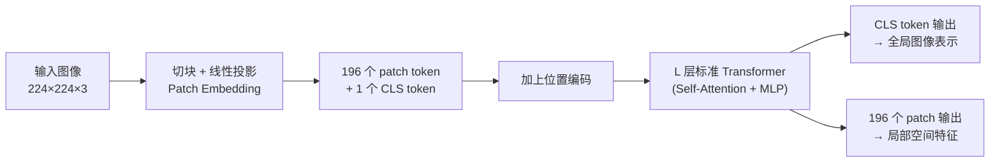

# Vision Transformer：图像怎么变成一串 Token

> **一句话总结**：把一张图像切成一个个小方块（patch），每个小方块拉平后线性投影成一个向量——这样图像就变成了一串和文字 token 一模一样的向量序列，剩下的事情完全交给标准 Transformer。
>
> **为什么要学这个**：几乎所有现代视觉-语言模型（VLM）——CLIP、LLaVA、Qwen-VL、PaliGemma——的"眼睛"都是某个版本的 Vision Transformer（ViT）。理解 ViT 怎么把像素变成 token，是理解任何 VLM 内部结构的第一步。

## 相关阅读

- [Cross-Attention 与交替注意力机制](/前置知识/001e_前置知识_Cross_Attention与交替注意力机制) — ViT 内部用的就是标准 Self-Attention
- [DiT: Diffusion Transformer 架构](/前置知识/002x_前置知识_DiT_Diffusion_Transformer架构) — DiT 的 Patchify 步骤和 ViT 完全同源
- [RoPE 旋转位置编码](/前置知识/002k_前置知识_RoPE旋转位置编码) — ViT 的位置编码问题在多模态场景下的进阶方案（MRoPE）

---

## 贯穿全文的例子

> **场景**：一张 $224 \times 224$ 像素的 RGB 图像，里面画着一个红色方块和一个蓝色碗。我们要把这张图像喂给一个 Transformer，让它像处理一句话一样处理这张图。
>
> 问题是：Transformer 的输入必须是**一串向量**（就像一句话被切成一个个词向量），但图像是一个 $224 \times 224 \times 3$ 的像素网格，没有"先后顺序"这种东西。ViT 要解决的就是这个"图像→序列"的转换问题。

---

## 1. 为什么不能直接把像素喂给 Transformer

### 1.1 朴素方案的问题

最直接的想法：把每个像素当作一个 token。$224 \times 224 = 50176$ 个像素，每个像素是一个 3 维向量（RGB）。

问题很明显：Self-Attention 的计算量是 token 数量的**平方**——$50176^2 \approx 25$ 亿次两两交互，一张图就能把显存打爆。而且单个像素几乎不携带任何语义信息（一个像素的颜色值单独看毫无意义），把它当作一个"词"太浪费。

### 1.2 CNN 的方案：局部卷积

在 ViT 之前，视觉领域的标准方案是卷积神经网络（CNN）：用一个小滑动窗口（比如 $3\times3$）扫过图像，每次只看一个局部区域，逐层堆叠后感受野越来越大。这个设计里天然嵌入了一个假设——**局部像素比远处像素更相关**（这叫"局部性归纳偏置"）。

这个假设在自然图像上大体成立，但也限制了模型：CNN 要"看到"图像两端的关联，需要堆叠很多层卷积逐步扩大感受野。ViT 的野心是：**完全抛弃这个先验假设，让 Self-Attention 从训练数据里自己学出"哪些区域该互相关注"**——包括图像里相距很远的两个区域。

### 1.3 ViT 的方案：把图像切成方块

ViT（Vision Transformer，Dosovitskiy 等，2020）的做法是一个折中：不逐像素处理，而是先把图像切成固定大小的方块（patch），比如 $16 \times 16$ 像素一块。$224 \times 224$ 的图像可以切成 $\frac{224}{16} \times \frac{224}{16} = 14 \times 14 = 196$ 个 patch。

196 个 token 远比 50176 个可控——Self-Attention 的计算量降到了 $196^2 \approx 38416$，可以正常训练。同时，patch 内部的像素关系交给一个简单的线性投影处理，patch 之间的关系完全交给 Self-Attention 自由学习，不预设任何"只看邻居"的偏置。

---

## 2. Patch Embedding：把方块变成向量

### 2.1 具体步骤

给定图像 $x \in \mathbb{R}^{H \times W \times C}$（高、宽、通道数），选定 patch 大小 $p$（通常 14 或 16）：

1. **切块**：把图像切成 $\frac{H}{p} \times \frac{W}{p}$ 个不重叠的方块，每个方块尺寸 $p \times p \times C$
2. **拉平**：每个方块展平成一个 $p^2 \cdot C$ 维向量（比如 $16\times16\times3=768$ 维）
3. **线性投影**：用一个共享的线性层，把每个 $p^2 \cdot C$ 维向量投影到模型的隐藏维度 $d$（比如 768、1024）

$$
z_i = W_{\text{embed}} \cdot \text{flatten}(x_i) + b, \quad i = 1, \dots, N
$$

**这个公式在做什么**：把第 $i$ 个图像方块的原始像素值，压缩成一个 $d$ 维的"语义向量"——和文本 token 经过 embedding 层后的向量形式完全一样，这样图像和文字才能被同一个 Transformer 统一处理。

::: details 📐 公式详解（点击展开）

| 子表达式 | 它是谁 | 它在干嘛 |
|---------|--------|---------|
| $x_i \in \mathbb{R}^{p\times p\times C}$ | **原始方块**——第 $i$ 个 patch 的像素值 | 一小块图像，比如 $16\times16$ 像素的红色方块的一角 |
| $\text{flatten}(x_i)$ | **拉平操作** | 把三维的像素块按固定顺序展开成一个一维向量（$16\times16\times3=768$ 维） |
| $W_{\text{embed}} \in \mathbb{R}^{d \times (p^2 C)}$ | **翻译词典**——所有 patch 共享的同一个投影矩阵 | 把"像素语言"翻译成"Transformer 认识的语言"（$d$ 维向量） |
| $z_i \in \mathbb{R}^d$ | **图像 token** | 这个 patch 最终交给 Transformer 处理的表示形式 |
| $b$ | **偏置** | 和普通线性层一样的可学习偏移量 |

**用人话读**："把图像切成一个个小方块，每块像素拉平后，用同一个投影矩阵把它变成一个和词向量同维度的向量——这样 196 个方块就变成了 196 个'图像词'。"

**为什么共享同一个投影矩阵**：如果每个位置的 patch 用不同的投影矩阵，参数量会随图像分辨率线性增长，而且没有理由假设"图像左上角的规律"和"右下角的规律"不同。共享权重让 ViT 天然具有**平移不变性**——同一个物体出现在图像任何位置，都被同样的方式编码。
:::

### 2.2 工程实现：用卷积实现 Patchify

实际代码中，"切块+拉平+线性投影"这三步通常合并成**一个卷积层**——用 kernel size = stride = patch size 的卷积，正好实现"每个 patch 独立做一次线性变换，patch 之间不重叠、不共享感受野"的效果：

```python
import torch.nn as nn

class PatchEmbed(nn.Module):
    def __init__(self, img_size=224, patch_size=16, in_channels=3, embed_dim=768):
        super().__init__()
        self.num_patches = (img_size // patch_size) ** 2
        # kernel_size = stride = patch_size：每个 patch 独立卷积，不重叠
        self.proj = nn.Conv2d(in_channels, embed_dim, kernel_size=patch_size, stride=patch_size)

    def forward(self, x):
        # x: [B, C, H, W] -> [B, embed_dim, H/p, W/p]
        x = self.proj(x)
        # 拉平空间维度: [B, embed_dim, N] -> [B, N, embed_dim]
        x = x.flatten(2).transpose(1, 2)
        return x
```

这段代码的核心是 `kernel_size=stride=patch_size` 的设置——这保证了卷积核每次滑动正好跨过一个完整 patch 的宽度，patch 之间既不重叠也不遗漏，等价于把图像严格切成不相交的方块分别处理。`flatten(2).transpose(1,2)` 把卷积输出的空间网格 $(H/p, W/p)$ 拉平成一维序列，得到 Transformer 期待的 `[batch, 序列长度, 特征维度]` 格式。

---

## 3. 位置编码：告诉模型每个 patch 在哪里

### 3.1 为什么必须加位置编码

Self-Attention 本身对输入顺序不敏感——把 196 个 patch token 打乱重排，Self-Attention 的计算结果完全不变（只是输出也跟着重排）。但图像显然是有空间结构的：左上角的 patch 和右下角的 patch 语义位置完全不同。如果不显式告诉模型"这是第几行第几列的 patch"，模型就无法区分"红色方块在左边"和"红色方块在右边"这种关键的空间信息。

### 3.2 ViT 原始方案：可学习的绝对位置嵌入

最初的 ViT 用最简单的方式：给每个 patch 位置分配一个可学习的向量，直接加到 patch embedding 上：

$$
z_i' = z_i + p_i
$$

**这个公式在做什么**：把"这个 patch 长什么样"（$z_i$）和"这个 patch 在第几个位置"（$p_i$）直接相加，让同一个向量同时携带内容信息和位置信息。

::: details 📐 公式详解（点击展开）

| 子表达式 | 它是谁 | 它在干嘛 |
|---------|--------|---------|
| $z_i \in \mathbb{R}^d$ | **内容向量** | 上一节算出的、只描述"这个 patch 像素内容"的向量，不含任何位置信息 |
| $p_i \in \mathbb{R}^d$ | **位置身份牌** | 第 $i$ 个位置专属的、随训练更新的参数向量——196 个位置对应 196 张不同的牌，存成一张查找表 |
| $z_i + p_i$ | **合并后的 token** | 逐元素相加，得到"既知道自己长什么样，又知道自己在第几号位置"的最终 token |
| $z_i'$ | **送入 Transformer 的最终输入** | 这才是真正参与 Self-Attention 计算的向量 |

**用人话读**："给每个位置发一张专属身份牌（一个可学习向量），直接叠加在内容向量上——这样两个像素完全相同但位置不同的 patch，进入 Transformer 后会是不同的向量。"

**为什么用相加而不是拼接**：拼接（concat）会让向量维度翻倍，增加后续所有层的计算量；相加保持维度不变，且 Transformer 的线性层足够强大，可以自己从叠加后的向量里分离出"内容"和"位置"两部分信息——这是残差连接类操作在深度学习里的常见设计选择。

**局限**：这张表的大小和训练时的图像分辨率绑定——如果训练时是 $14\times14=196$ 个位置，推理时换成更大的图（比如 $28\times28=784$ 个 patch），位置嵌入表就不够用了。常见的补救方法是对这张表做**双线性插值**，把 196 个位置的嵌入"拉伸"到 784 个位置——这也是 [Qwen3-VL 处理任意分辨率图像](/系列/xr0_deep_dive/03_Qwen3VL骨干_视觉编码与MRoPE)时使用的技巧之一。
:::

**局限**：这张表的大小和训练时的图像分辨率绑定——如果训练时是 $14\times14=196$ 个位置，推理时换成更大的图（比如 $28\times28=784$ 个 patch），位置嵌入表就不够用了。常见的补救方法是对这张表做**双线性插值**，把 196 个位置的嵌入"拉伸"到 784 个位置——这也是 [Qwen3-VL 处理任意分辨率图像](/系列/xr0_deep_dive/03_Qwen3VL骨干_视觉编码与MRoPE)时使用的技巧之一。

### 3.3 [CLS] Token：一个额外的"总结员"

除了 196 个 patch token，原始 ViT 还会在序列最前面插入一个额外的、可学习的 **[CLS] token**（Classification Token）。经过若干层 Self-Attention 后，这个 [CLS] token 会不断从所有 patch token 那里"汇总"信息，最终它的输出向量被当作**整张图像的全局表示**，用于分类等任务。

$$
\text{输入序列} = [\,z_{\text{CLS}},\ z_1',\ z_2',\ \dots,\ z_{196}'\,]
$$

**这个公式在做什么**：在 196 个 patch token 最前面插入一个额外的可学习 token，凑成 197 个 token 一起送进 Transformer。

::: details 📐 公式详解（点击展开）

| 子表达式 | 它是谁 | 它在干嘛 |
|---------|--------|---------|
| $z_{\text{CLS}} \in \mathbb{R}^d$ | **总结员** | 一个和 patch token 同维度、随训练更新的可学习向量，初始时不携带任何图像信息 |
| $z_1', \dots, z_{196}'$ | **196 名汇报人** | 每个 patch 自己的内容+位置向量，各自携带一小块图像的局部信息 |
| $[\,\cdot,\ \cdot,\ \dots\,]$ | **排队站队** | 把总结员放在最前面，197 个 token 按固定顺序拼成一个序列 |
| 输入序列 | **Transformer 的最终输入** | 197 个 token 一起进入 Self-Attention，互相看得到彼此 |

**用人话读**："把一个空白的'总结员' token 插到 196 个 patch token 队伍最前面，一起送进 Transformer——总结员会在后续层里不断向 196 个 patch 打探消息。"

**为什么放在最前面而不是最后面或中间**：位置本身不影响 Self-Attention 的计算结果（因为 attention 是全连接的），放在最前面只是工程上的约定，方便代码里用 `sequence[:, 0]` 固定取出总结员的输出。
:::

**为什么需要专门加一个 token 而不是直接对 196 个 patch 做平均**：平均池化对所有 patch 一视同仁，无法根据内容自适应地决定"该重点看哪个 patch"。而 [CLS] token 通过 Self-Attention 参与计算，它对每个 patch 的关注权重是**可学习、依赖内容**的——训练完之后，[CLS] token 会自动学会更关注和分类相关的 patch（比如"红色方块"所在的区域），忽略背景。

在现代 VLM（如 CLIP、LLaVA）中，[CLS] token 的输出常被当作"整图摘要向量"用于图文对齐；而 196 个 patch token 各自的输出（携带局部空间信息）则被保留下来，供后续的语言模型做细粒度的视觉定位（比如回答"图中红色方块的具体位置"）。

---

## 4. ViT 的整体架构

拼装起来，标准 ViT 的完整流程是：



每一层 Transformer block 的内部结构和处理文本的标准 Transformer 完全相同——LayerNorm → Multi-Head Self-Attention → 残差连接 → LayerNorm → MLP → 残差连接。ViT 最大的贡献不是发明了新的计算单元，而是证明了"把图像看成一串 token"这个**转换方式本身**是可行的，且效果能超过精心设计的 CNN——前提是训练数据足够多（原始 ViT 论文在 3 亿张图片上预训练才明显超越 CNN）。

---

## 5. ViT 在现代 VLM 中的实际用法

### 5.1 大多数 VLM 不从零训练 ViT

工程实践中，几乎没有团队从零训练一个 ViT 作为 VLM 的视觉编码器——而是直接复用已经在大规模图文数据上预训练好的 ViT 权重，最常见的来源是 [CLIP](/前置知识/003h_前置知识_对比学习与InfoNCE_CLIP) 或它的改进版 SigLIP。这些 ViT 已经学会了"看懂"物体、颜色、场景，VLM 只需要在此基础上学习"怎么把这些视觉特征和语言对齐"。

### 5.2 现代改进：动态分辨率与视频

原始 ViT 假设输入图像分辨率固定。但真实场景中的图像分辨率千差万别（手机照片、文档截图、机器人摄像头画面各不相同），把所有图像强行 resize 到同一尺寸会损失细节或引入形变。

Qwen2-VL/Qwen3-VL 等现代 VLM 采用了**原生动态分辨率**（Naive Dynamic Resolution）方案：不固定 patch 网格大小，而是让每张图像按照自己的原始长宽比切分出数量不等的 patch，再通过前面提到的位置编码插值机制统一处理。这让模型能同时处理竖屏照片、宽屏截图、正方形图标而不损失比例信息。视频输入则可以看作在时间维度上多加一维 patch 切分（这也是为什么 [Qwen3-VL 视觉编码器用 3D 卷积而非 2D 卷积](/系列/xr0_deep_dive/03_Qwen3VL骨干_视觉编码与MRoPE)做 patch embedding）。

### 5.3 Patch Merger：压缩 token 数量

高分辨率图像切出来的 patch 数量可能很大（比如 $1024\times1024$ 图像、patch=14，会切出 $73\times73\approx5329$ 个 patch）。直接把这么多图像 token 塞进语言模型会显著拖慢推理速度、占用大量上下文长度。常见做法是在 ViT 输出之后接一个**Patch Merger**——把相邻的 $2\times2$（或更多）个 patch 特征拼接后过一个小 MLP，压缩成一个 token，用 4 倍的 token 数量减少换取推理效率，细节参见 [Qwen3-VL 骨干网络](/系列/xr0_deep_dive/03_Qwen3VL骨干_视觉编码与MRoPE)。

---

## 6. 小结

| 步骤 | 做什么 | 解决什么问题 |
|------|--------|-------------|
| Patch Embedding | 切块 + 拉平 + 线性投影 | 把图像变成 token 序列，可控的计算量 |
| 位置编码 | 给每个 patch 加位置信息 | Self-Attention 本身不知道空间顺序 |
| [CLS] Token | 额外插入一个可学习 token | 提供一个自适应汇总的全局表示 |
| L 层 Transformer | 标准 Self-Attention + MLP | 让 patch 之间自由交互，无局部性限制 |
| Patch Merger（现代改进） | 合并相邻 patch | 压缩 token 数量，提升推理效率 |

ViT 把"图像理解"问题彻底转化成了"序列建模"问题——这正是它能和语言模型无缝对接、成为几乎所有现代 VLM 的视觉基座的根本原因：图像 token 和文本 token 在数学形式上完全一致，都是一串等长的向量，可以被同一个 Transformer 统一处理。

---

## 延伸阅读

- [对比学习与 InfoNCE（CLIP 的训练目标）](/前置知识/003h_前置知识_对比学习与InfoNCE_CLIP) — ViT 作为视觉编码器最常见的预训练方式
- [Cross-Attention 与交替注意力机制](/前置知识/001e_前置知识_Cross_Attention与交替注意力机制) — 图像 token 如何与语言模型交互
- [DiT: Diffusion Transformer 架构](/前置知识/002x_前置知识_DiT_Diffusion_Transformer架构) — Patchify 思想在生成模型中的应用
- [视觉-语言模型（VLM）架构综述](/论文综述/S19_VLM视觉语言模型架构综述) — ViT 在各类 VLM 中的具体角色
