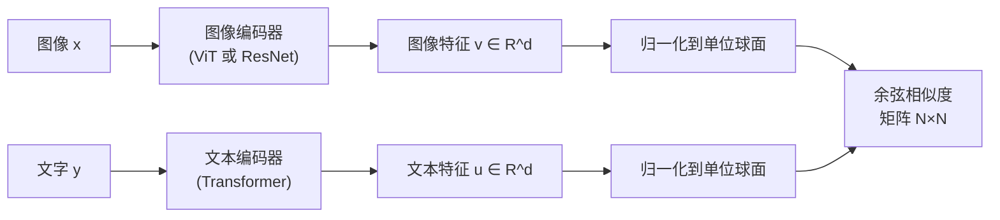

# 对比学习与 InfoNCE：CLIP 如何用图文对齐学会理解世界

> **一句话总结**：给模型看一堆"图像-文字"配对，让匹配的一对在特征空间里靠得很近，不匹配的一对推得很远——不需要任何人工标注类别标签，模型就能自己学会"什么图像对应什么文字"。
>
> **为什么要学这个**：CLIP、SigLIP 这类对比学习训练出来的视觉编码器，是几乎所有现代视觉-语言模型（VLM）的"眼睛"。理解对比学习的训练目标，才能理解为什么这些视觉编码器天生就"懂语言"。

## 相关阅读

- [Vision Transformer：图像怎么变成一串 Token](/前置知识/003g_前置知识_Vision_Transformer图像分块与位置编码) — CLIP 的图像编码器通常就是一个 ViT
- [交叉熵损失与 Softmax](/前置知识/003f_前置知识_交叉熵损失与Softmax) — InfoNCE 本质上是交叉熵损失的一个特殊应用形式
- [重参数化技巧](/前置知识/002e_前置知识_重参数化技巧) — 理解"温度系数"这类可学习标量的处理方式时会用到类似思路

---

## 贯穿全文的例子

> **场景**：你有一个包含 4 亿张"图片 + 对应文字描述"的数据集（比如从网页上爬取的"图片 alt 文本"）。比如：
> - 图 A + "一只戴着红色项圈的金毛犬"
> - 图 B + "夕阳下的城市天际线"
> - 图 C + "一份番茄意面的特写照片"
>
> 你想训练一个模型：给定任意一张新图片，它能判断这张图片和哪句文字描述最匹配——但你**没有**"猫""狗""风景"这类分类标签，只有网页上原始的、杂乱的图文配对。对比学习就是为了解决"如何用这种自然存在的配对数据学习表示"而设计的。

---

## 1. 为什么需要对比学习

### 1.1 传统监督学习的局限

标准的图像分类训练需要人工标注的类别标签——"这张图是猫"。这种标注成本极高，且类别数量固定（比如 ImageNet 的 1000 类），模型学到的表示天然被限制在这 1000 个概念里，遇到训练集之外的新概念（"一只戴着圣诞帽的猫"）就可能识别不好。

### 1.2 对比学习的核心思路

对比学习换了一种问法：不问"这张图属于哪个类别"，而是问**"这两个东西是不是一对"**。给定一批图文对 $(x_1, y_1), (x_2, y_2), \dots, (x_N, y_N)$（$x_i$ 是图像，$y_i$ 是对应的文字描述），模型的任务是：

> 学会把每个 $x_i$ 和它真正配对的 $y_i$ 在某个特征空间里"拉近"，同时把 $x_i$ 和 batch 里其他不匹配的 $y_j$（$j \neq i$）"推远"。

因为标签就是数据本身天然的配对关系（网页上的图片总是跟着一段描述文字），不需要额外的人工标注——这也是为什么对比学习能利用互联网规模（数十亿级）的图文数据。

---

## 2. CLIP 的双编码器架构

CLIP（Contrastive Language-Image Pre-training，OpenAI，2021）用两个独立的编码器分别处理图像和文字：

**关键设计**：两个编码器把不同模态的输入投影到**同一个 $d$ 维向量空间**，并把每个向量归一化成单位长度（除以自身模长）。归一化之后，两个向量的点积就等于它们的**余弦相似度**——一个介于 $-1$（完全相反）到 $1$（完全一致）之间的数，只衡量方向是否一致，不受向量长度干扰。

---

## 3. InfoNCE：让配对在一个 batch 里"竞争"

### 3.1 直觉：把匹配问题变成分类问题

假设一个训练 batch 里有 $N$ 对图文数据。对于第 $i$ 张图像 $x_i$，它的余弦相似度和 batch 里全部 $N$ 个文本 $y_1, \dots, y_N$ 都能算一遍，得到 $N$ 个相似度分数。**真正配对的 $y_i$ 应该得分最高**，其他 $N-1$ 个应该得分低。

这本质上是一个"$N$ 选 1"的分类问题——把"文本 $y_i$ 是不是和 $x_i$ 配对"变成了"$x_i$ 在这 $N$ 个候选文本里，应该选中第 $i$ 个"。这正好可以套用[交叉熵损失](/前置知识/003f_前置知识_交叉熵损失与Softmax)——把 $N$ 个相似度分数当作 logits，过 softmax，用交叉熵监督"正确答案是第 $i$ 个"。

### 3.2 InfoNCE 损失公式

$$
\mathcal{L}_{\text{InfoNCE}} = -\frac{1}{N}\sum_{i=1}^{N} \log \frac{\exp(\text{sim}(v_i, u_i) / \tau)}{\sum_{j=1}^{N} \exp(\text{sim}(v_i, u_j) / \tau)}
$$

**这个公式在做什么**：对 batch 里每张图像，把它和自己真正配对的文本的相似度当作"正确答案"，和 batch 里其他所有文本的相似度当作"干扰项"，用 softmax + 交叉熵逼迫模型把最高的相似度分数分给正确配对。

::: details 📐 公式详解（点击展开）

| 子表达式 | 它是谁 | 它在干嘛 |
|---------|--------|---------|
| $v_i, u_i$ | **一对真夫妻**——图像 $i$ 和文本 $i$ 各自的归一化特征向量 | 训练数据里天然配对的一对（比如"狗的图片"和"一只金毛犬"） |
| $\text{sim}(v_i, u_j) = v_i^\top u_j$ | **相似度打分**——两个单位向量的点积（即余弦相似度） | 衡量图像 $i$ 和文本 $j$ 在语义上有多接近，取值在 $[-1,1]$ |
| $\tau$ | **温度系数**——一个（通常可学习的）正标量 | 控制 softmax 分布的"尖锐程度"：$\tau$ 越小，最大值和其他值的差距被放大得越明显 |
| $\exp(\text{sim}(v_i,u_i)/\tau)$ | **正确答案的得分** | 真实配对的相似度经过温度缩放和指数化后的数值 |
| $\sum_{j=1}^{N}\exp(\text{sim}(v_i,u_j)/\tau)$ | **全体候选人的总得分**——分母 | 图像 $i$ 和 batch 里全部 $N$ 个文本（包括正确的和错误的）相似度得分之和，起归一化作用，让整个式子变成一个合法的概率分布 |
| $\frac{\exp(\cdot)}{\sum(\cdot)}$ | **模型分给正确答案的"概率"** | Softmax 输出——如果模型学得好，这个值应该接近 1 |
| $-\log(\cdot)$ | **惩罚力度** | 分配给正确答案的概率越低，$-\log$ 值越大，loss 越大 |
| $\frac{1}{N}\sum_{i=1}^{N}$ | **公平考试** | 对 batch 里所有图像求平均，训练时用 mini-batch 采样近似 |

**用人话读**："对一个 batch 里的每张图，把它和真正配对的文字的相似度、除以温度系数后取指数，除以它和 batch 里所有文字（包括正确和错误的）相似度指数之和——这个比值就是模型认为'这就是正确配对'的信心。信心越低，loss 越大。"

**为什么要引入温度系数 $\tau$**：如果没有 $\tau$（相当于 $\tau=1$），当相似度都是较小的数值（余弦相似度天然限制在 $[-1,1]$）时，softmax 分布会很"平"——正确答案和错误答案的概率差距不明显，梯度信号很弱。除以一个较小的 $\tau$ 相当于把所有相似度**放大**后再做 softmax，让分布变得更"尖锐"，正确答案和错误答案的概率差距被拉大，梯度信号更强，训练更容易收敐。$\tau$ 通常设为可学习参数，让模型自己找到最合适的"尖锐程度"。
:::

### 3.3 数值例子：一个 batch 里的 4 对图文

假设 batch size $N=4$，归一化后的余弦相似度矩阵（行=图像，列=文本，对角线是正确配对）为：

$$
\text{sim} = \begin{bmatrix} 0.8 & 0.1 & 0.05 & 0.2 \\ 0.15 & 0.75 & 0.1 & 0.05 \\ 0.1 & 0.05 & 0.85 & 0.1 \\ 0.2 & 0.1 & 0.15 & 0.7 \end{bmatrix}
$$

**这个公式在做什么**：展示 4 张图像和 4 段文本两两之间的余弦相似度，对角线（正确配对）明显比非对角线大，说明模型已经把匹配的图文对区分开了。

::: details 📐 数值演算（点击展开）

取 $\tau = 0.1$，看第 1 行（图像 1 对 4 段文本的相似度）：相似度除以 $\tau$ 后变成 $[8, 1, 0.5, 2]$，经过 softmax：

$$
\text{softmax}([8,1,0.5,2]) \approx [0.9985,\ 0.0005,\ 0.0003,\ 0.0007]
$$

**用人话读**：把图像 1 和 4 段候选文本的相似度都除以温度 $\tau=0.1$（相当于放大 10 倍）再做 softmax，模型给"正确答案"（第 1 项）的信心被推到 99.85%。

正确答案（第 1 项）的概率被推到接近 1，loss $=-\log(0.9985)\approx 0.0015$，非常小——说明这个相似度矩阵已经学得很好（对角线明显大于非对角线）。如果 $\tau$ 取更大的值（比如 $\tau=1$），同样的相似度差异经过 softmax 后差距会小很多，loss 会明显更大，梯度信号也更弱。这正是温度系数控制"训练难度"的直观体现。
:::

### 3.4 双向损失：图像找文本 + 文本找图像

实际训练的 CLIP loss 是**双向对称**的——不仅要"每张图像在 $N$ 个文本里找到自己的配对"，也要"每段文本在 $N$ 张图像里找到自己的配对"：

$$
\mathcal{L}_{\text{CLIP}} = \frac{1}{2}\left(\mathcal{L}_{\text{InfoNCE}}^{\text{image}\to\text{text}} + \mathcal{L}_{\text{InfoNCE}}^{\text{text}\to\text{image}}\right)
$$

**这个公式在做什么**：把"图像找文本"和"文本找图像"两个方向的 InfoNCE loss 取平均，逼迫相似度矩阵在行方向和列方向上都尽量把最大值放在对角线上。

::: details 📐 公式详解（点击展开）

| 子表达式 | 它是谁 | 它在干嘛 |
|---------|--------|---------|
| $\mathcal{L}_{\text{InfoNCE}}^{\text{image}\to\text{text}}$ | **正向考题** | 对相似度矩阵按行做 softmax——"给定这张图，在所有候选文本里选中正确的那句" |
| $\mathcal{L}_{\text{InfoNCE}}^{\text{text}\to\text{image}}$ | **反向考题** | 对同一个相似度矩阵按列做 softmax——"给定这段文本，在所有候选图像里选中正确的那张" |
| $\frac{1}{2}(\cdot+\cdot)$ | **两场考试平均分** | 把两个方向的 loss 取平均，作为最终优化目标 |

**用人话读**："同一张相似度表，既要保证每一行的最大值在对角线上（图找得到文），也要保证每一列的最大值在对角线上（文找得到图）——两个方向都对才算训练好。"

**为什么需要双向**：只优化单向（比如只让图像找到文本）不能保证反过来也成立——理论上可能出现"某张奇怪的文本和很多图像都相似度不低"的退化情况。双向约束让相似度矩阵在行、列两个方向都趋近于一个理想的对角矩阵，表示更鲁棒。
:::

两个方向的区别只是 softmax 沿相似度矩阵的行还是列做归一化——本质是同一个相似度矩阵，从两个不同角度分别做一次"$N$ 选 1"分类。

---

## 4. SigLIP：用 Sigmoid 替代 Softmax

### 4.1 InfoNCE 的隐藏成本：需要"看到全局"

InfoNCE 的 softmax 分母需要对 batch 内**全部** $N$ 个候选项求和——这意味着计算 loss 时，每个样本都必须知道整个 batch 里其他所有样本的相似度。在多机多卡训练时，这要求先把所有设备上的图像/文本特征做一次全局同步（all-gather），再计算 softmax，通信开销随 batch size 增长。

### 4.2 SigLIP 的方案：把"多选一"拆成多个"是不是"

SigLIP（Sigmoid Loss for Language-Image Pre-training，Google DeepMind，2023）换了一个更简单的视角：不问"这个图像在所有候选文本里应该选哪个"，而是对**每一对**图文分别问一个独立的是非题——"这张图和这段文字，是不是配对？"

$$
\mathcal{L}_{\text{SigLIP}} = -\frac{1}{N}\sum_{i=1}^N \sum_{j=1}^N \Big[\mathbb{1}[i=j]\log\sigma(z_{ij}) + \mathbb{1}[i\ne j]\log(1-\sigma(z_{ij}))\Big], \quad z_{ij} = t\cdot v_i^\top u_j + b
$$

**这个公式在做什么**：把图文匹配问题从"$N$ 选 1 的选择题"改成了 $N\times N$ 个"是/否判断题"——每一对图文独立地问"匹配吗？"，配对的要判"是"，不配对的要判"否"，答错就惩罚。

::: details 📐 公式详解（点击展开）

| 子表达式 | 它是谁 | 它在干嘛 |
|---------|--------|---------|
| $z_{ij}=t\cdot v_i^\top u_j+b$ | **判官打分**——带温度缩放和偏置的相似度 | $t$（温度的倒数，可学习）放大或收缩相似度差异，$b$（可学习偏置）整体上调或下调"判是"的倾向 |
| $\sigma(z_{ij})=\frac{1}{1+e^{-z_{ij}}}$ | **判是的概率**——Sigmoid 函数 | 把任意实数压缩到 $(0,1)$，表示"模型认为图像 $i$ 和文本 $j$ 配对"的概率 |
| $\mathbb{1}[i=j]\log\sigma(z_{ij})$ | **正样本的奖励** | 只有对角线（真配对）才生效，鼓励 $\sigma(z_{ii})$ 接近 1 |
| $\mathbb{1}[i\ne j]\log(1-\sigma(z_{ij}))$ | **负样本的奖励** | 非对角线（假配对）生效，鼓励 $\sigma(z_{ij})$ 接近 0 |
| $\sum_{i=1}^N\sum_{j=1}^N$ | **遍历所有配对** | 每一对 $(i,j)$ 都独立算一次二分类 loss，不需要跨样本的全局归一化 |

**用人话读**："对 batch 里每一对图文组合单独问一句'配对吗？'——配对的希望回答'是'的概率接近 1，不配对的希望回答'否'的概率接近 1（也就是回答'是'的概率接近 0）。每一对都是独立的判断题，不需要参考其他候选项的分数。"

**为什么能省去全局同步**：InfoNCE 的 softmax 要求知道"该样本在所有候选项里排第几"，本质上是一个**相对**排序问题，必须先收集全部候选项的分数才能归一化。而 Sigmoid loss 里每一对 $(i,j)$ 的 loss 只依赖 $z_{ij}$ 自己——不需要知道其他 $j'$ 的分数是多少，因此每个设备可以只对本地持有的那部分图文对独立算 loss，天然更适合大规模分布式训练。
:::

### 4.3 两种损失函数形状的直观对比

下图左边展示了不同温度 $t$ 下，sigmoid 函数把余弦相似度转化为"匹配概率"的形状——温度越高，函数在 0 附近越陡峭，正负样本的概率被推得越极端：

> 左图：不同温度 $t$ 下，sigmoid 函数把余弦相似度 $x$ 映射为"匹配概率"$p=\sigma(tx)$。温度越大，函数越陡峭，模型对相似度的微小变化越敏感。右图：固定 $t=10, b=-2$ 时，正样本 loss（希望相似度 $x$ 越大越好）随 $x$ 增大单调下降；负样本 loss（希望相似度 $x$ 越小越好）随 $x$ 增大单调上升——两条曲线分别对应公式里的"是"分支和"否"分支。

| | InfoNCE (CLIP) | Sigmoid Loss (SigLIP) |
|---|---|---|
| 问题形式 | $N$ 选 1 的分类 | 逐对独立的二分类 |
| 是否需要全局归一化 | 需要（softmax 分母） | 不需要 |
| 分布式训练通信开销 | 大（需要 all-gather 全部特征） | 小（每设备本地计算） |
| 大 batch size 下的表现 | 依赖大 batch 提供足够负样本 | 对 batch size 更不敏感 |
| 典型使用者 | CLIP、原始对比学习工作 | SigLIP、SigLIP2，现代 VLM 视觉编码器主流选择 |

---

## 5. CLIP/SigLIP 训练出来的视觉编码器为什么好用

### 5.1 语义对齐的副产品

CLIP/SigLIP 的训练目标从头到尾都在优化"图像特征"和"文字特征"在同一空间里的对齐程度。这意味着训练完成后，**图像编码器单独拿出来使用时，它输出的特征天然是"语言可读"的**——特征空间里的方向和语义概念（"红色""狗""户外"）直接对应，而不是像传统分类训练那样只对着 1000 个固定类别标签优化。

### 5.2 在 VLM 中的角色

现代视觉-语言模型（如 LLaVA、Qwen-VL、PaliGemma）几乎全部直接复用预训练好的 CLIP 或 SigLIP 的**图像编码器部分**（通常是一个 [ViT](/前置知识/003g_前置知识_Vision_Transformer图像分块与位置编码)），冻结或微调后接入语言模型。这些视觉编码器不需要重新学习"什么是狗""什么是红色"——这些语义早已通过对比学习刻进了参数里。VLM 训练阶段主要要学的是"如何把这些已经语义对齐的视觉特征，接入语言模型的表示空间"，具体机制见 [视觉-语言模型架构综述](/论文综述/S19_VLM视觉语言模型架构综述)。

---

## 6. 小结

| 概念 | 核心思想 |
|------|---------|
| 对比学习 | 用天然存在的配对关系（无需人工标注）学习表示：拉近匹配的，推远不匹配的 |
| InfoNCE | 把"匹配问题"变成"$N$ 选 1 分类"，用 softmax + 交叉熵优化 |
| 温度系数 $\tau$ | 控制 softmax 分布的尖锐程度，直接影响梯度信号强度 |
| SigLIP 的 Sigmoid Loss | 把"$N$ 选 1"拆成 $N^2$ 个独立二分类，省去全局归一化，更适合大规模分布式训练 |
| 训练结果 | 视觉编码器输出的特征天然和语言语义对齐，是现代 VLM 的标准"眼睛" |

---

## 延伸阅读

- [Vision Transformer：图像怎么变成一串 Token](/前置知识/003g_前置知识_Vision_Transformer图像分块与位置编码) — CLIP/SigLIP 常用的图像编码器结构
- [交叉熵损失与 Softmax](/前置知识/003f_前置知识_交叉熵损失与Softmax) — InfoNCE 的数学根基
- [视觉-语言模型（VLM）架构综述](/论文综述/S19_VLM视觉语言模型架构综述) — CLIP/SigLIP 在各类 VLM 中的具体使用方式
