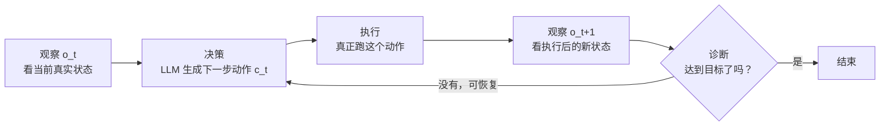

# 前置知识：LLM 智能体的执行循环与记忆机制

> **一句话**：LLM 智能体不是"问一句答一句"，而是把大模型放进一个不断"观察-决策-执行-再观察"的闭环里，并且给它配一套可以跨步骤、跨任务持久化的记忆——循环解决"怎么一步步把任务做完"，记忆解决"怎么让下一次做得更好"。

**知识链接**：
- [知识蒸馏基础](/前置知识/000v_前置知识_知识蒸馏基础)（关联：全局记忆本质上是把"探索过程学到的经验"蒸馏成可复用的规则）
- [Q 函数与 Value 函数](/前置知识/000o_前置知识_Q函数与Value函数)（关联：智能体循环中的"诊断"步骤和 RL 里的价值估计目的相通——都是判断"当前进展好不好"）

---

## 贯穿全文的例子

> **场景**：一个自动化数据分析智能体，任务是"读取一份销售数据 CSV，画出月度趋势图，并指出异常月份"。
>
> 这个任务不能一次性完成——智能体需要先读文件看看列名是什么，再写代码画图，再看看图对不对，如果代码报错还要改。整个过程是**多轮的、依赖真实反馈的**，这正是本文要讲的"智能体循环"和"记忆机制"存在的理由。

---

## 一、从"一次性问答"到"智能体"：为什么需要循环

### 1.1 普通 LLM 调用的局限

把一个大语言模型当作纯函数来用，它的调用模式是：

$$
y = \text{LLM}(x)
$$

**这个公式在做什么**：把大模型当成一个"输入一段文字、输出一段文字"的黑箱函数——问一次答一次，中间没有任何和外部世界打交道的机会。

::: details 📐 公式详解（点击展开）

| 子表达式 | 它是谁 | 它在干嘛 |
|---------|--------|---------|
| $x$ | **一次性输入** | 比如"帮我写一个读取 CSV 并画图的函数"这句话，包含了用户能想到的全部信息 |
| $\text{LLM}(\cdot)$ | **纯函数式的大模型** | 只根据看到的输入生成输出，生成完就结束，不会再收到任何反馈 |
| $y$ | **一次性输出** | 生成的代码文本本身，模型永远不知道这段代码跑起来是成功还是报错 |

**用人话读**："给模型一句话，它吐出一段回答，事情就结束了——模型永远看不到自己的答案在真实世界里执行的后果。"

**为什么是这个形式**：这是最简单的调用方式，对"一步就能想清楚全部细节"的任务足够用（比如翻译一句话），但对"必须先看见结果才知道下一步怎么做"的任务完全不够，这正是下文要引入执行循环的原因。
:::

输入一段文本 $x$（比如"帮我写一个读取 CSV 并画图的函数"），输出一段文本 $y$（生成的代码）。这个调用**只发生一次**，模型看不到代码真正跑起来会发生什么。如果生成的代码里列名写错了，模型无法知道，因为它从来没有观察过执行结果。

这对于"一步能想清楚全部细节"的任务（比如翻译一句话）没问题，但对于"必须先看见世界才知道下一步该干什么"的任务（读取一个陌生 CSV、操作一个网页、控制一台机器人）完全不够。**这类任务的本质是：正确的下一步依赖于上一步执行后世界发生了什么变化，而这个变化在动手之前是未知的。**

### 1.2 智能体：给 LLM 加一个反馈闭环

**LLM 智能体（LLM Agent）** 的核心改动，就是把单次调用换成一个不断重复的循环：模型看一眼当前情况 → 决定做一件具体的事 → 真正去执行 → 看执行完之后情况变成了什么样 → 再决定下一步。这个循环通常被称为 **感知-决策-执行循环**（也叫 ReAct 循环，取自 Reasoning + Acting 的缩写，即"推理"与"行动"交替进行）。

用函数形式写出来，第 $t$ 轮的决策是：

$$
c_t = \pi_\Theta\big(o_t,\; \ell,\; H_{<t}\big)
$$

**这个公式在做什么**：描述智能体每一步"看什么、想什么、决定做什么"——输出的不是最终答案，而是**下一个具体动作**。

::: details 📐 公式详解（点击展开）

| 子表达式 | 它是谁 | 它在干嘛 |
|---------|--------|---------|
| $o_t$ | **当前观测** | 这一轮能看到的真实世界信息，比如 CSV 的前几行、代码报错的堆栈信息、网页当前的截图 |
| $\ell$ | **任务描述** | 从头到尾不变的目标说明，比如"画出月度趋势图并指出异常月份" |
| $H_{<t}$ | **历史记录** | 之前所有轮次"做了什么、看到了什么"的完整流水账 |
| $\pi_\Theta$ | **决策者** | 就是 LLM 本身，接收上述所有信息，"演"出下一步该做的具体动作 |
| $c_t$ | **本轮动作** | 一个具体、可执行的指令，比如"运行这段读取代码"或"把第 3 列改名为 'month'" |

**用人话读**："模型每一步都要看着当前的真实反馈、记着任务是什么、记着之前试过什么，才能决定接下来具体做哪一件事——不是凭空生成一个完整答案。"

**为什么是这个形式**：如果去掉 $o_t$，模型就是在"闭眼睛做事"，没法根据真实结果调整；如果去掉 $H_{<t}$，模型会不断重复同样的错误——因为它不记得自己刚才试过这个方法失败了。
:::

### 1.3 一轮循环的具体流程

回到贯穿全文的例子：智能体先"观察"CSV 的表头（$o_0$），"决策"生成一段 `pandas` 读取代码（$c_0$），"执行"这段代码，"观察"到报错"KeyError: 'Month'"（$o_1$）——这时"诊断"发现列名其实是 `month`（小写），于是下一轮"决策"改成用正确的列名重新读取。**没有这个闭环，模型只能凭空猜列名，猜错了也无法纠正。**

### 1.4 动作空间：为什么用"结构化指令"而不是自由文本

循环中的动作 $c_t$ 具体长什么样，是设计智能体时最关键的选择之一。三种常见方案：

| 方案 | 动作长什么样 | 优点 | 缺点 |
|------|------------|------|------|
| 自由文本 | "我觉得应该把列名改成小写" | 表达力最强 | 无法直接执行，需要额外一层"翻译"成真正的操作，容易产生歧义 |
| 任意代码生成（Code as Policies 范式） | 直接生成一段 Python/JS 代码去执行 | 灵活，能拼出没预设过的复杂逻辑 | 生成的代码可能有语法错误、可能调用不存在的函数、安全性和可复现性差 |
| 固定指令词表（structured primitive interface） | `{"action": "rename_column", "from": "Month", "to": "month"}` 这样的结构化 JSON | 一定能被正确解析和执行，行为边界清晰，容易审计和复现 | 表达力受限于预先定义好的指令集合，遇到指令集之外的需求就做不到 |

三种方案的核心权衡是**表达力 vs 可靠性**：自由代码生成表达力最强但最不稳定，固定指令词表最稳定但需要提前想好"够不够用"。工程实践中，越是物理世界的、犯错代价高的场景（如机器人控制），越倾向于用固定指令词表；越是纯数字世界的、犯错代价低的场景（如写一个数据分析脚本），越倾向于允许自由代码生成。

---

## 二、闭环验证：诊断而不是"祈祷"

### 2.1 开环执行的问题

如果智能体每一步执行完动作就直接假设"应该成功了"，不去检查真实结果，这叫**开环执行**——就像闭着眼睛扔飞镖，扔完也不看有没有中。这在任务链条变长后极其脆弱：任何一步的微小偏差都会在后续步骤里累积放大，而模型完全不知道自己已经偏离了轨道。

### 2.2 闭环验证的三个判断

真正健壮的智能体在每一步执行后都要做一次**诊断**，把结果分类成三种情况：

| 诊断结果 | 含义 | 下一步动作 |
|---------|------|-----------|
| **进展（progress）** | 这一步确实往目标推进了 | 继续下一步 |
| **可恢复失败（recoverable failure）** | 出错了，但可以调整策略重新来 | 分析失败原因，换一种方式重试 |
| **不可恢复失败（unrecoverable failure）** | 已经无法在当前轮次内挽回 | 终止或者请求人工介入 |

回到例子：如果读 CSV 报错"文件不存在"，这属于可恢复失败——检查一下文件路径是否写错，改正后重试；如果 CSV 内容本身是空文件，这就是不可恢复失败——不管怎么重试都不会有数据可画。

**这个诊断步骤和强化学习中"用价值函数判断当前状态好不好"是同一种思路**——如果你对"当前进展"的量化评估感兴趣，可以参考 [Q 函数与 Value 函数](/前置知识/000o_前置知识_Q函数与Value函数)，只是智能体这里的"打分"通常由 LLM 自己读日志、读报错信息来完成，而不是训练一个专门的神经网络。

---

## 三、记忆机制：为什么循环本身还不够

### 3.1 上下文窗口不是记忆

有人会问：LLM 的上下文窗口（context window）里已经装着这一轮对话的所有历史了，这不就是记忆吗？

问题在于**上下文窗口的记忆是临时的、一次性的**：
1. 一旦当前会话/episode 结束，上下文清空，下次面对同一类任务，模型又要从零摸索一遍。
2. 上下文窗口有长度限制，任务步数一多，早期的关键信息会被挤出窗口或者被大幅稀释。
3. 上下文里的信息是"流水账"，没有被提炼成"这个任务该怎么做的结构化经验"。

**记忆机制要解决的问题是：把探索过程中学到的东西，从"这一次对话的临时记录"变成"未来永久可复用的知识"。**

### 3.2 两种记忆：任务记忆 vs 全局记忆

参考人类记忆的分类方式，智能体的持久化记忆通常也分两种，对应两种不同的可复用范围：

| 记忆类型 | 存的是什么 | 复用范围 | 类比 |
|---------|-----------|---------|------|
| **任务记忆**（Task-Specific Memory，也叫程序性记忆） | 一次成功解决**某个具体任务**的完整操作序列 + 为什么这样做有效 | 只对"这一类任务"复用，换个任务就用不上 | 记得"上次修这台打印机是先关电源再拔纸盘" |
| **全局记忆**（Global Memory，也叫语义记忆） | 从多次尝试中提炼出的**通用规律**：什么做法通常有效、什么坑要避免 | 跨任务通用，任何相关任务都能参考 | 记得"打印机卡纸问题一般都是先断电再检查，这条经验适用于所有打印机" |

拿贯穿全文的例子来说：
- **任务记忆**可能是这样一条记录："对于'销售数据月度趋势'这类任务，成功的操作顺序是：① 用 `pd.read_csv` 读取 → ② 把列名统一转小写 → ③ 用 `groupby('month')` 聚合 → ④ 用 `matplotlib` 画折线图。"
- **全局记忆**则是更通用的规则："CSV 列名的大小写经常和预期不一致，读取后第一步应该先打印 `df.columns` 确认，而不是直接假设列名。"

### 3.3 记忆的写入：什么时候该存、存什么

记忆不是被动记录所有内容，而是在每一轮执行后主动地做一次筛选和提炼：

$$
M_{\text{task}} \leftarrow \big(\text{trace},\; \text{strategy},\; \text{pitfalls}\big) \quad \text{if success}
$$

**这个公式在做什么**：描述"什么时候该往任务记忆里写东西、写的是哪三类内容"——不是把所有过程都存下来，而是只存"这次为什么成功"的结构化总结。

::: details 📐 公式详解（点击展开）

| 子表达式 | 它是谁 | 它在干嘛 |
|---------|--------|---------|
| trace | **操作轨迹** | 按顺序记录这次成功执行的每一步具体操作是什么 |
| strategy | **策略说明** | 用自然语言解释"为什么这套操作顺序能成功"，而不只是罗列步骤 |
| pitfalls | **避坑提示** | 记录中途踩过的坑、走过的弯路，提醒未来不要重复 |
| if success | **筛选条件** | 只有这次尝试最终成功了，才值得把它固化成任务记忆 |

**用人话读**："只有当一次尝试真正成功了，才把'做了什么、为什么有效、踩过什么坑'这三件事打包存下来，作为以后做同类任务的参照。"

**为什么是这个形式**：如果不区分成功/失败一律存，记忆库会被大量无效尝试污染；如果只存操作步骤不存"为什么"，未来遇到细节变化（比如换了个 CSV，列名不一样）时，模型不知道该在哪里灵活调整、哪里必须严格照搬。
:::

全局记忆的写入逻辑类似，但触发条件更宽松——即使某次尝试失败了，只要从失败中提炼出了"以后应该避免这样做"的通用规律，也可以写入全局记忆（失败本身就是一种有价值的负样本）。这个"从多次经验里提炼出可迁移规则"的过程，本质上和 [知识蒸馏](/前置知识/000v_前置知识_知识蒸馏基础) 里"把大模型的行为压缩成小模型能理解的规则"是同一种思路——只是这里蒸馏的对象不是另一个神经网络，而是未来某一次的自己。

### 3.4 记忆的读取：复用结构，不是重放坐标

这是记忆机制里最容易被误解的一点：**任务记忆存的是"解题的骨架"，不是"可以原样重放的录像"。**

回到例子：假设任务记忆里存的是"用 `groupby('month')` 聚合"，但这次面对的新 CSV 里月份那一列叫 `Month_Name` 而不是 `month`。智能体不能盲目执行 `groupby('month')`（会报错，因为列真的不叫这个名字），而应该：
1. 从记忆里读出**结构**："需要按月份分组聚合"；
2. 用**当前**这份数据的真实信息重新确定：月份列实际叫什么名字；
3. 用重新确定后的列名去执行分组操作。

这个过程叫**重新绑定**（re-grounding）——记忆提供的是"该做什么、按什么顺序做"的骨架，但骨架里所有和具体环境相关的细节（列名、坐标、按钮位置……）都必须用当前这一刻的真实观测重新确定，绝不能直接照抄旧记忆里的具体数值。**如果直接照抄旧记忆里存的坐标或名字，一旦环境稍有变化（哪怕只是这次的表头拼写不一样），整个流程就会失败——这正是"记忆"和"硬编码脚本"的根本区别。**

### 3.5 和检索增强生成（RAG）的区别

有经验的读者可能会联想到检索增强生成（Retrieval-Augmented Generation, RAG，一种先从外部文档库检索相关资料再喂给模型生成答案的技术）。两者确实相似（都是"检索历史信息喂给模型"），但关注点不同：

| 维度 | RAG | 智能体记忆 |
|------|-----|-----------|
| 检索的内容 | 外部静态文档/知识库（人写的资料） | 智能体自己过去执行任务的轨迹和总结 |
| 内容来源 | 提前准备好，不会变 | 智能体在交互中自己产生、自己积累 |
| 目的 | 补充模型不知道的事实性知识 | 复用"怎么把一类任务做成功"的程序性经验 |
| 典型用法 | 问答、文档检索 | 多步骤任务执行、技能积累 |

简单说：RAG 解决"模型不知道某个事实"，智能体记忆解决"模型不记得自己上次是怎么把这件事做成的"。

---

## 四、总结

| 维度 | 感知-决策-执行循环 | 记忆机制 |
|------|------------------|---------|
| 解决的问题 | 一个任务内部，怎么一步步做完 | 跨越多次尝试/多个任务，怎么让后面做得更好 |
| 核心机制 | 观察 → 决策 → 执行 → 再观察 → 诊断 | 任务记忆（程序性）+ 全局记忆（语义性） |
| 关键设计点 | 动作空间选结构化指令还是自由代码 | 存的是骨架还是原始数值；读取时要不要重新绑定 |
| 失败时怎么办 | 诊断分类：进展/可恢复失败/不可恢复失败 | 失败经验提炼成"避坑"规则写入全局记忆 |

一个成熟的 LLM 智能体，本质上就是把这两套机制组合在一起：循环负责"当下怎么把事情做完"，记忆负责"这一次的经验能不能让下一次更轻松"。这也是后续机器人领域把 LLM 智能体和冻结的视觉-语言-动作（VLA）模型结合起来的设计基础——感兴趣可以继续阅读 [Harness VLA 精读](/论文综述/103_HarnessVLA_冻结VLA的记忆引导智能体编排)，看这套通用机制具体怎么落地到真实机器人操作任务上。

---

## 延伸阅读

- [知识蒸馏基础](/前置知识/000v_前置知识_知识蒸馏基础) — 全局记忆"提炼可迁移规则"的思路来源
- [Q 函数与 Value 函数](/前置知识/000o_前置知识_Q函数与Value函数) — "诊断当前进展好坏"和 RL 价值估计的相通之处
- [Harness VLA：冻结 VLA 的记忆引导智能体编排](/论文综述/103_HarnessVLA_冻结VLA的记忆引导智能体编排) — 本概念在机器人操作任务中的完整应用案例
