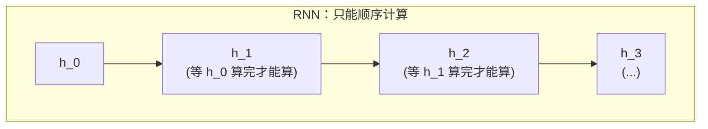
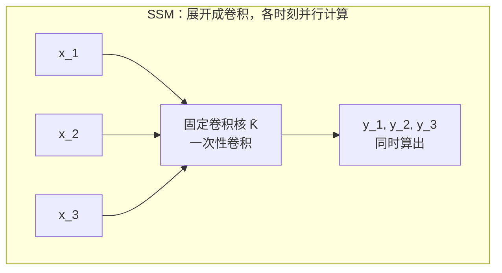
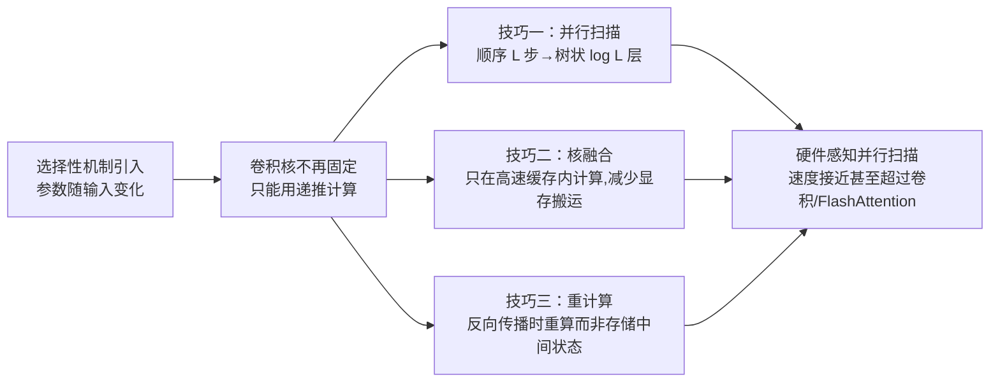

# 前置知识：状态空间模型（SSM）与选择性扫描——从控制论到 Mamba

> **一句话**：状态空间模型（State Space Model, SSM）用一个随时间演化的隐藏状态 $h_t$ 描述一个动态系统——这个递推形式和 RNN 几乎一样，但因为它是**线性**的，所以能被展开成一个**卷积**，训练时可以整个序列一次性并行算完，而 RNN 的非线性递推做不到这一点。Mamba 在这个基础上加了一刀"选择性"，让参数依赖当前输入本身，重新获得了 RNN 式的内容感知能力，同时用一个叫"并行扫描"的工程技巧把并行训练的效率保了回来。

**前置概念**：基础线性代数（矩阵乘法、矩阵指数）、基础概率或数学分析中"递推数列"的概念。不需要控制论背景。

---

## 贯穿全文的例子

> 一节车厢在一条直线轨道上运动。我们关心它的**真实运动状态**（位置和速度），但只能通过传感器**间接观测**（比如带噪声的位置读数）。控制系统每一时刻会施加一个推力（输入），车厢的状态随之演化。这是控制论里最经典的场景，我们会用它引出状态空间模型的数学形式；之后再把这个"状态随时间演化"的框架搬到深度学习里，用来处理语言、时间序列等任意序列数据。

---

## 一、状态空间模型是什么：从控制论到深度学习

### 1.1 一个动态系统需要几个变量描述

车厢这个物理系统，在任意时刻 $t$ 有三类量：

- **状态 $h_t$**（隐藏、我们真正关心但看不见的量）：车厢的真实位置和速度，合在一起是一个向量
- **输入 $x_t$**（我们能控制或已知的量）：这一时刻施加的推力
- **输出/观测 $y_t$**（我们能实际测到的量）：传感器读出来的位置信号（可能带噪声、可能只测到状态的一部分）

状态空间模型的核心假设：**下一时刻的状态，只取决于当前状态和当前输入**（不需要更早的历史——所有历史信息已经压缩进当前状态里了）。这个假设在数学上写成一个线性递推：

$$
\begin{aligned}
h_t &= A h_{t-1} + B x_t \\
y_t &= C h_t
\end{aligned}
$$

**这个公式在做什么**：描述系统怎么"一步步往前走"——新状态由旧状态和当前输入线性组合而来，而我们能看到的输出只是状态的一个线性投影。

::: details 📐 公式详解（点击展开）

| 子表达式 | 它是谁 | 它在干嘛 |
|---------|--------|---------|
| $h_{t-1}$ | **上一刻的记忆** | 系统在上一时刻的完整状态（车厢的位置+速度），浓缩了到目前为止所有历史信息 |
| $A$ | **自然演化算子** | 一个矩阵，描述"如果什么输入都不施加，状态自己会怎么变"（比如带惯性的车厢，速度会让位置继续变化） |
| $A h_{t-1}$ | **惯性延续** | 上一状态按自身动力学规律自然演化到下一步的部分 |
| $B$ | **输入影响算子** | 描述"施加的推力具体怎么影响状态"，比如推力主要改变速度而不是直接改变位置 |
| $B x_t$ | **外部推动** | 当前输入对状态造成的额外改变 |
| $h_t$ | **新状态** | 把"自然演化"和"外部推动"加起来，就是这一步之后的新状态 |
| $C$ | **观测算子** | 描述"状态的哪些部分能被看到、以什么方式被看到"，比如传感器只能测位置，测不到速度 |
| $y_t$ | **观测输出** | 状态经过 $C$ 投影后，我们实际能拿到的读数 |

**用人话读**："新状态 = 旧状态按自身规律自然演化的部分，加上这一步外部输入带来的改变；而我们看到的输出，只是这个状态的一个侧面投影。"

**为什么是这个形式（线性）**：线性形式让整个系统的行为完全由三个固定矩阵 $A,B,C$ 决定，好处是数学上极其容易分析和计算（矩阵乘法可结合、可展开），这是后面能推出"卷积形式"的根本原因（见 1.3 节）。控制论里很多物理系统（弹簧振子、RC 电路、车辆运动学）在小范围内本身就是线性或可以线性近似的。
:::

在实际实现中（包括后面要讲的 S4、Mamba），我们直接使用离散时间的递推形式：

$$
\begin{aligned}
h_t &= \bar A h_{t-1} + \bar B x_t \\
y_t &= C h_t
\end{aligned}
$$

**这个公式在做什么**：和上面几乎是同一个式子，只是矩阵上加了一条横线（$\bar A, \bar B$），提醒我们这是"离散化"之后可以直接在计算机里逐步迭代的版本。

::: details 📐 公式详解（点击展开）

| 子表达式 | 它是谁 | 它在干嘛 |
|---------|--------|---------|
| $\bar A$ | **离散化后的演化矩阵** | 从连续时间的 $A$ 通过一个固定公式（如 $\bar A = \exp(\Delta A)$，$\Delta$ 是离散时间步长）转换而来，代表"经过一个时间步之后状态自身会变成什么样" |
| $\bar B$ | **离散化后的输入矩阵** | 同理从连续 $B$ 转换而来，代表"这一步输入具体注入了多少" |
| $\Delta$（隐含在 $\bar A,\bar B$ 里） | **时间步长/采样间隔** | 决定了"一步"对应多长的物理时间，$\Delta$ 越大，一步跨越的时间越长 |
| $h_t = \bar A h_{t-1} + \bar B x_t$ | **离散递推** | 和连续形式意义完全相同，只是可以直接一步步迭代计算 |

**用人话读**："把连续时间的物理系统按固定的时间间隔切片，每一步用离散化后的矩阵做同样的'旧状态 + 新输入'组合。"

**为什么要离散化**：计算机没法处理连续时间的微分方程，必须把它转换成一步步可以迭代执行的形式。离散化公式（如 Zero-Order Hold）保证了离散版本在采样点上和原连续系统的行为完全一致，这一步是"理论上优雅的连续系统"变成"能跑在 GPU 上的算法"的必经环节。
:::

### 1.2 和 RNN 的相似性——以及关键区别

如果你熟悉循环神经网络（Recurrent Neural Network，RNN——一类每一步都把"上一步的隐藏状态"和"当前输入"结合起来产生新隐藏状态的网络），你会立刻发现上面的递推公式长得和 RNN 的隐藏状态更新几乎一样：

$$
h_t = \tanh(W x_t + U h_{t-1})
$$

**这个公式在做什么**：RNN 的标准隐藏状态更新——把当前输入和上一步的隐藏状态各自做一次线性变换、加起来，再套一个非线性函数（这里是 $\tanh$），得到新的隐藏状态。

::: details 📐 公式详解（点击展开）

| 子表达式 | 它是谁 | 它在干嘛 |
|---------|--------|---------|
| $W x_t$ | **当前输入的贡献** | 把当前输入 $x_t$ 映射到隐藏状态所在的空间 |
| $U h_{t-1}$ | **历史记忆的贡献** | 把上一步的隐藏状态再变换一次，代表"过去积累的信息" |
| $Wx_t + Uh_{t-1}$ | **信息汇总** | 两部分线性相加，汇总成一个原始信号 |
| $\tanh(\cdot)$ | **非线性挤压器** | 把汇总信号压缩到 $(-1,1)$ 区间，同时引入非线性——这是 RNN 表达能力的关键来源 |
| $h_t$ | **新隐藏状态** | 经过非线性变换后的结果，作为下一步的"记忆" |

**用人话读**："把这一步的输入和上一步攒下来的记忆各自过一遍线性变换、加起来，再挤一下非线性，就是新的记忆。"

**为什么要有非线性 $\tanh$**：如果去掉 $\tanh$，RNN 退化成一个纯线性递推——这恰好就是状态空间模型！这正是 SSM 和 RNN 最本质的区别（见下表）：**SSM 是"没有非线性激活函数的线性 RNN"**。SSM 牺牲了 RNN 的非线性表达能力，换来的是 1.3 节要讲的"可以写成卷积、训练时能并行"这个巨大的工程优势。
:::

两者的对比：

| 维度 | 状态空间模型 SSM | 标准 RNN |
|------|-----------------|---------|
| 递推形式 | $h_t = \bar A h_{t-1} + \bar B x_t$ | $h_t = \tanh(Wx_t + Uh_{t-1})$ |
| 是否线性 | **线性**（矩阵乘法 + 加法，无激活函数） | **非线性**（有 $\tanh$/$\sigma$ 等激活） |
| 参数 $A,B,C$ 是否随时间变化 | 经典 SSM 和 S4：不变（时不变，见第二节） | 每一步用同一组 $W,U$，但递推本身是非线性的 |
| 能否写成卷积 | **能**（见 1.3 节），训练可并行 | **不能**，训练时必须逐步展开（BPTT） |
| 表达能力 | 较弱（线性系统） | 较强（非线性可以拟合更复杂的模式） |

这张表揭示了整个 SSM 研究脉络的核心矛盾：**线性递推换来了并行化的效率，但也失去了非线性带来的内容感知能力**。第三节要讲的 Mamba 选择性机制，本质上就是在不引入逐时间步非线性的前提下，把"内容感知"的能力找回来。

### 1.3 为什么线性递推可以写成卷积——训练并行化的关键

这是 SSM 相比 RNN 最重要的工程优势，值得仔细展开。把递推公式反复代入展开：

$$
h_t = \bar A h_{t-1} + \bar B x_t = \bar A(\bar A h_{t-2} + \bar B x_{t-1}) + \bar B x_t = \cdots = \sum_{k=0}^{t} \bar A^k \bar B x_{t-k}
$$

**这个公式在做什么**：把递推公式反复往回代入展开，验证 $h_t$ 其实可以直接写成"所有历史输入的加权和"，而不需要真的一步步递推——这是下面推出卷积形式的关键中间步骤。

::: details 📐 公式详解（点击展开）

| 子表达式 | 它是谁 | 它在干嘛 |
|---------|--------|---------|
| $\bar A(\bar A h_{t-2} + \bar B x_{t-1}) + \bar B x_t$ | **展开一步** | 把 $h_{t-1}$ 按定义再替换成它自己的递推式，暴露出更早一步的历史 |
| $\cdots$ | **反复展开** | 一路代入到最初的 $h_0$，每展开一步就多暴露一个更早的输入项 |
| $\sum_{k=0}^{t} \bar A^k \bar B x_{t-k}$ | **展开后的最终形式** | 所有历史输入 $x_{t-k}$ 各自乘上一个只依赖"隔了 $k$ 步"的权重 $\bar A^k \bar B$，再加总 |

**用人话读**："把递推关系一路往回代入到底，会发现当前状态其实就是过去每一步输入的加权和，权重只取决于隔了多少步。"

**为什么要展开到这一步**：这一步是纯代数验证，目的是把"递推"和"加权和"这两种看似不同的计算方式在数学上连接起来，为下面推出卷积形式打基础。
:::

代入 $y_t = Ch_t$，得到：

$$
y_t = \sum_{k=0}^{t} C \bar A^k \bar B \, x_{t-k} = (x * \bar K)_t, \quad \text{其中} \; \bar K = (C\bar B, C\bar A \bar B, C\bar A^2\bar B, \ldots)
$$

**这个公式在做什么**：证明"从头递推 $t$ 步得到的 $h_t$"其实等价于"用一个固定的核 $\bar K$ 对整个输入序列做一次卷积"——这意味着我们完全不需要真的一步步算，可以把所有时刻的输出一次性、并行地算出来。

::: details 📐 公式详解（点击展开）

| 子表达式 | 它是谁 | 它在干嘛 |
|---------|--------|---------|
| $\bar A^k \bar B$ | **第 $k$ 步之前输入的"残留影响力"** | 描述 $k$ 步之前的输入 $x_{t-k}$ 传播到当前时刻还剩下多少影响，这个值只取决于"隔了多少步"$k$，跟具体是哪个时刻无关 |
| $\sum_{k=0}^t \bar A^k \bar B\, x_{t-k}$ | **历史输入的加权汇总** | 把当前时刻之前所有输入，按"隔了多久"分别打一个权重再加总——这就是卷积的定义 |
| $\bar K = (C\bar B, C\bar A\bar B, \ldots)$ | **卷积核** | 一串固定的数字，第 $k$ 个元素就是"$k$ 步之前的输入对当前输出的影响权重"，因为 $\bar A,\bar B,C$ 全部固定不变，这一串数字对所有时刻都通用 |
| $x * \bar K$ | **卷积操作** | 用这个固定核对整条输入序列做卷积，一次性得到所有时刻的输出 $y_1,\ldots,y_L$ |

**用人话读**："因为矩阵 $\bar A,\bar B,C$ 从头到尾都不变，所以'各步输入隔了多久对现在的影响有多大'这件事只跟'隔了几步'有关，跟'现在是第几步'无关——这一串固定不变的影响权重就是卷积核，用它直接卷一遍整条序列，比一步步递推快得多，而且天然能并行。"

**为什么 RNN 做不到这一点**：RNN 的递推里有非线性 $\tanh$，展开 $h_t$ 会得到 $\tanh(\tanh(\cdots))$ 的嵌套结构，**不存在**一个固定的"影响权重"数列——每一步的实际影响取决于中间所有非线性变换的具体取值，无法提前算出一个通用的核。这就是为什么 RNN 训练必须用 BPTT（Back-Propagation Through Time，沿时间反向传播——逐步展开计算图再逐步反传梯度）老老实实地一步步算，而 SSM 可以把整条序列的输出用一次卷积（可以用 FFT 加速）并行算完。
:::

下面这张图直观展示了两种计算模式的区别：

> 这张示意图说明：RNN 的每一步必须等前一步算完才能开始，天然是"流水线"式的串行计算；而线性 SSM 因为核 $\bar K$ 是固定的，可以把整条序列的卷积一次性铺开算，天然适合 GPU 的并行计算单元。

**训练与推理的两种模式**：正是因为这个性质，SSM（以及后面的 S4）在**训练**时用卷积模式（一次性看到整条序列，并行计算），在**推理**（自回归生成，一个个吐出新 token）时切换回递推模式（因为推理时还没看到未来输入，必须逐步算）。两种模式在数学上完全等价，只是计算路径不同——这是 SSM 类模型"训练像 CNN 一样快、推理像 RNN 一样省"的根本原因。

### 1.4 具体数值例子：手算一个一维 SSM

用最简单的**标量**（一维）SSM 走一遍完整计算，帮助建立直觉。设：

$$
\bar A = 0.5, \quad \bar B = 1, \quad C = 1, \quad h_0 = 0
$$

**这个公式在做什么**：给出一组具体的数字，把前面抽象的矩阵 $\bar A, \bar B, C$ 全部实例化成标量，方便手算验证"递推"和"卷积"两种算法确实得到同一个结果。

::: details 📐 公式详解（点击展开）

| 子表达式 | 它是谁 | 它在干嘛 |
|---------|--------|---------|
| $\bar A = 0.5$ | **记忆衰减率** | 每过一步，旧状态的影响力打五折 |
| $\bar B = 1,\ C = 1$ | **输入/输出的直通系数** | 不做额外缩放，方便手算 |
| $h_0 = 0$ | **初始状态** | 序列开始之前没有任何历史记忆 |

**用人话读**："设一个最简单的一维例子：记忆每步打五折，输入和输出都不额外缩放，起点没有记忆。"

**为什么选这组数值**：全部取整数/简单小数，是为了让后面的手算过程一眼就能核对，不引入无关的计算复杂度。
:::

输入序列为 $x_1 = 1,\; x_2 = 2,\; x_3 = 1$。按递推公式 $h_t = \bar A h_{t-1} + \bar B x_t$，$y_t = C h_t$ 逐步计算：

| 步骤 $t$ | 递推计算 | $h_t$ | $y_t = C h_t$ |
|---------|---------|-------|---------------|
| 1 | $h_1 = 0.5 \times 0 + 1 \times 1$ | $1$ | $1$ |
| 2 | $h_2 = 0.5 \times 1 + 1 \times 2$ | $2.5$ | $2.5$ |
| 3 | $h_3 = 0.5 \times 2.5 + 1 \times 1$ | $2.25$ | $2.25$ |

现在用卷积形式验证 $y_3$：卷积核 $\bar K = (C\bar B, C\bar A\bar B, C\bar A^2\bar B) = (1, 0.5, 0.25)$，按定义 $y_3 = \sum_{k=0}^{2} \bar K_k \, x_{3-k}$：

$$
y_3 = \bar K_0 x_3 + \bar K_1 x_2 + \bar K_2 x_1 = 1 \times 1 + 0.5 \times 2 + 0.25 \times 1 = 1 + 1 + 0.25 = 2.25
$$

**这个公式在做什么**：用卷积核直接算一遍 $y_3$，把结果和前面表格里逐步递推算出来的 $y_3$ 对比，数值验证"递推"和"卷积"两种算法确实等价。

::: details 📐 公式详解（点击展开）

| 子表达式 | 它是谁 | 它在干嘛 |
|---------|--------|---------|
| $\bar K_0 x_3$ | **当前输入的贡献** | 权重 1（不衰减）乘上最新输入 $x_3=1$ |
| $\bar K_1 x_2$ | **一步之前输入的贡献** | 权重 0.5（打一次折）乘上 $x_2=2$ |
| $\bar K_2 x_1$ | **两步之前输入的贡献** | 权重 0.25（打两次折）乘上 $x_1=1$ |
| $y_3 = 2.25$ | **卷积算出的结果** | 三项加总，和递推表格里的 $y_3=2.25$ 完全一致 |

**用人话读**："把三个历史输入分别按隔了几步打折后加起来，算出来的结果和一步步递推的结果一模一样。"

**为什么要专门验证这一步**：数值上的一致性是"递推等价于卷积"这个理论结论最直接的检验，也让读者对 1.3 节的推导建立信心。
:::

和逐步递推算出来的 $y_3 = 2.25$ 完全一致——这就是 1.3 节"递推等价于卷积"的具体验证。注意卷积核里的权重 $1, 0.5, 0.25$ 呈指数衰减（$\bar A^k = 0.5^k$），也就是说**越久之前的输入，对当前输出的影响越小**。这个衰减速度完全由 $\bar A$ 决定——如果 $|\bar A| < 1$，历史信息会指数级遗忘；如果 $|\bar A| = 1$，信息完全不衰减但也可能累积到数值溢出；这正是第二节要解决的问题。

---

## 二、S4：让状态空间模型记得住长序列

### 2.1 普通 SSM 的长序列记忆衰减问题

上一节的数值例子已经暴露了问题：卷积核 $\bar K$ 的第 $k$ 项是 $C\bar A^k \bar B$，如果 $\bar A$ 是一个普通的、随机初始化的矩阵（标量情形下 $|\bar A| < 1$），那么 $\bar A^k$ 随 $k$ 增大**指数级衰减到 0**。这意味着：模型对超过几十步之前的输入几乎完全"遗忘"——无法建模长序列中相距很远的两个部分之间的依赖关系。

### 2.2 S4：给 $A$ 矩阵一个"记忆友好"的结构

S4（Structured State Space Sequence Model，结构化状态空间序列模型——在朴素 SSM 基础上，通过对状态转移矩阵施加特殊数学结构来解决长程记忆问题的模型）的核心贡献，就是不再用随机初始化的 $A$，而是给它一个经过特殊设计的初始值，让状态 $h_t$ 能够近似最优地"压缩"整段历史，而不是简单地指数遗忘。

这个特殊初始化叫 **HiPPO**（High-order Polynomial Projection Operators，高阶多项式投影算子——一套从"如何用有限维度的状态最优地记录一条无限长曲线的历史"这个数学问题出发推导出的矩阵初始化方法）。直觉上，HiPPO 做的事情是：把"到目前为止看到的所有输入"这条曲线，投影到一组多项式函数的基上（类似于用有限项的傅里叶级数或多项式级数去逼近一个函数），$A$ 矩阵的具体数值就是让这个投影随时间更新的更新规则。用 HiPPO 初始化的 $A$，可以保证：

- 旧信息不会被急速遗忘（不再是简单的指数衰减到 0）
- 状态 $h_t$ 的每一维对应"历史曲线在某个多项式基上的系数"，天然具有**分辨率无关**的性质——不管序列多长，都能用固定维度的状态记录关键的历史形状信息

这一套推导本身相当数学（涉及正交多项式、连续时间动力系统的谱分析），本文不做完整展开——你只需要知道：**S4 = 普通 SSM 的递推形式 + 一个专门设计用来保留长程记忆的 $A$ 矩阵初始化（HiPPO）**，这让它在需要记住很久之前信息的任务（比如 Long Range Arena 长序列基准测试）上表现远好于随机初始化的 SSM。

### 2.3 S4 依然是"时不变"的

需要强调的是：S4 的 $A, B, C$（以及离散化步长 $\Delta$）在训练完成之后，对所有时间步、所有输入都是**同一组固定数值**——这在专业术语里叫**线性时不变**（Linear Time-Invariant, LTI——系统的动力学规律不随时间、也不随输入内容改变）。正因为是 LTI，S4 依然完美享有 1.3 节讲的"可以写成卷积、训练并行"的优势。但这也是它的根本局限，下一节 Mamba 要解决的正是这个问题。

---

## 三、Mamba 的核心创新：让参数依赖输入本身（选择性）

### 3.1 时不变参数的根本问题：无法"内容感知"

设想一个任务：给模型一段夹杂了大量无关噪声词的文字，让它只记住其中几个关键词，忽略中间所有无关内容（这类任务在 Mamba 论文中被称为"选择性复制"，是一类需要"内容感知"能力的合成测试任务）。

S4 的 $\bar A, \bar B, C$ 对所有输入都完全一样——它没有办法"看一眼当前输入是不是关键信息"来决定要不要记住它。无论当前输入是重要的关键词还是无意义的填充词，模型处理它的方式（用同一组固定矩阵变换）都完全相同。这正是 LTI 模型的天生弱点：**它能感知"现在是第几步"，但感知不了"现在输入的内容是什么"**。

### 3.2 选择性机制：把 $\Delta, B, C$ 变成输入的函数

Mamba 的解法直接而彻底：让 $\Delta_t, B_t, C_t$ 不再是训练完就固定不变的参数，而是**每一时刻根据当前输入 $x_t$ 重新计算出来的值**：

$$
\Delta_t = \tau_\Delta\big(\text{Linear}(x_t)\big), \quad B_t = \text{Linear}_N(x_t), \quad C_t = \text{Linear}_N(x_t), \quad \bar A_t = \exp(\Delta_t A)
$$

**这个公式在做什么**：把原本"训练好之后就冻结不变"的几个参数，改成"每一步都用一个小型线性层现算一遍，看一眼当前输入长什么样"——这是 Mamba 和 S4 之间唯一但决定性的区别。

::: details 📐 公式详解（点击展开）

| 子表达式 | 它是谁 | 它在干嘛 |
|---------|--------|---------|
| $\text{Linear}(x_t)$ | **一个小型线性探针** | 用一个简单的线性层看一眼当前输入 $x_t$，输出一个标量或向量 |
| $\tau_\Delta(\cdot)$ | **数值整形器** | 一个叫 softplus 的函数，保证算出来的 $\Delta_t$ 永远是正数（$\Delta$ 代表时间步长，物理上不能是负的或零） |
| $\Delta_t$ | **这一刻的"专注度旋钮"** | 数值本身随输入变化——遇到重要输入时可以调大，遇到无关输入时可以调小（具体机制见 3.3 节） |
| $B_t, C_t$ | **随输入变化的"入口"和"出口"闸门** | $B_t$ 决定当前输入能往状态里灌入多少信息，$C_t$ 决定状态里的信息能往输出里读出多少，两者都不再是固定值 |
| $\bar A_t = \exp(\Delta_t A)$ | **随输入变化的演化矩阵** | 因为 $\Delta_t$ 现在依赖输入，连带着离散化后的演化矩阬 $\bar A_t$ 也变得逐时刻不同 |
| 下标 $t$（相较于 S4 没有下标） | **时变的标志** | 这是和 S4 唯一的形式区别：S4 里 $\Delta, B, C$ 是没有下标 $t$ 的固定值，Mamba 里全部带上了下标 $t$ |

**用人话读**："原来固定不变的几个参数，现在每一步都拿当前输入现算一遍——模型看一眼这一步输入是什么，自己决定这一步该怎么处理它。"

**为什么恰好选 $\Delta, B, C$ 而不是 $A$**：论文的消融实验发现，让 $\Delta$ 依赖输入带来的提升最大（因为 $\Delta$ 直接决定了"记住还是遗忘"这个最核心的开关，见 3.3 节），$B,C$ 次之，而单独让 $A$ 也依赖输入并没有带来额外收益（因为 $A$ 总是通过 $\Delta_t A$ 的乘积形式起作用，$\Delta_t$ 已经把"输入依赖性"引入了这个乘积）。为了实现简单，Mamba 保留 $A$ 本身不变，只让 $\Delta,B,C$ 依赖输入。
:::

### 3.3 为什么这能实现"选择性记忆/遗忘"——和 LSTM 门控的联系

$\Delta_t$ 在直觉上就是一个"专注度旋钮"：可以证明（标量情形下，取 $A=-1, B=1$），选择性 SSM 的递推可以精确改写成：

$$
g_t = \sigma\big(\text{Linear}(x_t)\big), \qquad h_t = (1 - g_t)\, h_{t-1} + g_t\, x_t
$$

**这个公式在做什么**：证明 Mamba 的选择性机制在简化情形下，和长短期记忆网络（Long Short-Term Memory, LSTM——一种通过"门控"结构显式控制信息该保留还是该遗忘的经典 RNN 变体）里的门控更新，在数学上是完全一样的形式。

::: details 📐 公式详解（点击展开）

| 子表达式 | 它是谁 | 它在干嘛 |
|---------|--------|---------|
| $\sigma(\cdot)$ | **开关软化器** | Sigmoid 函数，把任意实数压缩到 $(0,1)$ 之间，可以理解成"一个连续的开关，0 代表完全关闭，1 代表完全打开" |
| $g_t$ | **遗忘/更新门** | 数值介于 0 和 1 之间，代表"这一步应该在多大程度上抛弃旧记忆、拥抱新输入" |
| $(1-g_t) h_{t-1}$ | **保留下来的旧记忆** | $g_t$ 越小，这一项占比越大，旧状态被保留得越完整 |
| $g_t x_t$ | **接纳的新信息** | $g_t$ 越大，这一项占比越大，当前输入被写入状态的比例越高 |
| $h_t$ | **新状态** | 旧记忆和新输入按 $g_t$ 的比例做加权平均（不是简单相加，是插值） |

**用人话读**："模型算一个 0 到 1 之间的'開关值'，開关值大就多用新输入、少用旧记忆；開关值小就多保留旧记忆、几乎不理会新输入——这和 LSTM 的遗忘门/输入门做的事情本质相同。"

**为什么这就是"选择性"**：如果当前输入 $x_t$ 是无关的噪声词，模型可以学会让对应的 $g_t \to 0$，几乎完全忽略它、保持旧状态不变；如果当前输入是需要长期记住的关键词，模型可以让 $g_t \to 1$，果断把它写入状态。这个"門控值本身由内容决定"的能力，正是 S4（$\bar A, \bar B$ 恒定，无法做这种取舍）所缺失、而 Mamba 补上的那一环。**Mamba 用状态空间模型的数学语言，重新发明了 LSTM 式的门控思想**——只是它的门控不是像 LSTM 那样直接加在隐藏状态更新上，而是通过让离散化时间步长 $\Delta_t$ 依赖输入，间接实现了同样的效果。
:::

对应回 3.2 节的符号，$\Delta_t$ 越大，$\bar A_t = \exp(\Delta_t A)$ 越接近 0（因为 $A$ 通常是负数），旧状态 $h_{t-1}$ 的权重就越小，模型表现为"专注在当前输入、快速遗忘旧状态"；反过来 $\Delta_t$ 越小，$\bar A_t$ 越接近 1，旧状态几乎原样保留，模型表现为"忽略当前输入、继续沿用旧记忆"。这就是"选择性"这个名字的字面含义：模型自己学会该在什么时候"选择"记住什么、忘记什么。

---

## 四、代价与解法：选择性破坏了卷积，用"并行扫描"补回来

### 4.1 为什么输入依赖的参数无法再写成固定卷积核

回顾 1.3 节的推导：卷积核 $\bar K$ 的第 $k$ 项是 $C \bar A^k \bar B$，这个推导成立的前提是 $\bar A, \bar B, C$ **对所有时刻都相同**——只有这样，"隔了 $k$ 步"这件事才对应一个唯一确定的权重。

一旦 $\bar A_t, B_t, C_t$ 随时刻 $t$ 变化（3.2 节的选择性机制），"隔了 $k$ 步"的影响权重就不再是一个固定数字，而变成依赖于这 $k$ 步中间具体经过了哪些数值——**卷积核不再是固定的**。选择性机制换来了内容感知能力，但代价是：**Mamba 又变回了和 RNN 一样，只能按顺序老老实实递推**，1.3 节讲的"并行卷积训练"的效率优势理论上失去了。

### 4.2 硬件感知并行扫描算法：把效率找回来

Mamba 论文用三个经典的系统工程技巧组合，把递推计算重新做到接近卷积的效率，合称"硬件感知的并行扫描算法"（Hardware-aware Parallel Scan）：

**技巧一：并行扫描（Parallel Scan）**。递推 $h_t = \bar A_t h_{t-1} + \bar B_t x_t$ 表面上看是严格顺序的（算 $h_t$ 必须先有 $h_{t-1}$），但这类"用一个满足结合律的操作逐步合并"的计算（数学上叫"前缀扫描"，经典例子是"计算数组的前缀和"）存在一种树状的并行算法：先两两合并相邻的计算单元，再合并相邻的合并结果，像二叉树一样往上收缩——整体计算的并行深度可以从"顺序 $L$ 步"降到"$O(\log L)$ 层"，而不需要真的一步一步等。这是弥补顺序性损失的核心思路。

**技巧二：核融合（Kernel Fusion）+ 不显式存储中间状态**。如果老老实实把每一步的状态 $h_t$（维度是"输入维度 $D$ × 状态维度 $N$"，比朴素输入 $x_t$ 大得多）都写入 GPU 的主显存（HBM，High Bandwidth Memory——GPU 上容量大但读写相对较慢的存储），来回搬运数据的时间会成为新的瓶颈。Mamba 的做法是把参数直接从慢速显存加载到 GPU 芯片内**更小但更快**的高速缓存（SRAM）里，在高速缓存中一次性完成离散化和递推计算，只把最终需要的结果写回主显存——绕开了"来回搬运中间大状态"这个真正拖慢速度的环节。

**技巧三：重计算（Recomputation）**。训练时反向传播原本需要保存每一步的中间状态用于计算梯度，但保存这些状态同样占用大量显存带宽。Mamba 选择**不保存**这些中间状态，而是在反向传播需要用到它们时，重新算一遍（用多算一点计算量，换取大幅减少显存搬运量——因为现代 GPU 通常是"读写带宽比算力更紧张"）。

> 这张图说明了 Mamba 工程实现的核心逻辑：选择性带来了内容感知能力，但代价是失去了固定卷积核；三个经典系统优化技巧组合起来，把这个代价在工程上尽可能抵消掉，最终让 Mamba 的实际运行速度不逊于（甚至优于）依赖卷积/注意力的模型。

值得强调的是，这三个技巧都是**计算工程层面**的优化（怎么更高效地算同一个数学递推），不改变第三节讲的数学模型本身——这也是为什么本文只需要讲直觉，具体的 CUDA kernel 实现细节留给更专业的系统优化资料。

---

## 五、序列长度与计算复杂度：为什么这件事最终很重要

无论是 RNN、S4 还是 Mamba，它们的递推计算量都随序列长度 $L$**线性增长**，记作 $O(L)$——处理 2 倍长的序列，大约需要 2 倍的计算量。而基于自注意力（Self-Attention）的 Transformer 架构，因为每个位置都要和所有其他位置计算一次关联度，计算量随 $L$**平方增长**，记作 $O(L^2)$——序列长度翻倍，计算量变成 4 倍。

下图直观展示了这个差距随序列变长会如何迅速拉大（横轴是序列长度，纵轴是相对计算开销，两条曲线在 $L=2048$ 处对齐，方便比较增长速率）：

> 图中绿色的线性曲线代表 RNN/SSM/Mamba 的计算开销，红色的二次曲线代表 Transformer 自注意力的计算开销。在序列长度较短时两者差距不大，但当 $L$ 增长到 10 万这个量级时，二次曲线的开销已经是线性曲线的近 50 倍——这就是为什么处理超长文档、DNA 序列、高分辨率音频波形这类长序列任务时，线性复杂度架构具有本质优势。这张图的具体倍数关系会在 [Mamba 论文精读](/论文综述/108_Mamba_线性时间序列建模与选择性状态空间) 和 [序列建模架构全景综述](/论文综述/S27_序列建模架构全景综述) 中结合论文实测数据进一步展开。

---

## 六、总结

| 模型 | 递推形式 | 参数是否随输入变化 | 能否写成固定卷积核 | 长程记忆能力 | 训练/推理复杂度 |
|------|---------|-------------------|-------------------|-------------|----------------|
| 标准 RNN | 非线性递推 $\tanh(Wx_t+Uh_{t-1})$ | 是（间接，通过非线性） | 否 | 弱（梯度消失/爆炸） | $O(L)$，但训练不能并行 |
| 朴素 SSM | 线性递推，随机初始化 $A$ | 否（$A,B,C$ 固定） | 是 | 弱（指数遗忘） | $O(L)$，训练可并行（卷积） |
| S4 | 线性递推，HiPPO 初始化 $A$ | 否（$A,B,C$ 固定） | 是 | 强（专门设计） | $O(L)$，训练可并行（卷积） |
| Mamba（选择性 SSM / S6） | 线性递推，$\Delta,B,C$ 随输入变化 | **是** | 否（改用并行扫描） | 强（选择性 + 长程结构） | $O(L)$，训练用并行扫描近似并行 |

这张表串起了整条技术演进线：**朴素 SSM 提供了"线性递推可并行"的效率基础 → S4 用 HiPPO 初始化解决了长程记忆衰减问题 → Mamba 加入选择性机制补上了内容感知能力，同时用并行扫描算法把因此损失的并行效率工程性地找回来**。这条线正是下一篇 [Mamba 论文精读](/论文综述/108_Mamba_线性时间序列建模与选择性状态空间) 要逐段拆解的内容，也是 [序列建模架构全景综述](/论文综述/S27_序列建模架构全景综述) 里 RNN → Transformer → SSM/Mamba 这条主线的中间一环。

---

## 延伸阅读

- [Mamba 论文精读：线性时间序列建模与选择性状态空间](/论文综述/108_Mamba_线性时间序列建模与选择性状态空间) — 本文概念在真实论文中的具体实验验证
- [序列建模架构全景综述](/论文综述/S27_序列建模架构全景综述) — RNN、Transformer、SSM、Mamba、RWKV 的横向对比
- [常微分方程 ODE——直觉与数值求解](/前置知识/001b_前置知识_常微分方程ODE直觉与数值求解) — 理解连续时间状态空间模型离散化的数学背景
- [世界模型基础](/前置知识/000t_前置知识_世界模型基础) — 循环状态空间模型（RSSM）在强化学习世界模型中的另一种应用
