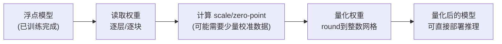
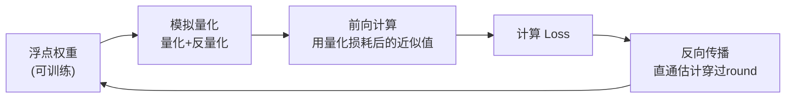
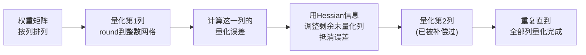

# 前置知识：模型权重量化基础——INT8、PTQ/QAT、GPTQ 与 AWQ

> **一句话**：把训练好的浮点模型权重，压缩成用更少 bit 表示的整数，用精度换显存和速度——这就是模型权重量化。本文讲清楚它的基本数学、两条主流训练策略（PTQ/QAT），以及大模型时代两个绕不开的代表方法 GPTQ 和 AWQ 的核心直觉。

**标签**: `#前置知识` `#模型量化` `#INT8` `#INT4` `#PTQ` `#QAT` `#GPTQ` `#AWQ`

## 相关阅读

- 前置：[数值精度：FP32、FP16、BF16、TF32](/前置知识/003d_前置知识_数值精度FP32_FP16_BF16_TF32) ——本文假设你已经知道浮点数是怎么存的、FP16/BF16 为什么能省一半显存。本文讲的是"浮点降到更低比特的整数"这一步，在浮点精度基础之上继续往下压
- 关联但不同：[向量量化与离散表示学习](/前置知识/001q_前置知识_向量量化与离散表示学习) ——**这是另一个完全不同的"量化"概念，见下方专门澄清**
- 关联：[KV Cache 与自回归解码](/前置知识/002m_前置知识_KV_Cache与自回归解码) ——推理时除了权重，KV Cache 也常被量化到 INT8/INT4
- 后续：[GPTQ 论文精读](/论文综述/111_GPTQ_生成式预训练模型的精确后训练量化) ——本文讲的 GPTQ 直觉在这篇精读中会展开完整的数学推导
- 后续：[神经网络量化技术全景综述](/论文综述/S30_神经网络量化技术全景综述) ——把本文和 GPTQ 精读放进更大的技术地图里系统对比

---

## 零、先澄清：这里的"量化"和"向量量化 VQ"完全是两件事

"量化"这个中文词在这个项目里对应两个**完全不同**的英文概念，容易混淆，必须先说清楚：

| | 向量量化 VQ（[另一篇前置知识](/前置知识/001q_前置知识_向量量化与离散表示学习)） | 本文讲的模型权重量化 |
|---|---|---|
| 英文 | Vector Quantization | Model Quantization / Weight Quantization |
| 解决什么问题 | **表示学习**：怎么把一个连续的高维向量，变成从有限码本里挑出来的一个离散符号（token） | **模型部署**：怎么把已经训练好的模型，每个数值参数用更少的 bit 存储和计算 |
| 典型场景 | VQ-VAE/VQ-GAN 把图像编码成离散 token，供自回归模型（如语言模型式的 Transformer）预测；机器人动作 token 化 | 把一个 7B 参数的语言模型从 FP16 压缩到 INT4，让它能塞进一张显卡、跑得更快 |
| "量化"操作对象 | 神经网络中间层的**激活向量**（latent vector） | 神经网络的**权重矩阵**（有时也包括激活值） |
| 输出是什么 | 一个离散符号的下标（如码本里第 37 号原型） | 同样是权重矩阵，只是每个数存成整数而不是浮点数，用起来和原模型几乎一样 |

一句话区分：**VQ 关心"用什么符号表示一个东西"（离散化表示学习），本文的模型量化关心"用几个 bit 存一个数字"（数值精度压缩）**。两者都叫"量化"只是因为英文原词都含 "quantization"，中文翻译撞车了，本质上是两条完全独立的技术线。如果你想学的是 VQ-VAE、离散 token 化那一套，请转到[向量量化与离散表示学习](/前置知识/001q_前置知识_向量量化与离散表示学习)；本文接下来只讲"模型权重数值精度压缩"这一件事，不再涉及 VQ。

---

## 贯穿全文的例子

> **场景**：你训练好了一个语言模型，参数量 70 亿（7B），权重原本以 FP16 存储（每个参数 2 字节，参见[数值精度前置知识](/前置知识/003d_前置知识_数值精度FP32_FP16_BF16_TF32)），总共占用约 13 GB 显存。你只有一张 8GB 显存的消费级显卡，模型根本塞不进去。你想知道：能不能把这些权重压缩到更少的 bit，让模型能跑起来，同时不要让模型变得"变傻"？

这个例子会贯穿全文——从"到底怎么把一个浮点数压成整数"的基本数学，到"压缩之后要不要重新训练"的策略选择，再到"工业界怎么把压缩误差降到最低"的具体方法。

---

## 一、为什么要做权重量化

一个模型的权重占用显存 = 参数个数 × 每个参数占用的字节数。7B 模型用 FP16 存储：

$$
7 \times 10^9 \ \text{个参数} \times 2\ \text{字节/参数} \approx 13.0\ \text{GiB}
$$

**这个公式在做什么**：算出一个具体规模的模型，用给定的数值精度存储权重需要多少显存——这是后面讨论"要不要量化、量化到多少 bit"的出发点。

::: details 📐 公式详解（点击展开）

| 子表达式 | 它是谁 | 它在干嘛 |
|---------|--------|---------|
| $7\times10^9$ | **参数总数** | 模型里所有权重数字的个数,7B 就是 70 亿个 |
| $2\ \text{字节/参数}$ | **每个数字的"体重"** | FP16 每个数占 2 字节(16 bit);如果是 FP32 就是 4 字节,INT8 是 1 字节,INT4 是 0.5 字节 |
| 两者相乘 | **总占用** | 参数个数 × 每个参数的体重 = 总共要占多少存储空间 |
| $/1024^3$ 换算成 GiB | **单位转换** | 字节数太大不直观,换算成 GB 方便和显卡显存对比 |

**用人话读**："模型有多少个数,每个数占多少字节,乘起来就是模型要占多少显存。"

**为什么是这个形式**：这是最朴素的乘法关系——存储占用天然就是"个数 × 单位大小",没有任何隐藏的复杂度。真正的复杂度在于"怎么把每个数字压缩到更少字节,同时不让模型变傻"，这正是权重量化要解决的问题。
:::

如果把每个参数从 FP16（2 字节）压到 INT8（1 字节），显存直接减半，变成约 6.5 GiB——刚好能塞进一张 8GB 显卡。如果压到 INT4（0.5 字节），只需要约 3.25 GiB，还能省出空间给推理时的中间激活值和 KV Cache（参见[KV Cache 前置知识](/前置知识/002m_前置知识_KV_Cache与自回归解码)）。

除了省显存，量化还带来速度上的好处：现代 GPU 从显存读取数据的带宽是瓶颈之一（尤其是推理时一次只生成一个 token，计算量小但要读的权重量大），权重字节数减半，读取时间也大致减半，这对推理延迟直接有帮助。

代价是什么？把浮点数压缩成整数天然会丢信息，模型的输出质量可能下降。整个量化技术的核心矛盾就是：**在多大程度上压缩权重的数值精度，同时让模型的实际表现（perplexity、下游任务准确率等）尽量不掉。**

---

## 二、量化的基本数学：从连续浮点到有限整数

### 2.1 问题：怎么把一段浮点数值映射到整数区间

假设某一层的权重值分布在 $[x_{\min}, x_{\max}]$ 这个连续区间内（比如 $[-2.3, 3.2]$），我们想把它们都映射到 INT8 能表示的整数区间 $[-128, 127]$ 上。核心思路很直接：找一个线性映射，把浮点区间"拉伸/压缩"到整数区间。

### 2.2 量化公式

$$
q = \text{round}\left(\frac{x}{s}\right) + z
$$

**这个公式在做什么**：把一个浮点数 $x$ 转换成一个整数 $q$——先用缩放系数把 $x$ 缩放到整数网格的尺度上，再四舍五入取整,最后加上一个偏移量,让整数结果落在目标整数类型（如 INT8）允许的范围内。

::: details 📐 公式详解（点击展开）

| 子表达式 | 它是谁 | 它在干嘛 |
|---------|--------|---------|
| $x$ | **原始的浮点数值** | 量化之前,某个权重(或激活)本来的样子,比如 $1.83$ |
| $s$（scale，缩放系数） | **尺子的刻度间隔** | 决定"浮点世界里的多大一段距离,对应整数世界里的 1 个格子"。$s$ 越大,整数网格越粗,精度越低,但能表示的浮点范围越大 |
| $x/s$ | **换算到整数尺度** | 把浮点值按刻度间隔换算成"应该落在整数网格的第几格"（还没取整,可能是小数） |
| $\text{round}(\cdot)$ | **就近入座** | 四舍五入到最近的整数格子——这一步天然会丢失小数部分的信息,这就是量化误差的来源 |
| $z$（zero-point，零点） | **原点的位置** | 浮点数值里的 0,对应整数网格里的第几号格子。如果浮点区间不是关于 0 对称的（比如权重集中在正数区），需要用零点把整数区间的"原点"挪到合适位置 |
| $q$ | **量化后的整数结果** | 最终存储的整数值,比如 INT8 下的某个 $[-128,127]$ 之间的整数 |

**用人话读**："把浮点数按一个固定的刻度间隔换算成格子编号，四舍五入取整，再根据零点位置做个整体平移，得到最终的整数。"

**为什么是这个形式**：量化本质上就是"用一把等间距的尺子丈量连续的数轴"——scale 决定尺子的疏密，zero-point 决定尺子放在哪个位置对齐原点。这两个参数一起定义了一个完整的线性映射，是能用最少参数描述"浮点区间→整数区间"映射的最简单方式。
:::

**scale 怎么算**：最常见的做法（也是本文后面 GPTQ、AWQ 都采用的做法）是取权重实际的最大绝对值范围，均匀映射到整数类型能表示的范围。对 INT8（范围 $[-128, 127]$，共 256 个格子）：

$$
s = \frac{x_{\max} - x_{\min}}{q_{\max} - q_{\min}} = \frac{x_{\max}-x_{\min}}{255}
$$

**这个公式在做什么**：计算出"浮点区间的总长度"和"整数区间的总长度"的比例，这个比例就是每往前挪一个整数格子，浮点世界要走多远。

::: details 📐 公式详解（点击展开）

| 子表达式 | 它是谁 | 它在干嘛 |
|---------|--------|---------|
| $x_{\max}-x_{\min}$ | **浮点世界的总跨度** | 这批要量化的数值,最大值减最小值,是这段浮点区间的总长度 |
| $q_{\max}-q_{\min}$ | **整数世界的总格子数** | INT8 是 $127-(-128)=255$，即这段整数区间总共有多少个可用的整数值 |
| 两者相除 | **每一格代表多长的浮点距离** | 浮点总跨度平分给整数总格子数,算出"一格"对应多少浮点距离,这就是 scale |

**用人话读**："浮点数值分布的总跨度，除以整数能表示的格子总数，就是每一格对应的浮点距离。"

**为什么是这个形式**：这样定义能保证浮点区间里的最大值和最小值恰好对应整数区间的两端，充分利用整数类型能表示的全部格子，不浪费任何编码空间。
:::

### 2.3 反量化：把整数还原回浮点数（近似）

存储和传输时用整数 $q$，但真正参与神经网络计算前，通常要（近似地）还原回浮点数：

$$
x \approx s(q - z)
$$

**这个公式在做什么**：把量化后存储的整数 $q$，反向转换回一个近似的浮点数值，用于实际的神经网络前向计算。

::: details 📐 公式详解（点击展开）

| 子表达式 | 它是谁 | 它在干嘛 |
|---------|--------|---------|
| $q-z$ | **去掉原点偏移** | 把整数值减掉零点偏移,还原成"离原点多少个格子" |
| $s\cdot(q-z)$ | **格子数换算回浮点距离** | 用 scale 把格子数乘回浮点世界的实际长度,得到近似的浮点值 |
| $\approx$ 而不是 $=$ | **强调这是有损的** | 因为量化时的 round 操作丢掉了小数部分,反量化不可能精确还原出原始的 $x$,只能还原出一个近似值 |

**用人话读**："把存储的整数减掉零点、乘上缩放系数，还原出一个和原始浮点数很接近但不完全相同的近似值。"

**为什么是这个形式**：这正是量化公式（2.2 节）的逆运算——量化时先减 scale 再取整再加零点，反量化就反过来先减零点再乘 scale，两者互为镜像操作，保证"量化再反量化"是一个自洽的往返过程（只是往返过程中会因为 round 产生不可逆的误差）。
:::

### 2.4 手算一遍：INT8 量化的完整过程

取一段具体的浮点数值 $[-2.3,\ 0.5,\ 1.8,\ -0.1,\ 3.2]$，量化到 INT8（范围 $[-128, 127]$）。

**第一步：确定 scale 和 zero-point。**

这批数值的 $x_{\min}=-2.3$，$x_{\max}=3.2$。按 2.2 节的 scale 公式代入数字：$s = \dfrac{3.2 - (-2.3)}{255} = \dfrac{5.5}{255} \approx 0.02157$。

零点 $z$ 的作用是让浮点里的 0 对应到整数网格上的正确位置。用 $x_{\min}$ 对应 $q_{\min}=-128$ 反推：$z = \text{round}\left(q_{\min} - \dfrac{x_{\min}}{s}\right) = \text{round}\left(-128 - \dfrac{-2.3}{0.02157}\right) = \text{round}(-128 + 106.63) = \text{round}(-21.37) = -21$。

（这两步都是直接把 2.2 节已经讲解过的 scale/zero-point 公式代入具体数字，不是新公式，所以不再重复展开逐项拆解。）

**第二步：逐个量化。**

| 原始浮点值 $x$ | $x/s$ | $\text{round}(x/s)$ | $q=\text{round}(x/s)+z$ |
|---|---|---|---|
| $-2.3$ | $-106.63$ | $-107$ | $-107+(-21)=-128$ |
| $0.5$ | $23.18$ | $23$ | $23+(-21)=2$ |
| $1.8$ | $83.45$ | $83$ | $83+(-21)=62$ |
| $-0.1$ | $-4.64$ | $-5$ | $-5+(-21)=-26$ |
| $3.2$ | $148.35$ | $148$ | $148+(-21)=127$ |

（注：INT8 存储时 $q$ 必须落在 $[-128,127]$，此例中恰好卡在两端，说明 scale/zero-point 是按这批数值的实际范围精确算出来的。）

**第三步：反量化，看误差有多大。**

| $q$ | $s(q-z)$ | 原始 $x$ | 误差 $|x - \hat{x}|$ |
|---|---|---|---|
| $-128$ | $0.02157\times(-128-(-21))=0.02157\times(-107)=-2.308$ | $-2.3$ | $0.008$ |
| $2$ | $0.02157\times(2-(-21))=0.02157\times23=0.496$ | $0.5$ | $0.004$ |
| $62$ | $0.02157\times(62-(-21))=0.02157\times83=1.790$ | $1.8$ | $0.010$ |
| $-26$ | $0.02157\times(-26-(-21))=0.02157\times(-5)=-0.108$ | $-0.1$ | $0.008$ |
| $127$ | $0.02157\times(127-(-21))=0.02157\times148=3.192$ | $3.2$ | $0.008$ |

可以看到，INT8（256 个格子覆盖整个数值范围）带来的误差量级在 $10^{-2}$ 左右，相对误差很小。这也是为什么"权重量化到 INT8 几乎不掉精度"是业界的普遍经验——格子足够密，量化噪声淹没在模型本身的容错能力里。但如果换成 INT4（只有 16 个格子），同样的数值范围下每个格子要跨越的浮点距离扩大 16 倍（$255/15\approx17$ 倍），误差会明显放大，这正是"INT4 比 INT8 更难做、更容易掉精度"的直接原因，也是后面 GPTQ、AWQ 存在的意义。

---

## 三、PTQ vs QAT：什么时候做量化

上一节讲的是"怎么把一个数值从浮点变成整数"这个数学操作本身。但一个完整的模型有成千上万个这样的数值，什么时候执行这个操作、要不要让模型"知道"自己以后会被量化，这就是 PTQ 和 QAT 两条路线的分野。

### 3.1 PTQ（Post-Training Quantization，训练后量化）

**PTQ**——训练后量化，指模型已经用浮点精度完整训练好之后，直接对训练好的权重做量化，不需要重新训练模型本身。

流程很简单：

**优点**：快。不需要梯度、不需要反向传播、不需要访问完整训练数据，通常几分钟到几小时就能量化完一个大模型（这正是本文第五节要讲的 GPTQ、AWQ 走的路线）。

**缺点**：因为不重新训练，模型没有机会"适应"量化带来的误差。如果量化位宽压得很低（比如 INT4 甚至 INT3/INT2），最朴素的 PTQ 方法（把每个数独立地就近取整，称为 **RTN, Round-To-Nearest**）容易让模型输出质量明显下降,甚至完全崩掉。

### 3.2 QAT（Quantization-Aware Training，量化感知训练）

**QAT**——量化感知训练，指在训练（或微调）过程中，就让模型"模拟"量化会带来的误差，反向传播时让模型自己学着去适应这种误差，而不是训练完了才被动接受精度损失。

具体做法：前向传播时，把权重（有时还包括激活值）先量化再反量化（即 2.3 节的近似还原），用这个"经过量化损耗"的近似值去做实际计算；反向传播时，用直通估计（Straight-Through Estimator，和 [向量量化前置知识](/前置知识/001q_前置知识_向量量化与离散表示学习#32-训练目标让码本和编码器共同进化) 里 VQ-VAE 处理不可导 $\arg\min$ 的技巧是同一个思路）让梯度绕过不可导的 round 操作，继续更新原始的浮点权重。训练若干步之后，模型的浮点权重会自动往"量化后误差最小"的方向调整。

**优点**：精度通常明显优于同等位宽的 PTQ，尤其在低比特（INT4 及以下）时差距更明显——模型有机会通过训练"填补"量化造成的信息损失。

**缺点**：慢，贵。需要完整的训练/微调流程，需要访问较大规模的训练数据，对于百亿甚至千亿参数的大模型，重新做一次 QAT 的算力成本可能和重新训练一遍相当,这在实践中往往是不可接受的。

### 3.3 两条路线的取舍

| 维度 | PTQ | QAT |
|------|-----|-----|
| 是否需要重新训练 | 不需要 | 需要（至少是微调级别的训练） |
| 所需时间 | 分钟到小时级 | 小时到天级，取决于模型规模 |
| 所需数据 | 少量校准数据（几十到几百条样本） | 较大规模的训练/微调数据 |
| 典型精度损失（同等位宽下） | 较大，位宽越低损失越明显 | 较小，模型有机会主动适应 |
| 适用场景 | 大模型（几十亿到千亿参数）的快速部署，算力/数据有限 | 模型规模可承受重训成本、对精度要求高、能拿到足够训练数据的场景 |
| 大模型时代的主流选择 | ✅ 是（GPTQ、AWQ 都是 PTQ） | 较少用于超大模型，更多用于小模型或对精度极端敏感的场景 |

在 70 亿甚至上千亿参数的大语言模型时代，**QAT 的训练成本几乎和重新预训练一遍相当，绝大多数实际的大模型量化工作都走 PTQ 路线**——这也是为什么 GPTQ 和 AWQ 这两个 2022-2023 年最具影响力的大模型量化方法，都是围绕"如何在不重新训练的前提下，把 PTQ 做得尽可能精确"这个问题设计的。它们的核心目标是：用比朴素 RTN 更聪明的方式确定每个权重该量化成什么值，把 PTQ 在低比特下的精度损失降到最小，逼近甚至部分场景下达到 QAT 的效果。

---

## 四、GPTQ 的核心直觉：用二阶信息做误差补偿

### 4.1 朴素 PTQ（RTN）的问题

最简单的 PTQ 做法是：对权重矩阵里的每一个数，独立地按 2.2 节的公式就近取整（RTN）。这个做法的问题在哪？每个权重被独立量化，量化产生的误差各自"孤立"，没有互相协调——权重矩阵里某些数被"往上舍"，某些数被"往下舍"，这些误差累积起来会让整个层的输出（权重和输入的矩阵乘法结果）明显偏离量化前的结果。在高比特（INT8）下格子够密，这个问题不明显；但在 INT4/INT3 下格子稀疏，独立舍入的累积误差就会显著影响模型输出质量，甚至在极低位宽下让模型完全失效——本文 2.4 节的手算例子已经展示了格子变稀疏时误差被放大的直觉，第六节的实际数据会展示这一效应在真实大模型上有多剧烈。

### 4.2 GPTQ 的思路：逐列量化 + 误差补偿

GPTQ（Generative Pre-trained Transformer Quantization，一种基于二阶信息的后训练量化方法）的核心洞察是：**权重矩阵里的每一列不是孤立的**——某一列的权重被量化产生了误差，这个误差可以通过调整**还没被量化的其他列**来部分抵消，从而让整个矩阵乘法的输出误差最小化。

具体直觉：把权重矩阵按列（对应输入特征的不同维度）逐一量化。每量化完一列，就计算这一列产生了多大的量化误差,然后按照"哪些还没量化的列对弥补这个误差最有效"的原则，微调那些列的浮点值（还没被量化，仍然可以自由调整）。等到轮到那些列被量化时，它们已经被提前"补偿"过，能更好地抵消前面几列积累下来的误差。

这个"用二阶信息判断该怎么补偿"具体是什么意思：模型对权重量化误差的敏感程度不是均匀的——量化某个权重对模型输出（或 loss）的影响大小，和这个权重所在位置的**曲率信息**（数学上是 loss 对权重的二阶导数，即 Hessian 矩阵）有关。Hessian 描述的是"loss 曲面在这个点附近有多陡峭、往哪个方向调整最划算"。GPTQ 借助（近似的）Hessian 信息，能精确算出"调整还未量化的列的浮点值多少，才能最大程度抵消已经量化的列引入的误差"——这比"随便调一下碰碰运气"要精确得多。

### 4.3 为什么这比朴素 RTN 好

朴素 RTN 相当于"每一列各自独立地就近取整，谁也不管谁"。GPTQ 相当于"每量化一列，就让还没轮到的列主动分担一部分误差，等它们被量化时，起点已经被校正过"。这种"边量化边补偿"的策略，让整个矩阵乘法输出的总误差被系统性地压低，而不是让误差在各列之间无序地累积。

GPTQ 论文精读中会展开这个思路完整的数学形式——包括 Hessian 具体怎么近似计算、怎么让这个过程在百亿参数模型上高效运行（原始的"逐权重都精确算一遍二阶补偿"的方法在小模型上可行，但复杂度太高，无法直接用在大模型上，GPTQ 做了一系列关键的工程简化）。这些细节留给 [GPTQ 论文精读](/论文综述/111_GPTQ_生成式预训练模型的精确后训练量化) 展开，这里只需要记住核心直觉：**GPTQ 是一种利用二阶（Hessian）信息，在逐列量化的过程中让未量化的权重主动补偿已量化权重产生的误差，从而把 PTQ 做到接近 QAT 精度的方法**。

---

## 五、AWQ 的核心直觉：不是所有权重都一样重要

### 5.1 一个反直觉的发现

AWQ（Activation-aware Weight Quantization，激活感知权重量化）的出发点和 GPTQ 完全不同。AWQ 的论文作者发现一个关键现象：**一个模型里绝大多数权重对最终输出的影响是可以被压缩的，但有一小部分权重（通常只占 0.1%~1%）异常重要——只要把这一小部分权重的量化误差控制住，整个模型的量化质量就能大幅提升**。

更反直觉的是：**怎么判断哪些权重重要，不能看权重本身的数值大小**（比如权重绝对值大就重要）——凡是按权重自身幅度来挑选"重要权重"，效果都和随机挑选差不多。真正有效的判断依据是：**这个权重对应的输入激活值的幅度有多大**。如果某个输入特征通道的激活值特别大（说明这个通道承载了比较关键的信息），那么和它相乘的那部分权重就格外重要——这正是"activation-aware"（激活感知）这个名字的来源：**权重本身的重要性，要参考它在实际计算中搭档的激活值有多大，而不是只看权重自己长什么样**。

### 5.2 怎么"保护"重要权重而不牺牲硬件效率

一个直接的想法是：把这 1% 重要权重保留成 FP16 高精度，其余 99% 权重照常量化到低比特——这确实能大幅改善量化质量，但代价是模型里同时存在两种数据类型（大部分是 INT4，一小部分是 FP16），这种"混合精度"格式在硬件上很难高效实现（GPU 的矩阵乘法内核通常假设整个矩阵是统一的数据类型）。

AWQ 提出了一个更聪明、对硬件友好的解决方案：**不改变权重的精度类型（全部照常量化到低比特），而是对每个输入通道（对应权重矩阵的每一列）乘以一个提前算好的缩放系数**，把重要通道的权重数值先放大，再量化，量化完之后再把对应的激活值除以同样的系数缩小回去，从数学上抵消掉这次缩放（因为 (权重×缩放) × (激活÷缩放) = 权重×激活，结果不变）。

**这个缩放为什么能降低量化误差**：回顾 2.2 节的量化公式，量化误差的绝对大小和 scale（也就是格子的疏密程度）成正比，但**相对误差**（误差占数值本身的比例）取决于这个数值本身的大小。把一个重要权重先乘大再量化，它在整数网格上占据的格子数变多，量化引入的相对误差就会缩小；对应的输入激活值除以同样的系数缩小，抵消掉权重被放大的影响，整体的矩阵乘法结果基本不变，但重要权重的量化损失被显著压低了。

### 5.3 GPTQ 与 AWQ 的直觉差异

| 维度 | GPTQ | AWQ |
|------|------|------|
| 核心思路 | 逐列量化，用 Hessian 二阶信息让未量化列主动补偿已量化列的误差 | 找出对激活影响大的"重要权重通道"，用逐通道缩放降低它们的量化误差 |
| 依据什么判断"该怎么处理" | 权重矩阵本身的二阶曲率信息（Hessian） | 输入激活值的幅度分布（哪些通道激活值大） |
| 是否需要反向传播/梯度 | 不需要（虽然用到二阶信息，但不需要训练时的反向传播） | 不需要 |
| 对硬件的友好程度 | 需要专门的反量化内核（论文原始版本不改变数据布局） | 缩放操作可以被吸收进权重本身，推理时几乎没有额外开销 |
| 对校准数据分布的敏感程度 | 相对更依赖校准数据（因为要精确统计二阶信息），在校准集之外的数据分布上可能过拟合校准集 | 只需要统计激活值的平均幅度，对校准数据的具体分布更鲁棒 |

两者并不互斥——事实上 AWQ 的原始论文也展示了 AWQ 可以和 GPTQ 结合使用，在极低比特（如 INT2）场景下进一步提升效果。这些具体的实验数字和方法细节，会在 [GPTQ 论文精读](/论文综述/111_GPTQ_生成式预训练模型的精确后训练量化) 和 [神经网络量化技术全景综述](/论文综述/S30_神经网络量化技术全景综述) 中展开对比。

---

## 六、可视化：位宽如何影响显存和误差

### 6.1 显存占用随位宽的变化

延续贯穿全文的 7B 模型例子，不同精度下权重占用的显存差异非常直观：

> 从 FP32 到 INT4，每降一档位宽，显存占用近似减半：FP32 需要约 26 GB，FP16/BF16 约 13 GB，INT8 约 6.5 GB，INT4 约 3.25 GB。这就是"量化"最直接、最立竿见影的收益——单靠换一种数值存储方式，同样的模型能塞进小得多的显卡。

### 6.2 量化误差随位宽的变化：RTN 会崩，GPTQ 不会

上面手算的小例子说明了"格子变稀疏，误差变大"的直觉，但在真实的百亿参数大模型上，这个效应到底有多剧烈？下图用 GPTQ 论文报告的 OPT-175B 模型在 WikiText2 数据集上的真实 perplexity（困惑度，越低代表语言模型对文本的预测越准，是衡量语言模型质量的标准指标）数据，对比朴素 RTN 和 GPTQ 在不同位宽下的表现：

> FP16 基线的 perplexity 是 8.34。降到 INT8/INT4，无论是 RTN 还是 GPTQ 都基本不掉分——格子还够密。但降到 INT3（3-bit）时，两者的差距变得极其悬殊：RTN 的 perplexity 直接飙到约 7300（模型基本失去了正常生成文本的能力），而 GPTQ 只有 8.68，几乎不受影响。这张图直观地回答了"为什么 GPTQ 这类精心设计的 PTQ 方法有存在的必要"——朴素量化在低比特下会彻底失效，而好的方法能把同样的位宽压缩推到实用的边界。

---

## 七、总结

| 概念 | 一句话核心 |
|------|-----------|
| 权重量化 | 把训练好的浮点权重压缩成低比特整数存储/计算，用精度换显存和速度 |
| 量化公式 $q=\text{round}(x/s)+z$ | 用缩放系数 $s$ 和零点 $z$，把连续浮点区间线性映射到有限整数网格 |
| PTQ | 训练完直接量化，快但位宽越低精度损失可能越明显 |
| QAT | 训练过程中模拟量化误差，模型主动适应，精度更好但成本高，大模型时代少用 |
| RTN | 最朴素的 PTQ，每个权重独立就近取整，低比特下容易崩 |
| GPTQ | 用二阶（Hessian）信息逐列量化 + 误差补偿，让 PTQ 在低比特下逼近 QAT 精度 |
| AWQ | 发现少数对激活影响大的"重要权重通道"，用逐通道缩放专门保护它们 |

区分两种"量化"的关键：**本文讲的模型权重量化是"数值精度压缩"，[向量量化 VQ](/前置知识/001q_前置知识_向量量化与离散表示学习) 是"离散化表示学习"**——两者名字撞车，本质完全不同。

## 延伸阅读

- [数值精度：FP32、FP16、BF16、TF32](/前置知识/003d_前置知识_数值精度FP32_FP16_BF16_TF32) —— 量化的起点：先理解浮点精度本身
- [向量量化与离散表示学习](/前置知识/001q_前置知识_向量量化与离散表示学习) —— 另一种完全不同的"量化"：表示学习中的离散化
- [KV Cache 与自回归解码](/前置知识/002m_前置知识_KV_Cache与自回归解码) —— 推理时 KV Cache 同样常被量化
- [GPTQ 论文精读](/论文综述/111_GPTQ_生成式预训练模型的精确后训练量化) —— 本文 GPTQ 直觉的完整数学展开
- [神经网络量化技术全景综述](/论文综述/S30_神经网络量化技术全景综述) —— PTQ/QAT/GPTQ/AWQ/GGUF 生态的系统对比
- Frantar et al., "GPTQ: Accurate Post-Training Quantization for Generative Pre-trained Transformers", arXiv:2210.17323, 2022
- Lin et al., "AWQ: Activation-aware Weight Quantization for LLM Compression and Acceleration", arXiv:2306.00978, 2023
