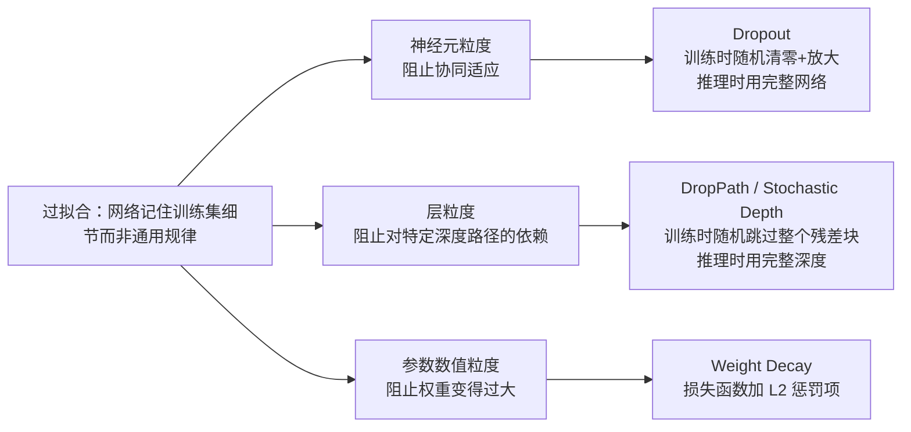

# 前置知识：Dropout 与 DropPath——神经元级和层级的随机丢弃正则化

> **一句话**：训练时随机让网络的一部分"失效"——可能是某些神经元的输出（Dropout），也可能是整个残差块（DropPath/Stochastic Depth）——逼着网络不能依赖任何单一路径就能做出正确预测,从而降低过拟合、提升泛化。本文把这两种方法的公式、训练/推理行为差异、以及背后"隐式集成"的直觉讲透。

**知识链接**：
- [方差与标准差](/前置知识/002c2_前置知识_方差与标准差) — 理解 Dropout 缩放公式为什么要保持期望不变,需要先知道期望的基本运算规则
- [期望、方差与蒙特卡洛采样](/前置知识/002c_前置知识_期望方差与蒙特卡洛采样) — Dropout 的缩放推导用到期望的线性性质
- 关联文章：[Mixup 精读](/论文综述/112_Mixup_数据增强的超越经验风险最小化) — 另一种正则化思路,在输入数据层面而不是网络结构层面做文章,本文结尾会提到两者如何组合使用
- 关联文章：[深度学习正则化方法全景综述](/论文综述/S31_深度学习正则化方法全景综述) — 本文是这篇综述里"神经元级"和"层级"两条正则化路线的完整展开

---

## 贯穿全文的例子

> **场景**：你在训练一个图像分类器——输入一张 32×32 的小图片，输出这张图片属于 10 个类别中的哪一个。网络结构是一个 20 层的卷积残差网络（每一层内部又分成好几个残差块）。你观察到训练集准确率已经到了 99.5%，但验证集准确率只有 82%——这是过拟合的典型信号：网络记住了训练集里每张图片的细节特征组合，而不是学到了"猫长什么样"这种真正能泛化的规律。
>
> 本文接下来会用这个场景反复举例：Dropout 怎么在"神经元"这个粒度上缓解这个问题，DropPath 怎么在"整个残差块"这个粒度上做同样的事，两者的训练/推理行为具体怎么算。

---

## 1. 过拟合的根源：网络学会了"依赖捷径"

先把问题讲清楚。一个卷积层的某个输出通道，如果在训练集里恰好和某个特定的、偏门的图案强相关（比如某几张训练图片的背景纹理），网络会毫不犹豫地利用这个偶然的相关性去降低训练损失——它不知道这是"捷径"还是"真正的规律"，只知道能让 loss 下降就行。

这种现象有一个专门的名字：**协同适应（co-adaptation）**——网络里的某些神经元之间形成了紧密的依赖关系,一个神经元的输出只有配合另外几个特定神经元的输出才有意义,单独拿出来毫无价值。协同适应本身不是坏事(神经网络的表达能力正是来自神经元之间的组合),但过度的协同适应意味着网络学到的是"训练集里这几个样本恰好共享的、脆弱的组合模式",而不是"任何一张猫的图片都会出现的稳健特征"。当测试图片的背景纹理和训练集不一样时,这种依赖捷径的组合模式立刻失效,于是验证集准确率远低于训练集准确率。

Dropout 和 DropPath 都是用同一个思路对抗协同适应：**训练时随机让网络的一部分"消失",逼着剩下的部分必须独立地把任务做对,不能依赖某个特定搭档的存在。**

---

## 2. Dropout：神经元粒度的随机丢弃

### 2.1 核心机制

Dropout（随机失活）是 2014 年提出的正则化方法，做法极其简单：**训练时，对某一层的每个输出，独立地以概率 $p$ 把它强制置零，剩下没被置零的部分再乘以一个缩放系数**。推理时不做任何丢弃，直接使用完整的网络输出。

用公式表达训练阶段的行为：

$$
y_{\text{train}} = \frac{1}{1-p} \cdot m \odot x, \qquad m_i \sim \text{Bernoulli}(1-p)
$$

**这个公式在做什么**：把输入向量 $x$ 的每一个分量,独立地按概率 $p$ 决定"留下"还是"清零",留下的部分再统一放大一点,补偿被清零的那部分造成的整体数值下降。

::: details 📐 公式详解（点击展开）

| 子表达式 | 它是谁 | 它在干嘛 |
|---------|--------|---------|
| $x$ | **原始输出** | 某一层（比如全连接层或卷积层）在丢弃之前的完整输出向量 |
| $m_i \sim \text{Bernoulli}(1-p)$ | **每个位置的抛硬币结果** | 对向量的第 $i$ 个分量独立抛一枚偏心硬币,以概率 $1-p$ 得到 1（保留），以概率 $p$ 得到 0（清零） |
| $m \odot x$ | **打了洞的输出** | 逐元素相乘，$m_i=0$ 的位置直接变成 0，其余位置保持原值不变 |
| $\frac{1}{1-p}$ | **补偿系数** | 因为平均有 $p$ 比例的分量被清零，剩下的分量整体乘以 $\frac{1}{1-p}$ 放大，抵消"清零"造成的整体数值缩水（第 3 节会给出具体数值验证） |
| $y_{\text{train}}$ | **训练时实际送给下一层的结果** | 每次前向传播,由于 $m$ 是随机采样的,同一个 $x$ 会得到不同的 $y_{\text{train}}$ |

**用人话读**："对这一层的每个输出神经元独立抛硬币，抛到'丢'就直接清零，抛到'留'的神经元统一放大一点，弥补被丢掉那部分造成的整体信号变弱。"

**为什么要放大剩下的部分**：如果不放大，训练时这一层输出的期望值会比推理时（不丢弃、不放大）系统性地小 $(1-p)$ 倍——训练和推理看到的数值尺度不一致，会让下一层的权重白白花精力去适应这种"训练时偏小"的假象。放大系数 $\frac{1}{1-p}$ 恰好让 $\mathbb{E}[y_{\text{train}}] = x$，训练和推理的期望完全对齐,详见下一节的推导和数值例子。
:::

### 2.2 训练与推理行为不同：数值例子

Dropout 最容易搞混的一点是：**它在训练和推理阶段的行为完全不同**。这不是无关紧要的实现细节，而是让整个方法正确工作的关键设计。

> **数值例子**：假设某一层的输出是 $x = [4, 2, 6, 8]$（4 个神经元的激活值），Dropout 概率 $p=0.5$。
>
> **训练时**：假设这一次前向传播抛硬币的结果是 $m=[1, 0, 1, 0]$（第 2、4 个神经元被丢弃）。
>
> 先逐元素相乘清零：$m \odot x = [4, 0, 6, 0]$
>
> 再乘以补偿系数 $\frac{1}{1-p} = \frac{1}{0.5} = 2$：
>
> $$y_{\text{train}} = 2 \times [4, 0, 6, 0] = [8, 0, 12, 0]$$
>
> 注意：留下的神经元（原值 4 和 6）被放大成了 8 和 12——正好是原值的 2 倍。
>
> **推理时**：不丢弃、不放大，直接用完整的原始输出：
>
> $$y_{\text{infer}} = x = [4, 2, 6, 8]$$
>
> **验证期望一致性**：训练时每个神经元有 50% 概率被丢弃（贡献 0），50% 概率被保留并放大 2 倍。以第一个神经元（原值 4）为例，它在训练时的期望输出是：
>
> $$\mathbb{E}[y_{\text{train}, 1}] = 0.5 \times 0 + 0.5 \times (2\times 4) = 0.5 \times 8 = 4$$
>
> 这正好等于推理时的输出值 4。这就是 $\frac{1}{1-p}$ 这个系数存在的全部意义：**保证"训练时随机丢弃后的期望输出"和"推理时不丢弃的完整输出"数值上完全相等**,这样网络不需要在训练和推理之间学习任何"补偿性偏移"。

这种"训练时放大补偿、推理时原样输出"的做法有一个专门名字：**Inverted Dropout（反转 Dropout）**，是目前所有深度学习框架（PyTorch、TensorFlow）的标准实现方式。历史上最早的 Dropout 论文用的是相反的做法——训练时不做任何缩放，而是在**推理时**把权重统一乘以 $(1-p)$。这两种做法在数学上是等价的（只是把缩放操作挪到了训练阶段还是推理阶段），但 Inverted Dropout 的好处是推理时完全不需要任何额外计算，直接用训练好的权重前向传播即可，这也是它成为主流实现的原因。

PyTorch 中用一行代码即可实现，训练/推理模式的切换由 `model.train()` / `model.eval()` 自动控制：

```python
import torch.nn as nn

class MLPWithDropout(nn.Module):
    def __init__(self, dim=256, p=0.5):
        super().__init__()
        self.fc1 = nn.Linear(dim, dim)
        self.dropout = nn.Dropout(p=p)  # p 是丢弃概率，不是保留概率
        self.fc2 = nn.Linear(dim, 10)

    def forward(self, x):
        x = torch.relu(self.fc1(x))
        x = self.dropout(x)  # 训练模式下随机清零+放大；eval 模式下直接原样传递
        return self.fc2(x)
```

`nn.Dropout` 内部已经实现了 2.1 节的公式：调用 `model.train()` 后它会按概率 $p$ 清零并乘以 $\frac{1}{1-p}$；调用 `model.eval()` 后它变成一个恒等映射（原样输出，不做任何操作）。这也是为什么**忘记调用 `model.eval()` 直接在验证集上跑推理**是一个经典的新手错误——如果忘了切换模式，验证时网络仍然会随机丢弃神经元，导致验证结果带有不必要的随机噪声，甚至系统性变差。

### 2.3 为什么随机丢弃能防止过拟合：隐式集成的直觉

Dropout 起作用的核心直觉可以从两个角度理解，两者说的是同一件事：

**角度一：破坏协同适应。** 因为任何一个神经元都有可能在下一次前向传播中被丢弃，其他神经元不能"赌"某个特定搭档一定在场——如果某个神经元的作用完全依赖另一个神经元的配合，一旦那个搭档被丢弃，这个神经元的输出就会变得没有意义，反而拖累 loss。网络被迫学习**对丢弃鲁棒**的特征——每个神经元都要尽量独立地对最终预测有贡献，而不是深度依赖某个特定的组合。

**角度二：隐式集成（implicit ensemble）。** 一个有 $n$ 个神经元的层，每个神经元独立地有丢或留两种状态，理论上对应 $2^n$ 种不同的"子网络"。每一步训练相当于随机采样一个子网络来更新参数——因为大部分权重在不同子网络之间是共享的，这大致相当于同时训练了指数级数量个共享权重的小网络。推理时使用完整网络（不丢弃任何神经元），这个完整网络的效果近似于把这 $2^n$ 个子网络的预测做了平均——这正是**模型集成（ensemble）能提升泛化能力**这个经典机器学习结论的直觉来源：多个独立训练的模型的平均预测，比单个模型更不容易被某个模型的个体偏差带偏。Dropout 用一份权重、一次训练，近似达到了集成多个模型的效果。

回到贯穿全文的例子：20 层卷积残差网络训练准确率 99.5%、验证准确率 82%。在每个残差块内部的全连接层或卷积层后插入 Dropout（比如 $p=0.3$），相当于同时训练大量共享权重的子网络，任何单一子网络记住训练集细节的能力被削弱，因为下一次前向传播这个具体的子网络组合大概率不会再出现——迫使网络学到的必须是"大多数子网络组合都认可"的、更普适的特征。

### 2.4 Dropout 的典型放置位置和常见坑

- **全连接层之间**：Dropout 最初就是为全连接网络设计的，效果最直接。
- **卷积层之间**：效果不如全连接层显著（因为卷积层的权重共享和局部连接本身已经有一定正则化效果），且随机丢弃单个像素级激活对空间连续的特征图影响有限——这也是后面 DropBlock、DropPath 等"结构化丢弃"方法出现的动机之一。
- **不要和 BatchNorm 简单叠加**：Dropout 依赖"训练时随机、推理时确定"这套机制，而 BatchNorm 的统计量（均值方差）本身也在训练/推理阶段有差异（训练用当前 batch 统计量，推理用滑动平均）。两者一起用时如果顺序或超参不当，容易造成方差估计的不一致，实践中通常把 Dropout 放在 BatchNorm 之后，或者干脆用更小的丢弃率。
- **丢弃率 $p$ 的经验范围**：全连接层常用 $p=0.5$，卷积层常用较小的 $p=0.1\sim0.3$，因为卷积特征图的信息密度和空间关联性和全连接层不同。

---

## 3. DropPath / Stochastic Depth：层粒度的随机丢弃

### 3.1 核心机制：整个残差块随机跳过

Dropout 在神经元这个最细的粒度上做随机丢弃。**DropPath**（也叫 **Stochastic Depth，随机深度**）把丢弃的粒度提升到"整个残差块"这个层级——训练时，以一定概率把某个残差块的计算完全跳过，只保留恒等映射（identity），相当于让网络在训练时"变浅"。

这个方法只能用在有残差连接的网络里，因为残差结构 $y = x + F(x)$ 天然提供了一条"跳过 $F(x)$ 也不会让信息完全丢失"的路径——直接输出 $x$ 本身。如果一个网络没有残差连接，随便跳过某一层会直接切断整条前向路径，网络根本无法工作。

$$
y = x + b \cdot F(x), \qquad b \sim \text{Bernoulli}(1-p_\ell)
$$

**这个公式在做什么**：给残差块的主干分支 $F(x)$（比如若干层卷积+激活函数组成的一个残差块）加一个抛硬币开关——抛到"关"就完全跳过这个残差块的计算，只把输入 $x$ 原样传给下一层；抛到"开"才正常执行 $F(x)$ 并加到 $x$ 上。

::: details 📐 公式详解（点击展开）

| 子表达式 | 它是谁 | 它在干嘛 |
|---------|--------|---------|
| $x$ | **这个残差块的输入** | 来自上一层的特征图，无论这个块被跳过还是正常执行，$x$ 都会被保留下来 |
| $F(x)$ | **残差块的主干计算** | 一整个子网络（比如两层卷积+BatchNorm+ReLU），代表这个块"想学的额外变换" |
| $b \sim \text{Bernoulli}(1-p_\ell)$ | **这个块专属的开关** | 一次抛硬币，结果是 0 或 1；概率 $1-p_\ell$ 得到 1（执行），概率 $p_\ell$ 得到 0（跳过）。注意这是**对整个块只抛一次硬币**，不是对块内每个神经元单独抛 |
| $b \cdot F(x)$ | **被开关控制的主干输出** | $b=1$ 时就是正常的 $F(x)$；$b=0$ 时整块输出直接变成 0，相当于这个块在这一次前向传播中"不存在" |
| $y = x + b\cdot F(x)$ | **残差块的最终输出** | $b=0$ 时 $y=x$（恒等映射，等价于整个块被跳过）；$b=1$ 时 $y=x+F(x)$（正常残差连接） |

**用人话读**："给每个残差块装一个整体开关，训练时随机把某些块直接跳过（只留一条恒等映射的路），推理时所有块都正常打开。"

**为什么是"整个块一起抛硬币"而不是"块内每个神经元各自抛硬币"**：如果块内每个神经元独立丢弃，那和普通 Dropout 没有本质区别——仍然是神经元粒度的正则化。DropPath 的设计目标是让网络在训练时"变浅"（少几层有效计算路径），逼着网络的整体深度具备一定的冗余度，不能依赖"必须经过所有 $L$ 层才能算对"这种脆弱的假设——这是和 Dropout 完全不同层面的正则化,详见 3.3 节。
:::

### 3.2 训练/推理行为差异（和 Dropout 完全对应）

DropPath 在训练/推理阶段的行为差异，和 Dropout 遵循同一套逻辑，只是丢弃的对象从"单个神经元"换成了"整个块"：

- **训练时**：每个残差块独立以概率 $p_\ell$ 被整体跳过（$b=0$，只保留恒等映射），概率 $1-p_\ell$ 正常执行。
- **推理时**：所有残差块都正常执行（不跳过任何块），但按照 Dropout 同样的"保持期望不变"原则，需要把主干分支的输出乘以 $(1-p_\ell)$ 补偿——因为训练时主干分支平均只有 $(1-p_\ell)$ 的概率生效。

> **数值例子**：假设某个残差块的跳过概率 $p_\ell=0.2$（即 80% 概率正常执行，20% 概率跳过）。某一时刻输入 $x=10$，主干计算结果 $F(x)=5$。
>
> **训练时**（假设这一次抛硬币结果是"执行"，$b=1$）：$y_{\text{train}} = 10 + 1\times 5 = 15$。如果这一次抛硬币结果是"跳过"（$b=0$）：$y_{\text{train}} = 10 + 0 = 10$。
>
> **推理时**（所有块都执行，但补偿主干分支的输出）：$y_{\text{infer}} = x + (1-p_\ell)\cdot F(x) = 10 + 0.8\times 5 = 14$。
>
> **验证期望一致性**：训练时 $y$ 的期望是 $\mathbb{E}[y_{\text{train}}] = 0.2\times 10 + 0.8\times 15 = 2 + 12 = 14$，恰好等于推理时的 14。同样是"训练时随机丢弃的期望输出 = 推理时补偿后的完整输出"这套逻辑,和 2.2 节 Dropout 的数值验证方式完全一致，只是丢弃的对象换成了整个残差块的主干分支。

实践中很多开源实现（比如 timm 库的 `DropPath`）直接借用了 Dropout 的写法思路：训练时对通过的样本乘以 $\frac{1}{1-p_\ell}$ 放大而不是在推理时缩小——这在数学上和上面的写法是等价的（Inverted 风格 vs 传统风格的区别，参见 2.2 节），二者本质相同，只是把缩放操作放在训练还是推理阶段。

### 3.3 为什么要按"层"随机丢弃：和 Dropout 解决的是不同的问题

DropPath 最初的论文（Stochastic Depth，2016）观察到一个现象：**极深的残差网络（比如 1000+ 层）在训练时容易出现梯度消失和训练速度慢的问题，即使有残差连接缓解了梯度传播,深度本身仍然带来训练效率上的负担。**

DropPath 的直觉分两层：

1. **训练时"变浅"，加速训练、缓解梯度问题**：如果每个残差块都有一定概率被跳过，训练时网络的**期望深度**比总层数更浅（比如 100 层网络，每层跳过概率 0.5，训练时平均只有约 50 层在真正参与计算），前向和反向传播路径变短，训练速度和梯度流动都得到改善。
2. **推理时"变深"，获得集成效果**：推理时使用完整的深度网络，这在效果上近似于把训练过程中随机遇到的大量"更浅的子网络"做了平均——这正是 2.3 节 Dropout 隐式集成直觉在"层"这个粒度上的翻版：Dropout 集成的是"不同神经元组合的子网络"，DropPath 集成的是"不同深度路径的子网络"。

**DropPath 和 Dropout 的关键区别**在于丢弃粒度对应的"假设"不同：Dropout 假设"任何单个神经元都不应该是不可替代的"，DropPath 假设"任何单个残差块（哪怕是很深的一层）都不应该是网络必须经过的唯一路径"。两者可以同时使用、互不冲突——现代很多大型视觉 Transformer（如 ViT、Swin Transformer）和卷积网络（如 EfficientNet）会同时用 Dropout（放在 MLP 内部）和 DropPath（放在每个 Transformer block 或残差块的输出端）。

### 3.4 丢弃概率随深度递增：Stochastic Depth 的一个常见设计

实践中，DropPath 的丢弃概率 $p_\ell$ 通常不是所有层统一的常数，而是**随着层数 $\ell$ 线性递增**——网络越靠后的层，被跳过的概率越大：

$$
p_\ell = \frac{\ell}{L} \cdot p_{\max}
$$

**这个公式在做什么**：给网络的第 $\ell$ 个残差块（总共 $L$ 个块）分配一个跳过概率，这个概率随层数线性增长，最浅层几乎不跳过，最深层跳过概率最高（接近设定的上限 $p_{\max}$）。

::: details 📐 公式详解（点击展开）

| 子表达式 | 它是谁 | 它在干嘛 |
|---------|--------|---------|
| $\ell$ | **当前是第几个残差块** | 从 1 编号到 $L$，网络越靠后 $\ell$ 越大 |
| $L$ | **网络总的残差块数量** | 一个固定的常数，比如一个 50 层网络可能有 $L=16$ 个残差块 |
| $\ell/L$ | **相对深度位置** | 从接近 0（网络最开始）线性增长到 1（网络最末尾） |
| $p_{\max}$ | **最深层的跳过概率上限** | 一个超参数，常见取值在 0.1～0.5 之间 |
| $p_\ell$ | **第 $\ell$ 层实际使用的跳过概率** | 浅层几乎总是执行（$p_\ell$ 接近 0），深层经常被跳过（$p_\ell$ 接近 $p_{\max}$） |

**用人话读**："网络越靠前的层越重要、越少跳过；越靠后的层跳过的概率越高。"

**为什么深层要更容易被跳过**：网络浅层通常负责提取基础的、通用的特征（边缘、纹理），这些特征几乎所有后续任务都依赖，跳过浅层的代价很大；网络深层负责的是更抽象、更任务特化的特征组合，冗余度天然更高（很多深层的贡献可以被其他深层部分替代），所以让深层更频繁地被跳过，既保留了训练加速和正则化的好处，又不会严重破坏网络学习基础特征的能力。这是 Stochastic Depth 原论文验证过的经验设计，不是理论上唯一正确的选择，但是被后续大量工作采纳的默认做法。
:::

代码实现上，DropPath 通常写成一个独立的模块，插在残差块的输出端：

```python
import torch
import torch.nn as nn

class DropPath(nn.Module):
    """随机丢弃整个残差分支（Stochastic Depth）"""
    def __init__(self, drop_prob: float = 0.0):
        super().__init__()
        self.drop_prob = drop_prob

    def forward(self, x):
        if self.drop_prob == 0.0 or not self.training:
            return x  # 推理时或 drop_prob=0 时，原样返回，不做任何操作
        keep_prob = 1 - self.drop_prob
        # 对 batch 里每个样本独立抛硬币（形状 [batch_size, 1, 1, ...]，方便广播）
        shape = (x.shape[0],) + (1,) * (x.ndim - 1)
        random_tensor = keep_prob + torch.rand(shape, dtype=x.dtype, device=x.device)
        random_tensor.floor_()  # 向下取整，得到 0 或 1 的开关
        return x / keep_prob * random_tensor  # 除以 keep_prob 做训练时的补偿缩放

class ResBlockWithDropPath(nn.Module):
    def __init__(self, channels, drop_prob=0.1):
        super().__init__()
        self.conv1 = nn.Conv2d(channels, channels, 3, padding=1)
        self.conv2 = nn.Conv2d(channels, channels, 3, padding=1)
        self.drop_path = DropPath(drop_prob)

    def forward(self, x):
        residual = self.conv2(torch.relu(self.conv1(x)))
        return x + self.drop_path(residual)  # 主干分支整体被 DropPath 控制
```

代码里值得注意的两处细节：一是 `random_tensor` 的形状是 `[batch_size, 1, 1, ...]`——这意味着**同一个 batch 内的不同样本，独立决定是否跳过这个块**，但对同一个样本而言，整个残差分支（所有通道、所有空间位置）作为一个整体被跳过或保留，不会出现"跳过一半通道"这种情况；二是 `x / keep_prob * random_tensor` 这一行正是 3.2 节推导的"训练时放大补偿"，和 `nn.Dropout` 的 Inverted 实现思路完全一致。

---

## 4. 补充：Weight Decay 作为另一种正则化思路

Dropout 和 DropPath 都是通过"随机让网络的一部分失效"来防止过拟合，思路是在**网络结构/计算路径**上做文章。还有一大类正则化方法走的是完全不同的路子：直接在**损失函数**里加一项惩罚，约束参数本身的数值不要变得过大。**权重衰减（Weight Decay）** 是这类方法里最常见、最基础的一种。

它的做法是在原始损失函数 $\mathcal{L}_{\text{task}}$（比如分类任务的交叉熵）后面加一个惩罚项：

$$
\mathcal{L}_{\text{total}} = \mathcal{L}_{\text{task}} + \frac{\lambda}{2}\|\theta\|_2^2
$$

**这个公式在做什么**：在原本的任务损失后面加一项"权重过大惩罚"，让梯度下降在追求任务准确的同时，也被推着把权重数值往小的方向拉。

::: details 📐 公式详解（点击展开）

| 子表达式 | 它是谁 | 它在干嘛 |
|---------|--------|---------|
| $\mathcal{L}_{\text{task}}$ | **任务本身的损失** | 比如分类任务的交叉熵，衡量预测和真实标签差多少 |
| $\theta$ | **网络的全部可训练权重** | 把所有层的权重矩阵拉平拼成一个大向量 |
| $\|\theta\|_2^2$ | **权重的平方和** | 每个权重数值先平方再全部加起来，数值越大说明权重整体越"用力" |
| $\lambda$ | **惩罚力度的超参数** | $\lambda$ 越大，网络越被迫把权重压小；$\lambda=0$ 时完全退化成没有 Weight Decay 的普通训练 |
| $\mathcal{L}_{\text{total}}$ | **实际拿去做梯度下降的总损失** | 任务损失和权重惩罚各自的梯度会同时叠加影响每一步的参数更新方向 |

**用人话读**："除了要预测准，还要求权重数值别太大——两个目标一起用梯度下降去满足。"

**为什么惩罚"平方和"而不是别的形式**：平方和求梯度后是权重本身的线性函数（$\nabla_\theta \|\theta\|_2^2 = 2\theta$），每一步更新时相当于把权重朝原点方向"衰减"一个固定比例——这正是"权重衰减"这个名字的来源，实现起来只需要在梯度更新公式里多加一项 $-\lambda\theta$，计算和理解都足够简单。
:::

这里 $\theta$ 是网络的所有可训练权重，$\|\theta\|_2^2$ 是所有权重的平方和（L2 范数的平方），$\lambda$ 是一个超参数，控制惩罚力度有多大。这一项的直觉很直接：**如果某个权重的绝对值特别大，说明网络在"用力"依赖这个权重去拟合一些细节——这种细节很可能是训练集特有的噪声,而不是真正的普适规律**。惩罚大权重，相当于强迫网络在"能同样降低任务损失"的多组权重里，优先选择数值更小、更平滑的那一组，这类权重通常对应更简单、更不容易过拟合的函数。

Weight Decay 和 Dropout/DropPath 完全可以同时使用——它们分别从"参数数值"和"计算路径的随机性"两个不同角度对网络施加约束，互不冲突,实践中几乎所有训练配置都会同时用上两者（比如 AdamW 优化器自带的权重衰减 + 网络里的 Dropout 层）。Weight Decay 涉及的优化器细节（比如它和 L2 正则化在 Adam 类优化器里并不完全等价）和其他正则化方法的完整对比，请参见 [深度学习正则化方法全景综述](/论文综述/S31_深度学习正则化方法全景综述)。

---

## 5. Dropout vs DropPath 对比总结

| 维度 | Dropout | DropPath / Stochastic Depth |
|------|---------|------------------------------|
| 丢弃粒度 | 单个神经元 / 单个激活值 | 整个残差块的主干分支 |
| 适用网络结构 | 任意网络（全连接、卷积均可） | 必须有残差连接（$y=x+F(x)$ 结构） |
| 训练时行为 | 每个神经元独立抛硬币，清零后放大 $\frac{1}{1-p}$ | 每个残差块整体抛硬币，跳过时只保留恒等映射，保留时放大 $\frac{1}{1-p_\ell}$ |
| 推理时行为 | 使用完整网络，不丢弃、不缩放 | 使用完整深度，主干分支按 $(1-p_\ell)$ 补偿缩放（或用 Inverted 写法在训练时就补偿好） |
| 解决的核心问题 | 神经元之间的协同适应（co-adaptation） | 极深网络的训练效率（梯度流动、训练速度）+ 深度冗余的正则化 |
| 直觉类比 | 隐式集成大量"神经元子集不同"的子网络 | 隐式集成大量"深度不同"的子网络 |
| 典型丢弃率 | 全连接层 0.5，卷积层 0.1~0.3 | 通常 0.1~0.3，且随深度线性递增 |



---

## 延伸阅读

- [Mixup：数据层面的正则化](/论文综述/112_Mixup_数据增强的超越经验风险最小化) — 和本文的"结构随机丢弃"思路完全不同，Mixup 在输入数据和标签上做线性插值来平滑决策边界
- [深度学习正则化方法全景综述](/论文综述/S31_深度学习正则化方法全景综述) — 把 Dropout、DropPath、Weight Decay、Label Smoothing、Mixup/CutMix 放在同一个技术图谱里系统对比，并给出"遇到什么过拟合表现该选哪种方法"的决策指南
- [方差与标准差](/前置知识/002c2_前置知识_方差与标准差) — 理解 Dropout/DropPath 缩放公式的数学基础
