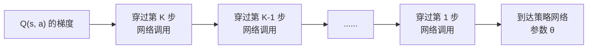

# 前置知识：梯度消失与梯度爆炸——为什么长链反向传播会失控

> **一句话**：反向传播算梯度时，如果一个量要经过 $N$ 次"网络调用"才能连回参数，梯度就要连乘 $N$ 个雅可比矩阵。连乘和普通数字的幂运算是同一种数学结构——只要每一步的"放大系数"不精确等于 1，$N$ 一大，梯度就会指数级炸开（梯度爆炸）或指数级归零（梯度消失）。这不是某次训练运气不好，是这种"长链式计算图"结构性的必然后果。

**知识链接**：
- [雅可比矩阵与微分运动学](/前置知识/003b_前置知识_雅可比矩阵与微分运动学) — 雅可比矩阵是什么、怎么算的基础定义
- [常微分方程 ODE——直觉与数值求解](/前置知识/001b_前置知识_常微分方程ODE直觉与数值求解) — 本文举例用到的多步数值积分
- [为什么扩散策略难以 RL 微调](/前置知识/000f_前置知识_为什么扩散策略难以RL微调) — 本文讨论的问题在扩散策略 RL 中的一个具体应用场景
- [FQL：Flow Q-Learning](/前置知识/001p_前置知识_FQL_Flow_Q_Learning) — 另一个具体应用场景，用蒸馏绕开这个问题
- [GLU 门控线性单元与 SwiGLU、GeGLU](/前置知识/005g_前置知识_GLU门控线性单元与SwiGLU_GeGLU) — 门控机制的通用背景，缓解方案会用到类似思想

---

## 贯穿全文的例子

> **场景**：想象一列长长的传话游戏。第一个人对第二个人说一句话，第二个人转述给第三个人，以此类推，一直传到第 $N$ 个人。如果每次转述都会把音量放大 10%（比如越传越激动），传了 20 次之后，音量会变成原来的 $1.1^{20}\approx 6.7$ 倍——已经震耳欲聋。反过来，如果每次转述声音都会缩小 10%（比如越传越小声），传 20 次之后，音量只剩 $0.9^{20}\approx 0.12$ 倍——最后一个人几乎听不到任何东西。
>
> 神经网络训练中的梯度反向传播，在数学结构上和这个传话游戏完全一样：只是"传的话"变成了梯度信号,"转述"变成了乘一个雅可比矩阵，"传的人数" $N$ 变成了计算图里从最终输出到某个参数之间要经过的步骤数。

---

## 一、背景：为什么反向传播会出现"连乘"结构

### 1.1 链式法则的本质就是连乘

神经网络训练靠反向传播（backpropagation）算梯度，反向传播的数学基础是微积分的链式法则：如果 $y$ 依赖 $x_1$，$x_1$ 依赖 $x_2$，$x_2$ 依赖 $x_3$……一路依赖到 $\theta$（要优化的参数），那么 $y$ 对 $\theta$ 的梯度，就是这条依赖链上每一步"局部导数"的乘积。

对于一个只有几层的普通前馈网络，这条链很短（几层到几十层），现代的初始化方法、归一化层、残差连接已经把这个问题控制得很好。但当计算图里出现"同一个网络（或同一组操作）被反复调用很多次，且每次调用的输出是下一次调用的输入"这种结构时，链条长度会一下子变得很长，问题就重新浮现。这种结构在深度学习里有两个最常见的来源：

1. **循环神经网络（Recurrent Neural Network, RNN）沿时间展开**：RNN 处理一个长度为 $L$ 的序列时，每一步都用同一组参数把"上一步的隐藏状态"更新成"这一步的隐藏状态"。训练时要把这 $L$ 步依赖关系全部展开成一条链，再反向传播梯度，这个过程叫**沿时间反向传播**（Back-Propagation Through Time, BPTT）。链长就是序列长度 $L$。
2. **多步数值积分/多步生成过程**：比如扩散模型的去噪链、Flow Matching 的 ODE 数值积分——都是用同一个网络反复调用 $K$ 次，一步步把一个起点"推"到终点。如果想让某个下游的损失（比如 RL 里的 Q 值）反向传播回这个网络的参数，梯度就必须连续穿过全部 $K$ 次调用。链长是积分/去噪步数 $K$。

无论具体场景是哪一种，数学结构完全一样：**梯度要连乘 $N$ 个雅可比矩阵**，$N$ 就是链长。下面先建立最核心的直觉，再看这个"连乘"具体是怎么写、怎么算的。

### 1.2 直觉先行：为什么连乘天生危险

数字的幂运算 $r^N$ 有一个大家都熟悉的性质：只要 $r$ 不精确等于 1，$N$ 一大，$r^N$ 就会朝两个极端之一狂奔——$r>1$ 时指数爆炸，$r<1$ 时指数归零。这不需要 $r$ 偏离 1 很多，哪怕只偏离 10%（$r=1.1$ 或 $r=0.9$），当 $N$ 达到几十的量级，$r^N$ 已经是天壤之别（下一节会算具体数字）。

反向传播里的"连乘"和这个幂运算是同一种数学结构，只是把普通数字换成了雅可比矩阵。每一步的雅可比矩阵，可以粗略地理解成"这一步局部把梯度信号放大了多少倍"——如果这个"局部放大系数"持续大于 1，连乘 $N$ 次后梯度会指数级放大，这就是**梯度爆炸**（exploding gradient）；如果持续小于 1，梯度会指数级缩小到几乎为零，这就是**梯度消失**（vanishing gradient）。$N$ 越大，这种复合效应越极端——这正是本文要讲透的核心机制。

---

## 二、核心原理：梯度连乘的精确形式

### 2.1 用链式法则把"连乘"写出来

考虑一条长度为 $N$ 的计算链：$\mathbf{h}_0 \xrightarrow{f_\theta} \mathbf{h}_1 \xrightarrow{f_\theta} \mathbf{h}_2 \to \cdots \to \mathbf{h}_N$，每一步都用**同一个**网络 $f_\theta$（参数共享，这是 RNN 和多步生成模型的共同特征）把上一个状态映射成下一个状态。现在想知道：最终状态 $\mathbf{h}_N$ 对参数 $\theta$ 有多敏感？

$$
\frac{\partial \mathbf{h}_N}{\partial \theta} = \sum_{k=1}^{N} \left(\prod_{j=k+1}^{N} \frac{\partial \mathbf{h}_j}{\partial \mathbf{h}_{j-1}}\right) \frac{\partial f_\theta(\mathbf{h}_{k-1})}{\partial \theta}\bigg|_{\text{第 }k\text{ 步}}
$$

**这个公式在做什么**：这是"参数的一次微小改动，经过 $N$ 步接力传递后，最终对 $\mathbf{h}_N$ 造成多大影响"的精确公式——每一步对参数的直接贡献，都要乘上"从这一步到终点"沿途所有雅可比矩阵的连乘，才能算出它对最终输出的总贡献。

::: details 📐 公式详解（点击展开）

| 子表达式 | 它是谁 | 它在干嘛 |
|---------|--------|---------|
| $\dfrac{\partial \mathbf{h}_j}{\partial \mathbf{h}_{j-1}}$ | **单步雅可比矩阵** | 第 $j$ 步网络调用，把"上一步状态的微小变化"转换成"这一步状态的微小变化"的线性映射，每一步都来自同一个 $f_\theta$ |
| $\prod_{j=k+1}^{N}(\cdot)$ | **接力传递链** | 从第 $k$ 步一路到第 $N$ 步，把沿途每一步的雅可比矩阵依次乘起来，代表"信号从第 $k$ 步传到终点，被放大/缩小了多少倍" |
| $\dfrac{\partial f_\theta(\mathbf{h}_{k-1})}{\partial \theta}$ | **第 k 步的直接贡献** | 忽略传递效应，只看参数在第 $k$ 步这一次调用中，对当前这一步输出的直接影响 |
| $\sum_{k=1}^N(\cdot)$ | **汇总所有步的贡献** | 参数 $\theta$ 在 $N$ 步里的每一次调用都产生了影响，把这些影响（各自经过传递链放大/缩小后）加总，才是最终的总梯度 |

**用人话读**："参数的总影响力，等于它在每一步产生的直接影响，乘上'从那一步到最后一步'沿途所有传递环节的放大倍数，再把所有步的贡献加起来。"

**为什么是这个形式**：这就是链式法则应用到一条 $N$ 步的计算链上的直接结果——每往回传一步就要多乘一个雅可比矩阵，这是矩阵微积分里最基本的推导，不依赖任何特殊假设。
:::

这个公式看起来复杂，但真正决定"梯度会不会失控"的，只有中间那一项——**连乘的雅可比矩阵的数量和量级**。后面几步（离终点近）的传递链短，连乘项数少；最早期的几步（离终点远）传递链长，连乘项数接近 $N$。这正是为什么"最早期步骤的梯度最容易失控"：它们承受的连乘次数最多。

### 2.2 把连乘简化成一个数字，直观感受失控速度

矩阵的连乘不好直接想象，但矩阵连乘和数字连乘的失控速度规律是一样的（矩阵版本用"谱范数"或"最大特征值"衡量整体的放大效果，方向问题略去不影响这里的核心直觉）。用一个具体数字例子感受一下：假设每一步的"局部放大系数"是 $r$，链长 $N$：

$$
r^N \Big|_{r=1.1,\,N=20} \approx 6.73, \qquad r^N \Big|_{r=0.9,\,N=20} \approx 0.122
$$

**这个公式在做什么**：把抽象的"连乘"代入两组具体数字，直观感受 20 步之后，哪怕单步偏差只有 10%，最终结果也已经天差地别。

::: details 📐 公式详解（点击展开）

| 子表达式 | 它是谁 | 它在干嘛 |
|---------|--------|---------|
| $r=1.1$ | **单步偏大 10%** | 每经过一步，梯度信号被放大到原来的 1.1 倍 |
| $r=0.9$ | **单步偏小 10%** | 每经过一步，梯度信号被压缩到原来的 0.9 倍 |
| $N=20$ | **链长** | 反向传播需要连续穿过 20 次网络调用才能传到起点 |
| $1.1^{20}\approx6.73$ | **爆炸后的结果** | 20 步接力后，信号被放大到近 7 倍 |
| $0.9^{20}\approx0.122$ | **消失后的结果** | 20 步接力后，信号只剩原来的 12% |

**用人话读**："哪怕每一步只偏离 10%，20 步接力下来，最终信号会被放大到将近 7 倍，或者被压缩到只剩 12%。"

**为什么是这个形式**：指数运算的本质就是连续自乘。如果链长从 20 增加到 50 甚至 100（比如 DDPM 扩散模型常见的去噪步数），$1.1^{50}\approx117$、$1.1^{100}\approx13780$——单步 10% 的偏差在长链条下会被放大到完全不可用的量级。真实网络里的"放大系数"还会随输入、随训练阶段变化，不会稳稳停在某个固定值附近，所以长链条下梯度爆炸或消失几乎是必然事件，不是偶然的坑。
:::

下图把这个规律画成曲线，横轴是链长 $N$，纵轴用对数坐标展示梯度相对于起点被放大/缩小的倍数：


> 四条曲线分别对应局部放大系数 1.1、1.3（爆炸，红色/粉色）和 0.9、0.7（消失，蓝色/青色），灰色虚线是"没有任何变化"的基准。可以看到，越偏离 1，指数曲线越早脱离基准线——0.7 这条曲线在 $N=10$ 左右已经跌到几乎贴着横轴，1.3 这条曲线则在同样的位置已经窜到图外。这就是为什么"链长"本身是一个需要认真对待的设计变量：链越长，对"局部放大系数必须非常接近 1"的要求就越苛刻。

### 2.3 矩阵情形下多了什么

上面用标量简化只是为了建立直觉。真实网络里每一步的雅可比矩阵是一个矩阵而不是一个数字,梯度是一个高维向量而不是一个数。这时"局部放大系数"对应的是雅可比矩阵的**谱范数**（矩阵能把向量拉伸的最大倍数）或者更长期地看是它的**最大特征值**——道理完全一样：如果这个量持续大于 1，向量在反复乘这个矩阵的过程中长度会指数增长；持续小于 1，长度会指数衰减。矩阵情形唯一多出来的复杂性是"方向"：不同方向可能被放大/缩小的程度不同，长期来看向量会逐渐对齐到"放大系数最大的那个方向"上，但这个细节不影响本文要传达的核心结论,可以暂时略过。

---

## 三、为什么这是"结构性"问题，不是简单调参能解决的

### 3.1 和普通深层网络的关键区别

有人可能会问：现代深层网络动辄上百层，不也是很长的计算链吗，为什么没有这个问题？关键区别在于：**普通深层网络的每一层通常有独立的参数、独立的归一化（LayerNorm/BatchNorm）、以及残差连接**，这些设计让每一层的"局部放大系数"可以被显式地控制在 1 附近（残差连接尤其关键——它保证了"至少有一条恒等路径", 局部放大系数天然贴着 1）。

而 RNN 沿时间展开、以及多步生成模型的去噪/积分链，**每一步用的是同一组参数、同一个网络**——这意味着无法像普通深层网络那样给每一步单独调整归一化或加残差连接来"校准"局部放大系数；同一组参数在不同时间步的行为高度相关，一旦训练把这组参数推向"局部放大系数偏离 1"的区域，所有步骤会一起朝着爆炸或消失的方向复合，没有其他层能中和这个效应。

### 3.2 链长决定了问题的严重程度

| 链长 $N$（近似量级） | 典型场景 | 梯度稳定性 |
|---|---|---|
| 1（单次前向） | 普通策略网络、Consistency Model 一步生成 | 稳定，和普通网络训练没有区别 |
| 4-10 | Flow Matching / Rectified Flow 的推理步数 | 边界地带，需要小心处理（见第五节） |
| 20-100 | DDPM 扩散模型去噪步数、较长序列的 RNN | 高风险，直接反传通常不可行 |
| 数百至数千 | 长序列 RNN（如整篇文档逐词处理） | 几乎必然失控，实践中极少直接这样训练 |

链长每增加一个量级，对"局部放大系数必须精确贴近 1"的要求都会指数级变得更苛刻——这正是为什么"减少链长"本身会成为许多实际方法的核心设计目标（第五节会具体展开）。

---

## 四、工程实操：怎么观测、怎么缓解

### 4.1 先学会观测：梯度范数曲线

在实际训练代码里，最直接的排查方法是**打印/记录每一步（或每一层）的梯度范数**，沿着反向传播的方向画成一条曲线：

```python
# 伪代码：在反向传播过程中记录每一步梯度的范数
grad_norms = []
for step in reversed(range(N)):  # 从最后一步往回走
    grad = compute_gradient_at_step(step)
    grad_norms.append(grad.norm().item())
# 把 grad_norms 画成曲线：横轴是 step，纵轴用 log scale
# 如果曲线随着离终点越远（回传越深）呈指数增长/衰减，说明存在梯度爆炸/消失
```

这段代码的核心思路很简单：反向传播本身就是从最后一步逐步往回算梯度，只要在每一步顺手记录梯度的范数（长度），训练结束后把这条曲线画出来，就能直接看到"连乘效应"是否在实际训练里发生——曲线呈指数形状（在对数坐标下变成直线）就是最明确的信号。这个诊断方法在下一篇 [SAC-Flow 精读](/论文综述/079_SAC_Flow_用SAC直接训练Flow策略) 里的实验图（消融实验 Fig. 6a）中就是这么画出来的。

### 4.2 常见缓解手段

| 手段 | 原理 | 局限 |
|------|------|------|
| **梯度裁剪**（Gradient Clipping） | 当梯度范数超过阈值时，整体缩放到阈值以内 | 只能防止极端爆炸，不能解决消失，也不能提升信息传递质量 |
| **门控机制**（如 LSTM 的遗忘门/输入门、GRU） | 让网络自己学一个 0~1 之间的"开关"，为梯度提供一条可以"抄近道"跳过部分连乘的路径 | 需要额外参数和结构改动 |
| **残差/跳跃连接** | 提供一条恒等路径，让局部放大系数天然贴近 1 | 需要能设计出合理的跳跃连接结构 |
| **缩短链长** | 从根本上减少连乘次数——比如用更少的积分/去噪步数，或者只对链的最后几步反传（而不是全部） | 需要重新设计生成过程本身（如从 DDPM 换成 Flow Matching/Consistency Model） |
| **换一种不需要连乘反传的训练方式** | 直接绕开这条长链——比如用蒸馏训练一个单步网络，或者用不需要梯度穿过整条链的策略优化方法 | 需要设计新的训练目标，见下一节的具体例子 |

**为什么门控机制能提供"抄近道"**：以 LSTM 为例，它的隐藏状态更新是 $c_t = f_t \odot c_{t-1} + i_t \odot \tilde{c}_t$（$f_t$ 是遗忘门，$\odot$ 是逐元素乘）——如果遗忘门 $f_t$ 学到接近 1，这一步的"局部放大系数"就天然贴近 1（对应上面表格里"跳跃连接"的效果），梯度可以几乎不衰减地流过这一步，不需要依赖非线性激活函数的雅可比矩阵碰巧接近 1。这正是 LSTM/GRU 相比 vanilla RNN 能训练更长序列的核心原因。

---

## 五、应用场景：这个问题在真实系统里长什么样

### 5.1 场景一：训练 RNN 处理长序列

这是这个问题最早、最经典的应用场景。用 RNN 处理一句很长的话或一段很长的时间序列时，BPTT 需要把梯度沿着序列长度 $L$ 反向传播回去。$L$ 达到几十甚至上百时，梯度消失让模型学不到"相距很远的两个 token 之间的依赖关系"（比如一句话开头设定的主语，到句尾才用到，但梯度早就消失了，模型学不会这个关联）；梯度爆炸则直接导致训练发散。LSTM/GRU 用门控机制缓解了这个问题（详见上一节），但没有从根本解决"必须严格顺序计算、无法并行"的问题——这后来推动了 Transformer 架构的出现。

### 5.2 场景二：机器人策略学习中，梯度反传穿过多步生成链

这是本文写作的直接动机。当扩散策略（Diffusion Policy）或 Flow Matching 策略被用作强化学习（RL）里的 Actor 时，如果想直接用 Critic 的 $Q$ 值梯度端到端训练这个策略网络，梯度就必须从 $Q(s,a)$ 一路反传，穿过全部 $K$ 步去噪/积分调用，才能到达策略网络的参数——这条反传路径的长度正好是 $K$，和一个 $K$ 步的 RNN 做 BPTT 是完全相同的数学结构。



不同方法对这个问题给出了不同答案，正好对应上一节表格里的几种缓解思路：

| 方法 | 应对策略 | 对应的缓解思路 |
|------|---------|---------------|
| DQL（Diffusion Q-Learning） | 直接对全部 $K\approx20$ 步做 BPTT | 不缓解，直接硬扛，实践中训练不稳定（详见 [为什么扩散策略难以 RL 微调](/前置知识/000f_前置知识_为什么扩散策略难以RL微调) 第四节） |
| [FQL（Flow Q-Learning）](/前置知识/001p_前置知识_FQL_Flow_Q_Learning) | 蒸馏一个单步学生网络，只对学生（链长 $N=1$）做 RL 更新 | 缩短链长到极限 |
| Consistency Model 类方法 | 把多步生成蒸馏成一步生成 | 缩短链长到极限 |
| [SAC-Flow](/论文综述/079_SAC_Flow_用SAC直接训练Flow策略) | 用 GRU 式门控（Flow-G）或 Transformer 残差结构（Flow-T）重新参数化速度场网络 | 门控机制/残差连接，让 Flow 策略也能像 LSTM 一样"抄近道" |
| DPPO 类方法 | 只对去噪链的最后几步做 PPO 式的近端更新，不做完整 BPTT | 只对链的末尾（更短的子链）反传 |

其中 SAC-Flow 的做法直接呼应了第四节讲的"门控机制"思路——它把 Flow 策略的速度场网络重新设计成类似 GRU 的结构，让每一步的雅可比矩阵可以通过学到的门控值主动贴近 1，从而让梯度可以稳定地反传穿过全部 $K$ 步 Euler 积分，不需要退而求其次去蒸馏或截断链长。这也是为什么 SAC-Flow 论文的消融实验（用第四节讲的"梯度范数曲线"诊断方法）显示：不加门控的 Naive Flow 梯度范数随着反传深度指数增长，而加了门控的 Flow-G/Flow-T 全程保持稳定。

---

## 六、总结

| 概念 | 一句话总结 |
|------|-----------|
| 问题的根源 | 反向传播要连乘 $N$ 个雅可比矩阵，$N$ 是计算链的长度 |
| 失控的条件 | 每一步的"局部放大系数"只要不精确等于 1，$N$ 一大就会指数级偏离基准 |
| 大于 1 的后果 | 梯度爆炸——训练发散，数值溢出 |
| 小于 1 的后果 | 梯度消失——远处的参数收不到任何有效更新信号 |
| 为什么普通深层网络没这个问题 | 每层独立参数 + 归一化 + 残差连接，可以显式控制局部放大系数 |
| 为什么 RNN/多步生成模型容易犯这个问题 | 同一组参数在链上被反复调用，无法逐层单独校准 |
| 核心缓解思路 | 缩短链长（蒸馏/一步生成）、给梯度开一条"抄近道"（门控/残差）、只截断反传部分链条、梯度裁剪兜底 |

**判断标准（自查）**：如果你的模型里存在"同一个网络被连续调用 $N\ge10$ 次，且下游想直接对这个链条整体做端到端梯度更新"的结构，就应该主动检查是否存在本文讨论的问题——观测梯度范数曲线是最直接的排查手段。

---

## 延伸阅读

- [为什么扩散策略难以 RL 微调](/前置知识/000f_前置知识_为什么扩散策略难以RL微调) ← 梯度消失/爆炸在扩散策略 RL 中的具体表现
- [FQL：Flow Q-Learning](/前置知识/001p_前置知识_FQL_Flow_Q_Learning) ← 用蒸馏（缩短链长到 1）绕开这个问题的完整方法
- [SAC-Flow：用 SAC 直接端到端训练 Flow 策略](/论文综述/079_SAC_Flow_用SAC直接训练Flow策略) ← 用门控机制直接解决这个问题，而不是绕开它
- [GLU 门控线性单元与 SwiGLU、GeGLU](/前置知识/005g_前置知识_GLU门控线性单元与SwiGLU_GeGLU) ← 门控机制的通用设计思想
- [状态空间模型 SSM 与选择性扫描](/前置知识/005h_前置知识_状态空间模型SSM与选择性扫描) ← 另一种绕开 BPTT 顺序计算限制的架构思路
