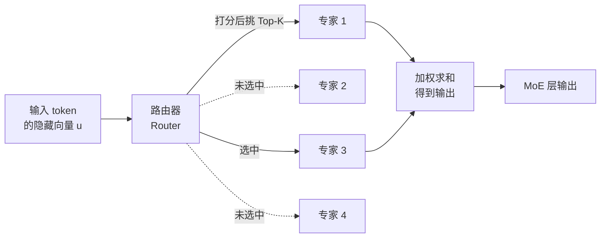

# 前置知识：稀疏专家混合（Mixture-of-Experts, MoE）

> **一句话**：MoE 把 Transformer 里那个又大又全连接的前馈网络（FFN），换成一排小型 FFN（称为"专家"），每个 token 只挑其中的少数几个专家来算——这样总参数量可以做得很大（容纳更多知识），但单次前向的计算量只跟被激活的少数专家有关，几乎不增加。

**前置概念**：
- [FFN 前馈网络：Transformer 为什么需要一个"逐 token 加工站"](/前置知识/005m_前置知识_FFN前馈网络与Transformer的两阶段设计) — MoE 替换的就是这个模块
- [知识蒸馏基础](/前置知识/000v_前置知识_知识蒸馏基础) — 与 MoE 无直接关系，但同属"如何在有限算力下装下更多能力"这条主线

---

## 贯穿全文的例子

> 场景：一个语言模型要处理各种各样的 token——有的是英文单词，有的是代码符号，有的是数学公式里的希腊字母，有的是中文汉字。
>
> 如果用一个统一的 FFN 去加工所有这些 token，这个 FFN 就得"什么都懂一点"：既要懂英语语法，又要懂代码缩进，还要懂数学。它的每个神经元都在被各种毫不相干的模式反复拉扯。
>
> MoE 的想法很朴素：与其让一个"全才"疲于奔命，不如养一批"专才"——专家 A 擅长代码符号，专家 B 擅长中文，专家 C 擅长数学。每来一个 token，先有个"调度员"（路由器）看一眼它是什么，把它交给最合适的一两个专家去处理。
>
> 全文都用这个"调度员分派 token 给专家"的画面来理解。

---

## 一、从一个 FFN 到一排专家：MoE 想解决什么

标准 Transformer 每一层里有一个 [FFN](/前置知识/005m_前置知识_FFN前馈网络与Transformer的两阶段设计)，它对每个 token 独立做一次"升维—非线性—降维"的加工。想让模型更强，最直接的办法是把这个 FFN 做得更宽（隐藏层更大）。但 FFN 是稠密的：只要它变宽，**每一个** token 经过它时的计算量都同比例上涨。参数翻倍，算力就翻倍。

MoE 打破了"参数量"和"计算量"的这种绑定。它的核心观察是：一个 token 其实用不着整张大 FFN 的全部能力——处理一个中文汉字时，那些专门学英语拼写规律的神经元基本是浪费的。既然如此，不如把一张大 FFN 拆成很多张小 FFN（专家），每个 token 只激活其中跟它相关的少数几张。

这样一来：

- **总参数量**（所有专家加起来）可以做得非常大，模型能"记住"的知识就多；
- **单次前向的计算量**只由被激活的那几个专家决定，跟总专家数几乎无关。

这就是所谓的"稀疏激活"——参数是稠密堆积的，激活是稀疏挑选的。

> 路由器给每个专家打分，只有得分最高的少数专家（图中专家 1、3）被真正激活并参与计算，其余专家（虚线）这一步完全不算。计算量因此只跟"选几个"有关，跟"总共有几个"无关。

---

## 二、路由器：怎么决定 token 交给谁

路由器是 MoE 里唯一"做决策"的部件，它本质上是一个很小的线性层。给定第 $\ell$ 层里第 $t$ 个 token 的隐藏向量 $u_{\ell,t}$，路由器为每个专家算一个打分（logit），再据此挑选专家。

先看打分怎么来。路由器为第 $j$ 个专家维护一个可学习向量 $e_{\ell,j}$（相当于这个专家的"名片"），token 和名片做点积，就得到这个 token 有多适合交给这个专家：

$$
z_{\ell,j}(u_{\ell,t}) = u_{\ell,t}^{\top} e_{\ell,j}
$$

**这个公式在做什么**：用 token 向量和每个专家的"特征名片"做内积，内积越大说明这个 token 越匹配这个专家。

::: details 📐 公式详解（点击展开）

| 子表达式 | 它是谁 | 它在干嘛 |
|---------|--------|---------|
| $u_{\ell,t}$ | **待分派的 token** | 第 $\ell$ 层第 $t$ 个 token 的隐藏向量，即"这次要处理的东西" |
| $e_{\ell,j}$ | **专家 $j$ 的名片** | 一个可学习向量，训练中逐渐变成"我这个专家擅长处理什么样的 token" |
| $u^{\top}e$（内积） | **匹配度打分器** | 两个向量方向越一致，内积越大——即 token 越像专家的专长 |
| $z_{\ell,j}$ | **原始得分（logit）** | 还没归一化的匹配分，越大越该选这个专家 |

**用人话读**："让 token 和每个专家的名片比一比，比得越像的专家，得分越高。"

**为什么用内积**：内积是最轻量的相似度度量，路由器要对每个 token、每个专家都算一遍，必须足够便宜；且它可微，专家名片 $e_{\ell,j}$ 能随训练自动学出分工。
:::

拿到每个专家的得分后，需要把它变成"要不要选、选了以后占多大权重"。这里有一个关键设计选择：**用 sigmoid 还是 softmax 把 logit 变成亲和度**。传统 MoE 用 softmax，让所有专家的权重加起来等于 1；而 [DeepSeek-V3](/论文综述/104_DeepSeekV2_MLA多头潜在注意力) 一系的做法改用 sigmoid，逐个专家独立打分：

$$
s_{\ell,j}(u_{\ell,t}) = \operatorname{Sigmoid}(z_{\ell,j}(u_{\ell,t}))
$$

**这个公式在做什么**：把每个专家的原始得分单独压到 0~1 之间，得到"这个 token 有多想要这个专家"的独立信号，专家之间不互相抢份额。

::: details 📐 公式详解（点击展开）

| 子表达式 | 它是谁 | 它在干嘛 |
|---------|--------|---------|
| $z_{\ell,j}$ | **原始匹配分** | 上一步内积得到的、可正可负的实数 |
| $\operatorname{Sigmoid}(\cdot)$ | **独立打分闸门** | 把每个专家的分单独挤进 0~1，不看别的专家脸色 |
| $s_{\ell,j}$ | **token 对专家 $j$ 的亲和度** | 越接近 1 越想要，越接近 0 越不想要 |

**用人话读**："对每个专家单独问一句'这个 token 想不想要你'，答案是一个 0 到 1 的分，各专家的答案互不影响。"

**为什么用 sigmoid 而不是 softmax**：softmax 会强制所有专家的权重加起来等于 1，专家之间是"零和竞争"——一个专家分多了，别的就必然分少，容易出现少数专家赢家通吃、其余专家学不到东西的"路由坍塌"。sigmoid 让每个专家独立表态，缓解了这种恶性竞争。
:::

下面这张图直观展示两者的区别：sigmoid 只看某个专家自己的 logit，softmax 看的是专家之间 logit 的**差距**。

> 左图：sigmoid 门控下，专家 $j$ 的亲和度只取决于它自己的 logit $z_j$，抬高别的专家不会压低它。右图（两专家切片）：softmax 门控下，专家 1 拿到的权重取决于它和专家 2 的 logit 差距——这就是"竞争"，一方涨另一方必然跌。sigmoid 的独立性正是缓解路由坍塌的关键。

---

## 三、Top-K 稀疏：只激活少数专家

亲和度算完，MoE 并不会把所有专家都用上——那就退化成稠密网络、失去了省算力的意义。它只保留亲和度最高的 $K$ 个专家（$K$ 通常是 1、2、8 这种小数），其余全部置零、这一步完全不参与计算。被选中的专家集合记作 $\mathcal{R}(u_{\ell,t})$。

被选中的这 $K$ 个专家，各自的输出再按亲和度加权求和。为了让权重之和为 1（否则不同 token 激活的专家数一样但总幅度会漂移），在这 $K$ 个里做一次归一化：

$$
g_{\ell,j}(u_{\ell,t}) = \frac{s_{\ell,j}(u_{\ell,t})}{\sum_{k \in \mathcal{R}(u_{\ell,t})} s_{\ell,k}(u_{\ell,t})}, \quad j \in \mathcal{R}(u_{\ell,t})
$$

**这个公式在做什么**：在"被选中的那 $K$ 个专家"内部把亲和度重新缩放成加起来为 1 的权重，决定每个入选专家的话语权大小。

::: details 📐 公式详解（点击展开）

| 子表达式 | 它是谁 | 它在干嘛 |
|---------|--------|---------|
| $s_{\ell,j}$ | **入选专家的亲和度** | 分子，这个专家本来的"想要程度" |
| $\sum_{k \in \mathcal{R}} s_{\ell,k}$ | **入选专家亲和度总和** | 分母，只对被 Top-K 选中的那几个求和，落选的不算 |
| $g_{\ell,j}$ | **归一化后的混合权重** | 这个专家在最终加权和里占的比例，$K$ 个权重加起来 = 1 |

**用人话读**："把入选的几个专家的亲和度按比例摊成权重，谁想要得多谁话语权就大，但总话语权固定为 1。"

**为什么只在入选专家内部归一化**：如果对全部专家归一化，落选专家的分数也会稀释权重，破坏"只用 $K$ 个"的稀疏语义；只在入选集合里归一化，才能保证无论哪 $K$ 个被选中，输出幅度都是可比的。
:::

---

## 四、共享专家 + 路由专家：既要通用又要专精

如果所有专家都是"路由专家"（要靠抢才轮得到），会有一个隐患：那些**所有 token 都需要的通用能力**（比如基本的语法结构、常识）会被迫在多个专家里重复学习，造成参数浪费。

DeepSeek 一系的解法是把专家分成两类，也是 [LingBot-VLA 2.0](/论文综述/139_LingBotVLA2_从基础到应用的实用VLA) 动作专家采用的结构：

- **共享专家（shared expert）**：数量很少（常常就 1 个），对**每个** token 都激活，专门承载"人人都要用"的通用先验；
- **路由专家（routed expert）**：数量很多，每个 token 只通过 Top-K 挑其中少数，承载"分场景才需要"的专精能力。

一个 MoE 层的完整输出就是"共享专家的贡献 + 入选路由专家的加权贡献"：

$$
m_{\ell}(u_{\ell,t}) = E_{\ell}^{(s)}(u_{\ell,t}) + \lambda \sum_{j \in \mathcal{R}(u_{\ell,t})} g_{\ell,j}(u_{\ell,t})\, E_{\ell,j}^{(r)}(u_{\ell,t})
$$

**这个公式在做什么**：给每个 token 先垫一份所有人都有的"通用底座"（共享专家），再叠上它专门挑中的几个专家的加权意见。

::: details 📐 公式详解（点击展开）

| 子表达式 | 它是谁 | 它在干嘛 |
|---------|--------|---------|
| $E_{\ell}^{(s)}(u_{\ell,t})$ | **通用底座** | 共享专家，对每个 token 都算一遍，提供人人都要的通用能力 |
| $E_{\ell,j}^{(r)}(u_{\ell,t})$ | **专精意见** | 第 $j$ 个路由专家对这个 token 的加工结果 |
| $g_{\ell,j}$ | **专精意见的话语权** | 上一节归一化得到的混合权重 |
| $\lambda$ | **专精整体音量旋钮** | 一个标量，统一调节"路由专家这一路"相对共享专家的强度 |
| $\sum_{j \in \mathcal{R}}$ | **只累加入选专家** | 落选专家不出现在这个和里，保证稀疏 |

**用人话读**："输出 = 一份人人都有的通用加工，加上这个 token 亲自挑的几个专家的加权意见（整体音量由 $\lambda$ 控制）。"

**为什么要有共享专家这一项**：通用能力集中放到共享专家里学一次，路由专家就不用各自重复造轮子，可以把容量全部投到"分场景专精"上，参数利用率更高。
:::

其中每个专家（无论共享还是路由）内部通常是一个 SwiGLU 结构的小型 MLP：

$$
E(u) = W_{\mathrm{down}}\big(\operatorname{SiLU}(W_{\mathrm{gate}} u) \odot W_{\mathrm{up}} u\big)
$$

**这个公式在做什么**：这是单个专家内部的加工方式——用一路带 SiLU 激活的"门"去调制另一路线性变换，再降维输出，是现代 Transformer FFN 的标准形式。

::: details 📐 公式详解（点击展开）

| 子表达式 | 它是谁 | 它在干嘛 |
|---------|--------|---------|
| $W_{\mathrm{up}} u$ | **内容通路** | 把 token 升维，产生待加工的"原料" |
| $\operatorname{SiLU}(W_{\mathrm{gate}} u)$ | **门控通路** | 另一路升维后过 SiLU 激活，产生 0 附近平滑的"开关强度" |
| $\odot$ | **逐元素调制** | 用门控强度去缩放内容，实现"该放行的放行、该压制的压制" |
| $W_{\mathrm{down}}$ | **降维收口** | 把加工后的高维结果压回原维度 |

**用人话读**："一路算内容、一路算开关，两路逐元素相乘后再降回原来的维度。"

**为什么专家的中间宽度比稠密 FFN 更窄**：因为有很多个专家分担容量，每个专家不需要很宽，窄专家反而更容易学出"专精"而非"全才"。
:::

---

## 五、负载均衡：别让少数专家累死、多数专家闲死

MoE 有个天然的失衡倾向：训练早期偶然表现好的几个专家会被路由器越选越多，越选越强，最终形成"赢家通吃"——少数专家承担了几乎所有 token，其余专家几乎没被训练过，形同虚设。这既浪费参数，也让分布式训练里某些计算设备过载、某些空转。

传统解法是在主损失之外加一个**辅助负载均衡损失**，惩罚专家分配的不均衡。但这个辅助损失会和"把动作/语言学好"这个主目标打架——为了均衡而牺牲了模型本该学的东西。

### 5.1 无辅助损失的均衡：给每个专家一个"选拔偏置"

DeepSeek-V3 提出、[LingBot-VLA 2.0](/论文综述/139_LingBotVLA2_从基础到应用的实用VLA) 采用的 **auxiliary-loss-free（无辅助损失）** 方案更巧妙：它不往损失函数里塞任何东西，而是给每个专家 $j$ 维护一个**选拔偏置** $b_{\ell,j}$，只在"选拔"环节动手脚，不碰"打分"环节。

关键在于把两件事拆开：

- **谁被选中**（Top-K 的比较）用"亲和度 + 偏置"：

$$
\mathcal{R}(u_{\ell,t}) = \operatorname{TopK}_j\big(s_{\ell,j}(u_{\ell,t}) + b_{\ell,j},\; K\big)
$$

**这个公式在做什么**：挑专家时，在每个专家的真实亲和度上临时加一个偏置——冷门专家偏置调高、抢手专家偏置调低，从而人为地把 token 匀给冷门专家。

::: details 📐 公式详解（点击展开）

| 子表达式 | 它是谁 | 它在干嘛 |
|---------|--------|---------|
| $s_{\ell,j}$ | **真实亲和度** | token 本来有多想要这个专家 |
| $b_{\ell,j}$ | **选拔偏置** | 一个调节旋钮：专家太忙就调低、太闲就调高，只影响"能不能入选" |
| $s_{\ell,j} + b_{\ell,j}$ | **带偏置的选拔分** | 仅用于排序挑 Top-K，不用于算权重 |
| $\operatorname{TopK}_j(\cdot, K)$ | **选拔器** | 取选拔分最高的 $K$ 个专家 |

**用人话读**："挑专家时给冷门专家悄悄加分、给热门专家减分，逼着 token 也去光顾冷门专家。"

**为什么偏置只进选拔、不进权重**：如果偏置也进入权重计算，就等于人为篡改了模型对专家的真实信任度，会污染输出；只让它影响"入选与否"，被选中之后仍按真实亲和度 $s$ 算权重（见第三节的 $g_{\ell,j}$），既均衡了负载又不扭曲模型判断。
:::

### 5.2 偏置怎么更新：看谁忙谁闲，反向微调

偏置不是学出来的，而是根据实际负载**手动调**的。训练中统计每个专家累计被分到多少 token（记作 $n_{\ell,j}$），每隔一段就和"平均负载"比一比：比平均忙的调低偏置，比平均闲的调高偏置。

$$
b_{\ell,j} \leftarrow b_{\ell,j} - \gamma \cdot \operatorname{sign}\!\Big(n_{\ell,j} - \tfrac{1}{N_r}\sum_{k=1}^{N_r} n_{\ell,k}\Big)
$$

**这个公式在做什么**：把每个专家的实际负载和全体平均负载比较，忙的专家把偏置往下调一格、闲的往上调一格，逐步把负载拉平。

::: details 📐 公式详解（点击展开）

| 子表达式 | 它是谁 | 它在干嘛 |
|---------|--------|---------|
| $n_{\ell,j}$ | **专家 $j$ 的实际负载** | 一段时间内累计分到的 token 数 |
| $\frac{1}{N_r}\sum_k n_{\ell,k}$ | **平均负载** | 所有 $N_r$ 个路由专家的平均，即"理想均衡值" |
| $n_{\ell,j} - \text{平均}$ | **忙闲偏差** | 正数=比平均忙，负数=比平均闲 |
| $\operatorname{sign}(\cdot)$ | **只看方向不看大小** | 只取 +1/−1，避免一次调太猛导致震荡 |
| $\gamma$ | **调节步长** | 每次微调偏置的幅度，越小越稳越慢 |

**用人话读**："每隔一阵盘点各专家忙闲，比平均忙就把它的偏置降一小格、比平均闲就升一小格，慢慢把大家的负载拉到差不多。"

**为什么用 sign 而不是按偏差大小成比例调**：用符号只调固定的一小步 $\gamma$，更新平滑、不易震荡；如果按偏差大小成比例，早期负载差异巨大时会一次调过头，反而把负载甩到另一个极端。更新后通常还会把整个偏置向量做一次中心化（减去均值），防止所有偏置一起漂移。
:::

---

## 六、总结

| 组件 | 作用 | 一句话记忆 |
|------|------|-----------|
| 稀疏激活 | 解绑参数量与计算量 | 参数堆很多，每次只用少数 |
| 路由器 | 决定 token 交给谁 | token 和专家名片做内积打分 |
| Sigmoid 路由 | 逐专家独立打分 | 缓解 softmax 的零和竞争与坍塌 |
| Top-K | 只激活少数专家 | 保持稀疏，省算力 |
| 共享专家 | 承载通用先验 | 每个 token 都用，避免重复造轮子 |
| 路由专家 | 承载专精能力 | 靠 Top-K 抢，分场景才上 |
| 无辅助损失均衡 | 拉平专家负载 | 只调"选拔偏置"，不污染主损失和权重 |

MoE 的核心价值：在算力预算固定的前提下，用"稀疏激活"把有效参数量做大，从而装下更多知识；而共享/路由专家分工与无辅助损失负载均衡，则解决了"专家会不会退化成全才、会不会赢家通吃"这两个落地难题。

---

## 延伸阅读

- [FFN 前馈网络：Transformer 为什么需要一个"逐 token 加工站"](/前置知识/005m_前置知识_FFN前馈网络与Transformer的两阶段设计)
- [DeepSeek-V2：多头潜在注意力（MLA）深度精读](/论文综述/104_DeepSeekV2_MLA多头潜在注意力) — 同一系列工作里的另一项核心设计
- [LingBot-VLA 2.0：从基础到应用的实用 VLA](/论文综述/139_LingBotVLA2_从基础到应用的实用VLA) — 把 loss-free MoE 用作 VLA 动作专家的落地案例
