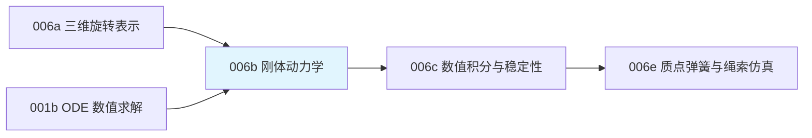

# 前置知识：刚体动力学——牛顿-欧拉方程与惯性张量

> **一句话**：牛顿第二定律 $F=ma$ 描述"力怎么改变物体的移动"，但一根扳手不仅会被推着走，还会被拧着转——描述"力矩怎么改变物体的转动"需要一个新方程（欧拉方程），而这个方程里"转动有多难"这件事，由一个叫惯性张量的矩阵来刻画。本文把刚体的完整运动方程讲透，是写一个刚体物理仿真器的核心数学基础。

**知识链接**：
- [三维旋转表示：旋转矩阵、四元数与角速度](/前置知识/006a_前置知识_三维旋转表示_旋转矩阵四元数与角速度) — 本文的角速度 $\boldsymbol\omega$ 和姿态更新直接用到上一篇的结论
- [正运动学与 DH 参数](/前置知识/003a_前置知识_正运动学与DH参数) — 齐次变换矩阵和坐标系变换的基础
- [常微分方程 ODE——直觉与数值求解](/前置知识/001b_前置知识_常微分方程ODE直觉与数值求解) — 刚体运动方程本质是一组 ODE
- [拉格朗日力学与欧拉-拉格朗日方程](/前置知识/008c_前置知识_拉格朗日力学与欧拉拉格朗日方程) — 下游：从单刚体扩展到带关节约束的整机能量建模
- [机械臂动力学方程：M、C、g 与关节力矩](/前置知识/008d_前置知识_机械臂动力学方程M_C_g与关节力矩) — 下游：多连杆动力学的标准工程形式
- [正动力学、逆动力学与递归刚体算法](/前置知识/008e_前置知识_正动力学逆动力学与递归刚体算法) — 下游：沿刚体树高效计算力矩和加速度
- 下游：[物理仿真数值积分：辛积分与能量稳定性](/前置知识/006c_前置知识_物理仿真数值积分_辛积分与能量稳定性) — 本文推出的方程需要专门的数值方法求解才稳定

---

## 贯穿全文的例子

> **场景**：还是那块悬挂在机械臂末端的长方体积木，尺寸 $0.2\text{m}\times0.1\text{m}\times0.05\text{m}$，质量 $1\text{kg}$。机械臂突然对积木施加一个力（作用在积木边缘而不是正中心），我们想知道：积木的质心会往哪加速？积木会绕哪根轴开始转动、转动加速度是多少？这正是刚体动力学要回答的问题——把"力"翻译成"质心的加速度"和"角速度的变化率"。

---

## 一、把刚体运动拆成两部分：平移 + 转动

### 1.1 为什么要拆开

一个刚体在空间中的完整运动状态需要 6 个自由度：质心位置 $\mathbf{p}\in\mathbb{R}^3$（3 个自由度）和姿态 $R\in SO(3)$（3 个自由度，参见 [三维旋转表示](/前置知识/006a_前置知识_三维旋转表示_旋转矩阵四元数与角速度)）。刚体动力学的核心结论是：**只要选择质心作为参考点，刚体的平移运动和转动运动可以完全解耦分析**——质心的加速度只取决于合力，和力矩无关；角速度的变化率只取决于合力矩，和合力无关（只要合力矩是绕质心算的）。这个解耦性质极大简化了仿真的实现：可以把"质心怎么移动"和"绕质心怎么转"当成两个独立的子问题分别求解。

### 1.2 平移部分：牛顿第二定律

$$
\mathbf{F} = m\,\dot{\mathbf{v}}
$$

**这个公式在做什么**：合力等于质量乘以质心加速度——这就是牛顿第二定律，描述"力怎么让质心动起来"。

::: details 📐 公式详解（点击展开）

| 子表达式 | 它是谁 | 它在干嘛 |
|---------|--------|---------|
| $\mathbf F$ | **合力** | 作用在刚体上所有外力的向量和（重力、机械臂施加的力、接触力等） |
| $m$ | **质量** | 刚体的总质量，是一个标量，不随时间变化 |
| $\dot{\mathbf v}$ | **质心加速度** | 质心速度对时间的导数 |

**用人话读**："把所有作用在物体上的力加起来，等于质量乘以质心的加速度——这和质点力学完全一样,刚体的质心运动可以当成一个质点来算。"

**为什么只看质心**：质心是刚体的"质量加权平均位置"，可以证明（对刚体上每个微元求 $\sum m_i\mathbf a_i=\mathbf F_{\text{total}}$ 再化简）任意刚体的质心运动方程和一个"把全部质量集中在质心的质点"完全相同，这正是刚体动力学能把"平移"这一半和转动完全解耦的数学基础。
:::

这部分和质点力学没有任何区别，唯一的要求是 $\mathbf F$ 是"合力"——包括重力、外部施加力、接触力等所有力的向量和，且力矩不影响这个方程。

---

## 二、角动量与力矩：转动的"$F=ma$"

### 2.1 角动量：转动版本的动量

线性运动中"动量" $\mathbf{p}_{\text{lin}} = m\mathbf{v}$ 描述"移动的惯性有多大"。转动中对应的量是**角动量**（angular momentum）$\mathbf{L}$，描述"转动的惯性有多大"：

$$
\mathbf{L} = I\,\boldsymbol\omega
$$

**这个公式在做什么**：把角速度 $\boldsymbol\omega$（转动的快慢方向）通过一个矩阵 $I$ 转换成角动量 $\mathbf L$（转动携带的"惯性"）——这里的 $I$ 不是标量，而是一个矩阵,因为刚体绕不同轴转动的"难易程度"不一样。

::: details 📐 公式详解（点击展开）

| 子表达式 | 它是谁 | 它在干嘛 |
|---------|--------|---------|
| $\boldsymbol\omega$ | **角速度** | 上一篇讲过的，描述转动方向和快慢 |
| $I$ | **惯性张量** | $3\times3$ 矩阵，本文第三节详细讲解，编码了"绕不同轴转动分别有多难" |
| $\mathbf L$ | **角动量** | 转动状态携带的"转动惯性"，是一个三维向量 |

**用人话读**："角速度乘上惯性张量，得到角动量——如果惯性张量在各个方向都一样（球体），这就退化成标量乘法；但一般刚体绕不同轴转动的难度不同，所以要用矩阵。"

**为什么不是标量**：想象转动一根铅笔——绕笔尖到笔尾的长轴转很容易（惯性小），绕垂直于笔身的轴转（让笔"翻筋斗"）却很吃力（惯性大）。这种"方向依赖"的惯性特性，标量乘法无法表达,必须用矩阵——这正是下一节要讲的惯性张量存在的原因。
:::

### 2.2 欧拉方程：转动版本的牛顿第二定律

角动量的变化率等于合力矩：

$$
\boldsymbol\tau = \dot{\mathbf{L}} = \frac{d}{dt}(I\boldsymbol\omega)
$$

**这个公式在做什么**：合力矩驱动角动量发生变化——这是欧拉方程最原始的形式，是转动世界里的"$F=ma$"。

::: details 📐 公式详解（点击展开）

| 子表达式 | 它是谁 | 它在干嘛 |
|---------|--------|---------|
| $\boldsymbol\tau$ | **合力矩** | 所有外力对质心的力矩之和，$\boldsymbol\tau=\sum \mathbf r_i\times\mathbf F_i$（力臂叉乘力） |
| $\dot{\mathbf L}$ | **角动量的变化率** | 角动量对时间的导数 |

**用人话读**："施加在物体上的合力矩，等于角动量随时间变化的速度——转得越'费力'，说明力矩越大或角动量变化越快。"

**为什么力矩是力臂叉乘力**：力矩衡量的是"力让物体绕某点转动的效果"，同样大小的力作用在离转轴更远的地方（力臂更大）产生的转动效果更强，叉乘 $\mathbf r\times\mathbf F$ 恰好同时编码了力臂长度、力的大小、以及两者夹角（只有垂直于力臂的力分量才有转动效果）——这正是杠杆原理的向量化表达。
:::

### 2.3 难点：惯性张量在世界坐标系下会随时间变化

这个方程看起来简单，但有一个隐藏的麻烦：惯性张量 $I$**不是常数**——它描述"刚体的质量分布相对某个坐标系是怎样的"，如果用世界坐标系描述，刚体转动时，它相对世界坐标系的质量分布在不断变化，所以世界坐标系下的 $I_{\text{world}}(t)$ 是随时间变化的，直接对 $I\boldsymbol\omega$ 求导会牵扯出 $\dot I$ 这个复杂的量。

**解决办法**：改到**物体坐标系**（body frame，随刚体一起转动、原点固定在质心的坐标系）下描述。物体坐标系下，惯性张量 $I_{\text{body}}$ 是一个**常数矩阵**（因为质量分布相对物体自身永远不变），这大大简化了方程——这也是几乎所有物理仿真引擎的标准实现方式。

在物体坐标系下，完整的欧拉方程是：

$$
I_{\text{body}}\,\dot{\boldsymbol\omega}_{\text{body}} + \boldsymbol\omega_{\text{body}} \times \left(I_{\text{body}}\,\boldsymbol\omega_{\text{body}}\right) = \boldsymbol\tau_{\text{body}}
$$

**这个公式在做什么**：这是欧拉方程在物体坐标系下的完整形式——多出来的叉乘项，正是"坐标系本身在转动"这个事实带来的额外修正力矩。

::: details 📐 公式详解（点击展开）

| 子表达式 | 它是谁 | 它在干嘛 |
|---------|--------|---------|
| $I_{\text{body}}\dot{\boldsymbol\omega}_{\text{body}}$ | **"正常"的角加速度响应** | 如果惯性张量真的是常数（在物体坐标系下确实是），这一项就是欧拉方程的全部 |
| $\boldsymbol\omega_{\text{body}}\times(I_{\text{body}}\boldsymbol\omega_{\text{body}})$ | **陀螺力矩项（旋转参考系修正）** | 因为物体坐标系本身在随刚体转动（是一个非惯性/旋转参考系），求导时多出这一项，物理上表现为陀螺仪的进动效应 |
| $\boldsymbol\tau_{\text{body}}$ | **物体坐标系下的合外力矩** | 把世界坐标系下的力矩转换到物体坐标系表示 |

**用人话读**："在物体自己的坐标系里看，角加速度乘惯性张量，加上一个由当前角速度自己产生的'陀螺修正项'，两者加起来等于外部施加的力矩。"

**为什么会多出一个叉乘项**：这是把 $\frac{d}{dt}(I_{\text{body}}\boldsymbol\omega_{\text{body}})$ 在一个旋转参考系里求导时的标准结果——数学上类似于"在旋转坐标系里求导，需要加上 $\boldsymbol\omega\times(\cdot)$ 修正项"这条一般规律（这在经典力学的旋转参考系一章里有严格推导，这里只需要接受这是欧拉方程的标准形式）。这一项解释了为什么陀螺仪在没有额外力矩时也会"进动"（绕另一根轴缓慢转动）——因为角动量本身在旋转参考系里看起来会自发发生方向变化。
:::

**数值例子**：一个绕自身长轴高速旋转的陀螺（对称刚体，$I_{\text{body}}=\text{diag}(0.01, 0.01, 0.02)$ kg·m²），角速度 $\boldsymbol\omega_{\text{body}} = (0.1, 0, 5)$ rad/s（主要绕 $z$ 轴高速转，$x$ 方向有微小扰动），假设没有外力矩（$\boldsymbol\tau=0$）：

- $I_{\text{body}}\boldsymbol\omega_{\text{body}} = (0.01\times0.1,\ 0,\ 0.02\times5) = (0.001, 0, 0.1)$
- $\boldsymbol\omega_{\text{body}}\times(I_{\text{body}}\boldsymbol\omega_{\text{body}}) = (0.1,0,5)\times(0.001,0,0.1)$

  按叉乘公式 $(a_2b_3-a_3b_2,\ a_3b_1-a_1b_3,\ a_1b_2-a_2b_1)$：
  $= (0\times0.1 - 5\times0,\ 5\times0.001-0.1\times0.1,\ 0.1\times0-0\times0.001) = (0,\ 0.005-0.01,\ 0) = (0, -0.005, 0)$

- 代入方程：$I_{\text{body}}\dot{\boldsymbol\omega}_{\text{body}} = -(0,-0.005,0) = (0, 0.005, 0)$
- $\dot{\boldsymbol\omega}_{\text{body}} = (0,\ 0.005/0.01,\ 0) = (0, 0.5, 0)$

即使没有外力矩，$x$ 方向的微小角速度会引发 $y$ 方向的角加速度——这正是陀螺进动效应的数学来源，也是"高速旋转的陀螺很难被推倒"这个日常经验背后的方程。

---

## 三、惯性张量：转动惯性的完整刻画

### 3.1 从标量转动惯量到矩阵

高中物理学过的转动惯量 $I_{\text{scalar}} = \sum m_i r_i^2$（$r_i$ 是质量元到转轴的垂直距离）只描述"绕某一根特定轴转动有多难"。但三维空间中，刚体可以绕任意方向的轴转动，"绕这根轴转有多难"这个信息量远超一个标量能表达的范围——需要一个 $3\times3$ 的矩阵：

$$
I_{\text{body}} = \begin{bmatrix} I_{xx} & -I_{xy} & -I_{xz} \\ -I_{xy} & I_{yy} & -I_{yz} \\ -I_{xz} & -I_{yz} & I_{zz} \end{bmatrix}
$$

**这个公式在做什么**：把"绕 $x,y,z$ 三根轴转动分别有多难"（对角线）和"转动模式之间会不会互相耦合"（非对角线）打包进一个对称矩阵。

::: details 📐 公式详解（点击展开）

| 子表达式 | 它是谁 | 它在干嘛 |
|---------|--------|---------|
| $I_{xx}=\sum m_i(y_i^2+z_i^2)$ | **绕 $x$ 轴转动的"费力程度"** | 质量元到 $x$ 轴距离平方的加权和，越大绕 $x$ 轴转越费力 |
| $I_{yy},I_{zz}$ | **绕 $y,z$ 轴转动的费力程度** | 同理，分别衡量绕另外两根轴转动的难度 |
| $I_{xy}=\sum m_i x_iy_i$（惯性积） | **$x$-$y$ 方向的耦合** | 如果质量分布不对称（比如偏心），绕 $x$ 轴转会诱发绕 $y$ 轴的额外力矩需求，这一项就非零 |
| $I_{xz}, I_{yz}$ | **另外两对方向的耦合** | 同理 |

**用人话读**："矩阵对角线告诉你绕每根轴转分别有多难，非对角线告诉你这些转动模式是不是'互相拖后腿'——如果非对角线全是 0，说明选的这套坐标轴刚好是这个物体转动最'省心'的方向。"

**为什么是对称矩阵**：惯性积的定义 $I_{xy}=\sum m_ix_iy_i=I_{yx}$ 本身就关于下标对称，这保证 $I_{\text{body}}$ 永远是实对称矩阵——根据线性代数的谱定理，实对称矩阵一定存在一组正交的特征向量，这正是下面"主轴"概念存在的数学保证。
:::

### 3.2 主轴：让惯性张量变成对角矩阵的坐标系

因为惯性张量总是实对称矩阵，一定存在一组特殊的正交坐标轴（**主轴**，principal axes），在这组坐标轴下惯性张量是对角矩阵 $I_{\text{body}} = \text{diag}(I_1, I_2, I_3)$——所有耦合项（惯性积）都为零，$I_1,I_2,I_3$ 称为**主转动惯量**（principal moments of inertia）。对于规则几何体（长方体、球、圆柱），主轴通常就是几何对称轴，可以直接查公式表：

| 几何体 | 主转动惯量（质心处，质量 $m$） |
|--------|-------------------------------|
| 长方体（边长 $a,b,c$） | $I_1=\frac{m}{12}(b^2+c^2)$, $I_2=\frac{m}{12}(a^2+c^2)$, $I_3=\frac{m}{12}(a^2+b^2)$ |
| 实心球（半径 $r$） | $I_1=I_2=I_3=\frac{2}{5}mr^2$ |
| 实心圆柱（半径 $r$，高 $h$，轴向为 $z$） | $I_1=I_2=\frac{m}{12}(3r^2+h^2)$, $I_3=\frac{1}{2}mr^2$ |

**数值代入**：贯穿全文的积木，尺寸 $a=0.2\text{m}, b=0.1\text{m}, c=0.05\text{m}$，质量 $m=1\text{kg}$，代入上表长方体公式：

- $I_1 = \frac{1}{12}(b^2+c^2) = \frac{1}{12}(0.1^2+0.05^2) = \frac{1}{12}(0.01+0.0025) = 0.00104\ \text{kg·m}^2$
- $I_2 = \frac{1}{12}(a^2+c^2) = \frac{1}{12}(0.2^2+0.05^2) = \frac{1}{12}(0.04+0.0025) = 0.00354\ \text{kg·m}^2$
- $I_3 = \frac{1}{12}(a^2+b^2) = \frac{1}{12}(0.2^2+0.1^2) = \frac{1}{12}(0.04+0.01) = 0.00417\ \text{kg·m}^2$

**直觉验证**：$I_3$（绕最短的厚度轴转，需要移动最多的质量绕远处转）最大，$I_1$（绕最长的长边轴转，大部分质量离转轴很近）最小——这符合"转动惯量正比于质量到转轴距离的平方"的直觉。

**为什么工程上几乎总是用主轴坐标系**：一旦惯性张量是对角矩阵，2.3 节欧拉方程里的矩阵乘法都简化成逐分量乘法，计算量大幅降低。几乎所有仿真引擎（MuJoCo 的 `<inertial>` 标签、URDF 的 `<inertia>` 标签）在描述一个刚体的惯性属性时,都要求或建议直接提供主轴下的对角惯性张量,加上"惯性坐标系相对几何坐标系的姿态偏移"（如果两者不重合）。

### 3.3 平行轴定理：惯性张量不是绕质心时怎么算

如果需要计算刚体绕**不通过质心**的某根轴转动的惯性（比如积木绕机械臂夹爪抓取点转动，而不是绕自身质心），要用平行轴定理：

$$
I_{\text{new}} = I_{\text{cm}} + m\left(\|\mathbf{d}\|^2 \mathbf{1} - \mathbf{d}\mathbf{d}^T\right)
$$

**这个公式在做什么**：已知刚体绕自身质心的惯性张量 $I_{\text{cm}}$，要算它绕另一个点（偏移 $\mathbf d$）转动的惯性张量，只需要加上一个由偏移量决定的修正项，不需要重新对整个刚体积分。

::: details 📐 公式详解（点击展开）

| 子表达式 | 它是谁 | 它在干嘛 |
|---------|--------|---------|
| $I_{\text{cm}}$ | **质心处的惯性张量** | 3.1、3.2 节算的那个，刚体自身固有的属性 |
| $\mathbf d$ | **新参考点相对质心的偏移向量** | 比如夹爪抓取点相对积木质心的位置差 |
| $\|\mathbf d\|^2\mathbf 1-\mathbf d\mathbf d^T$ | **偏移引起的修正项** | 一个 $3\times3$ 矩阵，编码"整块质量集中在质心、但绕新的远点转动"额外增加的惯性 |
| $m(\cdots)$ | **质量加权** | 修正项按总质量缩放，偏移越大、质量越大，额外惯性越大 |

**用人话读**："绕质心转的惯性张量，加上一项由'新转轴离质心多远、什么方向'决定的修正量，就是绕新轴转的惯性张量——不需要重新对整个刚体做积分。"

**为什么是这个形式**：可以把刚体想象成"质心处一个真实的分布" + "整体质量当作一个点粒子放在质心处"，绕新点转动时，前者贡献 $I_{\text{cm}}$ 不变，后者按"点质量绕远处轴转动"的标准公式（$m r^2$ 的矩阵版本）贡献修正项，两者相加正好是这个平行轴定理——完整证明是把积分 $\int(\mathbf r-\mathbf d)$ 展开后中间的交叉项因为 $\mathbf r$ 是相对质心测量而恰好积分为零。
:::

---

## 四、完整的刚体运动方程：从状态到状态导数

把前面所有内容拼起来，一个刚体仿真每一步需要维护的状态是 $(\mathbf p, \mathbf v, q, \boldsymbol\omega_{\text{body}})$——质心位置、质心速度、姿态四元数、物体坐标系下的角速度。给定合力 $\mathbf F$ 和合力矩 $\boldsymbol\tau_{\text{body}}$，状态导数是：

$$
\dot{\mathbf p}=\mathbf v,\quad \dot{\mathbf v}=\frac{\mathbf F}{m},\quad \dot q=\frac12\omega_q\otimes q,\quad \dot{\boldsymbol\omega}_{\text{body}} = I_{\text{body}}^{-1}\Big(\boldsymbol\tau_{\text{body}}-\boldsymbol\omega_{\text{body}}\times(I_{\text{body}}\boldsymbol\omega_{\text{body}})\Big)
$$

**这个公式在做什么**：把本文和上一篇的所有推导汇总成一组完整的一阶 ODE——这正是任何刚体物理仿真引擎（MuJoCo、Bullet、PhysX）内部每一步仿真循环实际求解的方程组。

::: details 📐 公式详解（点击展开）

| 子表达式 | 它是谁 | 它在干嘛 |
|---------|--------|---------|
| $\dot{\mathbf p}=\mathbf v$ | **位置的变化率** | 定义式，位置的导数就是速度 |
| $\dot{\mathbf v}=\mathbf F/m$ | **速度的变化率** | 第一节牛顿第二定律的另一种写法 |
| $\dot q = \frac12\omega_q\otimes q$ | **姿态的变化率** | 上一篇 4.3 节的四元数微分关系 |
| $\dot{\boldsymbol\omega}_{\text{body}}=I_{\text{body}}^{-1}(\cdots)$ | **角速度的变化率** | 把 2.3 节的欧拉方程反解出 $\dot{\boldsymbol\omega}$，因为 $I_{\text{body}}$ 是对角矩阵（主轴坐标系），求逆只需要对角线取倒数 |

**用人话读**："给定当前的位置、速度、姿态、角速度，加上外力和外力矩，就能算出这四个量各自应该怎样变化——这组方程就是刚体仿真每一步循环要重复求解的核心内容。"

**为什么把 $I_{\text{body}}^{-1}$ 单独提出来**：因为主轴坐标系下 $I_{\text{body}}=\text{diag}(I_1,I_2,I_3)$，它的逆矩阵就是 $\text{diag}(1/I_1,1/I_2,1/I_3)$，不需要通用矩阵求逆——这也是为什么欧拉方程要选择在物体坐标系（而且是主轴对齐的物体坐标系）下书写，避免了每一步都做一次昂贵的矩阵求逆。
:::

这组方程正是一个标准的 ODE 初值问题——和 [ODE 数值求解](/前置知识/001b_前置知识_常微分方程ODE直觉与数值求解) 里讲的框架完全一致，理论上可以直接套用 Euler、RK4 等方法数值求解。但下一篇 [物理仿真数值积分](/前置知识/006c_前置知识_物理仿真数值积分_辛积分与能量稳定性) 会说明，普通 Euler 方法在这类"保守系统"（旋转、弹簧振动）上有一个致命问题——能量会随时间漂移，需要专门的辛积分方法来解决。

---

## 五、代码示例：模拟一个自由旋转的刚体

下面用本文推出的完整方程，写一个最小可运行的刚体仿真循环，模拟积木绕自身长轴外加一点扰动自由旋转（没有外力矩，验证陀螺进动效应）：

```python
import numpy as np
from scipy.spatial.transform import Rotation as R

# 积木的主转动惯量（3.2 节算出的数值）
I_body = np.array([0.00104, 0.00354, 0.00417])  # kg*m^2，主轴坐标系下的对角惯性张量

def euler_equation_rhs(omega_body):
    """
    计算欧拉方程右边：无外力矩时角速度的变化率
    对应本文 4 节公式，I_body^{-1} 因为是对角矩阵直接逐元素取倒数
    """
    gyroscopic_term = np.cross(omega_body, I_body * omega_body)  # 陀螺修正项
    tau_body = np.zeros(3)  # 假设没有外力矩
    domega_dt = (tau_body - gyroscopic_term) / I_body  # 逐元素除法 = 乘 I_body^{-1}
    return domega_dt

# 初始状态：主要绕 z 轴（长轴对应第3主轴，这里假设 z 是最大惯量轴）转动，
# x 方向有一点微小扰动，模拟"高速旋转陀螺被轻轻碰了一下"
omega = np.array([0.1, 0.0, 5.0])
q = R.identity()

dt = 0.001
n_steps = 2000
omega_history = []

for step in range(n_steps):
    # 用 Euler 方法更新角速度（本文核心方程）
    domega = euler_equation_rhs(omega)
    omega = omega + dt * domega

    # 用上一篇的四元数积分更新姿态
    delta_rot = R.from_rotvec(omega * dt)
    q = delta_rot * q

    omega_history.append(omega.copy())

omega_history = np.array(omega_history)
print("初始角速度:", omega_history[0])
print("最终角速度:", omega_history[-1])
print("z 分量（主转轴）几乎不变:", omega_history[0, 2], "->", omega_history[-1, 2])
print("x, y 分量出现周期性摆动（陀螺进动）:")
print("  x 范围:", omega_history[:, 0].min(), "~", omega_history[:, 0].max())
print("  y 范围:", omega_history[:, 1].min(), "~", omega_history[:, 1].max())
```

**代码里值得注意的细节**：

1. `euler_equation_rhs` 直接实现了本文第四节公式里 $\dot{\boldsymbol\omega}_{\text{body}}$ 的计算——`I_body * omega_body` 和除以 `I_body` 都是逐元素运算，这正是"主轴坐标系下惯性张量是对角矩阵"带来的计算简化。
2. 仿真结果会显示：绕主转轴（$z$，惯量最大）的角速度分量几乎保持不变，而另外两个方向的角速度会出现周期性的小幅摆动——这就是陀螺进动效应的直接体现，也验证了本文 2.3 节数值例子里手算的趋势。
3. 这段代码只处理了"自由旋转"（无外力矩），一个完整的刚体仿真器还需要在每步循环里额外计算重力、接触力等外力/外力矩，代入 $\mathbf F$ 和 $\boldsymbol\tau_{\text{body}}$，这是下游工程实践中物理引擎具体要做的事情。

---

## 六、常见疑问

### Q1：为什么欧拉方程要在物体坐标系下写，而位置/速度可以在世界坐标系下写？

因为惯性张量 $I$ 描述的是"质量相对某个坐标系怎么分布"——只有在随刚体一起转动的物体坐标系下，这个分布才是恒定不变的常数矩阵。如果坚持在世界坐标系下写欧拉方程，$I_{\text{world}}(t) = R(t)I_{\text{body}}R(t)^T$ 会随时间变化，方程会牵扯出更复杂的 $\dot R$ 项，反而更难处理。位置和速度不涉及"质量分布相对哪个坐标系"，所以在世界坐标系下描述天然简单，不需要转换。

### Q2：日常生活里有没有能直观感受"惯性张量不是标量"的例子？

有——试着把一本合上的书扔到空中，让它绕不同的轴翻转：绕垫在桌上时"最容易转的那根轴"（穿过书封面中心、垂直于封面）翻转很稳定；绕书脊那根轴（最长的边）翻转也比较稳定；但绕斜着的第三根轴（垫在桌上转起来最"别扭"的方向，中间轴）翻转会出现明显的翻滚、不规则摆动——这是刚体动力学里著名的"网球拍定理"（tennis racket theorem），根源正是三个主转动惯量 $I_1<I_2<I_3$ 都不相等时，绕中间那根主轴（$I_2$）的转动在数学上是不稳定的。

### Q3：仿真引擎（如 MuJoCo、URDF）里怎么指定一个刚体的惯性属性？

通常需要提供四项：质量 $m$、质心位置（相对刚体的几何原点）、惯性坐标系的姿态（主轴方向，如果和几何坐标系不重合需要额外指定一个旋转）、以及主轴坐标系下的对角惯性张量 $(I_1,I_2,I_3)$。对于简单几何体（盒子、球、圆柱、胶囊体），大多数仿真引擎可以根据几何尺寸和密度自动计算这些量（本文 3.2 节的公式表就是这些自动计算背后的数学依据）；对于复杂网格（mesh），通常需要专门的工具（如 CoACD、V-HACD 做凸分解后再逐个计算并合并）来估算惯性属性。

---

## 七、总结

### 一句话

> 刚体的完整运动 = 质心平移（$F=ma$）+ 绕质心转动（欧拉方程），转动的"惯性"由惯性张量这个矩阵刻画；在主轴坐标系下惯性张量是对角矩阵，欧拉方程会多出一个陀螺修正项 $\boldsymbol\omega\times(I\boldsymbol\omega)$，这正是陀螺进动等反直觉现象的数学来源。

### 核心要点

1. 刚体的 6 自由度运动可以严格解耦成"质心平移"和"绕质心转动"两个独立子问题
2. 角动量 $\mathbf L=I\boldsymbol\omega$ 是转动版本的动量，欧拉方程 $\boldsymbol\tau=\dot{\mathbf L}$ 是转动版本的 $F=ma$
3. 惯性张量必须用物体坐标系下的常数矩阵描述，否则方程会牵扯出复杂的时变项
4. 主轴坐标系让惯性张量变成对角矩阵，是几乎所有工程实现的标准选择
5. 完整刚体运动方程是一组一阶 ODE，理论上可以直接套用 Euler/RK4 求解，但下一篇会说明为什么需要专门的数值方法

### 知识链



---

## 延伸阅读

- [三维旋转表示：旋转矩阵、四元数与角速度](/前置知识/006a_前置知识_三维旋转表示_旋转矩阵四元数与角速度) — 本文角速度和姿态更新的基础
- [物理仿真数值积分：辛积分与能量稳定性](/前置知识/006c_前置知识_物理仿真数值积分_辛积分与能量稳定性) — 下一步：怎么稳定地数值求解本文推出的方程
- Featherstone, *Rigid Body Dynamics Algorithms*, Chapter 2 — 刚体动力学的系统性参考书
- Baraff, "Physically Based Modeling: Rigid Body Simulation" (SIGGRAPH course notes) — 工程实现视角的经典教程
