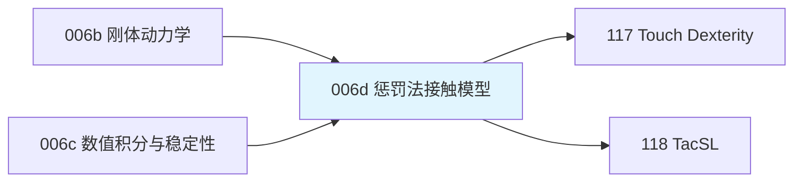

# 前置知识：惩罚法接触模型——弹簧阻尼与摩擦锥

> **一句话**：真实世界里两个刚体不会互相穿透，但要求仿真器严格禁止穿透，计算量会爆炸——惩罚法的做法是"睁一只眼闭一只眼":允许物体互相轻微嵌入，嵌入得越深就用越大的力把它们推开,就像在两个物体之间垫了一个看不见的弹簧。这篇文章讲清楚这个"允许穿透"的技巧是怎么算力的，以及切向摩擦力怎么跟着算，是理解几乎所有机器人物理仿真器（MuJoCo、Isaac Gym/Sim、PhysX、Bullet）接触计算的地基。

**知识链接**：
- [刚体动力学：牛顿-欧拉方程与惯性张量](/前置知识/006b_前置知识_刚体动力学_牛顿欧拉方程与惯性张量) — 本文算出的接触力最终要代入这里的合力 $\mathbf F$ 和合力矩 $\boldsymbol\tau$
- [物理仿真数值积分：辛积分与能量稳定性](/前置知识/006c_前置知识_物理仿真数值积分_辛积分与能量稳定性) — 弹簧型接触力的数值稳定性和这里讨论的辛积分密切相关
- [常微分方程 ODE——直觉与数值求解](/前置知识/001b_前置知识_常微分方程ODE直觉与数值求解) — 隐式求解接触力时用到的数值方法基础
- 下游：[Touch Dexterity：二值触觉覆盖全手的手内旋转 RL](/论文综述/117_TouchDexterity_二值触觉全手覆盖RL手内旋转) — 论文用仿真器内置的接触力判定二值触觉信号
- 下游：[TacSL：GPU 视触觉仿真与非对称蒸馏](/论文综述/118_TacSL_GPU视触觉仿真与非对称蒸馏) — 论文的力场计算直接基于本文的惩罚法模型

---

## 贯穿全文的例子

> **场景**：一个机器人指尖（可以看成一个小圆头）压向桌面上的一颗螺母。我们想知道：指尖压下去的力有多大？指尖如果同时想把螺母向左推，摩擦力最多能提供多大的阻力，螺母会不会打滑？

这两个问题分别对应本文的两条主线：**法向力怎么算**（第二节）和**切向摩擦力怎么算**（第三节）。

---

## 一、为什么不能真的"禁止穿透"

### 1.1 严格无穿透的代价

物理上两个刚体确实不会互相穿透——这叫"非侵入约束"（non-penetration constraint）。如果想在仿真器里严格执行这条约束，需要在每个时间步求解一个**约束优化问题**：找到一组接触力，使得下一时刻所有物体都刚好不穿透（数学上这是一个线性补偿问题，LCP）。这类精确求解器（如早期的 Open Dynamics Engine）在少量刚体、简单几何时可用，但接触点一多、几何一复杂，求解时间会急剧增长，而且很难在 GPU 上大规模并行。

### 1.2 惩罚法的核心思路

**惩罚法（penalty method）反过来想**：不追求"永远不穿透"，而是**允许物体轻微互相嵌入**，然后根据嵌入的深浅算一个"推开力"惯性地施加给两个物体——嵌入越深，推开力越大，就像在物体之间塞了一个看不见的弹簧。物体会因为这个力被推开，回到接近不穿透的状态，但过程中确实发生了微小的、数值意义上的穿透。

这个技巧把"求解一个约束优化问题"变成了"计算一个简单的代数表达式"——每个接触点独立计算力，天然适合并行化，这正是 Isaac Gym/Sim、Isaac Lab 底层的 PhysX 引擎，以及本文下游两篇论文（Touch Dexterity 用的仿真接触力判定、TacSL 的力场计算）能在数千个并行环境里跑起来的关键原因。

---

## 二、法向力：Kelvin-Voigt 弹簧阻尼模型

### 2.1 只有弹簧还不够

最简单的想法是：穿透深度 $\epsilon$ 越大,推开力越大,力和穿透深度成正比,就是一个弹簧：

$$
f_{\text{spring}} = \kappa\,\epsilon
$$

**这个公式在做什么**：穿透深度乘以一个刚度系数,就是弹簧提供的推开力——这是胡克定律在接触问题里的直接应用。

::: details 📐 公式详解（点击展开）

| 子表达式 | 它是谁 | 它在干嘛 |
|---------|--------|---------|
| $\epsilon$ | **穿透深度** | 两个刚体理论上重叠的距离，$\epsilon>0$ 表示发生了穿透 |
| $\kappa$ | **接触刚度** | 一个手工设定的常数，越大表示这个接触"越硬"，允许的最大穿透越小 |
| $f_{\text{spring}}$ | **弹簧推开力** | 沿接触法向、把两个物体推开的力大小 |

**用人话读**："嵌入多深，就用多大的力把它推开——嵌入两倍深，推开力也两倍大。"

**为什么不能只用弹簧**：纯弹簧系统没有能量耗散，物体一旦接触会像弹簧一样反复振荡（想象一个球落在纯弹性地面上，理论上会无限反弹到原高度）。仿真里这种无阻尼振荡会导致接触抖动、数值不稳定，需要引入阻尼项来吸收多余的能量。
:::

### 2.2 加上阻尼：完整的 Kelvin-Voigt 模型

真正在仿真器里使用的是**弹簧和阻尼器并联**的模型（Kelvin-Voigt 模型，力学里描述粘弹性材料的经典模型）：

$$
f =
\begin{cases}
\max\left(\kappa\,\epsilon + c\,\dot\epsilon,\ 0\right), & \epsilon>0 \\
0, & \epsilon\le 0
\end{cases}
$$

**这个公式在做什么**：只有已经发生穿透时才启用接触模型；接触力由“嵌入多深”决定的弹簧力与“正在嵌入还是正在分离”决定的阻尼力相加，并且只能推开物体，不能把已分离的物体拉回来。

::: details 📐 公式详解（点击展开）

| 子表达式 | 它是谁 | 它在干嘛 |
|---------|--------|---------|
| $\kappa$ | **刚度系数** | 越大，接触"越硬"，同样的穿透深度产生更大的推开力 |
| $\epsilon$ | **穿透深度** | 两物体重叠的距离，取正值表示确实发生了穿透 |
| $c$ | **阻尼系数** | 控制"速度相关"的那部分力，起到吸收能量、抑制振荡的作用 |
| $\dot\epsilon$ | **穿透速度（分离速度）** | 穿透深度对时间的导数，正值表示正在嵌入更深，负值表示正在分离 |
| $\epsilon>0$ | **接触门控** | 只有几何已经重叠时才启用弹簧与阻尼，避免隔空产生接触力 |
| $\max(\cdot,0)$ | **单边约束** | 即使仍有微小穿透，正在快速分离时也不允许接触力变成拉力 |

**用人话读**：“先确认两个物体确实已经嵌入；若已嵌入，推开力就是弹簧力与阻尼力之和，但绝不能变成负的拉力。”

**为什么需要阻尼项**：单纯的弹簧会让接触点像弹簧一样振荡而不收敛。阻尼项 $c\dot\epsilon$ 的作用类似汽车悬挂里的减震器——当两个物体正在快速嵌入时（$\dot\epsilon>0$），阻尼力会额外增大，帮助更快地把物体推开、抑制过冲；当物体正在分离时（$\dot\epsilon<0$），阻尼力会减小甚至为负，避免过度阻碍分离过程。TacSL 论文（见 [TacSL 精读](/论文综述/118_TacSL_GPU视触觉仿真与非对称蒸馏)）正是采用这个精确形式来仿真视触觉传感器的接触力。
:::

下图展示了这个模型在"正在嵌入"和"正在分离"两种情况下,力随穿透深度变化的曲线差异：

> 左图：同样的穿透深度下，物体正在闭合时（红线）接触力比静态弹簧（灰线）更大，正在分开时（蓝线）接触力更小——这正是阻尼项在起作用。右图：切向摩擦力随滑动速度线性增长，但一旦达到摩擦锥上限 $\mu\|f_n\|$ 就不再增长（下一节详解）。

### 2.3 隐式求解：为什么不能直接代入显式 Euler

**先说结论**：显式方法的问题不是“公式算错了”，而是接触力总会晚一个时间步看到新产生的穿透。软弹簧变化慢，这点延迟通常还能接受；硬弹簧的力随穿透深度变化极快，一步延迟就可能先穿得过深、下一步再给出过大的反向加速，把数值能量凭空放大。

下面只保留指尖沿桌面法线的一维运动。设球心高度 $y$ 向上为正，球半径 $r$ 是球心不穿透地面时的最低高度，质量 $m$ 决定同一接触力能产生多大加速度，速度 $v$ 为正表示向上，$g$ 是重力加速度的正数大小，$\Delta t$ 是用户选择的固定时间步。发生接触时，正穿透深度是 $r-y$；因此上一节的弹簧阻尼力在这套坐标中写成 $f=\max(\kappa(r-y)-cv,0)$。其中 $-v$ 就是穿透速度：小球向下时 $v<0$，阻尼项 $-cv$ 为正，会增强推开力。

两条更新路线的差异不是“有没有弹簧”，而是弹簧读取哪个时刻的状态：

~~~mermaid
flowchart LR
    A["时间步开始 已知 y_n 和 v_n"] --> B["显式路线 用旧状态计算 f_n"]
    B --> C["再更新 y 和 v"]
    C --> D["本步新增穿透 下一步才产生反作用"]
    A --> E["隐式路线 把 y_(n+1) v_(n+1) f_(n+1) 当未知量"]
    E --> F["联立运动方程 位置更新与弹簧力"]
    F --> G["本步结束状态 已经满足接触力关系"]
~~~

> 显式路线是“先看旧状态，再盲走一步”；隐式路线是“寻找一个自洽的终点”。后者并不是预知未来，而是在当前时间步内同时解出终点状态。

#### 用一个时间步看清显式方法怎样出错

取 $m=1\text{kg}$、$r=0.25\text{m}$、$\kappa=20000\text{N/m}$、$c=80\text{N·s/m}$、$\Delta t=0.02\text{s}$。某一步开始时球心还在 $y_n=0.30\text{m}$，所以旧状态没有穿透；但它正以 $v_n=-4\text{m/s}$ 向下运动。

显式 Euler 在步首看到的穿透为零，于是本步接触力也是零。它先按旧速度前进约 $0.08\text{m}$，步末球心落到约 $0.22\text{m}$，已经穿入地面约 $0.03\text{m}$。直到下一步，弹簧才看到这次穿透；仅弹簧项就会突然给出约 $20000\times0.03=600\text{N}$ 的推开力。若这股力又让小球在一个时间步内冲过平衡位置，下一次修正仍会晚一拍，振幅便可能越算越大。

| 对比项 | 显式接触力 | 隐式接触力 |
|--------|------------|------------|
| 力读取的状态 | 已知的步首 $y_n,v_n$ | 待求的步末 $y_{n+1},v_{n+1}$ |
| 本步新增的穿透 | 本步不响应，下一步才看到 | 在同一个代数方程中立即参与 |
| 单步计算 | 直接代入 | 解一个小型线性方程 |
| 硬弹簧下的典型表现 | 过冲、抖动，甚至能量爆炸 | 数值耗散更强，但能稳定停在接触面 |

#### 隐式方法到底多解了什么

隐式方法要求三个关系在同一个步末状态同时成立：步末接触力由步末穿透和步末速度决定；这股力产生步末速度；步末速度又产生步末位置。把这三个关系联立并消去步末力与位置，在接触确实成立时得到：

$$
v_{n+1}=
\frac{m v_n-mg\Delta t+\kappa\Delta t(r-y_n)}
{m+c\Delta t+\kappa\Delta t^2},
\qquad
y_{n+1}=y_n+\Delta t\,v_{n+1}
$$

**这个公式在做什么**：它不是用旧接触力猜下一步，而是直接寻找一个步末速度，使“动量变化、步末位置和步末弹簧阻尼力”三者彼此一致。求出速度后，再用同一个步末速度更新位置。

::: details 📐 公式详解（点击展开）

| 子表达式 | 它是谁 | 它在干嘛 |
|---------|--------|---------|
| $m v_n-mg\Delta t$ | **无接触的动量预测** | 从步首动量中扣除这一时间步的重力冲量 |
| $\kappa\Delta t(r-y_n)$ | **步首几何提供的接触趋势** | 球心越接近或进入地面，弹簧越需要在本步内改变动量 |
| $m+c\Delta t+\kappa\Delta t^2$ | **隐式响应系数** | 把质量、阻尼反馈和“速度会改变位置、位置又改变弹簧力”的反馈合在一起 |
| $y_n+\Delta t v_{n+1}$ | **步末位置** | 使用刚刚联立求出的速度抵达自洽终点 |

**用人话读**：不要先算力再冲出去，而是直接找一个终点；到了这个终点后，用终点的穿透和速度重新算力，仍然恰好能产生这个终点。

**为什么刚度项在分母且带 $\Delta t^2$**：速度经过一次 $\Delta t$ 积分改变位置，位置再乘刚度变成力，力又经过一次 $\Delta t$ 积分改变速度，所以闭环反馈带来 $\kappa\Delta t^2$。刚度越大，这个分母也越大，会自动压住单步速度变化；若只保留分子中的刚度作用而漏掉分母反馈，就退化成容易过冲的显式修正。
:::

分母 $m+c\Delta t+\kappa\Delta t^2$ 是求解器根据物理参数和时间步**计算出的派生系数**，不是新的调参。用户可以调整源参数 $\kappa$、$c$ 和 $\Delta t$；每次时间步变化后，求解器都必须重新计算这个分母。若把分母错误地固定住，缩小时间步时接触的软硬和阻尼会一起改变，模拟的就不再是同一个物理系统。

这个形式也能通过边界情况自检：令 $\kappa=c=0$，速度更新退化成只受重力的 $v_{n+1}=v_n-g\Delta t$；让 $\Delta t$ 趋近于零，分母趋近质量 $m$；让 $\kappa$ 极大时，$\kappa\Delta t^2$ 同时增大，步末位置会趋向接触面 $y_{n+1}=r$，而不是被无限大的弹簧力直接弹飞。

#### 直接运行显式与隐式对照实验

下面的小程序把上述完整状态转移写成了两个函数。两个小球具有相同质量、初始位置、初始速度、刚度、阻尼和时间步；唯一差别是左边用步首状态算接触力，右边联立求步末状态。默认参数故意使用较硬的接触，便于观察数值稳定性差异；代码顶部的 `stiffness` 和 `dt` 分别控制接触刚度与时间步。

每个时间步严格按以下顺序执行，代码不会再引入新的隐藏步骤：

1. 初始化时，两边都从 $y=1.8\text{m}$、$v=-1\text{m/s}$ 开始；进入新时间步后读取各自保存的旧位置和旧速度。
2. 显式分支先由旧位置判断是否穿透，再用旧状态计算接触力，最后依次更新位置与速度。
3. 隐式分支先预测无接触的步末状态；若会穿透，就用上一小节的分母联立求出步末速度、步末位置和步末接触力。
4. 若隐式解要求负接触力，说明小球正在离开地面，程序丢弃该接触解并接受自由运动，因为地面只能推、不能拉。
5. 两边的新位置和新速度写回为下一步的旧状态；动画帧只是保存这份结果，不参与求解。

<ClientOnly>
  <PhysicsPlayground preset="explicit-implicit-contact" title="硬接触：显式与隐式积分对照" />
</ClientOnly>

默认实验中，左侧显式小球会从地面获得远大于入射速度的向上速度并飞出画面，右侧隐式小球则在少量穿透后稳定停在接触面。把 `stiffness` 从 `20000` 降到 `500`，或把 `dt` 从 `0.02` 降到 `0.002`，显式结果会明显改善：这说明爆炸来自“硬度相对于时间步过大”，而不是弹簧模型本身必然错误。

[辛积分与能量稳定性](/前置知识/006c_前置知识_物理仿真数值积分_辛积分与能量稳定性)解释了更一般的积分稳定性；TacSL 论文附录 A 则给出了其接触实现所用隐式求解的完整推导。

---

## 三、切向力：摩擦锥与饱和

### 3.1 库仑摩擦的核心限制

法向力只能把物体推开，不能阻止物体沿接触面滑动——这需要**摩擦力**。经典的库仑摩擦定律说：摩擦力的大小不能超过法向力乘以一个摩擦系数：

$$
\|\mathbf f_t\| \le \mu\,\|\mathbf f_n\|
$$

**这个公式在做什么**：给切向摩擦力设一个"天花板"——不管切向想要多大的阻力，都不能超过法向力乘以摩擦系数这个上限。

::: details 📐 公式详解（点击展开）

| 子表达式 | 它是谁 | 它在干嘛 |
|---------|--------|---------|
| $\mathbf f_t$ | **切向摩擦力** | 沿接触面、阻止相对滑动的力 |
| $\mu$ | **摩擦系数** | 材料属性决定的常数，橡胶对橡胶摩擦系数高，冰面摩擦系数低 |
| $\|\mathbf f_n\|$ | **法向力大小** | 上一节算出的推开力，压得越紧，摩擦力上限越高 |

**用人话读**："桌上一本书,你能用多大的摩擦力把它固定住不滑动，取决于你压它有多紧,乘以桌面和书之间的摩擦系数。"

**为什么摩擦力有上限**：想象用手指压住桌上的一本书,尝试推它但不让它滑动——只要推力不超过某个阈值（正比于你压的力度），摩擦力都能刚好抵消推力,书保持静止；一旦推力超过这个阈值，摩擦力已经达到极限、无法再增大,书就会开始滑动。这个物理直觉正是库仑摩擦锥的来源。
:::

### 3.2 工程实现：用速度饱和函数近似摩擦

严格的库仑摩擦在"物体是否滑动"这件事上是一个**不连续**的判断（静止时摩擦力方向不确定，需要满足平衡；滑动时摩擦力方向固定为滑动速度的反方向），这种不连续性对数值仿真非常不友好。工程上常用一个**连续的饱和函数**来近似——本文下游 [TacSL](/论文综述/118_TacSL_GPU视触觉仿真与非对称蒸馏) 论文采用的形式是：

$$
\mathbf f_t = -\frac{\mathbf v_t}{\|\mathbf v_t\|}\,\min\left(k_t\,\|\mathbf v_t\|,\ \mu\,\|\mathbf f_n\|\right)
$$

**这个公式在做什么**：摩擦力的方向永远和切向滑动速度相反（阻止滑动），大小则是"和滑动速度成正比的力"与"摩擦锥上限"两者中较小的一个——滑动很慢时表现得像一个弹簧（力随速度线性增长），滑动一旦超过某个速度，力就被摩擦锥上限"封顶"了。

::: details 📐 公式详解（点击展开）

| 子表达式 | 它是谁 | 它在干嘛 |
|---------|--------|---------|
| $\mathbf v_t$ | **切向相对速度** | 接触面上两物体沿切向的相对滑动速度 |
| $-\mathbf v_t/\|\mathbf v_t\|$ | **摩擦力方向** | 单位向量，永远指向"阻止滑动"的方向，即滑动速度的反方向 |
| $k_t\|\mathbf v_t\|$ | **线性摩擦响应** | 想象成一个"虚拟弹簧"——滑动越快，虚拟弹簧被拉得越远，提供的阻力越大 |
| $\mu\|\mathbf f_n\|$ | **摩擦锥上限** | 库仑摩擦定律给出的物理上限，不管滑多快都不能突破 |
| $\min(\cdot,\cdot)$ | **饱和判断** | 取两者较小值，实现"低速时像弹簧,高速时封顶"的平滑过渡 |

**用人话读**："摩擦力永远往反方向拽，大小一开始跟着滑动速度线性涨，涨到摩擦锥允许的最大值就不再涨了。"

**为什么用这种平滑近似**：真实的库仑摩擦在"静止"和"滑动"之间有一个数学上的跳变（力的方向从"平衡未知"跳到"确定的反方向"），直接实现这个跳变在数值仿真里会导致抖动甚至无法收敛。用 $k_t\|\mathbf v_t\|$ 这个线性项在低速区近似出一个"虚拟弹性回复力"，让力关于速度连续变化，换来数值稳定性；代价是当物体本应完全静止时，仿真里其实存在极其微小的"蠕动"滑动速度，但只要 $k_t$ 取得足够大，这个近似误差可以忽略不计。
:::

**在我们的例子中**：机器人指尖压向螺母，压力（法向力）越大，摩擦锥的半径 $\mu\|f_n\|$ 就越大——指尖能提供的最大侧推阻力也越大。如果指尖只是轻轻碰了一下（法向力很小），摩擦锥很小,稍微用力侧推就会让螺母打滑；如果指尖用力压紧，摩擦锥变大，侧推力可以更大而不打滑。这正是人抓取物体时"抓得越紧越不容易打滑"的直觉,在数学上的精确表达。

---

## 四、接触点如何确定：从碰撞检测到穿透深度

前两节假设"穿透深度 $\epsilon$ 已知"，但物理引擎怎么算出这个值？对于简单几何体（球、盒子、圆柱），可以用解析公式直接算两个几何体的重叠量。对于任意复杂网格（比如一个不规则的螺栓），常用的做法是预先计算这个网格的**符号距离场**（Signed Distance Field, SDF）——一个函数 $d(\mathbf x)$，输入空间中任意一点 $\mathbf x$，输出这个点到网格表面的最短距离（网格内部为负、外部为正）。有了 SDF，穿透深度就是直接查询另一个物体的采样点在这个 SDF 里的值：

$$
\epsilon(\mathbf x) = -d(\mathbf x), \qquad \mathbf n = \nabla d(\mathbf x)
$$

**这个公式在做什么**：把"这个点穿透了多深"和"接触法向朝哪个方向"，都转换成对预先计算好的距离场做一次查询和一次梯度计算——这两个操作在 GPU 上极易并行化，是 TacSL 等大规模并行触觉仿真能跑得快的关键设计。

::: details 📐 公式详解（点击展开）

| 子表达式 | 它是谁 | 它在干嘛 |
|---------|--------|---------|
| $d(\mathbf x)$ | **符号距离场的值** | 点 $\mathbf x$ 到物体表面的最短距离，负值表示点在物体内部（已穿透） |
| $\epsilon(\mathbf x)=-d(\mathbf x)$ | **穿透深度** | SDF 为负时取反，得到一个正的穿透深度，直接代入前两节的力公式 |
| $\mathbf n=\nabla d(\mathbf x)$ | **接触法向** | 距离场的梯度方向，天然指向"离开物体表面最快的方向"，即法向 |

**用人话读**："提前给每个复杂形状算好一张'距离地图'，仿真时只需要查表和算一次梯度，就知道穿透了多深、该往哪个方向推。"

**为什么用 SDF 而不是实时算网格交线**：实时计算两个任意三角网格之间的精确重叠区域是计算几何里代价很高的操作（网格三角形数量一多，逐三角形碰撞检测会非常慢）。预计算 SDF 把"几何相交计算"变成了"函数查表"，查询和求梯度都是 $O(1)$ 操作,天然适合数千个并行环境同时计算——这正是 [TacSL 精读](/论文综述/118_TacSL_GPU视触觉仿真与非对称蒸馏) 里用来支持任意网格（而不仅是长方体/圆柱等基本几何体）触觉仿真的核心技术。
:::

---

## 五、总结

### 一句话

> 惩罚法接触模型放弃"绝对不穿透"这个理想约束，改用"穿透多深就用多大力推开"的弹簧阻尼模型近似真实接触力；法向力决定"推多狠"，摩擦锥决定"横着能扛多大的推力而不滑动"，两者结合起来就是几乎所有现代物理仿真器计算接触力的完整数学基础。

### 核心要点

1. 精确的非侵入约束求解代价高、难以并行，惩罚法用简单代数表达式换取可并行的计算效率
2. 法向力 = 弹簧力（正比穿透深度）+ 阻尼力（正比穿透速度），阻尼项抑制振荡、加速收敛
3. 切向摩擦力方向永远与滑动速度相反，大小被库仑摩擦锥 $\mu\|f_n\|$ 限制，工程上用平滑饱和函数近似
4. 复杂网格的穿透深度和接触法向可以通过预计算的符号距离场（SDF）快速查询，是大规模并行触觉仿真的关键
5. 接触刚度设得越大越接近真实刚体，但对数值积分的稳定性要求也越高，通常需要隐式求解

### 知识链

---

## 延伸阅读

- [刚体动力学：牛顿-欧拉方程与惯性张量](/前置知识/006b_前置知识_刚体动力学_牛顿欧拉方程与惯性张量) — 本文算出的接触力代入这里的运动方程
- [物理仿真数值积分：辛积分与能量稳定性](/前置知识/006c_前置知识_物理仿真数值积分_辛积分与能量稳定性) — 弹簧型力的数值稳定性讨论
- [Touch Dexterity：二值触觉全手覆盖的手内旋转 RL](/论文综述/117_TouchDexterity_二值触觉全手覆盖RL手内旋转) — 应用：仿真器内置接触力用来判定二值触觉信号
- [TacSL：GPU 视触觉仿真与非对称蒸馏](/论文综述/118_TacSL_GPU视触觉仿真与非对称蒸馏) — 应用：本文的力场公式是 TacSL 力场传感器的直接实现
- Tan, Liu, Turk, "Stable Proportional-Derivative Controllers" (2011) — 隐式弹簧求解的经典参考
- Macklin et al., "Small Steps in Physics Simulation" (SCA 2019) — PhysX TGS 求解器的技术细节
