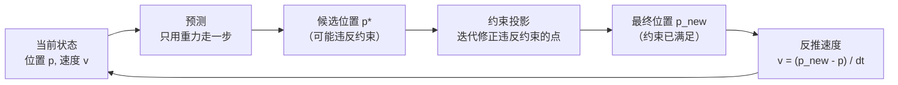
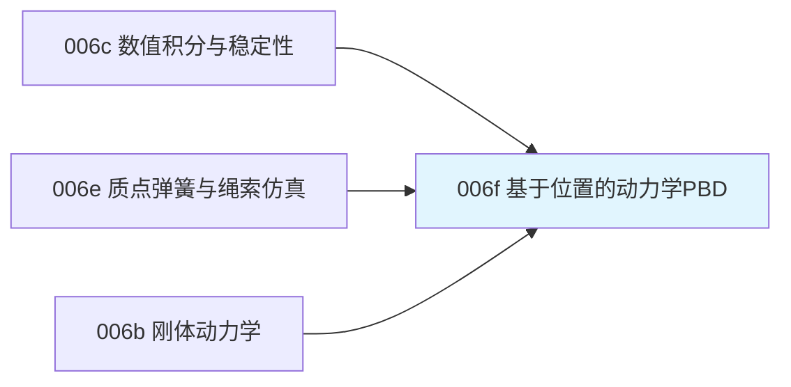

# 前置知识：基于位置的动力学 PBD（Position Based Dynamics）

> **一句话**：PBD 不再纠结"该给弹簧设多大的刚度系数才能既稳定又不可伸长"，而是换一个问法——每一步先让所有质点按重力/惯性自由运动一小步，然后直接、反复地把违反约束（比如"两点间距离必须等于绳长"）的位置**硬拉回**满足约束的地方,拉的次数越多、约束满足得越彻底。这个思路简单、无条件稳定、还很容易并行加速,是当前绳索、布料、软体仿真最主流的工程方案。

**知识链接**：
- [物理仿真数值积分：辛积分与能量稳定性](/前置知识/006c_前置知识_物理仿真数值积分_辛积分与能量稳定性) — PBD 的"预测位置"步骤本质上是一次简单的显式积分，本文建立在这篇文章的稳定性讨论之上
- [质点弹簧模型与绳索仿真基础](/前置知识/006e_前置知识_质点弹簧模型与绳索仿真基础) — PBD 正是为了解决上一篇提出的"高刚度弹簧难以稳定仿真"这个核心矛盾而设计的
- [刚体动力学：牛顿-欧拉方程与惯性张量](/前置知识/006b_前置知识_刚体动力学_牛顿欧拉方程与惯性张量) — 惯性质量、逆质量在本文约束求解公式里扮演的角色，和刚体动力学里的质量概念是同一套体系

---

## 贯穿全文的例子

> **场景**：还是那根两端固定、中间自由下垂的绳索（[上一篇](/前置知识/006e_前置知识_质点弹簧模型与绳索仿真基础) 用过的例子）。这次我们不再给相邻质点之间安装一根"弹簧"，而是给它们规定一条**规则**："不管这一步质点被重力拉去了哪里，事后都必须把它们的距离修正回绳子的自然长度。"我们想知道：这条规则具体怎么执行？执行的次数（迭代次数）越多，绳子的形状会有什么变化？

---

## 一、从"力"到"约束"：一次思路上的根本转变

### 1.1 力方法的核心问题回顾

[质点弹簧模型](/前置知识/006e_前置知识_质点弹簧模型与绳索仿真基础) 第三节讲过：想让弹簧"看起来不可伸长"，需要把弹簧系数 $k$ 设得很大，但 $k$ 越大，[数值积分](/前置知识/006c_前置知识_物理仿真数值积分_辛积分与能量稳定性) 里讨论的显式方法能稳定工作所需的步长就越小——这个矛盾几乎是"用力（force-based）驱动的弹簧模型"这条路线的结构性瓶颈,不管换用什么显式积分方法,这个矛盾都存在。

### 1.2 PBD 的核心转变：直接操作位置，不经过力

PBD（Position Based Dynamics，基于位置的动力学，Müller et al. 2007 年提出）绕开了这个矛盾,做法是：**不再通过"计算一个很大的力,再用这个力算出加速度,再积分出位移"这条链路去满足约束,而是直接在位置层面,一步把违反约束的点挪到满足约束的地方**。

这个转变可以用一句话总结两条路线的区别：

| | 力方法（质点弹簧模型） | PBD |
|---|---|---|
| 约束的表达方式 | 一根很硬的弹簧，产生一个很大的力 | 一个几何条件（比如"距离=$L_0$"），没有"力"这个中间量 |
| 满足约束的方式 | 让力通过牛顿第二定律"驱动"位置逐渐靠近约束 | 直接把违反约束的位置**投影**（挪动）到满足约束的位置 |
| 步长和刚度的关系 | 刚度越大，步长上限越小（3.1 节讨论的矛盾） | 约束是"位置层面的规则"，不涉及刚度这个概念,不存在这个矛盾 |
| 稳定性 | 显式方法下高刚度容易发散 | 无条件稳定——不管约束多"硬"，直接挪动位置永远不会发散到无穷 |

---

## 二、PBD 的核心循环：预测 → 投影 → 更新速度

### 2.1 三个步骤

PBD 每一步仿真循环分成三个阶段：

**第一步——预测（predict）**：忽略所有约束，只用外力（重力等）做一次最简单的显式积分，得到一个"如果没有约束限制，这一步应该走到哪"的候选位置：

$$
\mathbf{v}_i^{\ast} = \mathbf{v}_i + \Delta t\cdot \mathbf{g}, \qquad \mathbf{p}_i^{\ast} = \mathbf{p}_i + \Delta t\cdot \mathbf{v}_i^{\ast}
$$

**这个公式在做什么**：先假装这个质点完全自由,不受任何约束,只被重力拉着走一小步——这一步算出来的候选位置很可能违反约束（比如让绳子被拉长），但这正是 PBD 故意设计的第一步,后面会专门修正它。

::: details 📐 公式详解（点击展开）

| 子表达式 | 它是谁 | 它在干嘛 |
|---------|--------|---------|
| $\mathbf v_i^\ast$ | **候选速度** | 只考虑重力（或其他外力）之后的速度,还没有考虑任何约束 |
| $\mathbf p_i^\ast$ | **候选位置** | 用候选速度走一步得到的位置，带星号表示"还不是最终结果，只是候选" |
| $\mathbf g$ | **外力加速度** | 重力，或者更一般地任何外部力产生的加速度 |

**用人话读**："先假装每个质点都不受任何约束的牵绊，只用重力自由落体走一小步，得到一个候选位置——这个候选位置大概率会违反约束（比如让绳子变长），但这只是第一步，后面会修正。"

**为什么要先算一个"错的"候选位置**：这是 PBD 算法的核心设计思路——把"物理运动"和"约束满足"彻底拆成两个独立步骤，第一步只管"没有约束限制时应该怎么动"（简单的显式积分），第二步专门处理"约束要求怎么修正"，两步分开处理比把两者混在一起（像质点弹簧模型那样把约束编码进力）更容易保证稳定性。
:::

**第二步——约束投影（constraint projection）**：检查候选位置 $\mathbf p^\ast$ 有没有违反约束（比如相邻两点距离是不是等于 $L_0$），如果违反，直接把违反约束的点沿着"最省力"的方向挪动，让约束刚好被满足。这一步通常要对所有约束反复迭代几次（下一节详细讲）。

**第三步——更新速度**：约束投影修正完位置后，反推出这一步实际的速度（因为约束投影相当于"偷偷"改变了位置，速度也要跟着变，否则下一步的运动会不连续）：

$$
\mathbf{v}_i = \frac{\mathbf{p}_i^{\text{new}} - \mathbf{p}_i}{\Delta t}
$$

**这个公式在做什么**：既然约束投影已经把候选位置修正成了最终位置 $\mathbf p_i^{\text{new}}$，就反过来用"这一步实际发生的位移"除以步长，倒推出这一步实际应该有的速度——而不是继续用第一步算出的候选速度 $\mathbf v_i^\ast$。

::: details 📐 公式详解（点击展开）

| 子表达式 | 它是谁 | 它在干嘛 |
|---------|--------|---------|
| $\mathbf p_i^{\text{new}}$ | **约束投影后的最终位置** | 经过下一节的迭代修正之后,真正满足约束的位置 |
| $\mathbf p_i$ | **这一步开始前的旧位置** | 上一个仿真步结束时的位置 |
| $\mathbf p_i^{\text{new}}-\mathbf p_i$ | **实际发生的位移** | 包含了"自由运动"和"约束修正"两部分的总效果 |
| $\mathbf v_i$ | **反推出的新速度** | 用真实位移除以步长得到，这个速度会被记录下来供下一步仿真使用 |

**用人话读**："约束把候选位置拉回了一个新位置，我们不管这个拉扯过程中间发生了什么，直接用'最终走了多远'除以'用了多长时间'得到这一步真实的速度。"

**为什么不直接用候选速度 $\mathbf v_i^\ast$**：如果约束投影大幅修正了位置（比如绳子被拉伸后又被硬拉回原长），那么候选速度已经不能反映"这一步实际发生了什么运动"——用反推的方式保证速度和位置的变化永远是一致的,这也正是约束的效果（比如"绳子突然被拉紧后会产生一个反弹的速度"）能够自然地传递到下一步仿真中的机制，不需要额外建模"约束力"这个概念。
:::

### 2.2 三步循环的直觉总结



---

## 三、距离约束的投影公式：绳索的核心操作

### 3.1 距离约束是什么

对绳索最重要的约束是"相邻两个质点之间的距离必须等于自然长度 $L_0$"，写成约束函数的形式就是 $C(\mathbf{p}_1,\mathbf{p}_2) = \|\mathbf{p}_1-\mathbf{p}_2\| - L_0$，要求它恒等于零。这个约束函数 $C$ 只在两点距离恰好等于 $L_0$ 时为零（约束被满足），否则非零（违反约束）——PBD 的任务就是把候选位置沿着能让 $C$ 变回零的方向挪动。

### 3.2 投影公式：把违反约束的两点拉回正确距离

$$
\Delta\mathbf{p}_1 = -\frac{w_1}{w_1+w_2}\,(\|\mathbf{p}_1-\mathbf{p}_2\|-L_0)\,\hat{\mathbf n}, \qquad \Delta\mathbf{p}_2 = +\frac{w_2}{w_1+w_2}\,(\|\mathbf{p}_1-\mathbf{p}_2\|-L_0)\,\hat{\mathbf n}
$$

**这个公式在做什么**：算出应该分别把质点 1 和质点 2 挪动多少距离,才能让它们之间的距离刚好变回自然长度 $L_0$——挪动的比例由每个质点的"逆质量"决定,质量越大（越"重"、越"难推动"）的点分到的挪动量越小。

::: details 📐 公式详解（点击展开）

| 子表达式 | 它是谁 | 它在干嘛 |
|---------|--------|---------|
| $\|\mathbf p_1-\mathbf p_2\|-L_0$ | **距离偏差** | 当前实际距离减去应该保持的自然长度，正值表示"拉太长了"，负值表示"挤太近了" |
| $\hat{\mathbf n}=\frac{\mathbf p_1-\mathbf p_2}{\|\mathbf p_1-\mathbf p_2\|}$ | **修正方向** | 从质点 2 指向质点 1 的单位向量 |
| $w_i=1/m_i$ | **逆质量** | 质量的倒数，质量越大逆质量越小；固定点（无穷质量）的逆质量直接定义为 0 |
| $\frac{w_1}{w_1+w_2}$ | **质点 1 分到的修正比例** | 逆质量占两者逆质量总和的比例——如果质点 1 是固定锚点（$w_1=0$），这个比例就是 0，质点 1 完全不动 |
| $\Delta\mathbf p_1,\Delta\mathbf p_2$ | **两个质点各自应该挪动的位移** | 方向相反（一个沿 $-\hat{\mathbf n}$，一个沿 $+\hat{\mathbf n}$），把两点重新拉/推到距离恰好为 $L_0$ 的位置 |

**用人话读**："算出两点当前的距离比标准长度多了/少了多少，按照'谁更轻就该谁多挪动一点'的比例，把两个点分别往中间拉近或往两边推开，直到它们之间的距离刚好等于标准长度。"

**为什么按逆质量分配挪动比例**：这正是"约束修正"要模拟真实物理直觉的地方——现实中如果一根绳子一头绑着一片羽毛、一头绑着一个铁球，被拉伸后应该主要是羽毛那端移动去缩短距离,铁球几乎不动，这正是逆质量加权分配的物理含义。固定锚点（逆质量为 0）在这个公式里永远分不到任何位移，恰好对应"锚点必须钉死不动"这个边界条件——不需要像上一篇代码示例里那样，每一步结束后手动把锚点位置强行拉回去，PBD 通过逆质量为零自然满足了这个边界条件。
:::

### 3.3 一次不够，要反复迭代

一根绳子有 $N-1$ 段（$N-1$ 个距离约束），修正第 1、2 个质点之间的约束时,可能会把质点 2 挪到一个新位置,这个新位置又可能让"质点 2、3 之间的约束"重新变得不满足。所以 PBD **不是一次遍历所有约束就结束**，而是要把"遍历所有约束、逐个投影修正"这个过程重复多次（Gauss-Seidel 风格的迭代）——迭代次数越多，所有约束同时满足的程度越高。

下图直观展示了迭代次数对绳索最终形状的影响：


> 左图：同一根两端固定的绳索，PBD 求解器分别跑 1 次、3 次、10 次全局迭代后的形状——迭代次数越多，绳子下垂得越少（越接近真实的、几乎不可伸长的悬链线形状），因为约束被满足得更彻底。右图：绳索总长度相对自然长度的偏差百分比随迭代次数的收敛曲线，1 次迭代时误差高达 53.8%（绳子被"拉长"了一半以上），迭代到 10 次左右降到约 8.9%，30 次左右降到约 4.2%——**误差随迭代次数递减但永远不会精确归零，这是 PBD 方法本身的固有特性**（下一节详细讨论）。

**工程含义**：迭代次数是 PBD 里"精度 vs 计算开销"的直接旋钮——迭代次数越多，约束满足得越彻底（绳子越接近真正的不可伸长），但每次迭代都要遍历一次所有约束，计算量随迭代次数线性增长。实时应用（游戏、交互仿真）通常只用 3-10 次迭代就已经视觉上足够可信，机器人仿真/离线训练场景如果需要更精确的物理行为，可能需要更多迭代或改用下一节提到的 XPBD 变体。

---

## 四、PBD 的局限与改进：为什么后来有了 XPBD

### 4.1 PBD 的一个副作用：约束"太硬"且和迭代次数、步长绑定

PBD 原始版本有一个不太直观的副作用：**约束表现出来的"软硬程度"会随着迭代次数和步长的变化而变化**——同样的约束设定，用不同的步长或迭代次数仿真，可能得到明显不同的"软硬手感"（比如同一根绳子在不同帧率下表现出不同的拉伸弹性）。这是因为原始 PBD 的约束投影公式（3.2 节）里没有一个可以独立调节"这个约束应该多硬"的物理参数——迭代次数本身间接充当了这个角色，但迭代次数同时也和帧率、计算开销绑在一起，不适合当成一个独立的物理调节旋钮。

### 4.2 XPBD：把物理刚度参数带回约束投影公式

XPBD（Extended PBD，Macklin et al. 2016 年提出）在 PBD 的投影公式里引入了一个基于真实物理刚度的修正项，让约束的"软硬程度"变成一个和迭代次数、步长解耦的独立参数（类似于给约束一个显式的弹簧系数，但求解过程仍然保持 PBD 式的无条件稳定性）。这样一来，工程师可以独立调节"迭代次数"（决定计算开销和收敛速度）和"柔度参数"（决定约束表现出的物理软硬），两者互不干扰——这正是当前主流物理引擎（NVIDIA Flex、Isaac Sim 的部分可变形体求解器）普遍采用 XPBD 而不是原始 PBD 的原因。XPBD 的具体公式推导需要引入拉格朗日乘子的概念,这里不展开,只需要知道它是 PBD 思路的一个更严谨、更符合真实物理刚度语义的改进版本。

### 4.3 PBD 能不能同时处理绳索的抗弯约束？

可以，思路和 [质点弹簧模型](/前置知识/006e_前置知识_质点弹簧模型与绳索仿真基础) 第四节讲的"弯曲弹簧"完全类似——把"三个连续质点应该尽量排成一条直线"也表达成一个约束（约束函数是"当前弯曲角度偏离伸直状态的程度"），用同样的投影思路修正。PBD 框架的一个重要优点正是**约束的形式统一**：不管是距离约束、弯曲约束、碰撞约束（防止绳子穿过障碍物）、体积保持约束（防止软体被压扁到体积消失），都可以写成"约束函数 $C=0$ + 按逆质量加权分配修正量"这同一套框架，工程实现上可以很自然地叠加多种约束类型而不需要重新设计求解器。

---

## 五、代码示例：完整的 PBD 绳索仿真

下面实现一个包含 3.1、3.2 节讲的距离约束投影，以及 2.1 节完整三步循环的 PBD 绳索仿真：

```python
import numpy as np

# ============ 绳索参数 ============
n_points = 20
total_length = 1.0
rest_len = total_length / (n_points - 1)
gravity = np.array([0.0, -9.8])
dt = 0.02
n_iterations = 10  # 约束求解迭代次数，对应本文 3.3 节讨论的关键参数

left_anchor = np.array([0.0, 0.0])
right_anchor = np.array([total_length, 0.0])

positions = np.array([left_anchor + (right_anchor - left_anchor) * i / (n_points - 1)
                        for i in range(n_points)])
velocities = np.zeros_like(positions)

# 逆质量：固定锚点设为 0（对应本文 3.2 节"锚点永远不分到位移"的机制）
inv_mass = np.ones(n_points)
inv_mass[0] = 0.0
inv_mass[-1] = 0.0

def solve_distance_constraint(pred, i, j, rest_length, inv_mass):
    """
    本文 3.2 节公式的直接实现：对质点 i, j 之间的距离约束做一次投影修正
    """
    w1, w2 = inv_mass[i], inv_mass[j]
    if w1 + w2 == 0:
        return  # 两端都是固定点，无法修正，直接跳过
    delta = pred[j] - pred[i]
    dist = np.linalg.norm(delta) + 1e-9
    n_hat = delta / dist
    diff = dist - rest_length
    correction = diff / (w1 + w2)
    pred[i] += w1 * correction * n_hat
    pred[j] -= w2 * correction * n_hat

for step in range(200):
    # 第一步：预测（本文 2.1 节）
    velocities = velocities + dt * gravity[None, :]
    velocities[inv_mass == 0] = 0.0  # 固定点不受重力影响
    predicted = positions + dt * velocities

    # 第二步：约束投影，迭代 n_iterations 次（本文 3.3 节）
    for _ in range(n_iterations):
        for i in range(n_points - 1):
            solve_distance_constraint(predicted, i, i + 1, rest_len, inv_mass)

    # 第三步：反推速度（本文 2.1 节）
    velocities = (predicted - positions) / dt
    positions = predicted

# 检验约束满足程度
actual_length = np.sum(np.linalg.norm(np.diff(positions, axis=0), axis=1))
error_pct = abs(actual_length - total_length) / total_length * 100
print(f"仿真后绳索总长度: {actual_length:.4f} m（自然长度 {total_length} m）")
print(f"长度误差: {error_pct:.2f}%（迭代次数={n_iterations}）")
print(f"最低点: {positions[np.argmin(positions[:,1])]}")
```

**代码里值得注意的细节**：

1. `inv_mass[0] = 0.0` 和 `inv_mass[-1] = 0.0` 是 PBD 处理"固定边界"最简洁的方式——不需要像上一篇质点弹簧代码那样每步手动把锚点拉回去，逆质量为零会让约束投影公式自动把锚点排除在修正范围之外。
2. `solve_distance_constraint` 函数体和本文 3.2 节公式逐项对应,是"约束函数 + 逆质量加权投影"这套通用框架最小化的实现,增加新的约束类型（弯曲约束、碰撞约束）只需要按同样模式写一个新的 `solve_xxx_constraint` 函数,插入到迭代循环里。
3. 试着把 `n_iterations` 从 10 改成 1 或 50 重新运行，可以直接验证本文图里展示的"迭代次数 vs 长度误差"这条收敛曲线。

---

## 六、常见疑问

### Q1：PBD 是不是完全不需要考虑数值稳定性了？

不完全是。PBD 的"预测"这一步（2.1 节第一步）仍然是一次简单的显式积分，如果外力（比如碰撞产生的巨大冲击力）在一步内产生极端的速度，预测位置可能会"跳"得很远，约束投影虽然最终能把结果拉回合理范围，但可能需要非常多次迭代才能收敛，或者在极端情况下出现瞬间的位置抖动。实践中通常会对速度做上限截断（velocity clamping）来避免这种极端情况。但相比 [质点弹簧模型](/前置知识/006e_前置知识_质点弹簧模型与绳索仿真基础) 里"高刚度必然导致显式方法发散"这种系统性、必然发生的问题，PBD 的这类问题更像是边界情况的工程细节。

### Q2：为什么迭代次数增加，误差会趋近于某个值而不是精确归零？

因为 3.3 节讲的迭代（依次修正每个约束）是一种"逐个满足、可能破坏别的约束"的近似求解方式（Gauss-Seidel 迭代），只要约束之间存在耦合（相邻约束共享同一个质点），修正一个约束就有可能轻微破坏刚修正过的另一个约束——这是这类迭代式求解器的固有特性，收敛速度取决于约束链的长度和迭代次数,通常有限次迭代后误差会收敛到一个很小但非零的值，除非跑无穷多次迭代（或者用更高级的求解方法,比如把所有约束联立成一个线性系统直接求解，但这会失去 PBD"计算简单、易并行"的优势）。

### Q3：PBD、XPBD、隐式积分，机器人仿真该怎么选？

如果任务涉及绳索、布料、可变形物体的操纵（打结、折叠衣物、缠绕电缆），PBD/XPBD 因为无条件稳定、实现简单、易于并行（每个约束的投影计算相对独立，适合 GPU 并行），是当前主流仿真器（Isaac Sim、NVIDIA Flex、很多游戏引擎）的选择；如果只涉及刚体（机械臂本身、被抓取的刚性物体），[刚体动力学](/前置知识/006b_前置知识_刚体动力学_牛顿欧拉方程与惯性张量) 配合 [辛积分方法](/前置知识/006c_前置知识_物理仿真数值积分_辛积分与能量稳定性) 已经足够，不需要引入约束投影这套额外机制。很多现代仿真器（比如 MuJoCo）内部同时支持这几种方法，针对不同类型的物体（刚体关节链用类似辛积分/隐式方法，柔性体用 PBD 风格求解器）分别处理，再统一到同一个仿真时间步里。

---

## 七、总结

### 一句话

> PBD 把"如何满足约束"从"设计一个足够硬的力"变成"直接挪动违反约束的位置"，用迭代次数换取约束满足的精度，天生无条件稳定，代价是需要多次迭代才能收敛到高精度；这条思路目前是绳索、布料、可变形体仿真的工程主流,XPBD 进一步让约束的物理软硬程度和迭代次数解耦，是更严谨的改进版本。

### 核心要点

1. PBD 的核心转变：不通过"力"驱动约束满足，而是直接在位置层面投影修正，绕开了力方法"刚度越大步长越小"的矛盾
2. 每一步分三阶段：只用外力做预测 → 迭代修正违反约束的位置 → 反推速度
3. 距离约束的投影按逆质量（质量倒数）分配修正量，固定锚点（逆质量为零）天然不参与修正
4. 迭代次数是精度和计算开销的直接权衡旋钮，误差随迭代次数递减但不会精确归零
5. XPBD 引入了物理刚度参数，让"约束软硬"和"迭代次数/步长"解耦，是当前工业界更常用的改进版本

### 知识链



---

## 延伸阅读

- [质点弹簧模型与绳索仿真基础](/前置知识/006e_前置知识_质点弹簧模型与绳索仿真基础) — PBD 要解决的核心矛盾在这篇文章里首次提出
- [物理仿真数值积分：辛积分与能量稳定性](/前置知识/006c_前置知识_物理仿真数值积分_辛积分与能量稳定性) — PBD 预测步骤依赖的基础数值方法
- Müller et al., "Position Based Dynamics" (2007) — PBD 方法的原始论文
- Macklin, Müller, Chentanez, "XPBD: Position-Based Simulation of Compliant Constrained Dynamics" (2016) — XPBD 改进方法的原始论文
- Bender, Müller, Macklin, "A Survey on Position Based Simulation Methods in Computer Graphics" (Eurographics STAR 2014) — PBD 系列方法在图形学中的系统综述
