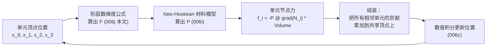

# 前置知识：有限元方法 FEM 基础——四面体网格与形函数

> **一句话**：[前三篇](/前置知识/006i_前置知识_超弹性材料模型Neo-Hookean与本构关系) 讲清楚了"给定一个形变梯度 $F$，怎么算出应力和能量"，但一整块连续的果冻有无穷多个点，每一点的 $F$ 理论上都可能不同——不可能真的对每一个点单独计算。**有限元方法（FEM，Finite Element Method）**解决了这个问题：把果冻切成有限个小四面体（或二维情况下的三角形），假设每个小块内部的变形是"线性均匀"的，这样只需要记录每个四面体四个顶点的位置，就能算出整个四面体内部任意一点的近似形变梯度。本文讲清楚这个离散化思路的核心工具——**形函数**（shape function），它是连接"顶点位置"和"内部任意一点变形状态"的桥梁。

**知识链接**：
- [形变梯度与应变张量](/前置知识/006g_前置知识_形变梯度与应变张量) — 本文要计算的正是每个有限元单元内的形变梯度
- [超弹性材料模型：Neo-Hookean 与本构关系](/前置知识/006i_前置知识_超弹性材料模型Neo-Hookean与本构关系) — 材料模型作用在本文离散化出的每个单元上
- [质点弹簧模型与绳索仿真基础](/前置知识/006e_前置知识_质点弹簧模型与绳索仿真基础) — 绳索的"离散成质点+弹簧"和本文"离散成单元+形函数"是同一个思路在不同维度上的推广
- 下游：[稀疏线性系统与共轭梯度法](/前置知识/006k_前置知识_稀疏线性系统与共轭梯度法) — 有限元离散化后要解的大规模线性系统
- 下游：[Vertex Block Descent（VBD）](/前置知识/006m_前置知识_Vertex_Block_Descent与软体求解) — 现代软体求解器基于有限元离散但用不同方式求解

---

## 贯穿全文的例子

> **场景**：还是那块果冻，这次要在计算机里真正把它建成一个可以仿真的模型。果冻的形状（一个近似球形的连续体）需要先被"切"成很多个小四面体，每个四面体的四个角是几个记录了位置的顶点。手指按压其中一个区域后,只有被按压区域附近的顶点会明显移动,离得远的顶点几乎不动——但四面体**内部**（不只是四个顶点）到底发生了什么形变，需要一种方法从"四个顶点怎么移动"反推出"整个四面体内部任意一点的形变梯度"。这正是本文要讲的"形函数"要解决的问题。

---

## 一、为什么要把连续体切成有限个单元

### 1.1 直接对连续体求解太难

[应力张量](/前置知识/006h_前置知识_应力张量与柯西应力) 第四节推出的力平衡方程 $\nabla\cdot\sigma+\mathbf b=\rho\ddot{\mathbf u}$，是一个对**每一个点**都成立的偏微分方程——理论上想知道果冻在按压下的确切变形，需要解这个方程在整块果冻区域上的解。这类偏微分方程在任意复杂形状（比如果冻不是规则的球体,而是一个不规则的机器人软爪形状）上几乎不可能有解析解。

### 1.2 有限元的核心思路：化连续为离散

有限元方法的做法和 [质点弹簧模型](/前置知识/006e_前置知识_质点弹簧模型与绳索仿真基础) 处理绳索的思路本质相同——**把整块连续体切成有限个小块（称为"单元"，element），只在有限个顶点（称为"节点"，node）上记录状态**，然后假设每个小块内部的变形可以由该单元的顶点位置**近似**重构出来。三维情况下最常用的单元形状是**四面体**（tetrahedron，四个顶点，类似三棱锥）,二维情况下是**三角形**——本文后面为了方便可视化,主要用三角形讲解,所有结论直接推广到三维四面体。


> 左图：一块连续的圆形区域（虚线边界）被切割成很多个小三角形单元，顶点（蓝色小点）是仅需记录状态的"节点"，三角形内部不需要单独记录任何东西——这正是"化无穷为有限"的核心操作。右图：单个三角形单元上,对应顶点 $v_0$ 的**形函数** $N_0(x,y)$ 画成一个曲面——在顶点 $v_0$ 处取值恰好为 1，在另外两个顶点处取值恰好为 0，中间是一个平面（线性过渡）。这正是本文第二节要讲透的核心工具。

**在我们的例子中**：果冻被切成几百上千个小四面体，仿真每一步只需要更新这几百上千个顶点的位置（而不是无穷多个内部点），每个四面体根据自己四个顶点的位置反推出内部的形变梯度，代入材料模型算出应力和力,再把力施加回顶点——这个循环正是 [应力张量](/前置知识/006h_前置知识_应力张量与柯西应力) 第四节流程图里"顶点位置→$F$→材料模型→应力→顶点力"这条链路的具体离散化实现。

---

## 二、形函数：从顶点位置插值出单元内部任意一点的状态

### 2.1 形函数的定义

对一个三角形单元（顶点 $v_0,v_1,v_2$），**形函数** $N_i(\mathbf x)$（$i=0,1,2$）是三个特殊设计的函数——每个 $N_i$ 在自己对应的顶点 $v_i$ 处取值为 1，在另外两个顶点处取值为 0，且在三角形内部**线性**变化（这称为**线性单元**，是有限元里最简单、最常用的一种）。有了形函数，三角形内部**任意一点** $\mathbf x$ 的某个物理量（比如位移 $\mathbf u$），可以通过顶点上的值做加权插值得到：

$$
\mathbf u(\mathbf x) = \sum_{i=0}^{2} N_i(\mathbf x)\,\mathbf u_i
$$

**这个公式在做什么**：三角形内部任意一点的位移，是三个顶点位移的加权平均，权重就是形函数——离哪个顶点近，那个顶点的形函数值就大，对内部这一点的位移贡献也越大。

::: details 📐 公式详解（点击展开）

| 子表达式 | 它是谁 | 它在干嘛 |
|---------|--------|---------|
| $\mathbf u_i$ | **顶点 $i$ 的位移**（已知量） | 仿真每一步实际记录、更新的状态——只有这些顶点值是"自由度" |
| $N_i(\mathbf x)$ | **顶点 $i$ 的形函数**（权重函数） | 一个提前算好的、只依赖单元几何形状的函数,不随仿真过程改变 |
| $\mathbf u(\mathbf x)$ | **单元内部任意一点的位移**（插值结果） | 通过顶点值和权重的加权和"猜"出来的,不是真实测量值，是近似 |

**用人话读**："只要知道三角形三个角的位移是多少，任意想知道内部哪一点的位移，用形函数当权重做个加权平均就能估出来——离哪个角近，那个角的位移权重就大。"

**为什么用"线性插值"这么简单的假设就够用**：如果单元切得足够小，真实的连续变形在这么小的一块区域内，用线性近似的误差可以忽略不计（这类似于任何光滑曲线在足够短的一段上都近似是直线）。有限元方法的精度控制,主要就是通过"把单元切得多细"来实现的——网格越密（单元越小），线性近似的误差越小，但计算量也越大，这是有限元仿真里精度和效率的核心权衡。
:::

### 2.2 重心坐标：形函数的具体计算公式

三角形（二维）情况下,形函数有一个非常直观的几何解释——它们就是**重心坐标**（barycentric coordinates）。对三角形内部任意一点 $\mathbf x$，$N_i(\mathbf x)$ 恰好等于"把 $\mathbf x$ 和另外两个顶点连起来构成的小三角形面积"除以"整个大三角形面积"：

$$
N_i(\mathbf x) = \frac{\text{Area}(\mathbf x, v_j, v_k)}{\text{Area}(v_0,v_1,v_2)}, \qquad \{i,j,k\}=\{0,1,2\}
$$

**这个公式在做什么**：用面积比例这个非常直观的几何量,直接给出形函数的具体数值——点 $\mathbf x$ 离顶点 $v_i$ 越近（对面小三角形面积越大),$N_i$ 越大。

::: details 📐 公式详解（点击展开）

| 子表达式 | 它是谁 | 它在干嘛 |
|---------|--------|---------|
| $\text{Area}(\mathbf x,v_j,v_k)$ | **点 $\mathbf x$ 和另外两个顶点构成的小三角形面积** | $\mathbf x$ 越靠近 $v_i$（离 $v_j,v_k$ 这条边越远）,这个小三角形面积越大 |
| $\text{Area}(v_0,v_1,v_2)$ | **整个大三角形的面积** | 归一化分母，保证三个形函数加起来恒等于 1 |
| $N_i(\mathbf x)$ | **重心坐标/形函数值** | 一个 0 到 1 之间的数,恰好等于点 $\mathbf x$ 到 $v_i$ 的"相对亲近程度" |

**用人话读**："看点 $\mathbf x$ 距离顶点 $v_i$ 对面那条边有多远（用三角形面积衡量），除以整个三角形的面积，就是这个点'属于' $v_i$ 的比例——$\mathbf x$ 恰好落在 $v_i$ 上时,对面小三角形退化成整个大三角形,比例正好是 1，符合形函数的定义。"

**为什么三个形函数加起来恒等于1**：$N_0+N_1+N_2$ 恰好对应三个小三角形面积加起来正好等于总面积（可以用简单的几何论证验证），这个性质保证了 2.1 节的插值公式在"整块材料只是整体平移"时（三个顶点位移完全相同,记为 $\mathbf u_0=\mathbf u_1=\mathbf u_2=\mathbf c$）能正确插值出 $\mathbf u(\mathbf x)=\mathbf c$（内部任意点也是同样的平移量），这是形函数设计必须满足的基本一致性要求。
:::

---

## 三、从形函数到形变梯度：本文和前几篇的连接点

### 3.1 关键公式：单元内的形变梯度是常数

有了形函数,可以推出一个对整个有限元方法极其重要的结论——**对于线性三角形/四面体单元，单元内部的形变梯度 $F$ 是一个常数（不随位置 $\mathbf x$ 变化）**，可以直接由顶点位置计算：

$$
F = \left(\sum_i \mathbf x_i \otimes \nabla N_i\right)
$$

**这个公式在做什么**：形变梯度不需要对形函数插值公式重新推导,可以直接用每个顶点的当前位置,加权累加"顶点位置"和"形函数梯度"的外积——这个结果对整个单元内部处处相同（因为线性形函数的梯度本身是常数)。

::: details 📐 公式详解（点击展开）

| 子表达式 | 它是谁 | 它在干嘛 |
|---------|--------|---------|
| $\mathbf x_i$ | **顶点 $i$ 的当前位置** | 仿真每一步实际记录的状态 |
| $\nabla N_i$ | **形函数 $N_i$ 的梯度**（常向量） | 因为 $N_i$ 在单元内是线性函数,它的梯度处处相同,只依赖单元的几何形状（参考构型），仿真开始时算一次就够,不需要每帧重算 |
| $\mathbf x_i\otimes\nabla N_i$ | **外积**（一个矩阵） | 两个向量的外积构成一个矩阵，累加所有顶点的贡献,恰好重构出这个单元的形变梯度 |

**用人话读**："这个单元到底被拉伸/剪切成了什么样(形变梯度)，只需要把每个顶点此刻的位置，乘上一个提前算好的'几何权重'（形函数梯度），加起来就得到了——不需要对单元内部无穷多个点分别求解。"

**为什么这个结果和 [006g](/前置知识/006g_前置知识_形变梯度与应变张量) 代码示例里"用两条边向量反解 F"的方法是等价的**：这正是同一个数学结果的两种不同表达方式——[006g](/前置知识/006g_前置知识_形变梯度与应变张量) 代码示例里 `D_cur @ np.linalg.inv(D_ref)` 这行代码,本质上就是这个形函数梯度公式在只有三个顶点、线性单元这个特殊情况下的简化实现,两种写法算出来的 $F$ 完全一致——本文是从"形函数插值"这个更一般的理论视角重新推导了同一个结果,读者可以对照理解。
:::

### 3.2 完整链路：从顶点位置到顶点力

结合本文和前几篇，现在可以完整写出有限元仿真每一步的计算流程：



单元节点力的计算公式（把材料应力转换回顶点力,是 [应力张量](/前置知识/006h_前置知识_应力张量与柯西应力) 第四节力平衡方程离散化后的直接结果）：

$$
\mathbf f_i = -V_0\,P\,\nabla N_i
$$

**这个公式在做什么**：这是本文最后一步——把材料模型算出的应力 $P$（一个矩阵）转换成施加在每个顶点上的力（一个向量），转换的"翻译规则"正是形函数的梯度,乘上这个单元未变形时的体积做归一化。

::: details 📐 公式详解（点击展开）

| 子表达式 | 它是谁 | 它在干嘛 |
|---------|--------|---------|
| $V_0$ | **单元在参考构型下的体积/面积** | 固定不变的几何量,仿真开始时算一次 |
| $P$ | **PK1 应力**（[006i](/前置知识/006i_前置知识_超弹性材料模型Neo-Hookean与本构关系) 材料模型的输出） | 描述这个单元此刻内部力的强度和方向 |
| $\nabla N_i$ | **形函数梯度**（同3.1节，固定几何量） | 把应力"翻译"到具体某个顶点该受多大力的权重 |
| $\mathbf f_i$ | **顶点 $i$ 受到的这个单元贡献的力** | 一个顶点通常属于多个相邻单元，每个单元都会贡献一份力,需要累加（"组装"步骤） |

**用人话读**："这个单元算出的内部应力，通过形函数梯度这个几何权重,分配到四个（或三个）顶点上——一个顶点如果同时属于好几个四面体，每个四面体分别算出自己的一份力,加在一起就是这个顶点受到的总内部力。"

**为什么需要"组装"这一步**：真实网格里,绝大多数顶点是被多个相邻单元共享的（比如内部一个顶点可能被十几个四面体共用），每个单元独立算出自己对共享顶点的力贡献之后,必须把所有贡献加起来,才是这个顶点真正受到的总力——这个"分别计算、再汇总累加"的过程,是有限元代码实现里非常核心但容易被忽略的一步，直接决定了整个方法能不能正确模拟"一整块连续材料"（而不是一堆互不相干的独立小三角形）。
:::

---

## 四、代码示例：一个完整的最小有限元软体仿真（二维三角形网格）

```python
import numpy as np

def compute_shape_function_gradients_2d(X_ref):
    """
    计算三角形单元三个形函数的梯度（本文3.1节公式），
    只依赖参考构型（未变形）的顶点位置,仿真开始时算一次即可复用。
    """
    x0, x1, x2 = X_ref
    area2 = (x1[0]-x0[0])*(x2[1]-x0[1]) - (x2[0]-x0[0])*(x1[1]-x0[1])
    area = abs(area2) / 2.0

    # 标准公式：三角形线性形函数梯度（推导略,可在任意FEM教材中查到）
    grad_N = np.zeros((3, 2))
    grad_N[0] = np.array([x1[1]-x2[1], x2[0]-x1[0]]) / area2
    grad_N[1] = np.array([x2[1]-x0[1], x0[0]-x2[0]]) / area2
    grad_N[2] = np.array([x0[1]-x1[1], x1[0]-x0[0]]) / area2
    return grad_N, area

def compute_F_from_shape_gradients(x_cur, grad_N):
    """本文3.1节公式：F = sum_i x_i (外积) grad_N_i"""
    F = np.zeros((2, 2))
    for i in range(3):
        F += np.outer(x_cur[i], grad_N[i])
    return F

def neohookean_pk1_stress(F, mu, lam):
    """复用006i篇的Neo-Hookean应力公式"""
    J = np.linalg.det(F)
    F_inv_T = np.linalg.inv(F).T
    return mu * F - mu * F_inv_T + lam * (J - 1) * J * F_inv_T

def element_nodal_forces(P, grad_N, area):
    """本文3.2节公式：把应力P转换成三个顶点的力"""
    forces = np.zeros((3, 2))
    for i in range(3):
        forces[i] = -area * (P @ grad_N[i])
    return forces

# ============ 贯穿全文的例子：单个三角形单元被压缩测试 ============
X_ref = np.array([[0.0, 0.0], [1.0, 0.0], [0.0, 1.0]])  # 参考（未变形）构型
grad_N, area0 = compute_shape_function_gradients_2d(X_ref)
print(f"参考面积: {area0}")
print(f"形函数梯度之和应为0（对应'整体平移不产生力'的一致性要求）: {grad_N.sum(axis=0)}")

# 当前构型：顶点2被向下压缩
x_cur = np.array([[0.0, 0.0], [1.0, 0.0], [0.0, 0.6]])

F = compute_F_from_shape_gradients(x_cur, grad_N)
print(f"\n计算出的形变梯度 F:\n{F}")

mu, lam = 0.001, 0.002  # 软材料参数
P = neohookean_pk1_stress(F, mu, lam)
forces = element_nodal_forces(P, grad_N, area0)

print(f"\nPK1应力 P:\n{P}")
print(f"\n三个顶点受到的力:\n{forces}")
print(f"\n三个顶点力之和（应接近0，验证内部力自平衡）: {forces.sum(axis=0)}")
```

**代码里值得注意的细节**：

1. `grad_N.sum(axis=0)` 应该恒等于零向量——这是形函数设计必须满足的一致性条件（2.2 节提到的"整体平移不产生变形"），代码里直接验证了这一点，读者可以运行代码亲眼确认。
2. `forces.sum(axis=0)` 应该也接近零向量——三个顶点受到的内部力必须互相抵消（牛顿第三定律的推广：一个孤立单元不能自己凭空产生净力让自己飞起来），这是有限元力计算正确性最基本的检验标准，任何实现完成后都应该做这个检查。
3. 这段代码只处理了单个三角形单元；真实仿真需要在所有单元上重复这个计算，再执行 3.2 节讲的"组装"步骤（把共享顶点的力累加），下一篇 [稀疏线性系统与共轭梯度法](/前置知识/006k_前置知识_稀疏线性系统与共轭梯度法) 会讲清楚组装后如何高效求解整个系统。

---

## 五、常见疑问

### Q1：为什么线性单元（三个/四个顶点）用得最多，而不是用更高阶（更多顶点、更精确）的单元？

高阶单元（比如每条边中点也算一个顶点，形函数是二次多项式）确实能用更少的单元达到同样精度，但每个单元的计算复杂度和内存开销显著增加,而且在处理"单元反转"（[006g](/前置知识/006g_前置知识_形变梯度与应变张量) 第五节讲的 $J\le0$ 故障）等鲁棒性问题时,线性单元的行为更容易分析和修复。实时机器人仿真、大规模并行GPU仿真几乎都用线性四面体/三角形单元，用增加单元数量（网格更密）而不是提高单元阶数来换取精度,这是当前主流软体仿真引擎（包括Newton）的普遍设计选择。

### Q2：整个网格有几千个单元、几千个顶点，每一步都要重新组装一次力吗？这不会很慢吗？

是的，每一步仿真都要对所有单元重新计算 $F$、应力、节点力,再组装——但正如 [超弹性材料模型](/前置知识/006i_前置知识_超弹性材料模型Neo-Hookean与本构关系) Q3 提到的,每个单元的计算相互独立,天然适合GPU并行,"组装"这一步（把共享顶点的多个单元贡献累加）也有成熟的并行算法（原子加法/分段归约等技术）。这是为什么现代软体仿真引擎（Newton、Isaac Sim）都构建在GPU计算框架（如NVIDIA Warp）之上——不是因为算法本身多复杂，而是因为"很多个独立的小计算，需要极致并行化才能实时运行"。

### Q3：本文和 006e/006f 讲的绳索质点弹簧模型、PBD 是什么关系？是不是有限元更"高级"，能取代它们？

不完全是取代关系,而是"适用场景不同的工具"。质点弹簧模型/PBD直接在"点+连接关系"（图结构）上操作,概念更简单、实现更快,特别适合绳索、布料这类薄壁或一维/二维结构；有限元建立在严谨的连续介质力学（应变、应力、材料模型）之上，对三维实体（果冻、机器人软爪、生物组织）的物理准确性更高，但计算和实现复杂度也更高。实践中,很多现代仿真器会根据物体类型混用两种方法——布料用类似PBD/质点弹簧的方法，实体软体用有限元方法，这也是为什么 Newton 引擎的 solver 目录里同时存在 `xpbd`、`vbd`、有限元相关代码的原因，后续前置知识（[Vertex Block Descent](/前置知识/006m_前置知识_Vertex_Block_Descent与软体求解)）会讲一种把两条路线的优点结合起来的现代方法。

---

## 六、总结

### 一句话

> 有限元方法把一块连续的软体切成有限个四面体/三角形单元，用**形函数**这个数学工具，把"单元内部任意一点的变形"精确地用"该单元几个顶点的位置"插值重构出来；这个思路让复杂的连续介质偏微分方程，转化成了只需要处理有限个顶点自由度的离散计算问题，是所有基于物理的软体仿真的通用骨架。

### 核心要点

1. 有限元把连续体离散成有限个单元（三角形/四面体），只在顶点（节点）上记录状态，用形函数在单元内部插值
2. 形函数在自己对应的顶点取值为1，在其他顶点取值为0，三角形情况下等价于重心坐标（面积比例）
3. 线性单元内部的形变梯度是常数,可以直接由顶点位置和提前算好的形函数梯度线性组合得到
4. 顶点力通过"应力 × 形函数梯度 × 单元体积"计算，多个单元共享的顶点需要把各单元贡献累加（组装）
5. 每个单元的计算相互独立，天然适合GPU并行，是现代大规模软体仿真的性能基石

### 知识链


---

## 延伸阅读

- [形变梯度与应变张量](/前置知识/006g_前置知识_形变梯度与应变张量) — 本文单元形变梯度计算的理论基础
- [超弹性材料模型：Neo-Hookean 与本构关系](/前置知识/006i_前置知识_超弹性材料模型Neo-Hookean与本构关系) — 本文单元应力计算所调用的材料模型
- [稀疏线性系统与共轭梯度法](/前置知识/006k_前置知识_稀疏线性系统与共轭梯度法) — 下一步：组装后的整体系统怎么高效求解
- Sifakis & Barbic, "FEM Simulation of 3D Deformable Solids" (SIGGRAPH 2012 course notes) — 图形学视角有限元软体仿真的经典入门教程
- Hughes, *The Finite Element Method: Linear Static and Dynamic Finite Element Analysis* — 有限元方法的权威数学教材

