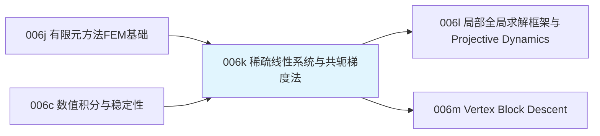

# 前置知识：稀疏线性系统与共轭梯度法——软体仿真每一步都要解的方程

> **一句话**：[有限元](/前置知识/006j_前置知识_有限元方法FEM基础_四面体网格与形函数) 每一步都能算出所有顶点受到的力，但如果材料很"硬"（回忆 [数值积分](/前置知识/006c_前置知识_物理仿真数值积分_辛积分与能量稳定性) 讲过的刚性问题），想要稳定地大步长仿真,就必须用隐式积分——而隐式积分意味着每一步要解一个包含几千甚至几十万个未知数的线性方程组。直接用矩阵求逆的方式解这个方程,对这种规模完全不现实。**共轭梯度法**（Conjugate Gradient，CG）是解这类大规模、稀疏、对称正定线性系统最常用的迭代算法，是几乎所有现代软体/隐式仿真求解器内部真正在跑的核心计算。

**知识链接**：
- [有限元方法 FEM 基础：四面体网格与形函数](/前置知识/006j_前置知识_有限元方法FEM基础_四面体网格与形函数) — 本文要解的线性系统正是有限元组装之后得到的
- [物理仿真数值积分：辛积分与能量稳定性](/前置知识/006c_前置知识_物理仿真数值积分_辛积分与能量稳定性) — 隐式积分是本文线性系统产生的直接原因
- [数值优化基础：梯度下降与牛顿法](/前置知识/003c_前置知识_数值优化基础_梯度下降与牛顿法) — 共轭梯度法是对梯度下降"之字形收敛慢"这个问题的直接改进
- 下游：[局部-全局求解框架与 Projective Dynamics](/前置知识/006l_前置知识_局部全局求解框架与Projective_Dynamics) — 另一种绕开显式求解大型线性系统的思路
- 下游：[Vertex Block Descent（VBD）](/前置知识/006m_前置知识_Vertex_Block_Descent与软体求解) — Newton 引擎实际使用的、进一步绕开全局线性求解的现代方法

---

## 贯穿全文的例子

> **场景**：果冻网格有 5000 个顶点，仿真希望用隐式积分求一个大步长下所有顶点的新位置。展开隐式方程之后，得到一个"5000×3=15000 个未知数"的线性方程组 $A\mathbf x=\mathbf b$——矩阵 $A$ 虽然是 15000×15000 那么大，但因为每个顶点只和相邻的少数几个顶点有力学关联（不是所有顶点两两都有关系），这个矩阵里绝大多数元素都是零（**稀疏矩阵**）。我们想知道：这么大的一个方程组，怎么在几毫秒内解出来，还要在仿真每一帧都重新解一次？

---

## 一、为什么隐式积分会带来一个大型线性方程组

### 1.1 回顾：隐式积分需要解方程

[数值积分](/前置知识/006c_前置知识_物理仿真数值积分_辛积分与能量稳定性) 第四节讲过隐式 Euler——用**下一时刻**（未知）的状态计算力,这样即使材料很"硬"（回忆 [超弹性材料模型](/前置知识/006i_前置知识_超弹性材料模型Neo-Hookean与本构关系) 里,泊松比接近0.5时体积惩罚项会变得极其"硬"）,也能用较大的步长稳定仿真，代价是需要求解一个方程,因为未知的新位置同时出现在等式两边。

### 1.2 从单个弹簧到整个网格：方程的规模爆炸

单个弹簧-质点系统的隐式方程（[数值积分](/前置知识/006c_前置知识_物理仿真数值积分_辛积分与能量稳定性) 4.2 节）只有一个标量未知数,可以直接代数求解。但一整块软体网格，每个顶点的新位置**同时**依赖所有相邻顶点的新位置（因为力是通过 [有限元](/前置知识/006j_前置知识_有限元方法FEM基础_四面体网格与形函数) 组装出来的,一个顶点受到所有相邻单元的贡献）——把所有顶点的隐式方程联立起来，就得到一个规模等于"顶点数×3"的**大型线性方程组**：

$$
A\,\Delta\mathbf x = \mathbf b
$$

**这个公式在做什么**：这是把整个网格所有顶点的隐式积分方程,联立写成的标准线性方程组形式——$\Delta\mathbf x$ 是这一步所有顶点位置的修正量（未知），$A$ 编码了"顶点之间怎么互相影响"，$b$ 是已知的当前力/位置信息。解出这一个方程，就同时得到了所有顶点下一步该往哪里移动。

::: details 📐 公式详解（点击展开）

| 子表达式 | 它是谁 | 它在干嘛 |
|---------|--------|---------|
| $\Delta\mathbf x$ | **所有顶点位置修正量**（未知向量，长度=顶点数×3） | 这是要求解的目标——一次性解出网格所有顶点这一步该挪动多少 |
| $A$ | **系统矩阵**（大小=未知数个数的平方，但绝大多数元素为零） | 编码了"顶点 $i$ 的受力对顶点 $j$ 位置变化有多敏感"，本质上是材料模型的刚度信息（力对位置的导数），只有相邻（通过共享单元连接）的顶点之间才有非零元素 |
| $\mathbf b$ | **已知的右端项** | 由当前的力、速度等已知量组成,不依赖未知的 $\Delta\mathbf x$ |

**用人话读**："把网格所有顶点的隐式更新方程一次性联立起来，变成一个大规模的线性代数问题——解出这一个方程，就相当于同时解出了所有顶点这一步该往哪挪。"

**为什么 $A$ 是稀疏的**：一个顶点最多只和它直接相邻（同属于至少一个四面体/三角形单元）的顶点有力学关联——[有限元](/前置知识/006j_前置知识_有限元方法FEM基础_四面体网格与形函数) 的力计算只涉及局部单元,不会让相距很远的两个顶点直接产生关联。对一个 5000 顶点的网格,矩阵理论上有 5000×5000×9（3×3子块）个元素，但每个顶点通常只和十几个邻居有关联,真正非零的元素占比可能不到 1%——这正是"稀疏矩阵"的含义，也是本文要专门讨论求解方法的原因：通用的稠密矩阵算法完全没有利用这个稀疏结构,会浪费大量计算在本来就是零的地方。
:::

---

## 二、为什么不能直接求逆：稠密方法的代价

### 2.1 直接求解的计算复杂度

如果用最直接的方法（比如高斯消元或直接求逆 $A^{-1}$）解这个方程,计算复杂度大约是未知数个数的三次方——对于 $n=15000$ 个未知数,这是 $15000^3\approx3.4\times10^{12}$ 次运算量级，即使在现代GPU上,每一步仿真都做这个量级的计算,完全无法达到实时或接近实时的速度要求。而且直接求逆的方法不会自动利用矩阵的稀疏结构（求逆之后的矩阵 $A^{-1}$ 通常是稠密的,即使 $A$ 本身很稀疏）,内存开销也随未知数平方增长,对大网格根本存不下。

### 2.2 迭代法的思路：不求精确解，逐步逼近

**迭代法**换了一个思路——不追求"一步到位"精确解出方程,而是从一个初始猜测开始,每一步只做几次"矩阵乘向量"这种代价低廉、天然利用稀疏结构的运算（矩阵乘向量的复杂度只和非零元素个数成正比,对稀疏矩阵远比 $n^2$ 小），逐步把猜测值调整得越来越接近真实解,迭代若干次之后取一个足够精确的近似解就停止。这正是本文接下来要讲的共轭梯度法的核心策略。

---

## 三、共轭梯度法：比最速下降聪明的迭代方向选择

### 3.1 把解方程问题变成优化问题

共轭梯度法建立在一个关键的等价关系上——如果 $A$ 是对称正定矩阵（软体仿真里的系统矩阵通常满足这个条件），解 $A\mathbf x=\mathbf b$ 完全等价于求解下面这个二次函数的最小值点：

$$
\min_{\mathbf x}\ f(\mathbf x)=\frac12\mathbf x^\top A\mathbf x - \mathbf b^\top\mathbf x
$$

**这个公式在做什么**：把"解一个线性方程"重新表述成"找一个碗状曲面的最低点"——这个二次函数的梯度恰好是 $A\mathbf x-\mathbf b$，梯度为零（曲面最低点）正好对应 $A\mathbf x=\mathbf b$，两个问题的答案完全一致，但优化问题可以用更灵活的迭代算法求解。

::: details 📐 公式详解（点击展开）

| 子表达式 | 它是谁 | 它在干嘛 |
|---------|--------|---------|
| $\frac12\mathbf x^\top A\mathbf x$ | **二次项** | 因为 $A$ 正定，这一项保证 $f$ 是一个"碗状"（凸）函数,有唯一的全局最小值 |
| $\mathbf b^\top\mathbf x$ | **线性项** | 决定了"碗"的最低点具体在哪个位置 |
| $\nabla f(\mathbf x)=A\mathbf x-\mathbf b$ | **梯度** | 梯度为零正好就是我们要解的方程 $A\mathbf x=\mathbf b$ |

**用人话读**："解方程 $A\mathbf x=\mathbf b$ 这件事，等价于找一个'碗'形状曲面的最低点——'碗'的具体形状由 $A$ 决定,最低点的位置由 $\mathbf b$ 决定。"

**为什么要转换成优化问题**：因为优化问题有大量成熟的迭代算法可以借用（比如 [数值优化基础](/前置知识/003c_前置知识_数值优化基础_梯度下降与牛顿法) 讲的梯度下降），而这些迭代算法每一步只需要做矩阵向量乘法（计算梯度 $A\mathbf x-\mathbf b$），天然适合稀疏矩阵，不需要显式构造或求逆整个矩阵。
:::

### 3.2 最速下降的问题：之字形收敛

最直接的迭代算法是**最速下降法**（gradient descent）——每一步沿着当前梯度的反方向走一步。但对于"细长的碗"（矩阵 $A$ 病态,即不同方向的曲率差异很大),最速下降会反复"之字形"地来回震荡,收敛很慢。共轭梯度法解决了这个问题——它每一步选择的方向,不是简单的梯度反方向,而是精心构造出一组**互相"共轭"**（在 $A$ 定义的度量下互相垂直）的搜索方向,保证沿着这些方向走一次就"用光"了那个方向上的误差,不会像最速下降一样来回抵消对方的努力。


> 左图：同一个二维二次型优化问题（等高线为灰色椭圆），红色是最速下降的迭代路径——明显走"之字形"，25步还没收敛到精确解；蓝色是共轭梯度法的路径——只用 2 步（对应问题维度）就精确走到了绿色星标的精确解。右图：一个 100 维的稀疏对称正定系统,共轭梯度法残差范数随迭代次数呈近似指数下降（对数坐标下接近直线）——这正是共轭梯度法在真实大规模问题上"迭代几十次就足够精确"这个实用性质的直接展示。

**在我们的例子中**：果冻网格的隐式方程,矩阵 $A$ 的维度高达 15000，但共轭梯度法通常只需要迭代几十到一两百次（远小于 15000）就能收敛到足够精确的近似解——这正是共轭梯度法能让隐式积分在实时仿真里可行的关键。

### 3.3 共轭梯度法的迭代公式

$$
\alpha_k = \frac{\mathbf r_k^\top\mathbf r_k}{\mathbf p_k^\top A\mathbf p_k}, \qquad \mathbf x_{k+1}=\mathbf x_k+\alpha_k\mathbf p_k, \qquad \mathbf r_{k+1}=\mathbf r_k-\alpha_k A\mathbf p_k
$$

**这个公式在做什么**：这是共轭梯度法每一步迭代的核心更新规则——沿着当前搜索方向 $\mathbf p_k$ 走一个"刚好最优"的步长 $\alpha_k$（让这个方向上的误差正好清零），更新解的估计值,并更新残差（还剩多少没解对）。

::: details 📐 公式详解（点击展开）

| 子表达式 | 它是谁 | 它在干嘛 |
|---------|--------|---------|
| $\mathbf r_k=\mathbf b-A\mathbf x_k$ | **残差**（第 $k$ 步） | 当前解的估计值和真实解之间"差多少"的直接度量,残差为零意味着已经精确解出方程 |
| $\mathbf p_k$ | **搜索方向**（第 $k$ 步） | 这一步要往哪个方向走,精心构造保证和前面所有搜索方向"共轭"（不互相干扰） |
| $\alpha_k$ | **步长** | 沿着 $\mathbf p_k$ 恰好走到这个方向上误差最小的位置,通过一个简单的公式直接算出（不需要额外的线搜索） |
| $A\mathbf p_k$ | **唯一需要的矩阵运算** | 整个算法每一步唯一涉及矩阵的操作就是"矩阵乘向量"，这正是能高效利用稀疏结构、避免显式求逆的关键 |

**用人话读**："每一步往一个精心选好的方向走一段刚好合适的距离，走完之后重新算一下'还差多少'，用这个差值信息决定下一步该往哪个新方向走——整个过程只需要反复做'矩阵乘向量'这个廉价操作，不需要碰矩阵求逆这种昂贵操作。"

**为什么理论上最多 $n$ 步就能精确收敛**：数学上可以证明,对一个 $n$ 维问题,共轭梯度法构造出的搜索方向最多有 $n$ 个互相独立的"共轭方向"，走完这 $n$ 步理论上就精确解出了方程（左图二维问题正好2步收敛，验证了这个理论结果）。实践中，由于浮点数值误差和矩阵的病态程度，真实收敛速度取决于矩阵的条件数（不同方向"曲率"差异有多大）,但即使达不到理论上的 $n$ 步精确收敛,通常远少于 $n$ 步就能得到工程上足够精确的近似解（右图 100 维问题的收敛曲线就是这种典型行为）。
:::

---

## 四、预条件：让收敛更快的额外技巧

### 4.1 条件数决定收敛速度

共轭梯度法的收敛速度理论上和矩阵 $A$ 的**条件数**（最大特征值除以最小特征值,衡量矩阵"病态"程度）密切相关——条件数越大（矩阵越病态,对应"碗"越细长），收敛需要的迭代次数越多。软体仿真里，如果材料参数设置得很悬殊（比如某些方向刚度极高、某些方向极软），系统矩阵的条件数会很差，直接用共轭梯度法可能需要很多次迭代。

### 4.2 预条件共轭梯度法（PCG）

**预条件**（preconditioning）的思路是：找一个容易计算逆的近似矩阵 $M\approx A$，用 $M^{-1}$"预先处理"一下原方程，让新问题的条件数变得更好、更容易收敛——这个方法称为**预条件共轭梯度法**（Preconditioned Conjugate Gradient，PCG），是工程实践中几乎总是采用的版本（相比"纯"共轭梯度法）。最简单的预条件选择是**对角预条件**（Jacobi preconditioner，直接取 $A$ 的对角元素构造 $M$），实现简单、计算代价几乎可以忽略，在很多软体仿真场景已经能带来显著的收敛加速。更复杂的预条件方法（如不完全 Cholesky 分解）能进一步加速，但构造预条件矩阵本身的计算和内存开销也更高，需要根据具体场景权衡。

---

## 五、代码示例：从零实现共轭梯度法并对比性能

```python
import numpy as np
import time

def conjugate_gradient(A, b, tol=1e-8, max_iters=1000):
    """
    本文3.3节公式的直接实现。
    A: 对称正定矩阵（软体仿真的系统矩阵）
    b: 右端项
    返回：近似解 x，实际迭代次数
    """
    x = np.zeros_like(b)
    r = b - A @ x           # 初始残差
    p = r.copy()             # 初始搜索方向就是残差方向
    rs_old = r @ r

    for k in range(max_iters):
        Ap = A @ p            # 唯一的矩阵运算：矩阵乘向量
        alpha = rs_old / (p @ Ap)
        x = x + alpha * p
        r = r - alpha * Ap
        rs_new = r @ r
        if np.sqrt(rs_new) < tol:
            return x, k + 1
        beta = rs_new / rs_old
        p = r + beta * p
        rs_old = rs_new
    return x, max_iters

# ============ 贯穿全文的例子：模拟一个稀疏软体系统矩阵 ============
np.random.seed(42)
n = 2000  # 模拟约650个顶点的三维软体网格（2000个标量自由度）

# 构造一个稀疏对称正定矩阵，模拟软体网格的局部连接结构
from scipy.sparse import random as sparse_random
from scipy.sparse import eye as sparse_eye

density = 0.005  # 稀疏度，模拟"只和少数邻居有关联"
M = sparse_random(n, n, density=density, random_state=42)
A_sparse = (M + M.T) / 2 + n * sparse_eye(n)  # 保证对称正定
A_dense = A_sparse.toarray()

b = np.random.randn(n)

# ============ 对比1：本文实现的CG vs 直接求逆 ============
t0 = time.time()
x_cg, n_iters = conjugate_gradient(A_dense, b, tol=1e-6)
t_cg = time.time() - t0

t0 = time.time()
x_direct = np.linalg.solve(A_dense, b)
t_direct = time.time() - t0

print(f"CG 迭代次数: {n_iters} (系统维度 n={n})")
print(f"CG 用时: {t_cg*1000:.2f} ms")
print(f"直接求解用时: {t_direct*1000:.2f} ms")
print(f"两种方法解的误差: {np.linalg.norm(x_cg - x_direct):.2e}")

# ============ 对比2：利用稀疏结构（scipy稀疏矩阵乘法）进一步加速 ============
from scipy.sparse.linalg import cg as scipy_cg

t0 = time.time()
x_sparse_cg, info = scipy_cg(A_sparse.tocsr(), b, rtol=1e-6)
t_sparse_cg = time.time() - t0
print(f"\n利用稀疏结构的CG用时: {t_sparse_cg*1000:.2f} ms（应远快于稠密版本）")
```

**代码里值得注意的细节**：

1. `conjugate_gradient` 函数体和 3.3 节公式逐项对应——每次循环只做一次 `A @ p`（矩阵乘向量），没有任何矩阵求逆或分解操作。
2. 代码故意对比了"用稠密矩阵存储+CG"和"用稀疏矩阵存储+CG"两种情况——后者的矩阵乘向量操作只需要遍历非零元素，运行会看到明显的速度差异，这正是本文第一、二节强调"必须利用稀疏结构"这个论点的直接数值验证。
3. `n_iters` 通常远小于 `n`（2000），直接验证了本文 3.3 节"实践中远少于理论上限次迭代就能收敛"的结论。

---

## 六、常见疑问

### Q1：共轭梯度法只能用于对称正定矩阵吗？软体仿真的系统矩阵一定满足这个条件吗？

是的，标准共轭梯度法要求矩阵对称正定，这是它高效性的数学基础。软体仿真里，如果材料模型的能量函数是凸的（[超弹性材料模型](/前置知识/006i_前置知识_超弹性材料模型Neo-Hookean与本构关系) 里 Neo-Hookean 在合理参数范围内满足这个性质），隐式积分组装出来的系统矩阵在合理的仿真参数下通常是对称正定的。如果材料模型在极端变形下失去凸性（比如单元接近反转），系统矩阵可能不再正定，这时需要用更通用但更慢的迭代方法（如GMRES），或者在数值上对矩阵做"投影"修正回正定（这是鲁棒软体仿真器的常见工程处理，超出本文范围）。

### Q2：共轭梯度法和神经网络训练里的"共轭梯度优化器"是同一个东西吗？

概念上是同一套数学工具，但应用场景不同。本文讲的是解一个**固定的、线性**的方程组（对应二次优化问题）；神经网络的损失函数通常是高度非线性的，不能直接套用本文的公式,但存在"非线性共轭梯度法"这类推广版本，思路上借鉴了共轭方向的构造技巧,但每一步需要额外的线搜索来处理非线性带来的复杂度。日常深度学习训练更常用Adam等专门为随机梯度、非凸优化设计的方法，而不是共轭梯度法。

### Q3：Newton 引擎、Isaac Sim 这些引擎，是不是每一帧都在跑共轭梯度法？

对使用隐式积分的软体/布料求解器（比如很多基于有限元的实现），是的——每一帧的隐式方程求解，内部通常就是若干次共轭梯度迭代（很多实现会限制最大迭代次数，用"近似解"换取严格的帧率保证，这是实时应用里常见的工程取舍）。但并不是所有求解器都走这条路——下一篇要讲的 [局部-全局求解框架](/前置知识/006l_前置知识_局部全局求解框架与Projective_Dynamics) 和 Newton 实际采用的 [Vertex Block Descent](/前置知识/006m_前置知识_Vertex_Block_Descent与软体求解)，走的是完全绕开显式构造和求解全局大型线性系统的另一条路线，这是本文之后两篇要讲的内容,也是理解"为什么现代软体求解器不是照本文这条最直接的路线做下去"的关键。

---

## 七、总结

### 一句话

> 隐式积分让软体仿真每一步都要解一个规模等于"顶点数×3"的大型线性方程组，直接求逆的代价随规模三次方增长完全不可行；共轭梯度法用"矩阵乘向量"这一种廉价操作,通过精心构造的共轭搜索方向,通常只需要远少于理论上限的迭代次数就能收敛到足够精确的近似解，是让隐式软体仿真在实时/近实时场景可行的核心数值工具。

### 核心要点

1. 有限元组装后的隐式方程是一个大规模、但高度稀疏的线性方程组（因为每个顶点只和少数邻居有力学关联）
2. 直接求逆的复杂度随未知数个数三次方增长，对真实网格规模完全不现实
3. 共轭梯度法把解方程转化为二次优化问题，用一系列互相"共轭"的搜索方向，避免最速下降的之字形震荡
4. 每次迭代只需要一次矩阵乘向量运算，天然适合利用矩阵的稀疏结构
5. 预条件（如对角预条件）能显著改善病态系统的收敛速度，是工程实践中几乎总会采用的加速手段

### 知识链



---

## 延伸阅读

- [有限元方法 FEM 基础：四面体网格与形函数](/前置知识/006j_前置知识_有限元方法FEM基础_四面体网格与形函数) — 本文线性系统的来源
- [数值优化基础：梯度下降与牛顿法](/前置知识/003c_前置知识_数值优化基础_梯度下降与牛顿法) — 最速下降法的基础，共轭梯度法是对它的改进
- [局部-全局求解框架与 Projective Dynamics](/前置知识/006l_前置知识_局部全局求解框架与Projective_Dynamics) — 下一步：绕开全局共轭梯度求解的另一条思路
- Shewchuk, "An Introduction to the Conjugate Gradient Method Without the Agonizing Pain" — 共轭梯度法最广为流传的直觉化教程
- Nocedal & Wright, *Numerical Optimization* — 共轭梯度法、预条件方法的权威数学教材

