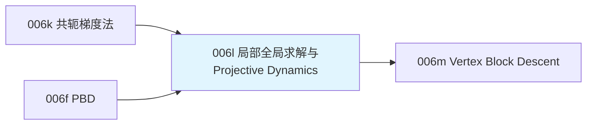

# 前置知识：局部-全局求解框架与 Projective Dynamics

> **一句话**：[共轭梯度法](/前置知识/006k_前置知识_稀疏线性系统与共轭梯度法) 已经把"解一个大型线性系统"变得可行,但每次迭代还是要面对材料模型可能带来的非线性（[超弹性材料](/前置知识/006i_前置知识_超弹性材料模型Neo-Hookean与本构关系) 的应力对形变梯度并不是线性关系）——非线性系统的求解通常需要在共轭梯度法外面再套一层牛顿迭代,双重迭代,更慢。**Projective Dynamics** 提出了一个巧妙的思路：把每个约束（弹簧、体积保持等）先各自"投影"到它自己最满意的形状（这一步极其简单、可以并行），再用一次**线性**（不是非线性）的全局求解把所有约束的意见"揉合"成一个折中位置——把非线性问题拆成了一系列简单的局部投影加一次性求解的线性系统，这个"局部-全局"（local-global）框架是后面 Vertex Block Descent 等现代软体求解器共同的思想源头。

**知识链接**：
- [稀疏线性系统与共轭梯度法](/前置知识/006k_前置知识_稀疏线性系统与共轭梯度法) — 本文全局步骤要解的线性系统正是用这篇的方法求解
- [基于位置的动力学 PBD](/前置知识/006f_前置知识_基于位置的动力学PBD) — PBD 的"约束投影"思想和本文的"局部投影"高度相似，本文会明确对比两者的区别
- [超弹性材料模型：Neo-Hookean 与本构关系](/前置知识/006i_前置知识_超弹性材料模型Neo-Hookean与本构关系) — 本文要绕开的正是这类材料模型带来的非线性
- 下游：[Vertex Block Descent（VBD）](/前置知识/006m_前置知识_Vertex_Block_Descent与软体求解) — 直接继承并改进本文的局部-全局思想，是 Newton 引擎实际使用的算法

---

## 贯穿全文的例子

> **场景**：一块布料网格，每一根"边"都被建模成一根弹簧（回忆 [质点弹簧模型](/前置知识/006e_前置知识_质点弹簧模型与绳索仿真基础)），此外还有一些约束要求局部三角形保持面积、保持平整（不要过度折叠）。每一步仿真,布料因为重力和碰撞被拉扯变形——每一根弹簧、每一个约束都"希望"自己周围的顶点回到某个理想形状,但一个顶点通常同时被好几个弹簧和约束"拉扯"，各方意见不一致。我们想知道：怎么快速地在"每个约束的诉求"和"顶点实际该往哪走"之间找到一个折中，而不需要对每个约束单独做复杂的非线性求解？

---

## 一、问题的起点：非线性材料模型让共轭梯度法不够用

### 1.1 隐式积分 + 非线性材料的双重困难

[共轭梯度法](/前置知识/006k_前置知识_稀疏线性系统与共轭梯度法) 高效求解的前提是系统矩阵**固定不变**（一次构造,反复用共轭梯度迭代逼近解）。但如果材料模型是非线性的（[Neo-Hookean](/前置知识/006i_前置知识_超弹性材料模型Neo-Hookean与本构关系) 的应力 $P$ 不是形变梯度 $F$ 的线性函数），隐式方程本身就是一个非线性方程,不能直接套用共轭梯度法——通常的做法是外面再套一层**牛顿迭代**：每次牛顿迭代要重新线性化（构造一个新的、和当前状态相关的近似矩阵),再对这个近似线性系统跑一次完整的共轭梯度求解,然后检查够不够精确,不够就再来一轮。这个"外层牛顿迭代,内层共轭梯度迭代"的双重循环,计算成本比单纯共轭梯度法高出不少。

### 1.2 Projective Dynamics 的核心洞察

Projective Dynamics（简称PD，Bouaziz et al. 2014 年提出）注意到,很多常用的约束（弹簧长度、体积保持、布料的弯曲/剪切约束）都有一个共同结构——它们的能量函数可以写成"当前形状"和"某个约束允许的最近合法形状"之间的距离平方。这类能量有一个特别好的性质：**如果先固定"最近合法形状"是哪个,剩下的问题对顶点位置是严格线性/二次的**——这正是绕开非线性求解的关键突破口。

---

## 二、局部步骤：把每个约束独立投影到它的"心愿形状"

### 2.1 局部投影的定义

对每一个约束（比如某根弹簧），**局部步骤**（local step）做的事情是：固定住当前所有顶点的位置,只问"这根弹簧，如果不受任何其他约束干扰，自己最希望达到的形状是什么？"——对弹簧约束来说,答案很简单：把当前长度投影到最近的、满足自然长度的形状（这正是 [PBD](/前置知识/006f_前置知识_基于位置的动力学PBD) 距离约束投影公式的直接类比）：

$$
\mathbf p_{\text{proj}} = \arg\min_{\mathbf p\in\mathcal C}\ \|\mathbf p-\mathbf q\|^2
$$

**这个公式在做什么**：给定顶点当前的（可能违反约束的）位置 $\mathbf q$，在这个约束允许的所有合法形状集合 $\mathcal C$（比如"长度恰好等于 $L_0$ 的所有可能形状"）里,找出离 $\mathbf q$ 最近的一个——这就是这个约束的"心愿"。

::: details 📐 公式详解（点击展开）

| 子表达式 | 它是谁 | 它在干嘛 |
|---------|--------|---------|
| $\mathbf q$ | **当前形状**（可能违反约束） | 由当前顶点位置直接算出，比如两个顶点当前的实际距离 |
| $\mathcal C$ | **合法形状集合** | 由约束类型定义，比如"距离恰好等于 $L_0$"对应的所有点对形状构成的集合 |
| $\mathbf p_{\text{proj}}$ | **投影结果（心愿形状）** | 集合 $\mathcal C$ 里离当前形状最近的一个点，对弹簧约束来说这个投影有解析解（就是 [PBD](/前置知识/006f_前置知识_基于位置的动力学PBD) 里讲过的距离约束修正） |

**用人话读**："每根弹簧只顾自己——不管其他弹簧和顶点的意见，只问'我自己想要的理想长度形状,离当前形状最近的是哪个'，直接算出来。"

**为什么这一步可以完全并行**：每个约束的投影计算只依赖它自己涉及的几个顶点的**当前**位置（在这一轮迭代开始时固定不变，不需要等其他约束算完），互不干扰——这和 [PBD](/前置知识/006f_前置知识_基于位置的动力学PBD) 里约束投影需要按顺序（Gauss-Seidel 风格）迭代、后面的约束会看到前面约束刚修改过的位置不同，Projective Dynamics 的局部步骤设计上就是完全独立、可以同时对所有约束并行计算的，这个差异是理解PD和PBD根本区别的关键（第四节详细展开）。
:::

### 2.2 局部步骤的可视化


> 左图：一个三角形弹簧网络,虚线是三个顶点当前（偏离理想长度）的位置和连线，三条实线分别是每根弹簧**独立**投影出的"心愿长度"位置（红、绿、蓝各自代表一根弹簧的独立诉求）——注意三根弹簧对同一个共享顶点给出的"理想位置"是不一致的（这正是它们各自独立计算、互不商量的直接后果），这个不一致正是下一节"全局步骤"要解决的问题。右图：局部-全局迭代若干轮之后,系统总能量单调下降并收敛到一个平衡值——这是 Projective Dynamics（以及后面 VBD）算法收敛性的直观展示。

**在我们的例子中**：布料上某个顶点同时被 4-6 根弹簧和若干弯曲约束连接,局部步骤让每一根弹簧、每一个约束各自算出"如果只满足我自己，这个顶点该在哪"——这些"意见"通常互相矛盾（左图三条实线不重合），全局步骤要做的正是把这些矛盾的意见,结合顶点的惯性（当前速度、上一步位置）,融合成一个真正要执行的新位置。

---

## 三、全局步骤：把所有局部心愿和惯性揉合成一个线性系统

### 3.1 全局步骤的目标函数

**全局步骤**（global step）固定住上一步算出的所有约束投影结果 $\mathbf p_{\text{proj}}$（对每个约束都有一个),然后求解一个包含"惯性项"和"所有约束的投影距离惩罚项"的联合优化问题：

$$
\min_{\mathbf x}\ \frac{1}{2\Delta t^2}\|\mathbf x-\tilde{\mathbf x}\|_M^2 + \sum_c w_c\|\mathbf S_c\mathbf x - \mathbf p_c\|^2
$$

**这个公式在做什么**：这是这一步真正要优化的目标——第一项希望新位置 $\mathbf x$ 尽量贴近"只考虑惯性和外力、不管任何约束"应该到达的位置 $\tilde{\mathbf x}$（这正是 [PBD](/前置知识/006f_前置知识_基于位置的动力学PBD) "预测步骤"算出的候选位置的类似概念）；第二项希望新位置尽量贴近上一节每个约束各自算出的"心愿位置"，两者的折中就是最终的新位置。

::: details 📐 公式详解（点击展开）

| 子表达式 | 它是谁 | 它在干嘛 |
|---------|--------|---------|
| $\tilde{\mathbf x}$ | **只受惯性和外力驱动的候选位置** | 忽略所有约束、只用当前速度和外力（比如重力）预测出的位置,和 [PBD](/前置知识/006f_前置知识_基于位置的动力学PBD) 预测步骤的候选位置是同一个概念 |
| $\|\cdot\|_M^2$ | **质量加权的距离** | $M$ 是质量矩阵，这一项本质上是"惯性能量"，物理意义是"偏离自由运动轨迹需要付出的代价" |
| $\mathbf S_c$ | **约束的选择矩阵** | 从全局顶点向量 $\mathbf x$ 中挑出这个约束涉及的那几个顶点 |
| $\mathbf p_c$ | **约束 $c$ 在上一节局部步骤算出的心愿位置** | 已经固定不变的已知量 |
| $w_c$ | **约束权重** | 类似弹簧系数,决定这个约束的"意见"在最终折中里占多大话语权 |

**用人话读**："找一个新位置，既要尽量贴近'什么都不管、只是自由运动'的候选位置，又要尽量满足每一个约束刚刚各自算出的心愿位置——两者按权重折中，谁的权重大，谁的意见就更被尊重。"

**为什么这个优化问题是线性的（好求解）**：注意这个目标函数里的 $\mathbf x$ 只出现在**二次**距离项里（$\|\mathbf x-\tilde{\mathbf x}\|^2$ 和 $\|\mathbf S_c\mathbf x-\mathbf p_c\|^2$ 都是关于 $\mathbf x$ 的二次函数），和材料本身是否非线性完全无关——**所有非线性都已经被"甩"进了上一节局部投影这一步**（局部投影本身可能涉及非线性的求解,但因为每个约束涉及的顶点数很少,通常有解析解或极快的局部迭代），全局步骤剩下的只是一个纯粹的、固定系数的二次优化问题，对 $\mathbf x$ 求导设为零就直接得到一个**线性**方程组,可以直接套用 [共轭梯度法](/前置知识/006k_前置知识_稀疏线性系统与共轭梯度法) 高效求解,而且这个线性系统的矩阵在整个仿真过程中通常保持不变（只要约束的拓扑结构不变),可以提前做一次矩阵分解（比如Cholesky分解）,反复复用,进一步加速。
:::

### 3.2 局部-全局交替迭代

一次局部投影加一次全局求解合起来称为**一次局部-全局迭代**。和 [PBD](/前置知识/006f_前置知识_基于位置的动力学PBD) 的距离约束迭代类似,一次迭代通常不足以让所有约束都精确满足（因为一个顶点同时受多个约束影响，全局步骤的折中结果又会让每个约束的局部投影"过时"),所以需要反复交替执行"局部投影→全局求解"若干轮，直到系统收敛到一个所有约束都近似满足的平衡状态——这正是右图能量曲线单调下降到平台的过程。

---

## 四、Projective Dynamics 与 PBD 的关键区别

### 4.1 两者看起来很像，但设计目标不同

读到这里,可能已经注意到 Projective Dynamics 的"局部投影"和 [PBD](/前置知识/006f_前置知识_基于位置的动力学PBD) 的"约束投影"概念上非常相似——两者确实同源（都是"把约束满足问题变成几何投影问题"这个大思路的具体实现）,但有一个核心区别：

| | PBD/XPBD | Projective Dynamics |
|---|---|---|
| 约束处理顺序 | 顺序遍历,逐个约束依次投影修正（Gauss-Seidel风格），后面的约束看到的是前面刚更新过的位置 | 所有约束的局部投影**同时**、独立计算（都基于上一轮全局求解后的固定位置） |
| 把结果合并回顶点的方式 | 直接按逆质量比例把修正量加到顶点上,没有显式的"全局优化"步骤 | 用一次显式的、原则性的全局线性求解,把所有约束的心愿"最优"地揉合 |
| 收敛性质 | 实践中收敛快、够用，但理论收敛性质不总是严格清晰 | 建立在严格的能量最小化框架上，每次局部-全局迭代能量单调不增，收敛性有理论保证 |
| 材料刚度语义 | 原始PBD里刚度和迭代次数/步长耦合（[PBD](/前置知识/006f_前置知识_基于位置的动力学PBD) 4.1节讨论过），XPBD修正了这个问题 | 天然通过全局求解里的权重 $w_c$ 独立控制刚度,不和迭代次数耦合 |

### 4.2 为什么这个区别重要

Projective Dynamics 的"全局求解"步骤,本质上是在做一次**真正的最优化**（在给定局部投影结果的前提下,找到让总能量最小的顶点位置),而不是像PBD一样,靠"顺序修正、多轻推几次"来近似逼近平衡——这带来了更好的收敛行为和更清晰的材料刚度语义，但代价是全局步骤需要构造和求解一个（即使是提前分解好的）线性系统,比PBD纯粹的局部修正计算量更大。这个权衡——"要更严谨的全局最优,还是要更简单直接的局部迭代"——正是理解后面 [Vertex Block Descent](/前置知识/006m_前置知识_Vertex_Block_Descent与软体求解) 这一步改进的关键背景：VBD 进一步问了一个问题——能不能把 Projective Dynamics 的全局求解也换成一种局部化、更容易并行的操作,同时保留它比PBD更好的收敛性质？这正是下一篇要讲的内容。

---

## 五、代码示例：一个最小的 Projective Dynamics 弹簧网络仿真

```python
import numpy as np

def local_step_spring(x, edges, rest_lengths):
    """
    局部步骤：对每根弹簧独立计算投影目标位置差（本文2.1节）
    返回每条边应该达到的方向向量（长度已经是rest_length）
    """
    projections = []
    for (i, j), L0 in zip(edges, rest_lengths):
        delta = x[j] - x[i]
        dist = np.linalg.norm(delta)
        direction = delta / (dist + 1e-9)
        projections.append(direction * L0)  # 心愿的边向量（本文2.1节的p_proj）
    return projections

def build_global_system(n_verts, edges, weights, mass, dt):
    """
    构建全局步骤的系统矩阵（本文3.1节公式对x求导后的线性系统系数矩阵），
    这个矩阵只依赖网格拓扑和权重，不随迭代/时间步改变，可以提前分解复用。
    """
    A = np.eye(n_verts * 2) * (mass / dt**2)  # 惯性项贡献（2D，每个顶点2个自由度）
    for (i, j), w in zip(edges, weights):
        # 每根弹簧对i,j两个顶点的位置贡献一个简单的二次惩罚项系数
        for a, b, s in [(i, i, 1), (j, j, 1), (i, j, -1), (j, i, -1)]:
            A[2*a:2*a+2, 2*b:2*b+2] += s * w * np.eye(2)
    return A

def projective_dynamics_step(x, v, edges, rest_lengths, weights, mass, dt, gravity, n_iters=10):
    """
    完整的一次仿真步：预测 -> 若干轮局部-全局迭代 -> 更新速度
    """
    n_verts = len(x)
    x_flat = x.flatten()
    x_tilde = x_flat + dt * (v.flatten() + dt * np.tile(gravity, n_verts))  # 惯性预测位置

    A = build_global_system(n_verts, edges, weights, mass, dt)
    b_inertia = (mass / dt**2) * x_tilde

    x_new = x_tilde.copy()
    for _ in range(n_iters):
        # ---- 局部步骤 ----
        proj = local_step_spring(x_new.reshape(-1, 2), edges, rest_lengths)

        # ---- 全局步骤：组装右端项并求解线性系统 ----
        b = b_inertia.copy()
        for (i, j), w, p in zip(edges, weights, proj):
            b[2*i:2*i+2] -= w * p
            b[2*j:2*j+2] += w * p
        x_new = np.linalg.solve(A, b)

    v_new = (x_new - x_flat) / dt
    return x_new.reshape(-1, 2), v_new.reshape(-1, 2)

# ============ 贯穿全文的例子：三角形弹簧网络的一步仿真 ============
x0 = np.array([[0.0, 0.0], [1.3, 0.3], [0.6, 1.4]])  # 偏离理想形状的初始位置
v0 = np.zeros_like(x0)
edges = [(0, 1), (1, 2), (0, 2)]
rest_lengths = [1.0, 1.0, 1.0]
weights = [2000.0, 2000.0, 2000.0]  # 权重要显著大于惯性项 mass/dt^2，约束的"意见"才有分量
mass = 0.1
dt = 0.01
gravity = np.array([0.0, -9.8])

x_new, v_new = projective_dynamics_step(x0, v0, edges, rest_lengths, weights, mass, dt, gravity, n_iters=15)
print("新的顶点位置:\n", x_new)
final_lengths = [np.linalg.norm(x_new[j]-x_new[i]) for i, j in edges]
print("\n最终边长（应趋近rest_length=1.0）:", final_lengths)
```

**代码里值得注意的细节**：

1. `build_global_system` 里的矩阵 `A` 只依赖网格拓扑（哪些顶点被哪些弹簧连接）和权重，不依赖任何顶点的具体位置——这正是本文 3.1 节强调的"全局步骤是线性的、矩阵固定不变"，真实工程实现里这个矩阵通常提前算好并做一次Cholesky分解，之后每一帧只需要重新组装右端项 `b`（依赖当前局部投影结果），反复复用同一个分解结果求解,比每次都重新做完整的共轭梯度迭代更快。
2. `local_step_spring` 只依赖当前顶点位置,不依赖其他弹簧,可以在真实实现里完全并行化（比如写成一个GPU kernel，每个线程处理一根弹簧)。
3. 运行代码可以看到,经过15轮局部-全局迭代,`final_lengths` 会显著逼近 `rest_length=1.0`（虽然由于三根弹簧共享顶点、互相牵制，不会精确等于1.0），这正是"能量单调下降到平衡状态"这个过程的具体数值验证。

---

## 六、常见疑问

### Q1：Projective Dynamics 能处理本文之外的约束类型吗（比如体积保持、Neo-Hookean材料）？

原始论文覆盖了弹簧、体积保持、弯曲等多种约束类型，只要一个约束的能量能写成"到某个（可能非线性求解出的）目标形状的二次距离"这个统一格式，就能纳入这个框架。对于像 Neo-Hookean 这类本身就比较复杂的材料模型，可以构造出对应的"局部投影"（通常需要在每个单元上单独做一次小规模的非线性最小化,但因为只涉及少数几个顶点,计算量很小),这方面的推广是后续研究工作（包括本系列下一篇 VBD）持续改进的方向。

### Q2：为什么全局步骤的矩阵能提前分解、反复复用？这在实际仿真里（比如布料被风吹动、被手抓取）不会一直变化吗？

矩阵 $A$（本文代码示例里的 `build_global_system` 结果）只依赖"哪些顶点被哪些约束连接"（网格拓扑）和约束权重，**不依赖顶点的具体位置**——即使布料被风吹得千变万化,只要没有新增/删除约束（比如没有新的碰撞约束动态加入),这个矩阵就是恒定的,可以在仿真最开始只分解一次,之后每一帧只需要重新组装右端项 `b`（这个是根据当前局部投影结果快速算出的向量,不需要矩阵分解）。如果仿真中动态产生新的约束（比如物体和布料发生碰撞,需要临时加入碰撞约束),矩阵结构确实会变化,需要重新分解（或者用一些增量更新的技巧,这是更进阶的工程话题）。

### Q3：这个方法和 Newton 引擎实际用的求解器有什么关系？

Newton 引擎的 `SolverVBD`（Vertex Block Descent）正是在 Projective Dynamics 这套"局部-全局"思想基础上的进一步改进——VBD 进一步把"全局步骤"也变成了一种逐顶点的局部并行操作（不再需要构造和求解一个显式的全局线性系统),这让整个算法变得更容易在GPU上大规模并行,同时仍然继承了Projective Dynamics比PBD更清晰的能量收敛性质。理解本文是理解下一篇VBD"到底改进了什么、为什么这么改"的必要背景。

---

## 七、总结

### 一句话

> Projective Dynamics 把非线性软体仿真问题拆解成两个交替的简单步骤——局部步骤让每个约束独立、并行地投影到自己的"心愿形状"（吸收了所有的非线性复杂度），全局步骤用一次纯线性的最小二乘求解，把所有心愿和惯性折中成一个统一的新位置；这个"局部-全局"框架比直接的非线性牛顿迭代更高效，也比PBD有更清晰的能量收敛保证,是后续VBD等现代软体求解器的直接思想源头。

### 核心要点

1. 非线性材料模型让隐式积分方程本身非线性,直接套用共轭梯度法不够,需要额外的牛顿迭代,代价高
2. 局部步骤把每个约束独立投影到自己的最近合法形状,吸收所有非线性,且天然可以并行计算
3. 全局步骤是一个固定的、可提前分解复用的线性系统求解,把所有局部心愿和惯性折中成新位置
4. 相比PBD的顺序迭代式修正,PD的全局求解是一次显式的能量最小化,收敛性质更清晰,材料刚度语义更独立
5. Vertex Block Descent 进一步把全局步骤也局部化,是本文思想的直接延伸和改进

### 知识链



---

## 延伸阅读

- [稀疏线性系统与共轭梯度法](/前置知识/006k_前置知识_稀疏线性系统与共轭梯度法) — 本文全局步骤求解线性系统的具体方法
- [基于位置的动力学 PBD](/前置知识/006f_前置知识_基于位置的动力学PBD) — 本文重点对比的相似但不同的方法
- [Vertex Block Descent（VBD）](/前置知识/006m_前置知识_Vertex_Block_Descent与软体求解) — 下一步：把全局步骤也局部化的现代改进
- Bouaziz, Martin, Liu, Kavan, Pauly, "Projective Dynamics: Fusing Constraint Projections for Fast Simulation" (SIGGRAPH 2014) — 本文方法的原始论文
- 系列文章：[六种求解器全景对比：XPBD、VBD、Featherstone、SemiImplicit、MuJoCo、Kamino 怎么选](/系列/newton_engine_deep_dive/05_六种求解器全景对比_怎么选) — Newton 引擎工程视角下 VBD/XPBD 的选型对比

