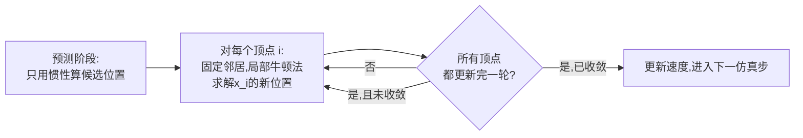
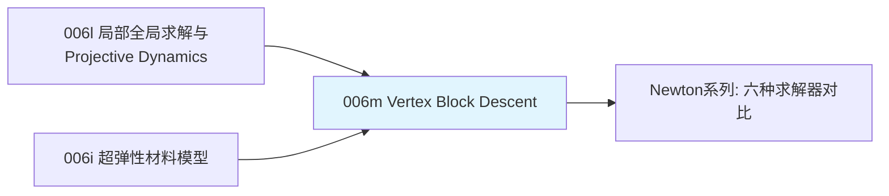

# 前置知识：Vertex Block Descent（VBD）——Newton 引擎的软体求解核心

> **一句话**：[Projective Dynamics](/前置知识/006l_前置知识_局部全局求解框架与Projective_Dynamics) 已经把非线性软体仿真拆成"局部投影+全局线性求解"两步，但"全局求解"仍然需要构造和维护一个覆盖所有顶点的大型线性系统——这在顶点数达到百万级、且约束会动态变化（比如碰撞）的场景下,仍然是一个不小的负担。**Vertex Block Descent（VBD）**问了一个更进一步的问题：能不能把"全局求解"这一步也变成逐顶点的局部操作？答案是可以——VBD 让每个顶点轮流"看着周围邻居暂时不动",独立求解一个只有 3 个自由度的微型优化问题,直接给出这个顶点的新位置,完全不需要构造任何全局矩阵。这正是 Newton 引擎 `SolverVBD` 的算法核心，也是当前布料/软体仿真在GPU并行化方向上的一个重要进展。

**知识链接**：
- [局部-全局求解框架与 Projective Dynamics](/前置知识/006l_前置知识_局部全局求解框架与Projective_Dynamics) — VBD 直接继承并改进的前身框架
- [超弹性材料模型：Neo-Hookean 与本构关系](/前置知识/006i_前置知识_超弹性材料模型Neo-Hookean与本构关系) — VBD 逐顶点优化问题里,材料能量项直接调用这里的能量函数
- [数值优化基础：梯度下降与牛顿法](/前置知识/003c_前置知识_数值优化基础_梯度下降与牛顿法) — VBD 逐顶点求解用的正是这里讲的（局部）牛顿法
- 关联：[六种求解器全景对比：XPBD、VBD、Featherstone、SemiImplicit、MuJoCo、Kamino 怎么选](/系列/newton_engine_deep_dive/05_六种求解器全景对比_怎么选) — Newton 工程视角下 VBD 的接口、能力边界和选型建议

---

## 贯穿全文的例子

> **场景**：一块由 10 万个顶点构成的高精度布料网格（比如仿真一件衣服），被机器人手臂的一次快速抓取动作瞬间拉扯变形。我们希望这块布料的仿真能在GPU上以接近实时的速度运行——[Projective Dynamics](/前置知识/006l_前置知识_局部全局求解框架与Projective_Dynamics) 的全局步骤需要求解一个 30 万维（10万个顶点×3）的线性系统，即使矩阵可以提前分解,10万级别的稀疏矩阵分解和求解仍然不是免费的,而且如果布料和机器人手指发生了新的碰撞（约束动态增加），矩阵结构就要跟着改变，"提前分解一次反复复用"这个优化技巧就用不上了。我们想知道：有没有办法完全不构造这个大矩阵，同样能让布料收敛到物理正确的形状？

---

## 一、VBD 的核心思路：把"全局"问题拆成一系列"局部"问题

### 1.1 关键观察：一个顶点的最优位置只依赖它的直接邻居

[Projective Dynamics](/前置知识/006l_前置知识_局部全局求解框架与Projective_Dynamics) 的全局步骤,本质上是在求解"让所有顶点、所有约束的能量总和最小"这一个联合优化问题。VBD 的核心观察是：**如果暂时固定住除了某一个顶点之外的所有其他顶点,只优化这一个顶点的位置,这个子问题只涉及这个顶点自己的 3 个自由度（三维坐标）,而且只依赖直接连接到它的那些邻居（弹簧、材料单元）的当前位置**——不需要知道整个网格其他地方发生了什么。

这正是数值优化里**块坐标下降**（Block Coordinate Descent）的思想——把一个高维优化问题,拆成对一个个"块"（这里每个块就是一个顶点的3个坐标）轮流求解的低维子问题,固定其他块不动,只优化当前这一块,反复轮转所有块直到收敛。

### 1.2 图示：VBD逐顶点更新 vs PD全局求解


> 左图：VBD 更新某个顶点（红色）时，它周围所有直接相连的邻居（蓝色）的位置被**暂时固定**，红色顶点独立求解一个只有 3 个未知数的小优化问题,直接得到绿色箭头指示的新位置——这个计算只需要红色顶点和它的邻居信息，完全不涉及网格其他地方。右图：VBD（橙色方块）和 Projective Dynamics（紫色圆点）在同一个任务上的能量收敛曲线示意——两者收敛速度大体相当,但VBD的每一次迭代都是纯局部计算，不需要构造和求解任何全局矩阵，这正是VBD在超大规模、动态约束场景下更有优势的原因。

**在我们的例子中**：布料的10万个顶点,VBD可以让每个顶点独立地（在给定周围邻居当前位置的前提下）求解自己的最优新位置——这个操作天然适合写成一个GPU kernel,每个线程负责一个顶点,同时对所有顶点并行执行,完全不涉及大型稀疏矩阵的构造、分解或求解。

---

## 二、单个顶点的局部优化问题

### 2.1 目标函数

对顶点 $i$，固定所有其他顶点位置不变，VBD 要求解的局部优化问题是：

$$
\mathbf x_i^{\text{new}} = \arg\min_{\mathbf x_i}\ \frac{m_i}{2\Delta t^2}\|\mathbf x_i-\tilde{\mathbf x}_i\|^2 + \sum_{e\in\mathcal N(i)} E_e(\mathbf x_i;\ \text{其他顶点固定})
$$

**这个公式在做什么**：这是[Projective Dynamics](/前置知识/006l_前置知识_局部全局求解框架与Projective_Dynamics) 全局目标函数的"缩小版"——只保留和顶点 $i$ 有关的那些项（惯性项+所有涉及顶点 $i$ 的约束/单元能量），把其他所有不涉及 $i$ 的项当作常数忽略（对求 $\mathbf x_i$ 的最优值没有影响）,变成一个只有3个未知数的小型优化问题。

::: details 📐 公式详解（点击展开）

| 子表达式 | 它是谁 | 它在干嘛 |
|---------|--------|---------|
| $\tilde{\mathbf x}_i$ | **顶点 $i$ 只受惯性驱动的候选位置** | 和 [Projective Dynamics](/前置知识/006l_前置知识_局部全局求解框架与Projective_Dynamics) 里同名符号含义完全一致 |
| $\mathcal N(i)$ | **和顶点 $i$ 有直接关联的所有单元/约束的集合** | 比如所有连接到顶点 $i$ 的弹簧、所有包含顶点 $i$ 的四面体单元 |
| $E_e(\mathbf x_i;\text{其他顶点固定})$ | **单个单元/约束的能量,把其他顶点当常数** | 比如某根弹簧的能量,把另一端顶点位置固定,只剩下 $\mathbf x_i$ 是变量 |

**用人话读**："只关心和这个顶点直接相连的那些弹簧/单元,把它们各自的能量加起来,再加上一个'别偏离自由运动轨迹太远'的惯性惩罚——找到让这个总和最小的 $\mathbf x_i$，就是这个顶点这一轮该挪到的新位置。"

**为什么可以直接忽略不涉及顶点 $i$ 的所有其他项**：优化问题对 $\mathbf x_i$ 求最小值时，任何不包含 $\mathbf x_i$ 的项都是常数（对 $\mathbf x_i$ 求导恒为零),不影响最优解的位置——这正是块坐标下降能够把"全局问题"严格等价地拆成"逐块局部问题"的数学基础,不是近似,是精确的数学恒等（在"固定其他块"这个前提下）。
:::

### 2.2 用局部牛顿法求解这个小型问题

因为这个局部优化问题只有 3 个未知数,即使能量函数（比如来自 [Neo-Hookean 材料](/前置知识/006i_前置知识_超弹性材料模型Neo-Hookean与本构关系)）本身是非线性的，也完全可以承受直接用**牛顿法**求解（[数值优化基础](/前置知识/003c_前置知识_数值优化基础_梯度下降与牛顿法) 讲过的方法）——牛顿法需要构造和求逆一个 $3\times3$ 的海森矩阵（Hessian，二阶导数矩阵），这个规模的矩阵求逆几乎是免费的（相比 [Projective Dynamics](/前置知识/006l_前置知识_局部全局求解框架与Projective_Dynamics) 需要求解一个几十万维的大型线性系统）：

$$
\mathbf x_i^{\text{new}} = \mathbf x_i - H_i^{-1}\,\mathbf g_i
$$

**这个公式在做什么**：这是牛顿法的标准更新公式,直接应用在这个只有3个未知数的局部问题上——用当前梯度 $\mathbf g_i$（这个顶点受到的净力的反方向）和局部曲率信息 $H_i$（这一点附近能量曲面的"弯曲程度"）,一步跳到（近似）局部最优点。

::: details 📐 公式详解（点击展开）

| 子表达式 | 它是谁 | 它在干嘛 |
|---------|--------|---------|
| $\mathbf g_i$ | **梯度**（一个 $3\times1$ 向量） | 目标函数对 $\mathbf x_i$ 的一阶导数,方向指向能量增大最快的方向,物理上正好对应"这个顶点受到的合力"的反方向 |
| $H_i$ | **海森矩阵**（一个 $3\times3$ 矩阵） | 目标函数对 $\mathbf x_i$ 的二阶导数，衡量"这一点附近,力随位置变化有多敏感"（类似材料的局部刚度） |
| $H_i^{-1}$ | **海森矩阵的逆** | 只是一个 $3\times3$ 矩阵求逆，计算代价几乎可以忽略，这正是VBD单步计算极其廉价的关键 |

**用人话读**："这个顶点受到多大的净力（梯度）、这附近材料有多'硬'（海森矩阵），结合这两个信息，直接算出一步就能大致跳到局部最优位置的新坐标——因为只有3个未知数，这个计算比解一个几十万维的大方程快得不知道多少倍。"

**为什么牛顿法在这里可行,而在全局问题上通常不直接用**：全局牛顿法需要构造和求逆一个覆盖所有顶点的、可能高达几十万维的海森矩阵，这个矩阵求逆的代价极高（这正是 [Projective Dynamics](/前置知识/006l_前置知识_局部全局求解框架与Projective_Dynamics) 为什么要绕开非线性、用共轭梯度法处理线性子问题的原因）；但VBD把问题切成了一个个只有3个未知数的局部子问题,每个子问题的"全局牛顿法"退化成了只需要求逆一个 $3\times3$ 矩阵——这正是VBD"用块坐标下降换取局部牛顿法可行性"这一整套设计的核心权衡。
:::

---

## 三、完整的 VBD 迭代循环

### 3.1 逐顶点轮流更新，直到收敛

一次完整的 VBD 仿真步,是对网格所有顶点轮流执行 2.2 节的局部牛顿更新,重复若干轮（类似 [PBD](/前置知识/006f_前置知识_基于位置的动力学PBD) 和 [Projective Dynamics](/前置知识/006l_前置知识_局部全局求解框架与Projective_Dynamics) 都需要多轮迭代才能收敛）：



### 3.2 并行化的技巧：图着色

一个容易被忽略但很重要的细节——虽然VBD每个顶点的更新计算本身很局部,但如果两个相邻（共享同一个约束/单元）的顶点被**同时**并行更新,会互相踩到对方"固定邻居不动"这个假设（两者同时在变,谁的假设都不成立）。工程实现里，通常会对网格顶点做**图着色**（graph coloring）——把顶点分成若干组,保证同一组内的顶点两两都不相邻（不共享任何约束/单元），这样同一组内的所有顶点可以真正安全地同时并行更新，不同组之间再依次顺序执行。这是让VBD"理论上局部串行的迭代"变成"实际上大规模GPU并行"的关键工程技巧。

---

## 四、代码示例：单个顶点的 VBD 局部更新

```python
import numpy as np

def vbd_vertex_local_solve(x_i, neighbors_x, rest_lengths, weights, x_tilde_i, mass_i, dt, n_newton_iters=3):
    """
    本文2.1-2.2节公式的实现：给定顶点i的邻居当前位置(固定不动)，
    用局部牛顿法求解顶点i自己的最优新位置。

    简化为弹簧能量：E = sum_e 0.5*w_e*(||x_i - x_j|| - L0_e)^2
    """
    inertia_coeff = mass_i / dt**2

    x = x_i.copy()
    for _ in range(n_newton_iters):
        grad = inertia_coeff * (x - x_tilde_i)  # 惯性项梯度
        hess = inertia_coeff * np.eye(3)         # 惯性项海森（常数）

        for x_j, L0, w in zip(neighbors_x, rest_lengths, weights):
            delta = x - x_j
            dist = np.linalg.norm(delta) + 1e-9
            direction = delta / dist
            stretch = dist - L0

            # 弹簧能量 E_e = 0.5*w*(dist-L0)^2 对x的梯度和(近似)海森
            grad += w * stretch * direction
            # 近似海森：只保留主导项（沿弹簧方向的曲率），忽略切向的低阶项，
            # 这是VBD论文里常用的简化,换取更快、更稳的局部求解
            hess += w * np.outer(direction, direction)

        # 局部牛顿更新：本文2.2节公式
        delta_x = np.linalg.solve(hess, -grad)
        x = x + delta_x

    return x

# ============ 贯穿全文的例子：一个顶点被4个邻居"拉扯" ============
x_i = np.array([0.3, 0.6, 0.1])  # 顶点i当前(偏离平衡、且不对称)的位置
neighbors_x = [
    np.array([0.0, 0.0, 0.0]),
    np.array([1.0, 0.0, 0.0]),
    np.array([0.0, 1.0, 0.0]),
    np.array([1.0, 1.0, 0.0]),
]
rest_lengths = [0.7, 0.7, 0.7, 0.7]
weights = [500.0, 500.0, 500.0, 500.0]
x_tilde_i = x_i.copy()  # 简化：假设没有外力，惯性预测位置就是当前位置
mass_i = 0.05
dt = 0.01

x_new = vbd_vertex_local_solve(x_i, neighbors_x, rest_lengths, weights, x_tilde_i, mass_i, dt, n_newton_iters=8)
print(f"顶点更新前位置: {x_i}")
print(f"顶点更新后位置: {x_new}")

final_dists = [np.linalg.norm(x_new - nb) for nb in neighbors_x]
print(f"\n更新后到四个邻居的距离（四个约束互相牵制，收敛到一个折中距离，都在rest_length=0.7附近）: {[f'{d:.4f}' for d in final_dists]}")
```

**代码里值得注意的细节**：

1. `vbd_vertex_local_solve` 只需要邻居的**当前**位置（作为固定常量输入），完全不需要知道网格其他任何地方的信息——这直接对应本文 1.1 节"每个顶点的最优位置只依赖它的直接邻居"这个核心观察。
2. 海森矩阵的构造用了一个简化近似（只保留沿弹簧方向的曲率贡献），这是实际VBD实现中常见的工程简化，换取计算更快、数值更稳定，完整精确的海森矩阵推导更复杂但思路一致。
3. `np.linalg.solve(hess, -grad)` 只是求解一个 $3\times3$ 线性系统，这个计算量对GPU上的一个线程来说几乎可以忽略——把这段代码原样搬进GPU kernel（每个线程负责一个顶点，配合本文3.2节的图着色调度），就是VBD在真实引擎里的核心计算模式。

---

## 五、常见疑问

### Q1：VBD 会不会因为"逐顶点局部求解"而牺牲精度或收敛性？

不会牺牲最终收敛的精度（因为2.1节讲过,固定其他顶点求解某一个顶点的最优位置是数学上精确的子问题，不是近似），但收敛**速度**可能和 [Projective Dynamics](/前置知识/006l_前置知识_局部全局求解框架与Projective_Dynamics) 的全局求解不完全相同（右图能量曲线示意的对比）——具体哪个收敛更快依赖于网格结构和约束类型，VBD论文的实验显示在很多典型场景下两者收敛速度相当,VBD的优势主要在于"不需要构造/维护全局矩阵"这个工程层面的简化，而不是在收敛速度本身有绝对优势。

### Q2：VBD 对刚体、关节约束的支持如何？为什么系列文章里提到"有限的关节支持"？

VBD 最初的设计目标是布料/软体这类**没有固定拓扑结构变化**（网格顶点数量和连接关系在仿真过程中基本不变）的场景。刚体关节约束（比如旋转关节限制两个刚体只能沿一个轴相对转动）在数学结构上和"弹簧连接两个顶点"不完全一样，需要专门的扩展（Newton 文档中提到的AVBD，Augmented VBD）才能纳入同一个框架，且这方面的支持目前还在持续发展中——这也是为什么 [六种求解器全景对比](/系列/newton_engine_deep_dive/05_六种求解器全景对比_怎么选) 里明确建议"场景主体是刚体机器人时，VBD 目前不是首选",而"场景核心是布料、软体、缆线时，VBD 的支持是完整的"。

### Q3：VBD、PBD/XPBD、Projective Dynamics 三者最终该怎么记住区别？

一句话记忆法：**PBD/XPBD 直接在几何约束层面迭代修正位置（没有显式的能量最小化框架）；Projective Dynamics 用"局部投影+全局线性求解"两步实现能量最小化；VBD 把"全局求解"也换成了逐顶点的局部牛顿法，彻底摆脱了对全局矩阵的依赖**。三者是同一条技术演进路线上的三个节点，后者在数学严谨性和/或并行化程度上逐步改进前者的局限，但没有哪一个是"绝对更好"，实际选型（正如 [六种求解器对比](/系列/newton_engine_deep_dive/05_六种求解器全景对比_怎么选) 讨论的）取决于具体场景的物体类型、性能要求和是否需要可微分等因素。

---

## 六、总结

### 一句话

> VBD 把 Projective Dynamics 的全局线性求解也拆解成逐顶点的局部牛顿法——每个顶点在邻居暂时固定的前提下，独立求解一个只有 3 个自由度的微型优化问题，配合图着色实现大规模GPU并行，完全绕开了大型稀疏矩阵的构造与求解，是当前布料/软体仿真在超大规模并行场景下的一个重要算法进展，也是 Newton 引擎 `SolverVBD` 的算法核心。

### 核心要点

1. VBD 用块坐标下降思想，把全局能量最小化问题严格拆解成逐顶点的局部子问题
2. 单个顶点的局部优化问题只涉及3个自由度，即使材料能量非线性，也能直接用局部牛顿法高效求解（只需要求逆一个3×3矩阵）
3. 完整的VBD迭代是对所有顶点轮流做局部更新，重复若干轮直到收敛
4. 图着色技巧让"理论上逐顶点串行"的迭代能安全地大规模并行到GPU上
5. VBD对布料/软体/缆线支持完整，对刚体关节的支持仍在通过AVBD等扩展持续发展

### 知识链



---

## 延伸阅读

- [局部-全局求解框架与 Projective Dynamics](/前置知识/006l_前置知识_局部全局求解框架与Projective_Dynamics) — VBD 直接改进的前身算法
- [超弹性材料模型：Neo-Hookean 与本构关系](/前置知识/006i_前置知识_超弹性材料模型Neo-Hookean与本构关系) — VBD局部能量项调用的材料模型
- [六种求解器全景对比：XPBD、VBD、Featherstone、SemiImplicit、MuJoCo、Kamino 怎么选](/系列/newton_engine_deep_dive/05_六种求解器全景对比_怎么选) — Newton 引擎工程视角下 VBD 的接口和选型建议
- Anka Chen, Ziheng Liu, Yin Yang, Cem Yuksel, "Vertex Block Descent" (SIGGRAPH 2024) — VBD 方法的原始论文
- 系列文章：[Newton 引擎深度解析](/系列/newton_engine_deep_dive/index) — Newton 引擎的完整工程实现拆解

