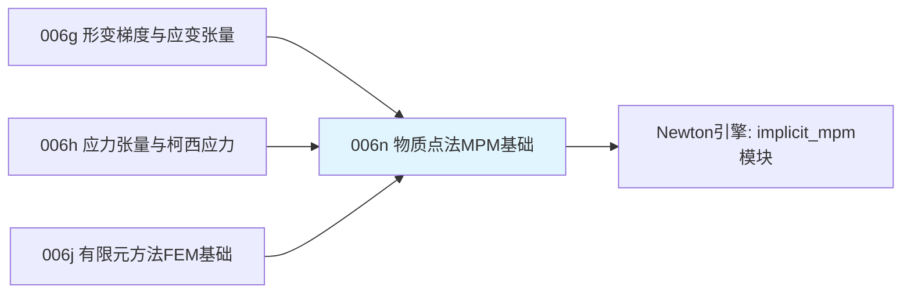

# 前置知识：物质点法 MPM 基础——颗粒材料与网格-粒子转换

> **一句话**：[有限元](/前置知识/006j_前置知识_有限元方法FEM基础_四面体网格与形函数) 和 [VBD](/前置知识/006m_前置知识_Vertex_Block_Descent与软体求解) 都假设物体的网格拓扑结构（哪些顶点连着哪些顶点）在仿真过程中固定不变——这对果冻、布料这类"变形但不断裂、不重新排列"的物体没问题，但沙子、雪、面粉、水这类**颗粒/连续流动材料**,材料内部的"连接关系"每时每刻都在剧烈重组（沙子可以自由散开、重新堆积成完全不同的形状）,固定拓扑的网格完全无法表达这种行为。**物质点法**（Material Point Method，MPM）用一个巧妙的双重表示解决了这个问题：材料本身用一堆自由漂浮的**粒子**表示（没有固定的连接关系），但每一步仿真borrow一个临时的**背景网格**来做力的计算——粒子和网格之间来回"转换"信息，用完网格就扔掉，下一步重新铺一个新网格。这正是仿真沙子、雪、颗粒物、可断裂材料的主流方法,也是 Newton 引擎 `implicit_mpm` 模块的算法基础。

**知识链接**：
- [有限元方法 FEM 基础：四面体网格与形函数](/前置知识/006j_前置知识_有限元方法FEM基础_四面体网格与形函数) — MPM 的网格计算部分和有限元共享很多数学工具（形函数思想），但用途完全不同
- [形变梯度与应变张量](/前置知识/006g_前置知识_形变梯度与应变张量) — MPM 里每个粒子携带的核心状态之一
- [超弹性材料模型：Neo-Hookean 与本构关系](/前置知识/006i_前置知识_超弹性材料模型Neo-Hookean与本构关系) — MPM 材料模型（针对沙子/雪需要专门的塑性模型扩展，本文简要提及）建立的基础
- [数值积分：辛积分与能量稳定性](/前置知识/006c_前置知识_物理仿真数值积分_辛积分与能量稳定性) — MPM网格上的动量方程求解同样需要本文讨论的数值积分方法

---

## 贯穿全文的例子

> **场景**：机器人的一个手指戳进一堆沙子。沙子被戳的地方会局部塌陷、周围的沙粒会散开重新堆积成一个完全不同的形状——手指抽出后,沙子不会像果冻一样"弹回原状",而是保持被扰动之后的新形状。我们想知道：这种"材料内部连接关系随时可以彻底重组"的行为,该怎么在计算机里表示和仿真？固定拓扑的网格（有限元/VBD 依赖的假设）显然不适用,但完全抛开网格、只用纯粒子方法（类似分子动力学，逐对计算粒子间的力）,计算复杂度又会随粒子数量平方增长——MPM 要如何两头兼顾？

---

## 一、为什么固定拓扑网格处理不了颗粒材料

### 1.1 有限元/VBD 的隐含假设

[有限元](/前置知识/006j_前置知识_有限元方法FEM基础_四面体网格与形函数) 和 [VBD](/前置知识/006m_前置知识_Vertex_Block_Descent与软体求解) 的整个数学框架建立在一个隐含假设上——**网格顶点之间的连接关系（哪个顶点是哪个单元的一部分）在整个仿真过程中固定不变**。果冻、布料、人体组织符合这个假设：不管怎么揪、怎么拉,原来相邻的材料点始终还是相邻的（只是距离变了),材料不会"断开重组"。

沙子完全不符合这个假设——一堆沙子被手指搅动之后,原来紧挨着的两颗沙粒可能被推到完全不相关的位置,原来不相邻的两颗沙粒可能被挤到一起。这种材料内部"邻居关系"随时在变化的行为,统称为**大变形/材料断裂重组**问题,是固定拓扑网格方法的根本局限。

### 1.2 纯粒子方法（无网格）的代价

一个直觉的解决方案是完全抛开网格,把材料表示成一堆自由的粒子（类似 [002c 蒙特卡洛采样](/前置知识/002c3_前置知识_蒙特卡洛采样) 里"用离散样本表示连续分布"的思路,只是这里样本携带的是物理状态而不是概率密度）,粒子之间没有固定的连接关系,每一步仿真直接计算"每颗粒子受到周围哪些粒子的作用力"。这类方法（如SPH，光滑粒子流体动力学）确实能处理任意拓扑重组,但直接计算"每颗粒子和周围粒子的相互作用",如果不借助额外的空间加速结构,复杂度会随粒子数量增长得很快，而且很多力学量（比如应力散度）在纯粒子表示下的数值计算精度不如网格方法稳定。

---

## 二、MPM 的核心思路：粒子存状态，网格做计算,用完就扔

### 2.1 双重表示

MPM 的关键设计是同时维护两套表示：

- **粒子（拉格朗日视角，Lagrangian）**：每个粒子携带这一小块材料的**永久状态**——质量、速度、形变梯度 $F$（[006g](/前置知识/006g_前置知识_形变梯度与应变张量) 讲过的核心量）。粒子之间没有固定连接关系,可以自由移动、重新分布。
- **背景网格（欧拉视角，Eulerian）**：一个覆盖整个仿真区域的规则网格（类似像素网格），**每一步仿真都重新使用（通常直接复用同一个静态网格，或按需重新覆盖当前粒子所在区域）**，只临时存储从粒子"借"来的质量、动量信息,用来做一次力的计算,算完之后这些临时信息就被下一步的新数据覆盖——网格本身不携带任何永久的材料状态。


> 左图：红色圆点是携带材料状态（质量、速度、形变梯度）的粒子,灰色网格是临时的背景计算网格——注意粒子的分布是自由、不规则的（模拟沙堆的形状),但网格本身是规则、固定的。黄色高亮的粒子周围橙色连线展示了它的信息会"撒"到周围一小片网格节点上（下一节详细讲这个撒的规则）。右图：MPM 每一步仿真的完整循环——P2G（粒子到网格）→网格上求解运动方程→G2P（网格到粒子）→下一步循环,循环往复,网格只是每一步临时借用的计算脚手架。

**在我们的例子中**：沙子的每一颗粒子记录着自己的质量、当前速度、以及局部的形变梯度（沙粒被压缩/剪切了多少）；仿真每一步,先把这些粒子信息临时"投影"到一张覆盖整个沙堆区域的网格上,在网格上解一次力学方程算出网格节点的新速度,再把网格上算好的新速度"读"回每一颗粒子,更新粒子自己的速度和位置——网格本身在下一步会被新的数据完全覆盖,不记得上一步的任何东西。

---

## 三、P2G：把粒子信息"撒"到网格上

### 3.1 转移权重：一个粒子影响哪些网格节点

粒子的位置通常不会恰好落在网格节点上,MPM 用一个**插值权重函数**（类似 [有限元的形函数](/前置知识/006j_前置知识_有限元方法FEM基础_四面体网格与形函数)，但这里权重函数定义在规则网格上,更常用**B-spline基函数**而不是有限元的分段线性形函数)，决定一个粒子的质量/动量应该按什么比例分配给周围哪些网格节点：

$$
w_{ip} = N(\mathbf x_i - \mathbf x_p)
$$

**这个公式在做什么**：给定粒子 $p$ 的位置和网格节点 $i$ 的位置,通过一个只依赖两者相对距离的函数 $N$，算出这个粒子对这个节点的"影响权重"——距离越近权重越大,超出一定距离权重直接归零(不需要考虑太远的节点)。

::: details 📐 公式详解（点击展开）

| 子表达式 | 它是谁 | 它在干嘛 |
|---------|--------|---------|
| $\mathbf x_p$ | **粒子 $p$ 的位置** | 粒子自身携带的状态 |
| $\mathbf x_i$ | **网格节点 $i$ 的位置** | 固定不变（网格本身是规则、静止的） |
| $N(\cdot)$ | **插值/权重核函数** | 常用二次或三次B-spline函数,只依赖距离,距离超出核函数的"支撑半径"直接为零 |
| $w_{ip}$ | **粒子 $p$ 对节点 $i$ 的权重** | 决定P2G转移时,这个粒子的质量/动量分配给这个节点多大比例 |

**用人话读**："一个粒子只会把自己的信息'撒'给周围几个（比如2D里3×3=9个,或者更宽的核函数下4×4=16个）最近的网格节点，距离越近分到的比例越大，距离超出一定范围的节点完全分不到——不需要考虑网格上所有节点。"

**为什么用平滑的B-spline而不是有限元那种分段线性形函数**：有限元的线性形函数梯度是分段常数（不连续),这在MPM里会导致"粒子跨越网格单元边界时,受力突然跳变"这种数值上不理想的现象（称为cell-crossing instability）；B-spline基函数（本文用的二次B-spline是最常见的选择之一）本身及其梯度都是连续的，让粒子跨越网格边界时力的变化更平滑，这是MPM社区多年实践中总结出的标准选择。
:::

下图展示了这个权重函数具体的形状：


> 横轴是粒子到网格节点的距离（以网格间距为单位）,纵轴是插值权重。注意权重在距离为0（粒子恰好在节点上）时最大,在距离超过1.5个网格间距时精确降为0——这正是"只影响周围少数几个节点"这个性质的直接体现,红点标出了三个整数距离处的具体权重值。

### 3.2 P2G 转移公式

有了权重,P2G（Particle-to-Grid）这一步把每个粒子的质量和动量,按权重分配累加到周围网格节点上：

$$
m_i = \sum_p w_{ip}\,m_p, \qquad (m\mathbf v)_i = \sum_p w_{ip}\,m_p\,\mathbf v_p
$$

**这个公式在做什么**：网格节点 $i$ 的质量,是所有能"够得着"这个节点的粒子(权重非零)按权重贡献的质量加权和；节点的动量同理。这正是把粒子携带的物理量,临时"投影"到网格上供后续计算使用的具体操作。

::: details 📐 公式详解（点击展开）

| 子表达式 | 它是谁 | 它在干嘛 |
|---------|--------|---------|
| $m_p$ | **粒子 $p$ 携带的质量**（固定，仿真开始时分配好） | 粒子最基本的守恒物理量 |
| $m_i$ | **节点 $i$ 临时获得的质量** | 这一步仿真里,网格节点"借用"到的质量,下一步会被清零重新累加 |
| $(m\mathbf v)_i$ | **节点 $i$ 临时获得的动量** | 用来在网格上求解运动方程,得到节点新的速度 |

**用人话读**："每个粒子按照自己离网格节点的远近,把自己的质量和动量'分'给周围几个节点——一个节点收到的总质量/动量，是所有'伸手够得到它'的粒子分给它的份额加起来。"

**为什么要转移质量和动量而不是直接转移速度**：动量（质量×速度）是物理上真正满足守恒定律的量——直接对速度做加权平均会在粒子质量不均匀时破坏动量守恒,这是数值方法里"应该对哪个物理量做插值"这个细节问题的标准答案：守恒量（质量、动量）用加权累加，非守恒的派生量（比如速度）在计算完守恒量之后再通过除法（$\mathbf v_i=(m\mathbf v)_i/m_i$）反推出来。
:::

---

## 四、网格上的计算：求解一次动量方程

有了网格节点上的质量和动量（进而算出节点速度 $\mathbf v_i=(m\mathbf v)_i/m_i$），下一步是在网格上求解 [应力张量](/前置知识/006h_前置知识_应力张量与柯西应力) 第四节讲过的动量方程,得到考虑了材料内部应力和外力（如重力）之后,网格节点应该有的新速度。这一步的具体计算方式（力怎么从粒子的应力转换成网格节点的力）和 [有限元](/前置知识/006j_前置知识_有限元方法FEM基础_四面体网格与形函数) 里"从应力到顶点力"的思路是同源的——只是这里的"顶点"换成了网格节点,"单元"的角色由每个粒子周围的插值权重函数承担。求解方式可以是显式（简单但对材料很硬时步长受限,类似 [006c](/前置知识/006c_前置知识_物理仿真数值积分_辛积分与能量稳定性) 讨论的显式方法局限）,也可以是隐式（类似 [006k](/前置知识/006k_前置知识_稀疏线性系统与共轭梯度法) 需要解一个线性系统,但网格是规则的,系统矩阵的结构比非规则的有限元网格更简单规整——这正是 Newton 引擎 `implicit_mpm` 模块名字里"implicit"的来源）。

---

## 五、G2P：把网格上算好的结果读回粒子

### 5.1 转移公式

**G2P**（Grid-to-Particle）是P2G的逆过程——用同一套权重函数,把网格节点上刚算好的新速度"读"回每个粒子：

$$
\mathbf v_p^{\text{new}} = \sum_i w_{ip}\,\mathbf v_i^{\text{new}}, \qquad \mathbf x_p^{\text{new}} = \mathbf x_p + \Delta t\,\mathbf v_p^{\text{new}}
$$

**这个公式在做什么**：粒子的新速度,由周围网格节点（刚在网格上求解出的）新速度按同样的权重加权平均得到；有了新速度,直接用简单的显式积分更新粒子位置。

::: details 📐 公式详解（点击展开）

| 子表达式 | 它是谁 | 它在干嘛 |
|---------|--------|---------|
| $\mathbf v_i^{\text{new}}$ | **网格节点算好的新速度** | 第四节网格计算的输出 |
| $w_{ip}$ | **同一个权重函数**（和P2G用的完全一样） | 保证P2G和G2P用一致的规则,这是MPM数值一致性的重要设计 |
| $\mathbf v_p^{\text{new}}$ | **粒子新速度** | 反映了这一步网格上算出的力学效果 |
| $\mathbf x_p^{\text{new}}$ | **粒子新位置** | 用新速度做一次简单的显式积分（[006c](/前置知识/006c_前置知识_物理仿真数值积分_辛积分与能量稳定性) 讨论过的方法,MPM里这一步通常已经足够稳定,因为"硬"的部分已经在隐式网格求解里处理过了） |

**用人话读**："每个粒子从周围网格节点（刚才算好的新速度）里,按和撒出去时同样的权重比例,'收'回一个属于自己的新速度——收完之后，粒子就用这个新速度简单地往前走一步。"

**为什么P2G和G2P必须用完全相同的权重函数**：这不是随意的工程选择,而是保证"信息从粒子撒到网格、再收回粒子"这个来回过程不会凭空产生或损失物理量（比如角动量）的关键设计——MPM研究文献里有专门的分析（APIC、MLS-MPM等改进方法）讨论如何在这个转移过程中更精确地保持角动量、减少数值粘滞（数值上人为产生的、不该存在的能量耗散），这是MPM算法持续演进的一个重要方向,但核心的"P2G用什么权重、G2P就用同一个权重"这一条设计原则是不变的。
:::

### 5.2 形变梯度的更新

除了速度和位置,粒子还要更新自己携带的形变梯度 $F$（[006g](/前置知识/006g_前置知识_形变梯度与应变张量) 讲的核心量),这通常通过网格节点速度的空间梯度（衡量"周围速度场怎么在空间上变化")来更新——直觉上,如果一个粒子周围的速度场在空间上不均匀（有的方向快、有的方向慢),说明这个粒子周围的材料正在被拉伸或压缩,这个信息直接累积更新到粒子的 $F$ 上,供下一步计算材料应力（调用 [超弹性材料模型](/前置知识/006i_前置知识_超弹性材料模型Neo-Hookean与本构关系)或专门的塑性材料模型）使用。

---

## 六、代码示例：一个最小的1D MPM演示

为了让核心循环清晰可见,这里用一维简化实现完整的P2G→网格计算→G2P循环：

```python
import numpy as np

def quadratic_bspline_weight_and_grad(dx, h):
    """
    本文3.1节的二次B-spline权重函数(一维版本)及其梯度，
    dx: 粒子到节点的距离，h: 网格间距
    """
    x = dx / h
    ax = abs(x)
    if ax < 0.5:
        w = 0.75 - ax**2
        dw = -2 * x / h
    elif ax < 1.5:
        w = 0.5 * (1.5 - ax)**2
        dw = -np.sign(x) * (1.5 - ax) / h
    else:
        w, dw = 0.0, 0.0
    return w, dw

def mpm_step_1d(particles_x, particles_v, particles_m, grid_x, dt, gravity, k_stiffness=200.0, rest_density=1.0, h=1.0):
    """
    一个极简化的1D MPM步骤：粒子模拟一小段可压缩材料，
    材料内部压力用简单的状态方程(类似弱可压缩流体)近似，避开完整材料模型推导。
    """
    n_grid = len(grid_x)
    grid_mass = np.zeros(n_grid)
    grid_momentum = np.zeros(n_grid)

    # ---- P2G: 本文3.2节公式 ----
    for xp, vp, mp in zip(particles_x, particles_v, particles_m):
        for i, xi in enumerate(grid_x):
            w, _ = quadratic_bspline_weight_and_grad(xp - xi, h)
            if w > 0:
                grid_mass[i] += w * mp
                grid_momentum[i] += w * mp * vp

    grid_v = np.divide(grid_momentum, grid_mass, out=np.zeros_like(grid_momentum), where=grid_mass > 1e-9)

    # ---- 网格上的力计算(简化：只考虑重力，模拟自由落体压缩过程) ----
    grid_v_new = grid_v + dt * gravity
    grid_v_new[grid_mass <= 1e-9] = 0.0  # 没有粒子影响的节点不需要更新

    # ---- G2P: 本文5.1节公式 ----
    new_x, new_v = [], []
    for xp, vp in zip(particles_x, particles_v):
        v_new = 0.0
        for i, xi in enumerate(grid_x):
            w, _ = quadratic_bspline_weight_and_grad(xp - xi, h)
            v_new += w * grid_v_new[i]
        x_new = xp + dt * v_new
        new_x.append(x_new)
        new_v.append(v_new)

    return np.array(new_x), np.array(new_v)

# ============ 贯穿全文的例子：一小段沙子(用1D粒子近似)自由下落 ============
particles_x = np.array([2.1, 2.4, 2.7, 3.0, 3.3])  # 初始位置,略微不均匀分布
particles_v = np.zeros(5)
particles_m = np.ones(5) * 0.1
grid_x = np.arange(0, 6, 1.0)  # 网格节点在整数位置
dt = 0.02
gravity = -2.0  # 简化的重力加速度

for step in range(20):
    particles_x, particles_v = mpm_step_1d(particles_x, particles_v, particles_m, grid_x, dt, gravity)

print("20步后粒子位置:", np.round(particles_x, 3))
print("20步后粒子速度:", np.round(particles_v, 3))
```

**代码里值得注意的细节**：

1. `quadratic_bspline_weight_and_grad` 直接实现了3.1节讲的B-spline公式,运行代码可以验证在距离恰好等于0、1、1.5等特殊点上的权重值和上面的图完全吻合。
2. `mpm_step_1d` 严格按照"P2G → 网格计算 → G2P"三步循环组织（对应本文第二节流程图），这是任何MPM实现（不管多复杂的材料模型、多高的维度）共同的骨架结构。
3. 这个简化示例省略了完整的应力计算（只用重力驱动),真实的MPM沙子/雪仿真需要在"网格上的力计算"这一步,把每个粒子的形变梯度代入合适的材料模型（塑性沙土模型、雪的弹塑性模型等,这些是MPM材料建模的专门话题，超出本文入门范围）算出应力,再转换成网格节点上的力——但P2G/G2P的转移框架和本文完全一致，理解了本文就理解了这类复杂MPM实现的骨架。

---

## 七、常见疑问

### Q1：MPM 和 SPH（光滑粒子流体动力学）有什么区别？都是用粒子表示材料。

两者都用粒子表示材料（没有固定拓扑连接），但计算力的方式不同——SPH完全不使用背景网格,直接在粒子之间用一个光滑核函数计算"周围粒子对我的影响"（本质上是本文第一节提到的"纯粒子方法"）；MPM借助一个临时的背景网格来计算力（本文的核心内容）。借助网格的好处是,网格上的力学计算（比如应力散度、这正是 [有限元](/前置知识/006j_前置知识_有限元方法FEM基础_四面体网格与形函数) 擅长的）通常比纯粒子方法在数值上更稳定、更精确,尤其在处理固体材料（有形变梯度、弹塑性）时优势明显;SPH在纯流体（水）仿真上历史更悠久、应用也很广泛。两者各有各的擅长场景，工程选型时需要根据具体材料类型（固体颗粒 vs 流体）权衡。

### Q2：为什么背景网格"用完就扔"？不能固定一个网格反复用吗？

如果材料流动范围很大（沙子被抛得到处都是),固定一个网格覆盖不了所有可能出现材料的区域,或者需要一个覆盖极大范围但绝大部分是空的网格（浪费内存和计算）。实践中很多MPM实现会用一种"稀疏网格"（只在有粒子的区域附近动态分配网格单元)或每一步重新对齐网格到粒子当前分布区域的策略,兼顾内存效率和覆盖范围——但无论采用哪种具体实现，"网格本身不携带跨越仿真步的永久状态,所有永久信息都在粒子上"这个核心设计原则不变。

### Q3：Newton引擎的`implicit_mpm`模块，和本文讲的显式P2G/G2P循环是同一套算法吗？

思路上完全一致（P2G→网格求解→G2P这个骨架不变），区别在于"网格求解"这一步——`implicit_mpm`名字里的"implicit"意味着它在网格上用隐式方法求解动量方程（类似 [006k 共轭梯度法](/前置知识/006k_前置知识_稀疏线性系统与共轭梯度法) 讨论的思路,只是这里的系统矩阵建立在规则网格而不是不规则的有限元网格上),这样即使材料很"硬"或者仿真步长较大,也能保持数值稳定,这是处理沙子、雪这类有时表现出很强"内聚力/摩擦力"（局部非常"硬"）材料时的重要工程考量,直接对应 [006c 数值积分](/前置知识/006c_前置知识_物理仿真数值积分_辛积分与能量稳定性) 里讨论过的"刚性系统需要隐式方法"这一结论在MPM场景下的具体应用。

---

## 八、总结

### 一句话

> 物质点法用"粒子携带永久物理状态、网格提供临时计算脚手架"这个双重表示,同时获得了纯粒子方法（无网格,能表达任意拓扑重组）和网格方法（数值计算稳定、精确）的优点——每一步仿真通过P2G把粒子信息撒到网格上，在网格上求解一次运动方程，再通过G2P把结果收回粒子，网格本身不记忆任何跨越仿真步的状态,是仿真沙子、雪、颗粒材料、可断裂材料的主流方法,也是 Newton 引擎 `implicit_mpm` 模块的算法基础。

### 核心要点

1. 固定拓扑的有限元/VBD网格无法表达沙子等材料"内部连接关系随时重组"的行为，MPM用自由粒子解决这个问题
2. MPM同时维护粒子（携带质量、速度、形变梯度等永久状态）和背景网格（每步临时借用，不携带永久状态）
3. P2G用插值权重函数（常用二次B-spline）把粒子的质量、动量按距离加权分配到周围网格节点
4. 网格上求解一次动量方程（可显式可隐式），得到节点新速度，这一步和有限元"应力到顶点力"的思路同源
5. G2P用完全相同的权重函数把网格新速度读回粒子，更新粒子的速度、位置和形变梯度

### 知识链



---

## 延伸阅读

- [形变梯度与应变张量](/前置知识/006g_前置知识_形变梯度与应变张量) — MPM粒子携带的核心状态之一
- [应力张量与柯西应力](/前置知识/006h_前置知识_应力张量与柯西应力) — MPM网格上力计算的理论基础
- [有限元方法 FEM 基础：四面体网格与形函数](/前置知识/006j_前置知识_有限元方法FEM基础_四面体网格与形函数) — MPM网格计算和有限元共享的数学工具
- Jiang, Schroeder, Selle, Teran, Stomakhin, "The Material Point Method for Simulating Continuum Materials" (SIGGRAPH 2016 course notes) — MPM方法最广为流传的系统性入门教程
- Stomakhin et al., "A Material Point Method for Snow Simulation" (SIGGRAPH 2013) — MPM应用于雪仿真的经典论文，展示了弹塑性材料模型的具体扩展

