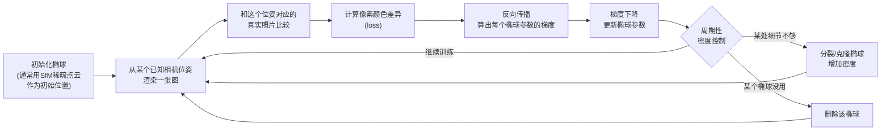

# 前置知识：3D Gaussian Splatting——用一堆椭球把真实场景搬进电脑

> **一句话**：拍几十张照片围着一个场景转一圈，让电脑自动"猜"出几十万个半透明的小椭球（每个椭球有位置、形状、颜色、透明度），把这些椭球一股脑摆在三维空间里，从任意新角度拍过去，渲染出来的画面就和真实场景几乎一样——这就是 3D Gaussian Splatting（3D 高斯溅射，以下简称 3DGS）在做的事。
>
> **为什么要学这个**：本系列要讲的 real2sim（真实到仿真）工作流，第一步永远是"把真实世界的场景变成电脑能用的 3D 模型"。3DGS 是目前这一步最主流的技术，NVIDIA 的 SimFoundry、MIT 的 RialTo 等 real2sim 系统的重建环节都建立在它之上。不理解 3DGS，就看不懂这些系统"扫描一段视频就能重建出仿真场景"这件事到底是怎么做到的。
>
> **想看更深入的完整推导**：本文只是 3DGS 的第一次概览。如果想把协方差矩阵、雅可比投影、球谐函数、alpha blending 反向传播、密度自适应控制、CUDA 实现思路等每一个细节都学透，并配合可交互组件亲手验证，可以阅读系列文章 [3D 高斯溅射从零精通：3DGS 完整原理与工程实现](/系列/3dgs_from_scratch/index)。

## 相关阅读

- [概率密度函数与高斯分布](/前置知识/002b_前置知识_概率密度函数与高斯分布) — 3DGS 里每个"椭球"本质就是一个多维高斯分布，本文假设你已经知道一维/多维高斯长什么样
- [三维旋转表示：旋转矩阵、四元数与角速度](/前置知识/006a_前置知识_三维旋转表示_旋转矩阵四元数与角速度) — 3DGS 用四元数描述每个椭球的朝向，本文会直接用到
- [数值优化基础：梯度下降与牛顿法](/前置知识/003c_前置知识_数值优化基础_梯度下降与牛顿法) — 3DGS 的训练本质是用梯度下降调整几十万个椭球的参数

---

## 贯穿全文的例子

> **场景**：你拿着手机围着客厅里的一张沙发走一圈，录了一段 20 秒的视频（约 200 帧画面）。现在你想要电脑记住这张沙发和背景墙的样子，做到"从任意新的角度（哪怕视频里完全没拍到的角度），都能合成一张逼真的画面"——不是简单地在已拍到的帧之间做插值拼接,而是真正理解了沙发的三维形状、材质、颜色分布。本文会反复用这张沙发场景来说明每一个概念在做什么。

---

## 一、为什么需要"3D 场景表示"这个东西

### 1.1 问题:怎么把"一堆照片"变成"一个可以从任何角度看的三维场景"

传统三维建模的做法是让美工师手工用建模软件（Blender、Maya）一点一点搭出几何网格（mesh），再手动贴材质和纹理——做一张逼真的沙发模型，一个熟练的美工师可能要花几个小时到几天。

如果想要 real2sim 工作流"扫描一段视频，几分钟自动生成一个仿真场景"，显然不能依赖人工建模。我们需要一种方法：**输入是一堆从不同角度拍摄的照片（带位姿信息，即知道每张照片是从哪个位置、朝哪个方向拍的），输出是一个"场景表示"，这个表示能够回答"如果相机站在任意一个新位置、朝任意一个新方向拍照，画面应该是什么样"这个问题**。这个任务在计算机视觉里叫**新视角合成**（Novel View Synthesis）。

### 1.2 前身：NeRF 用一个神经网络"记住"整个场景

在 3DGS 之前，2020 年提出的 [NeRF](https://arxiv.org/abs/2003.08934)（Neural Radiance Fields，神经辐射场）是这个问题最有影响力的解法。NeRF 的思路是：训练一个神经网络，输入一个三维坐标点 $(x,y,z)$ 加一个观察方向，输出这个点的颜色和密度（"这里有没有东西，是什么颜色"）。整个场景的样子就"隐式"地存在这个神经网络的权重里——想知道场景任意一点长什么样，问一下网络就知道。

NeRF 效果很好，但有一个致命的工程问题：**渲染一张图需要对成千上万条光线、每条光线上几百个采样点，都跑一次神经网络前向传播**。这个计算量导致 NeRF 渲染一张图往往要几秒到几十秒,离"实时"（每秒 30 帧以上）差得很远。对于 real2sim 工作流来说，重建出的场景后续要跑机器人策略的 RL 训练——训练时需要反复渲染成千上万张图，NeRF 这个速度是完全不可接受的瓶颈。

### 1.3 3DGS 的核心思路：不用神经网络"猜"，直接摆一堆看得见摸得着的椭球

2023 年提出的 3D Gaussian Splatting（[Kerbl et al., SIGGRAPH 2023](https://arxiv.org/abs/2308.04079)）换了一个完全不同的思路：**不用神经网络隐式存储场景，而是用几十万个显式的、参数明确的三维高斯椭球直接"摆"出整个场景**。每个椭球是一个独立的、可以直接读写的数据结构（位置、形状、颜色、透明度），渲染时只需要把这些椭球投影到 2D 屏幕上做简单的图形学合成运算，不需要对神经网络做任何前向传播。这个改动带来了两个数量级的速度提升——3DGS 可以做到实时渲染（每秒 100+ 帧），同时画质不输 NeRF。

**回到我们的例子**：3DGS 重建出的沙发场景，本质是几十万个半透明的小椭球堆在空间里，密集的地方组成沙发表面、扶手边缘,稀疏而分散的地方组成背景墙。每个椭球单独看毫无意义,但几十万个椭球叠加在一起、从某个角度看过去，就"看起来"像一张真实的沙发。

---

## 二、单个 3D 高斯"椭球"是什么

### 2.1 从一维高斯到三维高斯

如果你熟悉[高斯分布](/前置知识/002b_前置知识_概率密度函数与高斯分布)，一维高斯分布的概率密度函数长这样——中间是一个峰值，两边指数衰减，衰减速度由标准差控制。3D 高斯是这个概念在三维空间里的自然推广：不再是一个数轴上的钟形曲线,而是三维空间里的一个"云团"，云团的浓度从中心向外呈高斯式衰减。

如果这个云团在三个方向上衰减速度完全一样，它是一个正球体；如果三个方向衰减速度不同，它会被拉伸/压扁成一个**椭球**——这就是为什么本文标题用"椭球"来形容 3DGS 里的每个基本单元。

$$
G(\mathbf{x}) = \exp\left(-\frac{1}{2}(\mathbf{x}-\boldsymbol{\mu})^T \boldsymbol{\Sigma}^{-1} (\mathbf{x}-\boldsymbol{\mu})\right)
$$

**这个公式在做什么**：描述空间中任意一点 $\mathbf{x}$ "属于"这个高斯椭球的浓度有多高——椭球中心浓度最高（值为 1），越往外浓度指数衰减，衰减的快慢和方向由协方差矩阵决定。

::: details 📐 公式详解（点击展开）

| 子表达式 | 它是谁 | 它在干嘛 |
|---------|--------|---------|
| $\mathbf{x} \in \mathbb{R}^3$ | **空间里任意一个查询点** | 三维空间中的坐标 $(x,y,z)$，问"这个点在椭球里的浓度是多少" |
| $\boldsymbol{\mu} \in \mathbb{R}^3$ | **椭球的中心** | 这个高斯"云团"的中心位置，即椭球的几何中心 |
| $\boldsymbol{\Sigma} \in \mathbb{R}^{3\times3}$ | **椭球的形状与朝向** | 协方差矩阵，决定椭球往哪几个方向拉长、拉长多少（下一节详细展开） |
| $(\mathbf{x}-\boldsymbol{\mu})^T \boldsymbol{\Sigma}^{-1} (\mathbf{x}-\boldsymbol{\mu})$ | **"椭球坐标系"下的距离平方** | 把普通欧几里得距离，按椭球的形状拉伸/压缩后重新量出的距离——沿着椭球拉长的方向，同样的欧氏距离对应更小的"椭球距离" |
| $\exp(-\frac{1}{2}\cdot)$ | **距离到浓度的转换器** | 距离为 0（中心点）时输出 1（浓度最高），距离越大输出指数级衰减到 0 |

**用人话读**："查询点离椭球中心（按椭球自己的形状量出来的距离）越远，这个点的'浓度'就指数级地趋近于 0；在椭球中心处浓度最高。"

**为什么是这个形式**：这正是多维高斯分布的标准密度函数形式（只是这里省略了归一化常数，因为 3DGS 关心的是相对浓度而不是严格的概率密度），选择高斯函数而不是其他形状（比如均匀的球体）是因为高斯函数**光滑、处处可导**——这对于后面"用梯度下降训练"这件事至关重要：如果椭球边界是硬边（像正方体那种非 0 即 1 的形状），梯度在边界处不存在，无法用梯度下降优化椭球的位置和形状。
:::

### 2.2 一个 3DGS 椭球的完整参数清单

除了上面公式里的中心位置 $\boldsymbol{\mu}$ 和协方差 $\boldsymbol{\Sigma}$，3DGS 里每个椭球还额外携带颜色和透明度信息。完整的一个椭球由四组参数描述：

| 参数 | 符号 | 维度 | 作用 |
|------|------|------|------|
| 位置 | $\boldsymbol{\mu}$ | 3 | 椭球中心在三维空间的坐标 |
| 形状与朝向 | $\boldsymbol{\Sigma}$（用旋转+缩放参数化，见 2.3 节） | 3+4 | 椭球往哪几个方向拉长、拉长多少、朝向哪 |
| 颜色 | $\mathbf{c}$ | 通常用球谐函数系数，简化理解为 RGB | 这个椭球本身是什么颜色，且颜色可以随观察角度略微变化（模拟反光等效果） |
| 不透明度 | $\alpha$ | 1（标量，范围 $[0,1]$） | 这个椭球有多"实"——1 表示完全不透光，0 表示完全透明看不见 |

**回到我们的例子**：沙发表面某个点对应的椭球，位置在沙发表面某处，形状被压得很扁（贴着表面分布，法线方向的拉伸很小），颜色是沙发布料的颜色，不透明度接近 1（因为沙发表面是实心的）。而沙发边缘毛絮的地方，对应的椭球可能形状更松散、不透明度更低（半透明的绒毛效果）。

### 2.3 协方差矩阵的参数化：旋转 + 缩放

协方差矩阵 $\boldsymbol{\Sigma}$ 必须满足一个数学约束——它必须是**对称且正定**的矩阵（否则公式里的 $\boldsymbol{\Sigma}^{-1}$ 没有意义，或者椭球会变成一个无法解释的形状）。如果让优化器直接、自由地调整矩阵的 9 个元素，训练过程中很容易破坏这个约束，导致数值出错。

3DGS 的解法是不直接优化 $\boldsymbol{\Sigma}$ 本身，而是把它拆解成两个物理意义清晰、天然满足约束的部分：

$$
\boldsymbol{\Sigma} = \mathbf{R} \mathbf{S} \mathbf{S}^T \mathbf{R}^T
$$

**这个公式在做什么**：把椭球的形状拆成"先按三个轴各自拉伸多少"（缩放 $\mathbf{S}$）再"整体转到哪个朝向"（旋转 $\mathbf{R}$）两步来描述，这样无论怎么调整这两部分的参数，拼出来的 $\boldsymbol{\Sigma}$ 永远自动满足对称正定的数学要求。

::: details 📐 公式详解（点击展开）

| 子表达式 | 它是谁 | 它在干嘛 |
|---------|--------|---------|
| $\mathbf{S}$ | **拉伸多少（缩放矩阵）** | 一个对角矩阵，对角线上三个正数分别是椭球沿三个局部坐标轴的"半径"（标准差） |
| $\mathbf{R}$ | **转到哪个朝向（旋转矩阵）** | 由一个[四元数](/前置知识/006a_前置知识_三维旋转表示_旋转矩阵四元数与角速度)转换得到的旋转矩阵，决定椭球的三个轴分别指向空间中的哪个方向 |
| $\mathbf{S}\mathbf{S}^T$ | **未旋转前的形状** | 在椭球自己的局部坐标系下（还没被转到世界坐标系时）的协方差，是一个对角矩阵，因为局部坐标系下三个轴互不相关 |
| $\mathbf{R}(\cdot)\mathbf{R}^T$ | **把局部形状转到世界坐标系** | 用旋转矩阵夹在两边做相似变换，把"局部坐标系下的形状"转换成"世界坐标系下同一个形状实际呈现的样子" |

**用人话读**："先决定这个椭球在自己的坐标系里往三个方向各拉伸多长，再决定这个坐标系本身要转到空间中哪个朝向——这两步拼起来，无论怎么调，结果永远是一个合法的椭球形状。"

**为什么是这个形式**：直接优化 $\boldsymbol{\Sigma}$ 的 9 个自由参数，梯度下降的每一步都可能让它变成不满足对称正定的非法矩阵（数值上会直接报错或者产生无意义的负体积）。而拆成"缩放（3 个正数，用指数函数保证恒正）+ 旋转（4 个数表示一个四元数，训练时归一化保证是合法旋转）"这 7 个参数后，不管优化器怎么调整这 7 个数，拼出来的协方差矩阵**永远自动合法**，不需要在训练过程中额外做投影或约束检查，这是一个很巧妙的"用参数化方式规避约束检查"的工程设计。
:::

---

## 三、渲染：怎么把几十万个椭球变成一张 2D 图片

有了几十万个椭球（每个都有位置、形状、颜色、透明度），下一个问题是：给定一个虚拟相机的位置和朝向，怎么把这些椭球合成成一张 2D 图片？这个过程叫**光栅化**（rasterization），是 3DGS 名字里"splatting"（溅射）这个词的来源——想象把一个个半透明的椭球"拍扁溅"到屏幕上。

### 3.1 第一步：把 3D 椭球投影成 2D 椭圆

每个 3D 椭球按照相机的成像几何关系,被投影到 2D 屏幕平面上,变成一个 2D 椭圆（"splat"，溅射痕迹）。这一步是标准的透视投影加协方差变换：3D 协方差矩阵 $\boldsymbol{\Sigma}$ 经过相机投影的雅可比矩阵变换后，得到屏幕空间中这个椭圆的 2D 形状。这一步涉及的雅可比矩阵近似技巧本文不展开推导，只需要知道结论——**每个 3D 椭球在屏幕上对应一个 2D 椭圆，椭圆的大小、朝向由 3D 椭球的形状和它离相机的距离共同决定**（离相机越近，投影出的椭圆越大）。

### 3.2 第二步：按深度排序，从后往前叠加透明度（Alpha Blending）

一个像素点在屏幕上,可能同时被好几个椭球投影出的椭圆覆盖到（比如沙发靠背前面还有一个抱枕，两者投影到同一个像素）。这时需要决定：这个像素最终显示的颜色是什么？

答案是用图形学里经典的**Alpha 混合**（Alpha Blending）方法：把覆盖这个像素的所有椭球，按照离相机的距离从远到近排序，然后依次"叠加"——离得越近的椭球，越有能力"遮挡"住后面的颜色。

$$
C = \sum_{i=1}^{N} c_i \, \alpha_i \prod_{j=1}^{i-1}(1-\alpha_j)
$$

**这个公式在做什么**：计算一个像素最终显示的颜色——把所有覆盖到这个像素的椭球，按从远到近的顺序，让近处的椭球颜色优先"露出来"、同时被它自己的透明度和它前面所有椭球留下的"剩余可穿透比例"共同决定它能贡献多少颜色。

::: details 📐 公式详解（点击展开）

| 子表达式 | 它是谁 | 它在干嘛 |
|---------|--------|---------|
| $c_i$ | **第 $i$ 个椭球的颜色** | 按深度从远到近排序后，第 $i$ 个椭球本身携带的颜色值 |
| $\alpha_i$ | **第 $i$ 个椭球的不透明度** | 这个椭球本身有多"实"，取值 $[0,1]$，1 代表完全不透明 |
| $\prod_{j=1}^{i-1}(1-\alpha_j)$ | **能穿透到第 $i$ 层的剩余光线比例** | 前面 $i-1$ 层各自"漏过"的比例连乘——如果前面每一层都挡住了一部分光，这个乘积就是"经过层层遮挡后还剩多少光能照到第 $i$ 层"这一份 |
| $c_i \alpha_i \prod_{j<i}(1-\alpha_j)$ | **第 $i$ 层对最终颜色的实际贡献** | 这一层的颜色 × 这一层自己挡住的比例 × 前面还剩多少光可以照进来，三者相乘得到这一层真正能"露出来"多少 |
| $\sum_{i=1}^N$ | **所有层的贡献汇总** | 把从最远到最近所有层的贡献加起来，就是这个像素最终呈现的颜色 |

**用人话读**："把所有挡在这个像素前面的椭球，从远到近一层层叠加颜色——每一层能露出来多少颜色，取决于它自己有多不透明，以及它前面那些层一共已经挡掉了多少光。"

**为什么是这个形式**：这是标准的体积渲染合成公式（和 NeRF 沿光线积分用的是同一套物理直觉——光线穿过一系列半透明介质时颜色如何叠加），3DGS 把它离散化成对有限个椭球的求和，而不是像 NeRF 那样对连续空间做数值积分采样，这正是 3DGS 比 NeRF 快得多的直接原因：不需要沿着每条光线密集采样几百个点、每个点都查询一次神经网络，只需要对已知的、有限个椭球排序后做一次简单的加权累加。
:::

**回到我们的例子**：沙发前面那个抱枕对应的椭球群，离相机比沙发靠背近。渲染这个像素时，先"画"最远的墙壁颜色，再叠加沙发靠背颜色（如果靠背不透明，墙壁颜色基本被完全遮住），最后叠加抱枕颜色。如果抱枕边缘的椭球透明度不是 1（比如毛绒质感的边缘），最终颜色会是抱枕颜色和它后面沙发颜色的混合,呈现出半透明的绒毛效果。

---

## 四、训练：怎么从照片"猜"出这几十万个椭球

### 4.1 整个流程是可微的，所以能用梯度下降

上一节的渲染过程——投影、排序、alpha blending——每一步都是普通的数学运算（矩阵乘法、指数函数、加权求和），不涉及任何离散的、不可导的操作。这意味着**从"椭球参数"到"渲染出的图片"这整条计算链路可以求梯度**：如果渲染出的图片和真实拍摄的照片有差异，可以把这个差异（用简单的像素颜色误差衡量）反向传播，精确算出每个椭球的每个参数（位置、形状、颜色、透明度）该往哪个方向调整才能让渲染结果更接近真实照片。

### 4.2 训练的完整循环

3DGS 的训练过程和训练一个普通神经网络的[梯度下降](/前置知识/003c_前置知识_数值优化基础_梯度下降与牛顿法)流程很相似，只是这里"被优化的参数"不是网络权重，而是几十万个椭球各自的位置、形状、颜色、透明度：

**初始化**：3DGS 不是从随机噪声开始，而是先用传统的**结构光恢复运动**（Structure-from-Motion, SfM，如 COLMAP 工具）算法，从输入的一堆照片中恢复出一个稀疏的三维点云（几千到几万个点，标出场景大致轮廓）和每张照片对应的精确相机位姿。这些稀疏点被用作椭球的初始位置——每个稀疏点变成一个初始的小圆球（初始协方差各向同性、比较小）。

**优化循环**：训练时随机挑一张训练照片对应的已知相机位姿，用当前所有椭球渲染出一张图，和真实照片逐像素比较算 loss，反向传播更新所有椭球的参数。这个过程重复几千到几万次迭代。

**密度自适应控制**（Adaptive Density Control）：这是 3DGS 训练中一个关键的工程技巧。单靠梯度下降调整现有椭球的参数是不够的——训练开始时椭球数量是稀疏点云的规模（可能只有几万个），而要重建出精细的场景细节（比如布料的纹理、边缘的锐利轮廓）往往需要更多、更密集的椭球。所以训练过程中会周期性地检查：

- 如果某个区域的梯度信号持续很大（说明现有椭球还不足以精确拟合这块区域的细节），就把这个区域的椭球**分裂或克隆**成两个,增加这块区域的椭球密度
- 如果某个椭球的不透明度训练后趋近于 0（说明这个椭球对最终渲染几乎没有贡献），就把它**直接删除**，节省计算和存储

这个"边训练、边调整椭球数量"的机制，让最终的椭球分布天然地"细节多的地方椭球密、细节少的地方椭球稀疏"，而不需要人工预先指定该在哪里放多少个椭球。

### 4.3 训练需要多少数据、多长时间

一个中等复杂度的场景（比如一个房间），通常需要**几十到几百张不同角度的照片**（或者从一段视频里均匀抽帧），在单张消费级 GPU 上训练大约**几分钟到几十分钟**就能收敛到较好的效果——这正是 3DGS 相比传统人工建模（几小时到几天）以及 NeRF（训练更慢、渲染还慢）的核心优势所在，也是为什么它成为 real2sim 工作流里"快速重建"这一环节的首选技术。

---

## 五、3DGS 在 Real2Sim 工作流中的角色

### 5.1 3DGS 解决的是"看起来像"，不是"物理上对"

需要明确一个关键的边界：3DGS 重建出的场景，只保证**视觉上**从各个角度看都逼真（因为训练目标就是让渲染图片和真实照片像素级接近），但它**默认不包含任何物理信息**——3DGS 椭球群本身不知道"这是一个可以打开的抽屉""这里有一张桌子重力应该往下压在地面上""这个物体的摩擦系数是多少"。

所以在 real2sim 工作流里，3DGS 通常只负责**视觉重建**这一个环节，重建出的场景还需要额外的步骤（分割出独立的物体、给每个物体标注刚体属性和关节约束、放进物理仿真器）才能变成一个可以让机器人策略与之交互、可以计算碰撞和接触力的**可交互**仿真环境。本系列后续文章会讲到 NVIDIA SimFoundry 具体如何在 3DGS 重建的基础上，自动补全这些物理和语义信息。

### 5.2 为什么 real2sim 系统偏爱 3DGS 而不是 NeRF 或传统 mesh

| 维度 | 传统 Mesh 建模 | NeRF | 3D Gaussian Splatting |
|------|---------------|------|------------------------|
| 建模方式 | 人工手动建模 | 神经网络隐式存储 | 显式椭球集合 |
| 建模耗时 | 数小时到数天（人工） | 数十分钟到数小时（自动） | 数分钟到数十分钟（自动） |
| 渲染速度 | 快（成熟图形管线） | 慢（需要神经网络前向传播） | 快（接近传统图形学） |
| 视觉逼真度 | 依赖美工水平 | 高 | 高，接近 NeRF |
| 编辑灵活性 | 高（成熟工具链） | 低（改一处要重新训练/难以局部编辑） | 中（椭球是显式的，可以直接增删/移动，比 NeRF 灵活） |
| 与物理仿真器的兼容性 | 天然兼容（游戏引擎/仿真器原生支持 mesh） | 差（需要额外转换为 mesh） | 中（同样需要额外转换/标注物理属性，但椭球位置显式，转换更直接） |

3DGS 的定位正好卡在"自动化程度高"和"结果可编辑、渲染够快"这两个 real2sim 场景最看重的要求的交集上——不需要人工建模，又比 NeRF 更快、更容易做后续的场景编辑（比如把重建出的椭球群按物体分割、替换某个物体的位置来生成"变体场景"，这正是后续文章要讲的 digital cousins 技术的基础）。

---

## 六、总结

| 概念 | 核心要点 |
|------|---------|
| 是什么 | 用几十万个显式的 3D 高斯椭球（位置+形状+颜色+透明度）表示一个三维场景 |
| 解决什么问题 | 从多张照片重建场景，支持从任意新角度实时渲染逼真画面 |
| 和 NeRF 的关系 | 同样目标（新视角合成），但用显式椭球替代隐式神经网络，渲染快两个数量级 |
| 核心数学工具 | 多维高斯分布（形状）+ 旋转/缩放参数化（保证协方差合法）+ Alpha Blending（渲染合成） |
| 训练方式 | 从 SfM 稀疏点云初始化，梯度下降优化椭球参数，配合密度自适应控制增删椭球 |
| 在 Real2Sim 中的角色 | 负责"视觉重建"这一步，只保证看起来真实，不含物理信息，需要额外步骤补全可交互性 |

3DGS 是本系列后续讲 NVIDIA SimFoundry、RialTo 等 real2sim 系统时反复会提到的底层重建技术——记住它的核心思想（显式椭球 + 可微渲染 + 密度自适应）就足以理解后续文章里"扫描一段视频，几分钟内生成一个可用的仿真场景"这句话背后具体在做什么。

---

## 延伸阅读

- Kerbl et al., *"3D Gaussian Splatting for Real-Time Radiance Field Rendering"* (SIGGRAPH, 2023) — 3DGS 原始论文
- Mildenhall et al., *"NeRF: Representing Scenes as Neural Radiance Fields for View Synthesis"* (ECCV, 2020) — 3DGS 的前身工作
- [Sim-to-Real 迁移综述](/论文综述/S04_Sim_to_Real迁移综述) — 3DGS 重建技术在整个 sim-to-real 图景中的位置
- [RialTo：数字孪生 RL 策略学习](/论文综述/114_RialTo_数字孪生RL策略学习) — 一个不依赖 3DGS、用传统扫描工具重建数字孪生的 real2sim 系统，可以对比着看
