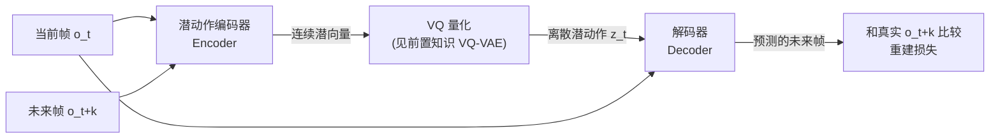

# 前置知识：逆动力学模型与潜动作学习——没有动作标签的视频，怎么学出"动作"

> **一句话**：网上有海量的人类活动视频（做饭、组装家具、打游戏），但这些视频只有画面，没有任何"每一帧之间机器人应该输出什么动作指令"的标签。逆动力学模型（Inverse Dynamics Model, IDM）和潜动作学习（Latent Action Learning）是两种从"只有画面、没有动作标签"的视频里，硬是"逼"出一份可用的动作序列的方法——前者需要一小部分有标签数据打底，后者完全不需要任何标签，直接从画面变化里学出一套抽象的、离散的"动作词汇表"。
>
> **为什么要学这个**：本系列要讲的 real2sim2real 工作流里，DreamGen 这类方法会用视频生成模型"造"出大量新的机器人行为视频——但生成出来的只是一段视频（一堆画面），要把它变成能拿去训练机器人策略的训练数据，必须先把"画面怎么变化的"转换成"应该输出什么动作"，这正是本文要讲的技术要解决的问题。

## 相关阅读

- [向量量化与离散表示学习](/前置知识/001q_前置知识_向量量化与离散表示学习) — 本文讲的潜动作学习会直接用到 VQ-VAE 的量化机制，建议先读这篇
- [知识蒸馏基础](/前置知识/000v_前置知识_知识蒸馏基础) — 逆动力学模型的训练思路和"用小规模标注数据打标签、再放大规模使用"这个模式有相通之处
- [世界模型基础](/前置知识/000t_前置知识_世界模型基础) — 世界模型预测"动作 → 下一状态"，本文讲的是反过来："观测到的状态变化 → 反推动作"，两者互为镜像
- [正动力学、逆动力学与递归刚体算法](/前置知识/008e_前置知识_正动力学逆动力学与递归刚体算法) — 术语辨析：经典机器人逆动力学根据刚体方程反求关节力矩，和本文的学习型 IDM 输入输出不同

---

## 贯穿全文的例子

> **场景**：你在网上找到了一段视频——一个人把桌上的杯子拿起来，移到了旁边的托盘里。这段视频只是一系列画面帧，没有任何"手部关节角度是多少""施加了多大的力"这类动作标签。现在你想让一个机械臂学会同样的动作，但机械臂的策略网络训练需要"观测 + 动作"成对的数据。问题变成了：只看画面前后两帧的变化，能不能反推出（或者定义出）一个"动作"来填补这个空白？本文接下来讲的两种方法，都是在回答这个问题，只是用了完全不同的思路。

---

## 一、问题的起点：视频里"没有"动作,但视频里"藏着"动作的信息

### 1.1 机器人训练数据的两种来源，各有什么代价

要训练一个机器人策略（VLA 模型），标准做法是收集"观测 + 动作"成对的示教数据——比如遥操作员用手柄控制机械臂完成任务，系统记录下每一步的关节角度指令。这类数据的问题是：**采集成本极高**，需要专门的机器人硬件、专门的遥操作员，一天最多采集几百条轨迹。

与此同时，互联网上有海量的人类活动视频——做饭、组装家具、打游戏、体育运动——这些视频包含了大量"任务是怎么完成的"的信息，但**只有画面，没有任何动作标签**。如果能把这些视频用起来，机器人训练数据的规模理论上可以扩大好几个数量级。

问题的核心矛盾：**视频里没有显式标注的动作，但画面从一帧到下一帧的变化,本身就隐含了"发生了什么动作"这个信息**——杯子从桌上移动到托盘里，这个位移变化本身就是"动作"的一种体现，只是没有被显式写成"关节角度指令"这种机器人能直接执行的格式。

### 1.2 两条不同的解法思路

面对"视频里藏着动作信息，但格式不对"这个问题，业界发展出两条不同的技术路线：

1. **逆动力学模型（IDM）**：先用一小部分**有动作标签**的数据（比如几百条人类操作某个游戏的按键记录），训练一个模型学会"看两帧画面变化，反推出应该是什么具体动作"，然后把这个训好的模型当作一个自动标注工具，去标注海量的、原本没有标签的视频。
2. **潜动作学习（Latent Action Learning）**：完全不需要任何有标签的数据，直接从大量无标签视频的"帧对"里，自监督地学出一套**抽象的、离散的动作符号**——这些符号不对应任何具体的物理动作指令（不知道"符号 7"具体是"向左移动 5 厘米"还是"向右转动 10 度"），但它们捕捉到了"从这一帧到下一帧,发生了某种有意义的变化"这个抽象概念。

这两条路线分别对应下面第二、三节。

---

## 二、逆动力学模型（IDM）：用少量标签数据训练一个"自动打标机"

### 2.1 名字里的"逆"是相对什么而言

回顾[世界模型基础](/前置知识/000t_前置知识_世界模型基础)里讲过的**正向动力学模型**（forward dynamics model）：给定当前状态 $s_t$ 和动作 $a_t$，预测下一个状态 $\hat{s}_{t+1}=f_\psi(s_t,a_t)$——这是"知道做了什么动作，猜测世界会变成什么样"。

**逆动力学模型**恰好反过来：给定当前状态 $s_t$ 和下一个（已经观测到的）状态 $s_{t+1}$，反推出中间**应该执行了什么动作**：

$$
\hat{a}_t = g_\phi(s_t, s_{t+1})
$$

**这个公式在做什么**：用一个参数为 $\phi$ 的神经网络 $g_\phi$，根据"事前"和"事后"两个已知状态，反推出中间那个未知的动作是什么——这正是"逆"这个字的含义：正向模型是"动作→结果"，逆向模型是"结果→动作"。

::: details 📐 公式详解（点击展开）

| 子表达式 | 它是谁 | 它在干嘛 |
|---------|--------|---------|
| $s_t$ | **事前的画面** | 当前时刻的观测（比如一帧图像），这是已知的输入 |
| $s_{t+1}$ | **事后的画面** | 下一时刻的观测（下一帧图像），这也是已知的输入——注意这一点和正向动力学模型刚好相反：正向模型里 $s_{t+1}$ 是要预测的未知量，这里 $s_{t+1}$ 反而是已知输入的一部分 |
| $g_\phi(\cdot)$ | **侦探** | 参数为 $\phi$ 的神经网络，根据"案发前"和"案发后"两张画面，推断中间发生了什么动作 |
| $\hat{a}_t$ | **推断出的动作** | 模型给出的、"最可能是这个"的动作估计 |

**用人话读**：给模型看"动作发生前"和"动作发生后"两张画面，让它猜"中间到底做了什么动作才会让画面这样变化"。

**为什么是这个形式**：这个设计直接对应了"视频里没有动作标签，但两帧之间的变化本身包含动作信息"这个核心观察——如果一个模型能够根据"结果"精确反推出"原因"（动作），那这个模型就可以被当作一台自动化的标注机器，去处理海量没有标签的视频数据。
:::

### 2.2 训练 IDM 需要什么数据

训练这个 $g_\phi$ 网络本身需要一批**已经有动作标签**的 $(s_t, a_t, s_{t+1})$ 三元组数据——这批数据的规模不需要很大（相比于要标注的海量无标签视频而言），因为它只是用来教会模型"怎么根据画面变化反推动作"这一件相对通用、不需要太多样本就能学会的技能。

一个经典案例是 OpenAI 的 [VPT](https://openai.com/index/vpt/)（Video PreTraining，2022）项目：先请人类玩家玩 Minecraft 并记录约 2000 小时"画面+按键"成对数据，训练出一个 IDM；然后用这个训好的 IDM，去标注互联网上找到的、**没有按键记录**的海量 Minecraft 游戏视频（约 7 万小时），把这些视频"伪标注"成大规模的"画面+动作"训练数据，最终训出的智能体表现远超只用那 2000 小时真实标签数据训练的效果。

### 2.3 IDM 在机器人 real2sim2real 工作流中的角色

在本系列要讲的 DreamGen 这类工作流程里，IDM 承担的角色是：视频生成模型（比如微调过的图像到视频扩散模型）会"凭空"生成大量新的机器人操作视频——这些视频画面看起来很真实，但同样**没有动作标签**（生成模型只学会了怎么画连续的画面，不知道背后对应什么关节角度指令）。这时用一个提前训好的 IDM，对生成出的每一对连续帧做"事后侦查"，反推出一套伪动作标签，就能把"只有画面"的生成视频，转换成"画面+伪动作"的可训练数据——这正是 DreamGen 管线里"neural trajectory"（神经轨迹）这个概念的核心构造方式。

**回到我们的例子**：那段"拿杯子放到托盘"的视频，如果有一个训好的机械臂 IDM，输入相邻两帧，就能输出一个具体的、机械臂能直接执行的动作估计（比如末端位姿的增量）。

---

## 三、潜动作学习：完全不需要任何标签,直接学出一套抽象"动作词汇"

### 3.1 IDM 的局限：仍然需要一批有标签的数据打底

IDM 方案的前提是要有至少一小批**有明确动作标签**的数据来训练那个"侦探"网络——但如果连这一小批标签数据都没有（比如网上找到的做饭视频，完全没有任何机器人示教数据可以拿来打底训练 IDM），IDM 这条路就走不通了。

潜动作学习要解决的正是这种更极端的情况：**完全不需要任何动作标签，只用一堆"帧对"（这一帧和下一帧），自监督地学出一套动作表示**。

### 3.2 核心思路：把"两帧之间的变化"本身当作要学习的"潜动作"

潜动作学习最典型的代表是 [LAPA](https://arxiv.org/abs/2410.11758)（Latent Action Pretraining，2024）。它的核心思路是：借助[向量量化与离散表示学习](/前置知识/001q_前置知识_向量量化与离散表示学习)里讲过的 VQ-VAE 框架，训练一个编码器-解码器系统，让它自己"发明"一套离散的动作符号——这套符号唯一的训练目标就是：**这两帧之间的变化信息,能不能被压缩进这个离散符号里，并且靠这个符号加上第一帧，尽量还原出第二帧**。

具体训练结构：

**编码器**同时看当前帧 $o_t$ 和未来某帧 $o_{t+k}$（不一定是紧邻的下一帧，可以跳几帧），输出一个连续的潜向量——这个潜向量理论上应该只编码"从 $o_t$ 到 $o_{t+k}$ 发生了什么变化"这个信息（因为 $o_t$ 本身已经作为解码器的额外输入单独提供了，编码器不需要重新编码 $o_t$ 里静态不变的背景信息）。

这个连续潜向量经过 VQ 量化，变成一个离散的**潜动作** $z_t$（一个从有限码本里选出的符号，具体量化机制见 [向量量化与离散表示学习](/前置知识/001q_前置知识_向量量化与离散表示学习#三、向量量化-vq-用一本学出来的码本做归类)）。

**解码器**只看当前帧 $o_t$ 和这个离散的潜动作符号 $z_t$，尝试重建出未来帧 $o_{t+k}$：

$$
\hat{o}_{t+k} = \text{Decoder}(o_t, z_t)
$$

**这个公式在做什么**：检验"潜动作符号 $z_t$ 里有没有装够信息"——如果只靠当前帧加上这一个离散符号，就能准确还原出未来帧,说明这个符号确实抓住了"从当前到未来发生了什么变化"这个核心信息。

::: details 📐 公式详解（点击展开）

| 子表达式 | 它是谁 | 它在干嘛 |
|---------|--------|---------|
| $o_t$ | **已知的起点** | 当前帧画面，解码器和编码器都能看到 |
| $z_t$ | **压缩出的"变化摘要"** | 编码器从 $(o_t,o_{t+k})$ 中提炼、经 VQ 量化后得到的离散符号，这就是本文说的"潜动作" |
| $\text{Decoder}(\cdot)$ | **还原师** | 只凭当前帧和这一个变化摘要符号，尝试重建出未来会发生的画面 |
| $\hat{o}_{t+k}$ | **重建出的未来** | 解码器的输出，会被拿去和真实的 $o_{t+k}$ 逐像素比较算重建损失 |

**用人话读**："只告诉解码器'现在的样子'加上'一个代表变化的编号'，看它能不能猜出'未来会变成什么样'——猜得越准，说明这个编号越有效地抓住了变化的核心信息。"

**为什么是这个形式**：这个训练目标天然地"逼"着编码器把有用的动态信息（而不是无关的静态背景）压缩进潜动作符号里——因为静态背景在 $o_t$ 里已经直接提供给解码器了，如果编码器把背景信息也塞进 $z_t$，对重建效果没有任何帮助，纯属浪费码本容量；只有真正和"变化"相关的信息才值得被编码进 $z_t$。这是一种巧妙地不需要任何人工标注就能让模型自己学会"什么是动作"的自监督设计。
:::

### 3.3 学出来的"潜动作"是什么？和真实机器人动作的关系是什么

需要特别强调的是：这套通过潜动作学习得到的离散符号，**本身不对应任何具体的、人类能直接理解的物理动作指令**——它是编码器和解码器在训练过程中自己"发明"出来的一套内部语言，只是恰好能有效地区分"发生了什么类型的变化"。比如符号 3 可能大体对应"物体向右移动"这类变化,符号 12 可能大体对应"手部张开"这类变化，但具体是哪个方向移动多远、哪只手张开到什么程度，这套符号本身并不精确编码。

正因为这套符号是抽象的、不直接对应具体动作指令,LAPA 这类方法在真正部署到某个具体机器人之前，还需要额外一步：**用少量真实的机器人示教数据（有明确的关节角度/末端位姿标签），训练一个小的映射网络，把这套抽象的潜动作符号"翻译"成这台具体机器人能执行的真实动作指令**。这一步微调所需的数据量远小于从零训练整个策略所需的数据量——因为大部分"理解视频里发生了什么变化"这件事，已经在前面完全不需要标签的大规模视频预训练阶段学会了，微调阶段只需要学会"这套抽象符号具体对应到这台机器人身上该怎么执行"这一件相对简单的映射关系。

### 3.4 IDM 和潜动作学习的对比

| 维度 | 逆动力学模型 (IDM) | 潜动作学习 (Latent Action, 如 LAPA) |
|------|---------------------|----------------------------------------|
| 是否需要有标签数据 | 需要一小批有动作标签的数据训练 IDM 本身 | 完全不需要，纯自监督 |
| 输出的"动作"性质 | 具体的、可解释的动作估计（比如末端位姿增量） | 抽象的、不直接可解释的离散符号 |
| 部署到具体机器人前是否需要额外微调 | 通常不需要（IDM 训练时用的就是目标机器人的标签数据） | 需要（额外训练一个"潜动作→真实动作"的映射） |
| 适用场景 | 至少有一小批目标领域的标注数据（如同类型机器人的少量示教） | 完全没有任何目标领域标注数据，只有海量无标签视频 |
| 代表工作 | VPT（Minecraft）、DreamGen 中用于给生成视频打伪动作标签的 IDM | LAPA、[GR00T 系列](/系列/groot_n1d7_deep_dive/) 部分预训练阶段用到的潜动作思路 |

---

## 四、这两种技术在 Real2Sim2Real 工作流中的位置

本系列要讲的 real2sim2real 工作流，核心矛盾之一是：**用视频生成模型可以"造"出无限多的新场景、新行为的视频，但生成出来的只是画面，不是训练数据**。IDM 和潜动作学习正是解决"从生成的画面里提炼出可训练的动作信号"这一环节的两种技术方案：

- 如果目标机器人已经有一批（哪怕不多）真实的动作标签数据，优先训练一个专属的 IDM 作为"自动打标机"，处理起来更直接、标注质量通常更高更精确。
- 如果完全没有任何目标机器人的标注数据、只想先在海量无标签的人类视频或生成视频上做大规模预训练，潜动作学习提供了一条完全不依赖标签的路径，把"理解画面里发生了什么变化"这个能力，和"具体怎么把这种变化翻译成某台机器人的动作指令"这个能力解耦开来分两步学。

这两条技术路线不是互斥的——实践中经常先做大规模的潜动作预训练获得一个通用的"变化理解"能力，再用少量真实数据微调映射到具体动作，这也是 real2sim2real 数据管线里"用生成视频扩充训练数据规模"这一步能够真正落地的关键技术支撑。

---

## 五、总结

| 概念 | 核心要点 |
|------|---------|
| 要解决的问题 | 视频里没有动作标签，怎么把"画面变化"转换成可训练的"动作"信号 |
| 逆动力学模型 (IDM) | 用少量有标签数据训练一个"看两帧、猜动作"的模型，再用它给海量无标签视频打伪标签 |
| 潜动作学习 | 完全不需要标签，用 VQ-VAE 框架自监督地学出一套抽象的、离散的"变化摘要"符号 |
| 两者的核心差异 | IDM 输出具体可解释的动作估计，依赖标签数据；潜动作学习输出抽象符号，纯自监督但需要额外微调才能映射到真实动作 |
| 在 Real2Sim2Real 中的作用 | 把视频生成模型"造"出来的画面，转换成能拿去训练机器人策略的"观测+动作"数据 |

---

## 延伸阅读

- Baker et al., *"Video PreTraining (VPT): Learning to Act by Watching Unlabeled Online Videos"*, arXiv:2206.11795, 2022 — IDM 方案的经典案例
- Ye et al., *"Latent Action Pretraining from Videos (LAPA)"*, arXiv:2410.11758, 2024（ICLR 2025） — 潜动作学习的代表工作
- [向量量化与离散表示学习](/前置知识/001q_前置知识_向量量化与离散表示学习) — 潜动作学习依赖的量化机制
- [世界模型基础](/前置知识/000t_前置知识_世界模型基础) — 与本文的逆动力学模型互为镜像的正向动力学模型
- [DreamGen：视频世界模型生成机器人训练数据](/论文综述/117_DreamGen_视频世界模型生成机器人训练数据) — IDM 在真实 real2sim2real 工作流中的具体应用
