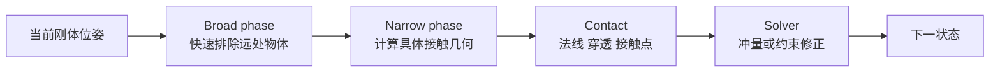

# 前置知识：分离轴定理与凸多边形碰撞检测

> **一句话**：两个凸形状没有碰撞，当且仅当至少存在一条方向轴，把它们投影后分隔开；所以碰撞检测可以从“检查复杂边界是否相交”变成“在有限条候选轴上做一维区间比较”。

## 知识链接

- [物体解算器从零实现：最小自由落体解算器](/系列/newton_solver_from_zero/01_最小自由落体解算器) — 从时间推进进入碰撞检测
- [Newton 引擎深度解析：碰撞检测流水线](/系列/newton_engine_deep_dive/04_碰撞检测流水线_从粗筛到SDF与Hydroelastic接触) — Newton 的 broad phase、narrow phase 和 SDF 路径
- [惩罚法接触模型](/前置知识/006d_前置知识_惩罚法接触模型_弹簧阻尼与摩擦锥) — 碰撞检测输出穿透信息之后如何形成接触响应
- [三维旋转表示](/前置知识/006a_前置知识_三维旋转表示_旋转矩阵四元数与角速度) — 把 2D 的旋转和坐标变换推广到 3D

## 一、碰撞检测和碰撞响应是两件事

物理引擎的一步仿真通常至少包含两种不同工作：

1. **检测**：找出哪些形状相交、相距多近，以及接触法线和穿透深度
2. **响应**：根据这些几何信息修改速度、位置或力，让物体不再继续违反物理条件

检测阶段不应该偷偷改变物体速度；响应阶段也不应该重新实现一套完整的网格相交算法。Newton 将 CollisionPipeline 与 Solver 分成两个对象，就是为了保持这条边界。教学版刚体解算器也遵守同样的数据流：

## 二、为什么投影能代表碰撞

### 2.1 从二维形状降到一维区间

选一条单位方向轴 $\mathbf a$，把多边形的每个顶点 $\mathbf p_i$ 与它做点积。点积结果就是顶点在这条轴上的坐标。所有顶点投影后，会形成一个一维区间 $[p_{\min},p_{\max}]$。

对于两个形状 A 和 B，只需比较两个区间：

- 区间完全分开：沿这条轴看，两个物体之间存在空隙
- 区间重叠：沿这条轴看，无法证明它们分开

这就是“分离轴”的核心。它只把几何关系观察成一个方向上的阴影，不需要立刻处理二维边界。

### 2.2 凸形状的关键性质

凸形状的任意两点连线都在形状内部。这个性质保证了：如果两个凸形状相交，那么它们的边界之间不存在一个隐藏在凹陷内部的复杂穿插。对凸多边形，只需测试来自两者边的法线方向，就能覆盖所有可能成为分离方向的候选轴。

因此，二维凸多边形 SAT（Separating Axis Theorem，分离轴定理）算法的候选轴来源非常具体：

- 多边形 A 每条边的垂直方向
- 多边形 B 每条边的垂直方向

如果某条候选轴上区间不重叠，算法立即返回“没有碰撞”。如果所有轴上的区间都重叠，算法返回“发生碰撞”，并且最小区间重叠量可以作为穿透深度的近似。

## 三、SAT 算法逐步展开

### 3.1 变换到世界坐标

多边形通常用局部顶点保存，刚体状态只存质心位置和角度。每个时间步先用刚体的位姿把局部顶点变换到世界坐标。2D 旋转只需要一个角度；3D 则会使用旋转矩阵或四元数，详见[三维旋转表示](/前置知识/006a_前置知识_三维旋转表示_旋转矩阵四元数与角速度)。

教学代码只需要实现“平移加旋转”的坐标变换；这一步不改变速度，也不产生冲量，只回答“当前形状在世界里在哪里”。

### 3.2 枚举候选轴

对每条世界坐标边 $\mathbf e=\mathbf p_{i+1}-\mathbf p_i$，取一个垂直向量作为候选轴。轴不需要指向某个固定方向，因为投影区间在轴反向后只是整体乘以负号，重叠关系不变。实际实现时通常先归一化，避免轴长度影响投影深度的数值。

### 3.3 投影并寻找最小重叠

对每条候选轴：

1. 遍历 A 的世界顶点，得到 min_a 和 max_a
2. 遍历 B 的世界顶点，得到 min_b 和 max_b
3. 计算区间重叠量
4. 如果重叠量小于等于零，立即判定无碰撞
5. 保留重叠量最小的轴

为什么要保留最小重叠轴？如果所有轴都重叠，最小重叠轴就是“把两个形状分开所需移动最短”的方向，它是接触法线和穿透深度的一个自然候选。对于盒子、凸多边形等规则形状，这个近似非常实用。

### 3.4 统一法线方向

同一个几何接触，如果一次返回的法线从 A 指向 B，下一次却返回相反方向，冲量符号就会反过来。教学实现通常用质心差 $\mathbf c_B-\mathbf c_A$ 与最小重叠轴做点积：如果点积为负，就翻转轴。最终约定为：

> normal 从 A 指向 B，沿这个方向施加正冲量会把 A 推离 B。

这个约定必须写在 Contact 数据结构旁边，而不能只存在于调用者的记忆里。

### 3.5 估计接触点

完整的凸多边形接触流形可能包含一条边或多个点。教学版先用支持点近似：

- 在法线方向上找 A 最外侧的顶点
- 在反法线方向上找 B 最外侧的顶点
- 取两个支持点的中点作为代表接触点

这个点不等价于工业级碰撞库输出的完整接触流形，但足以展示接触点偏离质心时为什么会产生力矩。Newton 的碰撞管线会根据几何类型使用 MPR/GJK、网格接触、SDF 和接触归约等更复杂路径，详见[Newton 碰撞检测流水线](/系列/newton_engine_deep_dive/04_碰撞检测流水线_从粗筛到SDF与Hydroelastic接触)。

## 四、Broad phase 和 Narrow phase

SAT 对每一对凸多边形做全部轴测试，适合数量很少的教学场景。物体数量变多后，不能对所有物体对都做 SAT。工程实现会先用便宜的包围盒做 broad phase：

| 阶段 | 输入 | 输出 | 目标 |
|------|------|------|------|
| Broad phase | 每个形状的 AABB | 可能碰撞的形状对 | 尽快排除明显相距很远的对象 |
| Narrow phase | 候选形状对的精确顶点/网格 | 接触点、法线、穿透 | 只对少量候选做高精度几何计算 |

教学版可以先使用全对全循环，因为它能让读者看清 SAT 本身。系列最后的 Newton 对照章会把这个选择和 GPU 并行、空间哈希、扫掠轴算法连接起来。

## 五、常见失败模式

- **把凹多边形直接喂给 SAT**：凹形状可能在边界之外形成隐藏区域，通常需要凸分解、网格算法或 SDF
- **忘记归一化法线**：穿透深度和冲量有效质量会受到轴长度污染
- **法线方向不统一**：响应阶段会把物体越推越穿透
- **只检测位置重叠，不记录穿透量**：响应阶段无法知道应该修正多大
- **把检测和响应写在一个函数里**：后续更换冲量、PBD 或 XPBD 时会被几何代码绑死

## 总结

SAT 的价值不在于它是唯一碰撞算法，而在于它给了一个清晰的最小实验：把二维碰撞转换成若干个一维区间问题。教学版先使用 SAT 产生统一的 Contact；生产级 Newton 在同一“检测输出接触，求解器消费接触”的接口之上，替换成适合不同几何和 GPU 的宽相位、窄相位与 SDF 算法。

## 延伸阅读

- [冲量与碰撞响应](/前置知识/007c_前置知识_冲量与碰撞响应)
- [约束雅可比与顺序冲量](/前置知识/007e_前置知识_约束雅可比与顺序冲量)
- [Newton 碰撞检测流水线](/系列/newton_engine_deep_dive/04_碰撞检测流水线_从粗筛到SDF与Hydroelastic接触)
