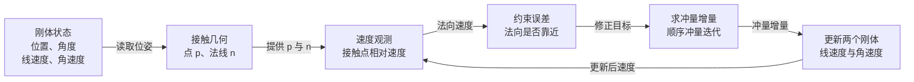
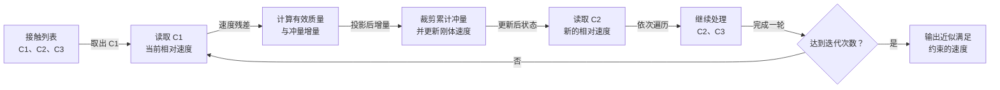

# 前置知识：约束雅可比与顺序冲量

> **一句话**：约束雅可比把“某个接触点沿某个方向的速度”从刚体的线速度和角速度中抽出来，顺序冲量再反复修正这个标量速度，直到一组接触尽量同时满足约束。

## 知识链接

- [刚体动力学：牛顿-欧拉方程与惯性张量](/前置知识/006b_前置知识_刚体动力学_牛顿欧拉方程与惯性张量)
- [雅可比矩阵与微分运动学](/前置知识/003b_前置知识_雅可比矩阵与微分运动学)
- [冲量与碰撞响应](/前置知识/007c_前置知识_冲量与碰撞响应)
- [分离轴定理与凸多边形碰撞检测](/前置知识/007d_前置知识_分离轴定理与凸多边形碰撞检测)
- [物体解算器从零实现](/系列/newton_solver_from_zero/index)

本文只补充“如何把接触写成统一的速度约束”。矩阵微积分的一般背景请沿着上面的雅可比前置知识阅读；这里的重点是刚体解算器中的数据流、符号约定和可运行实现。

## 一、先从一个接触问题开始

想象两个二维刚体在一个点接触。接触检测已经告诉我们三件事：接触点是 $\mathbf p$，法线是单位向量 $\mathbf n$，并且 $\mathbf n$ 从刚体 A 指向刚体 B。现在解算器要回答一个很具体的问题：**接触点沿 $\mathbf n$ 的相对速度是多少？**

如果这个速度小于零，说明两个接触点正在沿法线互相靠近；如果继续保持这个速度，下一小段时间就会产生更多穿透。因此，接触求解器不必立刻处理刚体的全部速度，只需要盯住这个标量。

这就是约束的第一层抽象：把几何要求“不能继续穿透”转换为速度要求“法向相对速度不能为负”。摩擦则是同一接触点上的切向速度约束，只是它不是一个绝对不能违反的等式，而是一个有范围的摩擦锥不等式。

## 二、接触点速度为什么包含角速度

### 2.1 从质心速度走到接触点速度

刚体的质心线速度只描述质心怎么移动。接触点通常不在质心上，所以还要加上旋转带来的局部速度。设 $\mathbf r=\mathbf p-\mathbf c$ 是从质心 $\mathbf c$ 指向接触点的向量，二维角速度是标量 $\omega$，那么接触点速度由两部分组成：质心平移速度，加上角速度让这个半径扫出的切向速度。

二维里，角速度和半径的叉乘可以写成一个很小的辅助函数：$\operatorname{cross}(\omega,\mathbf r)=(-\omega r_y,\omega r_x)$。于是刚体 A 在接触点的速度为 $\mathbf v_A+\boldsymbol\omega_A\times\mathbf r_A$，刚体 B 的速度同理。

### 2.2 用一个方向抽出标量速度

接触法线只关心相对速度在 $\mathbf n$ 上的投影。为了把这个“从刚体状态到一个标量”的关系写成标准形式，我们定义广义速度 $\mathbf u$，它把所有刚体的线速度和角速度排在一起；再定义约束雅可比 $\mathbf J$，它只负责从 $\mathbf u$ 抽取接触点沿法线的相对速度。

$$
v_n = \mathbf J\mathbf u = \mathbf n\cdot\left[(\mathbf v_B+\boldsymbol\omega_B\times\mathbf r_B)-(\mathbf v_A+\boldsymbol\omega_A\times\mathbf r_A)\right]
$$

**这个公式在做什么**：把两个刚体的平移和旋转状态压缩成一个数，告诉我们接触点沿法线是在靠近还是分离。

::: details 📐 公式详解（点击展开）

| 子表达式 | 它是谁 | 它在干嘛 |
|---------|--------|---------|
| $\mathbf v_B-\mathbf v_A$ | **质心相对平移** | 观察两个质心整体是靠近还是远离 |
| $\boldsymbol\omega_B\times\mathbf r_B-\boldsymbol\omega_A\times\mathbf r_A$ | **旋转造成的接触点运动** | 把接触点离质心的距离带来的切向速度加入进来 |
| $\mathbf n\cdot(\cdot)$ | **方向过滤器** | 丢掉切向分量，只保留可能造成穿透的法向分量 |
| $\mathbf J\mathbf u$ | **约束观测值** | 把复杂的刚体速度映射成一个接触约束速度 |

**用人话读**：先分别算出两个接触点真正怎么动，再比较它们沿接触法线的速度。

**为什么必须包含旋转**：同一个物体的质心可能静止，但如果它在转动，边缘接触点仍然可能高速扫过地面。忽略旋转会让接触响应错过最重要的力矩来源。
:::

在二维代码中，我们不需要真的分配一个大矩阵。雅可比的作用由法线、接触点相对质心的向量，以及二维叉乘共同体现。矩阵写法是统一的数学视角，标量写法是高效的工程实现。

## 三、冲量如何通过雅可比改变约束速度

沿法线施加一个大小为 $\lambda$ 的冲量。按照“法线从 A 指向 B”的约定，A 接受 $-\lambda\mathbf n$，B 接受 $+\lambda\mathbf n$。这个冲量会改变两者的线速度；如果接触点偏离质心，还会改变角速度。

把所有刚体的逆质量和逆惯量排成一个块对角矩阵 $\mathbf M^{-1}$，冲量对广义速度的影响可以写成 $\Delta\mathbf u=\mathbf M^{-1}\mathbf J^\mathsf T\lambda$。代回约束速度，就得到一个非常重要的关系：冲量增加 $\lambda$ 后，约束速度增加多少由 $\mathbf J\mathbf M^{-1}\mathbf J^\mathsf T$ 决定。

$$
\Delta v_n = \mathbf J\mathbf M^{-1}\mathbf J^\mathsf T\Delta\lambda = K\Delta\lambda
$$

**这个公式在做什么**：计算“多加一单位法向冲量，会让接触点分离速度增加多少”；这个比例 $K$ 的倒数就是约束方向上的有效质量。

::: details 📐 公式详解（点击展开）

| 子表达式 | 它是谁 | 它在干嘛 |
|---------|--------|---------|
| $\mathbf J^\mathsf T\Delta\lambda$ | **冲量分配器** | 把一个标量冲量拆成两个刚体应收到的线性和角冲量 |
| $\mathbf M^{-1}$ | **惯性响应器** | 用逆质量、逆惯量把冲量变成速度变化 |
| $\mathbf J\mathbf M^{-1}\mathbf J^\mathsf T$ | **有效质量的倒数** | 把整个系统在当前接触方向上的响应压缩成一个标量 |
| $K\Delta\lambda$ | **约束速度增量** | 说明冲量增加后，法向相对速度会增加多少 |

**用人话读**：先把冲量分给两个刚体，再看这两个刚体的速度变化重新投影回接触方向。

**为什么是这个形式**：冲量先作用到动力学状态，再由同一个接触观测器读取结果；因此雅可比先转置、经过逆质量，再由雅可比投影回来。
:::

### 3.1 二维有效质量的展开式

对于一个二维接触，$K$ 不需要真的做矩阵乘法。二维标量叉乘 $\operatorname{cross}(\mathbf r,\mathbf n)$ 表示法向冲量产生的力矩臂，因而有效质量倒数是：

$$
K = m_A^{-1}+m_B^{-1}+I_A^{-1}\operatorname{cross}(\mathbf r_A,\mathbf n)^2+I_B^{-1}\operatorname{cross}(\mathbf r_B,\mathbf n)^2
$$

**这个公式在做什么**：把两个刚体的平动惯性和转动惯性合并成当前接触方向上的一个响应系数。

::: details 📐 公式详解（点击展开）

| 子表达式 | 它是谁 | 它在干嘛 |
|---------|--------|---------|
| $m_A^{-1}+m_B^{-1}$ | **平动通道** | 两个质心都能沿冲量方向移动，所以响应能力相加 |
| $I_A^{-1}\operatorname{cross}(\mathbf r_A,\mathbf n)^2$ | **A 的转动通道** | 接触点偏离 A 的质心时，冲量还能通过力臂改变 A 的角速度 |
| $I_B^{-1}\operatorname{cross}(\mathbf r_B,\mathbf n)^2$ | **B 的转动通道** | 同样的力矩效应发生在 B 上 |
| $K$ | **总响应系数** | $K$ 越大，同样冲量带来的分离速度越大 |

**用人话读**：轻物体容易被推开，转动惯量小或力臂长的物体也容易被转起来，所有能响应的通道都会共同分担接触冲量。

**为什么要平方力臂**：冲量先通过力臂产生角速度，再通过接触点速度的同一个力臂投影回来，两次相乘自然产生平方。
:::

## 四、从约束目标得到冲量

知道当前法向速度 $v_n$ 和有效质量倒数 $K$ 后，目标是找一个冲量增量，让新的法向速度达到目标值 $v_n^\star$。把“速度增量等于 $K$ 乘冲量增量”反解，就得到单约束的冲量公式：

$$
\Delta\lambda = \frac{v_n^\star-v_n}{K}
$$

**这个公式在做什么**：反过来计算需要补多少冲量，才能把当前接触速度推向目标速度。

::: details 📐 公式详解（点击展开）

| 子表达式 | 它是谁 | 它在干嘛 |
|---------|--------|---------|
| $v_n^\star-v_n$ | **速度缺口** | 当前速度和期望速度之间差多少 |
| $1/K$ | **有效质量** | 把速度缺口换算成需要的冲量大小 |
| $\Delta\lambda$ | **本轮冲量增量** | 本轮迭代实际要施加的修正量 |

**用人话读**：先量出还差多少分离速度，再除以这个系统有多难推动，得到要补的冲量。

**为什么是增量而不是一次性总量**：多个接触共享刚体速度。修正一个接触会改变另一个接触的速度，所以每次只修当前残差，并在下一轮重新测量。
:::

对于没有反弹的接触，目标通常是 $v_n^\star=0$；对于有恢复系数 $e$ 的碰撞，如果碰撞前速度足够大，目标可以取 $v_n^\star=-e v_n^{\text{before}}$。无论选哪种目标，解算器还必须施加非负约束：法向冲量只能把物体推开，不能把已经分离的物体重新吸回来。

### 4.1 为什么要缓存累计冲量

设第 $i$ 个接触当前累计了 $\lambda_i$。新一轮算出候选总量后，先把它限制到合法区间，再用“新总量减旧总量”得到本轮真正要施加的增量。法向冲量的合法区间是 $[0,+\infty)$；摩擦冲量的区间则由摩擦系数和法向累计冲量决定。

$$
\lambda_n^{\text{new}}=\max(0,\lambda_n^{\text{old}}+\Delta\lambda_n),\qquad \Delta\lambda_n^{\text{apply}}=\lambda_n^{\text{new}}-\lambda_n^{\text{old}}
$$

**这个公式在做什么**：把法向冲量限制为只能推开，并把投影后的累计结果转换成这一次迭代真正要加的冲量。

::: details 📐 公式详解（点击展开）

| 子表达式 | 它是谁 | 它在干嘛 |
|---------|--------|---------|
| $\lambda_n^{\text{old}}+\Delta\lambda_n$ | **未裁剪计划** | 不考虑接触方向限制时，本轮想要的累计冲量 |
| $\max(0,\cdot)$ | **单边约束投影** | 不允许法向累计冲量变成负值 |
| $\lambda_n^{\text{new}}-\lambda_n^{\text{old}}$ | **实际增量** | 防止把已经施加过的冲量重复施加 |

**用人话读**：先更新总账，把总账限制在合法范围，再只支付总账变化的那一部分。

**为什么缓存总账**：如果每轮都从零开始算并直接施加，接触会在正负方向来回抖动；累计冲量把不等式约束的投影状态保存了下来。
:::

## 五、顺序冲量为什么能处理多个接触

如果一个盒子压在地面上，它可能同时有两个或更多接触点。每个接触都有自己的法线速度和冲量，但它们共享盒子的线速度、角速度和位置。于是“先解决左边还是右边”会影响下一处接触看到的速度。

顺序冲量的做法是：固定一个接触，计算它的速度残差和有效质量，施加一个投影后的冲量；然后移动到下一个接触。遍历完所有接触后，再从第一个接触开始重复若干轮。

这是一种迭代近似，不是每次都精确求出整个大型线性系统的解。它的优点是单个约束局部、实现简单；代价是接触很多或刚体链很长时，需要更多迭代才能把误差传遍系统。

### 5.1 和直接解矩阵方程的关系

把所有约束的冲量排成向量 $\boldsymbol\lambda$，把每个约束的速度排成向量 $\mathbf v_c$，整个问题可以写成一个带上下界的线性互补问题。顺序冲量不显式构建这个大矩阵，而是每次只读取一个约束对应的局部行和列。

$$
\mathbf v_c^{\text{new}}=\mathbf v_c^{\text{free}}+\mathbf J\mathbf M^{-1}\mathbf J^\mathsf T\boldsymbol\lambda
$$

**这个公式在做什么**：把所有接触的自由速度和所有累计冲量联系起来，展示顺序冲量正在近似求解的全局系统。

::: details 📐 公式详解（点击展开）

| 子表达式 | 它是谁 | 它在干嘛 |
|---------|--------|---------|
| $\mathbf v_c^{\text{free}}$ | **未约束速度** | 只受重力和外力、尚未处理接触时的约束速度 |
| $\boldsymbol\lambda$ | **接触冲量账本** | 每个接触约束各自累计的冲量 |
| $\mathbf J\mathbf M^{-1}\mathbf J^\mathsf T$ | **约束耦合矩阵** | 一个接触的冲量会如何影响所有接触 |
| $\mathbf v_c^{\text{new}}$ | **修正后速度** | 当前累计冲量下所有约束看到的速度 |

**用人话读**：所有接触共享同一组刚体速度，所以它们之间会互相影响；顺序冲量只是用局部更新反复逼近这个整体关系。

**为什么不直接求逆**：接触数量变化快、矩阵稀疏且带有单边和摩擦限制；局部迭代避免频繁组装和求逆。
:::

### 5.2 一个手算例子

假设两个相同的方块各重 $1\text{kg}$，接触点在质心连线上，因此暂时没有转动项。两个逆质量都是 $1$，所以 $K=2$。如果当前相对法向速度是 $-3\text{m/s}$，完全非弹性目标是 $0$，则单次冲量为 $3/2=1.5\text{N·s}$。

这个冲量让 A 的速度沿法线减少 $1.5\text{m/s}$，让 B 增加 $1.5\text{m/s}$，相对速度从 $-3$ 变成 $0$。若同一方块还有第二个接触点，第一处冲量可能使方块旋转，让第二处接触速度不再是原来的值；因此第二个约束必须使用更新后的状态重新计算。

## 六、摩擦只是另一条切向约束

法向冲量解决“不能继续靠近”，切向冲量解决“接触面最多允许滑多快”。二维里先取切向单位向量 $\mathbf t=(-n_y,n_x)$，再计算接触点相对速度在 $\mathbf t$ 上的投影。无摩擦时不施加切向冲量；有摩擦时，求得的切向冲量必须被限制在法向累计冲量的某个比例以内。

$$
|\lambda_t|\le\mu\lambda_n
$$

**这个公式在做什么**：把切向摩擦冲量限制在法向支撑冲量允许的范围内，避免摩擦凭空大于接触压力。

::: details 📐 公式详解（点击展开）

| 子表达式 | 它是谁 | 它在干嘛 |
|---------|--------|---------|
| $\lambda_t$ | **切向冲量** | 尝试消除接触面的相对滑动 |
| $\mu$ | **材料摩擦系数** | 决定接触面最多能提供多少切向阻力 |
| $\lambda_n$ | **法向支撑额度** | 接触压得越紧，允许的摩擦范围越大 |
| $|\lambda_t|\le\mu\lambda_n$ | **摩擦锥在二维的截面** | 把摩擦冲量投影回合法区间 |

**用人话读**：摩擦想把滑动停下来，但它的力气不能超过“物体压在接触面上的程度”乘以材料系数。

**为什么依赖法向冲量**：库仑摩擦不是独立的固定力，它与接触压力耦合；没有法向接触，就没有这个接触点的摩擦能力。
:::

## 七、从公式到代码时最容易错的地方

### 7.1 法线方向

本文约定法线从 A 指向 B，沿法线的正冲量把 A 推向负方向、把 B 推向正方向。只要选择了另一套约定也可以，但必须同时修改相对速度、冲量施加方向和穿透修正方向。最常见的 bug 是检测阶段翻转了法线，求解阶段却还使用旧符号。

### 7.2 叉乘顺序

二维标量叉乘满足 $\operatorname{cross}(\mathbf a,\mathbf b)=a_xb_y-a_yb_x$，交换顺序会变号。力矩使用 $\operatorname{cross}(\mathbf r,\mathbf J)$，有效质量中的力臂使用 $\operatorname{cross}(\mathbf r,\mathbf n)$。

### 7.3 位置修正不是速度求解

穿透已经发生时，仅仅把当前法向速度改成零并不能把两个形状分开；反过来，直接把位置推开也不能自动产生正确的碰撞速度。教学解算器通常先做少量位置修正清理几何误差，再做顺序冲量处理。这个分工正是[预测与校正](/系列/newton_solver_from_zero/02_预测与校正)和 [PBD](/前置知识/006f_前置知识_基于位置的动力学PBD)要反复强调的内容。

## 总结

把刚体接触拆开后，核心链路只有四步：

1. 用接触点、法线和相对质心向量构造约束雅可比
2. 用雅可比从刚体速度中读出接触约束速度
3. 用逆质量和逆惯量计算这个方向的有效质量
4. 通过裁剪累计冲量并反复遍历约束，近似满足整组接触

这套语言不仅适用于碰撞。距离关节、铰链、固定关节都可以写成“约束函数对状态的局部导数”，再用同样的有效质量和顺序冲量框架求解。

## 延伸阅读

- [物体解算器从零实现：顺序冲量](/系列/newton_solver_from_zero/08_顺序冲量_从单个接触到接触组)
- [物体解算器从零实现：关节与顺序冲量](/系列/newton_solver_from_zero/12_关节与顺序冲量)
- [冲量与碰撞响应](/前置知识/007c_前置知识_冲量与碰撞响应)
- [Newton 六种求解器全景对比](/系列/newton_engine_deep_dive/05_六种求解器全景对比_怎么选)
