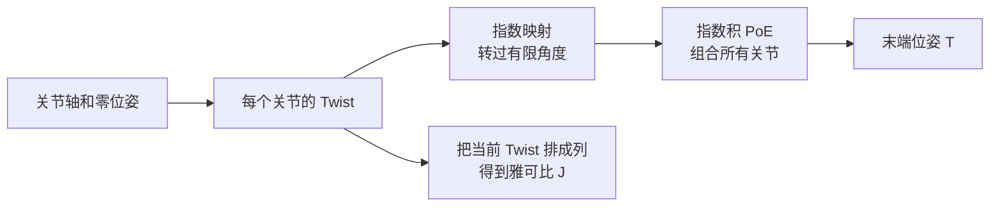

# 螺旋理论、Twist 与 SE(3) 指数映射

> **一句话**：刚体在极短时间内的任意运动，都可以看成“绕某条轴旋转，同时沿这条轴平移”。Twist 用 6 个数描述这个瞬时运动，SE(3) 指数映射再把它积分成有限位姿；这套语言把关节轴、末端速度和正运动学统一到同一个框架里。

**知识链接**：
- [三维旋转表示：旋转矩阵、四元数与角速度](/前置知识/006a_前置知识_三维旋转表示_旋转矩阵四元数与角速度)（上游：旋转与角速度）
- [正运动学与 DH 参数](/前置知识/003a_前置知识_正运动学与DH参数)（平行路线：用逐连杆坐标系计算位姿）
- [雅可比矩阵与微分运动学](/前置知识/003b_前置知识_雅可比矩阵与微分运动学)（下游：把每个关节的 Twist 排成雅可比）
- [机器人奇异性、速度椭球与可操作度](/前置知识/008b_前置知识_机器人奇异性速度椭球与可操作度)（下游：检查这些运动方向是否退化）

---

## 贯穿全文的例子

考虑一台二关节平面机械臂。肩关节和肘关节都是旋转关节，末端装着一支笔。传统 [DH 参数](/前置知识/003a_前置知识_正运动学与DH参数)会给每根连杆放一个坐标系，再逐段相乘；螺旋理论换一个视角：**先在机器人零位姿下记录每根关节轴，再直接问“沿每根轴转多少，末端会被带到哪里”**。

这不是另一套互不兼容的运动学。DH 和螺旋理论算出的末端位姿完全相同，只是组织信息的方式不同：DH 强调“相邻坐标系怎么变换”，螺旋理论强调“每个关节允许刚体做哪一种瞬时运动”。现代机器人库中的雅可比、状态估计、李群优化和轨迹插值，更常使用后一种语言。



## 一 先分清位姿和速度

位姿回答“现在在哪里、朝向哪里”，速度回答“此刻正往哪移动、转多快”。齐次变换矩阵 $T\in SE(3)$ 是位姿；线速度和角速度合在一起构成空间速度，也就是 Twist。二者的关系类似位置和普通速度，但三维旋转不可交换，所以不能把六维位姿向量简单相加来更新。

对一个刚体，已知角速度并不能唯一确定任意点的线速度：离转轴越远的点，旋转产生的线速度越大；刚体还可能整体平移。因此需要同时记录角速度 $\boldsymbol\omega$ 和一项线速度参数 $\mathbf v$。工程中常把它们按“角在前、线在后”堆成 $[\boldsymbol\omega;\mathbf v]$，也有库采用相反顺序。**顺序是接口约定，不是物理差异；调用库函数前必须核对文档。**


> 左图展示同一点的速度如何由旋转贡献与平移贡献相加；右图展示固定 Twist 作用一段时间后的螺旋轨迹。重点不是轨迹一定呈螺旋，而是纯旋转、纯平移都只是这张图的特殊情况。

## 二 一个 Twist 怎样决定整块刚体的速度

先选空间中的一个参考原点。设刚体的角速度为 $\boldsymbol\omega$，参考原点处的线速度参数为 $\mathbf v$。刚体上位置为 $\mathbf p$ 的点，其瞬时线速度由下面的关系确定：

$$
\dot{\mathbf p}=\boldsymbol\omega\times\mathbf p+\mathbf v
$$

**这个公式在做什么**：把刚体上任意一点的速度拆成“转动把它横向带走”的部分和“整块刚体共同平移”的部分。给定同一个 Twist 后，整块刚体上所有点的速度都被确定了。

::: details 📐 公式详解（点击展开）

| 子表达式 | 它是谁 | 它在干嘛 |
|---------|--------|---------|
| $\boldsymbol\omega\times\mathbf p$ | **旋转搬运项** | 方向同时垂直于转轴和半径，大小随点到参考原点的垂直距离增加 |
| $\mathbf v$ | **共同平移项** | 给所有点叠加相同的线速度；其具体数值取决于 Twist 选在哪个坐标系表达 |
| $\dot{\mathbf p}$ | **这个点真正的速度** | 把旋转贡献与平移贡献相加后的结果 |

**用人话读**：“一个点此刻怎么走，等于刚体旋转带来的横向速度，再加上整块物体一起移动的速度。”

**为什么是这个形式**：刚体要求任意两点之间的距离保持不变。叉乘产生的速度永远垂直于半径，不会把点拉近或推远；统一的平移也不改变点间距离，因此两项相加恰好描述所有可能的刚体瞬时运动。
:::

对于绕过点 $\mathbf q$、方向为单位向量 $\boldsymbol\omega$ 的纯旋转关节，可把上式改写成 $\dot{\mathbf p}=\boldsymbol\omega\times(\mathbf p-\mathbf q)$。展开后可读出该关节的线速度参数是 $\mathbf v=-\boldsymbol\omega\times\mathbf q$。这解释了一个容易困惑的事实：**旋转关节的 Twist 下半部分通常不为零**。它不是说关节轴自身在平移，而是在当前参考原点处编码“转轴离原点有多远”。

移动关节更简单：它没有角速度，$\boldsymbol\omega=\mathbf0$，只有沿导轨方向的 $\mathbf v$。所以旋转关节和移动关节不必分两套公式，只是 Twist 的不同特例。

| 关节/运动 | $\boldsymbol\omega$ | $\mathbf v$ | 轨迹直觉 |
|---|---:|---:|---|
| 绕过原点的纯旋转 | 非零 | 零 | 圆 |
| 绕偏置轴的纯旋转 | 非零 | $-\boldsymbol\omega\times\mathbf q$ | 绕偏置轴的圆 |
| 纯平移 | 零 | 非零 | 直线 |
| 一般螺旋运动 | 非零 | 含沿轴分量 | 螺旋线 |

## 三 从 6 个数变成可运算的矩阵

齐次变换用矩阵相乘组合，Twist 也需要一种能进入矩阵运算的形式。做法是用“帽算子”把角速度向量变成反对称矩阵 $[\boldsymbol\omega]_{\times}$，使它满足 $[\boldsymbol\omega]_{\times}\mathbf p=\boldsymbol\omega\times\mathbf p$；再把线速度放进右上角：

$$
[\mathcal V]^{\wedge}=
\begin{bmatrix}
[\boldsymbol\omega]_{\times} & \mathbf v\\
\mathbf 0^T & 0
\end{bmatrix}
$$

**这个公式在做什么**：把六维 Twist 装进一个 $4\times4$ 矩阵，让它能通过矩阵指数生成齐次变换，并能用普通矩阵乘法参与坐标变换。

::: details 📐 公式详解（点击展开）

| 子表达式 | 它是谁 | 它在干嘛 |
|---------|--------|---------|
| $[\boldsymbol\omega]_{\times}$ | **叉乘执行器** | 把“与角速度做叉乘”改写成线性矩阵运算 |
| $\mathbf v$ | **平移速度列** | 保留 Twist 的线速度部分 |
| 最后一行 $[\mathbf0^T,0]$ | **齐次结构占位** | 让这个矩阵成为 $SE(3)$ 在单位元附近的切向方向，而不是一个位姿本身 |
| $[\mathcal V]^{\wedge}$ | **矩阵版瞬时运动** | 是李代数 $\mathfrak{se}(3)$ 中的元素，可被指数映射送到 $SE(3)$ |

**用人话读**：“把转多快、往哪移这六个数，改装成一个能直接参与位姿矩阵计算的运动生成器。”

**为什么是这个形式**：齐次坐标中，左上角负责旋转，右上角负责平移。Twist 矩阵沿用同样的分块布局，但表示的是无穷小变化，所以右下角是零而不是位姿矩阵中的一。
:::

这里出现的李群（Lie Group）$SE(3)$ 是“所有三维刚体位姿及其复合运算”的集合；李代数 $\mathfrak{se}(3)$ 是这个集合在单位位姿附近的切空间，也就是“所有可能的瞬时刚体运动”。不需要先掌握抽象群论才能使用它，只需记住：**$SE(3)$ 放位姿，$\mathfrak{se}(3)$ 放速度；指数映射负责从速度走到位姿。**

## 四 指数映射把瞬时运动积成有限运动

如果一个单位 Twist $\mathcal S$ 保持不变，并沿它运动标量距离 $\theta$，有限位姿变化写成：

$$
T(\theta)=\exp\!\left([\mathcal S]^{\wedge}\theta\right)
$$

**这个公式在做什么**：让刚体沿指定螺旋轴连续运动 $\theta$，把瞬时生成器变成一个可直接作用于点和坐标系的有限齐次变换。

::: details 📐 公式详解（点击展开）

| 子表达式 | 它是谁 | 它在干嘛 |
|---------|--------|---------|
| $\mathcal S$ | **运动轨道说明书** | 规定转轴方向、位置以及是否沿轴平移；通常已归一化 |
| $\theta$ | **沿轨道走多远** | 对旋转关节是弧度，对单位移动关节是米 |
| $[\mathcal S]^{\wedge}\theta$ | **累计的运动生成器** | 把运动方向与运动量合在一起 |
| $\exp(\cdot)$ | **从速度到位姿的积分器** | 这里是矩阵指数，不是逐元素取指数；它保持结果仍是合法刚体变换 |

**用人话读**：“按照这根关节轴规定的方式连续走指定距离，最后得到从起点到终点的完整位姿变换。”

**为什么是这个形式**：普通常速度满足“位移等于速度乘时间”；刚体旋转不可直接相加，矩阵指数正是这个关系在旋转和平移耦合空间中的对应形式，并自动保持旋转矩阵的正交约束。
:::

矩阵指数可以由幂级数定义，但工程上不应自己截断级数。旋转部分通常用 Rodrigues 闭式公式，通用矩阵可用成熟线性代数库。小角度时 $\exp([\mathcal S]^{\wedge}\Delta t)$ 接近单位矩阵加一个微小增量；时间步变大时，直接用指数映射仍能保证结果落在合法位姿集合中。

## 五 指数积公式把整条机械臂串起来

回到二连杆机械臂。记录零位姿下肩关节 Twist $\mathcal S_1$、肘关节 Twist $\mathcal S_2$，以及所有关节为零时末端位姿 $M$。依次施加两个关节运动就得到乘积指数（Product of Exponentials, PoE）形式：

$$
T(\mathbf q)=e^{[\mathcal S_1]^{\wedge}q_1}e^{[\mathcal S_2]^{\wedge}q_2}\cdots e^{[\mathcal S_n]^{\wedge}q_n}M
$$

**这个公式在做什么**：从机器人零位姿出发，依照关节顺序施加每个关节的有限螺旋运动，最终得到末端相对基座的位姿。

::: details 📐 公式详解（点击展开）

| 子表达式 | 它是谁 | 它在干嘛 |
|---------|--------|---------|
| $M$ | **机器人零位姿快照** | 所有关节变量为零时，末端已经具有的固定位置和朝向 |
| $e^{[\mathcal S_i]^{\wedge}q_i}$ | **第 $i$ 个关节动作** | 按零位姿中记录的关节轴运动当前角度或位移 |
| 从左到右的乘积 | **串联传播链** | 前一个关节会搬动后面所有关节，因此乘法顺序不能交换 |
| $T(\mathbf q)$ | **最终末端位姿** | 与 DH 连乘得到的正运动学结果相同 |

**用人话读**：“先摆好机器人的零位姿，再从基座到末端依次执行每个关节的运动，所有动作叠完就是末端位姿。”

**为什么是这个形式**：串联机械臂的上游关节会整体带动下游结构。矩阵左乘恰好表达这种层层搬运，而指数映射保证每一步都是合法刚体运动。
:::

PoE 相比 DH 的主要工程优势不是“算得更准”，而是关节轴含义直接、无需为平行轴和相交轴设计特殊坐标系，且容易从同一组 Twist 推出空间雅可比。DH 的优势是参数表紧凑、传统工业机器人资料丰富。读现成设备手册时经常遇到 DH；做现代优化和控制时经常遇到 PoE，两者都应会读。

## 六 空间 Twist 与本体 Twist

同一段物理运动可以在世界/基座坐标系表达，也可以在随末端移动的本体坐标系表达。前者称空间 Twist（spatial twist），后者称本体 Twist（body twist）。它们数值不同，就像同一支速度箭头在两个旋转坐标系中的分量不同，但代表同一个真实运动。

两种表达通过位姿 $T$ 的伴随变换（Adjoint）互换，关系可写成行内形式 $\mathcal V_s=\mathrm{Ad}_T\mathcal V_b$。伴随矩阵不仅旋转线速度和角速度，还处理“参考原点改变”带来的线速度修正；因此不能只给六维向量的前后三维分别乘同一个旋转矩阵。

| 问题 | 更自然的表达 |
|---|---|
| “末端在基座看来往世界 $x$ 方向移动” | 空间 Twist |
| “夹爪沿自身前方推进” | 本体 Twist |
| 相机装在手腕上，用相机坐标给速度误差 | 本体 Twist |
| 多个机械臂在共同世界坐标下协调 | 空间 Twist |

最常见的工程错误，是把本体雅可比输出的速度当成空间速度使用，或在坐标系变换时漏掉伴随矩阵中的平移耦合项。调试时不要只看六个数是否“差不多”，应画出坐标轴，并用一个具体点验证变换前后的物理速度是否一致。

## 七 最小可运行验证

下面代码不实现矩阵指数的数值细节，而是调用 SciPy 的成熟实现验证“一个 Twist 经过指数映射后仍是合法齐次变换”。核心步骤是先构造反对称矩阵，再拼成 $4\times4$ 的 $\mathfrak{se}(3)$ 元素；`expm` 计算的是矩阵指数，不是逐元素指数。

```python
import numpy as np
from scipy.linalg import expm


def skew(omega):
    """把三维向量变成执行叉乘的反对称矩阵。"""
    wx, wy, wz = omega
    return np.array([
        [0.0, -wz, wy],
        [wz, 0.0, -wx],
        [-wy, wx, 0.0],
    ])


def twist_hat(omega, v):
    xi_hat = np.zeros((4, 4))
    xi_hat[:3, :3] = skew(omega)
    xi_hat[:3, 3] = v
    return xi_hat


# 绕 z 轴旋转，同时每转 1 rad 沿 z 轴前进 0.1 m。
omega = np.array([0.0, 0.0, 1.0])
v = np.array([0.0, 0.0, 0.1])
theta = np.pi / 2
T = expm(twist_hat(omega, v) * theta)

R = T[:3, :3]
assert np.allclose(R.T @ R, np.eye(3), atol=1e-10)
assert np.isclose(np.linalg.det(R), 1.0)
print(T)
```

两个断言分别检查旋转矩阵的正交性和行列式。若用“旋转矩阵加角速度矩阵乘时间”反复更新而不做指数映射或重新正交化，这两个性质会逐步漂移；这正是使用李群更新的直接工程价值。

## 八 常见误区

| 误区 | 问题在哪里 | 正确处理 |
|---|---|---|
| Twist 就是六维位姿 | 位姿是状态，Twist 是状态变化率 | 位姿放在 $SE(3)$，Twist 放在 $\mathfrak{se}(3)$ |
| $\mathbf v$ 永远等于刚体质心速度 | 它依赖所选参考原点和表达坐标系 | 明确空间/本体表达与参考点 |
| 六维向量直接相加就能长期更新位姿 | 大旋转不交换，结果会依赖错误的参数化 | 用指数映射复合增量 |
| PoE 比 DH 描述了不同物理 | 两者只是参数组织方式不同 | 用同一构型数值对照 FK 结果 |
| 库里 `[vx, vy, vz, wx, wy, wz]` 都一样 | 不同库顺序可能相反 | 读取接口约定并写单元测试 |

## 九 总结

1. Twist 是刚体瞬时运动的统一表示，角速度与线速度共同决定整块刚体上每个点的速度。
2. 帽算子把六维 Twist 变成 $\mathfrak{se}(3)$ 矩阵，指数映射再把瞬时运动变成有限齐次变换。
3. 每个机器人关节都对应一个 Twist；乘积指数公式沿关节链复合这些运动，得到与 DH 一致的正运动学。
4. 空间表达和本体表达描述同一运动，但数值必须通过伴随变换转换。
5. 下一步把各关节对末端产生的当前 Twist 排成列，就得到[雅可比矩阵](/前置知识/003b_前置知识_雅可比矩阵与微分运动学)；列方向一旦线性相关，机器人便进入[奇异构型](/前置知识/008b_前置知识_机器人奇异性速度椭球与可操作度)。

## 延伸阅读

- [正运动学与 DH 参数](/前置知识/003a_前置知识_正运动学与DH参数) — 用相邻坐标系连乘理解同一个 FK 问题
- [雅可比矩阵与微分运动学](/前置知识/003b_前置知识_雅可比矩阵与微分运动学) — Twist 如何组成速度映射
- [机器人奇异性、速度椭球与可操作度](/前置知识/008b_前置知识_机器人奇异性速度椭球与可操作度) — Twist 方向何时失去独立性
- Lynch and Park, *Modern Robotics*, Chapters 3-5 — 螺旋理论与 PoE 的系统教材

