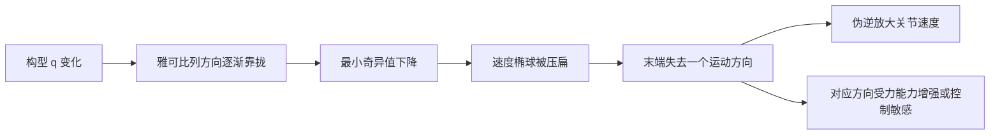
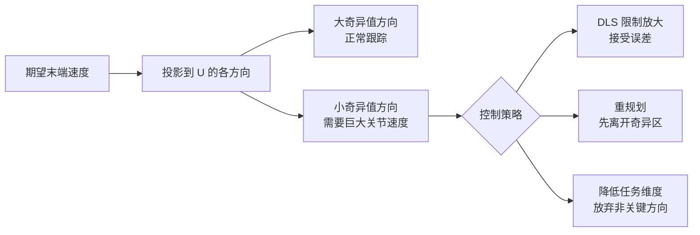

# 机器人奇异性、速度椭球与可操作度

> **一句话**：机器人奇异性不是“某个算法突然坏了”，而是当前构型让一个或多个末端运动方向真实地消失了。奇异值分解能找出正在消失的方向，速度椭球把它画出来，可操作度和条件数则把风险压缩成可监控的数值。

**知识链接**：
- [雅可比矩阵与微分运动学](/前置知识/003b_前置知识_雅可比矩阵与微分运动学)（上游：关节速度到末端速度）
- [矩阵伪逆与最小二乘](/前置知识/003d_前置知识_矩阵伪逆与最小二乘)（上游：SVD、伪逆与阻尼）
- [螺旋理论、Twist 与 SE(3) 指数映射](/前置知识/008a_前置知识_螺旋理论Twist与SE3指数映射)（上游：雅可比每一列的物理含义）
- [逆运动学深度解析](/系列/ik_deep_dive/)（下游：DLS、约束 IK 与工程求解）
- [机器人静力学、虚功与雅可比转置](/前置知识/008f_前置知识_机器人静力学虚功与雅可比转置)（下游：奇异性对受力能力的影响）

---

## 贯穿全文的例子

仍用两根连杆的平面机械臂。手臂弯曲时，肩和肘的转动能组合出末端平面内任意小方向的速度；手臂完全伸直时，两个关节的瞬时作用几乎都只让末端横向摆动，无法在伸直方向上继续向外移动。

这时并不是控制频率不够，也不是逆运动学（Inverse Kinematics, IK）代码精度差，而是机器人几何结构在当前姿态下少了一个独立方向。任何要求“末端继续沿手臂方向前进”的控制器，都只能在三个结果中选择：产生巨大关节速度、接受末端误差，或先改变构型再继续任务。


> 左图把单位关节速度映射成末端速度椭球：手臂弯曲时椭球有面积，接近伸直时压成细线。右图显示最小奇异值连续降到零，因此“接近奇异”是一个可提前监测的过程，不是只在零点发生的开关事件。

## 一 奇异性的物理定义

[雅可比矩阵](/前置知识/003b_前置知识_雅可比矩阵与微分运动学)把关节速度映射成末端空间速度，写成行内形式就是 $\dot{\mathbf x}=J(\mathbf q)\dot{\mathbf q}$。雅可比的每一列代表“只让某一个关节以单位速度运动时，末端会产生哪种瞬时运动”。

如果这些列在当前构型下变得线性相关，多个关节实际上在重复制造同一种末端运动，雅可比的秩就会降低。任务空间中因此出现至少一个无法由任何有限关节速度产生的方向，这就是**运动学奇异性（kinematic singularity）**。



需要区分三类常被混叫为“奇异”的问题：

| 类型 | 真正退化的对象 | 例子 | 换表示能否消除 |
|---|---|---|---|
| 机器人运动学奇异性 | 机构的雅可比 | 二连杆完全伸直 | 不能，只能换构型或任务 |
| 姿态表示奇异性 | 坐标参数化 | 欧拉角万向锁 | 能，改用四元数或旋转矩阵 |
| 数值病态 | 有限精度下的矩阵求解 | 最小奇异值很小但非零 | 可用阻尼缓解，但物理方向仍弱 |

## 二 SVD 把“哪个方向坏了”拆出来

只看行列式能判断方阵是否在精确奇异点，却不能稳定地告诉我们“哪个方向正在退化”“离奇异还有多远”，也不适用于非方阵。更通用的工具是奇异值分解（Singular Value Decomposition, SVD）：

$$
J=U\Sigma V^T
$$

**这个公式在做什么**：把雅可比拆成“关节空间选方向、按奇异值缩放、任务空间旋转方向”三步，从而逐一看到每个独立运动通道的方向和强弱。

::: details 📐 公式详解（点击展开）

| 子表达式 | 它是谁 | 它在干嘛 |
|---------|--------|---------|
| $V^T$ | **关节方向选择器** | 把普通关节速度改写成一组互相正交的协同运动模式 |
| $\Sigma$ | **各通道变速箱** | 对第 $i$ 个模式乘奇异值 $\sigma_i$；数值越小，同样关节速度产生的末端速度越弱 |
| $U$ | **末端方向标尺** | 给出每个通道在任务空间对应的正交方向 |
| $J$ | **完整速度映射** | 把三步重新组合成原来的雅可比 |

**用人话读**：“先找出机器人最自然的几种关节协同方式，再看每种方式能把末端沿哪个方向推动多快。”

**为什么是这个形式**：正交方向之间不会互相污染，缩放强弱集中在一条对角线上。奇异值为零时，对应关节模式无论怎样放大都不能产生那个独立末端方向；接近零时，反求速度会被大幅放大。
:::

对满任务维度的机械臂，最小奇异值 $\sigma_{\min}$ 是最直接的安全指标：它代表最弱方向上的速度传递倍率。最大奇异值 $\sigma_{\max}$ 代表最强方向。二者比值形成条件数 $\kappa=\sigma_{\max}/\sigma_{\min}$；越大说明各方向能力越不均衡，伪逆对噪声越敏感。

一个重要细节是量纲。六维几何雅可比同时包含米每秒和弧度每秒，直接比较其奇异值等于默认“一米平移”和“一弧度旋转”同等重要。工程中应根据任务设置特征长度或权重，把位置和姿态误差缩放到可比较范围，否则阈值没有统一物理意义。

## 三 速度椭球把方向性画出来

假设所有允许的关节速度满足单位球约束，也就是“关节速度总量固定”。这些关节速度经过雅可比映射后，在任务空间形成一个椭球。二维情况下就是图中的椭圆：

$$
\dot{\mathbf x}^{T}(JJ^{T})^{-1}\dot{\mathbf x}=1
$$

**这个公式在做什么**：描述单位关节速度预算在末端空间中能达到的速度边界；椭球长轴是容易运动的方向，短轴是困难运动的方向。

::: details 📐 公式详解（点击展开）

| 子表达式 | 它是谁 | 它在干嘛 |
|---------|--------|---------|
| $JJ^T$ | **任务空间能力矩阵** | 汇总所有关节列向量在各末端方向上的共同贡献 |
| $(JJ^T)^{-1}$ | **困难方向放大镜** | 能力弱的方向在逆矩阵中权重更大，因此更快触及边界 |
| $\dot{\mathbf x}$ | **候选末端速度** | 检查这个速度是否正好用完单位关节速度预算 |
| 等号右侧的 $1$ | **固定预算边界** | 小于一在椭球内部，可由更小关节速度实现；大于一超出预算 |

**用人话读**：“把关节速度总量限制住，所有能产生的末端速度端点连起来，就是这只椭球。”

**为什么是这个形式**：SVD 中的任务空间方向 $U$ 成为椭球主轴，轴长正好是各奇异值。最小奇异值趋近零时，一条轴缩到零，椭球从有体积的区域退化成平面、线或点。
:::

速度椭球比单一分数提供更多信息。两个构型可能有相同可操作度，但一个主要缺少竖直能力，另一个主要缺少水平能力；如果任务只要求水平方向，它们的实际风险完全不同。因此规划器做快速筛选可用标量，最终控制和诊断最好保留奇异向量与椭球方向。

## 四 可操作度、最小奇异值和条件数怎么选

Yoshikawa 可操作度把速度椭球的体积压缩成一个数：

$$
w(\mathbf q)=\sqrt{\det\!\left(JJ^T\right)}=\prod_i\sigma_i
$$

**这个公式在做什么**：用所有奇异值的乘积衡量机器人在当前构型下总体的多方向运动能力；任何一个方向完全消失，结果都会变成零。

::: details 📐 公式详解（点击展开）

| 子表达式 | 它是谁 | 它在干嘛 |
|---------|--------|---------|
| $JJ^T$ | **速度椭球形状矩阵** | 决定任务空间中各主方向与轴长 |
| $\det(JJ^T)$ | **平方体积因子** | 等于所有非零奇异值平方的乘积 |
| 平方根 | **还原体积尺度** | 把平方乘积恢复成奇异值直接乘积 |
| $\prod_i\sigma_i$ | **所有方向的合成评分** | 任一因子接近零都会拉低总分 |

**用人话读**：“把机器人沿所有独立方向的运动倍率乘起来，得到速度椭球体积的比例评分。”

**为什么是这个形式**：只监测最弱方向会忽略整体能力，体积则同时纳入所有方向；代价是它把方向信息和最差通道的具体大小隐藏了，所以不能单独用于所有安全判断。
:::

| 指标 | 回答的问题 | 优点 | 局限 |
|---|---|---|---|
| $\sigma_{\min}$ | 最弱方向还剩多少能力 | 直接对应伪逆最大放大 | 不反映其他方向 |
| 条件数 $\kappa$ | 强弱方向差多少倍 | 适合判断数值敏感性 | 整体缩放会被约掉 |
| 可操作度 $w$ | 速度椭球总体积多大 | 连续、适合优化目标 | 量纲与机器人尺度相关，隐藏方向 |
| 任务加权指标 | 当前任务关心方向是否安全 | 与实际目标一致 | 需要提前定义任务权重 |

没有跨机器人的万能阈值。一个 20 厘米小臂和两米工业臂的雅可比尺度不同；位置与姿态权重不同也会改变奇异值。合理流程是先做量纲归一化，再从正常工作区采集指标分布，最后结合速度、力矩上限确定警戒线。

## 五 为什么伪逆在奇异附近会爆炸

伪逆会把非零奇异值取倒数。某个任务速度若沿最弱方向含有分量，就需要除以很小的 $\sigma_{\min}$，于是关节速度急剧增大。传感噪声和离散控制误差也会被同样放大，表现为关节抖动、速度饱和、末端跟踪反而变差。

阻尼最小二乘（Damped Least Squares, DLS）不会恢复已经消失的物理方向。它做的是在精度与关节速度之间折中：最弱方向太危险时，宁可留下部分末端误差也不输出无限大的速度。完整推导与实现见[雅可比迭代法 IK](/系列/ik_deep_dive/03_雅可比迭代法IK)。



## 六 四类奇异构型

对六自由度串联机械臂，常见奇异性可以从机构部位理解，而不必只背行列式：

| 类型 | 典型几何状态 | 丢失的能力 | 常见处理 |
|---|---|---|---|
| 肩部奇异 | 腕部中心落到第一关节轴附近 | 基座旋转难以改变腕部位置 | 改变接近方向或肘部构型 |
| 肘部奇异 | 手臂完全伸直或折叠 | 沿臂方向的瞬时位置能力 | 规划时保持肘部弯曲裕量 |
| 腕部奇异 | 球腕两根旋转轴重合 | 两个姿态自由度无法独立分配 | 联合调整腕前关节，或用 DLS 穿越 |
| 边界奇异 | 到达工作空间边缘 | 向外方向不可达 | 降低目标、移动基座或重新抓取 |

冗余机器人自由度多于任务维度，并不代表没有奇异性。冗余只提供零空间，可以在不改变末端任务的前提下调整肘部或躯干。合理的二级目标是沿可操作度梯度移动、避开关节限位和碰撞；但如果零空间也被其他约束耗尽，仍可能被迫接近奇异区域。

## 七 工程诊断代码

下面这段代码只做诊断，不直接输出控制命令。它对经过任务尺度归一化的雅可比做 SVD，同时返回最小奇异值、条件数和对数可操作度；使用对数是为了避免高维奇异值乘积上溢或下溢。真正接入控制器时，应记录这些指标与速度饱和事件的时间序列，而不是只在失败后打印一次。

```python
import numpy as np


def singularity_metrics(jacobian, eps=1e-9):
    """返回奇异值、最弱方向、条件数和稳定的对数可操作度。"""
    u, singular_values, vt = np.linalg.svd(jacobian, full_matrices=False)
    sigma_min = singular_values[-1]
    sigma_max = singular_values[0]
    condition = sigma_max / max(sigma_min, eps)
    log_manipulability = np.log(np.maximum(singular_values, eps)).sum()
    weakest_task_direction = u[:, -1]
    return {
        "singular_values": singular_values,
        "sigma_min": sigma_min,
        "condition": condition,
        "log_manipulability": log_manipulability,
        "weakest_task_direction": weakest_task_direction,
    }
```

`weakest_task_direction` 比一个红黄绿告警灯更有诊断价值：它能告诉上层规划器“现在最难的是末端向哪个方向运动”。例如最弱方向主要是绕工具轴旋转，而当前任务只要求位置跟踪，那么可以临时降低该姿态维度的权重，而不必让整个任务停止。

## 八 从规划到控制的处理顺序

1. **建模阶段**：验证雅可比坐标系、线速度/角速度排列和单位缩放；错误雅可比会制造“假奇异”。
2. **离线规划阶段**：沿轨迹采样 $\sigma_{\min}$、关节限位和碰撞距离，不只检查路径点是否可达。
3. **在线控制阶段**：接近警戒线时连续增大阻尼、限制关节速度，并把未实现的任务速度反馈给上层。
4. **冗余利用阶段**：用零空间目标提升最小奇异值，同时兼顾限位与碰撞。
5. **任务重构阶段**：若物理方向已经消失，降低任务维度、改变接近方向、移动底座或重新规划；继续放大增益没有意义。

控制器必须同时考虑执行器力矩和速度上限。即使 $\sigma_{\min}$ 尚未非常小，高速运动、重载或柔性传动也可能提前触发实际极限。奇异性指标是几何风险，不是整机安全的唯一依据。

## 九 总结

1. 运动学奇异性是雅可比秩降低造成的真实自由度损失，不能靠换姿态表示消除。
2. SVD 同时给出任务空间方向、关节协同方向和传递倍率；最小奇异值描述最弱通道。
3. 速度椭球把单位关节速度预算映射到任务空间，椭球压扁就是某个方向正在消失。
4. 可操作度适合做总体优化，最小奇异值适合监测最差方向，条件数适合判断数值敏感性；三者应结合使用。
5. DLS 只能限制伪逆放大，不能创造失去的方向；最终解决方案通常是换构型、改任务或重规划。

## 延伸阅读

- [雅可比矩阵与微分运动学](/前置知识/003b_前置知识_雅可比矩阵与微分运动学) — 速度映射、零空间与基础可操作度
- [矩阵伪逆与最小二乘](/前置知识/003d_前置知识_矩阵伪逆与最小二乘) — SVD 伪逆为什么放大小奇异值
- [雅可比迭代法 IK](/系列/ik_deep_dive/03_雅可比迭代法IK) — DLS、自适应阻尼和迭代控制实战
- [机器人静力学、虚功与雅可比转置](/前置知识/008f_前置知识_机器人静力学虚功与雅可比转置) — 同一雅可比如何把末端力映射到关节力矩

