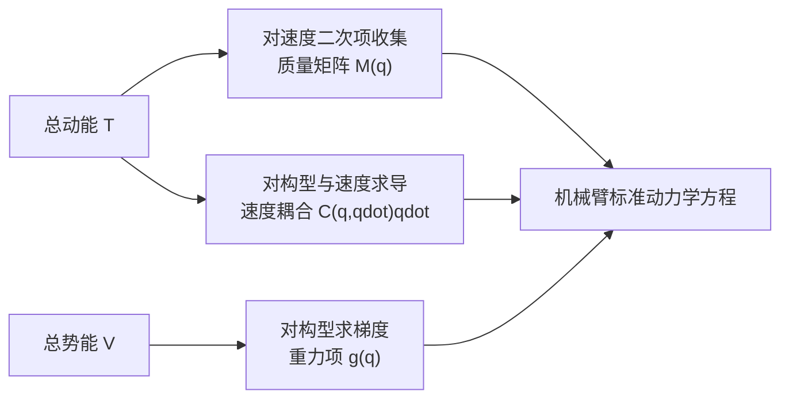

# 拉格朗日力学与欧拉-拉格朗日方程

> **一句话**：牛顿-欧拉方法逐个刚体画受力图，拉格朗日方法则先用最少的广义坐标描述整个机构，再从动能与势能自动得到运动方程。对于带关节约束的机器人，它通常更适合手工推导和理解机械臂动力学结构。

**知识链接**：
- [刚体动力学：牛顿-欧拉方程与惯性张量](/前置知识/006b_前置知识_刚体动力学_牛顿欧拉方程与惯性张量)（上游：单个刚体的力、力矩与惯性）
- [常微分方程 ODE 直觉与数值求解](/前置知识/001b_前置知识_常微分方程ODE直觉与数值求解)（上游：从微分方程推进状态）
- [物理仿真数值积分：辛积分与能量稳定性](/前置知识/006c_前置知识_物理仿真数值积分_辛积分与能量稳定性)（下游：离散时间求解）
- [机械臂动力学方程：M、C、g 到关节力矩](/前置知识/008d_前置知识_机械臂动力学方程M_C_g与关节力矩)（下游：多关节机器人的标准形式）

---

## 贯穿全文的例子

先用最小的机器人机构：长度为 $l$、末端质量为 $m$ 的单摆。它也可以看成只有一个旋转关节的机械臂。若用牛顿法，需要分析重力、杆约束力、切向加速度，再把不影响转动的约束力消掉；若用拉格朗日方法，只选摆角 $q$ 作为广义坐标，写出动能和势能，约束力自然不会进入最终方程。

之后把同样流程扩展到二关节机械臂：广义坐标从一个角度变成 $\mathbf q=[q_1,q_2]^T$，动能会出现关节速度交叉项，势能会同时依赖两个角度，但建模步骤不变。


## 一 结论先行：它省掉了什么

机械臂的关节把相邻连杆限制在特定相对运动上。若把每根三维刚体都用位置和姿态描述，系统变量很多，还要显式求关节内部约束力。广义坐标（generalized coordinates）直接选取系统真正独立的自由度，例如每个旋转关节一个角度、每个移动关节一个位移。

对固定基座的七轴机械臂，$\mathbf q\in\mathbb R^7$ 已经满足关节连接关系。肩轴承内部承受多大的径向力，通常不是求关节加速度所必需的未知量；拉格朗日方法因此绕过这些内部约束力，只保留会对广义坐标做功的力矩。

这套方法最适合三个目的：

1. 手工推导小型机构，清楚看到惯性、耦合和重力项从哪里来。
2. 验证机器人动力学库输出是否符合能量与对称性。
3. 构造可微动力学、参数辨识和基于模型的控制目标。

它不一定是大型树状机器人上计算最快的算法。实际求逆动力学时，递归牛顿-欧拉算法往往更高效；两者描述的是同一物理系统，只是推导和计算路径不同。

## 二 广义坐标不是普通笛卡尔坐标

“广义”表示坐标可以是角度、长度，甚至描述机构形状的其他独立参数。选择应满足两个条件：数量等于系统自由度，并且给定这些坐标后，所有刚体的位置与姿态都能由运动学唯一计算。

| 系统 | 合理的广义坐标 | 被自动满足的约束 |
|---|---|---|
| 单摆 | 一个摆角 $q$ | 质点始终距铰点 $l$ |
| 二连杆机械臂 | 两个关节角 $q_1,q_2$ | 连杆长度不变、关节端点相连 |
| 移动底盘 | 平面位置与航向，或轮角 | 取决于是否显式建模无侧滑约束 |
| 浮动基座机器人 | 基座位姿加关节坐标 | 基座不再固定，姿态需用无奇异表示处理 |

坐标选得越贴近机构自由度，方程变量越少；但有些约束无法通过简单坐标完全消除。例如轮式机器人的无侧滑约束限制速度而非位置，属于非完整约束，通常还需拉格朗日乘子或专门的约束动力学方法。本文先聚焦普通串联机械臂的完整关节坐标。

## 三 拉格朗日量把能量组织起来

拉格朗日方法先计算系统总动能 $T$ 与总势能 $V$，再定义拉格朗日量：

$$
L(\mathbf q,\dot{\mathbf q})=T(\mathbf q,\dot{\mathbf q})-V(\mathbf q)
$$

**这个公式在做什么**：把运动产生的动能和构型储存的势能组织成一个标量函数，后续对它求导就能得到系统的惯性项与保守力项。

::: details 📐 公式详解（点击展开）

| 子表达式 | 它是谁 | 它在干嘛 |
|---------|--------|---------|
| $T(\mathbf q,\dot{\mathbf q})$ | **运动账本** | 汇总所有连杆平移和转动的动能；既依赖构型，也依赖关节速度 |
| $V(\mathbf q)$ | **储能账本** | 记录重力、弹簧等保守作用随构型储存的能量 |
| $T-V$ | **动力学生成函数** | 让动能变化与势能梯度以正确符号进入运动方程 |
| $L$ | **整机能量摘要** | 一个标量，却包含全部自由度的耦合信息 |

**用人话读**：“先把机器人当前因运动拥有的能量减去因姿态储存的能量，得到一份可以生成运动方程的总账。”

**为什么是这个形式**：保守系统真实轨迹使作用量驻值，变分后恰好得到惯性与势能力之间的平衡。对入门使用而言，可以把 $T-V$ 视为一条可靠的建模规则；负号保证物体会沿势能降低方向运动。
:::


> 左图中重力矩对应势能曲线的负斜率：势能越陡，回复力矩越大；最低点斜率为零。右图中动能和势能周期交换，而总能量近似保持，直接展示了拉格朗日建模所依赖的能量结构。

单摆最低点取势能零点时，势能可写成行内形式 $V=mgl(1-\cos q)$；质点速度大小为 $l\dot q$，因此动能是 $T=\frac12ml^2\dot q^2$。势能零点可任意平移，因为动力学只使用它对构型的导数；给 $V$ 整体加一个常数不会改变运动。

对真实连杆，不能把质量全放在末端。每根连杆的动能都包含质心线速度与绕质心角速度两部分，后者要用[惯性张量](/前置知识/006b_前置知识_刚体动力学_牛顿欧拉方程与惯性张量)。各连杆速度由正运动学或雅可比从 $\dot{\mathbf q}$ 得到，最后把所有连杆能量相加。

## 四 欧拉-拉格朗日方程把能量变成运动

对第 $i$ 个广义坐标，欧拉-拉格朗日方程写成：

$$
\frac{d}{dt}\left(\frac{\partial L}{\partial \dot q_i}\right)-\frac{\partial L}{\partial q_i}=Q_i
$$

**这个公式在做什么**：从能量函数中提取第 $i$ 个自由度的惯性响应和保守力，再令它们与外部施加的非保守广义力平衡。

::: details 📐 公式详解（点击展开）

| 子表达式 | 它是谁 | 它在干嘛 |
|---------|--------|---------|
| $\partial L/\partial\dot q_i$ | **广义动量** | 衡量拉格朗日量对第 $i$ 个速度的敏感度，多自由度时会包含其他关节速度 |
| $d/dt(\partial L/\partial\dot q_i)$ | **动量变化率** | 产生加速度项和随构型变化的速度耦合项 |
| $\partial L/\partial q_i$ | **构型梯度** | 提取势能力与惯性随姿态变化带来的贡献 |
| $Q_i$ | **外部广义驱动** | 对旋转关节通常是电机力矩，对移动关节通常是驱动力；也可包含摩擦和接触的等效贡献 |

**用人话读**：“第 $i$ 个关节的动量怎样变化，减去能量地形对这个关节的推动，必须等于外部真正施加在它上面的驱动力。”

**为什么是这个形式**：它把牛顿第二定律推广到任意广义坐标。若坐标就是直线位置且动能为质量乘速度平方的一半，左侧会直接退化成质量乘加速度加势能梯度。
:::

这里的偏导与时间导数分工不同。$\partial L/\partial\dot q_i$ 暂时把 $\mathbf q$ 和其他速度视为独立变量；随后总时间导数必须考虑它们都随时间变化。这一步会自然产生多关节系统中的科里奥利与离心型速度项，也是手工推导最容易漏项的地方。

期望用自动微分实现时，也不能把“对速度求偏导后再沿轨迹求时间导数”误写成普通一次梯度。需要计算混合二阶导，或先用能量构造质量矩阵与势能梯度，再采用成熟刚体动力学算法。

## 五 完整推一次单摆

把上一节的单摆能量代入欧拉-拉格朗日方程。对速度求偏导再对时间求导得到 $ml^2\ddot q$；对角度求偏导得到 $-mgl\sin q$。若关节电机施加力矩 $\tau$，最终方程是：

$$
ml^2\ddot q+mgl\sin q=\tau
$$

**这个公式在做什么**：说明电机力矩要同时负责改变摆杆角速度和抵抗重力；不给电机力矩时，重力会把摆杆拉回最低势能位置。

::: details 📐 公式详解（点击展开）

| 子表达式 | 它是谁 | 它在干嘛 |
|---------|--------|---------|
| $ml^2\ddot q$ | **惯性账单** | 角加速度越大、质量越重、摆长越长，需要的力矩越大 |
| $mgl\sin q$ | **重力账单** | 是势能对角度的梯度；水平附近最大，最低点和倒立点为零 |
| $\tau$ | **电机付款** | 外部施加的关节力矩，用来支付惯性与重力两项 |

**用人话读**：“电机输出的力矩，一部分用来让摆杆加速，另一部分用来顶住当前姿态下的重力。”

**为什么是这个形式**：动能对速度的二次依赖产生质量乘角加速度，重力势能的余弦形状求导产生正弦回复力矩。两项相加正是绕铰点写牛顿-欧拉力矩平衡的同一结果。
:::

在最低点附近角度很小时，可用 $\sin q\approx q$ 得到线性模型；但机械臂大范围运动时不能长期使用这个近似。倒立平衡点附近同样能线性化，只是重力刚度符号相反，开环会不稳定。

## 六 扩展到二关节机械臂会多出什么

二连杆系统仍然只做“位置速度、能量、求导”三步，但结构明显丰富：

- 第一根连杆运动会带动第二根连杆，因此总动能含 $\dot q_1\dot q_2$ 交叉项。
- 第二根连杆的质心位置依赖 $q_1+q_2$，所以重力势能同时耦合两个关节。
- 对交叉动能求时间导数会产生与速度平方和速度乘积有关的项。
- 每个关节加速度前的系数会随 $q_2$ 改变，组合成构型相关的质量矩阵。



这正是下一篇[机械臂动力学方程](/前置知识/008d_前置知识_机械臂动力学方程M_C_g与关节力矩)中的 $M$、$C$、$g$ 三类项。它们不是人为硬拆出来的修正系数，而是总动能和总势能经过欧拉-拉格朗日方程后自然出现的结构。

## 七 数值实验代码

为了验证“能量交换而总能量近似不变”，下面用半隐式 Euler 积分无驱动单摆。代码先用当前角度计算重力角加速度，更新速度后再更新角度；这种顺序比显式 Euler 更适合长期观察保守系统。它仍是离散近似，步长过大时依然会产生误差。

```python
import numpy as np


def simulate_pendulum(theta0, omega0, dt=0.002, duration=8.0):
    gravity, length = 9.81, 1.0
    steps = int(duration / dt)
    theta = np.empty(steps + 1)
    omega = np.empty(steps + 1)
    theta[0], omega[0] = theta0, omega0

    for k in range(steps):
        acceleration = -(gravity / length) * np.sin(theta[k])
        omega[k + 1] = omega[k] + dt * acceleration
        theta[k + 1] = theta[k] + dt * omega[k + 1]
    return theta, omega


theta, omega = simulate_pendulum(np.deg2rad(70), 0.0)
kinetic = 0.5 * omega**2
potential = 9.81 * (1.0 - np.cos(theta))
print("maximum energy deviation:", np.max(np.abs(kinetic + potential - (kinetic[0] + potential[0]))))
```

若把更新顺序改成先用旧速度更新角度，再更新速度，总能量通常会系统性漂移。这个实验同时检验两件事：连续动力学方程是否正确，以及选择的数值积分器是否尊重连续系统的能量结构。两者不能混为一谈。

## 八 建模工作流与验证

1. **确定自由度与坐标约定**：角度零点、正方向、固定基座还是浮动基座必须写清。
2. **从 URDF 或 CAD 核对惯性参数**：质量、质心和惯性张量必须处于一致坐标系，单位统一为 SI。
3. **用运动学得到各质心速度**：不要只计算末端；每根连杆都贡献动能和势能。
4. **构造总能量并求导**：小系统可用符号工具，真实机器人优先使用 Pinocchio、RBDL、MuJoCo 等经过验证的实现。
5. **做极端构型检查**：水平姿态的重力矩应大，质心位于关节轴正下方时对应重力矩应为零。
6. **做能量与数值差分检查**：无摩擦无外力时，连续模型应守恒；模拟漂移要继续区分模型误差与积分误差。

## 九 总结

1. 广义坐标只保留系统独立自由度，能自动消去许多关节内部约束力。
2. 拉格朗日量用动能减势能组织整机信息；欧拉-拉格朗日方程把它转成每个自由度的运动方程。
3. 单摆中的惯性项与重力项，扩展到多关节系统后变成质量矩阵、速度耦合项和重力向量。
4. 拉格朗日方法适合理解与推导，递归牛顿-欧拉方法更适合大型机构的高效数值计算；两者物理等价。
5. 动力学模型和数值积分器必须分别验证，正确连续方程配上不合适的积分仍会产生错误轨迹。

## 延伸阅读

- [刚体动力学：牛顿-欧拉方程与惯性张量](/前置知识/006b_前置知识_刚体动力学_牛顿欧拉方程与惯性张量) — 从逐刚体受力角度理解同一物理
- [机械臂动力学方程：M、C、g 到关节力矩](/前置知识/008d_前置知识_机械臂动力学方程M_C_g与关节力矩) — 多关节结果的标准工程形式
- [物理仿真数值积分：辛积分与能量稳定性](/前置知识/006c_前置知识_物理仿真数值积分_辛积分与能量稳定性) — 连续动力学如何可靠地推进到下一帧

