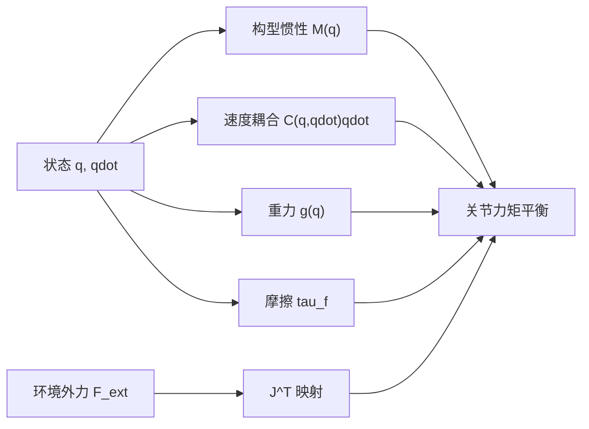

# 机械臂动力学方程：M、C、g 与关节力矩

> **一句话**：机械臂某一时刻需要的电机力矩，不只是“质量乘加速度”。它还要支付构型相关的惯性、关节运动引起的速度耦合、重力、摩擦，并与环境接触力共同平衡；标准动力学方程就是这份力矩账单。

**知识链接**：
- [拉格朗日力学与欧拉-拉格朗日方程](/前置知识/008c_前置知识_拉格朗日力学与欧拉拉格朗日方程)（上游：这些项从能量怎样产生）
- [刚体动力学：牛顿-欧拉方程与惯性张量](/前置知识/006b_前置知识_刚体动力学_牛顿欧拉方程与惯性张量)（上游：单连杆惯性）
- [雅可比矩阵与微分运动学](/前置知识/003b_前置知识_雅可比矩阵与微分运动学)（上游：关节速度与末端速度）
- [正动力学、逆动力学与递归刚体算法](/前置知识/008e_前置知识_正动力学逆动力学与递归刚体算法)（下游：如何高效计算）
- [机器人静力学、虚功与雅可比转置](/前置知识/008f_前置知识_机器人静力学虚功与雅可比转置)（下游：外力如何进入关节）

---

## 贯穿全文的例子

仍然考虑二关节平面机械臂，但这次给第二根连杆末端装上负载，并要求末端沿一段平滑轨迹运动。即使某一时刻两个关节角加速度都为零，电机力矩也未必为零：机械臂可能需要抵抗重力，运动中的连杆可能通过速度耦合继续拉扯其他关节，末端还可能顶着桌面。

反过来，同样的电机力矩在手臂伸直和折叠时会产生不同加速度，因为质量相对关节轴的分布变了。机器人动力学的核心不是一个常数质量，而是一个随构型变化、同时耦合所有关节的质量矩阵。



## 一 先看完整标准方程

固定基座、$n$ 个驱动关节的机械臂常写成：

$$
M(\mathbf q)\ddot{\mathbf q}+C(\mathbf q,\dot{\mathbf q})\dot{\mathbf q}+\mathbf g(\mathbf q)+\boldsymbol\tau_f
=\boldsymbol\tau+J(\mathbf q)^T\mathbf F_{\mathrm{ext}}
$$

**这个公式在做什么**：把机器人内部需要支付的惯性、速度耦合、重力和摩擦力矩，与电机及环境施加到机器人上的广义力矩放在同一张平衡表里。

::: details 📐 公式详解（点击展开）

| 子表达式 | 它是谁 | 它在干嘛 |
|---------|--------|---------|
| $M(\mathbf q)\ddot{\mathbf q}$ | **加速账单** | 当前构型下要获得指定关节加速度所需的惯性力矩，所有关节可能互相耦合 |
| $C(\mathbf q,\dot{\mathbf q})\dot{\mathbf q}$ | **运动耦合账单** | 连杆已经运动时出现的离心与科里奥利型力矩；通常随速度平方增长 |
| $\mathbf g(\mathbf q)$ | **托住自身的账单** | 抵抗各连杆与负载重力所需的关节力矩 |
| $\boldsymbol\tau_f$ | **传动损耗账单** | 关节摩擦、黏性阻尼、密封阻力等非理想作用 |
| $\boldsymbol\tau$ | **电机提供的力矩** | 驱动器通过减速器传到关节侧的控制输入 |
| $J^T\mathbf F_{\mathrm{ext}}$ | **环境代付或施压** | 把环境作用在末端的力/力矩转换成等效关节力矩；符号取决于外力方向约定 |

**用人话读**：“机器人要怎样加速、当前运动会带来什么额外拉扯、要托住多少重量、传动损失多少，这些需求必须由电机和环境外力共同承担。”

**为什么是这个形式**：多刚体的牛顿-欧拉平衡或欧拉-拉格朗日方程收集同类项后都会得到这一结构。左侧按物理原因拆账，右侧列主动驱动与外界作用，便于控制、仿真和参数辨识分别调用。
:::

本文约定 $\mathbf F_{\mathrm{ext}}$ 是“环境施加给机器人”的末端扳手（wrench，即三维力与三维力矩组成的六维量），因此写在电机同侧。若库把接触力定义成“机器人施加给环境”，该项符号会相反。公式外形相同不代表接口约定相同，接入传感器前应做静态推压测试确认符号。

## 二 质量矩阵 M 不是常数质量

质量矩阵 $M(\mathbf q)\in\mathbb R^{n\times n}$ 描述关节加速度如何共同产生惯性力矩。它随构型变化，是因为关节转动会改变各连杆质量相对所有上游关节轴的距离和方向。

系统总动能可以写成质量矩阵的二次型：

$$
T=\frac{1}{2}\dot{\mathbf q}^{T}M(\mathbf q)\dot{\mathbf q}
$$

**这个公式在做什么**：用一个构型相关矩阵汇总所有连杆的平移动能、转动动能和关节间速度交叉项。

::: details 📐 公式详解（点击展开）

| 子表达式 | 它是谁 | 它在干嘛 |
|---------|--------|---------|
| $\dot{\mathbf q}$ | **所有关节速度** | 指定机器人此刻每个独立自由度运动多快 |
| $M(\mathbf q)$ | **整机惯性度量** | 对角项描述单关节速度代价，非对角项描述两个关节同时运动时的耦合 |
| $\dot{\mathbf q}^{T}M\dot{\mathbf q}$ | **速度的惯性能量评分** | 将关节速度组合映射成整机总动能的两倍 |
| 系数 $1/2$ | **二次能量比例** | 与单质点动能“质量乘速度平方的一半”一致 |

**用人话读**：“把当前各关节速度放进一把会随姿态变化的惯性尺子，量出的就是整台机器人因运动拥有的能量。”

**为什么是这个形式**：每根连杆速度都是关节速度的线性组合，而动能对刚体速度是二次的；把所有连杆二次项相加后，必然能整理成这个矩阵二次型。
:::

物理正确的质量矩阵具有三个重要性质：对称、正定，并在无质量为零的退化模型下可逆。对称意味着关节一加速对关节二造成的惯性耦合，与关节二加速对关节一的对应耦合一致；正定意味着任何非零关节速度都具有正动能。

对二连杆机械臂，$M_{11}$ 通常在手臂伸直时较大，因为第二根连杆和负载离肩轴更远；折叠后较小。$M_{12}$ 可以随肘角改变符号，表示两个关节同向或反向加速时会互相助力或抵消。$M_{22}$ 若第二连杆质量分布相对肘轴不变，则可能保持常数。

## 三 C 乘 qdot 是速度造成的耦合

$C(\mathbf q,\dot{\mathbf q})\dot{\mathbf q}$ 常被统称为科里奥利/离心项。重点是整个向量，而不是某一个唯一的 $C$ 矩阵：不同推导可选择不同矩阵元素，只要乘上 $\dot{\mathbf q}$ 后得到相同的偏置力矩即可。

直觉上，肩关节高速转动时，肘部质量在绕肩做圆周运动；若肘角同时变化，质心到肩轴的距离也在变，两个关节便会出现速度相关的互相拉扯。该项对速度是二次量级：整条轨迹速度放大两倍时，它大致放大四倍，因此低速示教中可能很小，高速甩臂时却不能忽略。


> 左图显示一段慢速轨迹中重力占主导，但惯性和速度项仍改变总力矩；不能据此认为速度项总是可忽略。右图显示质量矩阵系数随肘角变化，尤其是肩部惯性和关节耦合并非常数。

动力学库经常直接提供非线性偏置项 $\mathbf h(\mathbf q,\dot{\mathbf q})=C\dot{\mathbf q}+\mathbf g$，而不单独返回 $C$。这是合理接口，因为控制和正动力学真正需要的是乘积结果，显式构造整个 $C$ 矩阵既容易引入约定差异，也可能浪费计算。

## 四 g 是构型相关的重力力矩

重力向量 $\mathbf g(\mathbf q)$ 是总重力势能对关节坐标的梯度。它与速度、加速度无关，只由构型、质量、质心和重力方向决定。机械臂静止悬空时，如果没有接触和摩擦，保持姿态所需电机力矩就是 $\mathbf g(\mathbf q)$。

几个快速直觉检查：

- 连杆质心位于关节轴正下方时，该连杆对这个轴的重力力臂为零。
- 水平伸展通常产生最大重力矩，且上游关节承担所有下游质量。
- 增加末端负载会同时改变重力向量和质量矩阵，不能只在控制器里加一个常数力矩。
- 重力方向应从世界坐标转换到模型约定；机器人倒装后仍沿原方向补偿，说明坐标系配置错了。

“重力补偿”只是发送 $\boldsymbol\tau=\mathbf g(\mathbf q)$，它让理想模型中的机器人在任意姿态无加速度，并不自动提供位置稳定性。真实系统存在模型误差、摩擦和外力，还需要反馈项稳定位置或速度。

## 五 摩擦为何单独列出

理想刚体能量模型不会自然产生关节摩擦。工程中常见三类：与速度近似成正比的黏性摩擦、方向改变时近似常幅值的库仑摩擦、低速启动力矩更大的静摩擦。齿轮间隙、钢丝绳弹性和谐波减速器滞回更复杂，不能简单塞进一个平滑函数。

摩擦参数往往需要实验辨识。让关节在不同恒定速度下运动，减去模型计算的重力和惯性力矩，剩余部分可用于拟合黏性与库仑项。低速换向附近数据要单独处理，否则不连续符号函数会让梯度控制和系统辨识很不稳定。

## 六 外力为何乘雅可比转置

末端扳手是任务空间量，电机输出是关节空间量。$J^T$ 的作用是保持瞬时功率一致地完成这个转换：末端力对末端速度做的功率，等于对应关节力矩对关节速度做的功率。详细推导见[机器人静力学、虚功与雅可比转置](/前置知识/008f_前置知识_机器人静力学虚功与雅可比转置)。

同一外力在不同构型下会映射成不同关节力矩，因为雅可比改变了力臂。手臂伸直推墙时，沿手臂轴向的力可能主要形成结构内力而较少产生某些关节力矩；横向力则具有大力臂。奇异构型因此不仅影响速度控制，也改变力传递与接触稳定性。

## 七 方程在四种任务中的读法

| 任务 | 已知 | 要求 | 方程的使用方式 |
|---|---|---|---|
| 逆动力学前馈 | $\mathbf q,\dot{\mathbf q},\ddot{\mathbf q}$ | $\boldsymbol\tau$ | 把左侧各项相加并扣除已知外力 |
| 正动力学仿真 | $\mathbf q,\dot{\mathbf q},\boldsymbol\tau$ | $\ddot{\mathbf q}$ | 先算偏置项，再解质量矩阵线性系统 |
| 重力补偿 | $\mathbf q$，速度和加速度为零 | 保持姿态力矩 | 只取 $\mathbf g(\mathbf q)$ |
| 接触力估计 | 状态与测得电机力矩 | $\mathbf F_{\mathrm{ext}}$ | 先减模型内部力矩，再通过雅可比关系估计 |

这四种用法共享一个模型，但可观测性不同。例如从关节力矩反推六维末端外力，需要雅可比具有足够秩，还要扣除摩擦和模型误差；多个接触点同时存在时，单凭关节力矩通常无法唯一分辨每个接触力。

## 八 工程接口示例

下面代码展示一个推荐的动力学接口形状，而不是重写刚体算法。调用者明确提供状态、目标加速度和外力，函数分别读取质量矩阵、非线性偏置与摩擦，再组合成逆动力学力矩。这样每一项都能单独记录和做回归测试。

```python
import numpy as np


def inverse_dynamics(model, q, qd, qdd_desired, external_wrench=None):
    """根据统一符号约定计算关节侧目标力矩。"""
    mass = model.mass_matrix(q)
    # bias 约定为 C(q, qd) @ qd + g(q)
    bias = model.nonlinear_bias(q, qd)
    friction = model.friction(qd)
    torque = mass @ qdd_desired + bias + friction

    if external_wrench is not None:
        jacobian = model.end_effector_jacobian(q)
        # external_wrench 定义为环境施加给机器人，所以从需求中扣除。
        torque = torque - jacobian.T @ external_wrench
    return torque
```

代码前的符号约定必须和仿真器一致。某些库的 `bias` 含重力，某些只含速度项；某些雅可比按线速度在前，某些按角速度在前。最稳妥的检查是分别在静止水平姿态、零重力高速运动、已知末端外力三个场景中验证每一项。

## 九 模型参数从哪里来

| 参数 | 典型来源 | 常见问题 |
|---|---|---|
| 连杆质量 | CAD、称重 | 末端工具和线缆遗漏 |
| 质心位置 | CAD、摆动辨识 | 坐标系或单位错误 |
| 惯性张量 | CAD、系统辨识 | 未旋转到连杆惯性坐标、非正定 |
| 关节摩擦 | 恒速与换向实验 | 温度和负载依赖 |
| 电机到关节力矩 | 电流常数、减速比、效率 | 把电机侧与关节侧混用 |

URDF 中有惯性参数不代表它们准确。视觉模型的几何网格与碰撞网格通常不能直接替代真实质量分布；低成本机械臂的线缆和减速器摩擦也可能比连杆刚体误差更显著。控制效果不佳时，应先分项看残差随构型、速度和加速度的相关性，再决定校准哪类参数。

## 十 总结

1. 标准机械臂方程把关节力矩需求拆成惯性、速度耦合、重力、摩擦和外部作用。
2. 质量矩阵随构型变化且耦合所有关节；它对称正定，并直接定义系统动能。
3. $C\dot{\mathbf q}$ 是速度相关的整体偏置，不必执着于某个唯一 $C$ 矩阵；高速时它会迅速增大。
4. 重力补偿只抵消理想重力，不等于完整位置控制；负载变化同时影响 $M$ 和 $g$。
5. 雅可比转置把任务空间外力映射到关节力矩，符号和六维分量顺序必须与接口约定一致。

## 延伸阅读

- [拉格朗日力学与欧拉-拉格朗日方程](/前置知识/008c_前置知识_拉格朗日力学与欧拉拉格朗日方程) — $M$、$C$、$g$ 的来源
- [正动力学、逆动力学与递归刚体算法](/前置知识/008e_前置知识_正动力学逆动力学与递归刚体算法) — 如何把标准方程变成实时算法
- [机器人静力学、虚功与雅可比转置](/前置知识/008f_前置知识_机器人静力学虚功与雅可比转置) — 力、力矩、速度和功率的对偶关系
- Featherstone, *Rigid Body Dynamics Algorithms* — 多刚体递归算法的经典参考

