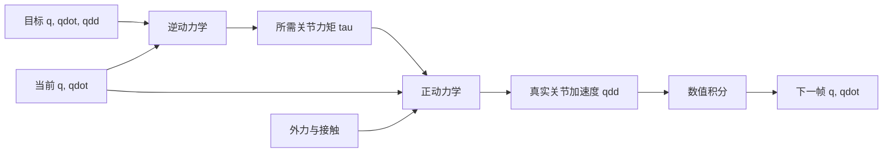
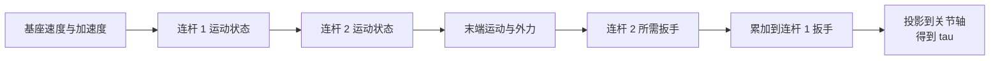
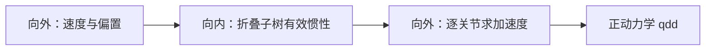

# 正动力学、逆动力学与递归刚体算法

> **一句话**：逆动力学问“想这样加速，需要多大关节力矩”，正动力学问“施加这些力矩，下一刻会怎样加速”。两者使用同一物理模型，但输入输出相反；递归牛顿-欧拉算法和关节体算法利用机器人树结构，把计算从通用稠密矩阵问题变成沿连杆传播的线性复杂度过程。

**知识链接**：
- [机械臂动力学方程：M、C、g 与关节力矩](/前置知识/008d_前置知识_机械臂动力学方程M_C_g与关节力矩)（上游：统一动力学方程）
- [刚体动力学：牛顿-欧拉方程与惯性张量](/前置知识/006b_前置知识_刚体动力学_牛顿欧拉方程与惯性张量)（上游：逐刚体受力基础）
- [物理仿真数值积分：辛积分与能量稳定性](/前置知识/006c_前置知识_物理仿真数值积分_辛积分与能量稳定性)（下游：用加速度推进状态）
- [逆动力学模型与潜动作学习](/前置知识/007b_前置知识_逆动力学模型与潜动作学习)（辨析：从视频状态变化预测动作的学习模型）

---

## 贯穿全文的例子

设二关节机械臂抓着一个杯子。轨迹规划器给出下一时刻希望达到的关节角、速度和加速度。控制器需要逆动力学计算前馈力矩；仿真器拿到控制器输出的力矩后，又需要正动力学计算真实加速度，再通过积分得到下一帧状态。

如果杯中加入液体，负载惯性和重力改变。同一目标加速度需要更大力矩，这是逆动力学视角；若仍施加旧力矩，机械臂加速度变小甚至方向受耦合影响，这是正动力学视角。两种计算应使用同一份质量、质心、惯性与关节模型，否则“控制器认为的机器人”和“仿真器里的机器人”会系统性不一致。



## 一 两个问题的输入输出

| 问题 | 已知 | 求解 | 典型使用位置 |
|---|---|---|---|
| 逆动力学（Inverse Dynamics, ID） | $\mathbf q,\dot{\mathbf q},\ddot{\mathbf q}$，可选外力 | $\boldsymbol\tau$ | 控制前馈、轨迹优化、载荷估计 |
| 正动力学（Forward Dynamics, FD） | $\mathbf q,\dot{\mathbf q},\boldsymbol\tau$，可选外力 | $\ddot{\mathbf q}$ | 仿真、模型预测、rollout |

“正”和“逆”是相对于因果计算方向：力矩通常造成加速度，所以正动力学沿因果方向从力到运动；逆动力学从期望运动反求原因。两者都不是[正运动学与逆运动学](/前置知识/003a_前置知识_正运动学与DH参数)的同义词。运动学不需要质量和力，只讨论几何位置、速度；动力学必须知道质量分布和外力。

还有一个术语冲突需要单独说明。[逆动力学模型与潜动作学习](/前置知识/007b_前置知识_逆动力学模型与潜动作学习)中的逆动力学模型（Inverse Dynamics Model, IDM）通常是神经网络，看前后观测预测中间动作；本文的经典逆动力学是由刚体参数和物理方程计算力矩。前者可能吸收摩擦、视觉歧义和控制器行为，后者具有明确的力学结构，输入也通常包含速度与加速度。

## 二 正动力学本质是解一个质量矩阵系统

把[标准机械臂方程](/前置知识/008d_前置知识_机械臂动力学方程M_C_g与关节力矩)中的速度、重力和摩擦合成偏置 $\mathbf h$，正动力学可写成：

$$
\ddot{\mathbf q}=M(\mathbf q)^{-1}\left(\boldsymbol\tau+J^T\mathbf F_{\mathrm{ext}}-\mathbf h(\mathbf q,\dot{\mathbf q})-\boldsymbol\tau_f\right)
$$

**这个公式在做什么**：先从电机和环境提供的广义力中扣除速度、重力与摩擦负担，再按当前构型的整机惯性换算成关节加速度。

::: details 📐 公式详解（点击展开）

| 子表达式 | 它是谁 | 它在干嘛 |
|---------|--------|---------|
| $\boldsymbol\tau+J^T\mathbf F_{\mathrm{ext}}$ | **可用驱动力** | 合并电机力矩与环境施加给机器人的等效关节力矩 |
| $\mathbf h+\boldsymbol\tau_f$ | **先要支付的偏置** | 包含速度耦合、重力和传动摩擦 |
| 括号内的差 | **净关节力矩** | 真正可用于改变关节速度的剩余部分 |
| $M^{-1}$ | **惯性换算器** | 将净力矩转换成耦合关节加速度；实现中应解线性系统而非显式求逆 |

**用人话读**：“把电机和环境给的力，减去托重、运动耦合和摩擦已经花掉的部分，再看当前姿态有多难推动，就得到实际加速度。”

**为什么是这个形式**：质量矩阵是多自由度系统中“质量”的推广。牛顿定律从标量的力除以质量，扩展为求解一个对称正定线性系统。
:::

代码中不要写 `np.linalg.inv(M) @ rhs`。显式求逆更慢、数值误差更大；应写 `np.linalg.solve(M, rhs)`，或利用对称正定结构做 Cholesky 分解。对高自由度机器人，进一步利用连杆树结构可以连完整 $M$ 都不构造，直接在线性时间求加速度。


> 左图显示同一净力矩在负载增加后产生不同加速度，第二关节甚至会因惯性耦合改变加速度符号。右图是复杂度趋势示意：把问题当通用稠密矩阵会快速变贵，利用刚体树递归可随自由度近似线性增长。

## 三 逆动力学为何适合递归

已知每个关节加速度后，逆动力学可以沿机器人树做两次传播：

1. **向外传播运动**：从基座开始，根据父连杆速度、加速度和当前关节运动，计算每根子连杆的空间速度与空间加速度。
2. **向内传播受力**：从末端叶节点返回基座，根据连杆惯性和加速度求净扳手，再加上所有子树传回的扳手，最后投影到关节运动轴得到关节力矩。

这就是递归牛顿-欧拉算法（Recursive Newton-Euler Algorithm, RNEA）。它没有改变牛顿-欧拉方程，只是按串联/树状结构组织中间量，使每根连杆只被访问常数次，复杂度随连杆数线性增长。



重力通常通过给基座设置一个与重力相反的虚拟线加速度统一进入向外传播，而不必在每根连杆上单独加重力。外部接触扳手则在向内传播时从对应连杆的净需求中扣除。不同库对外力符号和坐标系的约定仍需核对。

## 四 质量矩阵怎样高效得到

有些算法确实需要显式质量矩阵，例如轨迹优化、操作空间控制或带约束的线性系统求解。组合刚体算法（Composite Rigid Body Algorithm, CRBA）从叶节点向根节点累积每棵子树的等效空间惯性，再把它投影到关节轴，得到 $M(\mathbf q)$ 的列/块。

另一种概念上简单但通常更慢的办法，是多次调用逆动力学：先在零速度、零重力下依次给每个关节单位加速度，输出力矩就是质量矩阵对应列。这个方法适合写测试验证 CRBA，不适合实时主循环，因为会做 $n$ 次完整逆动力学。

质量矩阵测试应至少检查：

- 数值对称性，$M$ 与 $M^T$ 的最大差异应接近浮点误差。
- 正定性，Cholesky 分解应成功，随机非零速度的动能应为正。
- 与 RNEA 的单位加速度列一致。
- 改变末端负载后，上游相关块应按物理直觉增大。

## 五 ABA 为什么能直接做正动力学

若先用 CRBA 构造 $M$ 再解稠密系统，求解阶段通常是三次复杂度趋势。关节体算法（Articulated-Body Algorithm, ABA）进一步利用树结构，把每棵子树对父关节表现出的“有效惯性”和“偏置力”递归压缩，直接求每个关节加速度。

ABA 可理解为三趟传播：

1. 从根到叶计算当前空间速度和速度偏置。
2. 从叶到根折叠子树关节体惯性与偏置力。
3. 再从根到叶根据父加速度解出每个关节加速度。



RNEA、CRBA、ABA 的分工可概括为：RNEA 最自然地算逆动力学，CRBA 最自然地显式构造质量矩阵，ABA 最自然地直接算无约束正动力学。真实仿真器还要处理闭环机构、关节限位和接触约束，这些会在刚体递归结果外增加约束求解层。

## 六 接触为何让正动力学更复杂

无接触时，只需由力矩得到加速度。接触时，外力往往未知，需要同时满足不穿透、摩擦和可能的互补条件。此时流程变成：先用无约束正动力学得到自由加速度，再求一组接触冲量或力，使约束方向的加速度/速度满足接触条件。

[约束雅可比与顺序冲量](/前置知识/007e_前置知识_约束雅可比与顺序冲量)介绍了速度级约束求解。需要注意，接触求解器内部反复调用的往往是“质量矩阵逆作用于一个向量”，ABA 或专门的稀疏分解正好能高效提供这种操作，而无需显式形成完整逆矩阵。

## 七 控制器和仿真器中的实际位置

| 系统模块 | 常用动力学计算 | 目的 |
|---|---|---|
| 计算力矩控制 | RNEA / 逆动力学 | 给期望加速度加模型前馈 |
| 重力补偿 | 逆动力学的零速度零加速度特例 | 抵消自身与负载重量 |
| 刚体仿真 | ABA 或 CRBA 加线性求解 | 从控制力矩得到自由加速度 |
| 接触仿真 | 正动力学加约束求解 | 同时满足运动和接触条件 |
| 轨迹优化 | RNEA、CRBA 及其导数 | 约束动态可行性并计算梯度 |
| 系统辨识 | 逆动力学残差 | 拟合惯性、摩擦和电机参数 |

逆动力学前馈不是反馈控制的替代品。模型总有误差，且 RNEA 不会自动知道未建模的线缆阻力和外界扰动。常见计算力矩控制是在逆动力学中放入“期望加速度加反馈校正”，让模型负责主要非线性，反馈负责剩余误差。

## 八 可读的工程伪代码

下面伪代码强调接口和数据流。实际项目应调用成熟库，不要用几百行临时代码重写空间向量代数。关键是让重力、外力、关节顺序和坐标表达显式出现在接口中，并让正逆动力学能做回环验证。

```python
def control_and_simulation_step(model, state, desired, external_forces, dt):
    # 控制器：期望运动 -> 前馈力矩。
    torque = model.rnea(
        q=state.q,
        qd=state.qd,
        qdd=desired.qdd,
        external_forces=external_forces,
    )

    # 仿真器：同一状态和力矩 -> 真实加速度。
    qdd = model.aba(
        q=state.q,
        qd=state.qd,
        torque=torque,
        external_forces=external_forces,
    )

    # 半隐式更新，真实接触仿真还会在这里加入约束冲量。
    state.qd = state.qd + dt * qdd
    state.q = state.q + dt * state.qd
    return state
```

在完全相同的模型、状态、外力约定下，把任意 $\ddot{\mathbf q}$ 输入逆动力学得到力矩，再输入正动力学，应恢复原加速度。这是最强的回归测试之一。若失败，常见原因是重力重复计算、外力符号相反、固定基座与浮动基座模型不一致，或关节排列被打乱。

## 九 必做验证清单

1. **静止重力测试**：零速度零加速度的逆动力学结果应等于重力补偿力矩。
2. **单关节极限测试**：锁住其他关节，结果应接近可手算的摆或转子模型。
3. **ID-FD 回环测试**：随机状态和加速度经过逆再正后应恢复。
4. **能量测试**：无重力、摩擦和外力时，动力学不应凭空产生连续系统能量。
5. **坐标变换测试**：同一物理外力在不同连杆坐标表达后，输出关节力矩应一致。
6. **复杂度测试**：增加相似连杆数量，递归算法运行时间应近似线性增长。

## 十 总结

1. 逆动力学从期望加速度求力矩，正动力学从力矩求加速度；它们共享同一刚体模型。
2. 正动力学数学上是解质量矩阵系统，工程实现应解线性方程而非显式求逆。
3. RNEA 用向外运动传播和向内受力传播在线性时间计算逆动力学。
4. CRBA 高效构造质量矩阵，ABA 利用关节体惯性直接在线性时间计算无约束正动力学。
5. 接触会引入未知约束力，需要在自由正动力学之外增加接触/约束求解。
6. ID-FD 回环、重力、能量和坐标一致性测试比单看一段轨迹更能发现模型接口错误。

## 延伸阅读

- [机械臂动力学方程：M、C、g 与关节力矩](/前置知识/008d_前置知识_机械臂动力学方程M_C_g与关节力矩) — 算法操作的统一方程
- [物理仿真数值积分：辛积分与能量稳定性](/前置知识/006c_前置知识_物理仿真数值积分_辛积分与能量稳定性) — 得到加速度后怎样推进状态
- [约束雅可比与顺序冲量](/前置知识/007e_前置知识_约束雅可比与顺序冲量) — 接触约束如何进入动力学求解
- Featherstone, *Rigid Body Dynamics Algorithms* — RNEA、CRBA 与 ABA 的完整推导

