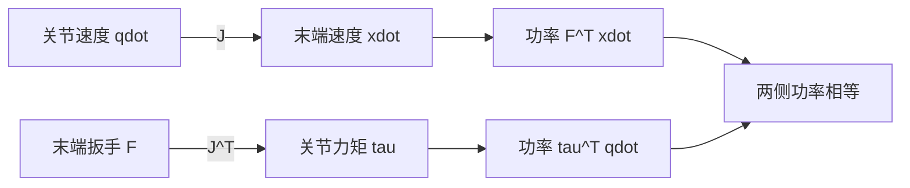

# 机器人静力学、虚功与雅可比转置

> **一句话**：雅可比把关节速度映射成末端速度，它的转置则把末端力映射成关节力矩。这个“转置”不是记忆技巧，而是由虚功与瞬时功率守恒强制决定；它连接了运动学、重力补偿、力控制、接触估计和机构承载能力。

**知识链接**：
- [雅可比矩阵与微分运动学](/前置知识/003b_前置知识_雅可比矩阵与微分运动学)（上游：速度映射）
- [机器人奇异性、速度椭球与可操作度](/前置知识/008b_前置知识_机器人奇异性速度椭球与可操作度)（上游：速度与力能力的方向性）
- [机械臂动力学方程：M、C、g 与关节力矩](/前置知识/008d_前置知识_机械臂动力学方程M_C_g与关节力矩)（上游：动态平衡）
- [惩罚法接触模型：弹簧阻尼与摩擦锥](/前置知识/006d_前置知识_惩罚法接触模型_弹簧阻尼与摩擦锥)（下游：环境接触力如何产生）

---

## 贯穿全文的例子

二关节机械臂的末端水平推墙。腕部力传感器测到一个二维力，电机却只能输出两个关节力矩。问题是：每个关节应承担多少？答案取决于当前构型，因为相同末端力相对肩和肘的力臂不同。

当机械臂改变姿态，末端没有移动，力矩分配也会变化。手臂伸直沿轴向推墙时，机构可能很“能顶”；横向受力时，肩和肘却需要很大力矩。这与[速度椭球](/前置知识/008b_前置知识_机器人奇异性速度椭球与可操作度)恰好形成对偶：容易运动的方向往往不擅长在有限关节力矩下输出大力，难运动的方向反而可能具有较大静态机械优势。



## 一 静力学研究什么

静力学关心零速度、零加速度时的力平衡。机器人保持姿态、夹持物体、推压表面都可能近似静态。此时惯性项和速度耦合项消失，但重力、关节力矩、接触力与摩擦仍然存在。

静态不等于没有力。机械臂水平伸展不动时，肩关节持续输出力矩抵抗重力；夹爪夹住杯子不动时，指尖持续施加法向力，摩擦阻止杯子下滑。静力学的目标正是找出这些“运动为零但内部和外部作用不为零”的平衡关系。

对固定基座机械臂，末端一般承受六维扳手（wrench）：三维力与三维力矩。关节侧是 $n$ 维广义力矩。两个空间维度通常不同，不能靠逐分量相等转换，需要雅可比提供几何关系。

## 二 虚功为何是最短推导

虚位移是满足机构约束的一次任意无穷小位移，不要求它真的随时间发生。若系统静态平衡，所有外力与关节力矩在任何允许虚位移上所做的总虚功必须平衡：

$$
\boldsymbol\tau^T\delta\mathbf q=\mathbf F^T\delta\mathbf x
$$

**这个公式在做什么**：要求关节侧力矩在任意微小关节位移上提供的功，与末端扳手在对应末端位移上提供的功相等。

::: details 📐 公式详解（点击展开）

| 子表达式 | 它是谁 | 它在干嘛 |
|---------|--------|---------|
| $\delta\mathbf q$ | **允许的微小关节变化** | 已经满足关节几何约束，不必显式计算轴承内部约束力 |
| $\delta\mathbf x$ | **对应的末端微小变化** | 由运动学关系决定，不是独立任选 |
| $\boldsymbol\tau^T\delta\mathbf q$ | **关节侧虚功** | 每个关节力矩乘对应角位移后求和 |
| $\mathbf F^T\delta\mathbf x$ | **任务侧虚功** | 力乘平移、力矩乘转角后的总和 |

**用人话读**：“假想机器人沿任意允许方向挪动一点，关节侧付出的微小功必须和末端侧收到的微小功一致。”

**为什么是这个形式**：理想刚性关节的内部约束力不在允许位移上做功，因此无需逐个求出；能量一致性直接把任务空间外力与关节驱动力联系起来。
:::

把虚位移换成真实瞬时速度，同一关系就是功率守恒：$\boldsymbol\tau^T\dot{\mathbf q}=\mathbf F^T\dot{\mathbf x}$。理想齿轮可以用小速度换大力矩，机器人机构也可以在不同方向交换速度能力和受力能力，但不会凭空增加功率。

## 三 为什么一定是 J 的转置

微分运动学给出 $\delta\mathbf x=J\delta\mathbf q$。代回虚功关系后，因为 $\delta\mathbf q$ 可以是任意允许小位移，便得到：

$$
\boldsymbol\tau=J(\mathbf q)^T\mathbf F
$$

**这个公式在做什么**：把作用在末端的任务空间扳手转换为各关节感受到的等效力矩，并自动包含当前构型下所有几何力臂。

::: details 📐 公式详解（点击展开）

| 子表达式 | 它是谁 | 它在干嘛 |
|---------|--------|---------|
| $\mathbf F$ | **末端载荷** | 包含力和力矩，必须与雅可比的速度分量顺序、坐标系一致 |
| $J^T$ | **保持功率的转换器** | 把任务空间载荷投影到每根关节运动轴，得到等效广义力矩 |
| $\boldsymbol\tau$ | **关节承担结果** | 每个电机/关节为了平衡该外载需要承受的力矩 |

**用人话读**：“看末端这股力沿每个关节能造成的瞬时运动方向投影多少，投影结果就是该关节承受的力矩。”

**为什么是这个形式**：速度从关节到末端用 $J$；要求两侧内积也就是功率对任意关节速度都相等时，线性代数唯一给出对偶映射 $J^T$。
:::

转置不是逆。即使雅可比是非方阵或奇异，$J^T\mathbf F$ 仍有定义；它回答“已知这个外力会造成哪些关节力矩”。反问题“已知关节力矩，唯一恢复末端力”则可能无解或多解，需要伪逆、接触假设和传感器模型。

## 四 二连杆数值例子

设两根连杆长度分别为 $1.0$ 米和 $0.8$ 米，肩角 $30°$、肘角 $60°$。此时末端位置雅可比数值约为：第一行 $[-1.3,-0.8]$，第二行 $[0.866,0]$。环境对末端施加力 $[10,-5]^T$ 牛顿，也就是向右十牛、向下五牛。

用雅可比转置映射后，肩关节力矩约为 $-17.33$ 牛米，肘关节力矩约为 $-8.0$ 牛米。肘关节只承担水平力产生的力矩，是因为当前第二根连杆竖直，竖直力的作用线通过肘部，力臂为零；肩部还要承担竖直力相对肩轴的力矩。

| 载荷变化 | 肩力矩趋势 | 肘力矩趋势 | 原因 |
|---|---|---|---|
| 水平力加倍 | 两者对应部分加倍 | 对应部分加倍 | 映射对力是线性的 |
| 仅增加竖直向下力 | 当前构型下肩变化 | 当前构型下肘近似不变 | 竖直力对肘力臂为零 |
| 改变肘角 | 两者都可能变化 | 两者都可能变化 | 雅可比随构型改变 |

这个例子说明 $J^T$ 不是抽象矩阵操作，它就是多关节、多维版本的“力乘力臂”。

## 五 速度椭球与力椭球为什么互为对偶

若限制关节速度范数，$J$ 把单位球映射为速度椭球，其主轴长度是奇异值 $\sigma_i$。若限制关节力矩范数，能输出的末端力椭球在相同主方向上的轴长与 $1/\sigma_i$ 成正比。


> 左图中蓝色速度椭球的长方向，对应橙色力椭球的短方向；机构用速度优势交换力优势。右图显示固定大小的末端力只改变方向，就会显著改变两个关节承担的力矩。

这并不意味着越接近奇异越适合力控制。奇异方向虽然静态机械优势可能很大，但末端位移可控性差、模型误差敏感、结构柔性和关节间隙会占主导，外力也可能形成难以观测的内部载荷。设计构型时应根据任务在速度、力、刚度和鲁棒性之间折中。

## 六 加上重力后的静态平衡

若 $\mathbf F_{\mathrm{ext}}$ 定义为“环境作用在机器人上的扳手”，静止时电机、环境和重力满足：

$$
\boldsymbol\tau+J^T\mathbf F_{\mathrm{ext}}=\mathbf g(\mathbf q)
$$

**这个公式在做什么**：说明保持静止所需的重力力矩由电机和环境接触共同承担；环境托住一部分重量时，电机需要提供的力矩会减少。

::: details 📐 公式详解（点击展开）

| 子表达式 | 它是谁 | 它在干嘛 |
|---------|--------|---------|
| $\boldsymbol\tau$ | **电机支撑份额** | 驱动器主动提供的关节力矩 |
| $J^T\mathbf F_{\mathrm{ext}}$ | **环境支撑或施压份额** | 桌面、墙面或人对机器人施加的力映射到关节侧 |
| $\mathbf g(\mathbf q)$ | **当前总重力账单** | 所有连杆和负载在当前构型下产生的重力力矩 |

**用人话读**：“托住机器人的总重力，可以由电机自己承担，也可以由桌面等环境接触分担，两边加起来必须平衡。”

**为什么是这个形式**：这是完整动力学在速度和加速度为零、忽略摩擦后的特例。环境外力若改定义为“机器人对环境的力”，其符号必须反向。
:::

力控制中经常指定的是“机器人希望施加给环境的力” $\mathbf F_{\mathrm{cmd}}$。根据牛顿第三定律，环境对机器人的反力是 $-\mathbf F_{\mathrm{cmd}}$，于是电机命令常写成重力补偿加 $J^T\mathbf F_{\mathrm{cmd}}$。很多代码符号争论都来自没有写清楚这个方向定义。

## 七 多接触点与分布载荷

如果多个连杆同时接触环境，每个接触点都有自己的雅可比和外力，等效关节力矩是所有 $J_k^T\mathbf F_k$ 的和。足底双接触、人形机器人双手搬箱子都属于这种情况。

已知所有接触力时，求关节力矩只是线性叠加；只知道关节力矩而要反推各接触力时通常不唯一。例如两只脚共同支撑身体，同一总重力可以按很多比例分配。此时还需摩擦锥、压力中心、力传感器或优化准则来选出物理可行解。

内部力是多接触系统的特殊现象：两只手向相反方向挤压物体时，物体净外力可以为零，但关节和物体内部仍承受很大载荷。只看质心加速度无法观察这些力，控制器必须显式建模接触分配。

## 八 从静力学到力控制

单纯发送 $J^T\mathbf F_{\mathrm{cmd}}$ 是开环力前馈，效果依赖模型、接触刚度和实际力传感。真实力控制通常还要加入反馈：

| 控制方式 | 主要目标 | 适用场景 | 风险 |
|---|---|---|---|
| 开环力矩映射 | 近似输出指定力 | 模型准确、柔顺环境 | 摩擦和模型误差直接变成力误差 |
| 闭环力控制 | 跟踪传感器测得的接触力 | 打磨、按压、装配 | 延迟与刚性环境可能引发振荡 |
| 阻抗控制 | 规定力与位姿偏差关系 | 人机协作、未知接触 | 刚度与阻尼需匹配采样率 |
| 混合位置/力控制 | 不同方向分别控位置和力 | 沿表面移动同时保持法向力 | 坐标方向和接触法向估计要稳定 |

静态雅可比转置只给几何映射，不提供稳定性保证。高减速比电机、力矩环带宽、通信延迟、结构柔性和环境刚度都会改变闭环行为。接触瞬间还涉及冲量和速度突变，应阅读[冲量与碰撞响应](/前置知识/007c_前置知识_冲量与碰撞响应)，不能只套静力公式。

## 九 工程计算示例

下面函数要求雅可比和扳手已经表达在同一个坐标系，且六维分量顺序一致。它先检查维度，再做转置映射。真正项目中最重要的不是这一行矩阵乘法，而是调用前的坐标变换和方向约定。

```python
import numpy as np


def joint_torque_from_wrench(jacobian, wrench):
    """把环境作用在机器人的末端扳手映射为关节力矩。"""
    jacobian = np.asarray(jacobian, dtype=float)
    wrench = np.asarray(wrench, dtype=float)
    if jacobian.shape[0] != wrench.shape[0]:
        raise ValueError("Jacobian rows and wrench dimension must match")
    return jacobian.T @ wrench


# 二维位置任务示例：J 的两行对应 [vx, vy]，force 对应 [Fx, Fy]。
J = np.array([[-1.3, -0.8], [0.866, 0.0]])
force_from_environment = np.array([10.0, -5.0])
tau_external = joint_torque_from_wrench(J, force_from_environment)
print(tau_external)  # 约 [-17.33, -8.0] N m
```

六维情况下，如果雅可比排列为“线速度在前、角速度在后”，扳手就必须排列为“力在前、力矩在后”。若雅可比在世界坐标而力传感器数据在工具坐标，必须先用扳手的伴随变换转换；只旋转力而忽略力矩随参考点平移的变化，会产生错误关节力矩。

## 十 常见错误

| 错误 | 表现 | 修正 |
|---|---|---|
| 把 $J^T$ 写成 $J^{-1}$ | 非方阵直接无法计算，物理功率不守恒 | 从虚功重新推导 |
| 机器人对环境力与环境对机器人力混用 | 力控制方向完全相反 | 在变量名中写 `on_robot` / `on_environment` |
| 扳手与雅可比不在同一坐标系 | 构型变化时力矩结果异常 | 做完整扳手坐标变换 |
| 六维分量顺序不一致 | 力被当成力矩或相反 | 对库接口写固定单元测试 |
| 从关节力矩唯一反推多点接触力 | 解不唯一、噪声巨大 | 加接触模型、传感与优化约束 |
| 在冲击阶段使用纯静力学 | 低估峰值载荷 | 使用冲量与接触动力学 |

## 十一 总结

1. 虚功/功率守恒把任务空间与关节空间联系起来，直接推出 $\boldsymbol\tau=J^T\mathbf F$。
2. 雅可比转置不是逆矩阵；它在非方阵和奇异构型下仍能把已知外力映射到关节力矩。
3. 速度椭球与力椭球沿同一奇异向量方向互为倒数，机构用速度能力交换静态力能力。
4. 静态平衡还要加入重力；外力符号取决于“环境对机器人”还是“机器人对环境”的定义。
5. 多接触力反推通常不唯一，需额外的摩擦、接触与传感约束。
6. $J^T$ 只解决几何映射，闭环力控制的稳定性还取决于执行器、延迟、柔性与环境刚度。

## 延伸阅读

- [雅可比矩阵与微分运动学](/前置知识/003b_前置知识_雅可比矩阵与微分运动学) — 从速度侧理解同一个雅可比
- [机器人奇异性、速度椭球与可操作度](/前置知识/008b_前置知识_机器人奇异性速度椭球与可操作度) — 速度与力方向性为什么互为对偶
- [机械臂动力学方程：M、C、g 与关节力矩](/前置知识/008d_前置知识_机械臂动力学方程M_C_g与关节力矩) — 把静力学放回完整动态方程
- [冲量与碰撞响应](/前置知识/007c_前置知识_冲量与碰撞响应) — 接触瞬间为何不能用静态力平衡

