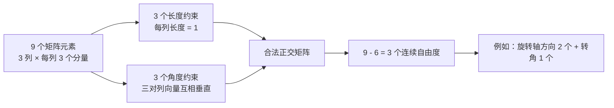

# 线性代数基础：向量、矩阵、自由度与正交性

> **一句话**：向量是“一个箭头”，矩阵是“把箭头变成另一个箭头的规则”；自由度是在所有规则限制下仍能独立选择的参数个数。理解这三句话，就能读懂“旋转矩阵有 9 个数，却只有 3 个自由度”这句看似矛盾的话。

这篇文章专门补齐[三维旋转表示：旋转矩阵、四元数与角速度](/前置知识/006a_前置知识_三维旋转表示_旋转矩阵四元数与角速度)所需要的线性代数基础。你不需要先会证明定理；我们会用“机械臂末端的一根箭头”作为贯穿例子，从画图直觉一路走到公式，再回到数值仿真里的旋转矩阵漂移问题。

## 先建立一张地图

想象机械臂末端夹着一支笔。笔尖相对手腕的方向可以用一根箭头表示；机械臂转动后，这根箭头在世界坐标系里指向改变。我们会按下面顺序理解它：

文中所有“约束”都可以理解成一句检查规则：**你填入的数字必须通过这条检查，才算一个合法对象。**

## 一 向量不是一排数字，而是一根带方向的箭头

### 1.1 同一根箭头可以有不同坐标

在纸面上画一根从原点指向右上方的箭头，它本身是一个几何对象。为了让计算机处理它，我们选一个坐标系，用两个或三个数字记录它在每个坐标轴方向上走了多远。

二维例子中，向量 $\mathbf v=(3,2)$ 表示“向右 3 格、向上 2 格”。三维中，$\mathbf v=(3,2,1)$ 再多一个“向上 1 格”的分量。这里的数字不是三个互不相关的标签，而是同一根箭头在三根坐标轴上的投影长度。

坐标系改变时，数字可能改变，但箭头所代表的物理方向没有改变。例如相机坐标系把“向前”当作 $z$ 轴，而世界坐标系把“向前”写成斜向量；这是同一根箭头的两套坐标描述。机器人学里经常出现的“把 body 向量转换成 world 向量”，本质上就是在做坐标描述的转换。

### 1.2 向量可以相加，也可以被一个数缩放

向量相加就是把两根箭头首尾相接。若 $\mathbf a=(2,1)$、$\mathbf b=(-1,3)$，则 $\mathbf a+\mathbf b=(1,4)$。数乘则是把箭头拉长、缩短，或者反向：$2\mathbf a=(4,2)$，$-\mathbf a=(-2,-1)$。

把若干向量分别乘上数字再相加，叫作**线性组合**。例如，一个平面上的任意箭头都可以由水平单位箭头 $\mathbf e_x=(1,0)$ 和竖直单位箭头 $\mathbf e_y=(0,1)$ 拼出来：

$$
\mathbf v = v_x\mathbf e_x + v_y\mathbf e_y
$$

**这个公式在做什么**：把一根箭头拆成“沿第一个坐标轴走多少”和“沿第二个坐标轴走多少”两部分，再把两部分加回来。

::: details 📐 公式详解（点击展开）

| 子表达式 | 它是谁 | 它在干嘛 |
|---|---|---|
| $\mathbf e_x,\mathbf e_y$ | **两支标准方向箭头** | 分别代表水平和竖直的单位方向 |
| $v_x\mathbf e_x$ | **水平分量** | 沿水平轴走 $v_x$ 个单位 |
| $v_y\mathbf e_y$ | **竖直分量** | 沿竖直轴走 $v_y$ 个单位 |
| $\mathbf v$ | **合成后的箭头** | 两个分量首尾相接后的总位移 |

**用人话读**：“一根箭头等于水平走一段，再竖直走一段。”

**为什么是这个形式**：坐标轴提供了一套不会重复、能覆盖整个平面的基本方向，所以每个向量都能用这些方向的线性组合唯一表示。
:::

这也是“维度”的第一个直觉：平面需要两支互不重复的基本方向，空间需要三支。后文的自由度会在此基础上再加上约束。

## 二 矩阵是把输入箭头变成输出箭头的规则

### 2.1 先把矩阵看成一个变换机器

矩阵常被写成一个数字方格，例如

$$
A=\begin{bmatrix}2&0\\0&3\end{bmatrix}
$$

**这个公式在做什么**：给出一个具体的二维变换规则：水平分量放大 2 倍，竖直分量放大 3 倍。

::: details 📐 公式详解（点击展开）

| 子表达式 | 它是谁 | 它在干嘛 |
|---|---|---|
| $2$ | **水平缩放旋钮** | 决定输入的 $x$ 分量被放大多少 |
| $3$ | **竖直缩放旋钮** | 决定输入的 $y$ 分量被放大多少 |
| $0$ | **不串台的设置** | 表示水平输入不会偷偷变成竖直输出，反之亦然 |
| $A$ | **变换机器的说明书** | 规定所有输入箭头如何被改写 |

**用人话读**：“这台机器把横向长度乘 2，把纵向长度乘 3。”

**为什么是这个形式**：矩阵的每个位置记录一种“输入方向对输出方向的影响”，矩阵乘法把这些影响按规则相加。
:::

把输入向量写成列向量，矩阵作用就是：

$$
\mathbf y=A\mathbf x
$$

**这个公式在做什么**：把输入箭头 $\mathbf x$ 送进变换机器 $A$，得到输出箭头 $\mathbf y$。

::: details 📐 公式详解（点击展开）

| 子表达式 | 它是谁 | 它在干嘛 |
|---|---|---|
| $\mathbf x$ | **输入箭头** | 变换发生前的方向和长度 |
| $A$ | **变换规则** | 规定输入的每个分量如何贡献到输出 |
| $A\mathbf x$ | **执行动作** | 按行做加权求和 |
| $\mathbf y$ | **输出箭头** | 变换之后的结果 |

**用人话读**：“把输入箭头交给规则 $A$，规则处理后吐出新的箭头。”

**为什么是这个形式**：矩阵乘法正好能表达“每个输出坐标都是输入坐标的加权和”，这类保持加法和数乘结构的变换叫线性变换。
:::

例如 $\mathbf x=(1,2)^T$ 时，$A\mathbf x=(2,6)^T$。箭头的方向没有被旋转，但横向和竖向被不同程度地拉伸，原来的圆会变成椭圆。

### 2.2 矩阵的列就是“基本箭头被送到哪里”

设 $A=[\mathbf a_1\ \mathbf a_2]$，输入 $\mathbf x=(x_1,x_2)^T$。矩阵乘法可以改写成：

$$
A\mathbf x=x_1\mathbf a_1+x_2\mathbf a_2
$$

**这个公式在做什么**：说明矩阵作用于任意输入时，本质是把矩阵的各列按输入坐标加权后相加。

::: details 📐 公式详解（点击展开）

| 子表达式 | 它是谁 | 它在干嘛 |
|---|---|---|
| $\mathbf a_1,\mathbf a_2$ | **两根输出基向量** | 分别是 $A$ 作用在第一、第二根标准方向箭头后的结果 |
| $x_1\mathbf a_1$ | **第一路贡献** | 输入的第一个坐标决定第一列贡献多少 |
| $x_2\mathbf a_2$ | **第二路贡献** | 输入的第二个坐标决定第二列贡献多少 |
| $A\mathbf x$ | **总输出** | 两路贡献相加得到最终箭头 |

**用人话读**：“矩阵先告诉你两根基本箭头会变成什么样，再按输入中的两个数字把它们混合起来。”

**为什么是这个形式**：矩阵乘法的分配律保证了对所有输入都能按列线性组合，因此只要知道矩阵的列，就知道整台变换机器。
:::

旋转矩阵正是这个观点的三维版本：它的第一列是物体 $x$ 轴在世界中的方向，第二列是物体 $y$ 轴，第三列是物体 $z$ 轴。

## 三 线性无关：几根箭头没有互相重复

如果一根箭头能由另外几根箭头拼出来，它就没有提供新的方向信息。例如二维中 $(2,0)$ 和 $(1,0)$ 都在同一条水平线上，第二根只是第一根的缩放版本。它们不能一起覆盖平面，因此叫作**线性相关**。

反过来，水平和竖直两根箭头无法互相拼出，必须分别保留；它们是**线性无关**的。严格写法是：只有当所有系数都为零时，线性组合才可能得到零向量：

$$
c_1\mathbf v_1+c_2\mathbf v_2+\cdots+c_k\mathbf v_k=\mathbf 0
\quad\Longrightarrow\quad
c_1=c_2=\cdots=c_k=0
$$

**这个公式在做什么**：用“能不能用非零系数拼出零箭头”来检查一组向量是否重复。

::: details 📐 公式详解（点击展开）

| 子表达式 | 它是谁 | 它在干嘛 |
|---|---|---|
| $c_i\mathbf v_i$ | **第 $i$ 根箭头的带权版本** | 允许把某根箭头放大、缩小或反向 |
| $\sum_i c_i\mathbf v_i$ | **所有箭头的合成** | 看它们能否互相抵消 |
| $\mathbf0$ | **零箭头** | 没有方向、长度为零的结果 |
| “只有全零系数” | **不重复条件** | 不存在偷偷抵消的非平凡组合 |

**用人话读**：“如果几根箭头只有把每根都关掉才能互相抵消，它们就没有重复方向。”

**为什么是这个形式**：线性无关向量提供独立的方向信息；它们的数量决定一个空间至少需要多少个独立坐标。
:::

在三维空间，最多只能找到三根彼此独立的方向。第四根三维向量一定可以由前三根的线性组合表示，这不是“技巧不够”，而是空间维度已经用完了。

## 四 维度与自由度到底是什么意思

### 4.1 维度是“需要几个独立数字才能定位”

一条直线上的点只需一个数字（沿直线走多远）；一张平面上的点需两个数字（横坐标和纵坐标）；房间里的点需三个数字（长、宽、高）。这里的 1、2、3 就是空间的维度。

**自由度（degree of freedom, DOF）**问的是另一个但很接近的问题：一个系统在遵守规定后，还能独立改变几件事？

- 一个抽屉沿导轨只能前后移动：1 个自由度。
- 一张纸上的小方块可以平移和旋转：$x$、$y$、朝向角，共 3 个自由度。
- 空间中一个刚体可以沿 $x,y,z$ 平移，再绕三个轴转动：共 6 个自由度。

注意“参数个数”和“自由度”不是一回事。用三个数字描述一个点，通常三个数字都能独立改；用四个数字描述一个单位四元数，其中一个长度条件会限制它们，连续自由度仍是 3。

### 4.2 约束就是必须满足的检查规则

圆上的点看起来有两个坐标 $(x,y)$，但它必须满足“到圆心距离等于半径”。单位圆的规则是：

$$
x^2+y^2=1
$$

**这个公式在做什么**：把平面上的无限多个点筛选成圆周上的点；任意一个坐标改变，都可能需要另一个坐标配合调整。

::: details 📐 公式详解（点击展开）

| 子表达式 | 它是谁 | 它在干嘛 |
|---|---|---|
| $x^2+y^2$ | **点到原点距离的平方** | 用勾股关系计算箭头长度的平方 |
| $1$ | **目标半径的平方** | 规定这根箭头必须长 1 |
| 等号 | **约束检查** | 不满足等号的点不在单位圆上 |

**用人话读**：“横坐标和竖坐标不能随便填，它们的平方加起来必须刚好等于 1。”

**为什么是这个形式**：平面坐标的长度由勾股定理给出；固定长度会把二维平面压成一条一维曲线，所以单位圆有 1 个自由度。
:::

因此，粗略地说：**自由度 = 表面上可填写的变量数 - 独立约束数**。这个数数规则要小心使用：约束必须真正独立，重复写同一条规则不能重复扣除自由度。

$$
\mathrm{DOF}=\text{变量个数}-\text{独立约束个数}
$$

**这个公式在做什么**：给出“还有多少个数字可以独立选择”的第一版计算方法。

::: details 📐 公式详解（点击展开）

| 子表达式 | 它是谁 | 它在干嘛 |
|---|---|---|
| 变量个数 | **草稿上的数字格子** | 先不管是否合法，数一共有多少个可填写位置 |
| 独立约束个数 | **互不重复的检查规则** | 每条规则去掉一条可独立变化的方向 |
| DOF | **真正能自由调节的旋钮数** | 遵守所有规则后剩下的连续选择数 |

**用人话读**：“先数有多少个旋钮，再扣掉互不重复的限制，剩下的就是自由度。”

**为什么是这个形式**：一条独立等式通常会消灭一个局部变化方向；如果两条约束其实是同一件事，就只能扣一次。
:::

## 五 内积、长度和垂直：正交性的语言

### 5.1 内积是在问“两个箭头有多同向”

两个二维向量 $\mathbf u=(u_x,u_y)$、$\mathbf v=(v_x,v_y)$ 的内积，就是对应分量相乘后相加：

$$
\mathbf u^T\mathbf v=u_xv_x+u_yv_y
$$

**这个公式在做什么**：把两个箭头的方向关系压缩成一个数字，正数表示大体同向，负数表示大体反向，零表示垂直。

::: details 📐 公式详解（点击展开）

| 子表达式 | 它是谁 | 它在干嘛 |
|---|---|---|
| $u_xv_x$、$u_yv_y$ | **逐轴合作程度** | 看两个箭头在每个坐标轴上是否朝同一方向 |
| 求和 | **总方向关系** | 把各坐标轴的贡献合成一个数字 |
| $\mathbf u^T\mathbf v$ | **同向程度分数** | 不需要画角度，也能判断方向关系 |

**用人话读**：“两个箭头在每个轴上的分量分别相乘，再把结果加起来；加起来为零就是互相垂直。”

**为什么是这个形式**：内积既能从坐标计算，也满足旋转后保持不变的几何性质，是长度和角度计算的共同基础。
:::

### 5.2 长度是向量和自己的内积开平方

$$
\lVert\mathbf v\rVert=\sqrt{\mathbf v^T\mathbf v}
$$

**这个公式在做什么**：计算箭头从起点到终点的实际长度。

::: details 📐 公式详解（点击展开）

| 子表达式 | 它是谁 | 它在干嘛 |
|---|---|---|
| $\mathbf v^T\mathbf v$ | **长度平方** | 把各分量平方后相加，避免先开平方 |
| $\sqrt{\cdot}$ | **恢复长度** | 把长度平方变回长度 |
| $\lVert\mathbf v\rVert$ | **箭头尺子** | 衡量向量到底有多长 |

**用人话读**：“用勾股定理算出这根箭头的长度。”

**为什么是这个形式**：内积与自身结合正好得到平方长度，三维中就是熟悉的 $x^2+y^2+z^2$。
:::

两个非零向量内积为零，就称它们**正交**。坐标系的三根单位轴既要长度为 1，又要两两正交；这正是旋转矩阵列向量必须满足的几何条件。

## 六 正交矩阵：不拉伸、不剪切的坐标变换

一个矩阵叫正交矩阵，直觉上表示“变换前后长度和夹角都不变”。它可以旋转、也可以包含镜像反射，但不会把圆拉成椭圆，不会把直角变成斜角。

它的紧凑写法是：

$$
Q^TQ=I
$$

**这个公式在做什么**：检查矩阵 $Q$ 的列向量是否构成一组“单位且互相垂直”的新坐标轴。

::: details 📐 公式详解（点击展开）

| 子表达式 | 它是谁 | 它在干嘛 |
|---|---|---|
| $Q^T$ | **把列向量拿来做内积的工具** | 转置后，矩阵乘法的每个元素就是两列向量的内积 |
| $Q^TQ$ | **几何体检报告** | 同时检查所有列之间的长度和夹角 |
| $I$ | **合格标准** | 对角线为 1、非对角线为 0，代表单位长度和互相垂直 |

**用人话读**：“把每根新坐标轴和每根轴做内积，自己和自己得到 1，和别人得到 0，才算合格。”

**为什么是这个形式**：矩阵乘法把“列与列的内积”一次性排成表格，所以一条矩阵等式可以同时表达多条几何检查。
:::

设 $Q$ 的三列是 $\mathbf q_1,\mathbf q_2,\mathbf q_3$。把 $Q^TQ=I$ 展开，得到的不是神秘的 9 条新规则，而是下面 6 条互不重复的条件：

1. 三根轴各自是单位长度：$\mathbf q_1^T\mathbf q_1=1$、$\mathbf q_2^T\mathbf q_2=1$、$\mathbf q_3^T\mathbf q_3=1$。
2. 三对轴互相垂直：$\mathbf q_1^T\mathbf q_2=0$、$\mathbf q_1^T\mathbf q_3=0$、$\mathbf q_2^T\mathbf q_3=0$。

矩阵左下角那些“对称位置”的元素不会再提供新的条件，因为 $\mathbf q_i^T\mathbf q_j$ 和 $\mathbf q_j^T\mathbf q_i$ 是同一个数。于是 3 个长度条件 + 3 个夹角条件 = 6 个独立约束。

## 七 回到旋转矩阵：9 个格子为什么只剩 3 个自由度

三维旋转矩阵 $R$ 有 $3\times3=9$ 个表面数字。把它的列看成物体坐标系的三根轴：

所以“9 个数但只有 3 个自由度”的意思不是说矩阵里藏着一个魔法压缩，而是说：**9 个格子必须一起填，不能任意独立修改；通过 6 条几何检查后，剩下的姿态变化只有 3 个方向。**

另一种数法是轴角表示：旋转轴是一个单位三维向量，本身有 2 个自由度；再加一个旋转角度，共 3 个。欧拉角也是 3 个数字，但它会遇到万向锁；四元数用 4 个数字加 1 个单位长度约束，也留下 3 个连续自由度。

### 7.1 行列式为什么要等于正一

仅有 $R^TR=I$ 还不够，因为镜像反射也能保持长度和角度。区分纯旋转与“翻到镜子里”的反射，需要再检查行列式：合法旋转满足 $\det(R)=+1$，反射通常满足 $\det(R)=-1$。

这里的 $+1$ 是一个**离散选择**，不是又扣掉一个连续自由度。可以把它想成先从“旋转或反射”两类中选对类别，再在旋转这一类里连续改变三个角度。

## 八 为什么仿真更新后会漂移

### 8.1 理想世界里的微小更新

角速度决定姿态变化速度。令 $\Omega=[\boldsymbol\omega]_\times$ 为由角速度组成的反对称矩阵，最简单的显式 Euler 更新写成：

$$
R_{\text{new}}=R+\Delta t\,\Omega R
$$

**这个公式在做什么**：用当前瞬间的角速度，估计经过一个很小时间步后旋转矩阵会变成什么样。

::: details 📐 公式详解（点击展开）

| 子表达式 | 它是谁 | 它在干嘛 |
|---|---|---|
| $R$ | **当前姿态快照** | 记录此刻三根物体坐标轴的方向 |
| $\Omega R$ | **姿态变化方向** | 按角速度让每根轴产生切向变化 |
| $\Delta t$ | **这一小步的时长** | 把“每秒变化多少”换成“这一步变化多少” |
| $R+\Delta t\Omega R$ | **一步近似结果** | 用直线近似真实的曲线运动 |

**用人话读**：“沿着当前旋转的切线方向走一小步，得到下一帧姿态的估计。”

**为什么会有问题**：真实旋转沿着正交矩阵的曲面运动，而加法是在 9 维平直空间里走直线；直线的一小步通常会离开这个曲面。
:::

单步误差可能小到看不出来，但仿真会重复数千、数百万次。浮点数还会引入舍入误差，于是三根列向量慢慢出现两种症状：长度不再恰好是 1，或者两根轴的内积不再恰好是 0。此时它表示的已经不是严格的刚体旋转，而是带有轻微缩放、剪切的“变形”。

> 左图看正交误差：直接 Euler 更新会持续增大，QR/SVD 修正和指数更新保持在很小范围。右图看第一根坐标轴的端点：合法旋转应在单位圆上，未修正的 Euler 轨迹会向外螺旋。

### 8.2 把矩阵重新投影回合法集合

工程上常用 QR 或 SVD 做“重新正交化”。SVD 把一个漂移矩阵拆成三个部分，再取离它最近的正交矩阵：

$$
A=U\Sigma V^T,
\qquad
R_{\text{proj}}=U\,\operatorname{diag}(1,1,\det(UV^T))\,V^T
$$

**这个公式在做什么**：先分解近似矩阵 $A$，再把缩放部分 $\Sigma$ 去掉，得到一个行列式为正一的合法旋转矩阵。

::: details 📐 公式详解（点击展开）

| 子表达式 | 它是谁 | 它在干嘛 |
|---|---|---|
| $U,V$ | **两套正交坐标框架** | 记录输入矩阵的主要方向变化 |
| $\Sigma$ | **伸缩账单** | 记录各方向被拉长或缩短了多少 |
| $\operatorname{diag}(1,1,\det(UV^T))$ | **去反射开关** | 保留两个方向，并在必要时翻转最后一个方向，保证行列式为 $+1$ |
| $R_{\text{proj}}$ | **修正后的姿态** | 只保留旋转部分，丢掉缩放和剪切误差 |

**用人话读**：“把矩阵里偷偷混进来的拉伸和镜像拿掉，只留下最接近原矩阵的纯旋转。”

**为什么是这个形式**：SVD 给出了正交方向与伸缩量的分离；把伸缩量换成全 1，就得到 Frobenius 范数意义下最接近的正交矩阵。额外的行列式符号用于排除镜像反射。
:::

重新正交化不是“修复物理规律”，而是把数值误差投影掉。它有额外计算成本，还要处理符号和坐标约定，所以姿态内部状态常改用四元数：四元数只需把四个数除以自身长度，就能恢复单位长度约束。具体的四元数更新、归一化和与旋转矩阵的转换见[三维旋转表示](/前置知识/006a_前置知识_三维旋转表示_旋转矩阵四元数与角速度)。

## 九 读机器人公式时的“翻译器”

以后再遇到类似文字，可以按这张表逐句翻译：

| 看到的术语 | 先翻译成什么 | 在旋转问题中的对应物 |
|---|---|---|
| 向量 | 一根带方向和长度的箭头 | 一根物体坐标轴或速度箭头 |
| 矩阵 | 改变箭头的规则 | 把 body 坐标转换到 world 坐标 |
| 转置 $A^T$ | 把行列交换，常用来做内积 | 检查列向量之间的长度和夹角 |
| 内积 | 两根箭头有多同向 | 为零表示垂直 |
| 范数 | 箭头有多长 | 检查坐标轴是否是单位长度 |
| 线性无关 | 没有重复方向 | 三根坐标轴提供三个独立方向 |
| 自由度 | 还能独立调几个旋钮 | 三维刚体朝向有 3 个连续旋钮 |
| 约束 | 必须通过的检查规则 | 长度为 1、两两垂直、行列式为正一 |
| 正交矩阵 | 不改变长度和角度的变换 | 合法旋转或反射 |

最重要的阅读习惯是先问“这些数字分别代表什么几何对象”，再问“它们必须满足哪些检查规则”。一旦把旋转矩阵的三列看成三根坐标轴，“9 个数、6 个约束、3 个自由度”就不再是一句需要死记的口号。

## 十 小练习：确认自己真的懂了

### 练习 1：单位圆有几个自由度

平面点有两个坐标，但受到一个独立约束 $x^2+y^2=1$，所以圆周局部只有 1 个自由度。你可以选一个角度决定点在哪里；选定后，$x$ 和 $y$ 不能再各自随便改。

### 练习 2：为什么旋转不能用三个任意数字填

“三个自由度”只表示合法旋转附近有三个独立变化方向，不表示把任意三个数字塞进矩阵就能得到旋转。矩阵的 9 个位置仍需共同满足正交约束；如果想直接用三个数字，应该使用轴角、欧拉角等专门参数化，而不是随便挑三格。

### 练习 3：看到 $R^TR=I$ 该检查什么

把 $R$ 的三列分别记为三根轴：先检查每根长度是不是 1，再检查三对轴的内积是不是 0，最后检查 $\det(R)$ 是否为 $+1$。前六个检查保证“正交”，最后一个检查保证“不是镜像”。

## 总结

1. 向量是箭头；矩阵是变换箭头的规则，矩阵的列告诉你基本方向被送到哪里。
2. 维度和自由度都在数“独立变化的方向”，但自由度还要扣除约束。
3. 内积为零表示垂直，向量和自己的内积开平方得到长度。
4. $R^TR=I$ 展开后给出三条单位长度条件和三条互相垂直条件，共 6 个独立约束。
5. 旋转矩阵表面有 9 个元素，扣掉 6 条连续约束后只剩 3 个连续自由度；$\det(R)=+1$ 只是排除离散的镜像分支，不再扣一个自由度。
6. 显式 Euler 更新会让矩阵离开合法旋转集合；QR/SVD 投影或四元数归一化可以把数值状态拉回合法集合。

掌握这些基础后，再回读[三维旋转表示](/前置知识/006a_前置知识_三维旋转表示_旋转矩阵四元数与角速度)的旋转矩阵、四元数和角速度公式，会发现它们都只是在用不同工具描述同一件事：**一个刚体的三根互相垂直、长度固定的坐标轴，如何随时间改变方向。**
