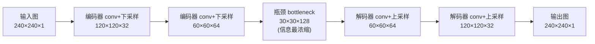
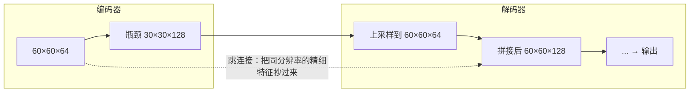

# 编码器-解码器架构（Encoder-Decoder）

> 一句话概括：编码器-解码器是一种"先压缩再还原"的神经网络骨架——编码器把输入一步步压成一个信息浓缩的中间表示，解码器再把这个表示一步步还原成想要的输出。当输入和输出都是"结构化的大对象"（一张图、一句话、一段深度图）时，几乎都用这套骨架。

**相关阅读**：
- [Cross-Attention 与交替注意力机制](/前置知识/001e_前置知识_Cross_Attention与交替注意力机制) — Transformer 里编码器和解码器如何通过 cross-attention 交换信息
- [向量量化与离散表示学习](/前置知识/001q_前置知识_向量量化与离散表示学习) — 编码器压出的"中间表示"如何进一步离散化
- [卷积神经网络基础的残差连接](/论文综述/109_Fixup_Initialization无需归一化层的残差网络初始化) — 本文解码器/编码器常用 ResNet 残差块作为基本单元

---

## 贯穿全文的例子

> **场景**：我们要训练一个网络，输入一张 $240\times240$ 的灰度照片（比如一张"某个物体压在软垫上的照片"），输出一张同样 $240\times240$ 的图，每个像素上写的是"这个位置被压进去多深"。输入和输出都是一整张图，尺寸还一样——这类"图进图出"的任务，就是编码器-解码器最典型的用武之地。下面每讲一个部件，都回到这个"照片 → 深度图"的例子。

---

## 一、先说清楚它要解决什么问题

考虑上面的例子：输入是一张 $240\times240=57600$ 个像素的图，输出也是 $57600$ 个数。一个最朴素的想法是"把输入拉平成一个长向量，接几层全连接层，输出再拉成一张图"。这个想法有两个致命问题：

1. **参数爆炸**：一层全连接把 57600 个输入连到 57600 个输出，光这一层就是 $57600\times57600\approx 3.3\times10^9$ 个参数，根本训不动。
2. **丢掉了空间结构**：图像相邻像素强相关（一个压痕是连成一片的），拉平成向量后这种"谁挨着谁"的信息全没了。

编码器-解码器用两个设计一次性解决这两点：**用卷积代替全连接**（局部连接 + 权重共享，参数量骤降且保留空间结构）；**用"先降维再升维"的沙漏形状**（先把图压小、把语义抽出来，再把语义铺回一张大图）。这个沙漏形状就是"编码器-解码器"这个名字的由来。

> 看这张图的关键：分辨率（空间尺寸）从左到右先减半、减半、到瓶颈处最小，再翻倍、翻倍还原；而通道数（每个位置的特征维度）正好相反，先变多再变少。空间越小、通道越多的地方，网络"理解得越抽象"。

---

## 二、编码器：把"看到了什么"一层层抽出来

**编码器（encoder）在系统里的位置和职责**：它是整条流水线的前半段，唯一的任务是把高分辨率、低语义的原始输入（一张只有亮度值的图），转换成低分辨率、高语义的特征表示（"这里有个圆形压痕、边缘在这、中心在那"）。

它靠重复"卷积 + 下采样"这一个动作组合来做到这件事：

- **卷积（convolution）**：用一个小窗口（比如 $3\times3$）在整张图上滑动，每个位置算一个加权和，得到一张"特征图"。同一个窗口的权重在所有位置共享，所以参数少；每个输出只看局部邻域，所以保留空间结构。多个不同的窗口（卷积核）并行作用，就得到多个通道，每个通道负责检测一种模式（边缘、拐角、纹理……）。
- **下采样（downsampling）**：每隔几层把空间尺寸减半（用步长为 2 的卷积或池化）。减半有两个作用：一是让后面的卷积窗口在原图上"看得更宽"（同样 $3\times3$ 的窗口，在缩小一半的图上覆盖原图两倍的范围，即感受野变大）；二是逼着网络扔掉冗余细节、只保留重要语义。

在我们的例子里，编码器把 $240\times240\times1$ 的原图，经过几轮卷积下采样，压成 $30\times30\times128$ 的特征——空间小了 64 倍，但每个位置的语义信息（用 128 个通道表达）丰富了很多。这个最浓缩的中间结果叫**瓶颈（bottleneck）**，是整个网络对"输入到底是什么"理解得最抽象的地方。

---

## 三、解码器：把抽象语义还原成一张完整的输出图

**解码器（decoder）在系统里的位置和职责**：它是流水线后半段，任务和编码器正好相反——把瓶颈处那个"小而抽象"的特征，一步步还原成"大而具体"的输出图。编码器在做"理解"，解码器在做"生成"。

它靠重复"卷积 + 上采样"来做到：

- **上采样（upsampling）**：把空间尺寸翻倍，常用的两种方式是转置卷积（transposed convolution，一种可学习的"放大"操作）或者双线性插值再接卷积。每翻倍一次，特征图就"长大一圈"，逐渐逼近目标输出的分辨率。
- **卷积**：每次放大后再用卷积细化——放大本身只是把像素铺开，卷积负责在铺开的画布上"填进合理的细节"。

在我们的例子里，解码器把 $30\times30\times128$ 的瓶颈特征，经过几轮上采样卷积，还原成 $240\times240\times1$——最后一层输出单通道，每个像素上就是一个深度值。因为这个任务是"输出连续的深度数值"而不是"输出类别标签"，最后一层不接 softmax，直接输出实数。

---

## 四、跳连接：解决"压缩时丢掉的细节还原不回来"

**这一节要解决的问题**：编码器为了抽语义把图压小，压小的过程必然丢掉精细的空间细节（压痕边缘到底在第几个像素）。解码器光靠瓶颈那个 $30\times30$ 的粗糙特征，是还原不出锐利边缘的——输出会糊成一团。

**跳连接（skip connection）的做法**：把编码器某一层的特征图，直接"抄近路"接到解码器对应分辨率的那一层，和解码器上采样出来的特征拼在一起。这样解码器在还原每一层时，既有来自瓶颈的"高层语义"（这是个圆形压痕），又有来自编码器同层的"精细位置"（边缘的确切像素位置）。这种带跳连接的编码器-解码器就是大名鼎鼎的 **U-Net**（因为把编码器画在左边、解码器画在右边、跳连接横着连，整体形状像字母 U）。

> 虚线就是跳连接。它把编码器 $60\times60$ 那层的精细特征，直接送给解码器 $60\times60$ 那层拼接——解码器因此不必"凭空想象"边缘在哪，而是直接拿到编码器还没压糊时记下的位置信息。

需要说明的是：跳连接不是编码器-解码器的**必需**部件。最基础的编码器-解码器可以没有跳连接（纯沙漏形）；但对"输出要和输入像素级对齐"的任务（如深度图预测、图像分割），跳连接几乎是标配，因为它是保住输出锐利度的关键。

---

## 五、图像到图像任务怎么训练：逐像素回归损失

**这一节要解决的问题**：我们有一堆配对数据 $\{(\text{输入图},\ \text{标准答案图})\}$，怎么定义"网络输出得好不好"，好让梯度下降去优化它？

对"图进图出、且输出是连续数值"的任务（例子里的深度图预测就是），最自然的损失是**逐像素均方误差（pixel-wise Mean Squared Error, MSE）**：把网络输出图和标准答案图逐个像素相减、平方，再对所有像素求平均。

$$
\mathcal{L}_{\text{MSE}} = \frac{1}{HW}\sum_{u=1}^{H}\sum_{v=1}^{W}\big(\hat{M}(u,v) - M_{gt}(u,v)\big)^2
$$

**这个公式在做什么**：把预测图和真值图放在一起，一个像素一个像素地比"你猜的深度和真实深度差多少"，差得越多罚得越重（平方放大大误差），最后对整张图所有像素取平均，得到一个标量损失。

::: details 📐 公式详解（点击展开）

| 子表达式 | 它是谁 | 它在干嘛 |
|---------|--------|---------|
| $\hat{M}(u,v)$ | **网络的猜测** | 解码器输出图在像素 $(u,v)$ 处预测的数值（如深度） |
| $M_{gt}(u,v)$ | **标准答案** | 配对数据里这张图在 $(u,v)$ 处的真实数值 |
| $\hat{M}-M_{gt}$ | **单像素误差** | 这个像素猜错了多少（有正负） |
| $(\cdot)^2$ | **平方惩罚** | 去掉正负号，并且让大误差被放得更大（差 2 罚 4，差 4 罚 16） |
| $\frac{1}{HW}\sum\sum$ | **全图平均** | 对全部 $H\times W$ 个像素的误差取平均，得到一个可求梯度的标量 |

**用人话读**："把两张图叠在一起，逐个像素量差距、平方、再求平均——这个平均差距就是要最小化的 loss。"

**为什么用平方而不是绝对值**：平方对大误差惩罚更狠（把"差得离谱"的像素优先拉回来），且处处可导、优化性质好。如果任务里少数几个像素的巨大误差不该主导训练，也可以换成绝对值误差（L1）或 Huber 损失——这属于损失函数选型，不影响编码器-解码器骨架本身。
:::

训练时把这个标量 loss 对网络所有参数求梯度、反向传播、更新权重，重复百万次，网络就学会了"给定这种输入图，该输出什么样的图"。期望 $\sum$ 在实际训练里是对一个 mini-batch 的若干张图先各自算逐像素 MSE、再对 batch 取平均。

---

## 六、和其他架构的关系：什么时候用它、什么时候不用

编码器-解码器不是万能骨架，它专门服务于"输入输出都是结构化大对象"的任务。快速对照：

| 任务形态 | 典型例子 | 该不该用编码器-解码器 |
|---------|---------|----------------------|
| 图 → 同尺寸图 | 深度预测、图像分割、去噪、图像翻译 | ✅ 最典型用途（常加跳连接=U-Net） |
| 图 → 少数几个数 | 分类（图→类别）、回归（图→力向量） | ❌ 只需编码器 + 一个小输出头，不需要解码器还原成图 |
| 序列 → 序列 | 机器翻译、语音识别 | ✅ 用 Transformer 版的编码器-解码器（靠 [cross-attention](/前置知识/001e_前置知识_Cross_Attention与交替注意力机制) 交换信息） |
| 噪声 → 图 | 扩散模型生成 | ✅ 去噪网络常用 U-Net 形态的编码器-解码器 |

一个关键区分：**如果输出是"一整张图"，才需要解码器把语义还原成图**；如果输出只是"几个数"（一个类别、一个力向量），那么只用编码器把图压成特征、再接一个小小的全连接输出头就够了，根本不需要解码器。这个区分在实践中经常出现——同一个 ResNet 编码器，接不同的头就能做完全不同的任务：接解码器做"图→图"，接一个输出 3 个数的全连接层做"图→三维力向量的回归"。

---

## 七、总结

| 部件 | 职责 | 一句话 |
|------|------|--------|
| 编码器 | 压缩 + 抽语义 | 图越变越小、通道越变越多，"理解"输入 |
| 瓶颈 | 最浓缩表示 | 网络对输入理解最抽象的地方 |
| 解码器 | 还原成输出图 | 图越变越大、通道越变越少，"生成"输出 |
| 跳连接 | 补回精细细节 | 把编码器同分辨率特征抄给解码器，保住锐利度（U-Net） |
| 逐像素 MSE | 训练目标 | 逐像素比差距、平方、平均 |

记住一句话：**编码器负责"读懂"，解码器负责"画出"，跳连接负责"别画糊"，逐像素损失负责"画得像"。**

---

## 延伸阅读

- [Cross-Attention 与交替注意力机制](/前置知识/001e_前置知识_Cross_Attention与交替注意力机制) — Transformer 编码器-解码器如何交换信息
- [IoU 交并比](/前置知识/009b_前置知识_IoU交并比) — 评估"图→图"任务（尤其分割/掩码）输出质量的常用指标
- [Fixup Initialization：无需归一化层的残差网络初始化](/论文综述/109_Fixup_Initialization无需归一化层的残差网络初始化) — 编码器/解码器常用的 ResNet 残差块细节
